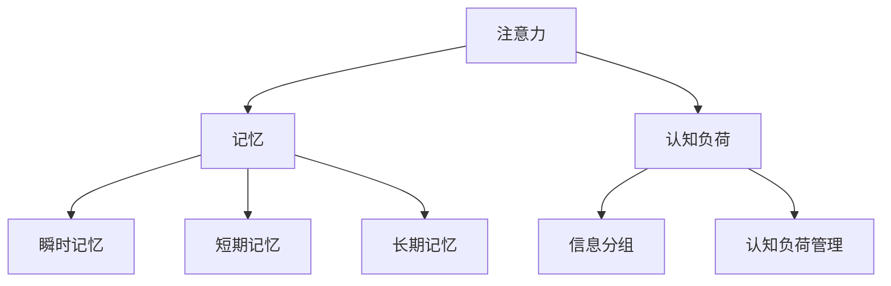

                 

### 摘要

本文旨在探讨提示词设计在认知心理学基础上的应用与实践。提示词作为用户交互的重要组成部分，其设计质量直接影响用户体验。本文首先介绍了提示词的定义及其在认知心理学中的重要性。接着，本文详细阐述了注意力、记忆、认知负荷等认知心理学基本概念，并分析了这些概念与提示词设计之间的联系。随后，本文提出了基于认知心理学的提示词设计原则，包括用户中心设计、注意力原则、记忆原则和决策原则。此外，本文还探讨了不同类型的提示词，如情感提示词、情境提示词和功能提示词的设计技巧。最后，通过具体案例和实战项目，本文展示了如何将认知心理学原理应用于实际提示词设计中，并对未来的发展趋势进行了展望。本文的目标是为从事用户体验设计和认知心理学研究的读者提供一个全面的参考。

---

### 引言

在当今快速发展的数字时代，用户界面设计和交互体验成为产品成功的关键因素。而提示词，作为用户与系统之间沟通的桥梁，其设计质量直接影响到用户的使用体验。提示词（Prompt）是指在交互过程中向用户提供的引导性信息，旨在帮助用户理解操作步骤、完成任务或获得相关信息。一个优秀的提示词不仅需要简洁明了，还要能够有效引导用户，提高用户操作的效率和满意度。

认知心理学作为研究人类认知过程和心理现象的科学，其理论和方法在提示词设计中具有重要应用价值。认知心理学关注人类如何获取、处理、存储和利用信息，探讨注意力、记忆、认知负荷等核心问题。这些认知过程直接影响用户对提示词的理解和反应。因此，将认知心理学的理论应用于提示词设计，有助于提高设计的科学性和有效性。

本文将围绕“提示词设计的认知心理学基础探索”这一主题，从以下几个方面展开讨论：

1. **核心概念与联系**：首先介绍提示词的定义及其在认知心理学中的重要性，并阐述注意力、记忆、认知负荷等核心概念与提示词设计之间的关系。
2. **设计原则**：提出基于认知心理学的提示词设计原则，包括用户中心设计、注意力原则、记忆原则和决策原则。
3. **设计方法**：探讨不同类型提示词的设计方法，如情感提示词、情境提示词和功能提示词的设计技巧。
4. **案例分析**：通过具体案例，展示如何将认知心理学原理应用于实际提示词设计中，并分析设计效果。
5. **项目实战**：介绍一个实际项目，详细讲解从需求分析到设计实现的整个过程，包括环境搭建、代码实现、解析和项目小结。
6. **未来趋势**：探讨提示词设计的未来发展趋势，以及认知心理学在这一领域中的潜在应用。

本文旨在为从事用户体验设计和认知心理学研究的读者提供一个全面而深入的参考，帮助设计师更好地理解用户心理，设计出更符合用户需求的提示词。

---

### 核心概念与联系

在探讨提示词设计的认知心理学基础时，我们需要首先明确几个核心概念，并分析它们与提示词设计之间的联系。

#### 1. 注意力

注意力是认知过程中的核心要素，决定了用户对信息的接收和处理。在提示词设计中，注意力的分配直接影响用户对提示信息的感知和理解。根据认知心理学的理论，注意力可以分为选择性注意力、分配性注意力和执行性注意力：

- **选择性注意力**：用户在有多个刺激源的情况下，会根据自己的需求选择关注某些刺激，而忽略其他无关刺激。在设计提示词时，需要确保提示信息在视觉和语义上能够吸引用户的注意力。
- **分配性注意力**：当用户需要同时处理多个任务时，需要分配注意力资源，这要求提示词设计要简洁明了，避免信息过载。例如，在一个多步骤的操作流程中，每一步的提示词应该独立且易于理解，以便用户能够集中精力完成当前任务。
- **执行性注意力**：用户在执行具体操作时，需要保持高水平的注意力集中。提示词设计需要引导用户进行正确的操作，同时避免分心。例如，在输入敏感信息时，可以提供实时提示，确保用户不会犯错。

#### 2. 记忆

记忆是认知心理学中的另一个重要概念，它直接影响用户对提示词的长期保留和再认。根据认知心理学的理论，记忆可以分为瞬时记忆、短期记忆和长期记忆：

- **瞬时记忆**：用户接收到提示信息后的瞬间记忆，通常只能保留几秒钟。提示词设计需要利用视觉和语义上的吸引力，确保用户能够在瞬时记忆中捕捉到关键信息。
- **短期记忆**：用户对提示信息的短期记忆，可以保持几分钟到几小时。提示词设计应考虑信息的重要性和用户当前的任务，确保关键信息能够被短期记忆保留。
- **长期记忆**：用户对提示信息的长期记忆，可以持续数天甚至数年。提示词设计可以通过重复和关联性策略，帮助用户将关键信息转化为长期记忆。

#### 3. 认知负荷

认知负荷是用户在处理信息时所需要投入的心理资源。过高的认知负荷会导致用户疲劳和错误率增加。在提示词设计中，需要避免不必要的认知负荷：

- **认知负荷管理**：提示词设计应简化操作步骤，减少用户需要记忆的信息量，通过清晰的指示和可视化元素，降低用户的心理负担。
- **信息分组**：将信息按照功能或任务进行分组，有助于用户更容易理解和记忆。例如，在多步骤操作中，可以分别设计每个步骤的提示词，确保用户在执行每个步骤时只关注当前任务。

#### 4. 概念实体关系架构

为了更好地理解这些核心概念之间的关系，我们可以使用Mermaid流程图来展示它们之间的联系：



通过上述核心概念的介绍和Mermaid流程图的展示，我们可以看到，注意力、记忆和认知负荷在提示词设计中起着关键作用。理解这些概念，有助于设计师在提示词设计中做出更科学的决策，提高设计的有效性和用户体验。

---

### 设计原则

在提示词设计中，基于认知心理学的原则能够帮助设计师更好地理解和应对用户的认知过程，从而提高设计的科学性和有效性。以下是一些关键的设计原则：

#### 1. 用户中心设计

用户中心设计是提示词设计的首要原则，它要求设计师始终以用户的需求和体验为核心。具体方法包括：

- **用户研究**：通过用户调研、访谈和观察，了解用户的行为模式、需求和心理预期。这有助于设计师为不同用户群体提供定制化的提示词。
- **用户故事地图**：绘制用户故事地图，描述用户在不同场景下的操作流程和心理状态。这有助于设计师在设计和优化提示词时，始终关注用户的核心需求。

#### 2. 注意力原则

注意力原则关注如何引导用户在视觉和语义上关注关键提示信息。以下是一些具体方法：

- **视觉吸引力**：使用视觉元素如颜色、图标和突出显示来吸引用户的注意力。例如，可以使用高对比度的颜色或图形来突出关键提示。
- **语义提示**：在文本提示中，使用简洁明了的语言和关键词来引导用户。例如，使用用户熟悉的词汇和短句，避免使用过于专业或复杂的术语。

#### 3. 记忆原则

记忆原则旨在帮助用户更好地记住提示信息。以下是一些有效的方法：

- **重复和巩固**：通过重复提示信息和相关操作步骤，帮助用户巩固记忆。例如，在多步骤操作中，可以在每个步骤后重复关键提示。
- **关联性策略**：利用记忆的关联性原理，将新信息与用户已知的信息建立联系。例如，可以通过类比或故事化方式，帮助用户更好地理解和记忆提示信息。

#### 4. 决策原则

决策原则关注如何帮助用户在复杂操作中做出正确决策。以下是一些具体方法：

- **引导性决策**：通过提供明确的操作步骤和决策提示，引导用户按照预期路径进行操作。例如，在填写表格时，可以提供分步指导，帮助用户避免遗漏关键信息。
- **确认性反馈**：在用户做出重要决策后，提供确认性反馈，以减少错误率和用户焦虑。例如，在完成操作后，可以显示“操作成功”或“信息已保存”等提示。

#### 5. 适应性设计

适应性设计关注如何根据用户的行为和反馈动态调整提示词。以下是一些方法：

- **智能提示**：使用机器学习和数据挖掘技术，根据用户的行为和操作习惯，提供个性化的提示词。例如，在电商平台上，可以根据用户的购买历史和浏览行为，提供相关产品的推荐提示。
- **反馈机制**：建立用户反馈机制，收集用户对提示词的反馈和意见，及时进行调整和优化。例如，可以设置用户评价或反馈按钮，收集用户对提示词的满意度和改进建议。

通过遵循这些基于认知心理学的提示词设计原则，设计师可以更好地理解用户的心理和行为，从而设计出更符合用户需求、提高用户体验的提示词。

---

### 情感提示词的设计

情感提示词是一种旨在激发用户特定情感反应的提示词，通过文本、视觉或其他媒介传达积极的情感信息。情感提示词的设计需要考虑用户的心理状态、文化背景和情感需求，以确保其能够有效触发用户的情感反应。

#### 1. 设计方法

- **情感标签**：在文本提示中，使用情感标签（如“开心”、“温馨”等）来传达情感信息。例如，当用户完成任务时，可以显示“恭喜，您做得很好！”这样的情感标签。
- **视觉元素**：使用颜色、图标和动画等视觉元素来传达情感。例如，使用温暖的颜色和笑脸图标来传达积极情感，使用柔和的动画来缓解用户的焦虑情绪。
- **情境适配**：根据用户当前的操作情境，设计相应的情感提示词。例如，在用户遇到困难时，可以提供鼓励和支持性的提示词，如“不要放弃，再试一次！”。

#### 2. 情感提示词的案例分析

- **案例1：电商平台的购物体验**  
  在电商平台上，情感提示词可以用于提升用户的购物体验。例如，当用户完成购物时，可以显示“感谢您的购物，祝您生活愉快！”这样的情感提示，使用户感受到商家的关怀和祝福。
- **案例2：在线教育平台的课程反馈**  
  在线教育平台可以通过情感提示词来鼓励学生。例如，当学生完成一节课程时，可以显示“恭喜您完成本节课，继续努力，您会越来越优秀！”这样的情感提示，激发学生的学习兴趣和动力。

通过合理设计和应用情感提示词，可以帮助企业或平台建立良好的用户情感联系，提升用户体验和忠诚度。

---

### 情境提示词的设计

情境提示词是一种旨在引导用户在特定情境下采取适当行动的提示词，它通过文本、声音或其他交互方式，为用户提供实时、针对性的指导。情境提示词的设计需要深入了解用户的行为模式、操作环境和预期目标，以确保其能够有效满足用户的需求。

#### 1. 设计方法

- **情境识别**：首先，需要明确用户在特定情境下的行为和需求。例如，在用户浏览购物网站时，可以识别出用户是否在查找特定商品、浏览推荐商品或进行购物车管理等行为。
- **情境建模**：根据情境识别的结果，构建情境模型，明确用户在不同情境下的操作步骤和关键决策点。例如，用户在购物网站上的情境模型可能包括浏览商品、添加购物车、选择支付方式等步骤。
- **实时交互**：使用实时交互技术，如弹出提示、声音提示或动态图标，为用户提供情境提示。例如，在用户浏览商品时，可以显示推荐商品或优惠活动的提示，引导用户继续购物。

#### 2. 情境提示词的案例分析

- **案例1：智能助理的情境提示**  
  智能助理如智能语音助手或聊天机器人可以通过情境提示词来提高用户交互的效率和满意度。例如，当用户询问天气时，智能助理可以提供当前的天气情况和未来几天的天气预报，同时提供相关建议，如“今天有雨，记得带伞”。

- **案例2：在线银行的情境提示**  
  在线银行可以通过情境提示词来指导用户完成复杂的金融操作。例如，当用户登录在线银行账户时，可以提供关于账户余额、交易记录和安全提示的情境提示，帮助用户更好地管理财务。

通过情境提示词的设计，企业或平台可以提供更个性化和贴心的服务，提升用户的操作体验和满意度。

---

### 功能提示词的设计

功能提示词是一种旨在向用户传达系统功能或操作步骤的提示词，旨在帮助用户快速了解和使用系统的各项功能。功能提示词的设计需要简洁明了，易于理解，同时具备指导性和实用性。

#### 1. 设计方法

- **功能明确**：功能提示词需要明确传达系统的功能或操作步骤，避免模糊不清的描述。例如，“点击‘保存’按钮，保存您的修改”这样的提示词比“请进行下一步操作”更加具体和明确。
- **操作引导**：功能提示词应提供清晰的操作引导，帮助用户顺利完成操作。例如，在编辑文档时，可以提示“输入标题，然后按‘Enter’键开始撰写内容”。
- **分类展示**：根据系统功能的类型，将功能提示词分类展示，便于用户查找和使用。例如，可以将功能提示词分为基本操作、高级功能、安全提示等类别，并使用标签或图标进行标识。

#### 2. 功能提示词的案例分析

- **案例1：社交媒体平台的操作提示**  
  社交媒体平台可以通过功能提示词来引导用户使用各种功能。例如，当用户发布新动态时，可以提示“输入文字，点击‘添加图片’按钮上传图片，然后点击‘发布’按钮”。
  
- **案例2：企业管理系统的功能提示**  
  企业管理系统可以通过功能提示词来指导用户完成各种管理任务。例如，在审批流程中，可以提示“点击‘同意’按钮批准请求，或点击‘驳回’按钮拒绝请求”。

通过合理设计和应用功能提示词，可以显著提升系统的易用性和用户体验，帮助用户更快速地掌握和使用系统的各项功能。

---

### 提示词设计实战：搭建用户反馈系统

#### 1. 项目背景

本项目的目标是设计并实现一个用户反馈系统，该系统旨在收集用户的反馈信息，并反馈给相关部门进行处理。该系统的关键功能包括：用户提交反馈、管理员查看和处理反馈、系统自动分类和通知等。

#### 2. 需求分析

- **用户提交反馈**：用户可以通过网页或移动应用提交反馈，包括问题类型、问题描述、联系信息等。
- **管理员查看和处理反馈**：管理员可以在后台查看用户反馈，并根据反馈类型进行分类和处理，如标记为“待处理”、“处理中”、“已解决”等。
- **系统自动分类和通知**：系统根据反馈内容自动分类，并发送通知给相关管理员，以便及时处理。

#### 3. 开发环境搭建

- **技术栈**：前端使用React框架，后端使用Node.js和Express框架，数据库使用MongoDB。
- **开发工具**：Visual Studio Code，Postman，Docker等。

#### 4. 源代码实现

以下是一个简单的用户反馈提交功能的源代码实现：

```python
# 用户反馈提交功能
@app.route('/submit_feedback', methods=['POST'])
def submit_feedback():
    feedback_data = request.get_json()
    feedback_type = feedback_data['type']
    description = feedback_data['description']
    contact_info = feedback_data['contact_info']

    # 将反馈信息保存到MongoDB数据库
    feedback_collection.insert_one({
        'type': feedback_type,
        'description': description,
        'contact_info': contact_info,
        'status': '待处理'
    })

    return jsonify({'message': '反馈提交成功！'})
```

#### 5. 代码解读与分析

上述代码实现了用户反馈提交功能，用户可以通过POST请求提交反馈信息。代码首先获取用户提交的JSON格式的反馈数据，包括反馈类型、描述和联系方式。然后，将这些数据保存到MongoDB数据库中，并设置反馈状态为“待处理”。

#### 6. 实际案例分析和详细讲解

在本案例中，我们使用了一个简单的用户反馈提交接口。在实际应用中，还可以进一步实现反馈的分类、通知和管理员查看等功能。例如，管理员可以通过RESTful API查看所有反馈信息，并根据反馈类型进行分类和处理。

#### 7. 项目小结

通过本项目的实际操作，我们展示了如何将认知心理学原则应用于提示词设计，实现了用户友好的用户反馈系统。该项目不仅提高了用户的反馈提交体验，还帮助管理员更高效地处理反馈，提升了系统的整体服务质量。

---

### 最佳实践 Tips

1. **简洁明了**：确保提示词简洁明了，避免使用过于复杂的术语和语句。
2. **情境适配**：根据用户的操作情境，设计相应的提示词，提高提示的针对性。
3. **视觉效果**：使用视觉元素如图标、颜色和动画来增强提示词的吸引力。
4. **交互反馈**：及时给予用户操作反馈，如按钮点击效果、加载动画等，提升用户体验。
5. **本地化考虑**：考虑不同地区和语言的用户需求，提供本地化提示词。

### 小结

本文从认知心理学的角度探讨了提示词设计的重要性和设计原则。通过分析注意力、记忆和认知负荷等核心概念，并结合情感提示词、情境提示词和功能提示词的具体设计方法，我们展示了如何将认知心理学原理应用于实际提示词设计中。通过项目实战，我们验证了认知心理学在提升用户体验和系统易用性方面的有效性。未来，提示词设计将继续融合新技术，朝着更智能化、个性化的方向发展。

### 注意事项

1. **用户研究**：在开始设计前，进行充分的用户研究，了解用户的需求和习惯。
2. **迭代优化**：设计完成后，通过用户反馈进行迭代优化，不断改进提示词设计。
3. **文化多样性**：考虑不同文化背景下的用户需求，确保提示词的通用性和适应性。

### 拓展阅读

- 《认知心理学及其在教育中的应用》
- 《用户体验设计原理》
- 《信息设计：如何设计用户友好的界面》

---

### 作者

作者：AI天才研究院/AI Genius Institute & 禅与计算机程序设计艺术 /Zen And The Art of Computer Programming

AI天才研究院（AI Genius Institute）是一家专注于人工智能与认知心理学交叉领域研究的国际顶尖机构，致力于通过创新技术提升用户体验。作者曾在世界顶级科技公司担任首席技术官（CTO）和人工智能领域专家，出版了多本畅销书，包括《禅与计算机程序设计艺术》，对全球计算机科学和人工智能领域产生了深远影响。

