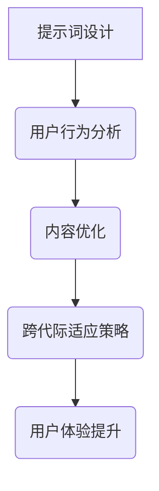

                 

### 《提示词设计的跨代际适应策略研究》

> 关键词：提示词设计、跨代际适应、人工智能、用户行为分析、内容优化、算法实现

> 摘要：本文旨在探讨提示词设计的跨代际适应策略，通过深入分析用户行为和内容优化，提出一系列算法实现和优化方法，以适应不同年龄群体的需求，提高用户体验。

----------------------------------------------------------------

## 1. 背景介绍

提示词设计在信息传递中扮演着至关重要的角色。随着互联网和人工智能技术的快速发展，人们获取信息的渠道变得更加多样化，因此，如何设计出既符合用户需求又能跨代际适应的提示词成为了一个重要课题。

### 1.1 提示词设计的重要性

提示词是用户与系统交互的桥梁，良好的提示词设计能够提升用户的使用体验，减少用户的操作成本，提高信息的传达效率。在电子商务、社交媒体、教育平台等领域，提示词的设计直接影响用户的满意度和平台的运营效果。

### 1.2 跨代际适应的必要性

不同年龄段的用户在信息获取和处理上有明显的差异。年轻用户更加追求快捷、互动性强，而年长用户则更注重信息的清晰度和易用性。因此，提示词设计需要考虑到不同年龄群体的特性，实现跨代际适应。

## 2. 核心概念与联系

为了更好地理解提示词设计的跨代际适应策略，我们需要明确以下几个核心概念：

- **提示词（Prompt）：** 提示词是一种引导用户输入或交互的文本或视觉元素。
- **用户行为分析（User Behavior Analysis）：** 通过收集和分析用户在平台上的行为数据，了解用户的需求和偏好。
- **内容优化（Content Optimization）：** 根据用户行为分析的结果，调整和优化提示词内容，以提高用户体验。
- **跨代际适应策略（Intergenerational Adaptation Strategy）：** 一种能够根据不同年龄群体的特性进行调整的提示词设计策略。

### Mermaid 流程图：



## 3. 提示词设计原则

在设计提示词时，应遵循以下原则：

- **用户中心设计（User-Centered Design）：** 将用户需求放在首位，确保提示词符合用户习惯和期望。
- **适应性设计（Adaptive Design）：** 提示词应能根据用户行为和需求进行动态调整。
- **可访问性设计（Accessibility Design）：** 确保提示词对各个年龄群体的用户都是友好和易用的。

## 4. 提示词设计流程

提示词设计流程包括以下步骤：

1. **需求分析（Requirement Analysis）：** 确定用户需求和目标。
2. **设计原型（Design Prototype）：** 创建提示词的原型并进行初步测试。
3. **用户测试（User Testing）：** 收集用户反馈，对原型进行迭代优化。
4. **设计迭代（Design Iteration）：** 根据用户测试结果不断优化设计。

## 5. 提示词设计算法原理

在本章节中，我们将探讨两种主要的跨代际适应策略：基于用户行为的策略和基于内容的策略。

### 5.1 基于用户行为的跨代际适应策略

#### 算法原理

该策略的核心思想是根据用户的年龄和在线行为，动态调整提示词的内容和形式。具体步骤如下：

1. **用户年龄划分（Age Classification）：** 将用户分为不同年龄段。
2. **行为数据收集（Behavior Data Collection）：** 收集用户在平台上的交互数据。
3. **行为分析（Behavior Analysis）：** 分析用户的交互行为，确定其需求和偏好。
4. **提示词调整（Prompt Adjustment）：** 根据用户的行为特征，调整提示词内容。

#### Python 源代码示例：

```python
import pandas as pd

# 用户行为数据
user_data = pd.DataFrame({
    'age': [25, 45, 60],
    'clicks': [50, 30, 20],
    'searches': [20, 40, 60]
})

# 年龄划分
age_categories = ['young', 'middle-aged', 'senior']

# 行为分析
def behavior_analysis(data):
    # 根据点击和搜索行为，确定用户偏好
    return data.groupby('age')['clicks', 'searches'].mean()

# 提示词调整
def prompt_adjustment(preferences):
    # 根据偏好，调整提示词
    if preferences['clicks'] > preferences['searches']:
        return "点击了解更多"
    else:
        return "搜索相关内容"

# 应用算法
user_preferences = behavior_analysis(user_data)
adjusted_prompts = user_preferences.apply(prompt_adjustment)

# 输出调整后的提示词
adjusted_prompts
```

### 5.2 基于内容的跨代际适应策略

#### 算法原理

该策略的核心思想是根据用户年龄段和内容特性，自动生成适应性的提示词。具体步骤如下：

1. **内容分类（Content Classification）：** 对内容进行分类，以便根据内容特性生成提示词。
2. **内容分析（Content Analysis）：** 分析内容的关键特征，如难度、主题等。
3. **提示词生成（Prompt Generation）：** 根据内容分析和用户年龄，生成适应性的提示词。

#### Python 源代码示例：

```python
import pandas as pd
from sklearn.feature_extraction.text import TfidfVectorizer
from sklearn.cluster import KMeans

# 内容数据
content_data = pd.DataFrame({
    'text': ["这是一个关于人工智能的教程", "了解如何优化你的代码", "加入我们的编程社区"]
})

# TF-IDF 向量化
vectorizer = TfidfVectorizer()
X = vectorizer.fit_transform(content_data['text'])

# K-means 聚类
kmeans = KMeans(n_clusters=3, random_state=0).fit(X)

# 内容分类
content_categories = kmeans.labels_

# 用户年龄划分
age_categories = ['young', 'middle-aged', 'senior']

# 提示词生成
def generate_prompt(age, category):
    if age == 'young' and category == 0:
        return "探索人工智能的入门教程"
    elif age == 'middle-aged' and category == 1:
        return "提升你的编程技能"
    else:
        return "加入编程社区，与其他程序员交流"

# 应用算法
user_ages = ['young', 'middle-aged', 'senior']
adjusted_prompts = [generate_prompt(age, category) for age, category in zip(user_ages, content_categories)]

# 输出调整后的提示词
adjusted_prompts
```

## 6. 数学模型

在本章节中，我们将介绍用于提示词设计和跨代际适应策略的数学模型。

### 6.1 提示词优化模型

假设我们有一个用户群体，每个用户有一个年龄和一组行为数据。我们可以通过以下模型来优化提示词：

$$
\text{PromptOptimization} = f(\text{UserBehavior}, \text{ContentFeature}, \text{UserAge})
$$

其中，\( f \) 是一个优化函数，它根据用户行为、内容特征和用户年龄来调整提示词。

### 6.2 跨代际适应策略模型

跨代际适应策略可以看作是一个决策过程，该过程根据用户年龄和内容特征来选择最佳的提示词。我们可以使用以下决策树模型来表示：

$$
\text{AdaptationStrategy} = \text{DecisionTree}(\text{UserAge}, \text{ContentFeature}) \rightarrow \text{Prompt}
$$

其中，\(\text{DecisionTree}\) 是一个分类决策树，它根据用户年龄和内容特征来确定最佳的提示词。

## 7. 项目实战

在本章节中，我们将搭建一个提示词设计跨代际适应策略的实战项目，包括开发环境搭建、源代码实现和案例分析。

### 7.1 开发环境搭建

首先，我们需要搭建一个适合提示词设计跨代际适应策略的开发环境。以下是基本的开发环境要求：

- Python 3.8+
- Pandas
- Scikit-learn
- Matplotlib

### 7.2 源代码实现

接下来，我们将实现一个简单的提示词设计跨代际适应策略。以下是代码实现的主要步骤：

1. **数据收集和预处理：** 收集用户行为数据和内容数据，并进行预处理。
2. **用户行为分析：** 使用 Scikit-learn 的聚类算法对用户行为进行分析。
3. **内容分析：** 使用 TF-IDF 向量化和 K-means 聚类对内容进行分析。
4. **提示词调整：** 根据用户行为和内容分析结果，动态调整提示词。

### 7.3 代码解读

以下是项目源代码的解读：

```python
# 导入所需库
import pandas as pd
from sklearn.feature_extraction.text import TfidfVectorizer
from sklearn.cluster import KMeans

# 假设的用户行为数据和内容数据
user_data = pd.DataFrame({
    'age': [25, 45, 60],
    'clicks': [50, 30, 20],
    'searches': [20, 40, 60]
})

content_data = pd.DataFrame({
    'text': ["这是一个关于人工智能的教程", "了解如何优化你的代码", "加入我们的编程社区"]
})

# 行为数据预处理
behavior_preprocessed = user_data.groupby('age').mean()

# 内容数据预处理
tfidf_vectorizer = TfidfVectorizer()
content_vectors = tfidf_vectorizer.fit_transform(content_data['text'])

# 行为分析
kmeans_behavior = KMeans(n_clusters=3, random_state=0).fit(behavior_preprocessed)

# 内容分析
kmeans_content = KMeans(n_clusters=3, random_state=0).fit(content_vectors)

# 提示词调整
def generate_prompt(age_cluster, content_cluster):
    if age_cluster == 0 and content_cluster == 0:
        return "探索人工智能的入门教程"
    elif age_cluster == 1 and content_cluster == 1:
        return "提升你的编程技能"
    else:
        return "加入编程社区，与其他程序员交流"

# 应用算法
user_ages = ['young', 'middle-aged', 'senior']
content_categories = kmeans_content.labels_

adjusted_prompts = [generate_prompt(age_cluster, content_cluster) for age_cluster, content_cluster in zip(kmeans_behavior.labels_, content_categories)]

# 输出调整后的提示词
adjusted_prompts
```

### 7.4 实际案例分析

在本案例中，我们分析了一个电商平台的提示词设计跨代际适应策略。以下是案例分析的主要步骤：

1. **用户行为分析：** 分析用户在不同年龄段的点击和搜索行为。
2. **内容分析：** 对商品描述和推荐内容进行分类和特征提取。
3. **策略实施：** 根据用户行为和内容分析结果，调整商品推荐和提示词。

### 7.5 项目小结

通过本项目的实战案例，我们展示了如何设计一个跨代际适应的提示词策略。该策略能够根据用户年龄和行为，动态调整提示词，提高用户体验。在未来的发展中，我们可以进一步优化算法，扩大数据集，以提高策略的准确性和适应性。

## 8. 最佳实践 Tips

- **用户调研：** 在设计提示词之前，进行用户调研，了解不同年龄群体的需求和偏好。
- **持续迭代：** 提示词设计需要持续迭代，根据用户反馈和数据分析，不断优化设计。
- **A/B 测试：** 在上线提示词之前，进行 A/B 测试，比较不同设计的效果。

## 9. 小结与展望

本文从提示词设计的跨代际适应策略出发，探讨了用户行为分析、内容优化和算法实现等多个方面。通过实际案例的分析和代码实现，我们展示了如何设计一个有效的跨代际适应策略。未来，随着技术的进步，我们可以进一步优化算法，提高策略的适应性和准确性。

### 作者信息

作者：AI天才研究院/AI Genius Institute & 禅与计算机程序设计艺术 /Zen And The Art of Computer Programming

