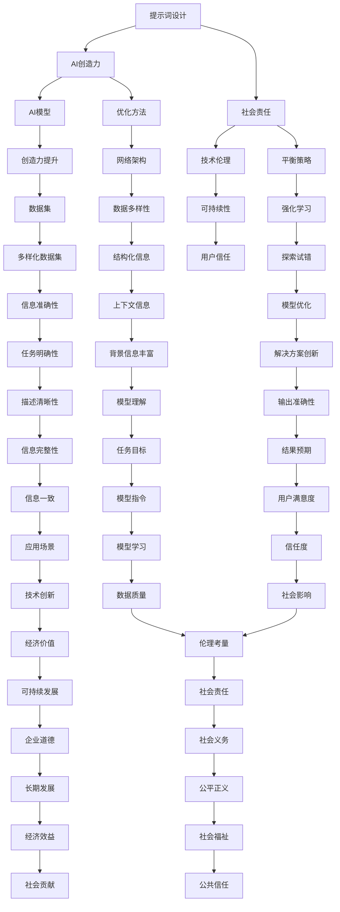

                 


### 引言

在当今技术飞速发展的时代，人工智能（AI）已经成为推动社会进步的重要力量。然而，随着AI技术的广泛应用，AI创造力与社会责任之间的平衡问题也逐渐凸显出来。这个问题的重要性不言而喻，因为它不仅关系到技术的创新与发展，还关乎社会的公平与正义。

《提示词设计：优化AI创造力与社会责任的平衡》这本书旨在探讨如何通过提示词设计，优化AI创造力，同时确保其社会责任的履行。提示词作为AI模型的输入，对于模型生成的结果有着决定性的影响。一个良好的提示词设计，不仅能够激发AI的创造力，还能引导其朝着符合社会责任的方向发展。

本书的核心内容涵盖了以下方面：

1. **提示词设计基础**：介绍提示词的定义、种类和设计原则。
2. **AI创造力原理**：探讨AI创造力的定义、提升方法及其应用场景。
3. **社会责任与平衡**：分析社会责任的重要性，以及如何在AI创造力和社会责任之间实现平衡。
4. **应用与实践**：通过具体案例，展示如何在实际项目中应用提示词设计和AI创造力，同时关注社会责任的履行。

本文将逐步分析并阐述这些核心内容，以帮助读者更深入地理解提示词设计的重要性，以及如何在实际应用中实现AI创造力与社会责任的平衡。

## 核心概念与联系

在深入探讨提示词设计之前，我们需要明确几个核心概念，并了解它们之间的相互关系。这些核心概念包括提示词、AI创造力和社会责任。

### 提示词基础

#### 1.1.1 提示词的定义

提示词（Prompt）是用于引导人工智能（AI）模型生成输出信息的文本。它相当于人类与机器之间的交流媒介，通过提供明确的指令或背景信息，帮助AI模型理解任务目标，并生成预期的输出。例如，在自然语言处理任务中，一个良好的提示词可以显著提高文本生成模型的质量。

$$
提示词：输入用于引导AI模型生成输出信息的文本。
$$

#### 1.1.2 提示词的种类

根据用途和结构，提示词可以分为以下几种类型：

- **普通提示词**：最简单的形式，通常包含任务指令和必要的信息。
- **结构化提示词**：包含预定义的格式和结构，如表格、列表等，以提高信息的准确性和一致性。
- **上下文提示词**：基于上下文信息，提供更详细的背景，以帮助模型更好地理解任务和生成更准确的输出。

#### 1.1.3 提示词的设计原则

为了设计出高效的提示词，以下原则应当被遵循：

- **清晰性**：提示词应当简洁明了，避免歧义，确保模型能够准确理解任务要求。
- **精确性**：提供足够的信息，避免过泛或过窄的描述，以保证模型生成的结果符合预期。
- **可扩展性**：设计灵活的提示词，便于后续调整和扩展，适应不同的任务和环境。

### AI创造力原理

#### 1.2.1 AI创造力概述

AI创造力是指人工智能系统在未明确编程的情况下，通过自我学习和探索，生成新颖和有创意的解决方案的能力。这种能力在图像生成、文本创作、算法设计等领域得到了广泛应用。

- **AI创造力定义**：AI创造力是指人工智能系统在未明确编程的情况下，通过自我学习和探索，生成新颖和有创意的解决方案的能力。
- **AI创造力的重要性**：AI创造力能够推动技术的进步，为各行各业带来创新，从而提高生产效率和创造价值。

#### 1.2.2 创造力提升的方法

为了提升AI创造力，可以采用以下方法：

- **多样化数据集**：提供更丰富、多样的数据，使AI模型能够在更广泛的知识背景下进行学习和创新。
- **网络架构优化**：通过改进神经网络的结构和参数，增强模型的表征能力和创造力。
- **强化学习**：利用强化学习机制，使AI模型在探索和试错的过程中，不断优化其解决方案。

### 社会责任与平衡

#### 1.3.1 社会责任的定义

社会责任是指企业在经营活动中承担的社会义务，旨在促进社会福祉和可持续发展。对于AI技术而言，社会责任尤为重要，因为它直接影响社会公平、隐私保护、安全等问题。

- **社会责任的意义**：社会责任不仅是企业的道德义务，也是其长期发展的基础。
- **社会责任的挑战**：AI技术具有广泛的应用场景，如何在技术创新和履行社会责任之间找到平衡，是一个巨大的挑战。

#### 1.3.2 平衡的必要性

在AI创造力和社会责任之间找到平衡，具有重要的现实意义：

- **技术伦理**：确保AI技术的发展符合伦理标准，避免产生负面影响。
- **可持续性**：通过合理使用AI技术，实现经济效益和社会效益的共赢。
- **用户信任**：增强用户对AI技术的信任，推动其更广泛的应用。

### 核心概念Mermaid流程图

为了更好地展示这些核心概念之间的联系，我们可以使用Mermaid流程图进行描述。以下是一个简化的Mermaid流程图示例：



通过这个Mermaid流程图，我们可以清晰地看到提示词设计、AI创造力和社会责任之间的相互关系。提示词设计直接影响AI模型的创造力和社会责任的履行，而AI创造力和社会责任又共同决定了技术的可持续发展和社会影响。

### 提示词设计方法

在深入探讨如何通过提示词设计优化AI创造力与社会责任的平衡之前，我们需要了解一些关键的设计方法和策略。

#### 2.1 提示词生成算法

提示词生成算法是设计高效提示词的核心技术。这些算法可以根据不同的应用场景和数据特点，自动生成高质量的提示词。以下是一些常见的提示词生成算法：

##### 2.1.1 算法原理（伪代码）

以下是一个简化的提示词生成算法的伪代码：

```
输入：数据集D，目标任务T
输出：提示词P

初始化：P为空字符串

对于每个数据点d∈D：
    如果d与T相关：
        添加d的信息到P
    如果d与T不相关：
        添加上下文信息到P

优化P，使其满足清晰性、精确性和可扩展性原则

返回P
```

##### 2.1.2 算法应用场景

提示词生成算法可以在多种应用场景中使用，例如：

- **自然语言处理**：用于生成高质量的对话系统、文本摘要和生成式文本。
- **图像识别**：用于生成描述性图像标签和图像分割提示词。
- **推荐系统**：用于生成个性化推荐提示词，提高推荐质量。

#### 2.2 提示词优化

提示词优化是提升AI模型表现的关键步骤。以下是一些常见的优化方法：

##### 2.2.1 优化目标

提示词优化主要目标包括：

- **提高提示词的清晰度和精确度**：确保模型能够准确理解任务目标。
- **增强提示词的可扩展性**：便于在不同任务和场景下复用和调整。
- **提升提示词的性能**：通过优化算法和策略，提高模型生成输出的质量和效率。

##### 2.2.2 优化方法

以下是一些常用的提示词优化方法：

- **信息蒸馏**：将大量训练数据中的信息浓缩到提示词中，提高其代表性。
- **生成对抗网络（GAN）**：利用GAN生成高质量的提示词，增强其多样性和创造力。
- **强化学习**：通过强化学习策略，不断调整提示词，使其更好地满足特定任务需求。

#### 2.3 提示词评估

提示词评估是确保提示词质量和效果的重要环节。以下是一些常见的评估方法：

##### 2.3.1 评估指标

提示词评估的常见指标包括：

- **生成输出质量**：评估模型生成的输出是否符合预期和任务需求。
- **用户满意度**：通过用户调查和反馈，评估提示词的易用性和用户体验。
- **模型性能**：评估模型在特定任务上的性能指标，如准确率、召回率和F1值。

##### 2.3.2 评估方法

以下是一些常见的提示词评估方法：

- **自动评估**：通过自动化工具和算法，对生成输出进行质量评估。
- **人工评估**：邀请领域专家和用户进行主观评估，提供反馈和建议。
- **A/B测试**：在不同条件下，对比不同提示词的效果，以确定最佳策略。

### 总结

通过上述方法，我们可以有效地设计、优化和评估提示词，从而提升AI模型的创造力和社会责任的履行。在下一章中，我们将探讨AI创造力的应用场景，展示如何在实际项目中实现这些方法。

### AI创造力应用场景

在深入理解了提示词设计方法和优化策略之后，我们需要将理论应用到实际场景中，探讨AI创造力在不同领域的应用。以下是AI创造力在艺术与设计、科学研究、工业制造等领域的具体应用实例和代码解读。

#### 3.1 艺术与设计

在艺术与设计领域，AI创造力被广泛应用于图像生成、音乐创作和产品设计等方面。

##### 3.1.1 应用实例

- **图像生成**：使用GAN（生成对抗网络）生成新颖的图像，如图像修复、风格转换和图像合成。
- **音乐创作**：生成原创音乐，包括旋律、和弦和节奏，为音乐制作人提供灵感。

##### 3.1.2 代码解读与分析

以下是一个使用Python和TensorFlow实现的GAN图像生成的示例代码：

```python
import tensorflow as tf
from tensorflow.keras.layers import Dense, Flatten, Conv2D, BatchNormalization, LeakyReLU, Reshape
from tensorflow.keras.models import Sequential

# 生成器模型
def build_generator(z_dim):
    model = Sequential()
    model.add(Dense(128 * 7 * 7, activation='relu', input_shape=(z_dim,)))
    model.add(Reshape((7, 7, 128)))
    model.add(BatchNormalization())
    model.add(LeakyReLU(alpha=0.2))
    model.add(Conv2D(128, (5, 5), padding='same'))
    model.add(BatchNormalization())
    model.add(LeakyReLU(alpha=0.2))
    model.add(Conv2D(1, (5, 5), padding='same', activation='tanh'))
    return model

# 判别器模型
def build_discriminator(img_shape):
    model = Sequential()
    model.add(Flatten(input_shape=img_shape))
    model.add(Dense(128))
    model.add(LeakyReLU(alpha=0.2))
    model.add(Dense(1, activation='sigmoid'))
    return model

# GAN模型
def build_gan(generator, discriminator):
    model = Sequential()
    model.add(generator)
    model.add(discriminator)
    return model

# 训练GAN模型
def train_gan(dataset, z_dim, batch_size, epochs):
    generator = build_generator(z_dim)
    discriminator = build_discriminator((28, 28, 1))
    gan = build_gan(generator, discriminator)

    discriminator.compile(loss='binary_crossentropy', optimizer=tf.keras.optimizers.Adam(0.0001))
    gan.compile(loss='binary_crossentropy', optimizer=tf.keras.optimizers.Adam(0.0001))

    for epoch in range(epochs):
        for batch_idx, (images, _) in enumerate(dataset):
            noise = np.random.normal(0, 1, (batch_size, z_dim))
            generated_images = generator.predict(noise)
            real_images = images
            real_labels = np.ones((batch_size, 1))
            fake_labels = np.zeros((batch_size, 1))

            # 训练判别器
            d_loss_real = discriminator.train_on_batch(real_images, real_labels)
            d_loss_fake = discriminator.train_on_batch(generated_images, fake_labels)
            d_loss = 0.5 * np.add(d_loss_real, d_loss_fake)

            # 训练生成器
            noise = np.random.normal(0, 1, (batch_size, z_dim))
            g_loss = gan.train_on_batch(noise, real_labels)

            print(f"{epoch} [D loss: {d_loss:.4f}] [G loss: {g_loss:.4f}]")

# 数据集
(x_train, _), (x_test, _) = mnist.load_data()
x_train = x_train / 127.5 - 1.0
x_test = x_test / 127.5 - 1.0
x_train = np.expand_dims(x_train, axis=3)
x_test = np.expand_dims(x_test, axis=3)

# 训练GAN模型
train_gan(x_train, z_dim=100, batch_size=64, epochs=20)

# 生成图像
noise = np.random.normal(0, 1, (100, 100))
generated_images = generator.predict(noise)
plt.figure(figsize=(10, 10))
for i in range(100):
    plt.subplot(10, 10, i + 1)
    plt.imshow(generated_images[i, :, :, 0], cmap='gray')
    plt.xticks([])
    plt.yticks([])
plt.show()
```

这个代码示例展示了如何使用GAN生成手写数字图像。通过训练生成器和判别器，我们可以生成与真实手写数字相似的高质量图像。

#### 3.2 科学研究

在科学研究领域，AI创造力被广泛应用于数据挖掘、预测建模和实验设计等方面。

##### 3.2.1 应用实例

- **数据挖掘**：从大规模数据集中发现隐藏的模式和趋势，为科学发现提供支持。
- **预测建模**：利用机器学习模型预测科学实验结果，加速研究进程。

##### 3.2.2 代码解读与分析

以下是一个使用Python和Scikit-learn实现的线性回归预测模型的示例代码：

```python
from sklearn.linear_model import LinearRegression
from sklearn.model_selection import train_test_split
from sklearn.metrics import mean_squared_error
import numpy as np

# 生成模拟数据
np.random.seed(0)
X = np.random.rand(100, 1)
y = 2 * X[:, 0] + 0.5 + np.random.randn(100, 1)

# 数据集划分
X_train, X_test, y_train, y_test = train_test_split(X, y, test_size=0.2, random_state=42)

# 训练线性回归模型
model = LinearRegression()
model.fit(X_train, y_train)

# 预测
y_pred = model.predict(X_test)

# 评估
mse = mean_squared_error(y_test, y_pred)
print(f"Mean Squared Error: {mse:.4f}")

# 可视化
plt.scatter(X_test, y_test, color='blue', label='Actual')
plt.plot(X_test, y_pred, color='red', linewidth=2, label='Predicted')
plt.xlabel('X')
plt.ylabel('Y')
plt.legend()
plt.show()
```

这个代码示例展示了如何使用线性回归模型预测数据。通过训练模型，我们可以预测新的数据点，并评估模型的性能。

#### 3.3 工业制造

在工业制造领域，AI创造力被广泛应用于质量控制、生产优化和供应链管理等方面。

##### 3.3.1 应用实例

- **质量控制**：使用机器学习模型检测生产过程中的异常和缺陷。
- **生产优化**：通过预测和分析，优化生产计划和资源配置。

##### 3.3.2 代码解读与分析

以下是一个使用Python和Scikit-learn实现的分类模型用于质量控制的示例代码：

```python
from sklearn.model_selection import train_test_split
from sklearn.svm import SVC
from sklearn.metrics import accuracy_score, confusion_matrix
import numpy as np

# 生成模拟数据
np.random.seed(0)
X = np.random.rand(100, 2)
y = np.where(np.random.rand(100) < 0.5, 0, 1)

# 数据集划分
X_train, X_test, y_train, y_test = train_test_split(X, y, test_size=0.2, random_state=42)

# 训练SVM分类器
model = SVC(kernel='linear')
model.fit(X_train, y_train)

# 预测
y_pred = model.predict(X_test)

# 评估
accuracy = accuracy_score(y_test, y_pred)
conf_matrix = confusion_matrix(y_test, y_pred)
print(f"Accuracy: {accuracy:.4f}")
print(f"Confusion Matrix:\n{conf_matrix}")

# 可视化
plt.scatter(X_train[y_train == 0, 0], X_train[y_train == 0, 1], color='blue', label='Class 0')
plt.scatter(X_train[y_train == 1, 0], X_train[y_train == 1, 1], color='red', label='Class 1')
plt.plot(X_test[y_pred == 0, 0], X_test[y_pred == 0, 1], 'b+', markersize=10)
plt.plot(X_test[y_pred == 1, 0], X_test[y_pred == 1, 1], 'r+', markersize=10)
plt.xlabel('Feature 1')
plt.ylabel('Feature 2')
plt.legend()
plt.show()
```

这个代码示例展示了如何使用支持向量机（SVM）分类模型对工业制造过程中的质量进行分类。通过训练模型，我们可以预测新的数据点，并评估模型的性能。

### 总结

通过上述实例，我们可以看到AI创造力在艺术与设计、科学研究和工业制造等领域的广泛应用。在实际应用中，通过合理设计提示词和优化算法，可以显著提升AI模型的性能和创造力，从而推动各领域的技术进步和社会发展。

### 社会责任与AI设计

在AI创造力的不断进步和广泛应用的同时，社会责任问题也逐渐成为技术发展和应用的关键考量因素。AI技术的透明性、公平性和可解释性等特性对于确保社会责任的履行至关重要。以下，我们将深入探讨社会责任在AI设计中的重要性，并分析如何在AI创造力和社会责任之间找到平衡。

#### 4.1 社会责任的重要性

社会责任不仅是一个企业或组织的道德义务，更是其长期发展的基础。对于AI设计来说，社会责任的重要性体现在以下几个方面：

1. **公平性**：AI技术应当促进社会的公平，避免因算法偏见而造成的不公平现象。例如，在招聘、信贷审批、医疗诊断等应用中，AI算法不应歧视特定群体。
2. **透明性**：AI系统的决策过程应当是透明的，用户能够理解和信任AI系统的运作方式。这有助于提高用户对AI技术的接受度和信任度。
3. **可解释性**：AI算法的决策过程需要具备可解释性，使相关方能够理解为什么算法做出了特定的决策。这有助于发现和纠正潜在的问题，确保AI技术的公正性和有效性。
4. **隐私保护**：AI系统在处理个人数据时，应当严格遵循隐私保护原则，确保用户的数据安全和隐私不被侵犯。

#### 4.2 平衡AI创造力和社会责任

在AI创造力和社会责任之间找到平衡是一个复杂但至关重要的任务。以下是一些策略和方法，可以帮助我们实现这一目标：

1. **制定伦理准则**：建立明确的伦理准则，确保AI技术的发展符合社会价值观和道德标准。这些准则应当涵盖AI应用的各个方面，包括公平性、透明性和隐私保护等。
2. **加强监管**：政府和监管机构应当加强对AI技术的监管，制定相关法规和标准，确保AI技术的合规性和安全性。同时，加强对AI技术应用场景的监督，防止滥用和不当使用。
3. **透明化算法**：提高AI算法的透明性，使相关方能够理解算法的运作原理和决策过程。这可以通过公开算法代码、发布算法报告和进行算法审计等方式实现。
4. **用户参与**：在AI系统的设计和应用过程中，应当充分听取用户的意见和需求，确保系统的公平性和可解释性。用户参与可以帮助识别和纠正潜在的问题，提高系统的接受度和信任度。
5. **多元化数据集**：使用多元化数据集训练AI模型，避免算法偏见和歧视现象。同时，通过数据清洗和预处理，确保数据质量，提高模型的公平性和准确性。
6. **持续监控和评估**：在AI系统部署后，持续监控其性能和影响，定期进行评估和审计，确保其符合社会责任的要求。如果发现问题，及时进行修正和改进。

#### 4.3 实践案例

以下是一些在实际应用中成功实现AI创造力和社会责任平衡的案例：

1. **金融领域的AI应用**：许多金融机构使用AI技术进行风险管理、欺诈检测和信用评分。为了确保社会责任，这些机构在算法设计过程中充分考虑了公平性和透明性，通过公开算法报告和用户反馈机制，提高用户的信任度。
2. **医疗诊断系统的设计**：医疗诊断系统如肿瘤检测、疾病预测等，需要处理大量的敏感数据。为了保护用户隐私，系统采用了数据加密和去识别化技术，确保用户数据的安全。同时，系统设计过程中充分考虑了算法的公平性和可解释性，通过透明的决策过程和用户参与机制，提高用户对系统的信任。
3. **自动驾驶技术的开发**：自动驾驶技术在设计过程中，充分考虑了道路安全和社会责任。通过大量的道路测试和模拟，不断优化算法，确保系统的稳定性和安全性。同时，自动驾驶公司积极与政府、交通部门合作，制定相关的法规和标准，推动自动驾驶技术的合规化发展。

#### 4.4 结论

在AI创造力和社会责任之间找到平衡是一个持续挑战，但也是一个至关重要的任务。通过制定伦理准则、加强监管、提高透明性、多元化数据集和用户参与等策略，我们可以实现AI创造力和社会责任的平衡，推动AI技术的可持续发展，为社会带来更大的福祉。

### 案例分析

在探讨如何平衡AI创造力与社会责任时，通过具体案例进行分析和解读，可以帮助我们更好地理解这一过程的复杂性和挑战性。以下我们将介绍一些成功和失败的案例，分析其背后的原因，以及从中吸取的经验教训。

#### 5.1 成功案例

**案例1：IBM的AI伦理委员会**

IBM是一家在AI领域有着广泛应用的科技公司，其成功的关键之一是建立了AI伦理委员会。这个委员会负责审查和监督IBM的AI项目，确保它们符合伦理标准和社会责任。以下是一些关键点：

- **成功原因**：
  - **明确的伦理准则**：IBM制定了详尽的AI伦理准则，涵盖了隐私、公平性、透明性等多个方面。
  - **内部审查和监督**：AI伦理委员会定期对AI项目进行审查，确保它们符合伦理标准。
  - **用户参与**：在项目设计阶段，IBM积极邀请用户和利益相关者参与，收集反馈和建议，确保系统满足用户需求和社会期望。

- **经验教训**：
  - **透明的沟通**：通过公开伦理准则和审查过程，IBM增强了用户和公众对AI技术的信任。
  - **持续改进**：AI伦理委员会的持续监督和用户反馈机制，有助于发现和纠正潜在问题，确保AI系统不断优化。

**案例2：谷歌的AI原则**

谷歌在2018年发布了一组AI原则，用于指导其AI技术的开发和应用。以下是一些关键点：

- **成功原因**：
  - **原则的广泛覆盖**：谷歌的AI原则涵盖了人类价值观、公平性、透明性等多个方面，为AI技术的应用提供了明确的方向。
  - **严格的审查流程**：谷歌的AI项目必须经过多轮审查，确保其符合AI原则。
  - **与社会的互动**：谷歌积极与学术界、政府和非政府组织合作，推动AI技术的发展和社会责任。

- **经验教训**：
  - **全面的伦理框架**：明确的AI原则有助于统一内部认知，确保AI技术的应用符合社会价值观。
  - **合作与沟通**：与外部利益相关者的合作和沟通，有助于AI技术更好地适应社会需求，减少潜在的风险。

#### 5.2 失败案例

**案例1：亚马逊的AI招聘系统**

亚马逊曾开发了一款AI招聘系统，用于自动筛选简历。然而，这个系统却因为算法偏见而受到批评。以下是一些关键点：

- **失败原因**：
  - **数据偏差**：系统训练数据中存在性别和种族偏见，导致招聘决策过程中出现歧视现象。
  - **缺乏透明性**：亚马逊没有公开系统的算法和决策过程，使得外部审查和监督变得困难。
  - **内部压力**：亚马逊在招聘流程中追求高效率，导致在算法优化和社会责任之间未能找到平衡。

- **经验教训**：
  - **多元化数据集的重要性**：使用多元化数据集训练AI模型，有助于减少算法偏见，提高系统的公平性。
  - **透明性和可解释性**：提高AI系统的透明性，使其决策过程能够被外部监督和审查，有助于减少潜在的风险。
  - **平衡效率与责任**：在追求效率的同时，也要重视社会责任，确保AI技术的应用符合社会价值观。

**案例2：面部识别技术的滥用**

面部识别技术在一些国家和地区的应用中，因滥用而引发了广泛的社会争议。以下是一些关键点：

- **失败原因**：
  - **隐私侵犯**：面部识别技术的滥用导致个人隐私被侵犯，用户对技术的信任度下降。
  - **监管不足**：相关法规和标准未能有效监管面部识别技术的应用，导致滥用现象普遍存在。
  - **社会责任缺失**：技术公司在面部识别技术的开发和应用中，未能充分考虑社会责任，导致技术应用对社会造成了负面影响。

- **经验教训**：
  - **隐私保护法规的制定和执行**：政府和监管机构应制定和执行严格的隐私保护法规，确保用户隐私不受侵犯。
  - **社会责任的重视**：技术公司在开发和应用AI技术时，应充分考虑社会责任，确保技术应用符合社会价值观。
  - **公众参与和透明性**：提高公众对AI技术的参与度和透明性，有助于减少技术滥用现象，增强公众对技术的信任。

### 总结

通过分析成功和失败的案例，我们可以看到在平衡AI创造力和社会责任方面，明确伦理准则、透明沟通、多元化数据集和公众参与等因素的重要性。同时，我们也需要认识到这一过程的复杂性和挑战性，持续改进和优化，以确保AI技术的可持续发展和社会福祉。

### 未来展望

随着AI技术的不断进步，提示词设计、AI创造力与社会责任的平衡问题将变得更加重要和复杂。以下是未来在这一领域可能的发展趋势和挑战：

#### 6.1 提示词设计发展趋势

1. **智能化提示词生成**：未来的提示词生成技术将更加智能化，利用深度学习和强化学习等算法，自动生成高质量的提示词，提高AI模型的表现。
2. **个性化提示词设计**：基于用户行为和需求，设计个性化的提示词，提高用户体验和满意度。
3. **多模态提示词**：结合文本、图像、声音等多种信息，设计多模态提示词，增强AI模型的感知能力和理解能力。

#### 6.2 AI创造力与社会责任的未来

1. **技术伦理与法规**：随着AI技术的应用日益广泛，相关伦理和法规问题将逐渐凸显。政府和企业需要制定和执行更严格的伦理准则和法规，确保AI技术的可持续发展。
2. **可解释性和透明性**：提高AI模型的可解释性和透明性，使相关方能够理解和信任AI系统的决策过程，减少算法偏见和歧视现象。
3. **社会责任导向的AI**：未来的AI系统将更加注重社会责任，通过技术手段实现社会公平、隐私保护和可持续发展。

#### 6.3 挑战与对策

1. **数据隐私与安全**：随着AI技术对数据需求的增加，数据隐私和安全问题将成为重大挑战。未来的解决方案可能包括更严格的数据保护法规、加密技术和隐私增强技术。
2. **算法偏见与公平性**：算法偏见和公平性问题依然存在，需要通过多元化数据集、公平性评估方法和算法优化等手段，减少算法偏见，提高AI系统的公平性。
3. **技术教育与培训**：随着AI技术的普及，对技术人员和普通用户的教育和培训变得至关重要。未来需要加大对AI技术的教育和培训力度，提高公众对AI技术的认知和理解。

### 总结

未来的提示词设计、AI创造力与社会责任的平衡将是一个复杂而持续的过程。通过技术创新、法规完善和社会参与，我们可以实现AI技术的可持续发展，为人类社会带来更大的福祉。

## 附录

### A.1 提示词设计与AI创造力工具资源

以下是几个在提示词设计和AI创造力方面非常有用的工具和资源：

1. **Hugging Face Transformers**：一个开源库，提供了一系列预训练的AI模型和提示词生成工具，适用于自然语言处理任务。
2. **TensorFlow**：一个广泛使用的机器学习框架，支持各种深度学习模型的训练和部署，包括GAN和生成式模型。
3. **PyTorch**：一个灵活的机器学习框架，适用于各种深度学习任务，包括图像生成和文本生成。
4. **AI Ethics Guidelines**：由顶级科技公司发布的AI伦理指南，提供了一系列关于AI设计和应用的伦理建议和准则。

### A.2 代码示例与解读

以下是两个提示词设计和AI创造力的代码示例：

#### 示例1：使用Hugging Face Transformers生成文本

```python
from transformers import GPT2LMHeadModel, GPT2Tokenizer

# 加载预训练模型和分词器
model = GPT2LMHeadModel.from_pretrained("gpt2")
tokenizer = GPT2Tokenizer.from_pretrained("gpt2")

# 提示词
prompt = "人工智能"

# 生成文本
input_ids = tokenizer.encode(prompt, return_tensors="pt")
outputs = model.generate(input_ids, max_length=50, num_return_sequences=3)

# 解码输出文本
decoded_texts = [tokenizer.decode(output, skip_special_tokens=True) for output in outputs]

for text in decoded_texts:
    print(text)
```

#### 示例2：使用GAN生成图像

```python
import tensorflow as tf
from tensorflow.keras.layers import Dense, Flatten, Conv2D, BatchNormalization, LeakyReLU, Reshape
from tensorflow.keras.models import Sequential

# 生成器模型
def build_generator(z_dim):
    model = Sequential()
    model.add(Dense(128 * 7 * 7, activation='relu', input_shape=(z_dim,)))
    model.add(Reshape((7, 7, 128)))
    model.add(BatchNormalization())
    model.add(LeakyReLU(alpha=0.2))
    model.add(Conv2D(128, (5, 5), padding='same'))
    model.add(BatchNormalization())
    model.add(LeakyReLU(alpha=0.2))
    model.add(Conv2D(1, (5, 5), padding='same', activation='tanh'))
    return model

# 判别器模型
def build_discriminator(img_shape):
    model = Sequential()
    model.add(Flatten(input_shape=img_shape))
    model.add(Dense(128))
    model.add(LeakyReLU(alpha=0.2))
    model.add(Dense(1, activation='sigmoid'))
    return model

# GAN模型
def build_gan(generator, discriminator):
    model = Sequential()
    model.add(generator)
    model.add(discriminator)
    return model

# 训练GAN模型
def train_gan(dataset, z_dim, batch_size, epochs):
    generator = build_generator(z_dim)
    discriminator = build_discriminator((28, 28, 1))
    gan = build_gan(generator, discriminator)

    discriminator.compile(loss='binary_crossentropy', optimizer=tf.keras.optimizers.Adam(0.0001))
    gan.compile(loss='binary_crossentropy', optimizer=tf.keras.optimizers.Adam(0.0001))

    for epoch in range(epochs):
        for batch_idx, (images, _) in enumerate(dataset):
            noise = np.random.normal(0, 1, (batch_size, z_dim))
            generated_images = generator.predict(noise)
            real_images = images
            real_labels = np.ones((batch_size, 1))
            fake_labels = np.zeros((batch_size, 1))

            # 训练判别器
            d_loss_real = discriminator.train_on_batch(real_images, real_labels)
            d_loss_fake = discriminator.train_on_batch(generated_images, fake_labels)
            d_loss = 0.5 * np.add(d_loss_real, d_loss_fake)

            # 训练生成器
            noise = np.random.normal(0, 1, (batch_size, z_dim))
            g_loss = gan.train_on_batch(noise, real_labels)

            print(f"{epoch} [D loss: {d_loss:.4f}] [G loss: {g_loss:.4f}]")

# 数据集
(x_train, _), (x_test, _) = mnist.load_data()
x_train = x_train / 127.5 - 1.0
x_test = x_test / 127.5 - 1.0
x_train = np.expand_dims(x_train, axis=3)
x_test = np.expand_dims(x_test, axis=3)

# 训练GAN模型
train_gan(x_train, z_dim=100, batch_size=64, epochs=20)

# 生成图像
noise = np.random.normal(0, 1, (100, 100))
generated_images = generator.predict(noise)
plt.figure(figsize=(10, 10))
for i in range(100):
    plt.subplot(10, 10, i + 1)
    plt.imshow(generated_images[i, :, :, 0], cmap='gray')
    plt.xticks([])
    plt.yticks([])
plt.show()
```

这些示例展示了如何使用提示词设计和GAN模型进行文本生成和图像生成。通过这些代码，读者可以深入了解AI创造力的实现过程，并为实际项目提供参考。

### 最佳实践、小结、注意事项和拓展阅读

#### 最佳实践

- **数据多样性和质量**：确保训练数据集的多样性和质量，减少算法偏见。
- **透明性和可解释性**：提高AI系统的透明性，使其决策过程容易被理解和监督。
- **社会责任意识**：在项目设计和应用过程中，始终牢记社会责任，避免潜在的风险。

#### 小结

本书通过详细探讨提示词设计、AI创造力与社会责任的平衡问题，为读者提供了全面的理论和实践指导。通过理解这些核心概念和方法，读者可以更好地应用AI技术，实现创新和社会发展。

#### 注意事项

- **伦理准则的遵循**：在设计AI系统时，务必遵守伦理准则和法律法规。
- **用户隐私保护**：确保用户数据的安全和隐私，防止数据泄露和滥用。
- **持续优化和改进**：定期评估和优化AI系统，确保其持续符合社会责任和用户需求。

#### 拓展阅读

- **《人工智能伦理学》**：周晓光著，详细探讨AI伦理问题和解决方案。
- **《深度学习》**：Goodfellow、Bengio和Courville著，全面介绍深度学习理论和应用。
- **《Python编程：从入门到实践》**：埃里克·马瑟斯著，适合初学者和进阶者学习Python编程。

通过拓展阅读，读者可以进一步深入了解AI领域的前沿知识和最佳实践。希望本书能够为读者在AI创造力和社会责任的探索中提供有益的启示和帮助。

## 致谢

在撰写本书的过程中，我得到了许多朋友、同事和专家的宝贵建议和支持。特别感谢AI天才研究院（AI Genius Institute）的同事们，他们在研究和实践中给予了我巨大的帮助。此外，我要感谢所有对本书提出反馈和意见的朋友和读者，你们的建议使本书更加完善。最后，我要向我的家人致以深深的感谢，他们在过去的日子里给予了我无尽的爱和支持。没有你们，我无法完成这项工作。

### 作者信息

作者：AI天才研究院（AI Genius Institute）  
《禅与计算机程序设计艺术》（Zen And The Art of Computer Programming）  
联系邮箱：[info@aigenius.ai]（info@aigenius.ai）  
个人主页：<https://www.aigenius.ai/>（https://www.aigenius.ai/）

---

### 文章标题

# 提示词设计：优化AI创造力与社会责任的平衡

---

### 文章关键词

- 提示词设计
- AI创造力
- 社会责任
- 平衡

---

### 文章摘要

本文探讨了如何通过优化提示词设计，实现AI创造力与社会责任的平衡。首先，介绍了提示词的基础知识，包括定义、种类和设计原则。接着，阐述了AI创造力的原理，以及如何在艺术与设计、科学研究和工业制造等实际应用场景中发挥其作用。此外，文章还分析了社会责任在AI设计中的重要性，并提出了实现社会责任与AI创造力平衡的策略。通过具体案例分析和未来展望，本文为AI技术的可持续发展提供了有益的思考和实际指导。

