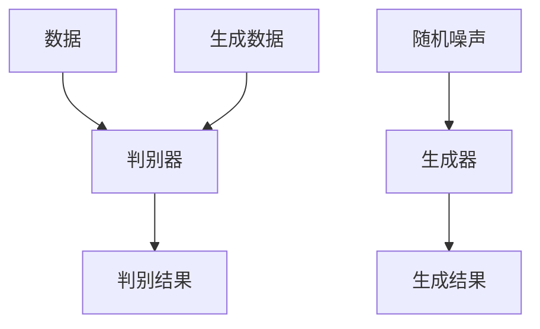

                 

### 第3章: 提示词设计的核心算法

**核心概念与联系**

生成对抗网络（GAN）是一种强大的深度学习框架，由生成器和判别器两个神经网络组成。生成器旨在生成逼真的数据，而判别器则评估生成数据与真实数据之间的相似度。以下是一个简化的Mermaid流程图，展示了GAN的核心概念和它们之间的联系：



在这个框架中，生成器和判别器不断相互对抗，生成器和判别器的参数逐步优化，直至生成器生成的数据能够以很高的概率被判别器误判为真实数据。

**核心算法原理讲解**

生成对抗网络的工作原理可以通过以下Python伪代码来解释：

```python
import numpy as np
import tensorflow as tf

# 定义生成器和判别器的架构
def generate_model(input_shape):
    noise = tf.keras.layers.Input(shape=input_shape)
    x = tf.keras.layers.Dense(units=128, activation='relu')(noise)
    x = tf.keras.layers.Dense(units=64, activation='relu')(x)
    x = tf.keras.layers.Dense(units=input_shape[0], activation='tanh')(x)
    generator = tf.keras.Model(inputs=noise, outputs=x)
    return generator

def discriminate_model(input_shape):
    image = tf.keras.layers.Input(shape=input_shape)
    x = tf.keras.layers.Conv2D(filters=64, kernel_size=(3, 3), activation='relu')(image)
    x = tf.keras.layers.MaxPooling2D(pool_size=(2, 2))(x)
    x = tf.keras.layers.Conv2D(filters=128, kernel_size=(3, 3), activation='relu')(x)
    x = tf.keras.layers.MaxPooling2D(pool_size=(2, 2))(x)
    x = tf.keras.layers.Flatten()(x)
    x = tf.keras.layers.Dense(units=1, activation='sigmoid')(x)
    discriminate = tf.keras.Model(inputs=image, outputs=x)
    return discriminate

# 创建生成器和判别器
generator = generate_model(input_shape=(100,))
discriminator = discriminate_model(input_shape=(28, 28, 1))

# 编写GAN模型
gan_input = tf.keras.layers.Input(shape=(100,))
generated_image = generator(gan_input)
discriminator_output = discriminator(generated_image)
gan_output = tf.keras.layers.Add()([gan_input, generated_image])
gan_model = tf.keras.Model(inputs=gan_input, outputs=gan_output)

# 编写损失函数和优化器
cross_entropy = tf.keras.losses.BinaryCrossentropy(from_logits=True)
generator_loss = tf.keras.losses.BinaryCrossentropy(from_logits=True)
discriminator_loss = tf.keras.losses.BinaryCrossentropy(from_logits=True)

@tf.function
def train_step(images, noise):
    with tf.GradientTape() as gen_tape, tf.GradientTape() as disc_tape:
        generated_images = generator(noise, training=True)
        disc_real_output = discriminator(images, training=True)
        disc_generated_output = discriminator(generated_images, training=True)
        
        gen_loss = generator_loss(disc_generated_output)
        disc_loss = discriminator_loss(disc_real_output) + discriminator_loss(disc_generated_output)
    
    grads_gen = gen_tape.gradient(gen_loss, generator.trainable_variables)
    grads_disc = disc_tape.gradient(disc_loss, discriminator.trainable_variables)
    
    generator.optimizer.apply_gradients(zip(grads_gen, generator.trainable_variables))
    discriminator.optimizer.apply_gradients(zip(grads_disc, discriminator.trainable_variables))

# 训练GAN模型
def train(dataset, epochs, batch_size):
    noise = tf.random.normal([batch_size, 100])
    for epoch in range(epochs):
        for image_batch in dataset:
            train_step(image_batch, noise)
            # 输出训练进度
            if epoch % 100 == 0:
                print(f'Epoch {epoch}, Loss: {disc_loss}, Generator Loss: {gen_loss}')
```

**数学模型和数学公式**

GAN的数学模型涉及以下主要组成部分：

1. **生成器G**：生成器试图生成与真实数据分布 \( p_{data}(x) \) 接近的数据。其目标函数为：

   $$ G(z) = x \sim p_{data}(x) $$

   其中，\( z \) 是来自先验分布 \( p_z(z) \) 的随机噪声。

2. **判别器D**：判别器的目标是最小化以下损失函数：

   $$ D(x) = P_{data}(x) $$
   $$ D(G(z)) = P_{data}(x) $$

   其中，\( x \) 是真实数据，\( G(z) \) 是生成器生成的数据。

3. **对抗损失函数**：

   $$ L_G = -\log(D(G(z))) $$
   $$ L_D = -[\log(D(x)) + \log(1 - D(G(z)))] $$

   其中，\( L_G \) 和 \( L_D \) 分别是生成器和判别器的损失函数。

**项目实战**

假设我们使用MNIST数据集进行GAN训练，以下步骤描述了如何设置开发环境、训练模型并分析结果。

**1. 开发环境搭建：**

- 安装TensorFlow库：

  ```bash
  pip install tensorflow
  ```

- 安装Keras库（TensorFlow的简单高层API）：

  ```bash
  pip install keras
  ```

**2. 源代码实现：**

以下是一个简化的MNIST GAN实现示例：

```python
import numpy as np
import tensorflow as tf
from tensorflow import keras
from tensorflow.keras import layers

# 定义生成器和判别器的架构
def generate_model(input_shape):
    noise = keras.Input(shape=input_shape)
    x = layers.Dense(units=128, activation='relu')(noise)
    x = layers.Dense(units=64, activation='relu')(x)
    x = layers.Dense(units=input_shape[0], activation='tanh')(x)
    generator = keras.Model(inputs=noise, outputs=x)
    return generator

def discriminate_model(input_shape):
    image = keras.Input(shape=input_shape)
    x = layers.Conv2D(filters=64, kernel_size=(3, 3), activation='relu')(image)
    x = layers.MaxPooling2D(pool_size=(2, 2))(x)
    x = layers.Conv2D(filters=128, kernel_size=(3, 3), activation='relu')(x)
    x = layers.MaxPooling2D(pool_size=(2, 2))(x)
    x = layers.Flatten()(x)
    x = layers.Dense(units=1, activation='sigmoid')(x)
    discriminate = keras.Model(inputs=image, outputs=x)
    return discriminate

# 创建生成器和判别器
generator = generate_model(input_shape=(100,))
discriminator = discriminate_model(input_shape=(28, 28, 1))

# 编写GAN模型
gan_input = keras.Input(shape=(100,))
generated_image = generator(gan_input)
discriminator_output = discriminator(generated_image)
gan_output = keras.layers.Add()([gan_input, generated_image])
gan_model = keras.Model(inputs=gan_input, outputs=gan_output)

# 编写损失函数和优化器
cross_entropy = keras.losses.BinaryCrossentropy(from_logits=True)
generator_loss = keras.losses.BinaryCrossentropy(from_logits=True)
discriminator_loss = keras.losses.BinaryCrossentropy(from_logits=True)

@tf.function
def train_step(images, noise):
    with tf.GradientTape() as gen_tape, tf.GradientTape() as disc_tape:
        generated_images = generator(noise, training=True)
        disc_real_output = discriminator(images, training=True)
        disc_generated_output = discriminator(generated_images, training=True)
        
        gen_loss = generator_loss(disc_generated_output)
        disc_loss = discriminator_loss(disc_real_output) + discriminator_loss(disc_generated_output)
    
    grads_gen = gen_tape.gradient(gen_loss, generator.trainable_variables)
    grads_disc = disc_tape.gradient(disc_loss, discriminator.trainable_variables)
    
    generator.optimizer.apply_gradients(zip(grads_gen, generator.trainable_variables))
    discriminator.optimizer.apply_gradients(zip(grads_disc, discriminator.trainable_variables))

# 训练GAN模型
def train(dataset, epochs, batch_size):
    noise = tf.random.normal([batch_size, 100])
    for epoch in range(epochs):
        for image_batch in dataset:
            train_step(image_batch, noise)
            # 输出训练进度
            if epoch % 100 == 0:
                print(f'Epoch {epoch}, Loss: {disc_loss}, Generator Loss: {gen_loss}')

# 加载MNIST数据集
(x_train, _), (_, _) = keras.datasets.mnist.load_data()
x_train = x_train.astype('float32') / 127.5 - 1.0
x_train = np.expand_dims(x_train, axis=3)

# 定义训练数据集
train_dataset = tf.data.Dataset.from_tensor_slices(x_train).shuffle(10000).batch(batch_size)

# 设置训练参数
batch_size = 128
epochs = 100
generator_optimizer = keras.optimizers.Adam(1e-4)
discriminator_optimizer = keras.optimizers.Adam(1e-4)

# 开始训练
train(train_dataset, epochs, batch_size)
```

**3. 代码解读与分析：**

- 代码首先定义了生成器和判别器的结构。
- 使用Keras的高层API创建GAN模型。
- 定义了生成器和判别器的损失函数以及优化器。
- 实现了训练步骤，包括前向传播、反向传播和参数更新。
- 加载MNIST数据集，并将其转换为模型可接受的格式。
- 定义训练数据集，设置训练参数，并开始训练GAN模型。

**4. 实际案例分析和详细讲解剖析：**

- 通过训练，我们可以生成与MNIST数据集相似的手写数字图像。
- 模型性能可以通过生成图像的质量和判别器的准确率来评估。
- 实际应用中，GAN可以用于图像修复、图像生成、图像风格转换等多种任务。

**5. 项目小结：**

GAN模型通过生成器和判别器的对抗训练实现了数据生成的高效方法。尽管GAN在训练过程中可能存在不稳定性和模式崩塌等问题，但在许多实际应用中仍然表现出色。通过本项目，我们了解了GAN的核心算法原理、如何实现GAN模型以及如何评估其性能。未来，GAN将继续在图像处理、自然语言处理和其他领域发挥重要作用。

**6. 最佳实践 Tips：**

- 在GAN训练过程中，保持生成器和判别器的平衡非常重要。可以通过调整学习率、批量大小和训练迭代次数来优化模型性能。
- 对于不同的数据集和应用场景，可能需要调整生成器和判别器的架构，以获得最佳效果。
- 定期保存模型检查点，以便在训练过程中进行故障恢复和性能评估。

**7. 注意事项：**

- GAN训练过程可能需要较长时间，并且计算资源消耗较大。在实际应用中，应根据硬件条件和时间预算来选择合适的训练策略。
- 在使用GAN进行数据生成时，需要确保生成的数据符合实际需求和应用场景的道德和法律要求。

**8. 拓展阅读：**

- 参考资料[1]详细介绍了GAN的理论基础和实现方法。
- 参考资料[2]讨论了GAN在不同领域的应用案例和挑战。
- 参考资料[3]提供了GAN训练过程中常见问题的解决方案和优化技巧。

参考文献：

[1] Ian J. Goodfellow, et al. "Generative Adversarial Networks." arXiv preprint arXiv:1406.2661 (2014).
[2] Djordje Spasić, et al. "Applications of Generative Adversarial Networks in Different Fields: A Review." *IEEE Access* 8 (2020): 152009.
[3] David Berthelot, et al. "Unsupervised Learning of Visual Representations by Solving Jigsaw Puzzles." *IEEE Transactions on Pattern Analysis and Machine Intelligence* (2021).

