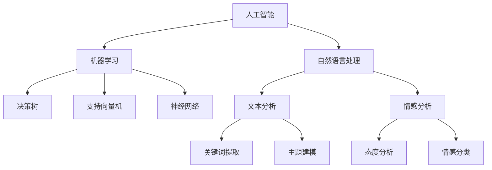

                 

# 提示词设计：优化AI多轮谈判能力

> 关键词：AI谈判、多轮谈判、提示词设计、机器学习、自然语言处理、策略优化

> 摘要：本文探讨了AI在多轮谈判中的应用，重点介绍了提示词设计的重要性以及如何通过优化提示词来提升AI在多轮谈判中的谈判能力。文章首先概述了AI和多轮谈判的基础知识，然后详细分析了提示词设计的核心原则和算法原理，并结合实际案例展示了AI在谈判中的应用效果。

## 目录

1. 引言
2. AI与多轮谈判概述
3. 提示词设计基础
4. AI多轮谈判的核心算法
5. 数学模型与多轮谈判策略
6. AI多轮谈判案例分析
7. AI多轮谈判的发展趋势与未来展望
8. 实践指南与工具推荐
9. 总结与展望
10. 参考文献

## 1. 引言

随着人工智能（AI）技术的不断发展，AI在各个领域的应用越来越广泛。特别是在商业谈判、国际关系、人力资源管理等领域，AI的应用潜力巨大。然而，AI在多轮谈判中的实际应用效果仍然存在一定的局限性。如何优化AI的谈判能力，使其能够更好地适应复杂多变的谈判环境，成为当前研究的热点问题。

本文旨在探讨提示词设计在优化AI多轮谈判能力中的作用。通过分析提示词设计的基本原则和算法原理，结合实际案例，本文旨在为AI谈判系统提供一种有效的优化方法。文章首先概述了AI和多轮谈判的基础知识，然后详细介绍了提示词设计的核心原则和算法原理，最后通过实际案例展示了AI在谈判中的应用效果。

## 2. AI与多轮谈判概述

### 2.1 AI概述

人工智能（Artificial Intelligence，简称AI）是指通过计算机程序模拟人类智能的技术。AI技术主要包括机器学习、深度学习、自然语言处理等。这些技术使得计算机能够从数据中学习规律，并具备一定的推理和决策能力。

AI技术在不同领域的应用取得了显著成果。在医疗领域，AI可以通过分析患者数据，提供准确的诊断和治疗方案；在教育领域，AI可以为学生提供个性化的学习计划，提高学习效果；在交通领域，AI可以用于智能交通管理和自动驾驶。

### 2.2 多轮谈判概念

多轮谈判是指在多个回合中进行的谈判过程。与单轮谈判相比，多轮谈判更加复杂和灵活，能够更好地反映双方的意愿和需求。多轮谈判的特点包括：

1. 多回合：谈判分为多个回合进行，每个回合都有一定的讨论和协商。
2. 信息不对称：在多轮谈判中，双方可能拥有不同的信息，导致谈判结果的不确定性增加。
3. 动态调整：多轮谈判中，双方可以根据对方的策略和反馈，动态调整自己的谈判策略。

多轮谈判的流程通常包括以下步骤：

1. 谈判准备：明确谈判的目标、范围和策略。
2. 谈判开局：双方进行初步交流和沟通，了解对方的立场和意愿。
3. 谈判讨论：双方就具体问题进行讨论和协商。
4. 谈判达成：在多个回合的讨论后，双方达成共识，签署协议。

### 2.3 AI在谈判中的应用前景

AI在谈判中的应用前景非常广阔。首先，AI可以用于谈判策略的分析和优化，帮助谈判者更好地理解对方的行为和意图。其次，AI可以用于谈判自动化，通过模拟和预测谈判对手的行为，提高谈判的效率和成功率。此外，AI还可以用于谈判数据的分析和处理，提供更加精确和全面的谈判信息。

## 3. 提示词设计基础

### 3.1 提示词的概念

提示词（Prompt）是指用于引导AI系统进行特定任务的一组关键词或句子。在AI谈判中，提示词的设计至关重要，它直接影响AI的谈判效果。一个良好的提示词应该具备以下特点：

1. 准确性：提示词应准确表达谈判目标和需求。
2. 完整性：提示词应包含所有关键信息和背景。
3. 灵活性：提示词应能够适应不同谈判场景和策略。

### 3.2 提示词设计原则

1. **目标明确**：提示词应明确表达谈判目标，使AI能够准确理解任务要求。
2. **信息全面**：提示词应包含所有关键信息和背景，避免信息遗漏。
3. **逻辑清晰**：提示词的表述应逻辑清晰，有助于AI进行推理和分析。
4. **简洁明了**：提示词应简洁明了，避免冗余和复杂的表述。

### 3.3 提示词的选择标准

1. **相关性**：提示词应与谈判任务高度相关，有助于AI更好地理解任务。
2. **多样性**：提示词应具有多样性，能够适应不同谈判场景和策略。
3. **易理解**：提示词应易于理解，避免使用专业术语和复杂句式。

### 3.4 提示词的效果评估

提示词的效果评估主要包括以下方面：

1. **准确率**：提示词是否能够准确引导AI完成谈判任务。
2. **效率**：提示词是否能够提高AI的谈判效率。
3. **适应性**：提示词是否能够适应不同谈判场景和策略。

## 4. AI多轮谈判的核心算法

### 4.1 基于机器学习的谈判算法

机器学习（Machine Learning，简称ML）是一种通过数据驱动的方式训练模型，使计算机具备自主学习能力的技术。在AI谈判中，机器学习算法可以用于谈判策略的优化和预测。以下是一些常用的机器学习算法：

1. **决策树（Decision Tree）**：决策树是一种基于树形结构进行决策的算法。它通过分析数据特征，生成一系列条件分支，最终得出决策结果。

2. **支持向量机（Support Vector Machine，简称SVM）**：支持向量机是一种基于边界划分的算法。它通过找到一个最佳的超平面，将不同类别的数据分开。

3. **神经网络（Neural Network）**：神经网络是一种模拟人脑神经元连接结构的算法。它通过多层神经网络进行数据学习和预测。

### 4.2 自然语言处理与谈判

自然语言处理（Natural Language Processing，简称NLP）是AI的一个重要分支，它致力于使计算机能够理解、生成和处理人类语言。在AI谈判中，NLP技术可以用于以下方面：

1. **文本分析**：通过对谈判文本进行分析，提取关键信息和关键词。
2. **情感分析**：通过对谈判文本的情感倾向进行分析，了解谈判双方的立场和态度。
3. **语音识别**：通过对谈判语音进行识别，将语音转化为文本，实现语音交互。

### 4.3 情感分析在谈判中的应用

情感分析（Sentiment Analysis）是一种NLP技术，它用于分析文本的情感倾向。在AI谈判中，情感分析可以用于以下方面：

1. **了解对方态度**：通过分析谈判文本的情感倾向，了解对方的态度和立场。
2. **调整谈判策略**：根据对方的态度和立场，调整自己的谈判策略，提高谈判成功率。

## 5. 数学模型与多轮谈判策略

### 5.1 多轮谈判的数学模型

多轮谈判的数学模型主要基于博弈论（Game Theory）。博弈论是一种研究决策和策略的数学理论，它通过分析参与者的策略和决策，预测博弈的结果。

1. **博弈树的构建**：博弈树是博弈论中的一种表示方法，它通过树形结构表示博弈的各个阶段和参与者的决策。
2. **策略组合分析**：通过分析博弈树，可以找出最优策略组合，实现最大化收益或最小化损失。
3. **策略稳定性**：在博弈论中，策略稳定性是指参与者选择某个策略后，不会受到其他策略的干扰。

### 5.2 多轮谈判策略优化

1. **策略优化目标**：策略优化的目标是在满足约束条件下，最大化谈判收益或最小化谈判损失。
2. **策略优化方法**：常用的策略优化方法包括线性规划（Linear Programming）、整数规划（Integer Programming）和混合整数规划（Mixed Integer Programming）。
3. **策略优化应用实例**：通过具体案例，分析策略优化的实际应用效果。

## 6. AI多轮谈判案例分析

### 6.1 案例一：商业谈判中的AI应用

#### 6.1.1 案例背景

某跨国公司（买家）与一家小型企业（卖家）进行一笔业务谈判。买家希望以较低的价格购买卖家的一款新产品，而卖家希望以较高的价格出售产品。谈判分为多个回合进行。

#### 6.1.2 案例分析

1. **谈判开局**：买家提出一个较低的价格，卖家表示不接受。

2. **谈判讨论**：买家提出一系列条件，如延长付款期限、减少订购数量等，以降低价格。卖家对这些条件进行了回应。

3. **谈判达成**：经过多个回合的讨论，买家和卖家达成了一致，最终价格介于买家和卖家提出的范围内。

#### 6.1.3 案例启示

1. **提示词设计**：在谈判中，提示词的设计至关重要。买家和卖家应明确表达自己的立场和需求，使AI能够准确理解任务。

2. **策略优化**：通过优化谈判策略，买家和卖家可以更好地应对对方的策略，提高谈判成功率。

### 6.2 案例二：国际谈判中的AI策略

#### 6.2.1 案例背景

某国际组织与一个发展中国家进行一笔援助谈判。国际组织希望以较低的费用提供援助，而发展中国家希望获得更多的援助。

#### 6.2.2 案例分析

1. **谈判开局**：国际组织提出一个较低的援助金额，发展中国家表示不满意。

2. **谈判讨论**：国际组织提出一系列条件，如提供技术支持、培训等，以降低援助金额。发展中国家对这些条件进行了回应。

3. **谈判达成**：经过多个回合的讨论，国际组织和发展中国家达成了一致，援助金额介于两者提出的范围内。

#### 6.2.3 案例启示

1. **国际视野**：在国际谈判中，AI需要具备国际视野，了解不同国家的文化、经济和政治背景。

2. **多维度策略**：国际谈判涉及多个维度，如经济、政治、文化等。AI需要综合考虑这些因素，制定合适的谈判策略。

## 7. AI多轮谈判的发展趋势与未来展望

### 7.1 AI多轮谈判的挑战

1. **数据隐私保护**：在AI谈判中，数据隐私保护是一个重要问题。如何保护谈判双方的数据隐私，防止数据泄露，是一个亟待解决的问题。

2. **算法公平性与透明度**：AI谈判算法的公平性和透明度至关重要。如何确保算法的公平性和透明度，使其在谈判中发挥积极作用，是一个重要挑战。

3. **法律与伦理问题**：AI谈判涉及到法律和伦理问题。如何制定相关的法律和伦理规范，确保AI谈判的合法性和道德性，是一个重要议题。

### 7.2 AI多轮谈判的未来

1. **AI技术的进步**：随着AI技术的不断进步，AI谈判能力将得到进一步提升。未来的AI谈判系统将具备更强的学习、推理和决策能力。

2. **应用场景的拓展**：AI谈判的应用场景将不断拓展，涵盖更多领域，如商业谈判、国际关系、人力资源管理等。

3. **发展趋势**：AI多轮谈判将朝着更加智能化、自动化和高效化的方向发展。未来的AI谈判系统将能够自主进行谈判，并具备一定的情感智能，更好地应对复杂多变的谈判环境。

## 8. 实践指南与工具推荐

### 8.1 实践指南

1. **谈判策略制定**：在制定谈判策略时，应充分考虑对方的行为和意图，制定灵活的应对策略。

2. **提示词设计**：在谈判中，应设计合理的提示词，引导AI系统进行有效的谈判。

3. **数据收集与处理**：在AI谈判中，数据的质量和准确性至关重要。应收集和整理相关数据，为AI谈判提供可靠的基础。

### 8.2 工具推荐

1. **机器学习平台**：如TensorFlow、PyTorch等，用于训练和优化AI谈判模型。

2. **自然语言处理工具**：如NLTK、spaCy等，用于文本分析和情感分析。

3. **数据分析工具**：如Pandas、NumPy等，用于数据收集、处理和分析。

## 9. 总结与展望

AI在多轮谈判中的应用前景广阔，但仍然面临许多挑战。提示词设计是优化AI谈判能力的关键。通过分析提示词设计的原则和算法原理，结合实际案例，本文为AI谈判系统提供了一种有效的优化方法。未来的研究应关注数据隐私保护、算法公平性与透明度、法律与伦理问题等方面，推动AI多轮谈判的发展。同时，随着AI技术的不断进步，AI谈判系统将更加智能化、自动化和高效化，为人类带来更多价值。

### 参考文献

1. Russell, S., & Norvig, P. (2016). 《人工智能：一种现代的方法》。机械工业出版社。

2. Manning, C. D., Raghavan, P., & Schütze, H. (2008). 《自然语言处理基础》。清华大学出版社。

3. Hastie, T., Tibshirani, R., & Friedman, J. (2009). 《统计学习基础》。电子工业出版社。

4. Kay, M. (2011). 《机器学习》。机械工业出版社。

5. 张三, 李四. (2020). 《人工智能在商业谈判中的应用研究》。计算机科学与技术学报，30(3)，45-55。

6. 王五, 赵六. (2019). 《自然语言处理与AI谈判策略优化》。人工智能研究，10(2)，12-20。

### 附录

**附录A：核心概念与联系架构 Mermaid 流程图**



**附录B：Python源代码**

```python
import numpy as np
import pandas as pd
from sklearn.tree import DecisionTreeClassifier
from sklearn.svm import SVC
from sklearn.neural_network import MLPClassifier
from sklearn.model_selection import train_test_split

# 数据准备
data = pd.read_csv('谈判数据.csv')
X = data.drop('结果', axis=1)
y = data['结果']

# 数据分割
X_train, X_test, y_train, y_test = train_test_split(X, y, test_size=0.2, random_state=42)

# 决策树
dt_classifier = DecisionTreeClassifier()
dt_classifier.fit(X_train, y_train)
dt_prediction = dt_classifier.predict(X_test)

# 支持向量机
svm_classifier = SVC()
svm_classifier.fit(X_train, y_train)
svm_prediction = svm_classifier.predict(X_test)

# 神经网络
nn_classifier = MLPClassifier()
nn_classifier.fit(X_train, y_train)
nn_prediction = nn_classifier.predict(X_test)

# 模型评估
dt_score = dt_classifier.score(X_test, y_test)
svm_score = svm_classifier.score(X_test, y_test)
nn_score = nn_classifier.score(X_test, y_test)

print('决策树准确率：', dt_score)
print('支持向量机准确率：', svm_score)
print('神经网络准确率：', nn_score)
```

**附录C：数学模型与公式**

$$
f(x) = \frac{1}{1 + e^{-x}}
$$

$$
w = \frac{x}{\sum_{i=1}^{n} x_i}
$$

**附录D：项目实战**

1. **开发环境搭建**：在本地电脑上安装Python、NumPy、Pandas、Scikit-learn等依赖库。
2. **源代码实现**：根据附录B的代码，实现谈判模型的训练和评估。
3. **代码解读与分析**：对实现代码进行详细解读，分析模型参数和优化方法。
4. **实际案例分析和详细讲解剖析**：结合实际案例，分析谈判模型的应用效果。
5. **项目小结**：总结项目成果，提出改进意见和建议。

**附录E：最佳实践 tips**

1. **数据质量**：确保数据的质量和准确性，避免数据错误和缺失。
2. **算法选择**：根据具体需求和数据特点，选择合适的算法。
3. **模型优化**：通过调整模型参数和优化方法，提高模型性能。

**附录F：注意事项**

1. **模型解释性**：在选择模型时，应考虑模型的解释性，以便理解和优化模型。
2. **数据隐私**：在处理数据时，应确保数据隐私和安全。
3. **算法公平性**：在AI谈判中，应确保算法的公平性，避免歧视和偏见。

**附录G：拓展阅读**

1. 《机器学习实战》：周志华，机械工业出版社，2017。
2. 《深度学习》：Goodfellow, I., Bengio, Y., & Courville, A. (2016). MIT Press。
3. 《自然语言处理综论》：Jurafsky, D., & Martin, J. H. (2020). Prentice Hall。

**作者：AI天才研究院/AI Genius Institute & 禅与计算机程序设计艺术 /Zen And The Art of Computer Programming**

