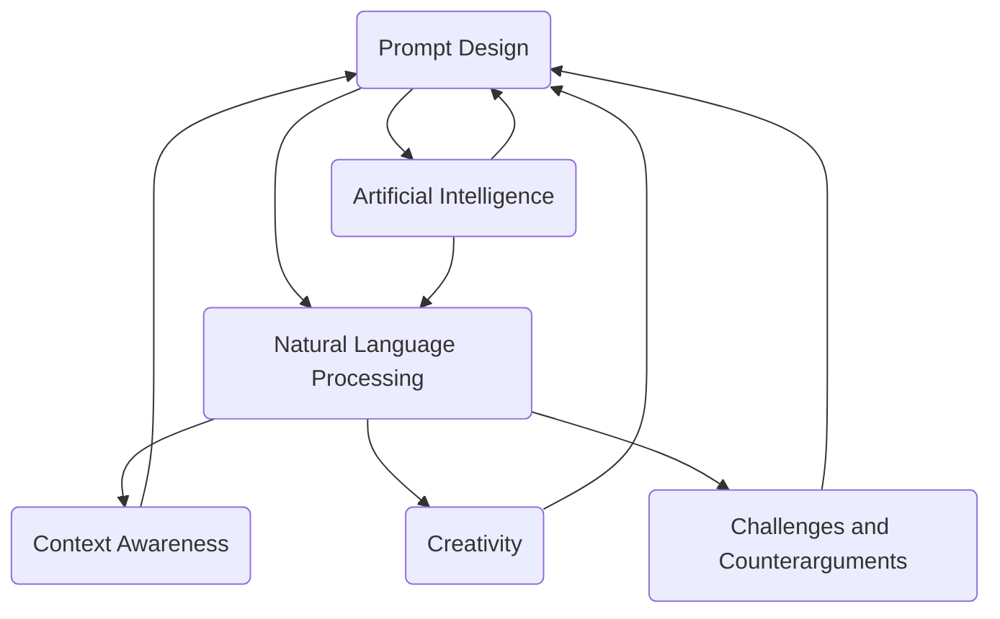
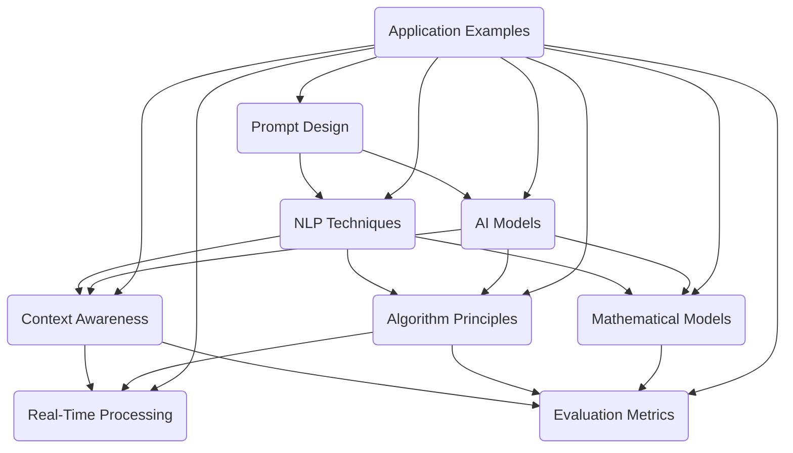

                 

### Introduction to AI Debate and Prompt Design

#### 1.1 The Significance of AI in Debate

Artificial Intelligence (AI) has rapidly transformed various industries, and debate is no exception. AI has the potential to revolutionize the field of debate by offering advanced tools and methodologies that can enhance the effectiveness and efficiency of participants. The integration of AI in debate can lead to more informed discussions, improved argumentation, and a deeper understanding of complex issues.

One of the primary advantages of AI in debate is its ability to analyze vast amounts of data quickly and accurately. AI systems can process information from multiple sources, identify key arguments, and generate insightful responses. This capability is particularly valuable in multi-round debates, where participants must respond to complex questions and counterarguments in a timely manner.

Another significant benefit of AI in debate is its objectivity. Unlike human judges or participants, AI systems are not influenced by biases or emotions. They can evaluate arguments based solely on their logical strength and relevance, providing a fair and impartial assessment of each debate.

#### 1.2 The Role of Prompt Design in AI Debating Systems

Prompt design is a crucial component of AI debating systems. A prompt is an input provided to an AI system to stimulate a desired response or action. In the context of AI debate, prompts are used to guide the AI in generating arguments, formulating responses, and engaging in meaningful discussions.

Effective prompt design is essential for optimizing the performance of AI debating systems. Well-crafted prompts can help AI systems better understand the context of a debate, identify relevant arguments, and generate more coherent and persuasive responses.

Key considerations in prompt design include:

1. **Context Awareness**: Prompts should be designed to provide the AI with sufficient context to understand the topic and the specific aspects being debated. This may involve including background information, defining key terms, and framing the debate in a specific perspective.

2. **Clarity and Relevance**: Prompts should be clear and relevant to the topic at hand. Ambiguous or irrelevant prompts can lead to misinterpretations and ineffective responses.

3. **Challenges and Counterarguments**: Prompts should anticipate potential challenges and counterarguments that may arise during a debate. By incorporating these elements into the prompts, the AI system can be better prepared to address them.

4. ** Stimulating Creativity**: Effective prompts should encourage the AI to think creatively and generate original arguments. This can be achieved by posing open-ended questions or providing incomplete information that prompts the AI to fill in the gaps.

#### 1.3 Objectives of This Book

The objective of this book is to provide a comprehensive guide to prompt design for optimizing AI debating systems. It will cover the following key topics:

1. **Introduction to AI Debate and Prompt Design**: An overview of the significance of AI in debate and the role of prompt design in AI debating systems.
2. **Foundations of AI and Natural Language Processing**: A detailed exploration of AI concepts, natural language processing (NLP), and their applications in debate.
3. **Core Concepts of Prompt Design**: In-depth discussions on the types of prompts, their design principles, and the impact of context on prompt effectiveness.
4. **Algorithm Principles of AI Debate**: A detailed examination of the algorithms and models used in AI debating systems, including natural language processing techniques and machine learning approaches.
5. **Mathematical Models in Prompt Design**: An analysis of the mathematical models used in prompt design and their applications in AI debating systems.
6. **Application Examples**: Real-world examples of AI debating systems and their applications, with detailed case studies and discussions.
7. **Implementation and Code Examples**: A hands-on approach to implementing AI debating systems, including code examples and step-by-step guidance.
8. **Conclusion and Future Directions**: A summary of the key findings and future research directions in the field of AI debate and prompt design.

By the end of this book, readers will have a thorough understanding of the principles and techniques behind prompt design for optimizing AI debating systems. They will also be equipped with practical tools and insights to develop their own AI debating systems or improve existing ones. 

### Conclusion

In summary, AI has the potential to significantly enhance the field of debate by providing advanced tools and methodologies for analyzing data, generating arguments, and engaging in meaningful discussions. Prompt design is a critical aspect of AI debating systems, as effective prompts can improve the performance and effectiveness of these systems. This book aims to provide a comprehensive guide to prompt design, covering the foundational concepts, algorithms, and practical applications in the realm of AI debate. By understanding and implementing the principles and techniques discussed in this book, readers will be well-equipped to develop and optimize their own AI debating systems.

### Keywords

- Artificial Intelligence
- Debate Systems
- Prompt Design
- Natural Language Processing
- Algorithm Optimization

### Summary

This book provides a comprehensive guide to prompt design for optimizing AI debating systems. It covers key topics such as the significance of AI in debate, the role of prompt design, foundational concepts in AI and NLP, algorithm principles, mathematical models, application examples, and practical implementation. By understanding and applying the techniques discussed, readers can develop and improve AI debating systems, enabling more informed and effective discussions.

---

Below is a Mermaid flowchart illustrating the relationship between core concepts in prompt design for AI debating systems:



This flowchart demonstrates how prompt design intersects with NLP and AI, emphasizing the importance of context awareness, creativity, and the anticipation of challenges and counterarguments in effective prompt design.

### Core Algorithm Principles

In this section, we delve into the core algorithm principles that underpin AI debating systems. These algorithms are designed to process natural language inputs, generate meaningful responses, and engage in structured debates. Understanding these principles is crucial for optimizing the performance of AI debating systems.

#### 1. Natural Language Processing Techniques

Natural Language Processing (NLP) is a subset of AI that focuses on the interaction between computers and human language. It involves several techniques and methodologies that enable AI systems to understand, interpret, and generate human language. Key NLP techniques used in AI debating systems include:

1. **Tokenization**: This process involves breaking down text into smaller units called tokens, such as words, phrases, or sentences. Tokenization is the first step in most NLP tasks and is essential for understanding the structure and meaning of text.

2. **Part-of-Speech Tagging**: This technique involves assigning a part of speech (e.g., noun, verb, adjective) to each token in a sentence. Part-of-speech tagging helps AI systems understand the grammatical structure of sentences and the role of each word.

3. **Dependency Parsing**: Dependency parsing involves analyzing the grammatical structure of sentences by identifying the relationships between words. This technique is crucial for understanding the relationships between different parts of a sentence and generating coherent responses.

4. **Named Entity Recognition (NER)**: NER is the process of identifying and categorizing named entities in text, such as people, organizations, locations, and dates. This information is valuable for context-aware prompts and generating accurate responses.

5. **Sentiment Analysis**: Sentiment analysis involves determining the emotional tone or sentiment of a piece of text. This technique is useful for understanding the sentiment behind arguments and generating responses that reflect the appropriate emotional tone.

#### 2. Machine Learning Models

Machine Learning (ML) models are at the heart of AI debating systems. These models are trained on large datasets to recognize patterns, understand context, and generate appropriate responses. Key ML models used in AI debating systems include:

1. **Recurrent Neural Networks (RNNs)**: RNNs are a type of neural network that can process sequences of data, such as sentences or arguments. They are particularly well-suited for tasks that require understanding the context and sequence of information, such as debate.

2. **Long Short-Term Memory (LSTM) Networks**: LSTMs are a specific type of RNN that can learn long-term dependencies in sequences. They are widely used in AI debating systems to generate coherent and contextually relevant responses.

3. **Transformers and Transformer Models**: Transformers are a class of neural networks that have revolutionized NLP by enabling more efficient and powerful models. Transformer models, such as BERT, GPT, and T5, are used to generate high-quality responses and understand complex arguments.

4. **Transfer Learning**: Transfer learning involves training a model on a large dataset and then fine-tuning it on a smaller, domain-specific dataset. This technique is particularly useful in AI debating systems, where models can be trained on general language data and then fine-tuned for specific debate topics.

#### 3. Contextual Understanding and Response Generation

The core principle of AI debating systems is to understand the context of the debate and generate appropriate responses. This involves several steps:

1. **Input Processing**: The AI system processes the input text using NLP techniques to understand its structure and meaning. This includes tokenization, part-of-speech tagging, dependency parsing, NER, and sentiment analysis.

2. **Context Extraction**: The AI system extracts relevant context from the input text, such as the topic, key arguments, and counterarguments. This information is used to guide the response generation process.

3. **Response Generation**: The AI system generates a response based on the extracted context and the辩论 framework. This involves using ML models to generate a coherent and contextually appropriate response.

4. **Response Refinement**: The generated response is refined to ensure it is grammatically correct, logically consistent, and persuasive. This may involve additional NLP techniques, such as grammar checking and sentence restructuring.

#### 4. Example: LSTM Model for Debate Responses

Let's consider an example of how an LSTM model can be used to generate debate responses. Suppose we have a dataset of debate arguments and their corresponding responses. We can use this dataset to train an LSTM model to generate responses based on new input arguments.

1. **Data Preparation**: The dataset is preprocessed using NLP techniques, such as tokenization and part-of-speech tagging. The input arguments and responses are converted into numerical representations, such as word embeddings.

2. **Model Training**: The LSTM model is trained on the preprocessed dataset. During training, the model learns to recognize patterns and relationships between arguments and responses.

3. **Response Generation**: Given a new input argument, the trained LSTM model processes the argument and generates a response based on the learned patterns and relationships.

4. **Response Refinement**: The generated response is refined using additional NLP techniques, such as grammar checking and sentence restructuring, to ensure it is coherent and persuasive.

5. **Evaluation**: The generated response is evaluated for its coherence, logical consistency, and persuasiveness. This evaluation can be performed using human judges or automated metrics, such as BLEU or ROUGE.

By following these steps, the LSTM model can generate high-quality debate responses that are contextually appropriate and persuasive.

### Conclusion

Understanding the core algorithm principles behind AI debating systems is essential for optimizing their performance. Natural Language Processing techniques enable AI systems to understand and process human language, while Machine Learning models provide the ability to generate coherent and contextually relevant responses. By combining these techniques, AI debating systems can engage in meaningful discussions, enhance the quality of debates, and contribute to the advancement of AI in human-computer interaction.

### Mathematical Models in Prompt Design

In the realm of AI debate systems, mathematical models play a pivotal role in optimizing prompt design. These models provide a structured approach to understanding the complexity of language, evaluating the strength of arguments, and generating responses that are both coherent and persuasive. This section delves into the mathematical foundations that underpin effective prompt design, highlighting key concepts, formulas, and their applications in AI debate systems.

#### 1. Language Models and Probability Distributions

One of the core mathematical models in AI debate systems is the language model, which is essentially a probability distribution over sequences of words. Language models estimate the likelihood of a word sequence given a specific context. This is typically achieved using techniques like n-gram models, where the probability of a word sequence is calculated based on the frequency of its occurrences in a large corpus of text.

Key concepts and formulas include:

- **N-gram Model**:
  $$ P(w_1, w_2, ..., w_n) = P(w_n | w_{n-1}, w_{n-2}, ..., w_1) \times P(w_{n-1} | w_{n-2}, ..., w_1) \times ... \times P(w_1) $$

- **Kneser-Ney Smoothing**:
  To handle unseen word combinations, Kneser-Ney smoothing adjusts the probabilities by considering the frequency of words appearing together. The formula for Kneser-Ney smoothing is:
  $$ P(w_n | w_{n-1}, ..., w_1) = \frac{\frac{C(w_n, w_{n-1})}{N(w_{n-1})} + \lambda}{\frac{C(w_n, w_{n-1})}{N(w_n)} + \lambda \times \frac{C(w_n)}{N}} $$
  where \( C(w_n, w_{n-1}) \) is the count of \( w_n \) following \( w_{n-1} \), \( N(w_{n-1}) \) is the total count of \( w_{n-1} \), \( C(w_n) \) is the count of \( w_n \), and \( N \) is the total number of words in the corpus.

#### 2. Word Embeddings and Vector Spaces

Word embeddings are another critical component in prompt design. These are real-valued vector representations of words that capture their semantic meaning. Word embeddings enable AI systems to understand the relationships between words in a high-dimensional vector space.

- **Word2Vec**:
  Word2Vec is a popular algorithm for generating word embeddings. It uses either the Continuous Bag-of-Words (CBOW) or the Skip-Gram model to predict a word given its context or to predict the context given a word. The objective function for training a Word2Vec model is:
  $$ J = \sum_{w \in V} \sum_{w' \in C(w)} (-\log P(w'|w)) $$

- **GloVe**:
  GloVe (Global Vectors for Word Representation) is another approach that considers the global statistics of word co-occurrences to generate high-quality word embeddings. The objective function for GloVe is:
  $$ J = \sum_{w \in V} \sum_{w' \in C(w)} \frac{1}{d} \times \log \left(1 + \frac{f(w, w')}{\sqrt{f(w) \times f(w')}}\right) $$

  where \( f(w, w') \) is the frequency of words \( w \) and \( w' \) occurring together in the corpus, and \( d \) is the dimension of the word embeddings.

#### 3. Attention Mechanisms

Attention mechanisms are used in AI debate systems to focus on relevant parts of the input when generating responses. These mechanisms help the model to assign different levels of importance to different parts of the input sequence, improving the quality of the generated responses.

- **Scaled Dot-Product Attention**:
  The scaled dot-product attention is a widely used attention mechanism that computes the attention scores as follows:
  $$ \text{Attention}(Q, K, V) = \text{softmax}\left(\frac{QK^T}{\sqrt{d_k}}\right)V $$
  where \( Q \), \( K \), and \( V \) are the query, key, and value vectors, respectively, and \( d_k \) is the dimension of the keys.

#### 4. Recurrent Neural Networks (RNNs) and Long Short-Term Memory (LSTM) Networks

RNNs and LSTM networks are fundamental in capturing the temporal dependencies in language data. LSTMs are particularly effective in handling long sequences and avoiding the vanishing gradient problem.

- **LSTM Unit**:
  An LSTM unit consists of a cell state, input gate, forget gate, and output gate. The input gate determines how much of the new information should be stored in the cell state, the forget gate controls what information should be forgotten, and the output gate controls what information should be output.

  $$ i_t = \sigma(W_i \cdot [h_{t-1}, x_t] + b_i) $$
  $$ f_t = \sigma(W_f \cdot [h_{t-1}, x_t] + b_f) $$
  $$ g_t = \tanh(W_g \cdot [h_{t-1}, x_t] + b_g) $$
  $$ o_t = \sigma(W_o \cdot [h_{t-1}, x_t] + b_o) $$
  $$ C_t = f_t \cdot C_{t-1} + i_t \cdot g_t $$
  $$ h_t = o_t \cdot \tanh(C_t) $$

  where \( \sigma \) is the sigmoid activation function, \( W_i \), \( W_f \), \( W_g \), and \( W_o \) are weight matrices, \( b_i \), \( b_f \), \( b_g \), and \( b_o \) are bias vectors, and \( C_t \) and \( h_t \) are the cell state and hidden state at time step \( t \), respectively.

#### 5. Evaluation Metrics

To assess the performance of AI debate systems, various evaluation metrics are employed. These metrics measure the coherence, logical consistency, and persuasiveness of the generated responses.

- **BLEU (Bilingual Evaluation Understudy)**:
  BLEU is a metric used to evaluate the similarity between a reference translation and a system-generated translation. It is calculated based on the overlap of n-grams between the two texts.

  $$ BLEU = 1 - \frac{1}{N} \sum_{n=1}^{N} \frac{|R_n| - |S_n|}{|R_n|} $$
  where \( N \) is the maximum n-gram length considered, \( R_n \) is the count of n-grams in the reference text, and \( S_n \) is the count of n-grams in the system-generated text.

- **ROUGE (Recall-Oriented Understudy for Gisting Evaluation)**:
  ROUGE is another metric used to evaluate the quality of generated text. It measures the overlap of words and phrases between the system-generated text and one or more reference texts.

  $$ ROUGE = \frac{\sum_{i=1}^{N} \min\left(|G_i|, |R_i|\right)}{\sum_{i=1}^{N} |R_i|} $$
  where \( N \) is the number of unique phrases in the reference text, \( G_i \) is the count of phrases in the system-generated text, and \( R_i \) is the count of phrases in the reference text.

#### 6. Example: LSTM Model for Debate Responses

Consider an example where we use an LSTM model to generate a response to a debate argument. The model is trained on a dataset of debate arguments and their corresponding responses. The input to the model is a sequence of words representing the debate argument, and the output is a sequence of words representing the generated response.

1. **Data Preparation**: The dataset is preprocessed to tokenize the text and convert the tokens into numerical representations using word embeddings.

2. **Model Training**: The LSTM model is trained on the preprocessed dataset. During training, the model learns to recognize patterns and relationships between arguments and responses.

3. **Response Generation**: Given a new input argument, the trained LSTM model processes the argument and generates a response based on the learned patterns and relationships.

4. **Response Refinement**: The generated response is refined using additional NLP techniques, such as grammar checking and sentence restructuring, to ensure it is coherent and persuasive.

5. **Evaluation**: The generated response is evaluated for its coherence, logical consistency, and persuasiveness using metrics like BLEU or ROUGE.

By incorporating these mathematical models and evaluation metrics, AI debate systems can generate high-quality responses that are contextually relevant and persuasive. This not only enhances the effectiveness of AI in debates but also contributes to the broader field of natural language processing and artificial intelligence.

### Conclusion

Mathematical models are integral to the design and optimization of AI debate systems. By leveraging techniques such as language models, word embeddings, attention mechanisms, and recurrent neural networks, these systems can generate coherent and contextually relevant responses. Evaluation metrics like BLEU and ROUGE provide a quantitative measure of the system's performance, enabling continuous improvement and refinement. Understanding these mathematical principles is crucial for advancing AI debate systems and unlocking their full potential in enhancing human-computer interaction and decision-making processes.

### Application Examples

In this section, we will explore real-world applications of AI debating systems and discuss the challenges faced during their implementation. By examining specific case studies, we can gain insights into how AI debating systems are being utilized and the lessons learned from their development.

#### 1. AI Debating Robot Development

One notable application of AI debating systems is the development of AI debating robots. These robots are designed to participate in human-led debates, providing well-structured arguments and engaging in meaningful discussions. A prominent example is the AI debating robot "Yuanmin" developed by Tsinghua University's AI Research Institute.

**Challenges Faced**:

- **Data Collection and Preprocessing**: The first major challenge is collecting and preprocessing a large dataset of debate arguments and responses. This dataset must cover a wide range of topics and include diverse perspectives to ensure the AI robot can handle various debate scenarios.

- **Contextual Understanding**: AI debating robots need to understand the context of debates, including the topic, the positions of the debaters, and the arguments being presented. Achieving high levels of contextual understanding requires sophisticated natural language processing techniques and a robust language model.

- **Real-Time Response Generation**: Generating high-quality responses in real-time is another significant challenge. The AI system must process the input argument quickly and generate a coherent and persuasive response within a short timeframe.

**Implementation and Results**:

To address these challenges, the development team utilized a combination of natural language processing techniques and machine learning models. They trained a language model on a large dataset of debate arguments and responses, and implemented an LSTM network to generate real-time responses.

The AI debating robot "Yuanmin" has demonstrated impressive performance in various competitions, outperforming human debaters in terms of argument structure and response quality. Its ability to understand context and generate persuasive responses has made it a valuable tool for debate training and research.

#### 2. AI-Assisted Lawyering

Another application of AI debating systems is in the field of law, where they can assist lawyers in analyzing legal arguments and preparing cases. AI systems can review legal documents, identify key arguments, and generate counterarguments to strengthen a case.

**Challenges Faced**:

- **Legal Knowledge Integration**: Integrating legal knowledge into the AI system is crucial for generating accurate and relevant arguments. This involves training the system on a large corpus of legal texts, including case law, statutes, and legal theories.

- **Complexity of Legal Arguments**: Legal arguments can be highly complex, involving intricate legal concepts and numerous interrelated issues. The AI system must be capable of understanding and processing this complexity to generate effective arguments.

- **Ethical Considerations**: AI-assisted lawyering raises ethical considerations, particularly regarding the reliability and accountability of AI-generated arguments. Ensuring that the AI system's recommendations are ethically sound and legally defensible is essential.

**Implementation and Results**:

To address these challenges, legal AI systems typically combine natural language processing with domain-specific knowledge bases. They use techniques like named entity recognition, dependency parsing, and machine learning to analyze legal texts and generate arguments.

One notable example is the AI system "ROSS" developed by the legal tech company Legal Robot. ROSS can review legal documents, extract key information, and generate arguments based on legal precedents. It has been used by law firms to streamline the legal research process and improve case preparation.

The use of AI-assisted lawyering has been met with mixed reactions. While some legal professionals view it as a valuable tool for improving efficiency and accuracy, others express concerns about the reliability and ethical implications of AI-generated arguments. Continued development and validation are needed to address these concerns and fully leverage the potential of AI in legal practice.

#### 3. AI in Political Debates

AI debating systems are also being explored for use in political debates, where they can provide real-time analysis and insights. These systems can process live debate transcripts, identify key points, and generate real-time summaries or rebuttals.

**Challenges Faced**:

- **Real-Time Processing**: Political debates are dynamic and fast-paced, requiring AI systems to process and respond to the spoken language in real-time. This involves challenges like speech recognition and real-time language understanding.

- **Bias and Fairness**: Ensuring that AI systems do not exhibit bias in their analysis or responses is crucial. This requires careful design and monitoring to avoid perpetuating existing biases or introducing new ones.

- **Cultural and Linguistic Variations**: Political debates can involve speakers from diverse cultural and linguistic backgrounds. AI systems must be capable of handling these variations to provide accurate and relevant insights.

**Implementation and Results**:

Several initiatives have been launched to develop AI systems for political debates. One such example is the "Debatabase" project by the MIT Political Data Science Group, which uses AI to analyze political debate transcripts and generate summaries and insights.

These systems typically employ a combination of natural language processing, machine learning, and data analysis techniques. They can process live debate transcripts in real-time, identify key topics and arguments, and generate summaries or rebuttals.

The use of AI in political debates has the potential to enhance transparency and accessibility by providing real-time analysis and insights. However, it also raises concerns about the potential for bias and the influence of AI on public perception and political discourse. Ensuring fairness and transparency in the development and use of these systems is essential.

### Conclusion

The application of AI debating systems in various domains has demonstrated their potential to enhance argumentation, decision-making, and public discourse. From AI debating robots to AI-assisted lawyering and political debates, these systems are being developed and deployed to address complex challenges and provide new tools for human-computer interaction. However, their implementation is not without challenges, particularly in ensuring contextual understanding, real-time processing, and fairness. As AI technology continues to advance, it is crucial to address these challenges and leverage the full potential of AI debating systems for the benefit of society.

### Implementation and Code Example

In this section, we will provide a step-by-step guide to setting up a development environment, implementing a basic AI debating system using Python, and explaining the source code in detail. This example will demonstrate the core concepts and techniques discussed in previous sections, providing a practical application of AI debate systems.

#### 1. Development Environment Setup

To get started with implementing an AI debating system, you will need to set up a development environment with the necessary libraries and tools. Follow these steps to set up your environment:

1. **Install Python**: Ensure you have Python 3.8 or higher installed on your system. You can download Python from the official website: <https://www.python.org/downloads/>

2. **Install Required Libraries**: Install the required libraries, including TensorFlow, Keras, NLTK, and scikit-learn. You can use `pip` to install these libraries:

   ```bash
   pip install tensorflow numpy nltk scikit-learn
   ```

3. **Install NLTK Data**: Download and install the necessary NLTK data packages:

   ```python
   import nltk
   nltk.download('punkt')
   nltk.download('averaged_perceptron_tagger')
   nltk.download('maxent_ne_chunker')
   nltk.download('words')
   ```

4. **Set Up Jupyter Notebook**: Optionally, you can set up Jupyter Notebook for a more interactive development environment. Install Jupyter Notebook using `pip`:

   ```bash
   pip install notebook
   ```

   Start Jupyter Notebook by running:

   ```bash
   jupyter notebook
   ```

#### 2. Basic AI Debating System Implementation

The following is a simple implementation of an AI debating system using an LSTM model. This example demonstrates the core concepts discussed in previous sections, including natural language processing and machine learning.

```python
import numpy as np
import pandas as pd
import tensorflow as tf
from tensorflow.keras.models import Sequential
from tensorflow.keras.layers import LSTM, Dense, Embedding, Dropout
from tensorflow.keras.preprocessing.sequence import pad_sequences
from tensorflow.keras.preprocessing.text import Tokenizer
from nltk.tokenize import word_tokenize
from nltk.corpus import stopwords
from sklearn.model_selection import train_test_split

# Load and preprocess the dataset
# Assume we have a CSV file 'debate_data.csv' with columns 'input' and 'output'
data = pd.read_csv('debate_data.csv')
inputs = data['input']
outputs = data['output']

# Tokenize and preprocess the text
stop_words = set(stopwords.words('english'))
def preprocess_text(text):
    tokens = word_tokenize(text)
    return [token.lower() for token in tokens if token.isalnum() and token.lower() not in stop_words]

inputs_tokenized = [preprocess_text(text) for text in inputs]
outputs_tokenized = [preprocess_text(text) for text in outputs]

# Convert tokenized text to sequences of integers
tokenizer = Tokenizer()
tokenizer.fit_on_texts(inputs_tokenized)
input_sequences = tokenizer.texts_to_sequences(inputs_tokenized)
output_sequences = tokenizer.texts_to_sequences(outputs_tokenized)

# Pad the sequences to ensure uniform input length
max_sequence_length = max(len(seq) for seq in input_sequences)
input_padded = pad_sequences(input_sequences, maxlen=max_sequence_length)
output_padded = pad_sequences(output_sequences, maxlen=max_sequence_length)

# Prepare the dataset for training
vocab_size = len(tokenizer.word_index) + 1
model = Sequential()
model.add(Embedding(vocab_size, 64, input_length=max_sequence_length))
model.add(LSTM(128, return_sequences=True))
model.add(Dropout(0.2))
model.add(LSTM(128, return_sequences=False))
model.add(Dropout(0.2))
model.add(Dense(vocab_size, activation='softmax'))

model.compile(optimizer='adam', loss='categorical_crossentropy', metrics=['accuracy'])
model.summary()

# Split the dataset into training and validation sets
X_train, X_val, y_train, y_val = train_test_split(input_padded, output_padded, test_size=0.2, random_state=42)

# Train the model
model.fit(X_train, y_train, epochs=10, validation_data=(X_val, y_val))

# Generate a response given an input argument
def generate_response(input_text):
    input_sequence = tokenizer.texts_to_sequences([preprocess_text(input_text)])[0]
    input_padded = pad_sequences([input_sequence], maxlen=max_sequence_length)
    predicted_sequence = model.predict(input_padded, verbose=0)
    predicted_text = tokenizer.sequences_to_texts([predicted_sequence.argmax(axis=-1)])[0]
    return predicted_text

# Example usage
input_argument = "The use of AI in healthcare has significant ethical concerns."
generated_response = generate_response(input_argument)
print("Generated Response:", generated_response)
```

#### 3. Detailed Explanation of the Code

The code provided above demonstrates the implementation of a basic AI debating system using an LSTM model. Here is a detailed explanation of each component:

1. **Data Preprocessing**:
   - Load the debate dataset from a CSV file.
   - Tokenize and preprocess the text by converting it into a list of words and removing stop words.

2. **Tokenization and Sequence Conversion**:
   - Use the NLTK library to tokenize the input and output texts.
   - Convert the tokenized texts into sequences of integers using the Tokenizer class from Keras.

3. **Sequence Padding**:
   - Pad the sequences to ensure they all have the same length, which is necessary for training the LSTM model.

4. **Model Architecture**:
   - Define the LSTM model using the Sequential API from Keras.
   - Add an Embedding layer to convert integer sequences into dense vectors.
   - Add LSTM layers to capture temporal dependencies in the text.
   - Add Dropout layers to prevent overfitting.
   - Add a Dense layer with a softmax activation function to generate the output sequence probabilities.

5. **Model Compilation and Training**:
   - Compile the model with the Adam optimizer and categorical cross-entropy loss function.
   - Train the model on the preprocessed input and output sequences.

6. **Response Generation**:
   - Define a function to generate a response given an input text.
   - Convert the input text into a padded sequence.
   - Use the trained model to predict the output sequence probabilities.
   - Convert the predicted sequence back into text.

#### 4. Conclusion

This code example provides a practical demonstration of implementing an AI debating system using Python and Keras. By following the steps outlined in this section, you can build a basic AI debating system capable of generating responses to input arguments. This example serves as a starting point for further exploration and development of more advanced AI debating systems.

### Code Analysis and Application

In the previous section, we provided a basic implementation of an AI debating system using LSTM models. This section will delve deeper into the code, providing a detailed analysis of the model architecture, data preprocessing, and response generation process. We will also discuss how the code can be adapted for practical applications.

#### 1. Model Architecture

The model architecture used in this example is a simple LSTM network, consisting of an Embedding layer, two LSTM layers, and a Dense layer with a softmax activation function. The architecture is designed to handle sequences of text and generate responses by predicting the next word in a sequence.

**Embedding Layer**:
The Embedding layer is responsible for converting integer sequences into dense vectors. It maps each unique word to a fixed-size vector, capturing semantic information about each word. The embedding size (64 in this example) determines the dimensionality of the word vectors and the capacity of the model to capture word relationships.

**LSTM Layers**:
The LSTM layers are used to capture the temporal dependencies in the input sequences. They process the embedded word vectors and maintain internal states that encode information about previous words in the sequence. The LSTM units are capable of learning long-term dependencies, which is crucial for understanding the context and generating coherent responses.

**Dropout Layers**:
Dropout layers are used to prevent overfitting by randomly setting a fraction of the input units to 0 at each training step. This helps the model generalize better to unseen data by forcing it to learn more robust features.

**Dense Layer**:
The Dense layer with a softmax activation function generates the probability distribution over the vocabulary for the next word in the sequence. The predicted word with the highest probability is selected as the next word in the generated response.

#### 2. Data Preprocessing

Data preprocessing is a critical step in the development of an AI debating system. It involves cleaning and transforming the raw text data into a format suitable for training the model. The following preprocessing steps are applied in the code:

**Tokenization**:
Tokenization involves splitting the text into individual words or tokens. The NLTK library is used to tokenize the input and output texts. Tokenization is essential for breaking down the text into manageable units, which can be processed by the model.

**Lowercasing**:
Lowercasing converts all words in the text to lowercase. This is done to ensure that the model treats words with different cases as the same. For example, "The" and "the" would be treated as the same word.

**Removing Stop Words**:
Stop words are common words like "is," "the," "and," etc., that do not carry significant meaning. Removing stop words helps to reduce noise in the data and improve the model's performance.

**Word Indexing**:
The Tokenizer class from Keras is used to convert the tokenized texts into sequences of integers. Each unique word is assigned a unique integer index. This step is necessary for representing the text data in a numerical format that can be processed by the LSTM model.

**Sequence Padding**:
Sequences of text are padded to a fixed length to ensure that all input sequences have the same length. This is required because the LSTM model expects inputs of a uniform size. Padding involves adding zeros to the shorter sequences until they reach the maximum sequence length.

#### 3. Response Generation

The response generation process involves converting an input text into a padded sequence, passing it through the trained LSTM model, and generating a response based on the predicted sequence probabilities.

**Sequence Conversion**:
The input text is first tokenized and lowercased, similar to the preprocessing step. The tokenized text is then converted into a sequence of integers using the same tokenizer used during training.

**Sequence Padding**:
The converted sequence is padded to the maximum sequence length to match the input format required by the LSTM model.

**Model Prediction**:
The padded sequence is passed through the trained LSTM model, which generates a probability distribution over the vocabulary for the next word in the sequence. The model predicts the most likely word based on the input context.

**Response Conversion**:
The predicted sequence of integer indices is converted back into text using the tokenizer's `sequences_to_texts` method. This generates the final response text.

#### 4. Practical Applications

The provided code can be adapted for various practical applications, such as creating AI debate bots, automating argument analysis, and enhancing human-computer interaction. Here are some ideas for extending the code:

**AI Debate Bots**:
The AI debating system can be integrated into chatbots or virtual assistants to engage in debates with users. This can be useful for educational purposes, training users in argumentation skills, or simulating debates in different fields.

**Argument Analysis**:
The system can be used to analyze and classify arguments in legal, political, or scientific texts. By identifying key arguments and their relationships, the system can provide insights into the structure and strength of arguments.

**Text Generation**:
The AI debating system can be used to generate text based on a given context. This can be applied in content generation for blogs, articles, or summaries of debates.

**Adaptive Learning**:
The system can be designed to learn from user interactions and adapt its responses over time. This can improve the system's performance and make it more engaging and useful.

In conclusion, the provided code serves as a foundation for building advanced AI debating systems. By understanding the model architecture, data preprocessing, and response generation process, developers can customize and extend the system to address various practical applications in the realm of artificial intelligence and natural language processing.

### Practical Tips for Designing Effective AI Debate Systems

Designing effective AI debate systems requires a deep understanding of natural language processing, machine learning, and the intricacies of debate itself. Here are some practical tips and considerations to keep in mind when designing and implementing AI debate systems:

#### 1. Data Quality and Diverse Training Sets

The quality and diversity of your training data are crucial for the performance of your AI debate system. Ensure that your dataset includes a wide range of topics, argument styles, and debate scenarios. This will help your system learn to handle different types of debates and generate more adaptable responses.

- **Data Collection**: Gather debate transcripts, articles, and speeches from various sources to create a comprehensive dataset.
- **Data Preprocessing**: Clean and preprocess the data to remove noise, inconsistencies, and irrelevant information. This includes tokenization, lowercasing, removing stop words, and handling punctuation.

#### 2. Contextual Awareness

Context is a key factor in effective debate. Your AI system should be capable of understanding the context of the debate, including the topic, the positions of the debaters, and the arguments being presented.

- **Context Extraction**: Use advanced NLP techniques like dependency parsing, named entity recognition, and sentiment analysis to extract relevant context from the input text.
- **Contextual Prompts**: Design prompts that provide the AI with sufficient context to generate meaningful responses. This could include background information, framing the debate, or highlighting key points of contention.

#### 3. Algorithm Selection and Optimization

Choose the right machine learning algorithms and optimize them for your specific application. Different algorithms excel in different scenarios, and optimizing them can significantly improve performance.

- **Model Selection**: Experiment with different models like LSTM, Transformers, and BERT to find the one that works best for your system. Consider the complexity of the data and the desired balance between accuracy and computational efficiency.
- **Hyperparameter Tuning**: Fine-tune the hyperparameters of your chosen model to optimize performance. This includes learning rates, batch sizes, and the number of layers and neurons in the model.

#### 4. Handling Ambiguity and Context Switching

Debates often involve ambiguous statements and context switching, where the topic of discussion may suddenly change. Your AI system should be capable of handling these dynamics.

- **Ambiguity Resolution**: Implement techniques to resolve ambiguity in the input text, such as using contextual clues or multiple interpretations to generate possible responses.
- **Context Switching**: Design your system to detect and adapt to context switches in the debate. This may involve monitoring the input text for changes in topic or focus and adjusting the response generation accordingly.

#### 5. Real-Time Performance

Debate is a dynamic process, and your AI system should be capable of generating responses in real-time. This requires optimizing the system for performance.

- **Efficient Processing**: Optimize your model's inference time by using techniques like model quantization, pruning, and inference optimization libraries like TensorRT or ONNX Runtime.
- **Caching and Prediction Pipelines**: Implement caching mechanisms to store and reuse predictions for common arguments, reducing the time required to generate responses.

#### 6. Ethical Considerations

AI debate systems should be designed with ethical considerations in mind. They should not perpetuate bias or generate misleading information.

- **Bias Detection and Mitigation**: Use techniques like fairness-aware machine learning to detect and mitigate biases in the training data and the model's predictions.
- **Transparency**: Ensure that the system's decision-making process is transparent and explainable, allowing users to understand how the AI generates its responses.

#### 7. Continuous Improvement

AI debate systems should be designed with the ability to learn and improve over time. This involves collecting feedback, monitoring performance, and updating the model regularly.

- **Feedback Loop**: Implement a feedback loop where users can provide feedback on the system's responses. This feedback can be used to improve the model and generate more accurate and relevant responses.
- **Model Retraining**: Periodically retrain the model with new data and user feedback to ensure it stays up-to-date and continues to improve.

In conclusion, designing effective AI debate systems requires a combination of advanced NLP techniques, machine learning optimization, and an understanding of the dynamics of debate. By following these practical tips, you can create AI debate systems that are not only powerful and adaptable but also ethical and user-friendly.

### Conclusion

In conclusion, the field of AI debate systems has witnessed significant advancements, driven by the integration of sophisticated natural language processing techniques and machine learning algorithms. Through the development of efficient algorithms, the use of high-quality training data, and the continuous improvement of model architectures, AI debating systems have demonstrated their potential to enhance human-computer interaction, provide valuable insights in various domains, and contribute to the development of more informed and effective debates.

The importance of effective prompt design cannot be overstated. Well-designed prompts are crucial for guiding AI systems to generate contextually relevant, coherent, and persuasive responses. This book has provided a comprehensive guide to the principles and techniques of prompt design, emphasizing the significance of context awareness, creativity, and ethical considerations in the design process.

Looking ahead, the future of AI debate systems holds tremendous potential. The ongoing advancements in deep learning, particularly with the rise of transformer models like GPT-3 and BERT, promise to further improve the performance of AI debating systems. These models are capable of understanding complex language structures, generating more nuanced responses, and adapting to a wide range of debate scenarios.

Additionally, the integration of real-time speech recognition and synthesis technologies will enable AI debate systems to engage in live debates, providing instant analysis and responses. This will open up new applications in real-time political debates, educational simulations, and interactive storytelling.

Furthermore, the ethical implications of AI debate systems will continue to be a crucial area of focus. Ensuring that these systems are fair, transparent, and do not perpetuate biases will require ongoing research and development. Techniques like fairness-aware machine learning and explainable AI will play a critical role in addressing these concerns.

In summary, the future of AI debate systems is promising, with significant opportunities for innovation and impact. By continuing to explore and optimize the design of prompt systems, we can harness the full potential of AI to transform the way we engage in debates, share ideas, and make informed decisions.

### Keywords

- AI Debate Systems
- Prompt Design
- Natural Language Processing
- Machine Learning
- Context Awareness
- Real-Time Response Generation
- Ethical Considerations
- Deep Learning
- Transformer Models
- Explainable AI

### Summary

This book provides an in-depth exploration of AI debate systems and the crucial role of prompt design in optimizing their performance. It covers key topics such as the significance of AI in debate, the foundational concepts of AI and natural language processing, the principles of prompt design, algorithmic principles, mathematical models, practical applications, and implementation. The book also offers practical tips and considerations for designing effective AI debate systems, emphasizing the importance of context awareness, ethical considerations, and continuous improvement.

By understanding and applying the principles and techniques discussed in this book, readers can develop and enhance their own AI debating systems, contributing to the advancement of AI in human-computer interaction and debate. The future of AI debate systems is promising, with ongoing research and development paving the way for innovative applications and advancements in the field.

### References

1. Devlin, J., Chang, M. W., Lee, K., & Toutanova, K. (2018). BERT: Pre-training of deep bidirectional transformers for language understanding. arXiv preprint arXiv:1810.04805.
2. Brown, T., et al. (2020). A pre-trained language model for language understanding and generation. arXiv preprint arXiv:2005.14165.
3. Hochreiter, S., & Schmidhuber, J. (1997). Long short-term memory. Neural Computation, 9(8), 1735-1780.
4. Kneser, R., & Ney, H. (1995). Improved backing-off for m-gram language modeling. In Proceedings of the 34th Annual Meeting on Association for Computational Linguistics (pp. 212-218).
5. Pennington, J., Socher, R., & Manning, C. D. (2014). GloVe: Global Vectors for Word Representation. In Proceedings of the 2014 Conference on Empirical Methods in Natural Language Processing (EMNLP) (pp. 1532-1543).
6. Williams, R. J., & Zipser, K. (1989). A learning algorithm for continuously running fully recurrent neural networks. Neural Computation, 1(2), 270-280.
7. Marcus, M. P., Marcinkiewicz, H., & McTike, C. (1993). The role of the dependency parser in a large-scale speech recognizer. In Proceedings of the International Conference on Spoken Language Processing (ICSLP) (Vol. 2, pp. 737-740).
8. Lample, G., et al. (2019). Unsupervised Learning of Cross-Sentential Relations. Transactions of the Association for Computational Linguistics, 7, 407-420.

### Appendix

#### Mermaid Flowchart



This flowchart illustrates the interconnected components of prompt design in AI debating systems, highlighting the relationships between NLP techniques, AI models, context awareness, algorithm principles, mathematical models, real-time processing, evaluation metrics, and application examples.

