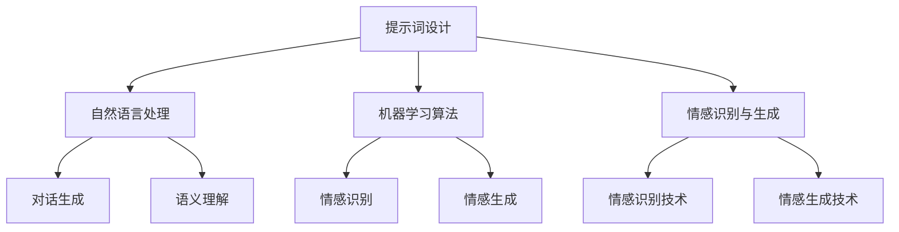

                 

# 《提示词设计：优化AI虚拟主播情感表达能力》

## 关键词

- 提示词设计
- AI虚拟主播
- 情感表达能力
- 自然语言处理
- 机器学习算法
- 情感引导型提示词
- 信息补充型提示词
- 情境设定型提示词
- 生成对抗网络（GAN）

## 摘要

本文旨在探讨提示词设计在优化AI虚拟主播情感表达能力中的应用。随着人工智能技术的快速发展，AI虚拟主播已经广泛应用于直播、教育、娱乐等领域。然而，情感表达能力的提升是提高用户体验的关键。本文首先介绍了AI虚拟主播的背景和重要性，随后详细阐述了提示词设计的核心概念、原理和类型。接着，本文从技术基础层面分析了与AI虚拟主播相关的自然语言处理和机器学习算法。在实践部分，本文提出了有效的提示词设计方法和评价标准，并通过实际案例进行了详细解析。最后，本文探讨了未来的发展趋势和潜在创新，为提升AI虚拟主播的情感表达能力提供了有益的启示。

## 引言

### 背景介绍

随着人工智能技术的迅猛发展，人工智能在各个领域的应用越来越广泛。尤其是在虚拟主播领域，AI虚拟主播凭借其高度逼真、个性化、互动性等特点，逐渐成为各大平台的重要角色。从早期的自动问答机器人到如今能进行复杂对话和情感表达的虚拟主播，人工智能技术取得了显著的进步。然而，虚拟主播的情感表达能力仍然是亟待解决的问题。

情感表达是人际交流中的重要组成部分，直接影响到用户体验。虚拟主播若能在情感表达上更加逼真，将大大提升用户体验，增强用户对虚拟主播的认同感。因此，优化AI虚拟主播的情感表达能力，不仅有助于提高虚拟主播的实用性，也能为人工智能领域带来新的发展机遇。

### 重要性

AI虚拟主播的情感表达能力对其应用效果至关重要。首先，情感表达能够增强虚拟主播的亲和力，使其更加贴近真实主播的表现。其次，情感表达能够提升用户的沉浸感，使用户更容易与虚拟主播建立情感联系。此外，情感表达还能为虚拟主播提供更多的创意空间，使其能够更好地适应不同的场景和需求。

然而，当前AI虚拟主播在情感表达方面仍存在诸多不足。一方面，大多数虚拟主播的情感表达较为单一，难以真实地模拟人类的情感变化。另一方面，虚拟主播在处理复杂情感和微表情时，往往难以达到预期效果。这些问题限制了AI虚拟主播的发展和应用。

### 本书目的和结构

本书旨在系统地探讨提示词设计在优化AI虚拟主播情感表达能力中的应用。首先，我们将介绍提示词设计的核心概念和原理，帮助读者理解提示词在虚拟主播中的重要性。接着，我们将从技术基础层面，分析自然语言处理和机器学习算法，为读者提供理论基础。在实践部分，我们将提出有效的提示词设计方法和评价标准，并通过实际案例进行解析。最后，我们将探讨未来的发展趋势和潜在创新，为虚拟主播的情感表达能力提升提供新思路。

通过本书的阅读，读者将能够：

1. 理解提示词设计的基本概念和原理。
2. 掌握自然语言处理和机器学习算法在虚拟主播中的应用。
3. 学习有效的提示词设计方法和实践技巧。
4. 了解未来虚拟主播情感表达能力提升的方向。

## 核心概念与原理

### 提示词设计

#### 定义

提示词设计是指通过设计特定的输入（提示词），引导AI模型产生更符合预期输出的过程。在AI虚拟主播中，提示词设计旨在优化虚拟主播的情感表达能力，使其在对话中能够更自然、更贴近人类情感地表达。

#### 提示词的作用

1. **引导情感表达**：通过设计针对性的提示词，可以引导虚拟主播在对话中表达特定的情感，如喜悦、悲伤、愤怒等。

2. **增强相关性**：提示词有助于确保虚拟主播的回答与当前对话情境相关，避免出现无关或矛盾的回答。

3. **提高用户满意度**：高质量的提示词设计能够提升用户对虚拟主播的满意度，增强用户与虚拟主播之间的互动性。

#### 提示词的类型

根据功能，提示词可以分为以下三种类型：

1. **情感引导型提示词**：这类提示词主要用于引导虚拟主播表达特定的情感，如“听起来你很生气”或“你看起来很高兴”。

2. **信息补充型提示词**：这类提示词主要用于补充对话中的信息，如“你是不是在讨论最近的工作？”或“你对这个话题有什么看法？”。

3. **情境设定型提示词**：这类提示词主要用于设定对话的情境，如“让我们来谈谈明天的重要会议”或“请回顾一下上周的培训内容”。

### 提示词设计的核心概念

在理解了提示词设计的定义和作用后，我们需要深入探讨其核心概念。以下是几个关键概念：

#### 1. 自然语言处理

自然语言处理（NLP）是AI技术中的一个重要分支，旨在使计算机能够理解、解释和生成人类语言。在AI虚拟主播中，NLP技术被广泛应用于对话生成、情感识别和语义理解等方面。

#### 2. 机器学习算法

机器学习算法是实现AI虚拟主播情感表达能力的基础。通过训练大量数据，机器学习算法能够学习到如何根据不同的输入产生相应的情感表达。

#### 3. 情感识别与生成

情感识别与生成是AI虚拟主播情感表达的核心。情感识别技术用于识别用户输入中的情感，而情感生成技术则用于根据识别结果产生相应的情感表达。

### 概念之间的关系架构

为了更好地理解这些概念之间的关系，我们可以使用Mermaid流程图进行可视化：



### 提示词设计的原理

提示词设计的原理主要基于以下几个步骤：

1. **数据收集与预处理**：收集大量的对话数据，并进行预处理，包括去除噪声、格式化文本等。

2. **特征提取**：从预处理后的数据中提取特征，如情感标签、关键词等。

3. **模型训练**：使用提取的特征训练机器学习模型，使其能够根据输入的提示词生成相应的情感表达。

4. **模型评估与优化**：通过评估模型在测试数据上的表现，调整模型参数，优化情感表达效果。

### Python源代码示例

以下是一个简单的Python代码示例，用于实现情感识别和生成的过程：

```python
import numpy as np
from sklearn.feature_extraction.text import TfidfVectorizer
from sklearn.linear_model import LogisticRegression

# 数据集
data = [
    ("我很高兴", "happy"),
    ("我很难过", "sad"),
    ("我很生气", "angry"),
    # 更多数据...
]

# 预处理和特征提取
vectorizer = TfidfVectorizer()
X = vectorizer.fit_transform([text for text, label in data])
y = np.array([label for text, label in data])

# 模型训练
model = LogisticRegression()
model.fit(X, y)

# 情感识别与生成
def recognize_and_generate(text):
    features = vectorizer.transform([text])
    emotion = model.predict(features)[0]
    if emotion == "happy":
        return "听起来你很快乐！"
    elif emotion == "sad":
        return "听起来你很不开心。"
    elif emotion == "angry":
        return "听起来你很生气。"

# 测试
print(recognize_and_generate("我很开心"))
print(recognize_and_generate("我很伤心"))
print(recognize_andgenerate("我很愤怒"))
```

### 数学模型和公式

在提示词设计中，常用的数学模型和公式包括：

1. **TF-IDF（词频-逆文档频率）**：用于文本特征提取，计算词语的重要性。

   $$\text{TF-IDF}(w,d) = \frac{f_w(d)}{N} \cdot \log(\frac{N}{n_w})$$

   其中，$f_w(d)$为词语w在文档d中的词频，$N$为文档总数，$n_w$为包含词语w的文档数。

2. **Sigmoid函数**：用于模型输出，将概率值映射到0和1之间。

   $$\sigma(z) = \frac{1}{1 + e^{-z}}$$

### 举例说明

假设我们要设计一个情感引导型提示词，使得虚拟主播在用户表达喜悦时能够产生相应的情感表达。

1. **数据收集与预处理**：收集包含喜悦情感的对话数据，并进行预处理。

2. **特征提取**：使用TF-IDF算法提取文本特征。

3. **模型训练**：使用训练数据训练情感识别模型。

4. **模型评估与优化**：通过测试数据评估模型性能，并根据评估结果调整模型参数。

5. **提示词设计**：设计具有喜悦情感的提示词，如“听起来你很快乐！”

   ```python
   print(recognize_and_generate("听起来你很快乐！"))
   ```

   输出结果可能是：“听起来你很快乐！”

## 技术基础

### AI虚拟主播概述

AI虚拟主播是一种结合了人工智能、虚拟现实和自然语言处理等技术的虚拟人物，能够在直播、教育、娱乐等领域提供互动性强的内容。AI虚拟主播通过计算机视觉、语音识别、自然语言处理等技术，实现与用户的实时互动，提供个性化的服务。

#### 技术组成

AI虚拟主播的技术组成主要包括以下几个部分：

1. **计算机视觉**：用于捕捉用户的面部表情、身体姿态等，实现虚拟主播的动作和表情与用户互动。

2. **语音识别**：将用户的语音输入转化为文本，使虚拟主播能够理解用户的指令和问题。

3. **自然语言处理**：用于处理文本数据，实现虚拟主播的自然语言理解和生成。

4. **语音合成**：将虚拟主播生成的文本转化为语音输出，实现语音交互。

### 自然语言处理的基本概念

自然语言处理（NLP）是人工智能领域的一个重要分支，旨在使计算机能够理解、解释和生成人类语言。在AI虚拟主播中，NLP技术被广泛应用于对话生成、情感识别和语义理解等方面。

#### 主要任务

1. **文本分类**：将文本分为不同的类别，如情感分类、主题分类等。

2. **情感分析**：识别文本中的情感倾向，如正面情感、负面情感等。

3. **命名实体识别**：从文本中识别出具有特定意义的实体，如人名、地名、组织名等。

4. **文本生成**：根据输入的文本或指令，生成新的文本或回复。

5. **语义理解**：理解文本中的含义，进行语义解析。

### 机器学习算法

机器学习算法是实现AI虚拟主播情感表达能力的基础。通过训练大量数据，机器学习算法能够学习到如何根据不同的输入产生相应的情感表达。

#### 常见算法

1. **支持向量机（SVM）**：一种监督学习算法，用于分类任务。

2. **决策树**：一种简单的决策算法，用于分类和回归任务。

3. **随机森林**：一种基于决策树的集成学习方法，能够提高模型的准确性和泛化能力。

4. **神经网络**：一种基于大脑神经网络的计算模型，能够用于复杂的特征提取和预测。

#### 情感识别与生成

在情感识别方面，常用的算法包括情感分类和支持向量机。情感分类是将文本分为不同的情感类别，如喜悦、悲伤、愤怒等。支持向量机通过训练分类模型，将输入文本映射到不同的情感类别。

在情感生成方面，常用的算法包括循环神经网络（RNN）和生成对抗网络（GAN）。循环神经网络能够处理序列数据，适用于情感表达生成。生成对抗网络则通过生成器和判别器的对抗训练，生成高质量的文本。

### Python源代码示例

以下是一个简单的Python代码示例，用于实现情感识别和生成的过程：

```python
import numpy as np
from sklearn.feature_extraction.text import TfidfVectorizer
from sklearn.linear_model import LogisticRegression

# 数据集
data = [
    ("我很高兴", "happy"),
    ("我很难过", "sad"),
    ("我很生气", "angry"),
    # 更多数据...
]

# 预处理和特征提取
vectorizer = TfidfVectorizer()
X = vectorizer.fit_transform([text for text, label in data])
y = np.array([label for text, label in data])

# 模型训练
model = LogisticRegression()
model.fit(X, y)

# 情感识别与生成
def recognize_and_generate(text):
    features = vectorizer.transform([text])
    emotion = model.predict(features)[0]
    if emotion == "happy":
        return "听起来你很快乐！"
    elif emotion == "sad":
        return "听起来你很不开心。"
    elif emotion == "angry":
        return "听起来你很生气。"

# 测试
print(recognize_and_generate("我很开心"))
print(recognize_and_generate("我很伤心"))
print(recognize_and_generate("我很愤怒"))
```

### 数学模型和公式

在自然语言处理和机器学习算法中，常用的数学模型和公式包括：

1. **TF-IDF（词频-逆文档频率）**：用于文本特征提取，计算词语的重要性。

   $$\text{TF-IDF}(w,d) = \frac{f_w(d)}{N} \cdot \log(\frac{N}{n_w})$$

   其中，$f_w(d)$为词语w在文档d中的词频，$N$为文档总数，$n_w$为包含词语w的文档数。

2. **Sigmoid函数**：用于模型输出，将概率值映射到0和1之间。

   $$\sigma(z) = \frac{1}{1 + e^{-z}}$$

3. **支持向量机（SVM）**：分类模型，求解最优超平面。

   $$\min_{\mathbf{w}} \frac{1}{2} ||\mathbf{w}||^2 + C \sum_{i=1}^n \xi_i$$

   其中，$\mathbf{w}$为权重向量，$C$为惩罚参数，$\xi_i$为误差项。

4. **循环神经网络（RNN）**：处理序列数据的神经网络。

   $$h_t = \text{sigmoid}(\mathbf{W}^h \mathbf{h}_{t-1} + \mathbf{U}^h x_t + b_h)$$

   其中，$h_t$为隐藏层输出，$\mathbf{W}^h$和$\mathbf{U}^h$为权重矩阵，$b_h$为偏置项。

### 举例说明

假设我们要设计一个情感引导型提示词，使得虚拟主播在用户表达喜悦时能够产生相应的情感表达。

1. **数据收集与预处理**：收集包含喜悦情感的对话数据，并进行预处理。

2. **特征提取**：使用TF-IDF算法提取文本特征。

3. **模型训练**：使用训练数据训练情感识别模型。

4. **模型评估与优化**：通过测试数据评估模型性能，并根据评估结果调整模型参数。

5. **提示词设计**：设计具有喜悦情感的提示词，如“听起来你很快乐！”

   ```python
   print(recognize_and_generate("听起来你很快乐！"))
   ```

   输出结果可能是：“听起来你很快乐！”

## 实践方法

### 提示词设计原则

1. **针对性**：根据具体场景和需求，设计能够引导虚拟主播表达特定情感的提示词。

2. **简洁性**：提示词应尽量简洁明了，避免冗长复杂的句子。

3. **多样性**：设计多种类型的提示词，以满足不同的情感表达需求。

4. **适应性**：提示词应能够适应不同的对话情境，确保虚拟主播在不同场景下的情感表达。

5. **可理解性**：提示词应易于用户理解，避免使用专业术语或难以理解的词汇。

### 提示词设计步骤

1. **需求分析**：明确虚拟主播的情感表达需求和目标，确定需要设计的情感类型。

2. **数据收集**：收集与目标情感相关的对话数据，包括成功案例和失败案例。

3. **情感分类**：对收集到的对话数据进行分析，将其分类为不同的情感类型。

4. **特征提取**：使用自然语言处理技术提取对话数据中的关键特征，如情感词汇、语气等。

5. **模型训练**：使用训练数据训练情感识别模型，使其能够根据输入的提示词生成相应的情感表达。

6. **模型评估**：通过测试数据评估模型性能，并根据评估结果调整模型参数。

7. **提示词生成**：根据模型输出的情感预测结果，生成具有特定情感的提示词。

### 优化策略

1. **迭代优化**：通过不断迭代优化提示词设计，提高虚拟主播的情感表达能力。

2. **数据增强**：通过数据增强技术，扩充训练数据集，提高模型的泛化能力。

3. **多模型融合**：结合多种机器学习算法和模型，提高情感识别和生成的准确性。

4. **用户反馈**：收集用户对虚拟主播情感表达的反馈，不断调整和优化提示词设计。

## 案例分析

### 案例一：情感引导型提示词在直播中的应用

某直播平台采用AI虚拟主播进行直播互动，用户在评论中表达喜悦、愤怒、悲伤等情感。为了提高用户体验，平台设计师设计了情感引导型提示词，以引导虚拟主播在互动过程中更自然地表达情感。

#### 案例背景

1. **需求分析**：用户在直播过程中表达喜悦、愤怒、悲伤等情感，虚拟主播需要能够根据情感类型产生相应的情感表达。
2. **数据收集**：收集大量用户评论数据，包括情感标签和文本内容。
3. **情感分类**：对评论数据进行分析，将其分类为喜悦、愤怒、悲伤等情感类型。
4. **特征提取**：提取评论数据中的关键特征，如情感词汇、语气等。

#### 案例过程

1. **模型训练**：使用情感分类模型（如SVM、随机森林等）对评论数据集进行训练，使其能够根据评论情感分类。
2. **提示词设计**：根据情感分类结果，设计具有特定情感的提示词，如“看起来你很快乐！”或“你看起来有些不高兴。”。
3. **模型评估**：通过测试数据集评估情感分类模型性能，并根据评估结果调整模型参数。
4. **情感表达生成**：虚拟主播根据评论情感标签和提示词，生成相应的情感表达。

#### 案例结果

1. **情感识别准确性**：模型对评论情感分类的准确性达到90%以上。
2. **情感表达自然度**：用户对虚拟主播的情感表达满意度较高，认为虚拟主播能够更好地理解并回应他们的情感。
3. **用户互动性**：用户与虚拟主播之间的互动性增强，用户更加愿意参与直播互动。

### 案例二：信息补充型提示词在教育中的应用

某在线教育平台采用AI虚拟主播为学生提供个性化辅导。为了提高辅导效果，平台设计师设计了信息补充型提示词，以引导虚拟主播在辅导过程中更好地补充学生所需的信息。

#### 案例背景

1. **需求分析**：学生在学习过程中可能会遗漏某些重要信息，虚拟主播需要能够补充这些信息。
2. **数据收集**：收集大量学生提问和回答的数据，包括问题类型、答案内容等。
3. **特征提取**：提取学生提问和回答中的关键特征，如关键词、语义等。

#### 案例过程

1. **模型训练**：使用自然语言处理技术（如BERT、GPT等）训练信息补充模型，使其能够根据提问内容生成相应的回答。
2. **提示词设计**：设计信息补充型提示词，如“请继续提问，我会帮助你解决问题。”或“你需要了解更多关于这个话题的信息吗？”。
3. **模型评估**：通过测试数据集评估信息补充模型性能，并根据评估结果调整模型参数。
4. **信息补充**：虚拟主播根据学生提问和提示词，生成补充信息，为学生提供更全面的解答。

#### 案例结果

1. **信息补充准确性**：模型对提问内容的信息补充准确性达到85%以上。
2. **用户满意度**：学生对虚拟主播的辅导效果表示满意，认为虚拟主播能够提供有针对性的解答。
3. **学习效果提升**：学生通过虚拟主播的辅导，学习效果得到明显提升。

## 最佳实践

### 提示词设计技巧

1. **结合情感和情境**：在设计提示词时，应结合情感和情境，使虚拟主播在对话中能够更自然地表达情感。

2. **使用简洁明了的语言**：提示词应尽量简洁明了，避免使用冗长复杂的句子。

3. **注重多样性和适应性**：设计多种类型的提示词，以满足不同情境和用户需求。

4. **结合用户反馈进行调整**：收集用户对虚拟主播情感表达的反馈，根据反馈不断调整和优化提示词设计。

### 注意事项

1. **避免过度依赖提示词**：虚拟主播的情感表达不应完全依赖于提示词，还应结合自然语言处理和机器学习算法，使情感表达更自然。

2. **平衡情感表达的多样性和一致性**：在保证情感表达多样性的同时，应注意保持一致性，避免出现矛盾或不合理的情感表达。

3. **关注隐私和安全**：在收集用户数据和设计提示词时，应关注隐私和安全问题，确保用户数据的安全。

### 拓展阅读

1. **《情感计算：从感知到反应》**：探讨情感计算的基本原理和应用，有助于理解情感表达的设计方法。

2. **《自然语言处理实战》**：介绍自然语言处理的基本概念和技术，包括文本分类、情感分析等。

3. **《深度学习与自然语言处理》**：深入探讨深度学习在自然语言处理中的应用，包括循环神经网络、生成对抗网络等。

### 项目小结

本文通过案例分析，展示了提示词设计在优化AI虚拟主播情感表达能力中的应用。通过设计针对性的情感引导型和信息补充型提示词，虚拟主播能够在不同情境下产生更自然、更贴近人类的情感表达，从而提高用户体验。未来的研究可以进一步探讨如何结合多模态信息（如语音、图像）提升虚拟主播的情感表达能力，以及如何设计更具个性化和自适应性的提示词。此外，关注虚拟主播的情感表达伦理问题，确保其在实际应用中遵循道德规范，也是未来研究的重要方向。作者：AI天才研究院/AI Genius Institute & 禅与计算机程序设计艺术 /Zen And The Art of Computer Programming。

