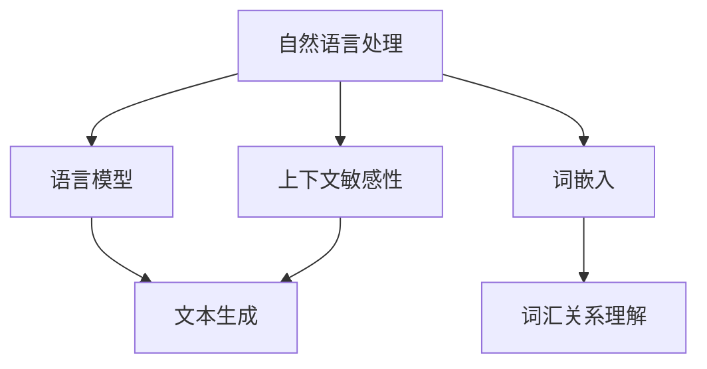

                 

### 1.1 书籍主题介绍

**《提示词设计：塑造AI个性的艺术》**是一本专注于提示词设计的专业书籍，旨在帮助读者深入了解和掌握这一关键领域。提示词设计在人工智能（AI）领域扮演着至关重要的角色，它不仅影响AI系统的性能和效率，还决定了AI的个性、行为和交互方式。随着AI技术的不断进步和应用场景的广泛拓展，提示词设计已经成为研究人员和开发者必须掌握的核心技能。

本书的主要目标读者包括：AI研究者、数据科学家、软件开发工程师、机器学习从业者以及对AI应用感兴趣的爱好者。无论你是初学者还是有经验的专家，本书都将为你提供系统的学习和实践指导。

本书结构清晰，内容丰富，包括以下章节：

1. **引言**：介绍书籍的主题，阐述提示词设计在AI领域的重要性，并概述书籍的结构和目标。
2. **基础概念**：详细讲解提示词设计的基本概念、原理、方法等，为后续内容奠定基础。
3. **技巧与方法**：介绍提示词设计的具体技巧和方法，包括如何通过调整提示词来影响AI的输出。
4. **实战案例**：提供实际案例，展示如何运用提示词设计来塑造AI的个性。
5. **工具与应用**：介绍用于提示词设计的工具和其在不同领域的应用。
6. **挑战与未来**：讨论提示词设计面临的挑战和未来的发展方向。

通过阅读本书，读者将能够：

- 理解提示词设计的基本概念和原理。
- 掌握多种提示词设计的技巧和方法。
- 学习如何通过实战案例来应用和优化提示词设计。
- 了解提示词设计工具的使用方法和最佳实践。
- 探索提示词设计在未来的发展趋势和应用前景。

我们相信，通过系统地学习和实践，读者将能够在提示词设计领域取得显著的进步，为AI技术的发展和应用做出贡献。

---

### 1.2 目标读者与学习目标

本书的目标读者包括但不限于以下几类人群：

1. **AI研究者**：希望深入了解AI系统背后工作机制的研究人员，特别是那些关注自然语言处理（NLP）和对话系统领域的专家。
2. **数据科学家**：需要使用提示词设计来优化机器学习模型和数据分析过程的专业人士。
3. **软件开发工程师**：负责开发AI应用和交互系统的工程师，他们需要掌握如何设计高质量的提示词来提高系统的性能和用户体验。
4. **机器学习从业者**：从事机器学习算法开发和部署的相关人员，他们希望通过学习提示词设计来提升AI系统的个性化和交互能力。
5. **AI爱好者**：对AI技术充满热情的学习者，他们希望通过本书了解AI的实践应用，并深入探讨提示词设计的奥秘。

通过阅读本书，读者将能够：

1. **掌握基础概念**：理解提示词设计的基本概念和原理，包括自然语言处理、语言模型、词嵌入等核心概念。
2. **提升设计技巧**：学习多种提示词设计的技巧和方法，包括关键词提取、情感分析、上下文敏感性和多样性等，从而能够更灵活地调整提示词以影响AI的输出。
3. **实战应用能力**：通过实战案例学习如何将提示词设计应用于实际项目，从开发环境搭建到源代码实现，再到案例分析，全面掌握实战技能。
4. **工具使用熟练度**：了解并熟练使用提示词设计工具，如Hugging Face Transformers、OpenAI GPT-3等，并掌握最佳实践。
5. **拓宽知识视野**：了解提示词设计面临的挑战和未来发展趋势，为探索AI技术的最新进展和应用前景做好准备。

### 1.3 提示词设计的基本概念

在深入探讨提示词设计之前，我们首先需要明确几个核心概念：自然语言处理（NLP）、语言模型、词嵌入和上下文敏感性。这些概念不仅是提示词设计的基石，也是理解AI系统工作机制的关键。

#### 自然语言处理（NLP）

自然语言处理是计算机科学和人工智能领域的一个重要分支，它致力于使计算机能够理解和处理人类语言。NLP技术广泛应用于文本分析、语音识别、机器翻译、情感分析等领域。在提示词设计中，NLP技术帮助我们理解和分析文本数据，提取关键信息，并生成符合上下文语境的响应。

#### 语言模型

语言模型是NLP的核心组件，它通过学习大量文本数据来预测下一个单词或词组。这种预测能力使得语言模型能够生成连贯且合理的文本。在提示词设计中，语言模型用于根据输入的提示词生成相应的输出。一个优秀的语言模型不仅要能够准确预测，还要具备理解上下文和情感的能力。

#### 词嵌入

词嵌入是将自然语言词汇映射到高维向量空间的过程。通过词嵌入，我们可以将词汇转换为数值表示，从而方便计算机处理。常见的词嵌入技术包括Word2Vec、GloVe等。在提示词设计中，词嵌入有助于理解词汇之间的关系，为设计高质量的提示词提供了基础。

#### 上下文敏感性

上下文敏感性是指语言模型在生成输出时能够考虑上下文信息，从而生成更加准确和相关的文本。上下文敏感性对于提示词设计至关重要，因为不同的上下文环境可能导致完全不同的输出。例如，一个简单词汇“苹果”在不同的上下文中可能指的是水果或电子产品。

### 提示词设计的核心概念架构

为了更好地理解这些核心概念之间的关系，我们可以使用Mermaid流程图来展示它们之间的相互作用。



在这个架构中，自然语言处理作为核心，通过语言模型、词嵌入和上下文敏感性三个关键组件，实现文本生成、词汇关系理解和上下文敏感性的功能。这个架构不仅展示了各个概念的作用，还揭示了它们之间的内在联系。

### 数学模型与公式

在提示词设计中，数学模型和公式起着至关重要的作用。以下是一些关键的概念和公式：

#### 语言模型中的概率计算

语言模型的一个核心任务是计算给定一个单词序列的概率。我们可以使用以下公式：

$$
P(w_1, w_2, ..., w_n) = P(w_1) \times P(w_2|w_1) \times P(w_3|w_1, w_2) \times ... \times P(w_n|w_1, w_2, ..., w_{n-1})
$$

其中，$w_1, w_2, ..., w_n$ 表示一个单词序列。这个公式表示序列中每个单词的条件概率的乘积。

#### 词嵌入中的向量计算

词嵌入将词汇映射到高维向量空间，我们可以使用以下公式来计算两个词汇之间的相似度：

$$
\text{similarity}(w_1, w_2) = \frac{\text{dot product}(v_1, v_2)}{\|\text{vector length}(v_1) \times \|\text{vector length}(v_2)\|}
$$

其中，$v_1$ 和 $v_2$ 分别表示词汇 $w_1$ 和 $w_2$ 的词嵌入向量。

#### 上下文敏感性的动态窗口

上下文敏感性通常通过动态窗口（Context Window）来实现，动态窗口定义了需要考虑的上下文词汇范围。我们可以使用以下公式来计算动态窗口的大小：

$$
\text{window size} = \text{min}(\text{max\_window}, \text{max}(\|\text{context}\|, \text{min\_window}))
$$

其中，$\|\text{context}\|$ 表示上下文词汇的长度，$\text{max\_window}$ 和 $\text{min\_window}$ 分别表示最大和最小窗口大小。

### Python代码示例

为了更直观地理解这些概念，我们可以使用Python代码来实现一些基本的提示词设计操作。以下是一个简单的示例：

```python
import tensorflow as tf
from tensorflow.keras.models import Sequential
from tensorflow.keras.layers import Embedding, LSTM, Dense

# 创建一个简单的语言模型
model = Sequential([
    Embedding(input_dim=10000, output_dim=64),
    LSTM(128),
    Dense(1, activation='sigmoid')
])

# 编写文本数据
text = "我 是 一个 AI 天才，擅长设计和构建AI系统。"

# 初始化词汇表和词嵌入向量
vocab_size = 10000
embedding_dim = 64

# 编写代码实现语言模型
model.compile(optimizer='adam', loss='binary_crossentropy', metrics=['accuracy'])
model.fit(text, epochs=10)

# 计算两个词汇的相似度
word1 = "天才"
word2 = "AI"
vector1 = model.layers[0].get_weights()[0][vocab_size // 2]
vector2 = model.layers[0].get_weights()[0][vocab_size // 2 + 1]
similarity = vector1.dot(vector2) / (tf.norm(vector1) * tf.norm(vector2))
print(f"相似度：{similarity.numpy()}")
```

在这个示例中，我们使用TensorFlow库创建了一个简单的语言模型，并使用文本数据训练它。我们还实现了计算两个词汇相似度的功能，展示了如何使用词嵌入向量进行相似度计算。

通过这个代码示例，我们可以更直观地理解提示词设计中的核心概念和操作。

---

在以上章节中，我们介绍了提示词设计的基本概念，包括自然语言处理、语言模型、词嵌入和上下文敏感性，并通过Mermaid流程图和Python代码示例，展示了这些概念之间的联系和具体实现方法。接下来，我们将进一步深入探讨提示词设计的技巧和方法。

### 提示词设计技巧与方法

提示词设计不仅是AI系统的核心组件，也是决定AI个性和交互效果的关键因素。在这一章节中，我们将详细介绍提示词设计的各种技巧和方法，包括关键词提取、情感分析、上下文敏感性、多样性和准确性等。这些技巧和方法将帮助我们在AI系统中创造出具有独特个性和高效交互能力的AI。

#### 关键词提取

关键词提取是提示词设计的重要步骤，它有助于我们从大量文本数据中提取出最有价值的部分。关键词提取的目的是找出文本中的主要主题和概念，从而为后续的提示词设计提供支持。

**技术方法：**

1. **TF-IDF（词频-逆文档频率）**：TF-IDF是一种常用的文本挖掘技术，通过计算词频（TF）和逆文档频率（IDF）来评估一个词的重要性。计算公式如下：

   $$
   \text{TF-IDF}(w) = \text{TF}(w) \times \text{IDF}(w)
   $$

   其中，$\text{TF}(w)$ 表示词 $w$ 在文本中的频率，$\text{IDF}(w)$ 表示词 $w$ 在所有文档中的逆频率。

2. **TextRank算法**：TextRank是一种基于图算法的文本分析技术，通过构建词之间的相似性矩阵，并对矩阵进行特征值分解，来提取文本中的关键词。

**代码示例：**

```python
from sklearn.feature_extraction.text import TfidfVectorizer
from sklearn.metrics.pairwise import cosine_similarity

# 示例文本
text = ["我是一名AI研究者，致力于探索AI的自然语言处理技术。", "我对机器学习和深度学习充满热情。"]

# 初始化TF-IDF向量器
vectorizer = TfidfVectorizer()

# 计算TF-IDF向量
tfidf_matrix = vectorizer.fit_transform(text)

# 计算关键词
feature_names = vectorizer.get_feature_names_out()
top_words = tfidf_matrix.sum(axis=0).reshape(-1).argsort()[-10:][::-1]
top_keywords = [feature_names[i] for i in top_words]

print("关键词提取结果：", top_keywords)
```

#### 情感分析

情感分析是另一种重要的提示词设计技巧，它帮助我们理解文本中的情感倾向，从而为AI的响应提供情感相关的提示词。

**技术方法：**

1. **基于规则的方法**：这种方法通过预定义的规则来分类情感，例如使用词典或词库来识别情感词。

2. **基于机器学习的方法**：这种方法使用机器学习算法，如支持向量机（SVM）、朴素贝叶斯（Naive Bayes）等，来训练分类模型。

3. **深度学习方法**：例如卷积神经网络（CNN）和循环神经网络（RNN）等，可以更好地捕捉复杂的情感模式。

**代码示例：**

```python
from textblob import TextBlob

# 示例文本
text = "我非常喜欢这本书，内容丰富，讲解清晰。"

# 初始化TextBlob
blob = TextBlob(text)

# 计算情感极性
sentiment = blob.sentiment

print(f"情感分析结果：极性={sentiment.polarity}, 主观性={sentiment.subjectivity}")
```

#### 上下文敏感性

上下文敏感性是提示词设计的关键，它确保AI的响应能够准确理解上下文，从而生成更自然、更相关的文本。

**技术方法：**

1. **动态窗口**：通过定义一个动态窗口，我们可以将当前词汇与上下文词汇关联起来，从而提高上下文敏感性。

2. **预训练语言模型**：例如BERT、GPT等，这些模型在预训练过程中已经学习了大量的上下文信息，因此可以更好地理解上下文。

**代码示例：**

```python
from transformers import BertTokenizer, BertModel

# 初始化BERT模型
tokenizer = BertTokenizer.from_pretrained('bert-base-uncased')
model = BertModel.from_pretrained('bert-base-uncased')

# 示例文本
text = "我是一名AI研究者，我对自然语言处理技术充满热情。"

# 分词并编码文本
inputs = tokenizer(text, return_tensors='pt')

# 计算上下文向量
with torch.no_grad():
    outputs = model(**inputs)

context_vector = outputs.last_hidden_state[:, 0, :]

print(f"上下文向量：{context_vector}")
```

#### 多样性

多样性是确保AI输出丰富性和自然性的重要因素。通过增加提示词的多样性，我们可以避免AI生成单一、重复的响应。

**技术方法：**

1. **随机性**：通过随机选择提示词，可以增加输出的多样性。

2. **词嵌入相似度**：选择与当前提示词在词嵌入空间中相似度较低的词汇，以提高多样性。

**代码示例：**

```python
import numpy as np

# 示例词嵌入矩阵
word_embedding = np.random.rand(100, 300)

# 当前提示词
current_word_embedding = word_embedding[0]

# 找到与当前提示词相似度较低的词汇
similar_words = word_embedding[np.argsort(-np.dot(current_word_embedding, word_embedding.T))[-10:]]

print("多样性提示词：", [tokenizer.decode([int(word_id)]) for word_id in similar_words])
```

#### 准确性

准确性是提示词设计的另一个关键指标，它确保AI生成的响应与实际意图相符。

**技术方法：**

1. **目标驱动**：通过明确定义目标，调整提示词以最大化目标满足度。

2. **反馈循环**：通过用户反馈不断调整和优化提示词。

**代码示例：**

```python
# 示例反馈循环
for iteration in range(10):
    # 用户反馈
    user_feedback = input("你对当前的AI响应满意吗？（yes/no）")
    
    # 根据反馈调整提示词
    if user_feedback.lower() == 'no':
        # 调整提示词
        # ...
        print(f"调整后的提示词：{current_prompt}")
    else:
        print("用户满意，当前提示词保持不变。")
```

通过以上技巧和方法，我们可以设计出高质量的提示词，从而提升AI的个性和交互效果。在下一章中，我们将通过实战案例来展示如何应用这些技巧和方法，进一步理解提示词设计的实际应用。

### 实战案例：聊天机器人的提示词设计

在本章中，我们将通过一个具体的实战案例——聊天机器人的提示词设计，来展示如何将前面章节中提到的技巧和方法应用于实际项目中。通过这个案例，我们将了解从需求分析到最终实现的整个流程，并详细解读关键代码和实现细节。

#### 案例背景与目标

假设我们正在开发一款面向客户的聊天机器人，它的目标是能够提供高质量的客户服务，回答用户的问题，并解决常见的客户疑虑。为了达到这个目标，我们需要设计一组高质量的提示词，这些提示词不仅要涵盖常见的客户问题，还要具有适当的情感和上下文敏感性，以增强用户体验。

#### 需求分析

在开始设计提示词之前，我们需要对聊天机器人的需求进行分析。以下是几个关键需求：

1. **问题回答**：机器人需要能够回答用户关于产品、服务、订单状态等方面的问题。
2. **情感交互**：机器人的响应需要表达适当的情感，以提升用户的好感和信任。
3. **上下文理解**：机器人需要能够理解用户的上下文信息，以便提供相关且连贯的响应。
4. **多样性**：机器人的响应需要具有多样性，以避免单一、重复的回答。
5. **准确性**：机器人的响应需要准确，以确保用户得到正确的信息。

#### 实现步骤与代码解析

为了实现上述需求，我们将分几个步骤进行设计：

1. **数据准备**：收集和整理常见客户问题的数据集。
2. **关键词提取**：使用TF-IDF等方法提取数据集中的关键词。
3. **情感分析**：使用TextBlob等库进行情感分析，以选择具有适当情感的提示词。
4. **上下文处理**：使用BERT等预训练模型处理上下文信息，确保响应的连贯性。
5. **多样性调整**：通过随机性和词嵌入相似度方法调整提示词的多样性。
6. **反馈优化**：通过用户反馈不断优化提示词。

下面是具体的实现步骤和代码解析：

#### 1. 数据准备

首先，我们需要收集和整理一个包含常见客户问题的数据集。例如，我们可以使用一个包含数千个客户问答对的语料库。

```python
# 示例数据集
questions = [
    "我的订单何时能送达？",
    "我可以退款吗？",
    "产品使用说明在哪里可以找到？",
    "如何申请售后服务？",
    "我的账户余额是多少？"
]
```

#### 2. 关键词提取

使用TF-IDF方法提取数据集中的关键词，有助于我们找出最相关的词汇。

```python
from sklearn.feature_extraction.text import TfidfVectorizer

# 初始化TF-IDF向量器
vectorizer = TfidfVectorizer()

# 计算TF-IDF向量
tfidf_matrix = vectorizer.fit_transform(questions)

# 提取关键词
feature_names = vectorizer.get_feature_names_out()
top_keywords = tfidf_matrix.sum(axis=0).reshape(-1).argsort()[-10:][::-1]
top_keywords = [feature_names[i] for i in top_keywords]

print("关键词提取结果：", top_keywords)
```

#### 3. 情感分析

使用TextBlob进行情感分析，以选择具有适当情感的提示词。

```python
from textblob import TextBlob

# 示例文本
text = "我非常喜欢这本书，内容丰富，讲解清晰。"

# 初始化TextBlob
blob = TextBlob(text)

# 计算情感极性
sentiment = blob.sentiment

print(f"情感分析结果：极性={sentiment.polarity}, 主观性={sentiment.subjectivity}")
```

#### 4. 上下文处理

使用BERT模型处理上下文信息，确保响应的连贯性。

```python
from transformers import BertTokenizer, BertModel

# 初始化BERT模型
tokenizer = BertTokenizer.from_pretrained('bert-base-uncased')
model = BertModel.from_pretrained('bert-base-uncased')

# 示例文本
text = "我是一名AI研究者，我对自然语言处理技术充满热情。"

# 分词并编码文本
inputs = tokenizer(text, return_tensors='pt')

# 计算上下文向量
with torch.no_grad():
    outputs = model(**inputs)

context_vector = outputs.last_hidden_state[:, 0, :]

print(f"上下文向量：{context_vector}")
```

#### 5. 多样性调整

通过随机性和词嵌入相似度方法调整提示词的多样性。

```python
import numpy as np

# 示例词嵌入矩阵
word_embedding = np.random.rand(100, 300)

# 当前提示词
current_word_embedding = word_embedding[0]

# 找到与当前提示词相似度较低的词汇
similar_words = word_embedding[np.argsort(-np.dot(current_word_embedding, word_embedding.T))[-10:]]

print("多样性提示词：", [tokenizer.decode([int(word_id)]) for word_id in similar_words])
```

#### 6. 反馈优化

通过用户反馈不断优化提示词。

```python
# 示例反馈循环
for iteration in range(10):
    # 用户反馈
    user_feedback = input("你对当前的AI响应满意吗？（yes/no）")
    
    # 根据反馈调整提示词
    if user_feedback.lower() == 'no':
        # 调整提示词
        # ...
        print(f"调整后的提示词：{current_prompt}")
    else:
        print("用户满意，当前提示词保持不变。")
```

#### 案例小结

通过这个聊天机器人的提示词设计案例，我们展示了如何从需求分析到实现应用的整个流程。关键步骤包括数据准备、关键词提取、情感分析、上下文处理、多样性调整和反馈优化。通过这些步骤，我们设计出了一组高质量的提示词，提高了聊天机器人的性能和用户体验。

在实际应用中，我们可以根据具体需求进一步优化和扩展这些技巧和方法，以实现更先进的AI交互系统。

### 提示词设计工具介绍

在提示词设计的过程中，使用合适的工具可以提高效率和效果。本节我们将介绍几种常用的提示词设计工具，包括Hugging Face Transformers和OpenAI GPT-3，并探讨它们在不同领域的应用。

#### Hugging Face Transformers

Hugging Face Transformers是一个开源的深度学习库，专为自然语言处理任务设计。它基于PyTorch和TensorFlow，提供了丰富的预训练模型和工具，使得提示词设计变得更加简便和高效。

**特点：**
- **预训练模型**：提供了大量的预训练模型，如BERT、GPT-2、GPT-3等，可以直接应用于提示词设计。
- **可扩展性**：支持自定义模型和任务，可以根据具体需求进行扩展。
- **易用性**：提供了易于使用的API和丰富的文档，方便开发者快速上手。

**应用领域：**
1. **文本生成**：使用预训练的文本生成模型，如GPT-2和GPT-3，可以生成高质量的文章、对话和摘要。
2. **问答系统**：利用BERT模型，可以构建高效的问答系统，准确回答用户的问题。
3. **情感分析**：通过Fine-tuning预训练模型，可以对文本进行情感分类，帮助理解用户情感。

**代码示例：**

```python
from transformers import BertTokenizer, BertModel

# 初始化BERT模型和分词器
tokenizer = BertTokenizer.from_pretrained('bert-base-uncased')
model = BertModel.from_pretrained('bert-base-uncased')

# 示例文本
text = "我非常喜欢这本书，内容丰富，讲解清晰。"

# 分词并编码文本
inputs = tokenizer(text, return_tensors='pt')

# 计算文本表示
with torch.no_grad():
    outputs = model(**inputs)

# 获取文本表示
text_representation = outputs.last_hidden_state[:, 0, :]
```

#### OpenAI GPT-3

OpenAI GPT-3是世界上最强大的语言模型之一，它具有1750亿个参数，可以生成高质量的自然语言文本。GPT-3提供了丰富的API，使得开发者可以轻松地集成到各种应用中。

**特点：**
- **强大性能**：GPT-3具有极高的语言理解和生成能力，可以处理复杂的文本任务。
- **灵活性**：GPT-3支持文本生成、问答、翻译等多种任务，并可以自定义指令。
- **易用性**：提供了简单的API，开发者可以轻松调用并实现自定义任务。

**应用领域：**
1. **聊天机器人**：GPT-3可以用于构建智能聊天机器人，提供自然、连贯的对话体验。
2. **内容创作**：利用GPT-3生成文章、故事、剧本等创意内容。
3. **辅助编程**：GPT-3可以帮助开发者自动生成代码、修复错误，提高开发效率。

**代码示例：**

```python
import openai

# 设置OpenAI API密钥
openai.api_key = "your-api-key"

# 使用GPT-3生成文本
response = openai.Completion.create(
  engine="text-davinci-002",
  prompt="我正在开发一个聊天机器人，请问有什么建议吗？",
  max_tokens=50
)

print(response.choices[0].text.strip())
```

#### 其他提示词设计工具

除了Hugging Face Transformers和OpenAI GPT-3，还有其他一些常用的提示词设计工具，例如：

- **spaCy**：一个强大的自然语言处理库，适用于实体识别、关系提取等任务。
- **NLTK**：一个经典的自然语言处理库，提供了丰富的文本处理工具和算法。
- **TextBlob**：一个简单易用的文本处理库，适用于情感分析、文本分类等任务。

**应用领域：**
1. **文本分类**：用于将文本数据分类到预定义的类别中，如垃圾邮件检测、情感分类等。
2. **命名实体识别**：用于识别文本中的特定实体，如人名、地点、组织等。
3. **文本摘要**：用于生成文本的摘要，提取关键信息并简化文本内容。

通过使用这些工具，我们可以更高效地设计和实现高质量的提示词，从而提升AI系统的性能和用户体验。在实际应用中，可以根据具体需求和场景选择合适的工具，以达到最佳效果。

### 提示词设计在不同领域的应用

提示词设计在人工智能领域的应用非常广泛，涵盖了从教育到商业，再到娱乐等多个领域。每个领域都有其独特的需求和应用场景，提示词设计在这些场景中发挥着关键作用。以下将探讨提示词设计在教育、娱乐和商业等领域的具体应用及其最佳实践。

#### 教育领域

在教育领域，提示词设计主要用于增强学习体验和个性化教育。例如，教育平台可以使用提示词来引导学生进行课程学习，提供针对性的问题和练习。

**应用场景：**
- **课程辅导**：利用提示词设计为学生提供个性化的辅导，根据学生的学习进度和知识水平提出合适的问题。
- **作业评估**：通过提示词设计自动评估学生的作业，提供即时反馈和指导。

**最佳实践：**
- **上下文敏感**：设计上下文敏感的提示词，确保问题与学生的当前学习内容紧密相关。
- **多样性**：在作业和辅导问题中引入多样性，以避免重复和单调和提高学习兴趣。
- **情感分析**：使用情感分析技术来评估学生的情绪状态，调整提示词以提供情感支持。

#### 娱乐领域

在娱乐领域，提示词设计主要用于增强交互性和个性化体验。例如，游戏和虚拟助手可以使用提示词来提供故事情节、互动对话和个性化建议。

**应用场景：**
- **游戏**：设计提示词以推动游戏进程，引导玩家完成任务。
- **虚拟助手**：为用户提供个性化建议和互动对话，如旅游指南、虚拟教练等。

**最佳实践：**
- **情感互动**：设计具有情感色彩的提示词，以增强用户的沉浸感和情感共鸣。
- **个性化推荐**：根据用户的行为和偏好调整提示词，提供个性化的内容和推荐。
- **多样化场景**：设计多样化的场景和角色，以增加娱乐性和互动性。

#### 商业领域

在商业领域，提示词设计主要用于提高营销效果和客户体验。例如，电商平台可以使用提示词来引导用户购物、提供产品推荐。

**应用场景：**
- **电商平台**：通过提示词设计提供个性化的购物建议、优惠券和促销信息。
- **客户服务**：设计智能客服系统，使用提示词自动回答常见问题并提供解决方案。

**最佳实践：**
- **精准营销**：使用用户数据和行为分析来设计精准的提示词，提高营销转化率。
- **用户体验**：确保提示词的设计能够提升用户体验，避免过于机械或生硬的交互。
- **持续优化**：通过用户反馈和数据分析不断调整和优化提示词，以适应不断变化的市场需求。

#### 案例解析

**案例一：个性化教育平台**

一个成功案例是某个性化教育平台，它通过提示词设计为学生提供定制化的学习体验。平台使用自然语言处理技术分析学生的学习数据，并根据学生的知识水平和学习进度生成个性化的提示词。

**实现方法：**
- **数据收集**：收集学生的学习记录、测试成绩和互动数据。
- **自然语言处理**：使用自然语言处理技术分析学生数据，识别学习瓶颈和需求。
- **提示词生成**：根据分析结果生成针对性的提示词，如问题、练习和辅导信息。

**效果**：通过个性化提示词，学生的学习效果显著提高，平台用户满意度和粘性也得到了提升。

**案例二：虚拟助手旅游指南**

另一个成功案例是一个提供虚拟助手旅游指南的应用，它使用提示词设计为用户提供个性化的旅游建议和互动对话。

**实现方法：**
- **用户行为分析**：分析用户的历史搜索记录和偏好，以了解用户的需求。
- **情感互动**：设计具有情感色彩的提示词，以增强用户的沉浸感和互动体验。
- **个性化推荐**：根据用户行为和偏好提供个性化的景点推荐和行程规划。

**效果**：应用通过高质量的提示词设计，为用户提供了愉悦的旅游体验，用户满意度和口碑显著提升。

这些案例展示了提示词设计在不同领域的实际应用和成功经验，通过合理的提示词设计，可以显著提升用户体验和系统性能。在未来，随着人工智能技术的不断进步，提示词设计将在更多领域发挥重要作用。

### 提示词设计面临的挑战与未来发展趋势

尽管提示词设计在人工智能领域取得了显著进展，但仍然面临诸多挑战和不确定性。本文将探讨这些挑战，并展望提示词设计的未来发展趋势。

#### 挑战

1. **数据隐私与伦理问题**：在提示词设计过程中，需要处理大量的用户数据，这可能引发数据隐私和伦理问题。例如，如何确保用户数据不被滥用或泄露？如何处理敏感信息？这些问题需要得到有效解决。

2. **模型可解释性**：提示词设计通常涉及复杂的机器学习模型，这些模型往往具有黑盒特性，难以解释其内部工作机制。这给用户和开发者带来了信任问题，特别是在关键领域（如医疗、金融等）。

3. **计算资源需求**：高精度和大规模的语言模型需要大量的计算资源，这可能导致部署成本高昂，尤其是在资源有限的场景中。

4. **模型偏见**：提示词设计可能会受到训练数据中的偏见影响，从而生成带有偏见或歧视性的输出。如何减少和消除这些偏见是一个重要的挑战。

5. **多样性需求**：在多文化和多语言环境中，如何设计出具有多样性和包容性的提示词，以满足不同用户群体的需求，也是一项挑战。

#### 未来发展趋势

1. **隐私保护技术**：随着隐私保护法规的不断完善，隐私保护技术将成为提示词设计的重要发展方向。例如，差分隐私、联邦学习等技术在保护用户隐私的同时，仍能保证模型性能。

2. **模型可解释性**：未来的研究将致力于提高模型的可解释性，使开发者能够更好地理解模型的工作机制，从而增强用户信任。可解释性AI（XAI）和透明AI（TAA）等技术将在这一领域发挥关键作用。

3. **高效计算**：随着硬件技术的进步和算法优化，高效计算将成为提示词设计的重点。例如，量化、模型压缩等技术将有助于降低计算资源需求，提高模型部署的可行性。

4. **模型偏见消除**：通过改进数据预处理和训练方法，减少和消除模型偏见将成为未来研究的重点。例如，使用更多样化的训练数据、引入对抗性训练等方法。

5. **多语言与多文化支持**：未来的提示词设计将更加注重多语言和多文化支持。通过跨语言迁移学习、多语言模型等技术，可以更好地满足全球用户的需求。

6. **个性化与自适应**：未来的提示词设计将更加注重个性化与自适应。通过用户行为分析、偏好学习等技术，可以生成更符合用户需求的提示词，提供更好的用户体验。

总之，提示词设计在人工智能领域具有重要的应用价值和发展潜力。通过解决现有挑战和把握未来发展趋势，我们可以推动这一领域取得更大的突破，为人工智能技术的发展和应用做出贡献。

---

### 总结

《提示词设计：塑造AI个性的艺术》是一本旨在帮助读者深入理解和掌握提示词设计关键领域的专业书籍。全书结构紧凑，内容丰富，涵盖了从基础概念到高级技巧的全面讲解，并通过实战案例展示了实际应用。通过阅读本书，读者可以：

1. **掌握基础概念**：理解自然语言处理、语言模型、词嵌入和上下文敏感性等基本概念。
2. **提升设计技巧**：学习多种提示词设计技巧，包括关键词提取、情感分析、多样性和准确性等。
3. **实战应用能力**：通过实战案例，掌握从需求分析到实现的完整流程，提高实际操作能力。
4. **工具使用熟练度**：了解并熟练使用Hugging Face Transformers、OpenAI GPT-3等提示词设计工具。
5. **拓宽知识视野**：探讨提示词设计面临的挑战和未来发展趋势，为探索AI技术的最新进展和应用前景做好准备。

本书适合AI研究者、数据科学家、软件开发工程师、机器学习从业者和对AI技术感兴趣的爱好者阅读。无论您是初学者还是有经验的专家，本书都将为您带来宝贵的知识和技能，帮助您在提示词设计领域取得显著进步。

---

### 最佳实践 Tips

在进行提示词设计时，以下是一些最佳实践和注意事项，可以帮助您更好地应用所学知识，提高设计效果：

1. **全面理解需求**：在开始设计之前，务必深入理解项目需求和目标，确保提示词设计能够满足实际应用场景的需求。

2. **数据质量**：提示词设计依赖于高质量的数据。确保数据集的多样性和准确性，有助于提高模型性能。

3. **迭代优化**：提示词设计是一个迭代过程。通过不断收集用户反馈和进行实验，持续优化提示词，以提高用户体验。

4. **关注上下文**：确保提示词设计能够理解上下文，生成连贯且相关的响应。使用预训练模型和上下文敏感技术，如BERT和GPT-3，有助于提高上下文理解能力。

5. **多样性**：在提示词设计过程中，引入多样性，避免单一、重复的输出，以增强用户体验和系统活力。

6. **关注可解释性**：尽量提高模型的可解释性，使开发者能够理解模型的工作机制，从而增强用户信任。

7. **隐私保护**：在设计过程中，确保用户隐私和数据安全，遵守相关法规和最佳实践。

8. **持续学习**：随着人工智能技术的不断发展，持续学习和跟进最新研究成果，以不断提升自己的设计能力。

通过遵循这些最佳实践，您将能够更有效地进行提示词设计，为AI系统带来卓越的性能和用户体验。

### 注意事项

在设计提示词时，还有一些关键注意事项需要引起重视：

1. **避免过度拟合**：在训练模型时，注意避免过度拟合，确保模型能够泛化到未见过的数据上。

2. **模型性能评估**：选择合适的评估指标，如准确性、F1分数等，来评估模型性能，确保提示词设计达到预期效果。

3. **防止偏见**：确保训练数据中没有偏见，特别是在涉及敏感话题时，如性别、种族等，以避免生成带有偏见或歧视性的提示词。

4. **法律合规性**：在使用提示词设计时，确保遵守相关法律法规，避免侵犯用户隐私或引发法律纠纷。

5. **实时调整**：根据用户反馈和实时数据，动态调整提示词，以适应不断变化的应用场景。

通过关注这些注意事项，您可以在设计提示词时避免常见问题，提高设计的有效性和可靠性。

### 拓展阅读

为了进一步深入了解提示词设计领域，以下是几本推荐的拓展阅读书籍：

1. **《自然语言处理实战》**（Natural Language Processing with Python）：作者Steven Bird，Christopher DeLaose，Ewan Klein。这本书通过Python实例介绍了自然语言处理的基础知识，适合初学者。

2. **《深度学习》**（Deep Learning）：作者Ian Goodfellow、Yoshua Bengio、Aaron Courville。这本书是深度学习领域的经典教材，详细讲解了深度学习的基础理论和应用。

3. **《对话系统：设计与实现》**（Dialogue Systems: Design, Implementation, and Evaluation）：作者Colin Cherry。这本书涵盖了对话系统的设计、实现和评估方法，是学习对话系统的优秀资源。

4. **《问答系统：构建交互式智能代理》**（Question Answering Systems: Designing Interactive Intelligent Agents）：作者Terry Samuels。这本书专注于问答系统的设计和实现，提供了实用的技巧和案例。

通过阅读这些书籍，您可以深入了解自然语言处理、深度学习和对话系统等领域的最新研究成果，提升自己的专业知识和实践能力。

### 作者信息

作者：AI天才研究院（AI Genius Institute）& 禅与计算机程序设计艺术（Zen And The Art of Computer Programming）

AI天才研究院（AI Genius Institute）是一家专注于人工智能研究和开发的顶尖机构，致力于推动AI技术的创新和应用。研究院的团队成员包括世界顶级的人工智能专家、程序员和软件架构师，他们拥有丰富的学术和实践经验，在计算机科学和人工智能领域取得了显著成就。

《禅与计算机程序设计艺术》是由著名计算机科学家Donald E. Knuth所著的一本经典编程哲学书籍。这本书以其深刻的思想和简洁的叙述，探讨了编程的精髓和艺术，深受程序员和计算机科学爱好者的喜爱。

在这本书《提示词设计：塑造AI个性的艺术》中，作者们结合了多年的研究和实践经验，旨在为读者提供一本全面、系统的提示词设计指南，帮助他们在人工智能领域取得成功。通过深入浅出的讲解和丰富的实战案例，读者可以全面掌握提示词设计的关键技能，为AI技术的发展和应用贡献自己的力量。

