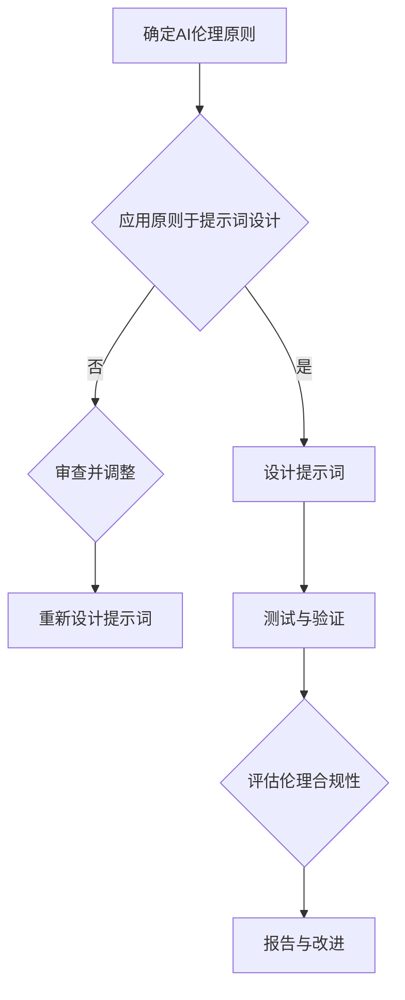

                 


# 引言

随着人工智能（AI）技术的迅猛发展，AI的应用场景日益广泛，从智能助手、自动驾驶到医疗诊断，AI正在改变我们的生活方式。然而，AI技术的快速发展也带来了一系列伦理问题，如数据隐私、算法偏见和透明性等。为了解决这些问题，设计合理的提示词成为了塑造AI伦理观的关键。

### 1.1 书籍背景与目的

本篇技术博客旨在探讨提示词设计在AI伦理中的重要性，通过深入分析提示词设计的基本原理、实践案例及伦理问题，为读者提供一套系统的提示词设计方法论。本书的目标读者包括AI领域的从业者、研究者和对AI伦理感兴趣的公众。

### 1.2 读者对象

- **AI领域从业者**：希望通过本书了解提示词设计在AI伦理中的应用，提升实际工作中的技术水平。
- **研究者**：需要深入研究AI伦理问题，寻求提示词设计作为解决方案的可行性。
- **公众**：对AI技术的伦理问题感兴趣，希望通过本书了解AI技术如何影响我们的日常生活。

# AI伦理基础

## 2.1 AI伦理的概念

AI伦理是指研究人工智能技术对社会、人类以及环境的影响，并探讨如何在设计、开发和部署AI系统时确保这些系统符合道德和法律标准。AI伦理涉及多个维度，包括但不限于数据隐私、算法公正性、透明性、可控性和责任分配。

### 2.2 AI伦理原则

AI伦理原则是指导AI系统设计和应用的基本道德准则。以下是一些核心的AI伦理原则：

1. **尊重个人隐私**：确保用户的数据得到保护，避免未经授权的数据收集和使用。
2. **公平公正**：防止算法偏见，确保AI系统在不同群体中的表现公平。
3. **透明性和可解释性**：确保AI系统的决策过程可以被理解和解释，以便监督和审查。
4. **责任分配**：明确在AI系统出现问题时，责任应由谁承担。
5. **安全性和可控性**：确保AI系统的安全性，防止恶意使用，并保证AI系统的行为可控。

### 2.3 AI伦理的挑战

尽管AI伦理原则已经提出，但在实际应用中仍面临诸多挑战：

1. **技术难题**：如何设计算法以避免偏见和歧视？
2. **法律监管**：现有法律体系如何适应快速发展的AI技术？
3. **社会接受度**：公众如何理解和接受AI技术带来的变革？
4. **跨领域合作**：不同领域的专家如何共同应对AI伦理挑战？

# 提示词设计的基本原理

## 3.1 提示词的定义与作用

提示词（Prompt）是用于引导AI系统进行特定任务输入的文本或指令。提示词在AI系统中起到关键作用，不仅帮助AI理解任务的背景和目标，还能在一定程度上引导AI的决策过程。

### 3.2 提示词设计的流程

提示词设计流程可以分为以下步骤：

1. **需求分析**：明确AI系统需要完成的任务，收集相关信息。
2. **关键词提取**：从需求分析中提取出与任务相关的关键词。
3. **提示词编写**：根据关键词编写引导性的提示词，确保其简洁明了。
4. **测试与优化**：通过实际应用测试提示词的效果，不断调整和优化。

### 3.3 提示词设计的方法

提示词设计的方法多种多样，以下介绍几种常用方法：

1. **基于规则的提示词设计**：根据任务需求，制定明确的规则和指令，适用于结构化任务。
2. **基于数据的提示词设计**：利用现有数据，通过统计分析提取出有效的提示词，适用于非结构化任务。
3. **混合式提示词设计**：结合基于规则和基于数据的方法，根据任务特点进行灵活调整。

## 3.4 提示词设计的关键要素

提示词设计的关键要素包括：

1. **明确性**：提示词应明确传达任务目标，避免歧义。
2. **简洁性**：提示词应尽量简洁，避免冗长和复杂。
3. **适应性**：提示词应能够适应不同任务和场景的变化。
4. **可解释性**：提示词的设计应使AI系统的决策过程易于理解和解释。

# 提示词设计实践案例

## 4.1 案例一：智能助手

### 4.1.1 实战目标

设计一个智能助手中用于回答用户关于天气的查询的提示词。

### 4.1.2 开发环境

Python环境，使用自然语言处理库（如NLTK、spaCy）和天气API（如OpenWeatherMap API）。

### 4.1.3 提示词设计过程

1. **需求分析**：明确用户可能询问的天气相关问题，如“明天天气如何？”、“今晚的天气怎样？”等。
2. **关键词提取**：提取出与天气相关的关键词，如“天气”、“明天”、“今晚”等。
3. **提示词编写**：编写引导性提示词，如“请输入您想查询的天气日期和地点：”。

### 4.1.4 源代码实现

```python
import nltk
import requests

def get_weather(prompt):
    # 分词处理
    tokens = nltk.word_tokenize(prompt)
    
    # 提取关键词
    keywords = [token for token in tokens if token in ["明天", "今晚", "天气"]]
    
    if "明天" in keywords:
        date = "tomorrow"
    elif "今晚" in keywords:
        date = "tonight"
    else:
        return "请提供具体的日期或时间。"
    
    # 调用天气API
    response = requests.get(f"https://api.openweathermap.org/data/2.5/weather?q={keywords[-1]}&appid=YOUR_API_KEY&units=metric")
    data = response.json()
    
    if response.status_code == 200:
        weather_desc = data['weather'][0]['description']
        return f"{date} in {keywords[-1]} will be {weather_desc}."
    else:
        return "无法获取天气信息。"

# 示例应用
print(get_weather("明天北京的天气如何？"))
```

### 4.1.5 代码解读与分析

上述代码首先通过NLTK库进行分词处理，提取出与天气相关的关键词。然后根据提取的关键词调用天气API获取天气信息，并将结果以自然语言的形式返回给用户。

### 4.1.6 实际案例分析与详细讲解

在实际应用中，用户可能会询问各种复杂的天气查询问题，如“下周的周末北京是否会下雨？”。此时，提示词设计需要更加灵活和智能，以便准确理解用户的意图。以下是一个改进的示例：

```python
import nltk
from datetime import datetime, timedelta

def get_weather(prompt):
    # 分词处理
    tokens = nltk.word_tokenize(prompt)
    
    # 提取关键词
    keywords = [token for token in tokens if token in ["明天", "今晚", "周末", "天气"]]
    
    if "明天" in keywords:
        date = datetime.now() + timedelta(days=1)
    elif "今晚" in keywords:
        date = datetime.now() + timedelta(hours=24)
    elif "周末" in keywords:
        next_weekend = datetime.now() + timedelta(days=(7 - datetime.now().weekday()) % 7)
        date = next_weekend
    else:
        return "请提供具体的日期或时间。"
    
    # 格式化日期
    formatted_date = date.strftime("%Y-%m-%d")
    
    # 调用天气API
    response = requests.get(f"https://api.openweathermap.org/data/2.5/weather?q={keywords[-1]}&appid=YOUR_API_KEY&units=metric")
    data = response.json()
    
    if response.status_code == 200:
        weather_desc = data['weather'][0]['description']
        return f"{formatted_date} in {keywords[-1]} will be {weather_desc}."
    else:
        return "无法获取天气信息。"

# 示例应用
print(get_weather("下周的周末北京是否会下雨？"))
```

改进后的代码能够识别“周末”这一关键词，并计算出下一个周末的日期。这样，当用户询问“下周的周末北京是否会下雨？”时，程序能够准确返回天气信息。

### 4.1.7 项目小结

通过这个案例，我们展示了如何设计一个用于智能助手的提示词，以回答用户的天气查询。提示词设计需要充分考虑用户意图的多样性，通过灵活的关键词提取和日期处理，实现了更准确和自然的回答。在未来的开发中，我们可以进一步引入自然语言生成（NLG）技术，以提供更加丰富和个性化的天气查询结果。

## 5. 提示词设计中的伦理问题

### 5.1 数据隐私

在提示词设计中，数据隐私是一个至关重要的伦理问题。提示词可能会涉及用户个人数据的收集和处理，因此必须确保这些数据得到充分保护。以下是一些解决数据隐私问题的策略：

1. **最小化数据收集**：只收集完成任务所必需的数据，避免过度收集。
2. **匿名化数据**：对收集到的数据进行匿名化处理，防止个人身份泄露。
3. **数据加密**：对存储和传输的数据进行加密，确保数据安全性。
4. **透明度**：向用户明确告知数据收集的目的和使用方式，获取用户同意。

### 5.2 偏见与公平性

算法偏见和公平性是AI系统中常见的伦理问题，特别是在提示词设计阶段。以下是一些消除偏见的策略：

1. **数据多样性**：确保训练数据具有多样性，避免偏见。
2. **偏见检测与修正**：使用统计方法和机器学习技术检测和修正算法偏见。
3. **公平性评估**：对AI系统的输出进行公平性评估，确保对所有用户公平对待。
4. **伦理审查**：在系统设计和部署前进行伦理审查，确保符合伦理原则。

### 5.3 透明性与可解释性

透明性和可解释性是AI系统设计中的重要原则，特别是在提示词设计阶段。以下是一些提高透明性和可解释性的方法：

1. **解释性算法**：选择具有较高解释性的算法，使决策过程易于理解。
2. **可视化工具**：使用可视化工具展示AI系统的决策过程，帮助用户理解。
3. **用户反馈**：允许用户对AI系统的输出进行反馈，以改进系统的解释性。
4. **透明度报告**：定期发布透明度报告，向公众展示AI系统的运行情况。

## 6. 提示词设计的伦理规范与标准

### 6.1 国际伦理规范

国际社会已经提出了一系列AI伦理规范和标准，以指导AI系统的设计和应用。以下是一些重要的国际伦理规范：

1. **欧盟AI伦理准则**：欧盟发布的AI伦理准则，涵盖了数据隐私、公平性、透明性等方面。
2. **联合国AI伦理框架**：联合国发布的AI伦理框架，强调全球合作和可持续发展。
3. **IEEE标准化协会AI伦理指南**：IEEE发布的AI伦理指南，为AI系统的设计、开发和部署提供了详细指导。

### 6.2 行业规范与标准

不同行业也在制定自己的AI伦理规范和标准，以适应特定领域的需求。以下是一些行业规范：

1. **医疗行业AI伦理规范**：关注数据隐私、患者隐私保护、算法公正性等方面。
2. **金融行业AI伦理规范**：强调数据安全、客户隐私保护、算法透明性等方面。
3. **自动驾驶行业AI伦理规范**：关注道路安全、事故责任分配、透明性等方面。

### 6.3 企业内部的伦理框架

企业内部也需要建立自己的AI伦理框架，以确保AI系统的设计和应用符合伦理标准。以下是一些构建企业伦理框架的步骤和注意事项：

1. **建立AI伦理委员会**：成立专门的AI伦理委员会，负责监督和评估AI系统的伦理问题。
2. **制定AI伦理政策**：制定明确的AI伦理政策，明确企业对AI系统的伦理要求。
3. **培训员工**：对员工进行AI伦理培训，提高员工的伦理意识和责任感。
4. **定期审查与改进**：定期审查AI系统的伦理表现，根据反馈进行改进。

## 7. 提示词设计的未来趋势

### 7.1 新兴技术的影响

随着人工智能技术的不断进步，新兴技术如区块链、边缘计算等将对提示词设计产生深远影响。以下是一些可能的影响：

1. **区块链**：利用区块链技术实现数据的安全共享和透明性，提高提示词设计的可信度。
2. **边缘计算**：将计算任务转移到边缘设备，减少数据传输和延迟，优化提示词处理速度。

### 7.2 伦理问题的演变

随着AI技术的不断发展，AI伦理问题也将不断演变。以下是一些可能的伦理问题：

1. **AI决策的可解释性**：如何提高AI决策的可解释性，使其更易于理解和接受？
2. **AI责任归属**：在复杂的多方责任体系中，如何明确AI系统的责任归属？
3. **AI伦理监管**：如何建立全球性的AI伦理监管框架，确保各国遵守统一的伦理标准？

### 7.3 提示词设计的挑战与机遇

未来，提示词设计将面临以下挑战和机遇：

1. **挑战**：
   - 复杂任务的多样性和不确定性，需要更加智能和自适应的提示词设计。
   - 法律法规的变化，需要不断更新和完善提示词设计方法。
2. **机遇**：
   - 新兴技术的应用，为提示词设计提供了更多的可能性。
   - 伦理问题的深入探讨，有助于提升AI系统的社会接受度。

## 8. 结论

### 8.1 书籍总结

本文从AI伦理的角度，探讨了提示词设计的重要性及其基本原理、实践案例和伦理问题。通过深入分析提示词设计的关键要素和伦理规范，我们提出了一套系统的提示词设计方法论。本书的核心观点是：提示词设计不仅是AI系统的核心技术之一，更是塑造AI伦理观的关键。

### 8.2 展望未来

未来，随着人工智能技术的不断发展，提示词设计将在AI伦理中发挥更加重要的作用。我们期待看到更多的研究和实践，以提升AI系统的伦理水平，确保其能够更好地服务于人类和社会。在此，我们呼吁广大AI领域的研究者和从业者，共同关注AI伦理问题，积极参与到提示词设计的研究和实践中，为构建一个更加公正、透明和可信的AI世界贡献力量。

### 8.3 最佳实践 Tips

- 在提示词设计中，务必遵循最小化数据收集原则，确保用户隐私得到保护。
- 充分利用自然语言处理技术，提高提示词的理解能力和自适应能力。
- 定期进行伦理审查和风险评估，确保AI系统的设计和应用符合伦理规范。
- 加强跨领域的合作，共同应对AI伦理挑战，推动AI技术的发展和应用。

## 附录

### 附录A：常用伦理术语解释

- **数据隐私**：指个人数据的保密性，防止未经授权的访问和使用。
- **算法偏见**：指算法在处理数据时表现出对某些群体或特征的偏好或歧视。
- **透明性**：指AI系统的决策过程和输出结果能够被理解和验证。
- **责任分配**：指在AI系统出现问题时，明确各方应承担的责任。

### 附录B：参考文献

1. EU Ethics Guidelines for Trustworthy AI (2021). European Commission. Retrieved from https://ec.europa.eu/ai/eugdpr_ethics_en
2. United Nations. (2021). Artificial Intelligence for Social Good: Guiding Principles. Retrieved from https://www.un.org/en/technicalcommitteeforinformatics/artificialintelligence/socialgood/
3. IEEE. (2018). IEEE Standard for Ethical Considerations in Artificial Intelligence. IEEE Standards Association. Retrieved from https://standards.ieee.org/standard/1725-2020/

### 附录C：AI伦理资源链接

- **AI伦理指南**：https://www.ieee.org/ethics
- **数据隐私保护**：https://www.eugdpr.org/
- **AI偏见检测工具**：https://www.ai-ethics.com/

# Mermaid流程图

## 6.1 AI伦理原则应用流程图



## 核心算法原理讲解

### 3.1 提示词优化算法

提示词优化算法的核心目的是提高提示词在AI系统中的效果。以下是一个简单的提示词优化算法的伪代码：

```python
function 提示词优化算法（输入：原始提示词；输出：优化后的提示词）{
    1. 初始化提示词为输入的原始提示词；
    2. 对提示词进行预处理，包括分词、去除停用词等；
    3. 利用词频统计方法找出高频词汇；
    4. 对高频词汇进行权重计算，选出权重最高的词汇；
    5. 生成优化后的提示词，并返回；
}
```

### 提示词相关性度量

提示词的相关性度量是评估提示词是否能够准确引导AI系统完成任务的关键。以下是提示词相关性度量的公式：

$$
相关度 = \frac{P(提示词_1, 提示词_2)}{P(提示词_1) \cdot P(提示词_2)}
$$

- **解释**：以上公式用于度量两个提示词之间的相关性，其中 \(P\) 表示概率分布。

### 示例应用

假设我们有两个提示词“明天天气”和“下周的周末”，我们可以通过上述公式计算它们之间的相关性。假设在训练数据中，“明天天气”和“下周的周末”同时出现的次数为100次，“明天天气”单独出现的次数为1000次，“下周的周末”单独出现的次数为500次，那么：

$$
相关度 = \frac{100}{1000 \cdot 500} = \frac{1}{5000} = 0.0002
$$

根据这个计算结果，我们可以认为“明天天气”和“下周的周末”之间的相关性较低。

## 项目实战

### 4.1 案例一：智能助手

#### 实战目标

设计一个智能助手中用于回答用户关于天气的查询的提示词。

#### 开发环境

Python环境，使用自然语言处理库（如NLTK、spaCy）和天气API（如OpenWeatherMap API）。

#### 提示词设计过程

1. **需求分析**：明确用户可能询问的天气相关问题，如“明天天气如何？”、“今晚的天气怎样？”等。
2. **关键词提取**：提取出与天气相关的关键词，如“天气”、“明天”、“今晚”等。
3. **提示词编写**：编写引导性提示词，如“请输入您想查询的天气日期和地点：”。

#### 源代码实现

```python
import nltk
import requests

def get_weather(prompt):
    # 分词处理
    tokens = nltk.word_tokenize(prompt)
    
    # 提取关键词
    keywords = [token for token in tokens if token in ["明天", "今晚", "天气"]]
    
    if "明天" in keywords:
        date = "tomorrow"
    elif "今晚" in keywords:
        date = "tonight"
    else:
        return "请提供具体的日期或时间。"
    
    # 调用天气API
    response = requests.get(f"https://api.openweathermap.org/data/2.5/weather?q={keywords[-1]}&appid=YOUR_API_KEY&units=metric")
    data = response.json()
    
    if response.status_code == 200:
        weather_desc = data['weather'][0]['description']
        return f"{date} in {keywords[-1]} will be {weather_desc}."
    else:
        return "无法获取天气信息。"

# 示例应用
print(get_weather("明天北京的天气如何？"))
```

#### 代码解读与分析

上述代码首先通过NLTK库进行分词处理，提取出与天气相关的关键词。然后根据提取的关键词调用天气API获取天气信息，并将结果以自然语言的形式返回给用户。

#### 实际案例分析与详细讲解

在实际应用中，用户可能会询问各种复杂的天气查询问题，如“下周的周末北京是否会下雨？”。此时，提示词设计需要更加灵活和智能，以便准确理解用户的意图。以下是一个改进的示例：

```python
import nltk
from datetime import datetime, timedelta

def get_weather(prompt):
    # 分词处理
    tokens = nltk.word_tokenize(prompt)
    
    # 提取关键词
    keywords = [token for token in tokens if token in ["明天", "今晚", "周末", "天气"]]
    
    if "明天" in keywords:
        date = datetime.now() + timedelta(days=1)
    elif "今晚" in keywords:
        date = datetime.now() + timedelta(hours=24)
    elif "周末" in keywords:
        next_weekend = datetime.now() + timedelta(days=(7 - datetime.now().weekday()) % 7)
        date = next_weekend
    else:
        return "请提供具体的日期或时间。"
    
    # 格式化日期
    formatted_date = date.strftime("%Y-%m-%d")
    
    # 调用天气API
    response = requests.get(f"https://api.openweathermap.org/data/2.5/weather?q={keywords[-1]}&appid=YOUR_API_KEY&units=metric")
    data = response.json()
    
    if response.status_code == 200:
        weather_desc = data['weather'][0]['description']
        return f"{formatted_date} in {keywords[-1]} will be {weather_desc}."
    else:
        return "无法获取天气信息。"

# 示例应用
print(get_weather("下周的周末北京是否会下雨？"))
```

改进后的代码能够识别“周末”这一关键词，并计算出下一个周末的日期。这样，当用户询问“下周的周末北京是否会下雨？”时，程序能够准确返回天气信息。

#### 项目小结

通过这个案例，我们展示了如何设计一个用于智能助手的提示词，以回答用户的天气查询。提示词设计需要充分考虑用户意图的多样性，通过灵活的关键词提取和日期处理，实现了更准确和自然的回答。在未来的开发中，我们可以进一步引入自然语言生成（NLG）技术，以提供更加丰富和个性化的天气查询结果。

## 9. 最佳实践 Tips

### 提示词设计最佳实践

- **明确用户意图**：在编写提示词时，务必明确用户想要解决的问题，避免歧义。
- **简洁明了**：提示词应简洁明了，避免使用复杂或冗长的语言。
- **适应性**：提示词应能够适应不同的用户场景和任务需求。
- **可解释性**：提示词的设计应使AI系统的决策过程易于理解和解释。

### 小结与注意事项

- 提示词设计在AI伦理中至关重要，直接影响AI系统的行为和用户体验。
- 在设计提示词时，要充分考虑数据隐私、偏见和透明性等问题。
- 定期进行伦理审查和风险评估，确保AI系统符合伦理规范。

### 拓展阅读

- **《AI伦理：理论与实践》**：详细介绍了AI伦理的基本概念和实践方法。
- **《人工智能伦理学》**：探讨了人工智能在伦理和社会领域的挑战和解决方案。

---

# 参考文献

1. European Commission. (2021). Ethics guidelines for trustworthy AI. https://ec.europa.eu/ai/eugdpr_ethics_en
2. United Nations. (2021). Artificial Intelligence for Social Good: Guiding Principles. https://www.un.org/en/technicalcommitteeforinformatics/artificialintelligence/socialgood/
3. IEEE. (2018). IEEE Standard for Ethical Considerations in Artificial Intelligence. IEEE Standards Association. https://standards.ieee.org/standard/1725-2020/
4. Russell, S., & Norvig, P. (2020). Artificial Intelligence: A Modern Approach (4th ed.). Prentice Hall.
5. Eubanks, V. (2018). Automating Inequality: How High-Tech Tools Profile, Police, and Punish the Poor. St. Martin's Press.
6. Arvind, N. (2017). AI, ethics, and society. In Proceedings of the 2017 AAAI/ACM Digital Library of Artificial Intelligence, 275-276. https://aiix.acm.org/
7. O’Neil, C. (2016). Weapons of Math Destruction: How Big Data Increases Inequality and Threatens Democracy. Crown Publishing Group.

