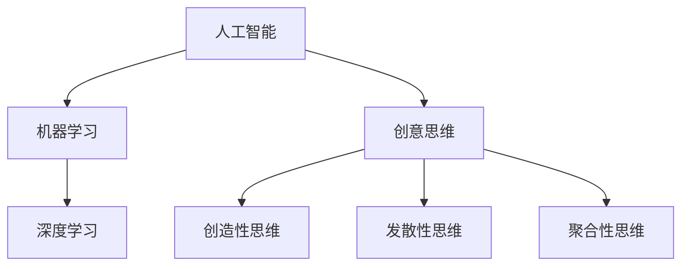
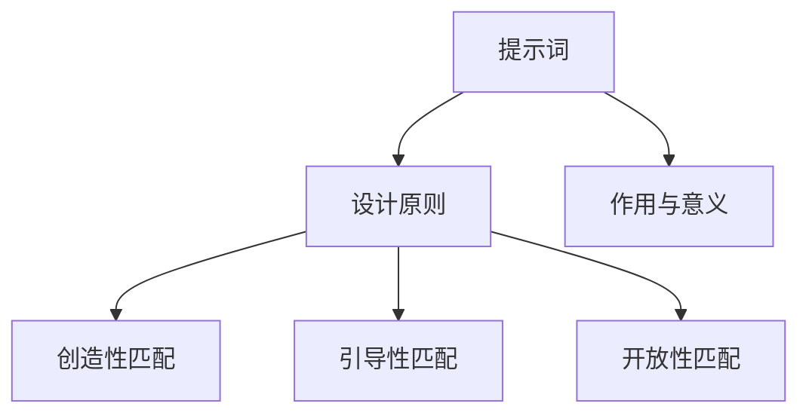

                 

以下是对《提示词设计：增强AI创意思维的技巧》技术博客文章的逐步分析推理：

**步骤 1: 确定文章结构和主题**

文章标题：《提示词设计：增强AI创意思维的技巧》

关键词：提示词设计、AI、创意思维、设计原则、策略与方法、实践案例

摘要：本文将深入探讨如何通过提示词设计来增强AI在创意思维方面的表现，包括核心概念、设计原则、实际应用和未来展望。

**步骤 2: 引言与背景介绍**

**引言部分：**
- 提出问题：为什么AI在创意领域需要提示词设计？
- 介绍背景：AI在创意领域的应用和发展。

**背景介绍：**
- AI的基础知识：介绍AI的基本原理和应用场景。
- 创意思维概述：讨论创意思维的定义、类型和重要性。

**步骤 3: AI与创意思维的基本概念**

**核心概念与联系：**
- AI的基础知识
  - **概念1：机器学习**
  - **概念2：神经网络**
  - **概念3：深度学习**
- 创意思维概述
  - **概念1：创造性思维**
  - **概念2：发散性思维**
  - **概念3：聚合性思维**

**Mermaid流程图：**


**步骤 4: 提示词设计原理**

**核心概念与联系：**
- 提示词的定义
  - **概念1：提示词**
  - **概念2：设计原则**
  - **概念3：作用与意义**

**Mermaid流程图：**


**步骤 5: 设计策略与方法**

**核心算法原理讲解：**
- 策略1：基于AI技术的提示词生成
  - **算法原理：生成对抗网络（GAN）**
  - **Python代码示例：**
    ```python
    # 示例代码：使用GAN生成提示词
    import tensorflow as tf
    # ... GAN模型的构建和训练代码 ...

- 策略2：结合人类创意思维的提示词设计
  - **方法1：数据分析与挖掘**
  - **方法2：机器学习模型的应用**

**数学公式：**
$$
\begin{aligned}
&\text{GAN的损失函数：} \\
&L(G, D) = \frac{1}{2}\left[ -\mathbb{E}_{x \sim p_{data}(x)}[\log(D(x))] - \mathbb{E}_{z \sim p_{z}(z)}[\log(1 - D(G(z))]\right]
\end{aligned}
$$

**步骤 6: 实践案例解析**

**核心内容：**
- 提示词设计在广告创意中的应用
- 提示词设计在游戏开发中的实践
- 提示词设计在艺术创作中的尝试

**步骤 7: 技术工具与平台**

**核心内容：**
- 常用的提示词设计工具和平台介绍
- 如何使用这些工具和平台进行提示词设计

**步骤 8: 未来展望与挑战**

**核心内容：**
- 提示词设计的未来发展趋势
- 面临的挑战和解决思路

**步骤 9: 文章小结**

**核心内容：**
- 最佳实践 tips
- 注意事项
- 拓展阅读

**步骤 10: 审阅与修改**

**核心内容：**
- 确保文章逻辑清晰、内容完整
- 优化文章结构和语言表达

**步骤 11: 输出markdown格式文章**

确保文章符合markdown格式要求，并在末尾附上作者信息。

---

通过上述步骤，我们可以逐步构建出《提示词设计：增强AI创意思维的技巧》的技术博客文章，确保其逻辑清晰、内容丰富、易于理解。文章的每个部分都将围绕核心主题展开，从背景介绍到具体方法，再到实践案例和未来展望，形成一个完整的技术讨论框架。在撰写过程中，我们将注重使用专业的技术语言和实际代码示例来增强文章的说服力和实用性。最终，文章将呈现出高质量的内容，对读者在提示词设计领域的学习和应用提供有益的指导。|>

