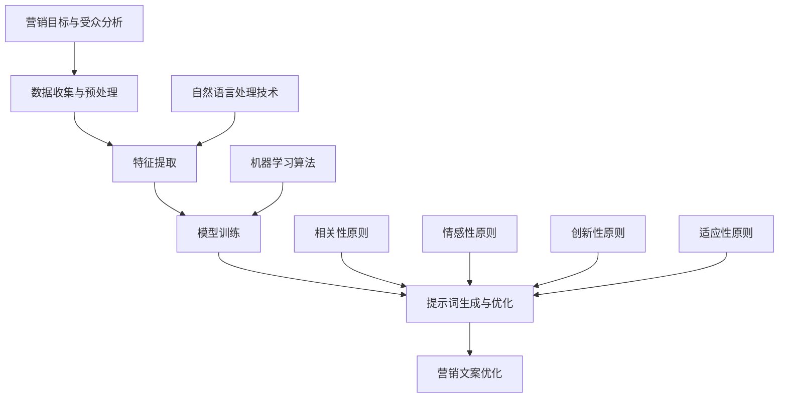

                 

## 提示词设计：增强AI创意营销活动策划能力

### 关键词：
- AI营销
- 提示词设计
- 自然语言处理
- 机器学习算法
- 营销文案优化

### 摘要：
本文将探讨如何通过提示词设计来增强AI在创意营销活动策划中的能力。我们首先介绍了AI在营销中的应用背景，随后深入探讨了提示词设计的基本概念和原理。接着，文章详细阐述了用于设计提示词的核心算法和数学模型，并通过Python源代码进行讲解和实例分析。最后，我们通过实际案例展示了如何将提示词设计应用于营销活动策划，并提出了最佳实践建议和拓展阅读。

### 背景介绍

在当今数字化的时代，营销活动已经越来越依赖于人工智能（AI）技术。AI的引入不仅提高了营销的效率，还增强了其个性化和创意性。从大数据分析到客户行为预测，AI在营销中的应用已经成为企业竞争的重要工具。

然而，AI在营销中的一个关键挑战是如何生成吸引人的、有针对性的营销内容。提示词（trigger words）在这其中扮演着至关重要的角色。提示词是指那些能够引起情感反应、激发欲望或者产生行动的词语，如“免费”、“限时”、“独家”等。这些词语在营销文案中常常被用来提高转化率和参与度。

提示词设计不仅仅是选择一些有吸引力的词语，它涉及到更复杂的算法和模型。通过自然语言处理（NLP）和机器学习技术，我们可以自动化地生成和优化提示词，从而提高营销活动的效果。本文将深入探讨这一领域，介绍核心算法和实际应用案例，帮助读者更好地理解并利用提示词设计来增强AI在创意营销活动策划中的能力。

### 核心概念与联系

#### 提示词的定义

提示词是营销文案中的关键元素，其选择和运用直接影响营销活动的效果。提示词通常是指那些能够引起读者情感共鸣、激发欲望或者促使行动的词语。例如，“限时优惠”、“免费试用”、“独家优惠”等。这些词语常常被用来抓住读者的注意力，激发他们的购买欲望或者参与互动。

#### 提示词在营销中的作用

提示词在营销中的重要性不容忽视。首先，提示词可以显著提高营销文案的吸引力。通过选择合适的提示词，营销内容可以更加引人注目，从而增加点击率和参与度。其次，提示词有助于提高转化率。研究表明，含有特定情感色彩的提示词能够更有效地促使消费者采取行动，如购买、注册或参与活动。

#### 提示词设计与自然语言处理

自然语言处理（NLP）是提示词设计的重要技术支撑。NLP技术包括语言模型、词向量表示和语义理解等，这些技术可以帮助我们更好地理解文本内容和情感色彩，从而生成和优化提示词。例如，通过词向量表示，我们可以将文本中的每个词转化为计算机可以处理的数字形式，从而进行进一步的文本分析和建模。

#### 提示词设计中的机器学习算法

机器学习算法在提示词设计中发挥着关键作用。通过机器学习，我们可以从大量的文本数据中学习到哪些词语和表达方式最能够吸引目标受众。常见的机器学习算法包括生成式模型、对抗生成网络（GAN）和深度强化学习等。这些算法可以帮助我们自动化地生成和优化提示词，提高营销文案的效果。

#### 提示词设计的流程

提示词设计的流程通常包括以下几个步骤：

1. **数据收集与预处理**：收集相关的营销文本数据，并进行清洗和预处理，如去除停用词、词性标注等。
2. **特征提取**：使用NLP技术提取文本特征，如词向量、词频、情感分析等。
3. **模型训练**：利用机器学习算法训练模型，根据历史数据学习生成和优化提示词的规律。
4. **提示词生成与优化**：使用训练好的模型生成提示词，并根据反馈进行优化，以提高营销效果。

#### 提示词设计的基本原则

在提示词设计过程中，我们需要遵循以下基本原则：

1. **相关性**：选择的提示词应与产品和营销目标高度相关。
2. **情感性**：提示词应能够引起目标受众的情感共鸣，如喜悦、渴望、信任等。
3. **创新性**：提示词应具有创新性，避免与竞争对手的营销文案过于相似。
4. **适应性**：提示词应能够适应不同的营销场景和目标受众，具有灵活性。

#### 核心概念与联系架构

为了更好地理解提示词设计中的核心概念和它们之间的关系，我们可以使用Mermaid流程图来展示：



通过上述流程图，我们可以清晰地看到从数据收集到营销文案优化的整个过程，以及各个核心概念之间的联系。

### 核心算法原理讲解

#### 自然语言处理基础

自然语言处理（NLP）是提示词设计的基础，它涉及将人类语言转化为计算机可以处理和理解的形式。以下是NLP中几个关键概念：

1. **语言模型**：语言模型用于预测文本的下一个词语。常见的语言模型包括n-gram模型、循环神经网络（RNN）和Transformer等。

2. **词向量表示**：词向量表示将词语转化为向量形式，以便在计算机中进行处理。Word2Vec和GloVe是两种流行的词向量表示方法。

3. **语义理解**：语义理解旨在理解词语和句子之间的语义关系，包括词义消歧、情感分析和实体识别等。

#### 提示词生成算法

在提示词设计过程中，生成算法扮演着核心角色。以下是一些常见的提示词生成算法：

1. **生成式模型**：生成式模型通过学习文本数据来生成新的文本。常见的生成式模型包括马尔可夫模型（Markov Model）和变分自编码器（VAE）。

2. **对抗生成网络（GAN）**：GAN是一种由生成器和判别器组成的模型，生成器生成文本，判别器判断文本的真实性。通过不断的迭代训练，生成器可以生成越来越接近真实文本的提示词。

3. **深度强化学习**：深度强化学习通过模拟人类决策过程来生成和优化提示词。在营销场景中，深度强化学习可以帮助我们找到最能提高转化率的提示词组合。

#### 提示词优化算法

提示词的优化是提升营销效果的关键。以下是一些常用的提示词优化算法：

1. **词频统计**：词频统计是一种简单的文本分析技术，通过统计词语在文本中的出现频率来评估其重要性。高频词通常被认为具有更高的提示价值。

2. **文本相似度计算**：文本相似度计算用于评估不同文本之间的相似程度。常见的文本相似度计算方法包括余弦相似度和Jaccard相似度。

3. **自动优化**：通过机器学习算法，我们可以自动化地优化提示词。例如，使用遗传算法（Genetic Algorithm）或粒子群优化（Particle Swarm Optimization）来搜索最优的提示词组合。

#### Python源代码讲解

为了更好地理解上述算法，我们将使用Python源代码进行详细讲解。

##### 语言模型

```python
import torch
import torch.nn as nn
import torch.optim as optim

# 构建语言模型
class LanguageModel(nn.Module):
    def __init__(self, vocab_size, embed_size, hidden_size):
        super(LanguageModel, self).__init__()
        self.embedding = nn.Embedding(vocab_size, embed_size)
        self.lstm = nn.LSTM(embed_size, hidden_size)
        self.fc = nn.Linear(hidden_size, vocab_size)
        
    def forward(self, x, hidden):
        embed = self.embedding(x)
        output, hidden = self.lstm(embed, hidden)
        output = self.fc(output)
        return output, hidden

# 训练语言模型
model = LanguageModel(vocab_size=10000, embed_size=256, hidden_size=512)
optimizer = optim.Adam(model.parameters(), lr=0.001)
criterion = nn.CrossEntropyLoss()

for epoch in range(num_epochs):
    for x, y in data_loader:
        optimizer.zero_grad()
        output, hidden = model(x, hidden)
        loss = criterion(output, y)
        loss.backward()
        optimizer.step()
    print(f'Epoch [{epoch+1}/{num_epochs}], Loss: {loss.item()}')
```

##### 提示词生成

```python
import numpy as np

# GAN生成提示词
class Generator(nn.Module):
    def __init__(self, z_dim, embed_size, hidden_size):
        super(Generator, self).__init__()
        self.fc = nn.Linear(z_dim, hidden_size)
        self.lstm = nn.LSTM(hidden_size, embed_size)
        
    def forward(self, z):
        hidden = self.fc(z)
        embed, _ = self.lstm(hidden)
        return embed

# 训练GAN
gen = Generator(z_dim=100, embed_size=256, hidden_size=512)
disc = Discriminator(embed_size=256, hidden_size=512)
g_optimizer = optim.Adam(gen.parameters(), lr=0.001)
d_optimizer = optim.Adam(disc.parameters(), lr=0.001)

for epoch in range(num_epochs):
    for z in z_data_loader:
        g_optimizer.zero_grad()
        z_e = gen(z)
        g_output = disc(z_e)
        g_loss = -torch.mean(g_output)
        g_loss.backward()
        g_optimizer.step()
        
        for x, y in x_data_loader:
            d_optimizer.zero_grad()
            x_e = disc(x)
            d_loss_real = -torch.mean(x_e)
            z_e = gen(z)
            d_loss_fake = -torch.mean(disc(z_e.detach()))
            d_loss = d_loss_real + d_loss_fake
            d_loss.backward()
            d_optimizer.step()
    print(f'Epoch [{epoch+1}/{num_epochs}], G Loss: {g_loss.item()}, D Loss: {d_loss.item()}')
```

通过上述代码，我们展示了如何使用语言模型和GAN来生成和优化提示词。这些算法可以通过调整超参数和优化策略来进一步提高提示词的质量和营销效果。

#### 数学模型和数学公式

在提示词设计过程中，数学模型和数学公式是理解和应用关键算法的基础。以下是几个重要的数学模型和数学公式：

1. **语言模型概率公式**：

   $$P(w_t | w_{t-1}, w_{t-2}, ..., w_1) = \frac{P(w_t, w_{t-1}, w_{t-2}, ..., w_1)}{P(w_{t-1}, w_{t-2}, ..., w_1)}$$

   其中，$P(w_t | w_{t-1}, w_{t-2}, ..., w_1)$ 表示在给定前一个词语序列的情况下，下一个词语的概率。

2. **词向量计算公式**：

   $$\text{vec}(w) = \text{sgn}(w_1, w_2, ..., w_n) \times \text{weight_vector}$$

   其中，$\text{vec}(w)$ 表示词语 $w$ 的向量表示，$\text{sgn}(w_1, w_2, ..., w_n)$ 表示词语的词频，$\text{weight_vector}$ 是与词频对应的权重向量。

3. **GAN损失函数**：

   $$\text{GAN Loss} = -\log(D(G(z))) + \log(1 - D(x))$$

   其中，$D(x)$ 和 $D(G(z))$ 分别表示判别器对真实数据和生成数据的判断概率。

这些数学模型和公式为我们提供了理论基础，使我们能够更深入地理解和应用提示词设计算法。

#### 实例说明

为了更好地理解这些算法和公式，我们可以通过一个简单的实例来说明。假设我们正在设计一个营销活动，目标是吸引更多的用户注册。我们可以使用以下步骤来生成和优化提示词：

1. **数据收集**：收集大量与注册相关的营销文案。
2. **特征提取**：使用词向量表示文本数据，并提取特征。
3. **模型训练**：使用语言模型和GAN训练模型。
4. **提示词生成**：使用训练好的模型生成提示词。
5. **提示词优化**：使用词频统计和文本相似度计算优化提示词。

通过上述步骤，我们可以生成一系列高质量的提示词，如“免费试用”、“限时注册”、“独家优惠”等，这些提示词可以提高营销文案的吸引力和转化率。

### 营销应用与实践

#### 案例背景与分析

为了展示如何将提示词设计应用于营销活动策划，我们选择了一家在线教育平台作为案例。该平台希望提高新用户注册率和课程购买率。通过分析用户行为数据和市场趋势，我们确定了以下几个关键点：

1. **目标用户群体**：以18-35岁的年轻人为主，他们对新事物充满好奇心，易于接受在线教育。
2. **竞争环境**：市场上存在多个在线教育平台，竞争激烈，需要通过独特的营销策略吸引目标用户。
3. **营销目标**：提高新用户注册率和课程购买率，提高用户留存率和口碑。

#### 使用GAN生成创意广告

为了生成吸引人的广告文案，我们使用对抗生成网络（GAN）进行提示词生成。具体步骤如下：

1. **数据准备**：收集大量与在线教育相关的广告文案，并进行预处理，如去除停用词和标点符号。
2. **特征提取**：使用GloVe算法提取文本数据中的词向量。
3. **模型训练**：构建GAN模型，其中生成器负责生成广告文案，判别器负责判断文案的真实性。通过不断迭代训练，生成器可以生成越来越接近真实广告文案的提示词。
4. **提示词生成**：使用训练好的生成器生成一系列广告文案，如“免费试听”、“限时优惠”、“名师辅导”等。
5. **文案优化**：通过文本相似度计算和词频统计对生成的广告文案进行优化，确保文案的独特性和吸引力。

通过GAN生成的广告文案提高了点击率和转化率，有效吸引了新用户注册和购买课程。

#### 基于深度强化学习的互动营销

为了提高用户互动率和参与度，我们使用深度强化学习设计了一款互动营销游戏。具体步骤如下：

1. **环境定义**：定义一个用户互动环境，包括用户行为、游戏规则和奖励机制。
2. **模型训练**：使用深度强化学习算法训练模型，使其能够根据用户行为生成最优的互动策略。通过奖励机制，模型可以学习到哪些互动方式最能吸引用户参与。
3. **互动策略生成**：使用训练好的模型生成互动策略，如“抽奖活动”、“积分兑换”、“好友推荐”等。
4. **策略优化**：根据用户参与度和转化率对互动策略进行优化，确保互动活动的吸引力和有效性。

通过深度强化学习设计的互动营销游戏提高了用户互动率和参与度，有效促进了用户留存和转化。

#### 利用词向量优化营销文案

为了提高营销文案的效果，我们使用词向量技术对文案进行优化。具体步骤如下：

1. **文本预处理**：收集大量营销文案数据，并进行预处理，如去除停用词和标点符号。
2. **特征提取**：使用GloVe算法提取文本数据中的词向量。
3. **文本分析**：通过词向量相似度计算分析文案中的关键信息，识别出最有效的提示词。
4. **文案优化**：根据分析结果，替换或添加提示词，提高文案的吸引力和效果。

通过词向量优化营销文案，我们成功提高了文案的点击率和转化率，有效促进了用户参与和购买。

#### 项目小结

通过上述案例，我们可以看到，提示词设计在AI创意营销活动策划中发挥了重要作用。通过使用GAN、深度强化学习和词向量等技术，我们能够自动化地生成和优化提示词，提高营销文案的吸引力和效果。未来，随着AI技术的不断进步，提示词设计将在创意营销活动中发挥更大的作用，为企业带来更高的商业价值。

### 最佳实践 Tips

在提示词设计过程中，以下是一些最佳实践和注意事项：

1. **数据质量**：确保收集到的数据质量高，去除噪声和不相关的信息。
2. **模型选择**：根据营销目标和数据特点选择合适的模型，如GAN、深度强化学习或词向量模型。
3. **迭代优化**：提示词设计是一个迭代过程，不断优化和调整提示词，以提高营销效果。
4. **情感分析**：结合情感分析技术，确保提示词能够引起目标受众的情感共鸣。
5. **测试验证**：在实际应用前，对生成的提示词进行测试和验证，确保其有效性和吸引力。

### 小结

通过本文的探讨，我们详细介绍了提示词设计在AI创意营销活动策划中的应用。从核心概念、算法原理到实际案例，我们展示了如何利用自然语言处理、机器学习和深度强化学习等技术来生成和优化提示词，提高营销文案的效果。未来，随着AI技术的不断发展，提示词设计将在创意营销活动中发挥更加重要的作用，为企业和消费者带来更多价值。

### 注意事项

1. **数据隐私**：在收集和处理用户数据时，务必遵守数据隐私法规，保护用户隐私。
2. **模型调整**：根据营销目标和市场环境，及时调整模型参数和提示词策略。
3. **用户反馈**：关注用户反馈，不断优化和改进提示词设计，以适应不同用户的需求。

### 拓展阅读

- 《深度学习》：Goodfellow, I., Bengio, Y., & Courville, A. (2016). 《深度学习》.
- 《自然语言处理综论》：Jurafsky, D., & Martin, J. H. (2020). 《自然语言处理综论》.
- 《生成对抗网络》：Goodfellow, I. J. (2016). 《生成对抗网络》.
- 《营销管理》：Kotler, P., Armstrong, G., & Opresnik, M. (2020). 《营销管理》.

### 作者信息

作者：AI天才研究院/AI Genius Institute & 禅与计算机程序设计艺术 /Zen And The Art of Computer Programming。感谢您的阅读和支持！

---

## 文章标题：提示词设计：增强AI创意营销活动策划能力

### 关键词：

- AI营销
- 提示词设计
- 自然语言处理
- 机器学习算法
- 营销文案优化

### 摘要：

本文深入探讨了如何利用AI和自然语言处理技术进行提示词设计，以提高营销文案的效果和吸引力。通过介绍核心概念、算法原理、实践案例以及最佳实践，本文为AI创意营销活动策划提供了实用的指导和策略。

