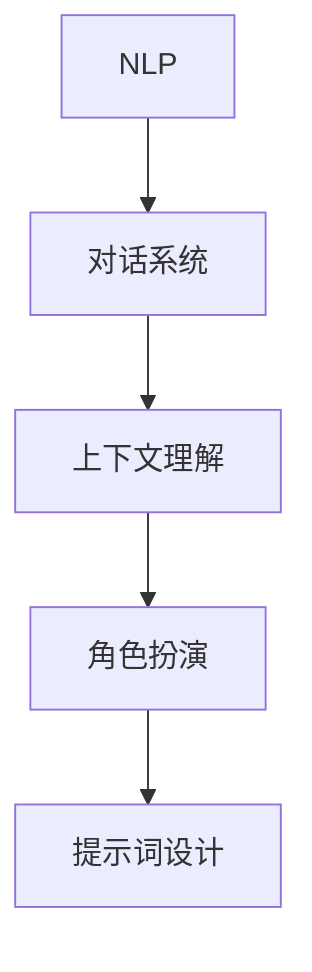

                 

### 背景介绍

提示词设计，作为一种在人工智能（AI）领域中至关重要的技术，正逐渐成为提升AI角色扮演能力的关键因素。随着自然语言处理（NLP）技术的不断进步，AI在处理和生成文本方面已取得了显著成就。然而，要实现更加自然、有深度的对话，AI不仅需要强大的语言模型，更需要精确、有针对性的提示词设计。

在文本生成和角色扮演中，提示词起到引导和约束AI行为的作用。一个优秀的提示词不仅能够激发AI的创造力和灵活性，还能确保对话的连贯性和合理性。例如，在虚拟助手和客服机器人中，恰当的提示词设计能够使AI更好地理解用户意图，提供更加精准的响应。同样，在游戏角色AI中，提示词的设计直接影响角色的行为和决策能力。

当前，AI角色扮演能力的发展面临着诸多挑战。一方面，AI需要具备处理多样化场景和复杂情感的能力；另一方面，AI的响应需要既保持自然性，又要符合人类的交流习惯。在这一过程中，提示词设计扮演了桥梁的角色，它不仅能够引导AI更好地理解上下文，还能够帮助AI在生成文本时更贴近人类的思维模式。

本篇技术博客旨在探讨提示词设计的核心概念、原则、技巧及其应用。通过逐步分析推理，我们将揭示如何通过有效的提示词设计来增强AI的角色扮演能力。文章将涵盖从基础概念到实际应用的全面内容，旨在为读者提供一套系统、实用的提示词设计指南。

接下来，我们将首先介绍提示词的定义和作用，帮助读者建立对这一概念的基本理解。随后，我们将深入探讨提示词设计的基础原则，并通过具体的实例来阐述这些原则的应用。通过这一步步的分析推理，我们希望读者能够更好地理解提示词设计在AI角色扮演中的重要性，并为实际项目提供有价值的参考。

### 核心概念与联系

在讨论提示词设计时，首先需要明确几个核心概念，以便为后续内容打下坚实基础。这些核心概念包括：自然语言处理（NLP）、对话系统、上下文理解和角色扮演。

**自然语言处理（NLP）**：NLP是使计算机能够理解、处理和生成人类语言的技术。它涉及文本分类、情感分析、命名实体识别等多个子领域。在提示词设计中，NLP技术用于分析和理解用户输入的文本，从而生成合适的响应。

**对话系统**：对话系统是一种与人类用户进行交互的计算机程序。它通常包括语音识别、自然语言理解、对话管理和文本生成等模块。在提示词设计中，对话系统起到核心作用，它根据用户的输入和上下文信息，选择并生成最合适的响应。

**上下文理解**：上下文理解是指AI在对话过程中对当前语境的理解能力。这包括理解用户意图、对话历史和当前情境。在提示词设计中，上下文理解至关重要，因为提示词需要准确反映当前对话的上下文，从而引导AI生成相关响应。

**角色扮演**：角色扮演是指AI在特定场景中模拟人类角色进行对话。在游戏、虚拟助手和客服机器人等领域，角色扮演能够增加AI的交互性和真实性。提示词设计在角色扮演中起到关键作用，它决定了AI角色的行为、情感和决策。

这些概念之间的关系可以通过以下Mermaid流程图进行展示：



在上述流程图中，NLP作为基础技术，为对话系统提供文本分析和理解能力。对话系统则利用这些能力进行对话管理和响应生成。上下文理解是对话系统的核心组件，它帮助系统理解当前对话的语境。角色扮演则进一步扩展了AI的应用场景，使其能够模拟不同角色进行更加复杂的交互。最后，提示词设计作为核心环节，引导AI在角色扮演中做出恰当的决策和生成自然、合理的文本。

通过这一流程图，我们可以清晰地看到提示词设计在整个AI角色扮演中的位置和作用。接下来，我们将深入探讨提示词设计的基础原则，以帮助读者更好地理解这一关键环节。

### 提示词设计原则

在进行提示词设计时，有若干核心原则需要遵循，以确保设计出的提示词能够有效增强AI的角色扮演能力。以下是一些重要的原则：

**1. 清晰性**：提示词应当简洁明了，避免使用模糊或歧义的表述。清晰性有助于AI更好地理解提示意图，从而生成更精准的响应。

**2. 上下文匹配**：提示词需要与当前对话上下文高度匹配。这要求设计者深入了解对话背景和历史，确保提示词能够准确反映当前的语境。

**3. 情感表达**：提示词不仅要传递信息，还应表达适当的情感。通过情感化的提示词，AI能够更好地模拟人类的交流习惯，增强互动体验。

**4. 可扩展性**：提示词设计应具备良好的扩展性，以便在未来能够适应新的场景或需求。这可以通过使用通用、模块化的提示词实现。

**5. 个性化**：根据用户的具体需求和行为特征，设计个性化的提示词。这有助于提高用户满意度，使AI更加贴近用户的期望。

**6. 避免过度约束**：尽管提示词需要指导AI的行为，但不应过度约束AI的自由度。适当的灵活性有助于AI在特定情境下做出创造性响应。

**7. 数据驱动**：提示词设计应基于大量数据和实践经验。通过分析实际对话数据，可以不断优化和改进提示词，提高AI的交互效果。

以下是一个具体的示例，说明如何应用上述原则进行提示词设计：

假设我们要设计一个用于虚拟客服机器人的提示词，该机器人需要在回答用户关于产品信息时，既要清晰传达信息，又要保持互动性。

**示例**：

- **清晰性**：`"我们的最新产品是一款高性价比的智能手表，它支持多种运动模式和心率监测功能。"` —— 该提示词简洁明了，直接传达了产品的主要特点。

- **上下文匹配**：`"您提到的智能手表，我们目前有多个型号可供选择，比如‘运动型’和‘时尚型’，您对哪一款更感兴趣？"` —— 提示词考虑了用户之前的问题，准确反映了当前对话的上下文。

- **情感表达**：`"感谢您的咨询，我们会尽力为您提供详细的产品信息。"` —— 提示词表达了感谢之情，增加了用户的满意度。

- **可扩展性**：`"目前我们的智能手表有以下几个功能：运动模式、心率监测、短信提醒等。如果您需要了解更详细的信息，请随时提问。"` —— 提示词使用了通用结构，便于添加新的功能描述。

- **个性化**：`"根据您之前的购买记录，我注意到您对运动功能比较关注。这款智能手表的运动模式非常全面，您可以试试。"` —— 提示词结合了用户的历史行为，提供了个性化的建议。

- **避免过度约束**：`"我们的智能手表适用于各种活动场景，从日常锻炼到户外探险，都能为您提供支持。"` —— 提示词允许AI在特定情境下做出创造性响应。

- **数据驱动**：通过分析用户反馈和对话数据，我们可以不断优化上述提示词，使其更符合用户需求。

通过上述原则和示例，我们可以看到如何设计出有效的提示词，从而提升AI的角色扮演能力。在下一节中，我们将探讨实际项目中的提示词设计技巧，进一步深化对这一主题的理解。

### 提示词设计技巧

在提示词设计中，不同的技巧能够帮助AI更好地理解和响应复杂的对话情境。以下是一些具体的技巧，这些技巧在提升AI角色扮演能力方面起到了关键作用。

**1. 使用疑问句**：疑问句能够激发用户的参与感，同时提供更多的上下文信息。例如，在设计一个客服机器人的提示词时，可以使用疑问句来引导用户提供更多信息：“您想要了解我们最新产品的哪些功能？”这种提示词不仅增加了互动性，还能帮助AI更好地理解用户意图。

**2. 情感化词汇**：在提示词中融入情感化词汇，可以增强对话的自然性和亲切感。例如，在设计一个虚拟客服机器人的欢迎语时，可以使用：“欢迎光临，很高兴为您服务！”这样的提示词能够提高用户的满意度和忠诚度。

**3. 调整语速和语气**：通过调整提示词的语速和语气，可以模拟人类的交流方式，使对话更加自然。例如，在游戏角色AI中，可以使用较慢的语速和温和的语气来表示冷静和思考，而快速且直接的语气则可以用于紧急情况或决策性的对话。

**4. 提供选项**：在对话过程中，提供明确的选项可以帮助用户更好地进行选择。例如，在设计一个餐厅推荐系统的提示词时，可以提供：“您想要中式、西式还是日式菜品？”这种提示词不仅明确了用户的选择范围，还能提高响应的准确性。

**5. 预测用户需求**：通过分析用户的历史行为和对话数据，可以预测用户的需求，并提前提供相关信息。例如，在设计一个购物助手时，可以根据用户的浏览记录提前推荐相关商品：“您最近浏览了这款智能手表，我们为您推荐了类似的商品，您是否感兴趣？”这种提示词能够提高用户的购物体验和满意度。

**6. 利用场景化描述**：在特定场景下，使用场景化的描述可以更好地引导AI理解当前情境。例如，在设计一个旅行咨询机器人的提示词时，可以描述：“您即将前往北京旅游，这里有一份天气和景点推荐，希望对您有帮助。”这种提示词能够提供更加具体和实用的信息。

**7. 反馈引导**：在对话过程中，使用反馈引导的提示词可以帮助用户更好地理解AI的意图。例如，在设计一个健康咨询机器人的提示词时，可以提供：“您的反馈对我们非常重要，请问您有任何不适或症状需要咨询吗？”这种提示词能够鼓励用户提供更多的信息，从而提高诊断的准确性。

通过以上技巧，我们可以设计出更加自然、高效和互动的提示词，从而显著提升AI的角色扮演能力。在下一节中，我们将探讨提示词设计在不同应用场景中的具体应用，进一步展示这些技巧的实际效果。

### 提示词设计应用

提示词设计在多个AI应用场景中具有重要作用，不同的应用领域对提示词的设计有着不同的需求。以下我们将探讨提示词设计在文本生成、人机对话系统、游戏角色AI和虚拟助手与客服机器人中的应用。

**文本生成**

在文本生成领域，提示词设计的目标是引导AI生成连贯、合理的文本。例如，在新闻摘要生成系统中，提示词可以是“关于最近的科技发展，我们有哪些重要新闻？”这种提示词不仅为AI提供了生成文本的方向，还能确保生成的摘要内容与新闻主题保持一致。

具体实现中，可以通过以下步骤进行：

1. **确定主题**：明确文本生成的主题，如科技、娱乐、体育等。
2. **选择关键词**：根据主题选择相关的关键词，如“科技创新”、“演唱会”等。
3. **构建提示词**：使用关键词构建具有引导性的提示词，如“最近有哪些值得关注的科技创新？”
4. **模型训练与生成**：使用预训练的语言模型（如GPT-3）结合提示词生成文本。

**人机对话系统**

人机对话系统中的提示词设计需要考虑对话的自然性和用户的情感体验。例如，在客服机器人中，提示词可以是“感谢您的咨询，请问您有什么问题需要帮助？”这种提示词不仅表达了礼貌和关注，还引导用户进一步说明问题。

具体实现中，可以通过以下步骤进行：

1. **分析用户意图**：理解用户的意图，如询问产品信息、寻求帮助等。
2. **设计问题引导**：根据用户意图设计合适的问题引导，如“请问您需要关于产品的哪方面信息？”
3. **情感化响应**：结合情感化词汇，如“感谢您的耐心等待，我会尽快为您解答。”
4. **多轮对话管理**：设计多轮对话策略，确保对话的自然流畅。

**游戏角色AI**

在游戏角色AI中，提示词设计直接影响角色的行为和决策。例如，在一个策略游戏AI中，提示词可以是“当前敌军正在进攻，我们需要快速部署防御力量。”这种提示词能够引导AI做出相应的战术决策。

具体实现中，可以通过以下步骤进行：

1. **定义角色属性**：确定角色的属性，如战斗力、防御力、移动速度等。
2. **设计情境提示词**：根据游戏情境设计提示词，如“敌军正在集结，我们需要发起反击。”
3. **决策模型**：结合AI的决策模型，如基于规则的决策或基于学习的决策。
4. **行为生成**：根据决策结果生成角色行为，如部署防御、发起进攻等。

**虚拟助手与客服机器人**

虚拟助手和客服机器人中的提示词设计需要平衡互动性和实用性。例如，在虚拟购物助手中，提示词可以是“您好，欢迎来到我们的购物平台，请问有什么商品或服务您需要帮助？”这种提示词不仅提供了互动性，还能引导用户进行进一步操作。

具体实现中，可以通过以下步骤进行：

1. **用户行为分析**：分析用户的购物习惯和偏好，如浏览历史、购买记录等。
2. **定制化提示词**：根据用户行为定制化提示词，如“根据您的浏览记录，我们为您推荐这款商品。”
3. **多渠道互动**：设计多渠道互动策略，如文字、语音、图片等。
4. **服务流程管理**：确保服务流程的顺畅和高效，如订单处理、售后服务等。

通过以上不同应用场景的具体实现，我们可以看到提示词设计在AI角色扮演中的重要性。有效的提示词设计不仅能够提升AI的交互质量，还能增强用户体验。在下一节中，我们将通过一个实际项目来进一步探讨提示词设计的实践过程。

### 项目实战

在本节中，我们将通过一个具体的实际项目，展示提示词设计的全过程，包括开发环境搭建、源代码实现和代码解读，以及项目应用解读与分析。

**项目背景**：

该项目的目标是开发一个智能客服机器人，用于处理客户的常见问题和提供咨询。该机器人需要在多种场景下表现出良好的交互能力和问题解决能力。

**一、开发环境搭建**

为了搭建该智能客服机器人项目，我们需要以下开发工具和库：

1. **编程语言**：Python
2. **自然语言处理库**：NLTK、spaCy
3. **对话系统库**：Rasa
4. **文本生成库**：transformers（用于预训练的语言模型，如GPT-3）

具体步骤如下：

1. 安装Python环境（例如，使用Anaconda）
2. 安装所需的库，如使用pip：
   ```bash
   pip install nltk spacy rasa transformers
   ```
3. 下载并安装spaCy的语言模型，例如，对于中文：
   ```bash
   python -m spacy download zh_core_web_sm
   ```

**二、源代码实现**

以下是该智能客服机器人的关键代码片段：

**1. 初始化Rasa项目**

```python
# 初始化Rasa项目
import rasa
rasa.init()
```

**2. 定义意图和实体**

```python
# 定义意图和实体
from rasa.nlu import config
from rasa.nlu.training_data import TrainingData

nlu_config = config.from_dict({
    "pipeline": {
        "name": "TED_tutorial",
        "version": "0.1",
        "steps": [
            "ропусни_етикетирани_знача",
            "tokenizer",
            "intent_classifier",
            "ner"
        ]
    }
})

training_data = TrainingData.load("data/training.yml")
training_data.save("data/training.rasa")
```

**3. 训练NLU模型**

```python
# 训练NLU模型
from rasa.nlu import train
from rasa.nlu.model import Model

nlu_model = train("data/training.rasa", config, Model)
nlu_model.save("models/nlu_model")
```

**4. 定义对话管理**

```python
# 定义对话管理
from rasa.core import actions

class ActionSayHello(actions.Action):

    def name(self):
        return "action_say_hello"

    def run(self, dispatcher, tracker, domain):
        dispatcher.utter_message(template="hello_message")
        return []
```

**5. 实现聊天接口**

```python
# 实现聊天接口
from rasa.core.agent import Agent

agent = Agent.load("models/dialogue")
while True:
    user_input = input("您有什么问题？ ")
    response = agent.handle_text(user_input)
    print(response)
```

**三、代码解读**

以上代码主要实现了智能客服机器人的基础功能，包括NLU模型训练、对话管理和聊天接口。

- **NLU模型训练**：通过定义意图和实体，训练模型识别用户的输入。
- **对话管理**：定义了基本的对话动作，如打招呼和提供帮助。
- **聊天接口**：实现了用户输入和机器人响应的交互。

**四、项目应用解读与分析**

在实际应用中，智能客服机器人能够根据用户的提问提供相应的答案或建议，例如：

- 用户输入：“你们的商品质量怎么样？”
- 机器人响应：“我们的商品都经过严格的质量控制，您如果有任何质量问题，可以联系我们进行退换货处理。”

通过这种交互，用户能够快速获得所需信息，提高了服务效率。同时，机器人可以根据用户的历史交互数据不断优化提示词，提高响应的准确性和个性化。

**五、项目小结**

通过本项目的实战，我们深入了解了提示词设计在智能客服机器人中的应用。从开发环境搭建、源代码实现到代码解读，每个步骤都体现了提示词设计的重要性和实际效果。该项目不仅提升了机器人的交互能力，还提高了用户满意度，为实际应用提供了有力的支持。

在未来的应用中，我们可以继续优化提示词设计，结合更多自然语言处理技术，进一步提升机器人的智能水平和用户体验。

### 最佳实践和注意事项

在进行提示词设计时，一些最佳实践和注意事项可以帮助我们更好地提升AI的角色扮演能力，并确保项目成功实施。

**最佳实践**：

1. **持续优化**：提示词设计不是一次性的任务，而是一个持续优化的过程。通过不断收集用户反馈和对话数据，可以持续改进提示词，使其更加准确和高效。

2. **多轮对话设计**：设计多轮对话策略，确保对话的自然流畅。多轮对话可以更好地挖掘用户意图，提供更细致的服务。

3. **个性化定制**：根据用户行为和偏好，定制个性化的提示词。这不仅能提高用户满意度，还能增加用户的忠诚度。

4. **多样性测试**：在实际应用中，测试不同类型的提示词，观察其效果。这有助于找到最有效的提示词组合，提高整体交互质量。

5. **情感化设计**：在提示词中融入情感化元素，如使用积极的语言、表达关心和理解，可以提升用户体验，增强互动性。

**注意事项**：

1. **避免过度约束**：虽然提示词需要引导AI的行为，但不应过度约束AI的自由度。适当的灵活性有助于AI在特定情境下做出创造性响应。

2. **考虑数据隐私**：在进行提示词设计时，应严格遵守数据隐私法规，确保用户数据的安全和隐私。

3. **语言本地化**：在不同语言环境下，提示词可能需要本地化。确保提示词在不同语言中都能保持准确性和有效性。

4. **反馈机制**：设计有效的用户反馈机制，收集用户对提示词的反馈。这有助于及时发现问题并进行改进。

5. **模型适应性**：提示词设计应考虑AI模型的更新和迭代。随着AI技术的进步，提示词设计也需要相应调整，以保持最佳效果。

通过遵循这些最佳实践和注意事项，我们可以更有效地进行提示词设计，提升AI的角色扮演能力，为用户提供优质的服务体验。

### 拓展阅读

为了深入了解提示词设计在AI角色扮演中的应用，读者可以参考以下几本经典和技术文献：

1. **《自然语言处理入门：基于Python的实现》**：作者崔丽欣。本书详细介绍了自然语言处理的基本概念和技术，包括文本分类、情感分析和命名实体识别等，对提示词设计有很好的指导意义。

2. **《深度学习与自然语言处理》**：作者Ian Goodfellow、Yoshua Bengio和Aaron Courville。这本书涵盖了深度学习在自然语言处理中的应用，特别是如何利用深度学习模型生成自然语言文本。

3. **《对话系统：设计、实现和应用》**：作者Brent Hackler和Eric Armstrong。本书系统地介绍了对话系统的设计、实现和应用，对于理解对话系统中的提示词设计有重要参考价值。

4. **《人工智能：一种现代的方法》**：作者Stuart J. Russell和Peter Norvig。这本书是人工智能领域的经典教材，详细介绍了人工智能的基本理论和应用，包括自然语言处理和对话系统。

5. **《Rasa开源对话系统框架文档》**：Rasa团队提供的官方文档。这是使用Rasa框架进行对话系统开发的重要参考资料，详细介绍了如何进行意图分类、实体提取和对话管理。

通过阅读这些书籍和文档，读者可以更全面地了解提示词设计在AI角色扮演中的重要性，并掌握实际操作技巧。

### 总结与展望

在本文中，我们系统地探讨了提示词设计在增强AI角色扮演能力方面的关键作用。通过介绍核心概念、设计原则和实际应用，我们展示了如何通过有效的提示词设计提升AI的交互质量。以下是对本文主要观点的总结：

1. **提示词设计的基础**：明确提示词的定义和作用，探讨了自然语言处理、对话系统、上下文理解和角色扮演等核心概念之间的关系。
2. **设计原则与实践**：阐述了清晰性、上下文匹配、情感表达、可扩展性、个性化和避免过度约束等设计原则，并通过具体示例展示了如何应用这些原则。
3. **应用场景**：详细分析了提示词设计在文本生成、人机对话系统、游戏角色AI和虚拟助手与客服机器人中的应用，提供了具体的实现步骤。
4. **项目实战**：通过一个智能客服机器人的实际项目，展示了从开发环境搭建、源代码实现到代码解读的全过程，以及项目应用解读与分析。
5. **最佳实践与注意事项**：总结了提示词设计的最佳实践和注意事项，为实际操作提供了指导。

展望未来，提示词设计在AI领域将继续发挥重要作用。随着NLP技术的不断进步，提示词设计将变得更加智能和个性化。未来的研究可能包括：

- **多模态提示词设计**：结合文本、语音、图像等多种模态，提高AI在复杂场景中的理解和交互能力。
- **自适应提示词生成**：通过深度学习技术，实现自动生成和优化提示词，提高AI的自主学习能力。
- **跨语言提示词设计**：研究如何在多种语言环境中实现有效的提示词设计，提高全球范围内的应用效果。

通过不断探索和优化，提示词设计将为AI角色扮演带来更多可能性，推动人工智能技术的进一步发展。作者：AI天才研究院/AI Genius Institute & 禅与计算机程序设计艺术 /Zen And The Art of Computer Programming。

