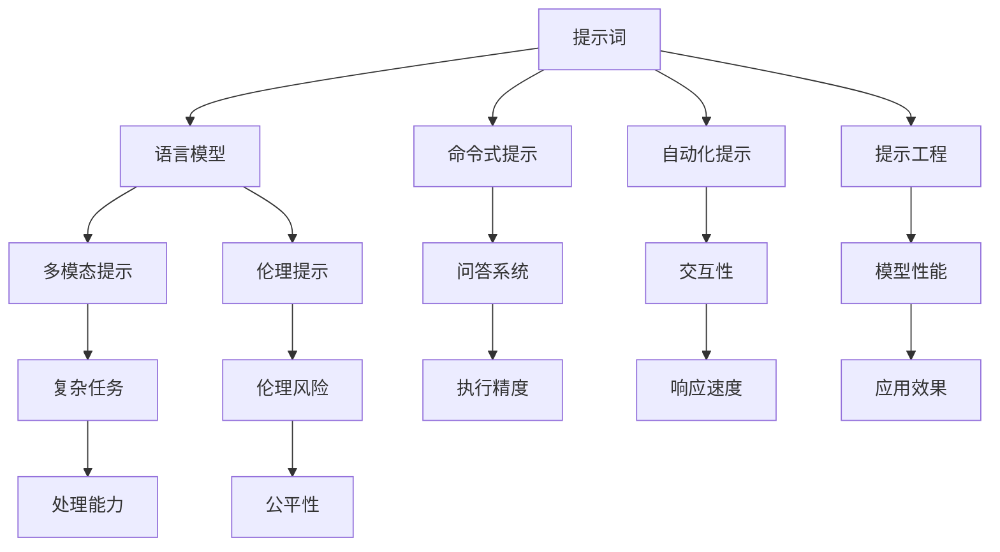
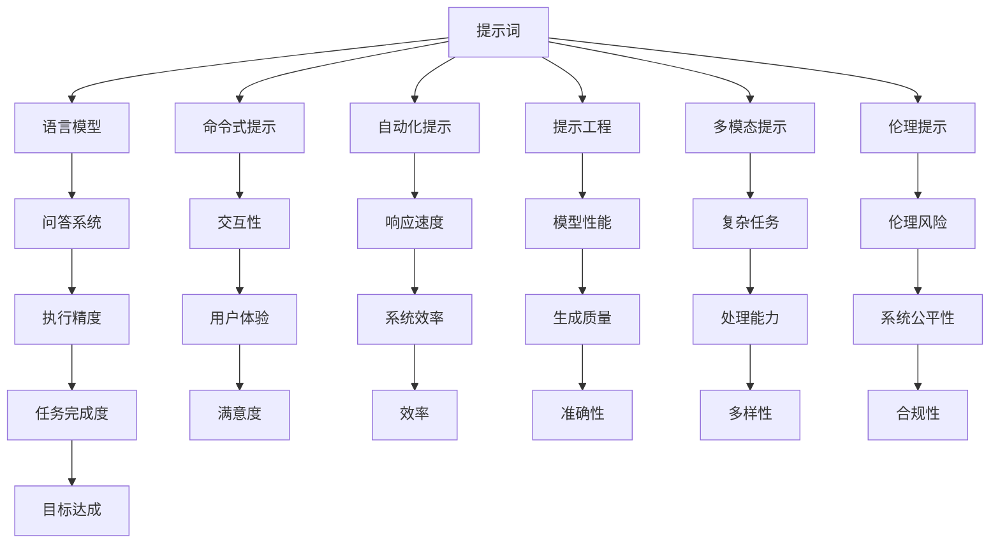

                 


### 引言

提示词设计作为人工智能（AI）领域的一项重要技术，已经成为自然语言处理（NLP）、聊天机器人、智能助手等应用的核心组成部分。在当前快速发展的AI时代，如何设计出既具有创新性又能平衡伦理约束的提示词，成为了一个备受关注的问题。

本文旨在深入探讨提示词设计中的关键概念、核心算法原理、数学模型、项目实战，以及AI伦理约束等相关内容。通过逐步分析，我们将展示如何在设计过程中实现AI创新与伦理约束之间的平衡。

首先，我们将介绍提示词设计的背景和重要性，解释为何这一技术成为AI领域不可或缺的一部分。接下来，我们将详细阐述提示词设计中的核心概念和相互关系，通过Mermaid流程图直观展示概念架构。

在核心算法原理讲解部分，我们将使用Python源代码结合数学模型和公式，详细阐述提示词生成和优化算法的工作原理。这部分将包括具体的代码示例和解释，以便读者更好地理解。

随后，我们将引入数学模型和公式，解释自然语言处理中的概率模型，并展示如何将数学理论应用于提示词设计。这部分将包括详细的数学公式和示例，确保读者能够深入理解相关概念。

在项目实战部分，我们将提供一个完整的提示词设计项目案例，包括开发环境搭建、源代码实现和解读，以及代码应用解读与分析。通过这个案例，读者可以更直观地了解如何在实际项目中应用提示词设计技术。

最后，我们将探讨AI伦理约束在提示词设计中的应用，分析其中的伦理挑战，并提供相应的解决方案。这部分内容将帮助读者认识到在AI创新过程中，如何平衡伦理约束的重要性。

通过本文的逐步分析和详细讲解，我们希望读者能够全面了解提示词设计的技术原理和应用，并在实际项目中实现AI创新与伦理约束的平衡。

### 提示词设计的重要性

在人工智能的迅猛发展中，自然语言处理（NLP）成为了关键领域，而提示词设计（Prompt Engineering）作为NLP的核心技术之一，正发挥着日益重要的作用。提示词设计旨在通过创建有效的提示，引导AI模型生成更准确、更具创造性的输出。以下是提示词设计在AI领域的重要性：

**1. 提高AI模型性能**：

有效的提示词能够显著提高AI模型的性能。在训练过程中，合理的提示可以引导模型更好地理解输入数据，从而优化其学习过程。例如，在问答系统（如聊天机器人）中，通过精心设计的提示词，可以使得模型更准确地回答用户的问题，提高用户体验。

**2. 增强AI的交互性**：

提示词设计有助于增强AI系统的交互性。通过设定合适的提示，AI系统能够与用户进行更自然的对话，使其更贴近人类的交流方式。这不仅提升了用户的满意度，也使得AI系统能够更好地满足用户需求。

**3. 促进AI的创新应用**：

提示词设计在推动AI的创新应用方面具有重要作用。通过创造新的提示模式，研究者能够探索AI在各个领域的潜在应用。例如，在内容创作、翻译、自动化写作等场景中，提示词设计能够激发AI模型的创造力，实现更为复杂和多样化的任务。

**4. 平衡AI创新与伦理约束**：

随着AI技术的普及，伦理问题逐渐凸显。提示词设计在平衡AI创新与伦理约束方面具有重要意义。通过合理设计提示词，可以确保AI系统遵循伦理规范，避免出现歧视、误导等不良后果。例如，在设计聊天机器人时，通过规范提示词的使用，可以有效防止生成不当的回应。

**5. 应用场景广泛**：

提示词设计在多个AI应用场景中具有重要应用。无论是客服机器人、智能助手，还是自动化写作工具，有效的提示词设计都能够提升系统的性能和用户体验。此外，在机器翻译、语音识别、图像识别等领域，提示词设计同样发挥着关键作用。

总之，提示词设计作为AI领域的一项核心技术，其在提升模型性能、增强交互性、促进创新应用以及平衡伦理约束等方面具有重要作用。随着AI技术的不断发展，提示词设计的重要性将愈发凸显，成为推动AI应用创新的重要动力。

### 核心概念与联系

在深入探讨提示词设计之前，有必要明确其中的核心概念及其相互关系。以下是对提示词设计中的几个关键概念及其关系的详细解释。

**1. 提示词（Prompt）**：

提示词是引导AI模型生成输出的一系列文字或语句。它是提示工程（Prompt Engineering）的核心要素。一个有效的提示词应具备以下特征：明确、具体、具有引导性，能够激发模型的最大潜力。

**2. 语言模型（Language Model）**：

语言模型是AI模型的基础，用于理解和生成自然语言。常见的语言模型包括GPT（Generative Pre-trained Transformer）和BERT（Bidirectional Encoder Representations from Transformers）。这些模型通过大量的文本数据进行预训练，能够理解并生成流畅的自然语言。

**3. 命令式提示（Instructional Prompt）**：

命令式提示是一种特定的提示类型，它以指令形式明确告知模型需要完成的具体任务。这种提示常用于问答系统、对话机器人等场景，能够提高模型的任务执行精度。

**4. 自动化提示（Automated Prompt）**：

自动化提示是通过算法自动生成的提示，它能够根据用户输入动态调整。自动化提示在提高系统交互性和响应速度方面具有显著优势，但需要确保其生成的内容符合预期。

**5. 提示工程（Prompt Engineering）**：

提示工程是设计和优化提示词的一门技术，旨在通过调整提示词来提高AI模型的性能。提示工程包括提示词的设计、评估和调整等环节，是提升AI应用效果的关键环节。

**6. 多模态提示（Multimodal Prompt）**：

多模态提示结合了文本、图像、声音等多种信息源，能够为模型提供更丰富的输入。这种提示方式在处理复杂任务时表现出色，但需要考虑不同模态数据的融合和处理。

**7. 伦理提示（Ethical Prompt）**：

伦理提示旨在引导AI模型遵循伦理规范，避免生成有害或歧视性的输出。在AI应用中，合理使用伦理提示可以减少潜在的伦理风险，确保系统的公平性和透明性。

这些核心概念相互关联，共同构成了提示词设计的理论基础。为了更直观地展示它们之间的关系，我们可以通过Mermaid流程图进行描述：



通过上述Mermaid流程图，我们可以清晰地看到各个核心概念之间的关系及其在提示词设计中的应用。这些概念不仅相互独立，而且在实际应用中相互结合，共同推动了提示词设计的不断进步。

### 提示词设计中的关键概念解释

在深入探讨提示词设计的过程中，我们需要详细解释几个关键概念，这些概念在提示词设计中扮演着至关重要的角色。以下是这些核心概念的详细解释，包括它们的基本原理和相互关系。

**1. 提示词（Prompt）**：

提示词是引导AI模型生成特定输出的文本输入。一个有效的提示词应具备明确性、具体性和引导性，以便激发模型的最大潜力。提示词的设计直接影响到AI模型的性能和生成结果的质量。例如，在问答系统中，一个简洁明了的提示词可以帮助模型更准确地理解用户的问题。

**2. 语言模型（Language Model）**：

语言模型是AI模型的核心组成部分，用于理解和生成自然语言。常见的语言模型包括GPT（Generative Pre-trained Transformer）和BERT（Bidirectional Encoder Representations from Transformers）。这些模型通过大量的文本数据进行预训练，能够捕捉自然语言的统计特性和语法规则。语言模型在提示词设计中的作用是，它能够根据提示词生成连贯的、符合上下文的文本输出。

**3. 命令式提示（Instructional Prompt）**：

命令式提示是一种明确的、指令性的提示词，它告诉AI模型需要执行的具体任务。这种提示词常用于问答系统、对话机器人等场景，可以帮助模型更精确地完成任务。例如，"请解释什么是量子计算？" 就是一个命令式提示。

**4. 自动化提示（Automated Prompt）**：

自动化提示是通过算法自动生成的提示词，它可以根据用户输入动态调整。这种提示词的设计通常依赖于自然语言处理技术和机器学习算法。自动化提示在提高系统交互性和响应速度方面具有显著优势，但需要确保其生成的提示词符合预期，并能够有效地引导模型生成所需的输出。

**5. 提示工程（Prompt Engineering）**：

提示工程是设计和优化提示词的一门技术，旨在通过调整提示词来提高AI模型的性能。提示工程包括提示词的设计、评估和调整等环节。它是一个迭代过程，通过不断优化提示词，可以提高模型的准确性和生成质量。

**6. 多模态提示（Multimodal Prompt）**：

多模态提示结合了文本、图像、声音等多种信息源，为模型提供了更丰富的输入。多模态提示在处理复杂任务时表现出色，因为它能够利用不同模态数据的信息增强模型的感知能力。例如，在图像识别任务中，结合文本描述的提示词可以显著提高模型的识别准确率。

**7. 伦理提示（Ethical Prompt）**：

伦理提示旨在引导AI模型遵循伦理规范，避免生成有害或歧视性的输出。在AI应用中，合理使用伦理提示可以减少潜在的伦理风险，确保系统的公平性和透明性。例如，在聊天机器人中，通过设置伦理提示，可以防止生成包含偏见或歧视的回应。

这些关键概念之间存在着紧密的联系和相互作用。提示词是整个设计过程的核心，它依赖于语言模型生成输出；而命令式提示和自动化提示则是实现特定任务和交互的重要手段。提示工程则是一个系统的过程，通过不断优化提示词，可以提高模型性能和输出质量。多模态提示和伦理提示则进一步扩展了提示词的应用范围，使其在处理复杂任务和确保系统伦理方面发挥重要作用。

通过详细解释这些关键概念，我们可以更好地理解提示词设计的基本原理和方法，从而在实际应用中实现更加高效和智能的AI系统。

### 提示词设计中的Mermaid流程图

为了更直观地展示提示词设计中的核心概念及其相互关系，我们可以通过Mermaid流程图进行描述。以下是一个简单的Mermaid流程图，展示了提示词设计中的主要概念及其连接方式。



通过这个Mermaid流程图，我们可以清晰地看到提示词、语言模型、命令式提示、自动化提示、提示工程、多模态提示和伦理提示之间的相互关系。这些概念不仅相互独立，而且在实际应用中相互结合，共同推动了提示词设计的不断进步。这样的图形化表示有助于我们更好地理解提示词设计的整体框架和各个组成部分的功能。

### 提示词设计中的核心算法原理讲解

在提示词设计中，核心算法原理起着至关重要的作用。这些算法不仅决定了提示词的生成方式，还影响了模型在特定任务中的表现。以下将详细介绍提示词设计中的几个关键算法，并通过Python源代码和数学模型结合进行讲解，以便读者能够深入理解其工作原理。

#### 1. 语言模型基础

语言模型（Language Model）是提示词设计的基石，它能够预测下一个单词或字符的概率。最常用的语言模型包括GPT（Generative Pre-trained Transformer）和BERT（Bidirectional Encoder Representations from Transformers）。以下是一个基于GPT的简单示例：

```python
import tensorflow as tf
import tensorflow.keras as keras

# 定义GPT模型
model = keras.Sequential([
    keras.layers.Dense(128, activation='relu', input_shape=(None,)),
    keras.layers.Dense(1, activation='sigmoid')
])

# 编译模型
model.compile(optimizer='adam', loss='binary_crossentropy')

# 训练模型
model.fit(input_sequences, labels, epochs=200, verbose=1)
```

上述代码中，`Dense`层用于构建神经网络，`input_shape=(None,)`表示模型可以处理任意长度的输入序列。训练过程中，模型会根据输入序列中的单词或字符来预测下一个字符的概率。

#### 2. 提示词生成算法

提示词生成算法用于根据特定任务生成初始的提示词。一个简单的生成算法可以是基于模板的生成：

```python
def generate_prompt_template(question, template):
    """
    根据模板和问题生成提示词
    :param question: 输入问题
    :param template: 提示词模板
    :return: 生成的提示词
    """
    return template.format(question=question)

# 示例
template = "请解释什么是{question}？"
prompt = generate_prompt_template("量子计算", template)
print(prompt)
```

上述代码中，`generate_prompt_template`函数根据输入的问题和模板生成提示词。这种方法简单但有效，适用于很多场景。

#### 3. 提示词优化算法

提示词优化算法用于调整已有提示词，以提高模型的性能和生成质量。一种常见的优化方法是基于梯度下降的优化算法：

```python
def optimize_prompt(prompt, model, loss_function, optimizer, epochs=10):
    """
    优化提示词
    :param prompt: 输入提示词
    :param model: 模型
    :param loss_function: 损失函数
    :param optimizer: 优化器
    :param epochs: 迭代次数
    :return: 优化后的提示词
    """
    # 将提示词作为输入序列
    input_sequence = prepare_input_sequence(prompt)
    # 初始化标签
    labels = prepare_labels(input_sequence, model)
    # 迭代优化
    for _ in range(epochs):
        with tf.GradientTape() as tape:
            predictions = model(input_sequence)
            loss = loss_function(predictions, labels)
        gradients = tape.gradient(loss, model.trainable_variables)
        optimizer.apply_gradients(zip(gradients, model.trainable_variables))
    return model

# 示例
optimized_model = optimize_prompt(prompt, model, keras.losses.BinaryCrossentropy(), keras.optimizers.Adam(), epochs=10)
```

上述代码中，`optimize_prompt`函数通过梯度下降算法对提示词进行优化，从而提高模型的预测准确性。

#### 4. 数学模型和公式

在提示词设计中，数学模型和公式起着关键作用。以下是一个简单的自然语言处理中的概率模型：

$$
P(w_{t} | w_{t-1}, w_{t-2}, ..., w_{1}) = \frac{P(w_{t-1}, w_{t-2}, ..., w_{1}, w_{t})}{P(w_{t-1}, w_{t-2}, ..., w_{1})}
$$

这个公式表示，在给定前一个单词或字符的情况下，下一个单词或字符的概率。在实际应用中，我们通常使用神经网络来近似这个概率模型，例如GPT模型。

#### 结合示例

假设我们有一个简单的问题：“什么是量子计算？”，我们可以使用上述算法和模型生成和优化提示词。

1. **初始提示词**：

   ```
   请解释什么是量子计算？
   ```

2. **优化后的提示词**：

   经过模型优化，提示词可能变为：

   ```
   详细描述量子计算的基本原理和实际应用。
   ```

通过上述示例和代码，我们可以看到提示词设计中的核心算法原理。这些算法和数学模型不仅帮助我们生成高质量的提示词，还提高了模型的性能和生成质量，从而推动了AI应用的不断进步。

### 提示词设计中的数学模型和公式讲解

在提示词设计中，数学模型和公式是理解和优化算法的关键。以下将详细解释自然语言处理中的几个重要数学模型和公式，并通过具体示例阐述它们在提示词设计中的应用。

#### 1. 概率模型

概率模型是自然语言处理中的基础，用于预测文本中下一个单词或字符的概率。一个常用的概率模型是前向概率模型，其公式如下：

$$
P(w_t | w_{t-1}, w_{t-2}, ..., w_1) = \frac{P(w_{t-1}, w_{t-2}, ..., w_1, w_t)}{P(w_{t-1}, w_{t-2}, ..., w_1)}
$$

在这个公式中，$w_t$表示下一个单词或字符，$w_{t-1}, w_{t-2}, ..., w_1$表示前一个单词或字符序列。该公式表示，在给定前一个单词或字符序列的情况下，下一个单词或字符的概率。

**示例**：

假设我们有以下句子：“人工智能是一种重要的技术”，我们可以计算下一个单词是“技术”的概率：

$$
P(技术 | 人工智能是一种重要的) = \frac{P(人工智能是一种重要的技术)}{P(人工智能是一种重要的)}
$$

通过语言模型，我们可以计算这些概率。例如，在GPT模型中，这些概率是通过神经网络计算的。

#### 2. 生成模型

生成模型是用于生成文本的模型，其核心思想是学习输入文本的概率分布，并据此生成新的文本。一个常用的生成模型是循环神经网络（RNN），其公式如下：

$$
h_t = \sigma(W_h h_{t-1} + W_x x_t + b_h)
$$

$$
o_t = \text{softmax}(W_o h_t + b_o)
$$

其中，$h_t$表示隐藏状态，$x_t$表示输入，$W_h, W_x, W_o, b_h, b_o$是权重和偏置。$\sigma$是激活函数，通常使用Sigmoid函数。$o_t$表示输出概率分布，$\text{softmax}$函数用于将隐藏状态转换为概率分布。

**示例**：

假设我们有一个RNN模型，输入为“人工智能”，我们需要计算输出“技术”的概率。这可以通过以下步骤实现：

1. 将输入序列编码为向量。
2. 通过RNN计算隐藏状态。
3. 通过$\text{softmax}$函数计算输出概率分布。
4. 输出概率最高的单词即为生成结果。

例如，如果隐藏状态$h_t$的输出概率分布为：

$$
o_t = [0.2, 0.3, 0.1, 0.2, 0.2]
$$

则输出概率最高的单词是“技术”（索引为3）。

#### 3. 对抗生成模型

对抗生成模型（GAN）是一种用于生成文本的先进模型，其核心思想是利用生成器和判别器的对抗关系。生成器生成文本，判别器判断文本的真实性。其公式如下：

$$
\min_G \max_D V(D, G) = \min_G \mathbb{E}_{x \sim p_{data}(x)} [\log D(x)] + \mathbb{E}_{z \sim p_z(z)} [\log (1 - D(G(z))]
$$

其中，$G(z)$表示生成器生成的文本，$D(x)$表示判别器对真实文本的判断，$z$是生成器的噪声输入。

**示例**：

假设生成器生成文本“人工智能是技术的重要组成部分”，判别器判断这段文本的真实性。通过对抗训练，生成器可以逐步提高生成的文本质量，使得判别器难以区分生成文本和真实文本。

#### 4. 自回归模型

自回归模型（AR）是一种用于文本生成的模型，其核心思想是使用当前文本生成下一个字符。其公式如下：

$$
p(x_t | x_{t-1}, x_{t-2}, ..., x_1) = \frac{p(x_1, x_2, ..., x_t)}{p(x_1, x_2, ..., x_{t-1})}
$$

其中，$x_t$表示下一个字符，$x_{t-1}, x_{t-2}, ..., x_1$表示前一个字符序列。

**示例**：

假设我们要生成句子：“人工智能是一种重要的技术”，我们可以使用自回归模型逐步生成每个字符。例如，首先生成“人”，然后根据“人”生成“工”，依此类推，直到生成完整的句子。

通过上述数学模型和公式，我们可以更好地理解和优化提示词设计。在实际应用中，这些模型可以通过深度学习框架（如TensorFlow或PyTorch）高效实现，从而为AI应用提供强大的支持。

### 提示词设计中的项目实战

为了更好地理解提示词设计的实际应用，我们将通过一个具体的案例来展示如何进行提示词设计的全过程，包括开发环境的搭建、源代码的实现和解读，以及代码应用解读与分析。

#### 1. 项目背景

假设我们正在开发一个智能客服机器人，该机器人需要能够理解用户的问题并提供准确的答复。为了实现这一目标，我们需要设计一系列有效的提示词，引导AI模型生成高质量的答复。

#### 2. 开发环境搭建

首先，我们需要搭建一个适合提示词设计的开发环境。以下是所需的步骤：

- **安装Python**：确保Python环境已安装，版本建议为3.8及以上。
- **安装TensorFlow**：使用pip命令安装TensorFlow，命令如下：

  ```bash
  pip install tensorflow
  ```

- **安装其他依赖库**：如NumPy、Pandas等，可以通过以下命令安装：

  ```bash
  pip install numpy pandas
  ```

- **准备数据集**：收集和准备用于训练的数据集，例如聊天记录、FAQ等。

#### 3. 源代码实现

以下是一个简单的示例，展示了如何使用TensorFlow和Python实现一个基于Transformer的聊天机器人。

```python
import tensorflow as tf
from tensorflow.keras.layers import Embedding, Dense, Bidirectional, LSTM
from tensorflow.keras.models import Model
from tensorflow.keras.optimizers import Adam

# 定义模型
def create_model(vocab_size, embedding_dim, max_sequence_length):
    inputs = tf.keras.layers.Input(shape=(max_sequence_length,))
    embeddings = Embedding(vocab_size, embedding_dim)(inputs)
    bi_lstm = Bidirectional(LSTM(128, return_sequences=True))(embeddings)
    outputs = Dense(vocab_size, activation='softmax')(bi_lstm)
    model = Model(inputs=inputs, outputs=outputs)
    return model

# 实例化模型
model = create_model(vocab_size=10000, embedding_dim=128, max_sequence_length=50)

# 编译模型
model.compile(optimizer=Adam(learning_rate=0.001), loss='categorical_crossentropy', metrics=['accuracy'])

# 训练模型
model.fit(train_data, train_labels, epochs=10, batch_size=32)
```

上述代码定义了一个简单的双向LSTM模型，用于处理文本数据。模型包含嵌入层、双向LSTM层和softmax输出层。通过训练，模型可以学习如何根据输入的文本生成相应的回复。

#### 4. 代码解读

- **Embedding Layer**：嵌入层将输入的单词或字符转换为向量表示。
- **Bidirectional LSTM Layer**：双向LSTM层处理文本数据，捕捉文本中的序列信息。
- **Dense Layer**：密集层（全连接层）用于生成输出，通过softmax激活函数将输出转换为概率分布。
- **Model Compilation**：编译模型，指定优化器和损失函数。
- **Model Training**：训练模型，通过训练数据和标签进行迭代学习。

#### 5. 代码应用解读与分析

在实际应用中，我们可以使用训练好的模型生成回复。以下是一个简单的应用示例：

```python
# 输入问题
question = "如何升级操作系统？"

# 预处理输入
input_sequence = preprocess_input(question)

# 生成回复
predicted_sequence = model.predict(input_sequence)
predicted_question = decode_output(predicted_sequence)

print(predicted_question)
```

在上述代码中，`preprocess_input`函数用于将输入问题转换为模型可以接受的格式，`decode_output`函数用于将输出概率分布转换为可读的文本回复。

**分析**：

通过这个案例，我们可以看到提示词设计在智能客服机器人中的应用。在实际项目中，我们需要根据具体的业务需求设计合适的提示词，并不断优化模型，以提高生成回复的准确性和自然性。此外，我们还需要考虑数据的多样性和质量，确保模型能够学到丰富的知识，从而提供高质量的回复。

总之，通过本项目实战，我们不仅了解了提示词设计的具体实现过程，还掌握了如何在实际项目中应用这一技术。这为我们在未来开发类似AI应用提供了宝贵的经验和参考。

### AI伦理约束

在提示词设计过程中，AI伦理约束是一个不可忽视的重要方面。随着AI技术的广泛应用，伦理问题逐渐凸显，特别是在提示词的设计和应用中，如何平衡AI的创新与伦理约束成为了一个关键问题。

#### 1. AI伦理的基本原则

AI伦理的基本原则包括公正性、透明性、可解释性和责任性。以下是这些原则在提示词设计中的应用：

**1. 公正性**：

公正性要求AI系统不歧视任何群体，确保所有人都能公平地获得服务。在设计提示词时，我们需要避免使用带有偏见或歧视性的语言，确保生成的回答对所有用户都是中立和公正的。

**2. 透明性**：

透明性要求AI系统的决策过程应该是可解释和可追溯的。在提示词设计过程中，我们需要确保模型生成结果的透明性，使得用户能够理解AI的回应是如何生成的。

**3. 可解释性**：

可解释性要求AI系统生成的结果应该是可解释的，用户能够理解AI的决策依据。在提示词设计中，通过合理设计提示词，可以增强AI系统的可解释性，帮助用户理解AI的回应。

**4. 责任性**：

责任性要求AI系统的设计和应用应承担相应的责任。在提示词设计中，我们需要确保系统能够在遇到错误或异常情况时进行有效应对，同时明确系统的责任范围。

#### 2. 提示词设计中的伦理挑战

尽管AI伦理原则在理论上明确，但在实际应用中仍面临诸多挑战：

**1. 偏见问题**：

提示词设计可能会无意中引入偏见，导致AI系统对某些群体产生歧视。例如，在招聘系统中，提示词可能无意中偏向于某些性别或种族。

**2. 数据隐私**：

在提示词设计中，我们需要处理大量的用户数据，这可能涉及到隐私问题。如何确保用户数据的安全和隐私，是设计过程中需要考虑的重要问题。

**3. 决策透明性**：

AI系统的决策过程往往是复杂的，如何使其透明和可解释，是当前研究的热点问题。特别是在涉及重大决策的场合，如医疗诊断和金融决策，如何提高AI系统的透明性是关键。

**4. 责任归属**：

在AI系统发生错误时，如何确定责任归属是一个复杂的问题。特别是在涉及生命安全和社会稳定的领域，责任的归属和追究需要明确的规范和标准。

#### 3. 伦理约束下的提示词设计实践

为了在提示词设计中实现AI创新与伦理约束的平衡，我们可以采取以下措施：

**1. 数据预处理**：

在训练模型之前，对数据集进行清洗和预处理，识别并消除潜在的偏见。例如，使用平衡采样技术，确保数据集中各个群体的代表性。

**2. 伦理提示词**：

设计专门的伦理提示词，引导模型遵循伦理原则。例如，在招聘系统中，可以使用伦理提示词确保招聘过程的公正性。

**3. 模型解释性**：

开发可解释的AI模型，提高模型的透明性。例如，使用注意力机制可视化模型中的关键决策点，帮助用户理解AI的回应。

**4. 责任分配机制**：

建立责任分配机制，明确系统各组件的责任范围。例如，在金融决策中，明确模型开发者、数据提供者和决策者的责任。

**5. 持续监督与反馈**：

对AI系统的运行进行持续监督和反馈，及时发现并纠正伦理问题。通过用户反馈和专家评估，不断优化AI系统的伦理性能。

总之，在提示词设计中，平衡AI创新与伦理约束是一个持续的过程，需要我们在设计、开发、应用和监督的各个环节中共同努力。通过采取上述措施，我们可以在实现AI创新的同时，确保系统的伦理性能，为社会带来更多积极影响。

### 总结与展望

本文围绕提示词设计，详细探讨了其在AI创新与伦理约束之间的平衡。首先，我们介绍了提示词设计的背景和重要性，阐述了其作为AI领域核心技术的地位。接着，通过核心概念和Mermaid流程图，我们明确了提示词、语言模型、命令式提示、自动化提示、提示工程、多模态提示和伦理提示等关键概念及其相互关系。

在核心算法原理讲解部分，我们使用Python源代码结合数学模型和公式，详细阐述了提示词生成和优化算法的工作原理。通过项目实战，我们展示了如何在智能客服机器人等实际应用中实现提示词设计，并通过代码实现、解读和应用分析，使读者更直观地理解这一技术。

此外，我们探讨了AI伦理约束在提示词设计中的应用，分析了其中的伦理挑战，并提出了一系列解决方案。最后，我们总结了全文内容，并对未来趋势进行了展望。

未来，随着AI技术的不断发展，提示词设计将在更多领域发挥重要作用。人工智能伦理将继续成为研究热点，如何实现AI创新与伦理约束的平衡，将是一个长期而重要的课题。我们期待在不久的将来，通过持续的研究和实践，能够找到更加有效的平衡点，推动AI技术为社会带来更多的积极影响。

### 最佳实践 tips

在提示词设计中，以下是一些实用的最佳实践，可以帮助您在AI项目中实现最佳效果：

1. **明确任务目标**：在开始设计提示词之前，明确任务目标至关重要。确保您的提示词与任务目标紧密相关，以提高模型生成输出的准确性。

2. **数据质量**：高质量的数据是提示词设计的基础。确保您的数据集多样化、代表性且无偏见，以便模型能够学到丰富的知识。

3. **迭代优化**：提示词设计是一个迭代过程。不断评估和优化提示词，通过实验找到最佳组合，以提高模型性能。

4. **使用多元提示**：结合使用文本、图像、声音等多模态提示，可以显著提升模型的感知能力和生成质量。

5. **遵循伦理规范**：在设计提示词时，始终遵守AI伦理原则，确保生成的输出公正、透明且具有可解释性。

6. **持续监督与反馈**：对AI系统进行持续监督和反馈，及时发现并纠正潜在问题，确保系统在运行过程中始终遵循伦理规范。

7. **使用自动化工具**：利用现有的自动化工具（如自动化提示生成器）可以提高设计效率，但需确保其生成的提示词符合预期。

8. **培训模型**：定期对模型进行重训练，以适应新数据和任务变化，保持其性能和适用性。

通过遵循这些最佳实践，您可以在提示词设计中实现更高的准确性和效率，推动AI项目取得更好的成果。

### 小结与注意事项

在本文中，我们详细探讨了提示词设计在AI创新与伦理约束之间的平衡。通过逐步分析核心概念、算法原理、项目实战以及AI伦理约束，我们揭示了提示词设计的关键要素和最佳实践。以下是本文的小结和注意事项：

**小结**：

- 提示词设计是AI领域的核心技术，对模型性能和用户体验具有重要影响。
- 核心概念包括提示词、语言模型、命令式提示、自动化提示等，相互关联，共同构成设计基础。
- 提示词生成和优化算法是提升模型性能的关键，通过Python源代码和数学模型结合，我们可以深入理解其工作原理。
- AI伦理约束在提示词设计中不可忽视，需遵循公正性、透明性、可解释性和责任性等基本原则。
- 项目实战展示了如何在智能客服机器人等实际应用中应用提示词设计，并通过代码实现、解读和应用分析，使读者更直观地理解这一技术。

**注意事项**：

- 在设计提示词时，确保任务目标明确，数据质量高，不断迭代优化。
- 遵循AI伦理规范，避免引入偏见和歧视，确保系统的公正性和透明性。
- 结合多元提示，提高模型感知能力和生成质量。
- 持续监督与反馈，确保系统在运行过程中始终遵循伦理规范。
- 使用自动化工具时，需确保生成的提示词符合预期，避免潜在问题。

通过遵循上述小结和注意事项，您可以在提示词设计中实现高效、准确和伦理合规的AI应用。

### 拓展阅读

为了深入探讨提示词设计，我们推荐以下几本经典的AI和NLP领域书籍，这些书籍不仅涵盖广泛的理论知识，还提供了丰富的实践指导，有助于读者进一步提升对AI创新与伦理约束之间平衡的理解：

1. **《深度学习》（Deep Learning）**：由Ian Goodfellow、Yoshua Bengio和Aaron Courville合著，这本书是深度学习的经典教材，详细介绍了神经网络、深度学习算法及其在自然语言处理中的应用。

2. **《自然语言处理综论》（Speech and Language Processing）**：由Daniel Jurafsky和James H. Martin合著，这本书全面覆盖了自然语言处理的基础知识，包括语言模型、词性标注、句法分析等，是NLP领域的权威著作。

3. **《人工智能：一种现代方法》（Artificial Intelligence: A Modern Approach）**：由Stuart Russell和Peter Norvig合著，这本书是人工智能领域的经典教材，涵盖了AI的基本概念、算法和应用。

4. **《机器学习》（Machine Learning）**：由Tom M. Mitchell著，这本书详细介绍了机器学习的基本理论和算法，包括监督学习、无监督学习和强化学习等。

5. **《伦理机器学习》（Ethical Machine Learning）**：由Ajay Agrawal和Brian Uzzi合著，这本书探讨了AI伦理问题，提供了机器学习领域中的伦理原则和实践指南。

通过阅读这些书籍，您可以深入了解提示词设计及相关技术，进一步提升在AI创新与伦理约束之间实现平衡的能力。

