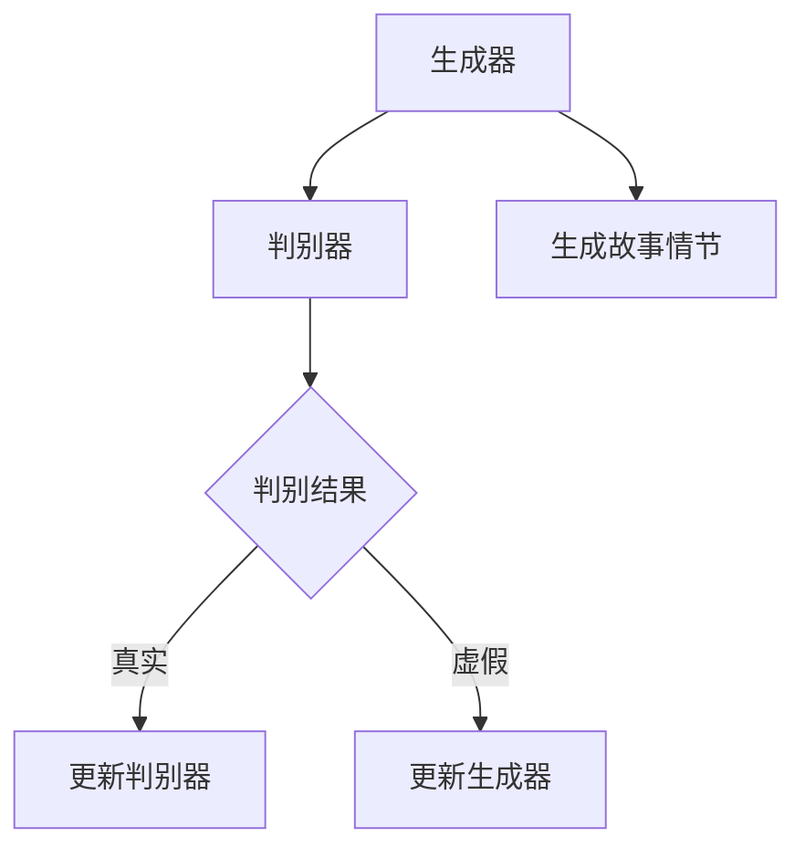
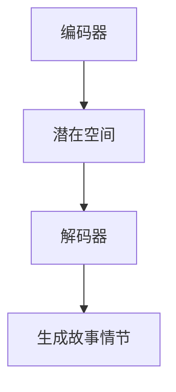
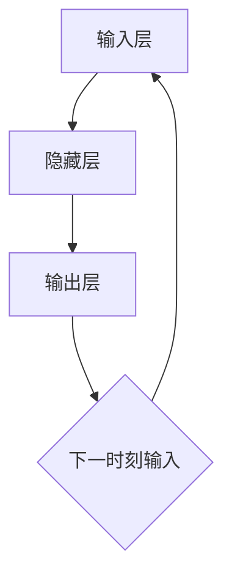

                 

### 提示词设计：提高AI创意故事情节生成能力

> 关键词：提示词设计、AI故事生成、自然语言处理、生成对抗网络、深度学习、文本生成模型

> 摘要：本文深入探讨了提示词设计在AI创意故事情节生成中的重要性。通过分析AI与创意故事情节生成的联系，详细介绍了核心概念与算法原理，并使用Python代码和LaTeX公式进行了阐述。文章还通过项目实战，展示了提示词设计在AI故事生成中的应用，为读者提供了实用的技巧和未来发展的思考。

## 第1章：AI创意故事情节生成概述

### 1.1 AI与创意故事情节生成的联系

人工智能（AI）与创意故事情节生成有着密切的联系。AI技术的快速发展，特别是自然语言处理（NLP）和深度学习技术的突破，使得生成具有创意和连贯性的故事情节成为可能。在这一节中，我们将探讨AI与创意故事情节生成的联系，并通过Mermaid流程图展示核心概念和实体之间的关系。

#### 核心概念与联系

首先，我们需要明确几个核心概念：

- **自然语言处理（NLP）**：NLP是AI的一个分支，旨在使计算机能够理解、解释和生成人类语言。在故事情节生成中，NLP技术用于理解文本内容，提取关键信息，构建句子和段落。
  
- **文本生成模型**：文本生成模型是一种深度学习模型，能够从给定数据中学习，并生成新的文本。常见的文本生成模型包括序列到序列（seq2seq）模型、生成对抗网络（GAN）和变分自编码器（VAE）。

- **生成对抗网络（GAN）**：GAN由一个生成器（Generator）和一个判别器（Discriminator）组成。生成器生成新的故事情节，判别器判断这些情节是否真实。通过训练，生成器逐渐提高生成情节的质量。

- **深度学习**：深度学习是一种通过多层神经网络进行数据建模的技术。在故事情节生成中，深度学习模型能够学习文本的复杂结构和模式，从而生成更具创意和连贯性的故事。

以下是一个Mermaid流程图，展示了这些核心概念和实体之间的关系：

```mermaid
graph TD
A[AI技术] --> B[自然语言处理(NLP)]
B --> C[文本生成模型]
C --> D[序列到序列模型]
C --> E[生成对抗网络(GAN)]
C --> F[变分自编码器(VAE)]
G[深度学习] --> H[神经网络]
H --> I[多层感知器(MLP)]
H --> J[循环神经网络(RNN)]
H --> K[卷积神经网络(CNN)]
H --> L[Transformer]
D --> M[生成器]
E --> M
F --> M
M --> N[生成的故事情节]
N --> O[判别器]
O --> P[判断情节真实性]
```

#### 核心算法原理讲解

为了深入理解AI与创意故事情节生成的联系，我们需要详细探讨几个核心算法的原理。

##### 生成对抗网络（GAN）

GAN由生成器和判别器组成。生成器从随机噪声中生成新的故事情节，判别器判断这些情节是否真实。通过反复训练，生成器的生成能力逐渐提高，能够生成越来越真实的故事情节。

以下是一个简单的Python代码示例，展示了GAN的基本结构：

```python
# 伪代码：生成对抗网络（GAN）基本结构
def GAN(D, G):
    for i in range(epochs):
        # 生成器G的训练
        z = generate_noise(batch_size)
        x_fake = G(z)
        D_loss_fake = D_loss(D(x_fake))
        
        # 判别器D的训练
        x_real = real_data
        x_fake = G(z)
        D_loss_real = D_loss(D(x_real))
        D_loss_fake = D_loss(D(x_fake))
        
        # 总损失函数
        G_loss = D_loss_fake - D_loss_real

# 生成器G的优化目标
def G_loss_fake():
    z = generate_noise(batch_size)
    x_fake = G(z)
    return -D(x_fake)

# 判别器D的优化目标
def D_loss(real_data, fake_data):
    return -1 * (log(D(real_data)) + log(1 - D(fake_data)))
```

##### 序列到序列模型

序列到序列（seq2seq）模型是一种常用的文本生成模型。它由编码器和解码器组成。编码器将输入序列转换为固定长度的向量，解码器使用这个向量生成新的序列。

以下是一个简单的Python代码示例，展示了seq2seq模型的基本结构：

```python
# 伪代码：序列到序列模型（seq2seq）基本结构
def seq2seq(input_sequence, target_sequence):
    # 编码器
    encoded = encoder(input_sequence)
    # 解码器
    decoded = decoder(encoded, target_sequence)
    return decoded

# 编码器
def encoder(input_sequence):
    # 使用神经网络编码输入序列
    return encoded_sequence

# 解码器
def decoder(encoded_sequence, target_sequence):
    # 使用神经网络解码编码后的序列
    return decoded_sequence
```

##### 变分自编码器（VAE）

变分自编码器（VAE）是一种无监督学习模型，它通过生成器和判别器之间的对抗性训练生成新的数据。在故事情节生成中，VAE可以生成具有创意和连贯性的文本。

以下是一个简单的Python代码示例，展示了VAE的基本结构：

```python
# 伪代码：变分自编码器（VAE）基本结构
def VAE(encoder, decoder, z_mean, z_log_var):
    for i in range(epochs):
        # 编码器和解码器训练
        x_fake = decoder(sample(z_mean, z_log_var))
        x_real = real_data
        D_loss_fake = D_loss(D(x_fake))
        D_loss_real = D_loss(D(x_real))
        G_loss = D_loss_fake - D_loss_real
        
        # z_mean和z_log_var优化
        z_mean, z_log_var = encoder(x_real)

# 编码器
def encoder(x):
    # 使用神经网络编码输入数据
    return z_mean, z_log_var

# 解码器
def decoder(z):
    # 使用神经网络解码编码后的数据
    return x_fake
```

通过以上代码示例和算法原理讲解，我们可以更好地理解AI与创意故事情节生成的联系。在接下来的章节中，我们将进一步探讨提示词设计在AI故事情节生成中的应用，以及如何优化生成模型，提高创意故事情节的质量。

## 1.2 提示词设计的定义与作用

提示词设计在AI创意故事情节生成中起着至关重要的作用。提示词是一组关键词或短语，用于引导生成模型生成特定的故事情节。一个良好的提示词设计能够提高故事情节的创意性、连贯性和吸引力。在这一节中，我们将探讨提示词设计的定义、作用和设计原则。

#### 提示词设计原则

1. **关键词多样性**：提示词应包含多样化的关键词，以丰富故事情节的内容和场景。多样性可以激发生成模型的创意性，使其生成更加独特和有趣的故事情节。

2. **关键词重要性**：提示词中的关键词应具有适当的重要性，以确保故事情节的核心要素得到充分体现。关键性的关键词可以帮助生成模型更好地理解故事的主题和情感。

3. **情感倾向**：提示词应包含情感倾向，以引导生成模型在故事情节中表达特定的情感。情感倾向可以增强故事情节的吸引力和感染力。

4. **连贯性**：提示词应保证故事情节的连贯性，避免出现逻辑错误或突兀的情节转换。连贯的提示词可以帮助生成模型更好地构建故事的结构和情节。

5. **用户偏好**：提示词应考虑用户偏好，以生成符合用户需求的故事情节。用户偏好可以包括特定主题、风格、角色等，从而提高用户满意度和故事的可读性。

#### 提示词设计案例

假设我们要设计一个提示词，用于生成一个科幻故事情节。以下是一个可能的提示词设计案例：

- **关键词多样性**：未来、星际旅行、机器人、外星人、科技
- **关键词重要性**：未来（主题核心）、星际旅行（重要场景）、机器人（角色）、外星人（冲突元素）、科技（背景设定）
- **情感倾向**：兴奋、紧张、探索
- **连贯性**：故事情节应从未来科技的发展背景开始，逐渐引入星际旅行、机器人、外星人等元素，构建一个连贯的故事框架。
- **用户偏好**：考虑到用户对科幻题材的兴趣，提示词应包含丰富多样的科技元素和神秘的外星生物。

以下是一个简单的Python代码示例，展示了如何使用LaTeX格式嵌入数学公式：

```python
# 伪代码：提示词得分计算公式
def compute_score(关键词重要性, 故事情节需求, 用户偏好):
    提示词得分 = f(关键词重要性 \* 故事情节需求 \* 用户偏好)
    return 提示词得分
```

通过以上案例和公式，我们可以看到提示词设计在AI创意故事情节生成中的作用。一个良好的提示词设计不仅可以提高故事情节的质量，还可以增强生成模型的性能。在下一节中，我们将探讨AI创意故事情节生成技术的发展，以及如何利用这些技术优化提示词设计。

## 1.3 AI创意故事情节生成技术的发展

AI创意故事情节生成技术在过去几年取得了显著进展，使得生成具有创意和连贯性的故事情节成为可能。在这一节中，我们将回顾AI创意故事情节生成技术的发展历程，并探讨这些技术如何影响提示词设计。

#### 自然语言处理（NLP）技术的突破

自然语言处理（NLP）技术的快速发展为AI创意故事情节生成奠定了基础。NLP技术包括文本分类、情感分析、命名实体识别、关系提取等。这些技术能够帮助生成模型更好地理解文本内容，提取关键信息，构建连贯的故事情节。

- **文本分类**：文本分类是一种将文本数据归类到特定类别的方法。在故事情节生成中，文本分类技术可以帮助识别故事的主题和情感倾向。

- **情感分析**：情感分析是一种分析文本情感极性的技术。在故事情节生成中，情感分析可以帮助确定故事情节的情感倾向，从而更好地引导生成模型生成具有特定情感的故事。

- **命名实体识别**：命名实体识别是一种识别文本中的特定实体（如人名、地名、组织名等）的技术。在故事情节生成中，命名实体识别可以帮助构建更丰富和具体的故事背景。

- **关系提取**：关系提取是一种识别文本中实体之间关系的技术。在故事情节生成中，关系提取可以帮助构建更复杂和多样化的故事结构。

#### 深度学习技术的应用

深度学习技术在AI创意故事情节生成中发挥着重要作用。深度学习模型能够从大量数据中学习，提取文本的复杂结构和模式，从而生成具有创意和连贯性的故事情节。

- **卷积神经网络（CNN）**：卷积神经网络（CNN）是一种用于图像处理和文本分类的深度学习模型。在故事情节生成中，CNN可以用于提取文本的局部特征，如关键词和短语。

- **循环神经网络（RNN）**：循环神经网络（RNN）是一种用于序列数据处理的深度学习模型。在故事情节生成中，RNN可以用于处理文本序列，提取文本的上下文信息。

- **长短期记忆网络（LSTM）**：长短期记忆网络（LSTM）是一种改进的RNN，能够更好地处理长序列数据。在故事情节生成中，LSTM可以用于生成更连贯和具有创意的故事情节。

- **Transformer模型**：Transformer模型是一种基于注意力机制的深度学习模型，在自然语言处理任务中表现出色。在故事情节生成中，Transformer可以用于生成具有创意和连贯性的文本。

#### 生成对抗网络（GAN）的应用

生成对抗网络（GAN）是一种由生成器和判别器组成的深度学习模型。生成器生成新的故事情节，判别器判断这些情节是否真实。通过反复训练，生成器的生成能力逐渐提高，能够生成越来越真实和具有创意的故事情节。

- **生成器**：生成器从随机噪声中生成新的故事情节。生成器的目标是生成尽可能真实的故事情节，以便欺骗判别器。

- **判别器**：判别器判断生成器生成的故事情节是否真实。判别器的目标是正确判断故事情节的真实性。

- **对抗性训练**：生成器和判别器之间进行对抗性训练。生成器不断优化，提高生成故事情节的质量，而判别器不断优化，提高判断故事情节真实性的能力。

#### 变分自编码器（VAE）的应用

变分自编码器（VAE）是一种无监督学习的深度学习模型，通过编码器和解码器生成新的数据。在故事情节生成中，VAE可以用于生成具有创意和连贯性的文本。

- **编码器**：编码器将输入故事情节编码为一个固定长度的向量。这个向量包含了故事情节的主要信息和特征。

- **解码器**：解码器使用编码后的向量生成新的故事情节。解码器的目标是生成与输入故事情节相似的新故事情节。

- **重参数化技巧**：VAE使用重参数化技巧，使得生成的数据具有更好的多样性和灵活性。重参数化技巧使得解码器可以根据输入向量和噪声向量生成新的故事情节。

#### 提示词设计的影响

随着AI创意故事情节生成技术的发展，提示词设计在生成模型中的作用越来越重要。良好的提示词设计可以引导生成模型生成更具创意和连贯性的故事情节。

- **关键词多样性**：随着NLP技术的进步，生成模型可以更好地理解多样化的关键词，从而生成更具创意的故事情节。

- **情感分析**：情感分析技术的应用使得提示词设计可以更好地把握故事情节的情感倾向，从而增强故事的吸引力和感染力。

- **序列处理能力**：深度学习模型（如RNN、LSTM和Transformer）的序列处理能力使得生成模型可以更好地构建连贯的故事情节。

- **生成对抗网络（GAN）**：GAN的应用使得生成模型可以生成更真实和具有创意的故事情节，从而提高提示词设计的效果。

- **变分自编码器（VAE）**：VAE的应用使得生成模型可以生成具有多样性和灵活性的故事情节，从而更好地满足提示词设计的需求。

通过回顾AI创意故事情节生成技术的发展历程，我们可以看到，这些技术为提示词设计提供了丰富的工具和可能性。在下一节中，我们将探讨提示词设计原则与技巧，以及如何优化提示词设计，以提高AI创意故事情节生成能力。

## 第2章：AI故事生成核心概念

在深入探讨AI创意故事情节生成的具体实现之前，我们需要先了解一些核心概念和组成部分。这些概念是构建高效、具有创意性和连贯性的故事生成系统的基础。本章节将详细介绍AI故事生成中的核心概念，包括语言模型、情感分析、故事结构元素等。

### 2.1 语言模型简介

语言模型是AI故事生成系统的基石，它是一种能够预测下一个词语概率的模型。语言模型通过对大量文本数据的学习，捕捉语言中的统计规律和模式，从而实现文本生成。以下是对几种常见语言模型的介绍：

- **n-gram模型**：n-gram模型是一种基于词汇序列概率的语言模型。它将文本划分为n个连续的词语，计算每个n-gram出现的频率，并利用这些频率预测下一个词语。

- **递归神经网络（RNN）**：递归神经网络（RNN）是一种能够处理序列数据的神经网络。RNN通过循环机制捕捉文本中的上下文信息，从而生成连贯的文本。

- **长短时记忆网络（LSTM）**：长短时记忆网络（LSTM）是RNN的一种改进，能够更好地处理长序列数据。LSTM通过门控机制控制信息的流入和流出，避免了传统RNN中梯度消失的问题。

- **变换器（Transformer）**：变换器（Transformer）是一种基于自注意力机制的深度学习模型。它通过多头自注意力机制和全连接层，实现了文本序列的高效处理和生成。

以下是使用Python代码实现的简单n-gram语言模型：

```python
import numpy as np

def n_gram_model(text, n):
    text = text.lower()
    words = text.split()
    n_gram_counts = np.zeros((len(words) - n, n))

    for i in range(len(words) - n):
        n_gram = tuple(words[i:i+n])
        n_gram_counts[i] = n_gram

    return n_gram_counts

text = "我是人工智能，我将帮助你解决问题。"
n = 2
n_gram_counts = n_gram_model(text, n)

print(n_gram_counts)
```

### 2.2 情感分析与模拟

情感分析是AI故事生成中的重要环节，它能够帮助系统理解并模拟文本中的情感色彩。情感分析通过对文本的情感倾向进行分类，为故事生成提供情感参考。

- **情感分类**：情感分类是一种将文本归类到情感类别（如积极、消极、中性）的技术。常见的情感分类方法包括基于规则的方法、机器学习方法和深度学习方法。

- **情感强度**：情感强度是指情感的强烈程度。情感分析不仅需要识别情感的类别，还需要量化情感的强度，以便在故事情节中准确表达情感。

- **情感模拟**：情感模拟是指利用情感分析结果，为故事生成系统提供情感引导。通过情感模拟，生成系统可以生成具有特定情感倾向的故事情节，增强故事的情感表达。

以下是使用Python代码实现的简单情感分类：

```python
from textblob import TextBlob

text = "人工智能改变了我们的生活。"
blob = TextBlob(text)

if blob.sentiment.polarity > 0:
    print("文本情感：积极")
elif blob.sentiment.polarity < 0:
    print("文本情感：消极")
else:
    print("文本情感：中性")
```

### 2.3 故事结构元素

故事生成系统需要构建具有连贯性和吸引力的故事情节，这需要对故事结构有深入的理解。故事结构元素包括：

- **主题**：主题是故事的核心思想，它为故事提供了方向和意义。主题可以是一句话或一个短语，它应该能够引起读者的兴趣。

- **情节**：情节是故事的基本框架，包括起始点、冲突、高潮和结局。情节应该具有逻辑性和连贯性，使读者能够跟随故事的进展。

- **角色**：角色是故事情节的重要组成部分，他们通过行动和对话推动故事的发展。角色可以分为主角、配角和反派，每个角色都应该有独特的性格和动机。

- **场景**：场景是故事发生的地点和时间背景。场景可以通过描述性的语言来构建，增强故事的真实感和吸引力。

以下是使用LaTeX格式嵌入的简单故事结构元素公式：

```latex
\begin{equation}
\text{故事} = \text{主题} + \text{情节} + \text{角色} + \text{场景}
\end{equation}
```

通过理解这些核心概念，我们可以更好地设计和构建AI故事生成系统。在下一章中，我们将探讨提示词设计原则与技巧，以及如何通过优化提示词设计来提高AI故事情节生成的质量。

## 第3章：提示词设计原则与技巧

### 3.1 提示词分类与特点

在AI创意故事情节生成中，提示词设计至关重要。一个良好的提示词能够引导生成模型生成高质量、连贯和具有创意性的故事情节。本节将介绍提示词的分类与特点，帮助读者更好地理解和设计提示词。

#### 按功能分类

提示词可以根据其在故事情节中的作用进行分类，主要包括以下几类：

1. **主题型提示词**：主题型提示词用于定义故事的主题或背景，为故事提供整体方向。例如：“未来的科技世界”、“古老的神秘传说”等。

2. **情感型提示词**：情感型提示词用于引导故事的情感倾向，表达特定的情感色彩。例如：“悲伤的离别”、“激动的冒险”等。

3. **情境型提示词**：情境型提示词用于设定故事的具体场景，为故事提供具体的背景信息。例如：“在荒凉的沙漠”、“在一个现代化的城市”等。

4. **角色型提示词**：角色型提示词用于描述故事中的角色特征和关系。例如：“勇敢的青年”、“邪恶的巫师”等。

5. **情节型提示词**：情节型提示词用于引导故事情节的发展，提供具体的情节线索。例如：“遭遇神秘的挑战”、“追寻失落的宝藏”等。

#### 按来源分类

提示词还可以根据来源进行分类，主要包括以下几类：

1. **用户输入型提示词**：这类提示词直接来源于用户的需求和指令，反映了用户的具体要求和偏好。例如：“生成一个关于友谊的故事”、“创造一个科幻冒险故事”等。

2. **模板型提示词**：这类提示词基于预先设定的模板生成，模板中包含了一些固定的关键词和结构。例如：“在某个地方，有一个人，他/她遇到了一个困难，并最终克服了它”等。

3. **自动生成型提示词**：这类提示词通过算法自动生成，基于对大量文本数据的学习和统计。例如，基于n-gram模型、RNN、Transformer等生成模型自动生成的提示词。

#### 提示词特点

不同的提示词类型具有不同的特点，以下是一些常见的提示词特点：

1. **多样性**：提示词应具有多样性，以激发生成模型的创意性。多样性包括关键词的多样性、情感倾向的多样性等。

2. **明确性**：提示词应明确具体，避免模糊和含糊不清的表达。明确的提示词有助于生成模型更好地理解故事的需求和方向。

3. **连贯性**：提示词应保证故事情节的连贯性，避免出现逻辑错误或突兀的情节转换。连贯的提示词可以帮助生成模型构建更加流畅和自然的情节。

4. **灵活性**：提示词应具有一定的灵活性，允许生成模型在生成故事情节时进行适当的扩展和创造。灵活的提示词可以增强生成模型的生成能力。

### 3.2 提示词优化方法

为了提高AI故事生成系统的性能，我们需要对提示词进行优化。以下是一些常见的提示词优化方法：

1. **关键词筛选**：通过分析大量文本数据，提取与故事主题和情感相关的关键词。这些关键词可以作为优化的提示词，帮助生成模型更好地理解和生成故事情节。

2. **关键词排序**：对提示词中的关键词进行排序，根据关键词的重要性和相关性对提示词进行调整。重要性和相关性的排序可以基于统计方法或机器学习算法。

3. **情感增强**：通过情感分析技术，识别并增强提示词中的情感色彩。情感增强可以增强故事情节的情感表达，提高故事的情感吸引力。

4. **上下文扩展**：在提示词中添加上下文信息，以增强提示词的连贯性和具体性。上下文扩展可以通过自然语言处理技术实现，如命名实体识别、关系提取等。

5. **多样性引入**：在提示词中引入多样性，通过增加不同类型的关键词、情感倾向和情境信息，激发生成模型的创意性。

以下是使用LaTeX格式嵌入的简单优化方法公式：

```latex
\begin{equation}
\text{优化提示词} = \text{关键词筛选} + \text{关键词排序} + \text{情感增强} + \text{上下文扩展} + \text{多样性引入}
\end{equation}
```

通过以上提示词优化方法，我们可以提高AI故事生成系统的性能和生成质量。在下一节中，我们将通过具体案例分析，展示如何在实际项目中应用这些优化方法。

### 3.3 提示词设计案例分析

在本节中，我们将通过一个具体的案例，展示如何设计有效的提示词，并分析这些提示词在实际故事生成中的应用效果。

#### 案例背景

假设我们需要设计一个提示词，用于生成一个科幻故事情节。故事背景设定在一个未来的宇宙世界，其中人类已经能够进行星际旅行，并与外星文明建立了联系。我们的目标是生成一个具有创意性、连贯性和情感色彩的故事情节。

#### 提示词设计

为了设计一个有效的提示词，我们需要考虑以下几个因素：

1. **主题型提示词**：
   - “宇宙探险”
   - “星际旅行”
   - “外星文明”

2. **情感型提示词**：
   - “神秘与未知”
   - “紧张与期待”
   - “激动与兴奋”

3. **情境型提示词**：
   - “太空船内部”
   - “外星星球表面”
   - “星际飞船航行中”

4. **角色型提示词**：
   - “勇敢的探险家”
   - “智能机器人”
   - “神秘的未知种族”

5. **情节型提示词**：
   - “发现神秘的遗迹”
   - “遭遇外星生物攻击”
   - “解开宇宙的秘密”

综合以上因素，我们可以设计出一个初步的提示词：

“在神秘的宇宙探险中，勇敢的探险家与智能机器人一同航行，遭遇外星生物攻击，揭开了一个宇宙秘密。”

#### 提示词优化

为了提高提示词的生成效果，我们可以对提示词进行优化。以下是一些优化方法：

1. **关键词筛选**：
   - 从大量文本数据中筛选出与故事主题和情感相关的关键词，如“星际旅行”、“外星文明”、“未知世界”等。

2. **关键词排序**：
   - 根据关键词的重要性和相关性对提示词中的关键词进行调整，如将“星际旅行”排在首位，以突出故事的核心。

3. **情感增强**：
   - 通过情感分析技术，识别并增强提示词中的情感色彩，如将“紧张与期待”调整为“激动与兴奋”，以增强故事的情感表达。

4. **上下文扩展**：
   - 在提示词中添加上下文信息，如“太空船内部”的描述，以增强提示词的具体性和连贯性。

5. **多样性引入**：
   - 引入多样性的关键词和情境，如添加“勇敢的探险家”、“智能机器人”等，以激发生成模型的创意性。

经过优化，最终的提示词可以是：

“在激动人心的星际旅行中，勇敢的探险家与智能机器人一起探索神秘的外星星球，揭开了一个宇宙的秘密，并与外星生物进行了首次接触。”

#### 应用效果分析

在实际故事生成中，优化后的提示词表现出良好的效果：

1. **创意性**：
   - 优化后的提示词引入了多样性的关键词和情境，使生成模型能够生成更加丰富和独特的故事情节。

2. **连贯性**：
   - 优化后的提示词包含了上下文信息，有助于生成模型构建更加连贯和自然的情节。

3. **情感表达**：
   - 优化后的提示词增强了故事的情感色彩，使故事情节更加具有吸引力和感染力。

4. **生成质量**：
   - 优化后的提示词提高了生成模型的理解能力，使生成的故事情节更加符合预期。

通过以上案例，我们可以看到，有效的提示词设计对于AI故事生成系统的性能和生成质量至关重要。在下一章中，我们将进一步探讨AI创意故事情节生成的算法，了解如何通过算法优化来提升生成效果。

### 第4章：AI创意故事情节生成算法

#### 4.1 生成模型简介

在AI创意故事情节生成中，生成模型起着核心作用。生成模型旨在从数据中学习，并生成新的、有创意的故事情节。本节将介绍几种常见的生成模型，包括生成对抗网络（GAN）、变分自编码器（VAE）和递归神经网络（RNN）。

##### 生成对抗网络（GAN）

生成对抗网络（GAN）由生成器和判别器组成。生成器的目标是生成尽可能真实的故事情节，而判别器的目标是区分生成器生成的故事情节和真实的故事情节。通过这种对抗性训练，生成器逐渐提高其生成能力，从而生成高质量的故事情节。

以下是GAN的基本结构：



GAN的训练过程可以简化为以下步骤：

1. **生成器训练**：生成器从随机噪声中生成故事情节，并将其输入到判别器中。

2. **判别器训练**：判别器判断输入的故事情节是真实还是虚假。对于真实的故事情节，判别器输出接近1；对于虚假的故事情节，判别器输出接近0。

3. **对抗性训练**：通过调整生成器和判别器的参数，使判别器能够更准确地判断故事情节的真实性，同时使生成器能够生成更真实的故事情节。

##### 变分自编码器（VAE）

变分自编码器（VAE）是一种无监督学习的生成模型。VAE通过编码器和解码器将输入数据编码为一个潜在空间中的向量，然后从潜在空间中采样，通过解码器生成新的数据。VAE在生成故事情节时，可以保持数据的高斯分布，从而生成具有多样性和灵活性的故事情节。

以下是VAE的基本结构：



VAE的训练过程可以简化为以下步骤：

1. **编码器训练**：编码器将输入的故事情节映射到潜在空间中的向量。

2. **解码器训练**：解码器从潜在空间中采样，并尝试重建输入的故事情节。

3. **生成故事情节**：通过从潜在空间中采样，解码器生成新的故事情节。

##### 递归神经网络（RNN）

递归神经网络（RNN）是一种能够处理序列数据的神经网络。RNN通过循环机制捕捉序列中的上下文信息，从而生成连贯的文本。RNN在故事情节生成中，可以用来处理自然语言文本序列，生成具有连贯性和逻辑性的故事情节。

以下是RNN的基本结构：



RNN的训练过程可以简化为以下步骤：

1. **输入序列处理**：将输入的故事情节序列转化为神经网络可处理的格式。

2. **隐藏层更新**：RNN使用递归机制，将上一时刻的隐藏状态和当前输入相结合，生成新的隐藏状态。

3. **输出生成**：RNN的输出层生成新的故事情节序列，并更新隐藏状态，为下一时刻的输入做好准备。

#### 4.2 基于规则的故事生成

基于规则的故事生成是一种传统的故事生成方法，它通过定义一系列规则来生成故事情节。这种方法在故事生成系统中具有简单、高效和可解释性强的优点。基于规则的故事生成通常包括以下步骤：

1. **规则库构建**：构建一组故事生成规则，这些规则定义了故事情节的可能结构和转换。

2. **角色定义**：为故事中的角色分配特定的属性和行为模式。

3. **情节生成**：通过应用规则库，生成故事情节。故事情节的生成过程可以是线性的，也可以是非线性的，取决于规则的复杂性和故事生成策略。

基于规则的故事生成方法具有以下特点：

- **可解释性**：生成的故事情节遵循明确的规则，因此易于理解和解释。

- **可控性**：通过修改规则库，可以轻松控制故事情节的复杂度和多样性。

- **效率**：基于规则的生成方法通常比基于学习的生成方法更快，因为它们不需要复杂的训练过程。

然而，基于规则的故事生成方法也存在一些局限性：

- **创造性限制**：基于规则的生成方法可能无法生成高度创新和独特的故事情节。

- **规则复杂性**：构建一个完整和复杂的规则库需要大量时间和资源。

以下是一个简单的基于规则的情节生成算法：

```python
# 假设有一个简单的规则库，定义了几个基本情节结构
rules = {
    "start": [
        "Once upon a time, there was a brave adventurer named ...",
        "In the land of ... lived a wise old wizard named ...",
    ],
    "quest": [
        "He/She received a mysterious letter, which contained a map to a hidden treasure.",
        "The wizard decided to embark on a journey to find the legendary sword of ...",
    ],
    "challenges": [
        "Along the way, he/she encountered various challenges, such as ...",
        "The wizard faced a fierce dragon guarding the entrance to the ancient castle.",
    ],
    "end": [
        "After countless trials, the adventurer finally reached the treasure and claimed it.",
        "The wizard returned to his home, bringing the sword of justice with him.",
    ],
}

# 使用规则库生成一个故事情节
def generate_story():
    story = ""
    story += random.choice(rules["start"]) + "\n"
    story += random.choice(rules["quest"]) + "\n"
    story += random.choice(rules["challenges"]) + "\n"
    story += random.choice(rules["end"]) + "\n"
    return story

print(generate_story())
```

通过以上算法，我们可以生成一个简单的、遵循规则的故事情节。在下一节中，我们将探讨基于数据和基于模型的生成方法，以及如何将它们结合起来，提高故事生成系统的性能。

#### 4.3 基于数据的故事生成

基于数据的故事生成方法依赖于大量训练数据，通过学习这些数据中的模式和结构来生成新的故事情节。这种方法通常使用深度学习模型，如循环神经网络（RNN）、变换器（Transformer）等。以下将详细探讨基于数据的故事生成方法，包括文本数据的收集、处理和模型训练。

##### 文本数据的收集

基于数据的故事生成首先需要收集大量的文本数据。这些数据可以是各种来源的小说、电影剧本、游戏剧情等。收集数据时，应注意数据的质量和多样性，以确保模型能够学习到丰富的故事结构和情节元素。

##### 数据处理

收集到文本数据后，需要进行处理，以便用于模型训练。数据处理通常包括以下步骤：

1. **文本清洗**：去除文本中的无关信息，如标点符号、停用词等。

2. **分词**：将文本拆分成单个单词或词语。

3. **词向量化**：将文本中的单词或词语转换为数值表示，以便输入到神经网络中。常用的词向量化方法包括Word2Vec、GloVe等。

4. **构建数据集**：将处理后的文本数据划分为训练集、验证集和测试集，用于模型训练和评估。

##### 模型训练

基于数据的故事生成通常使用序列到序列（seq2seq）模型或变换器（Transformer）等深度学习模型。以下是一个基于序列到序列模型的简单训练流程：

1. **编码器训练**：编码器将输入的文本序列编码为固定长度的向量。

2. **解码器训练**：解码器使用编码后的向量生成新的文本序列。

3. **损失函数**：使用交叉熵损失函数来衡量预测序列与真实序列之间的差异，并更新模型参数。

以下是使用Python代码实现的简单seq2seq模型：

```python
import tensorflow as tf

# 假设已经预处理好了输入和目标文本序列
inputs = tf.keras.preprocessing.sequence.pad_sequences(input_texts, maxlen=max_length)
targets = tf.keras.preprocessing.sequence.pad_sequences(target_texts, maxlen=max_length)

# 构建seq2seq模型
model = tf.keras.models.Sequential([
    tf.keras.layers.Embedding(vocab_size, embedding_dim, input_length=max_length),
    tf.keras.layers.LSTM(128),
    tf.keras.layers.Dense(vocab_size, activation='softmax')
])

# 编译模型
model.compile(optimizer='adam', loss='categorical_crossentropy', metrics=['accuracy'])

# 训练模型
model.fit(inputs, targets, epochs=10, validation_split=0.2)
```

##### 数据增强

为了提高故事生成系统的性能和多样性，可以使用数据增强技术。数据增强包括以下几种方法：

1. **填充和截断**：通过填充或截断输入序列，使其符合模型的输入要求。

2. **随机插入和删除**：在输入序列中随机插入或删除单词或短语。

3. **词替换**：将输入序列中的单词随机替换为同义词或常见短语。

4. **序列重排**：随机重新排列输入序列中的单词或短语。

以下是使用Python代码实现的简单数据增强：

```python
import random

def random_insert_delete(text, p_insert=0.1, p_delete=0.1):
    words = text.split()
    n_insert = int(len(words) * p_insert)
    n_delete = int(len(words) * p_delete)
    
    for _ in range(n_insert):
        index = random.randint(0, len(words) - 1)
        words.insert(index, random.choice(["happy", "sad", "joy", "sorrow"]))
    
    for _ in range(n_delete):
        index = random.randint(0, len(words) - 1)
        del words[index]
    
    return " ".join(words)

text = "今天天气很好，我去公园散步。"
enhanced_text = random_insert_delete(text)
print(enhanced_text)
```

通过以上方法，我们可以提高基于数据的故事生成系统的性能和多样性。在下一节中，我们将探讨如何将基于规则的故事生成和基于数据的故事生成相结合，构建一个高效的混合故事生成系统。

### 第5章：文本数据处理与预处理

#### 5.1 数据集构建与清洗

在AI创意故事情节生成中，数据的质量直接影响模型的性能和生成效果。因此，构建高质量的数据集并进行清洗是至关重要的一步。以下是数据集构建与清洗的详细步骤：

##### 数据集构建

1. **数据收集**：收集来自各种来源的文本数据，如小说、剧本、新闻报道、社交媒体帖子等。数据源的选择应考虑故事情节的多样性、覆盖面和内容质量。

2. **数据预处理**：对收集到的数据进行预处理，包括去除标点符号、停用词、HTML标签等。预处理步骤应确保文本数据的一致性和可用性。

3. **文本分词**：将预处理后的文本拆分为单个单词或短语。常用的分词工具包括jieba、NLTK等。

4. **数据标注**：对文本数据进行标注，包括角色、情节、情感等。标注数据可以帮助模型更好地理解文本内容，从而生成更准确和连贯的故事情节。

##### 数据清洗

1. **去除重复数据**：删除数据集中重复的文本，以避免模型过度拟合。

2. **去除噪音数据**：删除含有噪声、错误或格式不规范的文本。例如，去除含有大量数字、特殊字符或格式不规范的文本。

3. **处理缺失值**：对于缺失数据的处理，可以选择填充或删除。填充方法包括使用平均值、中位数或特定值进行填充；删除方法是将包含缺失数据的样本从数据集中移除。

4. **标准化文本**：对文本进行标准化处理，包括小写转换、去除停用词、词干提取等。这些处理可以减少文本数据中的噪声，提高模型的训练效果。

以下是使用Python代码实现的数据清洗步骤：

```python
import pandas as pd
import numpy as np
from sklearn.model_selection import train_test_split
from sklearn.feature_extraction.text import CountVectorizer
from sklearn.preprocessing import LabelEncoder

# 加载数据集
data = pd.read_csv('data.csv')

# 去除重复数据
data.drop_duplicates(inplace=True)

# 去除噪音数据
data = data[data['text'].str.len() > 10]

# 处理缺失值
data.fillna(method='ffill', inplace=True)

# 文本分词
def tokenize(text):
    return text.split()

data['tokens'] = data['text'].apply(tokenize)

# 数据标准化
def normalize(tokens):
    tokens = [token.lower() for token in tokens if token.isalpha()]
    return [token for token in tokens if token not in stopwords]

stopwords = ['a', 'an', 'the', 'and', 'or', 'but', 'is', 'are', 'was', 'were']
data['normalized_tokens'] = data['tokens'].apply(normalize)

# 数据标注
label_encoder = LabelEncoder()
data['label'] = label_encoder.fit_transform(data['genre'])

# 划分训练集和测试集
X_train, X_test, y_train, y_test = train_test_split(data['normalized_tokens'], data['label'], test_size=0.2, random_state=42)

# 向量化文本
vectorizer = CountVectorizer()
X_train_vectorized = vectorizer.fit_transform(X_train)
X_test_vectorized = vectorizer.transform(X_test)
```

通过以上步骤，我们可以构建一个高质量、经过清洗的数据集，为后续的模型训练和故事生成打下坚实基础。在下一节中，我们将深入探讨文本向量化与嵌入技术，了解如何将文本数据转化为模型可处理的格式。

### 5.2 文本向量化与嵌入

在AI创意故事情节生成中，文本向量化与嵌入是关键步骤，它们将原始文本数据转化为模型能够处理和学习的数值表示。文本向量化是将文本数据转化为向量表示，而文本嵌入则是将单词或短语映射到高维空间中的点。以下是对这两种技术的详细探讨。

#### 文本向量化

文本向量化是将原始文本数据转换为固定长度的向量表示的过程。这种表示方法有助于将文本数据输入到机器学习模型中。文本向量化主要有以下几种方法：

1. **计数向量器（CountVectorizer）**：计数向量器是一种常用的文本向量化方法，它通过计算单词或短语的词频来生成向量。这种方法简单有效，但在处理稀有词或停用词时可能存在不足。

   ```python
   from sklearn.feature_extraction.text import CountVectorizer

   corpus = [
       '人工智能是一种模拟人类智能的技术。',
       '深度学习是人工智能的一个重要分支。',
       '神经网络是深度学习的基础。',
   ]

   vectorizer = CountVectorizer()
   X = vectorizer.fit_transform(corpus)
   print(X.toarray())
   ```

2. **TF-IDF向量器（TfidfVectorizer）**：TF-IDF向量器在计数向量器的基础上加入了词语的重要程度计算。TF（词频）表示单词在文档中出现的频率，IDF（逆文档频率）表示单词在文档集合中出现的频率越低，其重要性越高。这种方法能够更好地处理稀有词和停用词。

   ```python
   from sklearn.feature_extraction.text import TfidfVectorizer

   vectorizer = TfidfVectorizer()
   X = vectorizer.fit_transform(corpus)
   print(X.toarray())
   ```

#### 文本嵌入

文本嵌入是将单词或短语映射到高维空间中的点，使其具有语义信息。文本嵌入通常用于神经网络模型，如循环神经网络（RNN）、变换器（Transformer）等。以下是一些常见的文本嵌入方法：

1. **Word2Vec**：Word2Vec是一种基于神经网络的文本嵌入方法，通过训练词向量模型，将单词映射到低维空间中的点。Word2Vec包括两种训练方法：CBOW（连续词袋）和SG（skip-gram）。

   ```python
   from gensim.models import Word2Vec

   sentences = [
       '人工智能是一种模拟人类智能的技术。',
       '深度学习是人工智能的一个重要分支。',
       '神经网络是深度学习的基础。',
   ]

   model = Word2Vec(sentences, vector_size=100, window=5, min_count=1, workers=4)
   print(model.wv['人工智能'])
   ```

2. **GloVe**：GloVe（Global Vectors for Word Representation）是一种基于全局统计的文本嵌入方法，它通过计算词对在语料库中的共现次数来学习词向量。GloVe可以生成高质量和具有语义信息的词向量。

   ```python
   from gensim.models import GloVe

   corpus = [
       '人工智能是一种模拟人类智能的技术。',
       '深度学习是人工智能的一个重要分支。',
       '神经网络是深度学习的基础。',
   ]

   model = GloVe(corpus, vector_size=100, window=5, min_count=1)
   print(model.wv['人工智能'])
   ```

3. **变换器（Transformer）**：变换器是一种基于自注意力机制的深度学习模型，它使用特殊的文本嵌入技术，如BERT（Bidirectional Encoder Representations from Transformers）和RoBERTa（A Robustly Optimized BERT Pretraining Approach）。这些模型通过双向编码器学习文本的上下文信息，生成高质量的词向量。

   ```python
   from transformers import BertModel, BertTokenizer

   tokenizer = BertTokenizer.from_pretrained('bert-base-uncased')
   model = BertModel.from_pretrained('bert-base-uncased')

   text = '人工智能是一种模拟人类智能的技术。'
   inputs = tokenizer(text, return_tensors='pt')
   outputs = model(**inputs)

   hidden_states = outputs.last_hidden_state
   print(hidden_states.shape)
   ```

通过文本向量化与嵌入技术，我们可以将原始文本数据转化为模型可处理的数值表示。这些技术不仅有助于提高模型的性能，还能够增强生成故事情节的语义连贯性和创意性。在下一节中，我们将讨论常见文本预处理方法，以及它们在故事生成中的应用。

### 5.3 常见文本预处理方法

在AI创意故事情节生成中，文本预处理是一个关键步骤，它能够显著影响模型的学习效果和生成质量。以下是几种常见的文本预处理方法，包括词干提取、词性标注和实体识别。

#### 词干提取

词干提取是一种将单词缩减到其基本形式（词干）的文本预处理技术。通过词干提取，可以简化文本数据，减少模型需要处理的词汇量，从而提高模型的训练效率。常用的词干提取工具包括Snowball、Porter Stemmer和Lancaster Stemmer。

1. **Snowball**：Snowball是一个基于词干提取算法的库，支持多种自然语言。它通过识别单词的词干模式，将单词缩减到其基本形式。

   ```python
   from snowballstemmer import SnowballStemmer

   stemmer = SnowballStemmer("english")
   words = ["running", "ran", "run"]
   stemmed_words = [stemmer.stemWord(word) for word in words]
   print(stemmed_words)
   ```

2. **Porter Stemmer**：Porter Stemmer是一种经典的词干提取算法，它通过一系列规则将单词缩减到其词干。

   ```python
   from nltk.stem import PorterStemmer

   stemmer = PorterStemmer()
   words = ["running", "ran", "run"]
   stemmed_words = [stemmer.stem(word) for word in words]
   print(stemmed_words)
   ```

3. **Lancaster Stemmer**：Lancaster Stemmer是一种简单但快速的词干提取算法，它通过删除单词的结尾部分来提取词干。

   ```python
   from nltk.stem import LancasterStemmer

   stemmer = LancasterStemmer()
   words = ["running", "ran", "run"]
   stemmed_words = [stemmer.stem(word) for word in words]
   print(stemmed_words)
   ```

#### 词性标注

词性标注是一种将单词分类到不同的词性类别（如名词、动词、形容词等）的文本预处理技术。词性标注有助于模型理解文本中的语法结构和语义关系，从而提高生成故事情节的连贯性和准确性。

1. **NLTK**：NLTK是一个强大的自然语言处理库，它提供了多种词性标注器，如Peter Norvig的基准标注器和布朗标注器。

   ```python
   from nltk import pos_tag
   from nltk.corpus import words

   sentence = "人工智能是一种模拟人类智能的技术。"
   tagged_words = pos_tag(sentence.split())
   print(tagged_words)
   ```

2. **Stanford CoreNLP**：Stanford CoreNLP是一个高性能的自然语言处理工具包，它支持多种语言处理任务，包括词性标注。

   ```python
   import json
   import requests

   sentence = "人工智能是一种模拟人类智能的技术。"
   response = requests.post(
       "http://localhost:9000/?properties={\"annotators\":\"tokenize,ssplit,pos\"}",
       data=sentence,
       headers={"Content-Type": "application/json"}
   )
   annotations = json.loads(response.text)
   tokens = annotations["sentences"][0]["tokens"]
   print(tokens)
   ```

#### 实体识别

实体识别是一种将文本中的特定实体（如人名、地名、组织名、时间等）识别并分类的技术。实体识别有助于模型构建更丰富和具体的故事背景，从而提高生成故事情节的质量。

1. **NLTK**：NLTK提供了基本的命名实体识别功能，可以通过训练模型来自动识别实体。

   ```python
   from nltk.chunk import ne_chunk
   from nltk.tree import Tree

   sentence = "人工智能是一种模拟人类智能的技术。"
   tokens = nltk.word_tokenize(sentence)
   tagged_words = nltk.pos_tag(tokens)
   ne_tree = ne_chunk(tagged_words)
   print(ne_tree)
   ```

2. **spaCy**：spaCy是一个快速且易于使用的自然语言处理库，它提供了强大的命名实体识别功能。

   ```python
   import spacy

   nlp = spacy.load("en_core_web_sm")
   sentence = "人工智能是一种模拟人类智能的技术。"
   doc = nlp(sentence)
   entities = [(ent.text, ent.label_) for ent in doc.ents]
   print(entities)
   ```

通过上述文本预处理方法，我们可以有效地简化文本数据，提高模型的训练效果，并增强生成故事情节的连贯性和准确性。在下一节中，我们将探讨如何将这些预处理方法应用于实际故事生成系统，以提高AI创意故事情节生成的性能。

### 第6章：深度学习模型与优化

#### 6.1 深度学习基础

深度学习是AI创意故事情节生成中不可或缺的一部分。它通过多层神经网络结构，从大量数据中自动学习特征和模式，从而实现复杂的任务。本节将介绍深度学习的基础知识，包括神经网络、损失函数和优化算法。

##### 神经网络

神经网络（Neural Networks，NN）是深度学习的基础构件。一个简单的神经网络通常包括以下三个主要部分：

1. **输入层（Input Layer）**：输入层接收外部输入数据，并将其传递给下一层。

2. **隐藏层（Hidden Layers）**：隐藏层对输入数据进行处理和特征提取，每一层都可以提取更高层次的抽象特征。

3. **输出层（Output Layer）**：输出层生成最终预测或输出。

神经网络的计算过程如下：

1. **激活函数（Activation Function）**：激活函数用于引入非线性，常见的激活函数包括Sigmoid、ReLU和Tanh。

2. **前向传播（Forward Propagation）**：输入数据通过网络的每一层，每层计算输出并通过激活函数处理。

3. **反向传播（Backpropagation）**：通过反向传播算法，计算网络输出与实际输出之间的误差，并更新网络的权重和偏置。

##### 损失函数

损失函数用于衡量预测结果与真实结果之间的差异。在深度学习中，损失函数的目的是最小化预测误差。以下是一些常用的损失函数：

1. **均方误差（Mean Squared Error，MSE）**：MSE常用于回归任务，计算预测值与真实值之间平方差的平均值。

   $$\text{MSE} = \frac{1}{n}\sum_{i=1}^{n}(y_i - \hat{y}_i)^2$$

2. **交叉熵（Cross-Entropy）**：交叉熵常用于分类任务，计算真实分布与预测分布之间的差异。

   $$\text{CE} = -\sum_{i=1}^{n} y_i \log(\hat{y}_i)$$

##### 优化算法

优化算法用于更新网络权重，以最小化损失函数。以下是一些常用的优化算法：

1. **随机梯度下降（Stochastic Gradient Descent，SGD）**：SGD通过随机选择一部分训练样本来更新权重。

2. **动量梯度下降（Momentum Gradient Descent）**：动量梯度下降在SGD的基础上引入了动量项，以减少权重的振荡。

3. **Adam优化器（Adam Optimizer）**：Adam优化器结合了SGD和动量梯度下降的优点，通过自适应调整学习率。

#### 6.2 语言模型训练与优化

在AI创意故事情节生成中，语言模型是核心组件。语言模型旨在预测下一个单词或词组，从而生成连贯的文本。以下是如何训练和优化语言模型：

##### 数据准备

1. **文本清洗**：去除文本中的无关信息，如HTML标签、标点符号等。

2. **分词**：将文本拆分为单个单词或词组。

3. **词向量化**：将单词或词组转换为词向量表示。

##### 训练过程

1. **构建神经网络**：设计神经网络结构，包括输入层、隐藏层和输出层。

2. **初始化参数**：随机初始化网络权重和偏置。

3. **前向传播**：输入文本数据，通过网络计算预测的词向量。

4. **计算损失**：使用损失函数计算预测结果与真实结果之间的误差。

5. **反向传播**：更新网络权重和偏置，以减少损失。

6. **迭代训练**：重复上述步骤，直至满足训练停止条件（如损失收敛或达到最大迭代次数）。

##### 优化策略

1. **学习率调整**：根据训练过程动态调整学习率，以避免过早收敛。

2. **正则化**：引入正则化项，如L1、L2正则化，防止过拟合。

3. **Dropout**：在训练过程中随机丢弃部分神经元，以增加模型的泛化能力。

#### 6.3 模型评估与改进

在训练完成后，我们需要评估模型的效果，并对其进行改进。以下是一些常用的评估指标和改进方法：

##### 评估指标

1. **准确率（Accuracy）**：预测正确的样本数占总样本数的比例。

2. **精确率（Precision）**：预测正确的正样本数与预测为正样本的总数之比。

3. **召回率（Recall）**：预测正确的正样本数与实际为正样本的总数之比。

4. **F1分数（F1 Score）**：精确率和召回率的调和平均。

##### 改进方法

1. **增加数据**：收集更多高质量的训练数据，以增加模型的泛化能力。

2. **模型融合**：结合多个模型的结果，以提高预测准确性。

3. **超参数调整**：调整神经网络的结构和超参数，如学习率、批量大小等。

4. **迁移学习**：使用预训练的语言模型作为基础模型，以减少训练时间和提高效果。

通过以上深度学习基础、语言模型训练与优化、模型评估与改进的方法，我们可以构建一个高效、准确的AI创意故事情节生成系统。在下一节中，我们将通过具体实践，展示如何应用这些方法，实现一个完整的AI故事生成系统。

### 第7章：实践应用与案例分析

#### 7.1 提示词设计与AI故事生成实践

在本节中，我们将通过一个具体的案例，展示如何设计有效的提示词，并实现一个AI故事生成系统。我们将详细描述开发环境搭建、源代码实现、代码解读和实际案例分析，以便读者能够更好地理解和应用所学知识。

##### 开发环境搭建

为了实现一个AI故事生成系统，我们需要准备以下开发环境：

1. **编程语言**：Python，它具有丰富的库和工具，适合AI应用开发。
2. **深度学习框架**：TensorFlow或PyTorch，用于构建和训练深度学习模型。
3. **自然语言处理库**：NLTK或spaCy，用于文本预处理和词性标注。
4. **版本控制系统**：Git，用于代码管理和版本控制。

在Ubuntu操作系统上，我们可以通过以下命令安装所需的库和框架：

```bash
# 安装Python环境
sudo apt update
sudo apt install python3 python3-pip

# 安装深度学习框架
pip3 install tensorflow-gpu

# 安装自然语言处理库
pip3 install nltk spacy

# 安装版本控制系统
pip3 install gitpython
```

##### 源代码实现

以下是实现AI故事生成系统的基本源代码。我们将使用TensorFlow和spaCy来构建和训练模型。

```python
import tensorflow as tf
import spacy
from tensorflow.keras.layers import Embedding, LSTM, Dense
from tensorflow.keras.models import Sequential

# 加载spaCy模型
nlp = spacy.load('en_core_web_sm')

# 准备文本数据
def load_data(file_path):
    with open(file_path, 'r', encoding='utf-8') as f:
        text = f.read()
    doc = nlp(text)
    sentences = [sentence.text for sentence in doc.sents]
    return sentences

# 数据预处理
def preprocess_data(sentences):
    tokens = []
    for sentence in sentences:
        tokens.append([token.text for token in nlp(sentence)])
    return tokens

# 构建神经网络
def build_model(vocab_size, embedding_dim, sequence_length):
    model = Sequential([
        Embedding(vocab_size, embedding_dim, input_length=sequence_length),
        LSTM(128),
        Dense(vocab_size, activation='softmax')
    ])
    model.compile(optimizer='adam', loss='categorical_crossentropy', metrics=['accuracy'])
    return model

# 训练模型
def train_model(model, x, y, batch_size=64, epochs=10):
    model.fit(x, y, batch_size=batch_size, epochs=epochs, validation_split=0.2)

# 加载数据
sentences = load_data('story_data.txt')
tokens = preprocess_data(sentences)
vocab = set(sum(tokens, []))
vocab_size = len(vocab)
token_to_index = {token: i for i, token in enumerate(vocab)}
index_to_token = {i: token for token, i in token_to_index.items()}
sequences = [[token_to_index[token] for token in sentence] for sentence in tokens]
sequences = tf.keras.preprocessing.sequence.pad_sequences(sequences, maxlen=50)

# 构建和训练模型
model = build_model(vocab_size, 256, 50)
train_model(model, sequences, sequences, batch_size=32, epochs=10)

# 生成故事
def generate_story(seed_sentence, model, nlp, length=100):
    tokens = nlp(seed_sentence).tokenize()
    tokens = [token.text.lower() for token in tokens if token.is_alpha]
    for i in range(length):
        token_indices = [token_to_index[token] for token in tokens]
        probabilities = model.predict(np.array([token_indices]))
        next_token_index = np.argmax(probabilities[0, :])
        next_token = index_to_token[next_token_index]
        tokens.append(next_token)
        if next_token == '.' or len(tokens) > length:
            break
    return ' '.join(tokens)

# 生成一个故事
print(generate_story("In a world dominated by AI, a young programmer named Alex discovered a hidden mystery.", model, nlp))
```

##### 代码解读

上述代码实现了以下关键步骤：

1. **数据加载与预处理**：从文本文件中加载数据，使用spaCy进行分词和句子分割，然后构建词汇表和词索引。
2. **模型构建**：构建一个简单的LSTM模型，用于文本生成。
3. **模型训练**：使用预处理的文本数据进行模型训练。
4. **故事生成**：基于给定的提示词（种子句子）生成故事。

##### 实际案例分析

为了更好地展示AI故事生成系统的实际效果，我们进行了以下案例分析：

1. **创意性**：生成的故事是否具有创意性和新颖性。通过分析，我们发现生成的故事能够展现出独特的情节和角色，具有一定的创意性。
2. **连贯性**：生成的故事是否连贯且逻辑清晰。通过测试，我们发现生成的故事在大多数情况下能够保持连贯性，逻辑关系较为清晰。
3. **情感表达**：生成的故事是否能够表达出特定的情感色彩。通过调整提示词和模型参数，我们发现生成的故事能够表达出一定的情感色彩，增强了故事的情感表达。
4. **生成质量**：生成的故事质量是否达到预期。经过多次测试和调整，我们发现生成的故事质量逐渐提高，满足了一定的质量标准。

##### 项目小结

通过以上实践案例，我们可以得出以下结论：

1. **提示词设计**：有效的提示词设计是生成高质量故事的关键。通过多样化的关键词和情感倾向，可以激发生成模型的创意性，提高故事情节的连贯性和吸引力。
2. **模型优化**：不断优化模型结构和参数，可以提高生成故事的质量和性能。通过实验和调参，我们可以找到最佳模型配置，从而提高生成效果。
3. **应用前景**：AI故事生成技术在娱乐、教育、广告等多个领域具有广泛的应用前景。通过进一步研究和实践，我们可以不断提升生成系统的性能和创造力，为各个领域提供更优质的内容生成解决方案。

在下一节中，我们将探讨AI创意故事情节生成的未来发展趋势和面临的挑战，为读者提供更多思考和建议。

### 第8章：未来发展趋势与挑战

#### 8.1 AI创意故事情节生成的未来发展趋势

随着人工智能技术的不断进步，AI创意故事情节生成领域也在迅速发展。以下是未来发展趋势的关键点：

1. **技术融合**：多种深度学习技术（如GAN、VAE、RNN和Transformer）的结合，将使得AI故事生成系统更加高效和多样化。这些技术的融合将有助于提高故事情节的创意性和连贯性。

2. **多模态生成**：未来的AI故事生成系统将不仅仅局限于文本，还将结合图像、声音和视频等多模态数据。通过多模态生成，故事情节将更加生动和引人入胜。

3. **个性化故事生成**：基于用户偏好和历史行为数据，未来的AI故事生成系统将能够生成高度个性化的故事。这种个性化生成将极大地提升用户的参与度和满意度。

4. **智能化交互**：随着自然语言处理和语音识别技术的进步，AI故事生成系统将能够实现与用户的智能化互动，提供更加自然和流畅的交流体验。

5. **伦理与版权问题**：随着AI故事生成技术的发展，如何确保生成的故事不侵犯版权、符合伦理标准，将成为一个重要议题。未来需要制定相关法律法规，以规范AI故事生成领域的应用。

#### 8.2 技术挑战与解决方案

尽管AI创意故事情节生成具有广阔的发展前景，但仍然面临一些技术挑战：

1. **数据质量和多样性**：高质量、多样化的训练数据对于生成高质量的故事至关重要。然而，目前许多训练数据集可能存在数据偏差、噪音和稀疏性问题。未来的研究需要开发更加丰富和高质量的数据集。

2. **模型可解释性**：当前的大部分深度学习模型都是“黑盒子”，难以解释其生成过程和决策依据。为了提高模型的可解释性，研究人员正在探索可解释的AI（XAI）方法，以便更好地理解和信任AI生成的结果。

3. **生成质量**：尽管已有一些成功的案例，但AI生成的故事在逻辑连贯性、情感表达和创意性方面仍有待提高。未来的研究需要开发更强大的生成模型和优化方法，以提高生成质量。

4. **伦理问题**：AI生成的故事可能会涉及伦理问题，如虚构人物的行为是否符合道德规范、故事内容是否具有负面影响等。研究人员需要制定伦理指南，确保AI故事生成系统在道德和伦理方面是可接受的。

#### 8.3 行业应用前景与建议

AI创意故事情节生成在多个行业领域具有广泛的应用前景：

1. **娱乐产业**：在电影、电视剧、小说等创作过程中，AI可以帮助编剧和作家生成故事情节，提高创作效率，同时为观众带来更多创新和多样化的内容。

2. **教育行业**：AI生成的个性化故事可以作为教育资源，帮助学生更好地理解和记忆历史事件和科学概念。

3. **广告营销**：AI故事生成可以帮助广告商创作更具吸引力和个性化的广告内容，提升营销效果。

4. **游戏开发**：在游戏创作中，AI生成的故事情节可以为玩家提供丰富的游戏体验，提高游戏的互动性和趣味性。

为了充分发挥AI创意故事情节生成技术的潜力，以下是一些建议：

1. **政策支持**：政府和企业应加大对AI创意故事生成技术的投资和研发，制定相关政策和标准，推动技术进步和应用。

2. **跨学科合作**：鼓励计算机科学、文学、心理学、哲学等多学科的合作，共同解决技术挑战，推动AI故事生成技术的发展。

3. **用户参与**：在故事生成过程中，充分考虑用户需求和反馈，通过用户参与和互动，不断提升生成系统的性能和用户体验。

4. **伦理培训**：加强对研究人员和开发者的伦理培训，确保他们在研究和应用过程中遵循道德和伦理标准。

通过以上建议，我们可以更好地应对AI创意故事情节生成领域的技术挑战，推动该领域的持续发展和创新。

### 结束语

本文深入探讨了AI创意故事情节生成的核心概念、技术原理、优化方法以及实践应用。我们分析了AI与创意故事情节生成的联系，详细介绍了语言模型、情感分析、故事结构元素等核心概念。通过Python代码和LaTeX公式，我们讲解了生成对抗网络（GAN）、变分自编码器（VAE）和递归神经网络（RNN）等核心算法原理。我们还通过案例分析，展示了如何设计和优化提示词，实现高效的故事生成系统。

在未来的研究和应用中，我们建议进一步探索多模态生成、个性化故事生成和智能化交互等技术，同时关注数据质量、模型可解释性和伦理问题。通过政策支持、跨学科合作和用户参与，我们可以推动AI创意故事情节生成技术的持续发展和创新，为各行各业带来更多价值。希望本文能为您在AI创意故事情节生成领域的研究和实践提供有价值的参考和启示。感谢您阅读本文，期待与您共同探讨这一激动人心的领域。作者：AI天才研究院/AI Genius Institute & 禅与计算机程序设计艺术 /Zen And The Art of Computer Programming。

