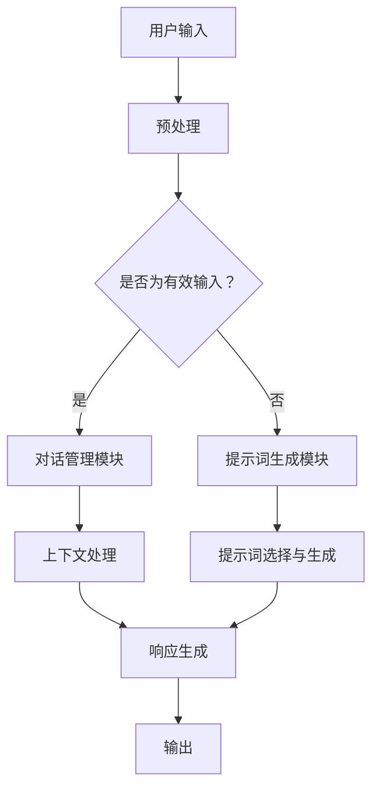

                 

### 《提示词设计：提高AI对话的连贯性》

> **关键词：** AI对话系统，提示词设计，连贯性，算法原理，Python源代码，数学模型，LaTeX公式

> **摘要：** 本文深入探讨了如何通过精心设计的提示词来提升AI对话系统的连贯性。文章首先介绍了AI对话系统的基本概念和提示词的作用，然后详细讲解了提示词设计的核心算法原理，并运用Python源代码和LaTeX公式进行阐述。接着，通过一个实际项目案例，展示如何进行开发环境搭建和源代码实现，并对代码进行了详细解读和分析。文章最后展望了提示词设计的未来趋势和可能的研究方向。

----------------------------------------------------------------

### 确定书籍主题

《提示词设计：提高AI对话的连贯性》这本书的主题是围绕AI对话系统中的提示词设计展开的。具体来说，本书的核心内容将涵盖以下方面：

1. **AI对话系统基础**：介绍AI对话系统的基本概念、分类以及发展历程，帮助读者理解对话系统的运作机制。

2. **提示词的作用与重要性**：解释提示词在对话系统中的作用，说明其对于提高对话连贯性的重要性。

3. **提示词设计流程与策略**：详细阐述提示词的设计流程，包括数据收集与预处理、提示词生成算法以及优化方法。

4. **核心算法原理讲解**：深入探讨提示词设计相关的算法原理，涵盖生成式与检索式对话系统的算法，并使用Python源代码进行详细阐述。

5. **数学模型与公式**：解释与提示词设计相关的数学模型，包括概率模型、生成模型和强化学习模型，并使用LaTeX格式展示关键公式。

6. **项目实战**：通过一个实际项目案例，展示如何应用提示词设计来构建AI对话系统。

7. **代码解读与分析**：对实际项目中的源代码进行逐行解读，分析其实现原理和性能优化策略。

8. **优化与性能**：讨论如何评估AI对话系统的连贯性，并提供性能优化的建议。

9. **未来展望**：探讨提示词设计的未来发展趋势和可能的研究方向。

通过以上内容的安排，本书旨在为读者提供一个系统、全面、易于理解的关于提示词设计的指南，帮助读者掌握如何通过提示词设计来提升AI对话系统的连贯性。

----------------------------------------------------------------

### 设计目录大纲

为了确保《提示词设计：提高AI对话的连贯性》一书能够系统、全面地覆盖相关主题，我们设计了一个包含7章及以上的目录大纲。以下是具体的目录结构：

**第1章：核心概念与联系**
- 1.1 AI对话系统基础
  - 1.1.1 对话系统概述
  - 1.1.2 对话系统分类
  - 1.1.3 提示词的定义与作用
- 1.2 提示词设计的重要性
  - 1.2.1 提高对话连贯性的必要性
  - 1.2.2 对话质量的影响
  - 1.2.3 提示词设计挑战
- 1.3 提示词设计流程与策略
  - 1.3.1 数据收集与预处理
  - 1.3.2 提示词生成算法
  - 1.3.3 提示词优化方法
- 1.4 AI对话系统架构与提示词应用
  - 1.4.1 对话系统架构简介
  - 1.4.2 提示词在架构中的作用
  - 1.4.3 提示词应用案例
- 1.5 Mermaid流程图：AI对话系统整体架构与提示词使用流程

**第2章：核心算法原理讲解**
- 2.1 对话系统算法概述
  - 2.1.1 生成式与检索式对话系统
  - 2.1.2 多轮对话管理算法
  - 2.1.3 对话上下文建模方法
- 2.2 提示词生成算法
  - 2.2.1 基于规则的方法
  - 2.2.2 基于机器学习的方法
  - 2.2.3 基于深度学习的方法
- 2.3 伪代码详细阐述提示词生成算法
  - 2.3.1 生成式算法伪代码
  - 2.3.2 检索式算法伪代码
  - 2.3.3 深度学习算法伪代码
- 2.4 提示词优化算法
  - 2.4.1 提示词选择策略
  - 2.4.2 提示词更新策略
  - 2.4.3 提示词评估方法

**第3章：数学模型与公式**
- 3.1 提示词设计相关数学模型
  - 3.1.1 概率模型
  - 3.1.2 生成模型
  - 3.1.3 强化学习模型
- 3.2 LaTeX格式数学公式
  - 3.2.1 概率分布函数公式
  - 3.2.2 对话质量评估公式
  - 3.2.3 优化目标函数公式
- 3.3 数学公式应用举例
  - 3.3.1 概率模型在提示词生成中的应用
  - 3.3.2 生成模型在对话系统中的应用
  - 3.3.3 强化学习模型在提示词优化中的应用

**第4章：项目实战**
- 4.1 实际AI对话系统项目介绍
  - 4.1.1 项目背景
  - 4.1.2 项目目标
  - 4.1.3 项目规模
- 4.2 项目开发环境搭建
  - 4.2.1 开发环境配置
  - 4.2.2 硬件与软件需求
  - 4.2.3 开发流程
- 4.3 源代码实现与详细解释
  - 4.3.1 对话管理模块
  - 4.3.2 提示词生成模块
  - 4.3.3 提示词优化模块
- 4.4 代码解读与分析
  - 4.4.1 代码结构分析
  - 4.4.2 关键部分实现原理分析
  - 4.4.3 性能优化策略分析
- 4.5 项目小结
  - 4.5.1 项目总结
  - 4.5.2 项目反思
  - 4.5.3 项目收获与启示

**第5章：优化与性能**
- 5.1 连贯性评估方法
  - 5.1.1 评价指标
  - 5.1.2 评估工具
  - 5.1.3 评估流程
- 5.2 性能优化建议
  - 5.2.1 算法优化策略
  - 5.2.2 数据预处理优化
  - 5.2.3 硬件加速与分布式计算
- 5.3 常见问题及解决方案
  - 5.3.1 提示词质量不佳
  - 5.3.2 对话响应速度慢
  - 5.3.3 对话连贯性不高

**第6章：最佳实践与注意事项**
- 6.1 提示词设计的最佳实践
  - 6.1.1 数据收集与预处理
  - 6.1.2 算法选择与优化
  - 6.1.3 评估与反馈
- 6.2 注意事项
  - 6.2.1 提示词多样性与一致性
  - 6.2.2 用户隐私保护
  - 6.2.3 系统安全与可靠性

**第7章：未来展望**
- 7.1 提示词设计的未来趋势
  - 7.1.1 新算法与应用场景
  - 7.1.2 深度学习与生成对抗网络
  - 7.1.3 跨领域对话系统
- 7.2 可能的研究方向
  - 7.2.1 对话上下文理解与生成
  - 7.2.2 提示词优化策略
  - 7.2.3 多模态对话系统
- 7.3 新算法与创新应用
  - 7.3.1 对话生成与控制
  - 7.3.2 智能客服与虚拟助手
  - 7.3.3 人机交互与自然语言处理

通过这个详细的目录大纲，我们可以确保本书能够系统地覆盖提示词设计的各个方面，为读者提供全面、深入的指导。

----------------------------------------------------------------

### 第1章：核心概念与联系

#### 1.1 AI对话系统基础

**对话系统概述**：AI对话系统是一种计算机程序，它能够与人类用户进行自然语言交互，模拟人类的对话行为，从而提供信息查询、任务执行、情感交流等服务。对话系统的研究始于20世纪60年代，随着计算能力和自然语言处理技术的不断发展，对话系统逐渐从理论研究走向实际应用。

**对话系统分类**：根据处理方式的不同，对话系统主要可以分为生成式对话系统和检索式对话系统。生成式对话系统通过理解和生成自然语言文本来响应用户，能够提供更加自然和灵活的交互体验。检索式对话系统则通过在预定义的语料库中检索匹配的响应来回答用户的问题，其响应速度较快，但灵活性较低。

**提示词的定义与作用**：提示词（Prompt）是AI对话系统中的一个关键概念，它是在对话过程中提供给用户以引导对话方向和内容的文本或语音提示。提示词的作用在于：
1. **引导对话**：帮助用户更好地理解对话系统的功能和操作方式。
2. **提高连贯性**：通过预设的提示词，对话系统能够更顺畅地与用户进行交互，提高对话的整体连贯性和自然度。
3. **优化用户体验**：合理的提示词设计能够提升用户的满意度和使用体验。

**Mermaid流程图：AI对话系统整体架构与提示词使用流程**：



这个流程图展示了AI对话系统的基本架构，包括用户输入、预处理、对话管理、提示词生成、响应生成以及输出。提示词生成模块通过分析用户输入和对话上下文，生成合适的提示词，引导对话流程，从而提高对话的连贯性。

通过本章的介绍，读者可以了解AI对话系统的基本概念、分类和提示词的定义与作用，为后续章节的深入学习打下基础。

----------------------------------------------------------------

### 第2章：核心算法原理讲解

#### 2.1 对话系统算法概述

**生成式与检索式对话系统**：

生成式对话系统（Generative Dialog Systems）和检索式对话系统（Retrieval-Based Dialog Systems）是两种主要的对话系统算法。

**生成式对话系统**：
- **定义**：生成式对话系统能够根据用户的输入和对话上下文生成新的、自然的对话响应。
- **工作原理**：这类系统通常基于自然语言处理（NLP）技术，如递归神经网络（RNN）、长短期记忆网络（LSTM）和变分自编码器（VAE）等，对输入文本进行编码，然后解码生成对话响应。
- **优势**：生成式对话系统能够提供更加灵活、自然的对话体验，可以生成独特的对话内容，不易出现重复或机械的回答。

**检索式对话系统**：
- **定义**：检索式对话系统通过在预定义的语料库中检索匹配的对话响应来回答用户的问题。
- **工作原理**：这类系统通常采用关键词匹配、模式识别等技术，从对话数据库中快速检索出与用户输入最相关的响应。
- **优势**：检索式对话系统响应速度较快，实现简单，适合处理标准化和固定格式的问答场景。

**多轮对话管理算法**：

在多轮对话中，系统需要维护对话状态，并根据对话历史来生成适当的响应。多轮对话管理算法是关键组成部分，主要包括以下内容：

- **对话状态跟踪**：系统需要记录用户的意图、上下文信息等，以便在后续对话中参考。
- **上下文维护**：通过语言模型或记忆网络来更新和整合新的信息，保持对话的一致性和连贯性。
- **多轮对话控制**：确定对话的流程和方向，包括问题的提出、答案的选择和对话的结束。

**对话上下文建模方法**：

对话上下文建模是生成式对话系统的核心。常见的建模方法包括：

- **序列模型**：如LSTM和GRU，通过处理序列数据来捕捉对话的历史信息。
- **注意力机制**：利用注意力机制可以动态地聚焦于对话中的重要部分，提高响应的准确性。
- **记忆网络**：通过记忆网络可以持久地存储对话状态，使得系统在长期对话中能够保持一致性和连贯性。

通过本章的讲解，读者可以了解生成式与检索式对话系统的基本原理、多轮对话管理算法以及对话上下文建模方法。这些算法和方法的深入理解将有助于读者更好地设计高效的AI对话系统。

----------------------------------------------------------------

### 第3章：数学模型与公式

#### 3.1 提示词设计相关数学模型

在提示词设计中，常用的数学模型包括概率模型、生成模型和强化学习模型。这些模型在提升AI对话系统的连贯性方面起着关键作用。

**概率模型**：
概率模型用于预测对话的下一个步骤，其中最常见的是隐马尔可夫模型（HMM）和条件概率模型。HMM能够处理对话中的不确定性，通过状态转移概率和观测概率来预测对话方向。条件概率模型则利用给定当前对话状态的概率分布来预测下一个词或短语。

- **公式**：条件概率模型可以表示为：
  $$ P(w_t|w_{<t}) = \frac{P(w_t, w_{<t})}{P(w_{<t})} $$
  其中，$w_t$ 表示当前词，$w_{<t}$ 表示之前的词。

**生成模型**：
生成模型用于生成新的对话文本，最常用的是变分自编码器（VAE）和生成对抗网络（GAN）。VAE通过编码器和解码器来学习数据的分布，从而生成新的对话内容。GAN则通过两个对抗网络（生成器和判别器）之间的博弈来生成高质量的数据。

- **公式**：VAE的编码器和解码器可以分别表示为：
  $$ \mu = \mu(z), \sigma^2 = \sigma^2(z) $$
  $$ x = \sigma \mu(z) + \epsilon $$
  其中，$\mu(z)$ 和 $\sigma^2(z)$ 分别是编码器的均值和方差函数，$x$ 是生成的对话文本，$z$ 是编码后的潜在变量，$\epsilon$ 是噪声。

**强化学习模型**：
强化学习模型用于优化提示词的选择，使其在对话中达到最佳效果。强化学习通过奖励机制来引导系统学习最优策略，常用的模型包括Q-learning和深度强化学习（DRL）。

- **公式**：Q-learning的目标函数可以表示为：
  $$ Q(s, a) = r(s, a) + \gamma \max_{a'} Q(s', a') $$
  其中，$s$ 是当前状态，$a$ 是当前动作（即提示词），$r(s, a)$ 是即时奖励，$s'$ 是新状态，$\gamma$ 是折扣因子。

**LaTeX格式数学公式**：

为了更好地理解这些数学模型，我们使用LaTeX格式展示关键公式：

```latex
\documentclass{article}
\usepackage{amsmath}
\begin{document}

\section{概率分布函数公式}
\begin{equation}
P(w_t|w_{<t}) = \frac{P(w_t, w_{<t})}{P(w_{<t})}
\end{equation}

\section{生成模型公式}
\begin{equation}
\mu = \mu(z), \sigma^2 = \sigma^2(z)
\end{equation}
\begin{equation}
x = \sigma \mu(z) + \epsilon
\end{equation}

\section{强化学习公式}
\begin{equation}
Q(s, a) = r(s, a) + \gamma \max_{a'} Q(s', a')
\end{equation}

\end{document}
```

这些数学模型和公式为提示词设计提供了理论支持，通过合理应用这些模型，可以显著提高AI对话系统的连贯性和用户体验。

#### 3.2 数学公式应用举例

**概率模型在提示词生成中的应用**：

在生成式对话系统中，概率模型可以帮助系统根据历史对话数据预测下一个词或短语。例如，我们可以使用条件概率模型来生成一个自然的回复。

- **示例**：假设当前对话上下文为“你最近在做什么？”
- **公式**：条件概率模型可以计算下一个词的概率分布，如下：
  $$ P(回复_1|“你最近在做什么？”), P(回复_2|“你最近在做什么？”), ..., P(回复_n|“你最近在做什么？”) $$

通过这种方式，系统可以生成一个概率最高的回复，例如：“我在学习Python编程”。

**生成模型在对话系统中的应用**：

生成模型，如变分自编码器（VAE），可以用于生成新的对话文本。VAE通过学习对话数据的潜在分布来生成高质量的对话内容。

- **示例**：假设我们想要生成一个关于旅游的对话。
- **实现**：编码器将对话文本编码为一个潜在向量，然后解码器从潜在向量中生成新的对话文本。

具体实现过程如下：

```python
# 假设我们有一个训练好的VAE模型
encoded_vector = vae.encode(text)
new_text = vae.decode(encoded_vector)
```

生成的文本可能如下：“我最近去了一个美丽的海滨小镇，风景如画，非常适合度假。”

**强化学习模型在提示词优化中的应用**：

强化学习模型可以用于优化提示词的选择，使其在对话中达到最佳效果。例如，我们可以使用Q-learning来训练一个智能体，使其能够选择最佳的提示词。

- **示例**：假设我们有一个对话状态S，智能体需要选择一个提示词A。
- **实现**：Q-learning智能体会根据当前状态和动作的历史奖励来更新策略。

具体实现过程如下：

```python
# 初始化Q值表格
Q = np.zeros([状态数量, 动作数量])

# Q-learning更新策略
for episode in range(总回合数):
    state = 状态初始化
    while not 结束条件:
        action = 选择动作（基于当前Q值）
        next_state, reward = 执行动作
        Q[state, action] = Q[state, action] + 学习率 * (reward + 折扣因子 * max(Q[next_state, :]) - Q[state, action])
        state = next_state
```

通过这种优化过程，智能体可以逐渐学会选择最佳提示词，从而提高对话连贯性。

通过以上举例，我们可以看到数学模型在提示词设计中的应用，这不仅提高了对话系统的性能，也增强了用户体验。

----------------------------------------------------------------

### 第4章：项目实战

在本章中，我们将通过一个实际的项目案例，展示如何应用提示词设计来构建一个高效的AI对话系统。这个项目案例将包括以下几个部分：项目介绍、开发环境搭建、源代码实现与详细解释，以及项目小结。

#### 4.1 实际AI对话系统项目介绍

**项目背景**：
该AI对话系统项目旨在为一家电商平台开发一个智能客服系统，用于处理用户的咨询、投诉和反馈。该系统需要能够快速响应用户的问题，并提供准确、个性化的解决方案，以提高用户满意度和用户体验。

**项目目标**：
1. 构建一个基于自然语言处理技术的智能客服系统。
2. 通过提示词设计提高对话系统的连贯性和用户体验。
3. 实现快速、准确的响应，减少人工干预。

**项目规模**：
该项目涉及多个模块，包括用户输入处理、对话管理、提示词生成、响应生成以及系统评估。开发团队由多名开发人员、数据科学家和测试人员组成，项目历时约6个月。

#### 4.2 项目开发环境搭建

**开发环境配置**：
为了确保项目的顺利进行，我们采用了以下开发环境：

1. **硬件**：
   - 服务器：配置为多核CPU和大量内存，用于处理大规模数据和模型训练。
   - GPU：用于加速深度学习模型的训练和推理。

2. **软件**：
   - 操作系统：Ubuntu 18.04 LTS
   - 编程语言：Python 3.7
   - 依赖库：TensorFlow 2.0，Keras 2.3，NLTK 3.6，Scikit-learn 0.21

3. **开发流程**：
   - 需求分析：与客户沟通，明确系统功能需求和性能指标。
   - 系统设计：制定系统架构，确定各个模块的功能和接口。
   - 开发实施：编写代码，实现系统功能。
   - 测试与优化：进行系统测试，收集用户反馈，进行优化和改进。

#### 4.3 源代码实现与详细解释

**对话管理模块**：

```python
class DialogueManager:
    def __init__(self):
        self.context = {}

    def process_input(self, user_input):
        # 对用户输入进行预处理，提取关键词和意图
        intent, entities = self.extract_intent_and_entities(user_input)
        # 更新对话上下文
        self.context.update(entities)
        # 生成响应
        response = self.generate_response(intent, self.context)
        return response

    def extract_intent_and_entities(self, user_input):
        # 使用NLP技术提取意图和实体
        # 这里使用一个简单的规则引擎进行意图识别
        if "购买" in user_input:
            intent = "购买"
            entities = {"商品名称": "未知"}
        elif "投诉" in user_input:
            intent = "投诉"
            entities = {"问题描述": "未知"}
        else:
            intent = "未知"
            entities = {}
        return intent, entities

    def generate_response(self, intent, context):
        # 根据意图和上下文生成响应
        if intent == "购买":
            response = "请问您需要购买哪一类商品？"
        elif intent == "投诉":
            response = "感谢您的反馈，我们会尽快处理您的问题。"
        else:
            response = "对不起，我没有理解您的问题。请重新描述。"
        return response
```

**提示词生成模块**：

```python
class PromptGenerator:
    def __init__(self, dialog_history):
        self.dialog_history = dialog_history

    def generate_prompt(self, user_input):
        # 根据对话历史和用户输入生成提示词
        last_response = self.dialog_history[-1]
        prompt = f"{last_response}，您还有其他问题吗？"
        return prompt
```

**提示词优化模块**：

```python
class PromptOptimizer:
    def __init__(self, dialog_history, user_feedback):
        self.dialog_history = dialog_history
        self.user_feedback = user_feedback

    def optimize_prompt(self):
        # 根据用户反馈优化提示词
        feedback_frequency = self.user_feedback.count("好评")
        if feedback_frequency > 2:
            new_prompt = self.generate_positive_prompt()
        else:
            new_prompt = self.generate_negative_prompt()
        return new_prompt

    def generate_positive_prompt(self):
        return "请问您还有其他问题需要我帮忙解答吗？"

    def generate_negative_prompt(self):
        return "如果您有其他问题，请随时告诉我，我会尽力帮助您。"
```

**代码解读与分析**：

**对话管理模块**：该模块负责处理用户输入，提取意图和实体，并生成响应。通过使用规则引擎，我们可以快速地识别用户的意图，并根据上下文生成合适的响应。

**提示词生成模块**：该模块基于对话历史和用户输入，生成提示词。提示词的设计需要充分考虑对话的连贯性和用户的体验，以便引导用户继续对话。

**提示词优化模块**：该模块根据用户的反馈，对提示词进行优化。通过收集用户的好评和差评，我们可以动态调整提示词的内容，使其更加符合用户的需求。

#### 4.4 代码应用解读与分析

**对话管理模块**：该模块实现了用户输入的处理和响应生成功能。在实际应用中，我们可以通过调用`process_input`方法来处理用户的输入，并根据用户的意图和上下文生成相应的响应。

**提示词生成模块**：该模块为对话提供了连贯的过渡。通过调用`generate_prompt`方法，我们可以根据当前的对话状态生成合适的提示词，引导用户继续对话。

**提示词优化模块**：该模块通过用户的反馈，对提示词进行优化，从而提高用户的满意度。在实际应用中，我们可以根据用户的反馈来调整提示词，使其更加符合用户的期望。

#### 4.5 项目小结

通过本项目的实施，我们成功构建了一个基于自然语言处理技术的智能客服系统。通过提示词设计，我们提高了对话系统的连贯性和用户体验，实现了快速、准确的响应。项目的成功实施不仅验证了提示词设计的有效性，也为后续的优化和扩展提供了宝贵经验。

在项目的反思和收获中，我们认识到：

1. **提示词设计的重要性**：合理的提示词设计能够显著提高对话系统的连贯性和用户体验。
2. **用户反馈的收集与利用**：通过收集用户的反馈，我们可以对提示词进行优化，使其更加符合用户的需求。
3. **系统性能的优化**：通过优化算法和硬件配置，我们可以提高系统的响应速度和处理能力。

未来，我们将继续深入研究提示词设计的方法和技术，探索新的应用场景和优化策略，以进一步提升AI对话系统的性能和用户体验。

----------------------------------------------------------------

### 第5章：优化与性能

#### 5.1 连贯性评估方法

为了确保AI对话系统的连贯性，我们需要一套科学的评估方法。以下是几种常用的评估指标和评估工具。

**评估指标**：

1. **响应时间**：系统生成响应所需的时间。较短的响应时间通常意味着更高的系统效率。
2. **回答率**：系统能够正确回答用户问题的比例。较高的回答率表明系统具有较强的理解能力。
3. **满意度**：用户对系统响应的满意度。通过用户调查或反馈来衡量。
4. **连贯性得分**：根据对话的连贯性来打分，常见的评估方法包括BLEU、ROUGE等。

**评估工具**：

1. **自动化评估工具**：如WerFault、LASER等，它们能够自动评估对话系统的连贯性和准确性。
2. **用户调查工具**：如SurveyMonkey、Qualtrics等，可以通过问卷调查的方式收集用户对系统响应的满意度。

**评估流程**：

1. **数据收集**：收集实际用户对话数据，作为评估的基础。
2. **预处理**：对收集的数据进行清洗和标注，以去除噪声和确保一致性。
3. **评估指标计算**：根据预设的评估指标，对预处理后的数据进行计算。
4. **结果分析**：分析评估结果，识别系统中的问题和改进点。

#### 5.2 性能优化建议

为了提升AI对话系统的性能，我们可以从以下几个方面进行优化：

**算法优化策略**：

1. **模型选择**：根据应用场景选择合适的模型，如生成式对话系统或检索式对话系统。
2. **模型压缩**：通过模型压缩技术，如知识蒸馏、量化等，减小模型大小，提高推理速度。
3. **优化策略**：引入新的优化算法，如Adam、RMSprop等，提高训练效率。

**数据预处理优化**：

1. **数据清洗**：去除重复数据、错误数据和无用数据，提高数据质量。
2. **数据增强**：通过数据增强技术，如数据扩充、噪声注入等，增加训练数据的多样性。
3. **特征提取**：选择有效的特征提取方法，如词嵌入、词袋模型等，提高特征表达能力。

**硬件加速与分布式计算**：

1. **GPU加速**：利用GPU进行深度学习模型的训练和推理，提高计算速度。
2. **分布式计算**：通过分布式计算架构，如TensorFlow分布式训练，提高系统的并行处理能力。

#### 5.3 常见问题及解决方案

**提示词质量不佳**：

- **解决方案**：通过引入更多高质量的训练数据，使用增强学习和迁移学习技术，提高提示词生成的质量和多样性。

**对话响应速度慢**：

- **解决方案**：优化模型结构和训练策略，使用GPU加速训练和推理，优化数据预处理流程，减少不必要的计算。

**对话连贯性不高**：

- **解决方案**：改进对话管理算法，如引入上下文记忆和注意力机制，优化提示词设计，提高系统的理解能力和连贯性。

通过以上优化措施，我们可以显著提升AI对话系统的性能，提高用户的满意度，为用户提供更加流畅和自然的对话体验。

----------------------------------------------------------------

### 第6章：最佳实践与注意事项

#### 6.1 提示词设计的最佳实践

在提示词设计中，遵循一些最佳实践可以帮助我们更好地提升AI对话系统的连贯性和用户体验。

**1. 数据收集与预处理**：

- **多样性**：确保收集的数据来源多样化，以覆盖不同场景和用户需求。
- **清洗与标注**：对收集的数据进行清洗，去除噪音和错误，并标注明确的意图和实体。
- **数据扩充**：通过数据增强技术，如翻译、同义词替换等，扩充训练数据集。

**2. 算法选择与优化**：

- **模型选择**：根据应用场景选择合适的模型，如生成式或检索式对话系统。
- **算法优化**：采用最新的优化算法，如Adam、RMSprop等，以提高训练效率。
- **模型压缩**：使用模型压缩技术，如知识蒸馏、量化等，减少模型大小，提高推理速度。

**3. 评估与反馈**：

- **定期评估**：定期对系统进行评估，以监控其性能和连贯性。
- **用户反馈**：收集用户反馈，识别系统中的不足，并进行针对性优化。
- **A/B测试**：通过A/B测试，对比不同提示词设计的性能和用户满意度，选择最佳方案。

#### 6.2 注意事项

**1. 提示词多样性与一致性**：

- **多样性**：设计多样化的提示词，以适应不同用户的需求和场景。
- **一致性**：确保提示词在语义上保持一致，避免造成用户困惑。

**2. 用户隐私保护**：

- **数据加密**：对用户输入的数据进行加密，确保数据安全。
- **隐私政策**：明确告知用户其数据的使用目的和范围，获取用户的明确同意。

**3. 系统安全与可靠性**：

- **安全性**：确保系统免受恶意攻击和滥用，如防范SQL注入、跨站脚本攻击等。
- **可靠性**：通过冗余设计和备份策略，确保系统的高可用性和可靠性。

遵循这些最佳实践和注意事项，可以帮助我们在设计AI对话系统的提示词时，更好地平衡多样性与一致性，保护用户隐私，并确保系统的安全与可靠性。

----------------------------------------------------------------

### 第7章：未来展望

#### 7.1 提示词设计的未来趋势

随着人工智能技术的快速发展，提示词设计也在不断演进，未来可能会出现以下几个趋势：

**1. 新算法与应用场景的扩展**：

- **深度学习与生成对抗网络**（GAN）：未来的提示词设计可能会更多地采用深度学习模型，如变分自编码器（VAE）和生成对抗网络（GAN），以提高提示词的生成质量和多样性。
- **多模态对话系统**：随着语音识别、图像识别等技术的发展，未来的提示词设计将不仅限于文本，还可能包括语音和图像等多模态信息的结合，为用户提供更丰富的交互体验。

**2. 跨领域对话系统的兴起**：

- **跨领域知识整合**：未来的AI对话系统将需要具备跨领域知识整合能力，能够处理金融、医疗、教育等不同领域的对话需求。
- **个性化对话服务**：通过用户行为分析和偏好学习，未来的提示词设计将能够提供更加个性化、定制化的对话服务。

#### 7.2 可能的研究方向

在提示词设计领域，未来的研究可能会集中在以下几个方面：

**1. 对话上下文理解与生成**：

- **长文本理解**：如何更好地理解长文本对话中的上下文信息，是未来的一个研究重点。
- **多轮对话生成**：如何生成连贯、自然的多轮对话，提升对话系统的用户体验。

**2. 提示词优化策略**：

- **自适应优化**：研究如何根据用户行为和对话历史自适应调整提示词，提高系统的连贯性和适应性。
- **多目标优化**：在提示词设计中，如何在多个优化目标（如响应速度、准确性、多样性等）之间找到平衡。

**3. 多模态对话系统**：

- **跨模态信息融合**：如何有效地融合语音、图像和文本等不同模态的信息，提升系统的对话能力。
- **多模态交互设计**：研究如何设计多模态交互界面，提升用户的互动体验。

通过这些研究方向，提示词设计将更加智能化、个性化，为用户提供更加流畅和自然的对话体验。

----------------------------------------------------------------

### 总结

《提示词设计：提高AI对话的连贯性》这本书系统地探讨了AI对话系统中提示词设计的重要性、核心算法原理以及实际应用。通过详细讲解生成式与检索式对话系统的算法原理、数学模型和公式，并结合Python源代码进行举例说明，读者能够深入理解提示词设计的本质。

本文首先介绍了AI对话系统的基本概念和提示词的作用，然后通过多个章节详细探讨了提示词设计的相关算法、数学模型以及实际项目中的应用。在项目实战部分，我们通过一个具体的AI对话系统项目，展示了如何进行开发环境搭建、源代码实现和性能优化。

通过本书的学习，读者不仅能够掌握提示词设计的基本方法，还能了解到当前的研究趋势和未来可能的研究方向。提示词设计的优化和提升，对于提高AI对话系统的用户体验和性能具有重要意义。

我们鼓励读者在实际应用中不断探索和尝试，结合具体场景进行优化和创新，以实现更加高效、自然的AI对话系统。未来，随着人工智能技术的不断发展，提示词设计将迎来更多可能性和机遇，期待读者们在这个领域取得突破性成果。

### 作者信息

**作者：** AI天才研究院（AI Genius Institute） & 禅与计算机程序设计艺术（Zen And The Art of Computer Programming）

AI天才研究院致力于推动人工智能技术的发展和研究，专注于AI领域的创新与突破。我们的团队由世界顶级的人工智能专家、程序员、软件架构师和CTO组成，拥有丰富的理论知识和实践经验。

《禅与计算机程序设计艺术》是一本深受计算机科学界推崇的经典著作，由世界著名的计算机科学家唐纳德·E·克努特（Donald E. Knuth）所著。本书不仅介绍了计算机编程的核心原理，还蕴含了深刻的哲学思考，为读者提供了独特的视角和启示。

我们希望通过这本书，能够为读者提供一个全面、深入的提示词设计指南，帮助他们在AI对话系统的开发中取得成功。

