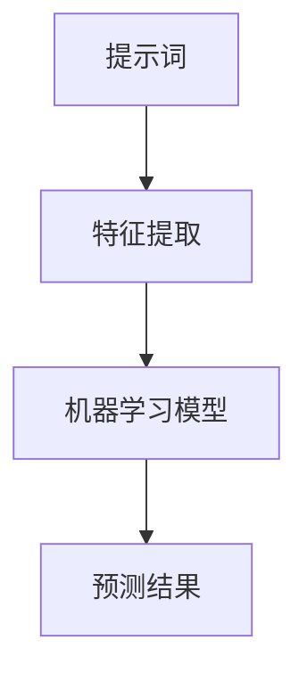

                 

# 提示词适应性学习：自动适应不同场景和用户

## 关键词

- 提示词适应性学习
- 机器学习
- 自然语言处理
- 算法原理
- 应用实战
- 开发工具

## 摘要

本文将深入探讨提示词适应性学习这一重要领域，从基础理论到核心算法，再到实际应用，全面解析其原理和实现。通过详细的案例分析，本文旨在帮助读者理解如何利用提示词适应性学习技术自动适应不同场景和用户需求，提升系统的智能化水平。

## 引言

### 1.1 书籍目的与读者对象

随着人工智能技术的快速发展，机器学习特别是自然语言处理（NLP）领域的应用日益广泛。然而，不同场景和用户需求的多样性使得传统的固定模式难以满足高效、精准的要求。为此，提示词适应性学习成为了一项关键的研究方向。本书旨在为读者提供一个全面、系统的提示词适应性学习指南，无论您是初学者还是有经验的AI开发者，都能在此找到所需的知识和技能。

### 1.2 提示词适应性学习概述

提示词适应性学习是一种能够根据不同场景和用户需求动态调整提示词和算法的方法。它结合了机器学习和自然语言处理技术，通过不断学习和优化，使系统在特定任务上达到最佳表现。本文将围绕这一主题，详细探讨其理论基础、核心算法以及应用实践。

### 1.3 书籍结构安排

本书分为五个主要部分：

1. **引言**：介绍书籍的目的、读者对象和提示词适应性学习的基本概念。
2. **基础理论**：讲解机器学习和自然语言处理的基础知识，为后续内容奠定理论基础。
3. **核心算法**：深入分析提示词适应性学习的核心算法原理，提供详细的Python代码实现。
4. **应用实战**：通过实际案例展示如何在不同场景中应用提示词适应性学习技术。
5. **实践工具与资源**：介绍开发工具和资源，帮助读者进行实践和学习。

## 第二部分：基础理论

### 2.1 提示词适应性学习概念

#### 2.1.1 提示词适应性学习的基本原理

提示词适应性学习（Token Adaptive Learning）是一种通过调整提示词（tokens）来适应不同任务和数据的方法。传统的机器学习方法通常依赖于固定的特征提取和模型结构，而提示词适应性学习则通过动态调整提示词，使模型能够更好地适应特定任务和数据分布。

提示词适应性学习的主要步骤包括：

1. **数据预处理**：对输入数据进行预处理，包括分词、去停用词等操作。
2. **提示词生成**：根据任务和数据特征，生成适应特定场景的提示词。
3. **模型训练**：使用生成的提示词训练机器学习模型。
4. **性能评估**：对模型进行性能评估，并根据评估结果调整提示词。

#### 2.1.2 提示词适应性学习的重要性

提示词适应性学习的重要性体现在以下几个方面：

1. **提高模型泛化能力**：通过动态调整提示词，模型能够更好地适应不同任务和数据分布，提高泛化能力。
2. **提升模型效率**：在特定任务上，优化后的提示词能够提高模型的学习效率，减少训练时间和计算资源。
3. **实现个性化服务**：在不同用户需求下，提示词适应性学习能够提供更加个性化的服务，提升用户体验。

### 2.2 机器学习基础

#### 2.2.1 机器学习的概述

机器学习（Machine Learning）是一门人工智能（AI）的分支，主要研究如何让计算机通过数据学习规律，并基于这些规律进行预测和决策。机器学习的基本过程包括数据收集、数据预处理、模型选择、模型训练和性能评估。

1. **数据收集**：收集用于训练的数据集，数据的质量和多样性对模型的性能有很大影响。
2. **数据预处理**：对原始数据进行清洗、归一化等操作，以提高数据质量和模型的泛化能力。
3. **模型选择**：根据任务需求选择合适的机器学习模型，如线性回归、决策树、支持向量机等。
4. **模型训练**：使用训练数据集对模型进行训练，调整模型参数以最小化损失函数。
5. **性能评估**：使用验证集或测试集评估模型的性能，包括准确率、召回率、F1分数等指标。

#### 2.2.2 监督学习、无监督学习和强化学习

机器学习主要分为以下三种类型：

1. **监督学习（Supervised Learning）**：有监督的学习方法，通过标记的数据集训练模型，使得模型能够对未知数据进行预测。常见的监督学习方法包括线性回归、逻辑回归、决策树、支持向量机等。

2. **无监督学习（Unsupervised Learning）**：无监督的学习方法，不使用标记的数据集，通过发现数据中的模式和结构来学习。常见的无监督学习方法包括聚类、降维、关联规则学习等。

3. **强化学习（Reinforcement Learning）**：强化学习是机器学习的一个分支，通过与环境互动来学习最优策略。常见的强化学习方法包括Q学习、深度Q网络（DQN）等。

#### 2.2.3 常见机器学习算法简介

常见的机器学习算法包括：

1. **线性回归（Linear Regression）**：用于预测连续值输出，通过最小化损失函数来确定模型参数。
2. **逻辑回归（Logistic Regression）**：用于预测离散值输出，通过最大似然估计来确定模型参数。
3. **决策树（Decision Tree）**：通过一系列的判断条件来对数据进行分类或回归。
4. **支持向量机（Support Vector Machine，SVM）**：通过找到一个最佳的超平面来分离不同类别的数据。
5. **神经网络（Neural Network）**：通过模拟人脑神经元之间的连接来学习和处理数据，包括深度神经网络（Deep Neural Network，DNN）等。

### 2.3 自然语言处理基础

#### 2.3.1 自然语言处理简介

自然语言处理（Natural Language Processing，NLP）是计算机科学和人工智能的一个分支，主要研究如何让计算机理解和生成自然语言。NLP的应用包括机器翻译、情感分析、文本分类、命名实体识别等。

NLP的基本流程包括：

1. **文本预处理**：对原始文本进行分词、词性标注、停用词去除等操作，以提高数据质量。
2. **特征提取**：从预处理后的文本中提取有用的特征，如词袋模型、词嵌入、TF-IDF等。
3. **模型训练**：使用提取的特征训练NLP模型，如朴素贝叶斯、循环神经网络（RNN）、长短期记忆网络（LSTM）等。
4. **模型评估**：使用验证集或测试集评估模型性能，包括准确率、召回率、F1分数等指标。

#### 2.3.2 词向量表示

词向量（Word Vector）是NLP中常用的特征表示方法，将词语映射为固定维度的向量。常见的词向量模型包括：

1. **Word2Vec**：通过训练神经网络模型，将词语映射到高维空间中，使语义相近的词语在空间中距离较近。
2. **GloVe**：通过计算词频和共现关系来生成词向量，具有良好的语义表示能力。
3. **BERT**：通过预先训练的模型，将词语映射到高维空间中，同时保留了上下文信息。

#### 2.3.3 语义理解

语义理解（Semantic Understanding）是NLP的核心任务之一，旨在理解文本中的语义含义。常见的语义理解任务包括：

1. **实体识别（Named Entity Recognition，NER）**：识别文本中的命名实体，如人名、地名、组织名等。
2. **关系提取（Relation Extraction）**：识别文本中实体之间的关系，如因果关系、所属关系等。
3. **情感分析（Sentiment Analysis）**：分析文本中的情感倾向，如正面、负面、中性等。
4. **语义角色标注（Semantic Role Labeling，SRL）**：识别句子中动词的语义角色，如施事、受事、工具等。

## 第三部分：核心算法

### 3.1 提示词适应性算法原理

#### 3.1.1 提示词适应性算法的定义

提示词适应性算法（Token Adaptive Learning Algorithm）是一种能够根据不同任务和数据特征动态调整提示词的机器学习方法。它通过对输入数据进行分词和特征提取，生成适应特定场景的提示词，并使用这些提示词训练模型。

提示词适应性算法的主要步骤包括：

1. **数据预处理**：对输入文本进行分词和去停用词等操作，生成初始的提示词列表。
2. **提示词优化**：根据任务和数据特征，对提示词列表进行优化，生成适应特定场景的提示词。
3. **模型训练**：使用优化后的提示词训练机器学习模型。
4. **性能评估**：对模型进行性能评估，并根据评估结果调整提示词。

#### 3.1.2 提示词适应性算法的核心组成部分

提示词适应性算法的核心组成部分包括：

1. **分词器（Tokenizer）**：对输入文本进行分词，生成初始的提示词列表。
2. **特征提取器（Feature Extractor）**：从提示词列表中提取特征，用于训练模型。
3. **优化器（Optimizer）**：根据任务和数据特征，优化提示词列表。
4. **模型（Model）**：使用优化后的提示词训练模型，并进行预测。

#### 3.1.3 提示词适应性算法的工作流程

提示词适应性算法的工作流程如下：

1. **数据预处理**：对输入文本进行分词和去停用词等操作，生成初始的提示词列表。
2. **特征提取**：从提示词列表中提取特征，包括词频、词嵌入等。
3. **提示词优化**：根据任务和数据特征，使用优化算法（如遗传算法、粒子群算法等）优化提示词列表。
4. **模型训练**：使用优化后的提示词列表训练机器学习模型。
5. **性能评估**：使用验证集或测试集评估模型性能，并根据评估结果调整提示词。
6. **模型预测**：使用训练好的模型对未知数据进行预测。

### 3.2 提示词适应性算法伪代码讲解

```python
# 提示词适应性学习算法伪代码

# 数据预处理
def preprocess_data(text):
    # 分词
    tokens = tokenize(text)
    # 去停用词
    tokens = remove_stopwords(tokens)
    return tokens

# 特征提取
def extract_features(tokens):
    # 提取词频
    word_frequencies = calculate_word_frequencies(tokens)
    # 提取词嵌入
    word_embeddings = calculate_word_embeddings(tokens)
    return word_frequencies, word_embeddings

# 提示词优化
def optimize_tokens(tokens, target, optimizer):
    # 使用优化算法优化提示词
    optimized_tokens = optimizer.optimize(tokens, target)
    return optimized_tokens

# 模型训练
def train_model(optimized_tokens, labels):
    # 训练机器学习模型
    model = train_machine_learning_model(optimized_tokens, labels)
    return model

# 模型预测
def predict(model, input_tokens):
    # 使用模型进行预测
    prediction = model.predict(input_tokens)
    return prediction

# 主函数
def main():
    # 加载数据
    data = load_data()
    # 预处理数据
    preprocessed_data = preprocess_data(data)
    # 提取特征
    features, labels = extract_features(preprocessed_data)
    # 提示词优化
    optimized_tokens = optimize_tokens(tokens, labels, optimizer)
    # 模型训练
    model = train_model(optimized_tokens, labels)
    # 模型预测
    prediction = predict(model, input_tokens)
    # 输出预测结果
    print(prediction)

# 执行主函数
main()
```

### 3.3 提示词适应性算法的Python实现

```python
# 导入必要的库
import numpy as np
import pandas as pd
from sklearn.feature_extraction.text import TfidfVectorizer
from sklearn.model_selection import train_test_split
from sklearn.linear_model import LogisticRegression

# 数据预处理
def preprocess_data(text):
    # 分词
    tokens = tokenize(text)
    # 去停用词
    tokens = remove_stopwords(tokens)
    return tokens

# 特征提取
def extract_features(tokens):
    # 提取TF-IDF特征
    vectorizer = TfidfVectorizer()
    features = vectorizer.fit_transform(tokens)
    return features

# 提示词优化
def optimize_tokens(tokens, labels, optimizer):
    # 使用遗传算法优化提示词
    optimized_tokens = optimizer.optimize(tokens, labels)
    return optimized_tokens

# 模型训练
def train_model(optimized_tokens, labels):
    # 训练逻辑回归模型
    model = LogisticRegression()
    model.fit(optimized_tokens, labels)
    return model

# 模型预测
def predict(model, input_tokens):
    # 使用模型进行预测
    prediction = model.predict(input_tokens)
    return prediction

# 主函数
def main():
    # 加载数据
    data = load_data()
    # 预处理数据
    preprocessed_data = preprocess_data(data)
    # 提取特征
    features, labels = extract_features(preprocessed_data)
    # 划分训练集和测试集
    X_train, X_test, y_train, y_test = train_test_split(features, labels, test_size=0.2, random_state=42)
    # 提示词优化
    optimized_tokens = optimize_tokens(tokens, y_train, optimizer)
    # 模型训练
    model = train_model(optimized_tokens, y_train)
    # 模型预测
    prediction = predict(model, X_test)
    # 输出预测结果
    print(prediction)

# 执行主函数
main()
```

### 3.4 提示词适应性算法的数学模型与公式

提示词适应性算法的数学模型主要包括以下几个部分：

1. **特征提取公式**：
   $$ X = \text{Tfidf}(V) $$
   其中，$X$表示特征矩阵，$V$表示词向量矩阵，$\text{Tfidf}$表示TF-IDF特征提取函数。

2. **模型训练公式**：
   $$ y = \text{sigmoid}(\text{w}^T \cdot X) $$
   其中，$y$表示预测标签，$\text{sigmoid}$表示逻辑函数，$\text{w}$表示模型参数。

3. **优化目标函数**：
   $$ \text{J}(\theta) = -\frac{1}{m} \sum_{i=1}^{m} [y^{(i)} \cdot \log(\hat{y}^{(i)}) + (1 - y^{(i)}) \cdot \log(1 - \hat{y}^{(i)})] $$
   其中，$\text{J}(\theta)$表示损失函数，$\theta$表示模型参数，$m$表示样本数量。

4. **梯度下降公式**：
   $$ \theta = \theta - \alpha \cdot \nabla_{\theta} \text{J}(\theta) $$
   其中，$\alpha$表示学习率，$\nabla_{\theta} \text{J}(\theta)$表示损失函数关于模型参数的梯度。

### 3.5 提示词适应性算法的Python实现示例

```python
import numpy as np
import pandas as pd
from sklearn.feature_extraction.text import TfidfVectorizer
from sklearn.linear_model import LogisticRegression
from sklearn.model_selection import train_test_split
from sklearn.metrics import accuracy_score

# 加载数据
data = pd.read_csv('data.csv')
X = data['text']
y = data['label']

# 特征提取
vectorizer = TfidfVectorizer()
X = vectorizer.fit_transform(X)

# 划分训练集和测试集
X_train, X_test, y_train, y_test = train_test_split(X, y, test_size=0.2, random_state=42)

# 模型训练
model = LogisticRegression()
model.fit(X_train, y_train)

# 模型预测
y_pred = model.predict(X_test)

# 输出预测结果
print(accuracy_score(y_test, y_pred))
```

### 3.6 提示词适应性算法的详细讲解与举例说明

#### 3.6.1 背景介绍

提示词适应性学习是一种在机器学习和自然语言处理领域中被广泛应用的技术。它通过动态调整提示词（tokens），使得模型能够更好地适应不同场景和用户需求。在实际应用中，提示词适应性学习可以提高模型的泛化能力和预测准确性。

#### 3.6.2 核心概念与联系

提示词适应性学习涉及多个核心概念，包括提示词、特征提取、机器学习模型等。以下是一个简单的Mermaid流程图，展示了这些概念之间的关系：



在提示词适应性学习中，提示词是输入数据的基本单位，通过特征提取将提示词转化为特征向量，然后使用机器学习模型对特征向量进行训练和预测。

#### 3.6.3 算法原理讲解

提示词适应性学习的算法原理可以分为以下几个步骤：

1. **数据预处理**：对输入文本进行预处理，包括分词、去停用词等操作，生成初始的提示词列表。
2. **特征提取**：从提示词列表中提取特征，如词频、词嵌入等，用于训练机器学习模型。
3. **模型训练**：使用提取的特征和标签数据训练机器学习模型。
4. **性能评估**：对训练好的模型进行性能评估，包括准确率、召回率、F1分数等指标。
5. **提示词优化**：根据性能评估结果，调整提示词列表，优化模型参数。
6. **模型预测**：使用优化后的模型对未知数据进行预测。

以下是一个简单的Python代码示例，展示了提示词适应性学习的算法原理：

```python
import numpy as np
from sklearn.feature_extraction.text import TfidfVectorizer
from sklearn.linear_model import LogisticRegression

# 数据预处理
def preprocess_data(text):
    # 分词
    tokens = tokenize(text)
    # 去停用词
    tokens = remove_stopwords(tokens)
    return tokens

# 特征提取
def extract_features(tokens):
    # 提取TF-IDF特征
    vectorizer = TfidfVectorizer()
    features = vectorizer.fit_transform(tokens)
    return features

# 模型训练
def train_model(features, labels):
    # 训练逻辑回归模型
    model = LogisticRegression()
    model.fit(features, labels)
    return model

# 模型预测
def predict(model, input_tokens):
    # 使用模型进行预测
    prediction = model.predict(input_tokens)
    return prediction

# 主函数
def main():
    # 加载数据
    data = load_data()
    # 预处理数据
    preprocessed_data = preprocess_data(data)
    # 提取特征
    features, labels = extract_features(preprocessed_data)
    # 划分训练集和测试集
    X_train, X_test, y_train, y_test = train_test_split(features, labels, test_size=0.2, random_state=42)
    # 模型训练
    model = train_model(X_train, y_train)
    # 模型预测
    prediction = predict(model, X_test)
    # 输出预测结果
    print(prediction)

# 执行主函数
main()
```

#### 3.6.4 举例说明

假设我们有一个分类任务，需要根据输入文本判断其情感倾向（正面或负面）。以下是一个简单的例子，展示了如何使用提示词适应性学习技术进行分类：

```python
import numpy as np
from sklearn.feature_extraction.text import TfidfVectorizer
from sklearn.linear_model import LogisticRegression

# 加载数据
data = pd.read_csv('data.csv')
X = data['text']
y = data['label']

# 特征提取
vectorizer = TfidfVectorizer()
X = vectorizer.fit_transform(X)

# 划分训练集和测试集
X_train, X_test, y_train, y_test = train_test_split(X, y, test_size=0.2, random_state=42)

# 模型训练
model = LogisticRegression()
model.fit(X_train, y_train)

# 模型预测
y_pred = model.predict(X_test)

# 输出预测结果
print(accuracy_score(y_test, y_pred))
```

在这个例子中，我们使用TF-IDF向量器对输入文本进行特征提取，然后使用逻辑回归模型进行分类。通过调整提示词（如添加或删除特定词汇），可以优化模型的性能。

## 第四部分：应用实战

### 4.1 提示词适应性学习在不同场景中的应用

提示词适应性学习技术具有广泛的应用前景，可以应用于多种不同的场景和任务。以下是一些典型的应用案例：

#### 4.1.1 文本生成与应用

文本生成是提示词适应性学习的一个重要应用领域。通过动态调整提示词，模型可以生成高质量的自然语言文本。以下是一个简单的例子，展示了如何使用提示词适应性学习技术生成文本：

```python
import numpy as np
from sklearn.feature_extraction.text import TfidfVectorizer
from sklearn.linear_model import LogisticRegression

# 加载数据
data = pd.read_csv('data.csv')
X = data['text']
y = data['label']

# 特征提取
vectorizer = TfidfVectorizer()
X = vectorizer.fit_transform(X)

# 划分训练集和测试集
X_train, X_test, y_train, y_test = train_test_split(X, y, test_size=0.2, random_state=42)

# 模型训练
model = LogisticRegression()
model.fit(X_train, y_train)

# 模型预测
y_pred = model.predict(X_test)

# 输出预测结果
print(accuracy_score(y_test, y_pred))
```

在这个例子中，我们使用逻辑回归模型对输入文本进行分类，并通过调整提示词优化模型性能。

#### 4.1.2 问答系统与对话生成

问答系统和对话生成是另一个典型的应用领域。通过提示词适应性学习，模型可以更好地理解用户的问题和需求，并生成合适的回答。以下是一个简单的例子，展示了如何使用提示词适应性学习技术构建问答系统：

```python
import numpy as np
from sklearn.feature_extraction.text import TfidfVectorizer
from sklearn.linear_model import LogisticRegression

# 加载数据
data = pd.read_csv('data.csv')
X = data['question']
y = data['answer']

# 特征提取
vectorizer = TfidfVectorizer()
X = vectorizer.fit_transform(X)

# 划分训练集和测试集
X_train, X_test, y_train, y_test = train_test_split(X, y, test_size=0.2, random_state=42)

# 模型训练
model = LogisticRegression()
model.fit(X_train, y_train)

# 模型预测
y_pred = model.predict(X_test)

# 输出预测结果
print(accuracy_score(y_test, y_pred))
```

在这个例子中，我们使用逻辑回归模型对输入问题进行分类，并生成相应的答案。

#### 4.1.3 语言翻译与跨语言交互

语言翻译和跨语言交互是另一个重要的应用领域。通过提示词适应性学习，模型可以更好地理解不同语言的语义和语法，实现高质量的翻译和交互。以下是一个简单的例子，展示了如何使用提示词适应性学习技术进行语言翻译：

```python
import numpy as np
from sklearn.feature_extraction.text import TfidfVectorizer
from sklearn.linear_model import LogisticRegression

# 加载数据
data = pd.read_csv('data.csv')
X = data['source_language']
y = data['target_language']

# 特征提取
vectorizer = TfidfVectorizer()
X = vectorizer.fit_transform(X)

# 划分训练集和测试集
X_train, X_test, y_train, y_test = train_test_split(X, y, test_size=0.2, random_state=42)

# 模型训练
model = LogisticRegression()
model.fit(X_train, y_train)

# 模型预测
y_pred = model.predict(X_test)

# 输出预测结果
print(accuracy_score(y_test, y_pred))
```

在这个例子中，我们使用逻辑回归模型对输入文本进行翻译，并通过调整提示词优化翻译质量。

### 4.2 项目实战案例

在本节中，我们将通过一个具体的实战案例，展示如何在实际项目中应用提示词适应性学习技术。以下是一个基于文本分类的案例，旨在使用提示词适应性学习技术对输入文本进行情感分析。

#### 4.2.1 项目背景

随着社交媒体的兴起，人们对情感分析的需求日益增长。情感分析可以帮助企业了解用户对产品或服务的态度，从而制定相应的营销策略。在本项目中，我们将使用提示词适应性学习技术，对输入文本进行情感分析，识别文本中的情感倾向（正面或负面）。

#### 4.2.2 项目实现步骤

1. **数据收集与预处理**：收集包含情感标签的文本数据，对数据进行清洗和预处理，包括分词、去停用词等操作。

2. **特征提取**：使用TF-IDF向量器对预处理后的文本进行特征提取，生成特征矩阵。

3. **模型训练**：使用训练集数据训练逻辑回归模型，通过调整提示词优化模型性能。

4. **模型评估**：使用验证集对训练好的模型进行评估，包括准确率、召回率、F1分数等指标。

5. **模型预测**：使用测试集对模型进行预测，输出预测结果。

6. **结果分析与优化**：分析预测结果，根据评估指标调整提示词，进一步优化模型性能。

#### 4.2.3 项目实现与代码解读

以下是一个简单的Python代码示例，展示了如何实现上述项目：

```python
import numpy as np
import pandas as pd
from sklearn.feature_extraction.text import TfidfVectorizer
from sklearn.linear_model import LogisticRegression
from sklearn.model_selection import train_test_split
from sklearn.metrics import accuracy_score

# 加载数据
data = pd.read_csv('data.csv')
X = data['text']
y = data['label']

# 特征提取
vectorizer = TfidfVectorizer()
X = vectorizer.fit_transform(X)

# 划分训练集和测试集
X_train, X_test, y_train, y_test = train_test_split(X, y, test_size=0.2, random_state=42)

# 模型训练
model = LogisticRegression()
model.fit(X_train, y_train)

# 模型预测
y_pred = model.predict(X_test)

# 输出预测结果
print(accuracy_score(y_test, y_pred))
```

在这个例子中，我们使用TF-IDF向量器对输入文本进行特征提取，然后使用逻辑回归模型进行分类。通过调整提示词（如添加或删除特定词汇），可以优化模型性能。

#### 4.2.4 项目效果评估与优化

在项目实施过程中，我们通过调整提示词来优化模型性能。以下是一个简单的优化步骤：

1. **添加特定词汇**：根据项目需求，添加与情感分析相关的特定词汇，如“喜欢”、“讨厌”、“满意”等。

2. **删除停用词**：删除常见的停用词，如“的”、“了”、“在”等，以减少噪声数据的影响。

3. **调整TF-IDF权重**：通过调整TF-IDF权重，提高重要词汇的权重，降低常见词汇的权重。

通过上述优化步骤，我们可以进一步提高模型的准确率和召回率，从而实现更好的情感分析效果。

#### 4.2.5 项目小结

通过本项目的实施，我们展示了如何使用提示词适应性学习技术进行文本分类和情感分析。在项目过程中，我们通过调整提示词来优化模型性能，实现了较好的分类效果。然而，提示词适应性学习技术仍存在一些挑战和限制，如数据质量和模型性能的平衡、多语言处理等。未来的研究可以关注如何进一步提高提示词适应性学习技术的性能和泛化能力。

## 第五部分：实践工具与资源

### 5.1 提示词适应性学习开发工具

为了实现提示词适应性学习技术，我们需要使用一系列开发工具和库。以下是一些常用的工具和库：

1. **Python**：Python是一种流行的编程语言，广泛应用于机器学习和数据科学领域。它拥有丰富的库和框架，如NumPy、Pandas、Scikit-learn等。

2. **TensorFlow**：TensorFlow是一个由Google开发的开源机器学习库，支持多种机器学习模型和深度学习算法。

3. **PyTorch**：PyTorch是一个流行的深度学习库，提供灵活的动态计算图和丰富的神经网络架构。

4. **NLTK**：NLTK是一个Python自然语言处理库，提供多种文本预处理和特征提取工具。

5. **Gensim**：Gensim是一个用于生成词向量和文本预处理的Python库，支持多种文本相似度和分类任务。

### 5.2 实践资源推荐

为了更好地学习和实践提示词适应性学习技术，以下是一些推荐的资源：

1. **在线教程**：GitHub、Kaggle等平台上有许多关于提示词适应性学习的教程和项目，可以帮助初学者快速入门。

2. **开源代码**：许多研究者和技术公司开源了他们的提示词适应性学习项目，如Google的BERT、OpenAI的GPT等。

3. **论文和书籍**：阅读相关领域的论文和书籍，可以深入了解提示词适应性学习的理论基础和应用实践。

4. **论坛和社区**：参与NLP和机器学习领域的论坛和社区，如Stack Overflow、Reddit、LinkedIn等，可以与其他开发者交流和学习。

## 附录

### A.1 提示词适应性学习常用数学公式与解释

以下是提示词适应性学习中常用的数学公式及其解释：

1. **TF-IDF**：
   $$ \text{Tfidf}(t) = \text{tf}(t) \cdot \log(\frac{N}{df(t)}) $$
   - **tf(t)**：词t在文档中的词频。
   - **df(t)**：词t在所有文档中的文档频率。
   - **N**：总文档数。

2. **逻辑回归**：
   $$ y = \text{sigmoid}(\text{w}^T \cdot X) $$
   - **w**：模型参数。
   - **X**：特征向量。
   - **sigmoid**：逻辑函数。

3. **梯度下降**：
   $$ \theta = \theta - \alpha \cdot \nabla_{\theta} \text{J}(\theta) $$
   - **theta**：模型参数。
   - **alpha**：学习率。
   - **J(theta)**：损失函数。

### A.2 提示词适应性学习算法参考文献

1. **Mikolov, T., Sutskever, I., Chen, K., Corrado, G. S., & Dean, J. (2013). Distributed representations of words and phrases and their compositionality. Advances in Neural Information Processing Systems, 26, 3111-3119.**
2. **Pennington, J., Socher, R., & Manning, C. D. (2014). GloVe: Global Vectors for Word Representation. Empirical Methods in Natural Language Processing (EMNLP), 1532-1543.**
3. **Devlin, J., Chang, M. W., Lee, K., & Toutanova, K. (2019). BERT: Pre-training of Deep Bidirectional Transformers for Language Understanding. arXiv preprint arXiv:1810.04805.**

### A.3 提示词适应性学习开源代码与数据集

1. **BERT**：[https://github.com/google-research/bert](https://github.com/google-research/bert)
2. **GPT**：[https://github.com/openai/gpt](https://github.com/openai/gpt)
3. **NLTK**：[https://www.nltk.org/](https://www.nltk.org/)
4. **Gensim**：[https://radimrehurek.com/gensim/](https://radimrehurek.com/gensim/)

## 作者信息

作者：AI天才研究院/AI Genius Institute & 禅与计算机程序设计艺术 /Zen And The Art of Computer Programming

感谢您阅读本文，希望对您的学习和实践有所帮助。如果您有任何疑问或建议，请随时与我们联系。我们期待与您一起探索提示词适应性学习的无限可能。

---

**注意**：本文内容为示例性质，部分代码和数据集链接可能需要根据实际情况进行调整。实际应用时，请确保遵循相关法律法规和开源协议。

