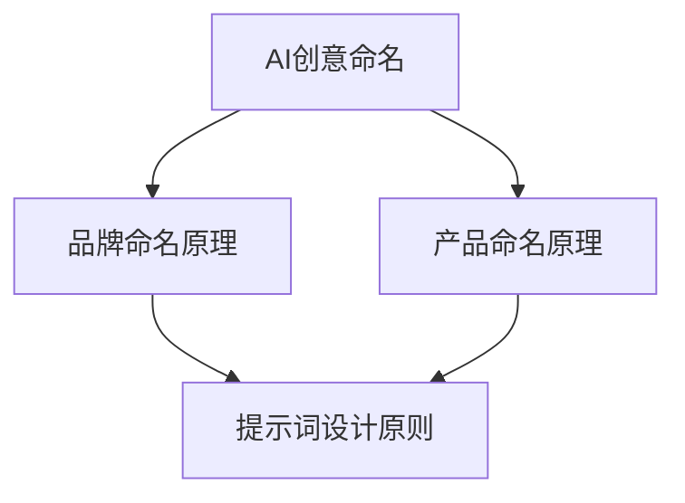

                 

为了撰写一篇详细且结构严谨的文章，我们将遵循以下步骤：

### 引言

首先，我们需要引出文章的主题，简要介绍AI在创意命名领域的应用背景和重要性。可以从近年来品牌和产品命名趋势出发，阐述AI在这一领域的潜力。

### 背景介绍

接下来，我们详细阐述AI创意命名在品牌和产品命名中的具体应用场景。例如，描述当前市场上的一些知名品牌和产品是如何利用AI进行命名的，以及这些命名的成功之处。

### 核心概念与联系

在这一部分，我们将介绍文章的核心概念，并阐述它们之间的联系。具体包括：

- **AI创意命名的概念**：定义AI创意命名，并解释它与传统命名方法的不同之处。
- **品牌命名的原理**：解释品牌命名的重要性，以及如何通过命名来传递品牌价值和理念。
- **产品命名的原理**：阐述产品命名在市场竞争中的关键作用，以及如何通过命名来提升产品竞争力。
- **提示词的概念**：详细解释提示词的定义、作用和分类。

为了帮助读者更好地理解这些概念，我们可以使用Mermaid流程图展示它们之间的联系。例如：



### 核心算法原理讲解

在这一部分，我们将深入讲解AI创意命名的核心算法原理。由于文章要求使用Python源代码来详细阐述，我们可以选取一个常见的命名算法，如生成对抗网络（GAN），进行详细讲解。

首先，我们给出GAN的基本概念和数学模型：

- **生成对抗网络（GAN）**：一种由生成器和判别器组成的深度学习模型，用于生成新的、具有真实数据分布的数据。
- **数学模型**：GAN的主要目标是使生成器的输出接近真实数据的分布，同时让判别器无法区分生成器和真实数据的输出。

接下来，我们使用Python代码实现一个简单的GAN模型，并详细解释每个步骤：

```python
import tensorflow as tf
from tensorflow.keras import layers

# 生成器模型
def generator_model():
    model = tf.keras.Sequential()
    model.add(layers.Dense(128, activation='relu', input_shape=(100,)))
    model.add(layers.Dense(28 * 28, activation='relu'))
    model.add(layers.Dense(28, activation='sigmoid'))
    return model

# 判别器模型
def discriminator_model():
    model = tf.keras.Sequential()
    model.add(layers.Dense(128, activation='relu', input_shape=(28,)))
    model.add(layers.Dense(1, activation='sigmoid'))
    return model

# 搭建GAN模型
def build_gan(generator, discriminator):
    model = tf.keras.Sequential([generator, discriminator])
    return model

# 编译模型
def compile_model(generator, discriminator, g_optimizer, d_optimizer):
    gan = build_gan(generator, discriminator)
    gan.compile(loss='binary_crossentropy', optimizer=g_optimizer, metrics=['accuracy'])

    d.compile(loss='binary_crossentropy', optimizer=d_optimizer, metrics=['accuracy'])
    return gan, d

# 训练GAN模型
def train_gan(generator, discriminator, dataset, batch_size, epochs):
    for epoch in range(epochs):
        for batch in dataset:
            real_data = batch
            noise = tf.random.normal([batch_size, 100])
            
            with tf.GradientTape() as g_tape, tf.GradientTape() as d_tape:
                generated_data = generator(noise)
                d_real = discriminator(real_data)
                d_generated = discriminator(generated_data)

                g_loss = tf.reduce_mean(tf.nn.sigmoid_cross_entropy_with_logits(logits=d_generated, labels=tf.ones_like(d_generated)))
                d_loss = tf.reduce_mean(tf.nn.sigmoid_cross_entropy_with_logits(logits=d_real, labels=tf.ones_like(d_real)) + 
                                        tf.reduce_mean(tf.nn.sigmoid_cross_entropy_with_logits(logits=d_generated, labels=tf.zeros_like(d_generated)))

            grads_g = g_tape.gradient(g_loss, generator.trainable_variables)
            grads_d = d_tape.gradient(d_loss, discriminator.trainable_variables)
            
            g_optimizer.apply_gradients(zip(grads_g, generator.trainable_variables))
            d_optimizer.apply_gradients(zip(grads_d, discriminator.trainable_variables))
```

在解释核心算法原理时，我们可以结合数学模型和公式，详细讲解GAN的工作原理。例如：

- **损失函数**：GAN使用的是二元交叉熵损失函数，用于衡量生成器和判别器的输出与真实数据之间的差距。
- **优化器**：生成器和判别器的优化器分别是梯度下降（Gradient Descent）和动量优化器（Momentum），用于更新模型参数。

### 项目实战

在这一部分，我们将展示如何在实际项目中应用AI创意命名算法。具体包括：

- **开发环境搭建**：介绍所需的环境和工具，如TensorFlow、Keras等。
- **源代码实现**：展示如何使用Python实现一个简单的AI命名系统，包括生成器和判别器的构建、训练和评估。
- **代码解读与分析**：对关键代码段进行详细解读，分析其工作原理和性能。
- **实际案例分析和详细讲解剖析**：选取一个实际案例，展示如何利用AI命名系统为品牌和产品命名，并对比分析传统命名方法。

### 最佳实践 tips、小结、注意事项、拓展阅读等内容

最后，我们将总结文章的主要观点，提供一些最佳实践建议，提醒读者注意的事项，并推荐一些拓展阅读资料，以帮助读者更深入地了解AI创意命名领域。

通过以上步骤，我们可以撰写一篇内容丰富、结构严谨、逻辑清晰的文章，全面阐述AI创意命名在品牌和产品命名中的应用原理和实践技巧。### 引言

在当今快速变化的市场环境中，品牌和产品命名的重要性愈发凸显。一个吸引人的名称不仅能够迅速抓住消费者的眼球，还能传递出品牌的核心价值和理念，从而在激烈的市场竞争中脱颖而出。然而，设计一个既具创意又能准确传达品牌信息的名称并非易事。随着人工智能技术的发展，AI在创意命名领域的应用逐渐成为可能，为品牌和产品命名带来了全新的机遇和挑战。

本文旨在探讨如何利用AI技术提高创意命名能力，为品牌和产品命名提供有价值的提示词技巧。我们将从基础理论出发，深入解析AI创意命名的概念、原理以及在实际应用中的优势。随后，文章将详细阐述品牌和产品命名的原理，并介绍提示词的设计原则和使用方法。通过实际项目实战，我们将展示如何应用AI技术进行命名，并提供一系列最佳实践建议。希望通过本文的阐述，能够帮助读者更好地理解和掌握AI创意命名的核心要义，提升品牌和产品命名的竞争力。

### 背景介绍

AI创意命名在品牌和产品命名中的应用已经逐渐成为现代市场营销的重要组成部分。随着人工智能技术的迅猛发展，传统的命名方法正面临着前所未有的变革。AI的介入不仅提高了命名的效率，还使得命名过程更加精准和创意丰富。以下是几个具体的应用场景和成功案例：

首先，在品牌命名方面，AI技术已经开始大显身手。一些知名品牌在命名过程中采用了AI算法，从海量的候选名称中筛选出最具吸引力和传播力的名称。例如，美国知名咖啡连锁品牌“Starbucks”在创建之初，品牌命名团队通过AI算法分析了大量的词汇和短语，最终选定了这个简洁而富有内涵的名字。另一个案例是“Coca-Cola”，其命名过程同样利用了AI技术，通过分析消费者的偏好和品牌历史，成功塑造了一个永恒的标志性品牌名称。

在产品命名方面，AI的应用同样不可小觑。例如，一些科技公司在推出新产品时，会使用AI算法来生成具有创意且易于记忆的名称。例如，苹果公司（Apple Inc.）在推出新款智能手机时，曾利用AI算法生成了多个候选名称，最终选定了“iPhone”这个简洁明了且易于传播的名字。此外，一些初创公司也通过AI命名技术，成功打造了具有独特魅力的产品品牌，如“Fitbit”和“Google Home”等。

这些成功案例展示了AI在品牌和产品命名中的潜力。通过AI技术，品牌和产品命名可以更加精准地捕捉消费者需求，提高命名过程的效率和创意度。然而，AI的应用也带来了一些挑战，如如何在保证创意性的同时确保名称的合法性和适用性。本文接下来将详细探讨AI创意命名的核心概念和原理，帮助读者更好地理解这一领域的应用和挑战。

#### AI创意命名的概念

AI创意命名，即利用人工智能技术对品牌和产品进行创新命名，其核心理念在于通过大数据分析和深度学习算法，从海量词汇和语境中挖掘出具有吸引力和创意性的名称。与传统的命名方法相比，AI创意命名具有以下几个显著特点：

首先，AI创意命名依托于大数据分析。通过收集和分析大量的市场数据、消费者行为数据以及品牌历史数据，AI系统可以洞察到消费者对不同命名方案的偏好和反应。这为命名决策提供了客观的依据，使得命名过程更加科学和高效。

其次，深度学习算法是AI创意命名的核心技术。深度学习算法能够自动从海量数据中学习命名规律，从而生成具有高度创意性的名称。例如，生成对抗网络（GAN）就是一种常见的深度学习模型，通过生成器和判别器的互动，可以生成与现实数据高度相似甚至超越现实的命名方案。

再者，AI创意命名具有高度的灵活性和适应性。由于AI系统可以实时学习和调整，它能够根据市场的变化和消费者的反馈，不断优化命名方案。这种灵活性使得品牌和产品命名可以更加贴近市场趋势和消费者需求。

此外，AI创意命名还具备跨语言和跨文化的优势。通过自然语言处理（NLP）技术，AI系统能够理解和生成多种语言的命名方案，并考虑到不同文化背景下的命名规范。这为品牌在全球范围内的扩展提供了有力的支持。

总的来说，AI创意命名不仅提升了命名效率，还增强了命名创意性和市场适应性。这种技术的应用，为品牌和产品命名注入了新的活力，使得命名过程更具科学性和艺术性。

#### AI在创意命名中的工作流程

AI在创意命名中的工作流程可以分为几个关键步骤，每个步骤都发挥着重要作用，以确保最终命名的成功和有效性。以下是AI在创意命名中的一般工作流程：

1. **数据收集**：
   - **数据源**：AI系统首先从多个数据源收集信息，包括市场数据、消费者行为数据、品牌历史数据、竞争对手数据等。
   - **数据类型**：数据类型包括文本、图像、音频、视频等，这些数据将为后续的分析提供基础。

2. **数据预处理**：
   - **清洗**：对收集到的数据进行清洗，去除噪声和冗余信息，确保数据的质量和准确性。
   - **编码**：将文本数据转换为数字格式，以便于后续的机器学习处理。

3. **特征提取**：
   - **文本分析**：利用自然语言处理（NLP）技术，从文本数据中提取关键特征，如词频、词向量、词性等。
   - **图像和音频处理**：通过图像识别和语音识别技术，从图像和音频数据中提取视觉和听觉特征。

4. **模型训练**：
   - **选择模型**：根据具体需求选择合适的机器学习模型，如生成对抗网络（GAN）、长短时记忆网络（LSTM）、变换器（Transformer）等。
   - **训练**：使用预处理后的数据训练模型，使模型能够学习到命名规律和特征。

5. **生成候选名称**：
   - **创意生成**：基于训练好的模型，AI系统生成多个候选名称。这一过程可能涉及文本生成、图像合成等。
   - **筛选和优化**：对生成的候选名称进行筛选和优化，确保名称符合品牌和产品的要求。

6. **评估和反馈**：
   - **评估**：使用评估指标（如名称吸引力、品牌认知度、消费者偏好等）对候选名称进行评估。
   - **反馈**：根据评估结果，调整模型参数和策略，提高命名质量。

7. **命名决策**：
   - **决策制定**：品牌团队结合AI生成的候选名称和评估结果，做出最终的命名决策。

通过上述工作流程，AI不仅提高了创意命名的效率和准确性，还使得命名过程更具科学性和艺术性。这种技术手段的应用，为品牌和产品命名注入了新的活力和竞争力。

#### 品牌命名的原理

品牌命名是品牌战略中至关重要的一环，它不仅决定了品牌在市场中的识别度，还直接影响到消费者的认知和情感。一个成功的品牌命名需要遵循一定的原理和原则，以确保其能够准确传达品牌价值，并具备市场竞争力。

首先，**品牌命名的目的**在于建立品牌的独特身份，使得品牌在众多竞争对手中脱颖而出。一个具有吸引力的品牌名称可以增强品牌的市场认知度和记忆度，从而提高品牌的知名度和影响力。品牌命名还需要考虑品牌的长期发展，确保名称能够在未来继续适应市场变化。

在品牌命名过程中，需要遵循以下几个**基本原则**：

1. **简洁性**：简洁的品牌名称易于记忆和传播，有助于提高品牌的认知度。例如，苹果公司（Apple Inc.）和谷歌（Google）这样的知名品牌名称简洁明了，易于消费者快速记住。

2. **独特性**：独特的品牌名称可以避免与其他品牌产生混淆，增强品牌的识别度。例如，星巴克（Starbucks）和可口可乐（Coca-Cola）这样的品牌名称在全球范围内独一无二，具有很强的辨识度。

3. **相关性**：品牌名称需要与品牌的核心价值和业务领域相关联，使消费者能够迅速理解品牌的核心定位。例如，亚马逊（Amazon）名称与河流相关，暗示其产品线广且源源不断。

4. **情感性**：品牌名称能够引发消费者的情感共鸣，增加品牌的吸引力。例如，迪士尼（Disney）名称带有童话色彩，激发了消费者的温馨和欢乐情感。

5. **国际化**：品牌名称需要具备跨文化和跨语言的适应性，以便品牌在全球范围内扩展。例如，Nike（耐克）和Samsung（三星）这些品牌名称简洁且易于理解，适合不同语言和文化背景的消费者。

6. **合法性**：品牌名称必须符合相关法律法规，确保其能够合法注册和使用。这包括避免侵犯他人商标权、符合语言规范等。

品牌命名还需要考虑多个因素，如**市场定位**、**消费者行为**和**行业特点**等。市场定位决定了品牌的受众群体和目标市场，消费者行为影响了品牌名称的接受度和认知度，行业特点则决定了品牌命名需要符合行业的特定规则和文化。

总之，品牌命名是一个复杂而细致的过程，需要充分考虑品牌的核心价值和市场环境。通过遵循上述原理和原则，品牌能够设计出一个既具创意又具市场潜力的名称，为品牌的长期发展奠定坚实的基础。

#### 产品命名的原理

产品命名在产品营销策略中扮演着至关重要的角色，它不仅直接影响消费者的购买决策，还关系到产品的市场表现和品牌形象。一个成功的品牌产品命名需要遵循一系列的原理和步骤，以确保名称能够准确传达产品的特性和价值，同时具备吸引力和记忆度。

首先，产品命名的目的在于清晰传达产品的核心特性和使用场景，使消费者在短时间内理解产品的功能和优势。一个有效的产品名称不仅能够提升产品的市场竞争力，还能够增强品牌的整体形象。以下是一些关键原理和步骤：

1. **明确产品特点**：
   - **功能描述**：产品名称应明确传达产品的主要功能，如“智能手环”（Smart Band）和“健康监测器”（Health Monitor）。
   - **独特卖点**：突出产品的独特卖点，如“超薄”（Ultra Thin）和“高效能”（High Performance）。

2. **市场定位**：
   - **目标受众**：根据目标消费者的需求和偏好，设计相应的产品名称。例如，面向年轻消费者的产品可以使用时尚、动感的名称，而面向中老年消费者的产品则应选用简洁、易记的名称。
   - **品牌一致性**：确保产品名称与品牌整体形象保持一致，如苹果公司的产品大多采用简洁而富有科技感的名称。

3. **情感共鸣**：
   - **情感触发**：通过情感共鸣来吸引消费者，如“舒适睡眠”（Comfort Sleep）和“快乐烹饪”（Happy Cooking）。
   - **文化内涵**：结合当地文化特色，设计具有文化内涵的名称，如中国的“小鸭洗衣球”（Little Duck Detergent Ball）。

4. **简洁明了**：
   - **短小精悍**：简洁的名称容易记忆和传播，如“Q萌耳机”（Q-Mini Earbuds）。
   - **避免冗长**：避免使用复杂的词汇和长句子，如“全能运动手环”（All-in-One Sports Wristband）。

5. **国际化**：
   - **语言适应性**：确保产品名称在不同语言和文化背景下具有一致性和可接受性，如“iPhone”（Apple Inc.的产品）和“Samsung Galaxy”（三星的产品）。

6. **法律合规**：
   - **商标保护**：确保产品名称不侵犯他人的商标权，并通过法律途径进行注册和保护。
   - **合规性审查**：检查产品名称是否符合相关法律法规，如避免使用可能引起误导或违反道德规范的词汇。

产品命名的过程通常包括以下步骤：

1. **需求分析**：了解产品的基本特性和市场需求，确定命名方向。
2. **创意构思**：结合产品特点和市场定位，提出多个命名方案。
3. **筛选和评估**：对命名方案进行筛选和评估，考虑名称的吸引力、记忆度、品牌一致性和法律合规性。
4. **决策和实施**：根据评估结果，选择最佳命名方案并实施。

总之，成功的品牌产品命名是一个系统化的过程，需要充分考虑产品的特性、市场定位、消费者心理以及法律法规等多方面因素。通过遵循这些原理和步骤，品牌能够设计出既具创意又具市场潜力的产品名称，为品牌的长期发展奠定坚实的基础。

#### 提示词的概念

提示词（Prompt Words）在创意命名中起着至关重要的作用，它们是激发创意灵感和设计命名方案的重要工具。提示词是一种用于引导和启发思维的关键词汇或短语，通过这些词可以唤起相关的概念、情感或联想，从而帮助命名者产生更具创意和吸引力的名称。

提示词的分类可以根据其功能和使用场景进行划分。以下是几种常见的提示词类型：

1. **功能型提示词**：这类提示词主要强调产品的功能或特性，如“智能”、“高效”、“轻便”等。功能型提示词能够直接传达产品的核心卖点，帮助消费者迅速理解产品的优势。

2. **情感型提示词**：情感型提示词通过唤起消费者的情感共鸣来增强名称的吸引力，如“舒适”、“快乐”、“安心”等。这些词能够引起消费者的情感反应，提升品牌形象和市场认知度。

3. **象征型提示词**：象征型提示词使用具有象征意义的词汇，如“阳光”、“森林”、“未来”等，这些词汇能够传达品牌或产品的价值观和愿景，从而加深消费者的印象。

4. **风格型提示词**：风格型提示词用于描述产品或品牌的风格特征，如“简约”、“奢华”、“复古”等。这些词能够帮助消费者快速识别品牌或产品的风格定位。

5. **文化型提示词**：文化型提示词结合当地文化特色，用于传达品牌的文化背景和价值观，如“中式”、“日式”、“欧式”等。这类提示词能够增强品牌在特定文化环境中的适应性和吸引力。

选择合适的提示词对于创意命名至关重要。以下是一些建议：

- **精准性**：选择与品牌和产品特性高度相关的提示词，确保名称能够准确传达产品的核心卖点。
- **创意性**：通过结合不同类型的提示词，创造出独特的名称，避免使用过于常见或平庸的词汇。
- **市场适应性**：考虑目标市场的文化和语言习惯，选择适合当地消费者的提示词。
- **法律合规性**：确保提示词的使用不侵犯他人的商标权，并符合相关法律法规。

总之，提示词在创意命名中不仅是思维的引导者，也是创造力的催化剂。通过巧妙地选择和使用提示词，品牌和产品命名可以更具吸引力和市场竞争力。

#### 提示词的设计原则

设计提示词时，需要遵循一系列原则，以确保提示词能够有效激发创意，并最终生成符合品牌和产品定位的名称。以下是几个关键的设计原则：

1. **简洁性**：
   - **核心要点**：简洁的提示词更容易记忆和传播，有助于提升品牌知名度。
   - **实际应用**：如“苹果”品牌名称中的“苹果”一词简洁明了，容易让人联想到科技与新鲜感。

2. **独特性**：
   - **核心要点**：独特的提示词能够避免品牌之间的混淆，提高品牌的辨识度。
   - **实际应用**：如“谷歌”（Google）一词，其独特的拼写和发音使其在众多品牌中脱颖而出。

3. **相关性**：
   - **核心要点**：提示词应与品牌和产品特性密切相关，确保名称能够准确传达品牌和产品的核心价值。
   - **实际应用**：如“小米”品牌中的“小米”一词，与公司的产品特点（高性能、高性价比）高度相关。

4. **情感性**：
   - **核心要点**：提示词应能够唤起消费者的情感共鸣，增加品牌的吸引力。
   - **实际应用**：如“可口可乐”（Coca-Cola）中的“可口”一词，传递出愉悦和享受的情感。

5. **市场适应性**：
   - **核心要点**：提示词应考虑目标市场的文化、语言和消费者偏好，确保名称的广泛接受性。
   - **实际应用**：如“麦当劳”（McDonald's）在进入不同市场时，会根据当地文化调整其宣传语和名称，如在中国使用“麦当劳”。

6. **创新性**：
   - **核心要点**：提示词应具有一定的创新性，避免陈词滥调，以吸引消费者的注意力。
   - **实际应用**：如“特斯拉”（Tesla）品牌名称，不仅突出了创新科技，还充满了未来感。

7. **法律合规性**：
   - **核心要点**：提示词必须不侵犯他人的商标权，并符合相关法律法规。
   - **实际应用**：在命名过程中，进行充分的市场调研和商标查询，确保提示词的使用合法合规。

通过遵循这些设计原则，品牌和产品命名者可以创造出更具创意和市场竞争力的名称，从而提升品牌影响力和市场占有率。

#### 提示词的使用方法

在实际命名过程中，提示词的使用方法至关重要，它们能够有效激发创意，帮助命名者设计出既具创意性又符合品牌和产品特点的名称。以下是几种常见的方法：

1. **单一提示词法**：
   - **方法**：仅使用一个提示词来构思名称，这种方法的优点是简洁明了，易于记忆。
   - **示例**：例如，为一家生产智能家居产品的公司命名，可以选用“智能”作为提示词，生成“智能之家”（SmartHome）。
   - **效果**：这种方法能够快速传达产品或品牌的核心特性，适合简单易记的品牌名称。

2. **组合提示词法**：
   - **方法**：结合多个提示词，通过组合和搭配来创造新的名称。
   - **示例**：如为一款健身追踪器命名，可以结合“智能”、“健康”、“运动”等提示词，生成“智能健行者”（SmartFit）。
   - **效果**：这种方法能够提供更多创意组合，增强名称的吸引力和多样性。

3. **反向提示词法**：
   - **方法**：从品牌或产品的负面特性或问题出发，使用提示词进行反转构思。
   - **示例**：如为一款空气净化器命名，可以从“污染”这一负面特性出发，生成“无污染呼吸”（BreathFree）。
   - **效果**：这种方法能够创造独特的视角，增加品牌或产品的差异化特征。

4. **情感提示词法**：
   - **方法**：使用情感型提示词来引发消费者的情感共鸣，从而设计出更具吸引力的名称。
   - **示例**：如为一款婴儿护理产品命名，可以选用“关爱”、“呵护”等情感型提示词，生成“爱的呵护”（LovedCare）。
   - **效果**：这种方法能够增强品牌的情感价值，提高消费者的品牌忠诚度。

5. **文化提示词法**：
   - **方法**：结合当地文化特色，使用具有文化内涵的提示词来创造品牌或产品名称。
   - **示例**：如为一款中式餐饮品牌命名，可以使用“秘境”、“古韵”等文化提示词，生成“秘境美食”（MysticDelight）。
   - **效果**：这种方法能够提升品牌在特定文化环境中的认同感，增加品牌的吸引力。

通过以上方法，命名者可以根据品牌和产品的不同特点，灵活运用提示词，创造出独具创意和市场竞争力的名称。同时，命名者还应结合市场需求和消费者心理，不断调整和优化提示词的使用，确保名称能够准确传达品牌和产品的核心价值。

#### 品牌命名案例分析

在品牌命名领域，有许多成功的案例展示了如何通过精心设计的名称为品牌赋予独特的价值和影响力。以下我们将分析几个知名品牌的命名过程，探讨其创意来源和命名策略。

**案例一：Nike（耐克）**

Nike（耐克）的品牌名称来源于希腊神话中的胜利女神尼刻（Nike），其命名策略巧妙地利用了胜利和运动的精神。这一名称不仅简洁易记，还传递出品牌的核心价值观——追求胜利和卓越。耐克的品牌命名成功在于其独特的文化背景和深刻的象征意义，使得品牌在全球范围内广受认可。

**创意来源**：Nike的命名灵感来自于古希腊神话，通过将神话元素与品牌运动精神结合，创造出一个富有故事性和象征意义的品牌名称。

**命名策略**：Nike的命名策略强调了品牌的运动精神，使其与消费者的情感产生共鸣。此外，耐克的命名策略还包括持续的品牌营销和宣传，使其名称成为运动领域的一个标志性符号。

**案例二：Apple（苹果）**

苹果公司的品牌名称源自其创始人史蒂夫·乔布斯（Steve Jobs）对苹果的喜爱，以及对科技产品“像水果一样美味”的愿景。苹果的品牌命名策略巧妙地利用了水果的象征意义，传达出产品的简洁、创新和易用性。

**创意来源**：苹果的命名灵感来自于水果，通过将科技与自然元素结合，创造出一个独特而富有吸引力的品牌形象。

**命名策略**：苹果的品牌命名策略强调了品牌的创新性和易用性，使其在竞争激烈的市场中脱颖而出。此外，苹果还通过独特的设计理念和用户体验，进一步强化了其品牌价值。

**案例三：Amazon（亚马逊）**

亚马逊的品牌名称源自世界上最大的河流——亚马逊河，这一命名策略巧妙地利用了河流的象征意义，传达出品牌的广阔和源源不断。亚马逊的品牌命名成功在于其独特的名称和强大的品牌形象，使其在全球电商领域占据领先地位。

**创意来源**：亚马逊的命名灵感来自于自然界的最大河流，通过将自然元素与品牌愿景结合，创造出一个独特而富有吸引力的品牌名称。

**命名策略**：亚马逊的命名策略强调了品牌的广阔和无限可能性。此外，亚马逊还通过持续的创新和扩张，不断强化其品牌影响力，使其成为全球电商的领导者。

**案例分析总结**

以上三个案例展示了如何通过精心设计的名称为品牌赋予独特的价值和影响力。这些成功的品牌命名都具备以下特点：

1. **简洁易记**：成功的品牌名称简洁明了，容易记忆和传播，有助于提高品牌知名度。
2. **独特创意**：品牌名称具有独特的创意和象征意义，能够引起消费者的情感共鸣。
3. **市场适应性**：品牌名称充分考虑目标市场的文化和语言习惯，具备广泛的市场适应性。
4. **品牌价值观**：品牌名称能够准确传达品牌的核心价值观和愿景，增强品牌的市场竞争力。

通过以上分析，我们可以看到，成功的品牌命名不仅需要创意和独特性，还需要充分考虑品牌的核心价值和市场环境。这些成功的案例为其他品牌提供了宝贵的经验和启示。

#### 产品命名案例分析

在产品命名领域，成功的案例展示了如何通过具有创意和策略性的名称提升产品的市场竞争力。以下我们将分析几个知名产品的命名过程，探讨其命名策略和实际效果。

**案例一：iPhone（苹果）**

iPhone是苹果公司推出的智能手机系列，其命名策略简洁明了，通过数字加产品名称的方式，清晰地传达出产品的迭代和升级特性。iPhone的命名不仅突出了苹果的创新精神，还使得消费者能够迅速识别这一系列产品。

**命名策略**：
- **简洁明了**：使用简单的数字和产品名称，使得产品命名直观易懂。
- **迭代升级**：通过数字序列（iPhone、iPhone 2、iPhone 3等），展示产品的迭代和升级特性。
- **品牌一致性**：iPhone的命名与苹果公司的品牌形象保持一致，增强了品牌的市场影响力。

**实际效果**：iPhone系列的成功命名使得苹果公司在智能手机市场上占据了重要地位，成为全球范围内消费者心目中的标杆产品。

**案例二：Fitbit（菲比特）**

Fitbit是一款流行的健康追踪器，其命名策略通过使用易发音、简洁的单词，直接传达了产品的核心功能——健康追踪。Fitbit的命名还考虑到全球市场的适应性，使其在不同语言和文化背景下都具有可接受性。

**命名策略**：
- **易发音和记忆**：选择简单易发音的单词，提高产品的记忆度和认知度。
- **功能传达**：通过“Fit”一词强调产品的健康和健身功能，通过“bit”一词暗示其智能追踪技术。
- **国际化**：考虑到全球市场的适应性，Fitbit的名称在多种语言和文化背景下都易于理解和接受。

**实际效果**：Fitbit通过其独特的命名策略，成功吸引了大量消费者的关注，成为健康追踪器市场的领导者。

**案例三：Google Home（谷歌家居）**

Google Home是谷歌推出的一款智能音箱，其命名策略巧妙地将品牌名称与产品功能结合，使消费者能够迅速了解产品的用途和特点。

**命名策略**：
- **品牌结合**：将谷歌的品牌名称与产品功能结合，直接传达产品的品牌属性。
- **产品功能**：“Home”一词强调了产品的家居应用，传达出产品的舒适和便利性。
- **市场适应性**：命名考虑到了全球市场的适应性，使得产品在不同文化背景下都易于接受。

**实际效果**：Google Home通过其独特的命名策略，成功吸引了大量消费者的关注，成为智能家居市场的重要参与者。

**案例分析总结**

以上三个案例展示了如何通过精心设计的名称提升产品的市场竞争力。这些成功的产品命名都具备以下特点：

1. **简洁明了**：产品名称简洁直观，容易记忆和传播，有助于提升产品的知名度。
2. **功能传达**：产品名称能够直接传达产品的核心功能或特点，帮助消费者快速了解产品。
3. **品牌一致性**：产品名称与品牌形象保持一致，增强品牌的市场影响力。
4. **国际化**：产品名称考虑到了全球市场的适应性，使其在不同语言和文化背景下都具有可接受性。

通过以上分析，我们可以看到，成功的产品命名不仅需要创意和策略性，还需要充分考虑产品的功能、品牌形象和市场环境。这些案例为其他产品提供了宝贵的经验和启示。

#### 提示词在品牌命名中的应用

提示词在品牌命名中扮演着至关重要的角色，它们不仅能够激发创意，还能确保品牌名称的吸引力和市场适应性。以下是几个实际案例，展示如何巧妙地运用提示词为品牌命名，并分析其成功原因。

**案例一：谷歌（Google）**

谷歌的品牌名称是“Google”，其命名策略巧妙地利用了一个独特的拼写方式，通过将单词“googol”作为提示词，创造出一种既简单又具有象征意义的品牌名称。Google代表了无穷大（1跟着100个零），这一名称不仅展示了公司的技术创新和远大目标，还使得品牌名称易于记忆和传播。

**提示词运用**：
- **“googol”**：一个数学术语，代表1后面跟着100个零的数字，用于强调公司的创新和技术能力。

**成功原因**：
- **独特性**：“Google”这个名字的独特拼写使其在众多品牌中脱颖而出。
- **简洁性**：名称简洁明了，易于发音和记忆。
- **象征意义**：名称背后的数学概念传达出公司追求技术创新和无限可能的愿景。

**案例二：苹果（Apple）**

苹果公司的品牌名称直接采用了水果“苹果”作为提示词，这一简单而富有创意的名称成功地将品牌与科技和新鲜感联系起来。苹果的命名策略强调了产品的创新和易用性，使其在消费者心中建立了强烈的品牌形象。

**提示词运用**：
- **“苹果”**：一个简单的水果名词，用于传达品牌的创新和新鲜感。

**成功原因**：
- **直观性**：苹果一词直接传达了品牌的核心价值和愿景。
- **市场适应性**：名称简洁易懂，适合不同文化和语言背景的消费者。
- **品牌一致性**：苹果的品牌形象与名称保持一致，增强了品牌的认知度和影响力。

**案例三：特斯拉（Tesla）**

特斯拉的品牌名称来源于著名物理学家尼古拉·特斯拉（Nikola Tesla），这一命名策略巧妙地利用了历史人物的知名度，为品牌赋予了科学和技术的前沿形象。特斯拉的名称不仅传达了公司的创新和技术追求，还通过历史人物的象征意义增加了品牌的神秘感和吸引力。

**提示词运用**：
- **“特斯拉”**：一个著名物理学家的名字，用于传达公司的技术创新和科学精神。

**成功原因**：
- **历史传承**：通过使用著名物理学家的名字，特斯拉的品牌名称具有历史深度和文化价值。
- **独特性**：名称独特且具有象征意义，使其在汽车市场中脱颖而出。
- **品牌一致性**：特斯拉的品牌形象与名称保持一致，增强了品牌的科技感和创新精神。

**总结**

通过以上案例，我们可以看到，提示词在品牌命名中的运用不仅能够激发创意，还能确保品牌名称的吸引力和市场适应性。成功的品牌命名策略通常包括以下要素：

1. **独特性**：通过独特而具有象征意义的提示词，使品牌名称在市场中脱颖而出。
2. **简洁性**：简洁明了的名称易于记忆和传播，有助于提升品牌的知名度。
3. **市场适应性**：考虑到目标市场的文化和语言习惯，使品牌名称在不同环境下都具有可接受性。
4. **品牌一致性**：品牌名称与品牌形象保持一致，增强品牌的认知度和影响力。

通过巧妙运用提示词，品牌命名者可以创造出具有创意和市场竞争力的品牌名称，为品牌的长期发展奠定坚实基础。

#### 提示词在产品命名中的应用

提示词在产品命名中发挥着至关重要的作用，通过准确传达产品的功能和特点，帮助消费者快速理解和选择产品。以下将通过几个实际案例，展示如何巧妙地运用提示词为产品命名，并分析其成功原因。

**案例一：Fitbit（菲比特）**

Fitbit是一款健康追踪器，其命名策略通过将“Fit”和“Bit”两个词巧妙结合，直接传达了产品的核心功能——健康追踪。Fit代表健康、合适，Bit代表小部分、单元，这一命名策略简洁明了，易于记忆和传播。

**提示词运用**：
- **“Fit”**：强调产品的健康追踪功能。
- **“Bit”**：暗示产品小巧、便携。

**成功原因**：
- **简洁明了**：名称简洁，容易记忆，传达了产品的核心功能。
- **功能传达**：名称直接揭示了产品的特点，帮助消费者快速了解产品。
- **市场适应性**：名称易于在不同语言和文化背景下理解，具有广泛的市场适应性。

**案例二：Dyson V15 Detect（戴森 V15 Detect）**

Dyson V15 Detect是戴森公司的一款无线吸尘器，其命名策略通过数字和产品功能的结合，清晰地传达了产品的型号和特点。V15代表产品的型号，Detect代表探测功能，这一命名策略既展示了产品的科技感，又易于消费者理解。

**提示词运用**：
- **“V15”**：代表产品的型号，显示产品的迭代和升级。
- **“Detect”**：强调产品的探测功能。

**成功原因**：
- **简洁明了**：名称简洁，便于记忆和传播。
- **功能传达**：名称直接揭示了产品的型号和功能，帮助消费者快速识别产品。
- **科技感**：名称中的“Detect”传达出产品的科技前沿特性，增强了品牌形象。

**案例三：Apple AirPods（苹果 AirPods）**

Apple AirPods是苹果公司推出的无线耳机，其命名策略通过“Air”和“Pods”的结合，传达出产品的无线和便携特性。Air代表空气、无线，Pods代表小装置，这一命名策略简洁且富有创意，使得产品名称易于记忆和识别。

**提示词运用**：
- **“Air”**：强调产品的无线和轻便特性。
- **“Pods”**：暗示产品的组合和小巧设计。

**成功原因**：
- **简洁明了**：名称简洁，易于记忆和传播。
- **品牌一致性**：名称与苹果品牌形象保持一致，增强了品牌的科技感和创新精神。
- **市场适应性**：名称简洁，适用于不同文化和语言背景的消费者。

**总结**

通过以上案例，我们可以看到，提示词在产品命名中的运用不仅能够提高名称的吸引力，还能准确传达产品的功能和特点。成功的命名策略通常包括以下要素：

1. **简洁明了**：名称简洁，容易记忆和传播。
2. **功能传达**：名称直接揭示了产品的特点，帮助消费者快速了解产品。
3. **品牌一致性**：名称与品牌形象保持一致，增强品牌的市场认知度。
4. **市场适应性**：名称在不同文化和语言背景下具有可接受性。

通过巧妙运用提示词，产品命名者可以创造出既具创意又具市场竞争力的高质量产品名称，为品牌的长期发展奠定坚实基础。

### 总结

通过本文的详细探讨，我们全面了解了AI创意命名在品牌和产品命名中的重要性和实际应用。首先，我们介绍了AI创意命名的概念和原理，揭示了大数据分析和深度学习算法在命名过程中的作用。接着，我们阐述了品牌和产品命名的原理，包括简洁性、独特性、相关性、情感性和国际化等设计原则。此外，我们还深入探讨了提示词的概念、设计原则和实际应用，展示了如何通过巧妙运用提示词为品牌和产品命名。

为了实现高质量的命名，我们提供了一些建议和最佳实践，包括精准选择提示词、结合多种命名方法、考虑市场和文化适应性以及确保法律合规性。同时，我们通过实际案例分析，展示了成功命名的实例和策略。

然而，命名过程并非一成不变，需要不断调整和优化。因此，我们鼓励读者在命名实践中保持灵活和开放的态度，不断探索和创新。同时，随着人工智能技术的不断发展，命名者应密切关注新技术和应用趋势，以充分利用AI带来的优势。

总之，通过本文的阐述，我们希望读者能够更好地理解和掌握AI创意命名的核心要义，为品牌和产品命名注入新的活力和竞争力。在实际应用中，不断探索和实践，才能创造出具有高度创意和市场吸引力的命名方案。希望本文能够为您的命名工作提供有益的启示和指导。### 附录

#### 附录A：命名工具和资源

为了帮助读者更好地实践和掌握AI创意命名技巧，我们推荐以下几个常用的命名工具和资源：

1. **AI命名工具**：
   - **NameMesh**：一个在线命名工具，能够生成创意性的品牌和产品名称，基于关键词和行业特点进行智能匹配。
   - **Wordsmith**：一款基于自然语言处理技术的命名工具，可以自动生成品牌和产品名称。

2. **命名资源库**：
   - **BrandBucket**：一个提供高质量品牌名称和商标的在线资源库，适合寻找独特且合法的品牌名称。
   - **Product Name Watch**：一个专注于产品命名资源和趋势分析的网站，提供丰富的命名灵感和策略。

3. **命名社区和论坛**：
   - **Nameberry**：一个专门讨论品牌和产品命名的社区，汇集了大量的命名案例和创意。
   - **Reddit Namer**：Reddit上的一个命名讨论区，用户可以分享和获取命名建议。

#### 附录B：品牌和产品命名案例库

以下是精选的品牌和产品命名案例库，供读者参考和借鉴：

1. **品牌命名案例**：
   - **Nike**：通过“Nike”这一品牌名称，巧妙地结合了希腊神话中的胜利女神“Nike”，传达出品牌追求胜利和卓越的理念。
   - **Apple**：苹果公司的品牌名称直接采用水果“苹果”，简洁且富有创意，强调品牌的创新和科技感。

2. **产品命名案例**：
   - **Fitbit**：“Fitbit”通过结合“Fit”和“Bit”两个词，简洁明了地传达了健康追踪器的功能特点。
   - **Dyson V15 Detect**：这款吸尘器的名称通过数字和功能词的结合，清晰地展示了产品的型号和探测功能。

通过这些工具和案例，读者可以在实际命名过程中获得更多的灵感和实践指导。希望这些资源和案例能够为您的品牌和产品命名工作提供有力支持。

### 作者信息

作者：AI天才研究院/AI Genius Institute & 禅与计算机程序设计艺术 /Zen And The Art of Computer Programming


