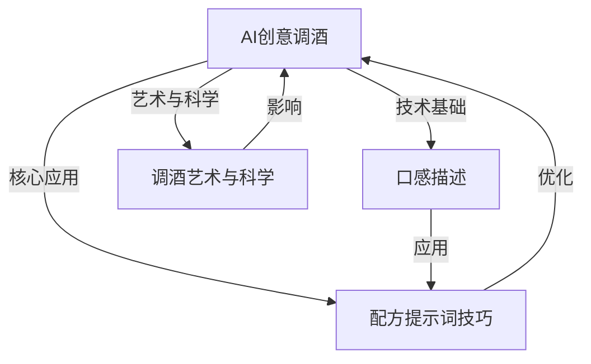

                 

# 提高AI创意调酒能力：口感描述和配方的提示词技巧

## 关键词
- AI创意调酒
- 口感描述
- 配方提示词技巧
- 生成对抗网络（GAN）
- 调酒配方生成
- 深度学习

## 摘要
本文旨在探讨如何利用人工智能（AI）技术，特别是生成对抗网络（GAN），来提高创意调酒能力。我们将详细解析口感描述和配方提示词技巧在AI调酒系统中的作用，并展示如何通过深度学习算法生成创新的调酒配方。本文将涵盖从技术背景、核心算法原理到实际项目实战的全面内容，旨在为调酒艺术家和技术开发者提供实用的指导。

## 引言
在快节奏的现代生活中，人们越来越追求个性化体验。在餐饮行业中，创意调酒作为一种时尚潮流，正逐渐成为消费者的新宠。然而，创意调酒不仅要求调酒师具备深厚的调酒技艺，还需要他们具备丰富的创意思维。随着人工智能（AI）技术的飞速发展，利用AI来辅助创意调酒，不仅能够提高调酒效率，还能生成独特的调酒配方，满足消费者的个性化需求。

AI创意调酒的关键在于如何准确描述口感和设计配方。口感描述是调酒艺术的重要组成部分，它不仅涉及到酒的香气、口感、余味等感官体验，还涉及到酒的成分、比例和调酒手法等。而配方提示词技巧则是指利用特定的关键词或短语来引导调酒师构思和调整配方，从而提高调酒创意的多样性和质量。

本文将分为以下几个部分：

1. 背景介绍
2. 核心概念与联系
3. 核心算法原理讲解
4. 数学模型和数学公式讲解
5. 项目实战
6. 最佳实践 tips
7. 小结与注意事项
8. 拓展阅读

接下来，我们将一步步深入探讨如何通过AI技术提高创意调酒能力。

## 1. 背景介绍

创意调酒作为一种新兴的餐饮文化，其核心在于通过创新和个性化来吸引消费者。传统的调酒师往往依靠经验和直觉来创作新的配方，这种方法虽然能够产生优秀的作品，但也存在一定的局限性。首先，调酒师的创意思维和经验水平受到个人能力的限制，难以实现大规模的个性化定制。其次，传统的调酒方法缺乏系统化的理论支持，难以进行科学化的优化和改进。

随着人工智能技术的发展，利用AI来辅助创意调酒成为一种新的趋势。AI能够通过对大量数据的分析学习，生成出新颖且符合消费者喜好的调酒配方。这不仅能够提高调酒效率，还能够降低调酒师的创作门槛，使得更多的餐饮从业者能够参与到创意调酒中来。

在AI辅助调酒中，口感描述和配方提示词技巧扮演着至关重要的角色。口感描述是调酒师与消费者沟通的桥梁，它能够帮助消费者更好地理解和欣赏调酒的独特之处。而配方提示词技巧则能够引导调酒师在创作新配方时，有针对性地考虑各种元素，从而提高配方的创新性和质量。

总的来说，AI创意调酒不仅是一种技术革新，更是一种餐饮文化的变革。通过AI技术，调酒师可以更加专注于创造和表达，而消费者则能够享受到更加个性化和多样化的饮品体验。接下来，我们将进一步探讨如何通过AI技术来实现这一目标。

## 2. 核心概念与联系

在探讨AI创意调酒时，首先需要明确几个核心概念，并理解它们之间的联系。这些核心概念包括：AI创意调酒、口感描述、配方提示词技巧、调酒艺术与科学。

### 2.1 AI创意调酒

AI创意调酒是指利用人工智能技术，特别是深度学习算法，来辅助调酒师创作新的调酒配方。通过分析大量的调酒数据，AI可以学习到不同成分和配比之间的相互作用，从而生成新颖且符合消费者口味的调酒。在这个过程中，生成对抗网络（GAN）是一种常用的深度学习模型，它能够生成高质量的、接近真实数据的调酒配方。

### 2.2 口感描述

口感描述是调酒艺术的重要组成部分，它涉及到酒的香气、口感、余味等感官体验。准确的口感描述不仅能够帮助调酒师理解不同成分的相互作用，还能够与消费者进行有效的沟通。口感描述通常包括以下方面：

- **香气**：描述酒中不同成分的香气特征，如水果、花、香料等。
- **口感**：描述酒在口中扩散的感觉，如甜、酸、苦、辣等。
- **余味**：描述酒在口中残留的味道和感觉。

### 2.3 配方提示词技巧

配方提示词技巧是一种通过关键词或短语来引导调酒师构思和调整配方的方法。这些提示词可以来源于不同种类的酒、特定的香料、流行的调酒趋势等。通过使用这些提示词，调酒师可以更快速地生成出多样化的调酒配方，从而提高创意调酒的能力。

### 2.4 调酒艺术与科学

调酒艺术与科学是指将艺术性和科学性相结合，通过科学的方法来研究和创造调酒。调酒艺术强调个性化和创意，而调酒科学则强调系统和可重复性。在AI创意调酒中，调酒艺术与科学得到了良好的结合，通过AI技术可以实现对调酒过程的精准控制，从而提高调酒的质量和一致性。

### 2.5 Mermaid流程图

为了更直观地展示这些概念之间的联系，我们可以使用Mermaid流程图来表示它们之间的关系。以下是一个简化的Mermaid流程图：



在这个流程图中，AI创意调酒作为核心，连接了口感描述、配方提示词技巧和调酒艺术与科学。口感描述和配方提示词技巧共同作用于调酒艺术与科学，而调酒艺术与科学又反过来影响AI创意调酒，形成了一个闭环系统。

通过这个流程图，我们可以更清晰地理解AI创意调酒的工作原理和各个环节之间的关系。接下来，我们将进一步探讨如何通过核心算法原理来实现这一目标。

## 3. 核心算法原理讲解

在AI创意调酒中，核心算法原理是生成对抗网络（GAN），它是一种基于博弈论的深度学习模型。GAN由两部分组成：生成器和判别器。生成器的任务是生成尽可能接近真实数据的样本，而判别器的任务是区分真实数据和生成数据。

### 3.1 生成器

生成器是一个生成模型，它通过学习真实数据分布来生成新的数据。在创意调酒中，生成器的主要作用是生成新的调酒配方。生成器的输入是一个随机噪声向量，通过多个全连接层和反卷积层，生成器最终输出一个调酒配方。

#### 3.1.1 生成器的结构

生成器的结构通常包括以下几个层次：

1. **噪声层**：生成器首先接收一个随机噪声向量，这个噪声向量通常来自于高斯分布。
2. **全连接层**：噪声层通过全连接层转化为一个低维向量，这个向量包含了生成调酒配方所需的信息。
3. **反卷积层**：全连接层的输出通过反卷积层逐层上采样，最终生成一个高维的调酒配方向量。

#### 3.1.2 生成器的训练过程

生成器的训练过程是通过最大化生成数据的真实度来进行的。具体步骤如下：

1. 生成器生成一个调酒配方。
2. 判别器评估这个配方是真实还是生成的。
3. 通过反向传播更新生成器的权重。

### 3.2 判别器

判别器是一个二分类模型，它的任务是区分真实数据和生成数据。在创意调酒中，判别器的输入是一个调酒配方，输出是一个介于0和1之间的概率值，表示配方是真实的概率。

#### 3.2.1 判别器的结构

判别器的结构通常包括以下几个层次：

1. **输入层**：接收一个调酒配方向量作为输入。
2. **全连接层**：输入层通过多个全连接层，逐层提取配方特征。
3. **输出层**：全连接层的输出通过一个激活函数，输出一个介于0和1之间的概率值。

#### 3.2.2 判别器的训练过程

判别器的训练过程是通过最小化生成数据的真实度来进行的。具体步骤如下：

1. 判别器评估真实配方和生成配方的真实度。
2. 通过反向传播更新判别器的权重。

### 3.3 GAN的训练过程

GAN的训练过程是一个迭代的过程，包括以下步骤：

1. 生成器生成一个调酒配方。
2. 判别器评估这个配方是真实还是生成的。
3. 通过反向传播更新生成器和判别器的权重。
4. 重复上述步骤，直到生成器生成的配方足够接近真实配方。

### 3.4 伪代码

以下是一个简单的GAN训练过程的伪代码：

```python
# 伪代码：GAN的训练过程

# 初始化生成器和判别器
G = 初始化生成器()
D = 初始化判别器()

# 训练轮数
for epoch in range(num_epochs):
    for 配方 in 调酒数据集():
        # 生成器生成配方
        generated_配方 = G(噪声)

        # 判别器评估配方
        real_评估 = D(配方)
        generated_评估 = D(generated_配方)

        # 更新生成器和判别器
        D梯度 = backward_pass(D, [real_评估, generated_评估])
        G梯度 = backward_pass(G, [generated_评估])
```

通过这个核心算法原理，我们可以利用GAN生成新颖的调酒配方，从而提高创意调酒的能力。接下来，我们将介绍如何使用数学模型和公式来进一步解释GAN的训练过程。

## 4. 数学模型和数学公式讲解

在GAN的训练过程中，数学模型和公式起着至关重要的作用。GAN的核心在于生成器和判别器的博弈过程，其中涉及到损失函数、梯度下降和反向传播等关键概念。

### 4.1 损失函数

GAN的损失函数包括两部分：生成器损失和判别器损失。

#### 4.1.1 生成器损失

生成器损失是用来衡量生成器生成的数据与真实数据之间的差距。在GAN中，生成器的目标是使判别器无法区分生成数据和真实数据。因此，生成器损失通常使用以下公式表示：

$$
L_G = -\log(D(G(z)))
$$

其中，$D(G(z))$ 表示判别器对生成数据的评估，取值范围在0和1之间。为了最大化生成器的损失，我们希望 $D(G(z))$ 接近1，表示生成数据足够真实。

#### 4.1.2 判别器损失

判别器损失是用来衡量判别器对生成数据和真实数据的评估准确性。判别器的目标是最大化生成器和真实数据之间的差距。判别器损失通常使用以下公式表示：

$$
L_D = -[\log(D(x)) + \log(1 - D(G(z))]
$$

其中，$D(x)$ 表示判别器对真实数据的评估，$D(G(z))$ 表示判别器对生成数据的评估。为了最大化判别器的损失，我们希望 $D(x)$ 接近1，$D(G(z))$ 接近0。

### 4.2 梯度下降

梯度下降是一种优化算法，用于最小化损失函数。在GAN的训练过程中，我们使用梯度下降来更新生成器和判别器的权重。

#### 4.2.1 生成器梯度下降

生成器的目标是最大化判别器的损失，即最大化 $D(G(z))$。因此，在每一步训练中，我们通过以下公式更新生成器的权重：

$$
\theta_G = \theta_G - \alpha \cdot \nabla_{\theta_G}L_G
$$

其中，$\theta_G$ 表示生成器的权重，$\alpha$ 表示学习率，$\nabla_{\theta_G}L_G$ 表示生成器损失的梯度。

#### 4.2.2 判别器梯度下降

判别器的目标是最大化生成器和真实数据之间的差距，即最大化 $D(x)$ 和最小化 $D(G(z))$。因此，在每一步训练中，我们通过以下公式更新判别器的权重：

$$
\theta_D = \theta_D - \alpha \cdot \nabla_{\theta_D}L_D
$$

其中，$\theta_D$ 表示判别器的权重，$\alpha$ 表示学习率，$\nabla_{\theta_D}L_D$ 表示判别器损失的梯度。

### 4.3 反向传播

反向传播是一种计算梯度的重要方法，它通过前向传播计算出损失函数，然后通过反向传播计算梯度。在GAN的训练过程中，我们使用反向传播来更新生成器和判别器的权重。

#### 4.3.1 前向传播

前向传播的过程如下：

1. 生成器生成一个调酒配方 $G(z)$。
2. 判别器评估生成配方 $D(G(z))$ 和真实配方 $D(x)$。

#### 4.3.2 反向传播

反向传播的过程如下：

1. 计算生成器和判别器损失的梯度。
2. 使用梯度下降更新生成器和判别器的权重。

通过数学模型和公式的讲解，我们可以更深入地理解GAN的训练过程。接下来，我们将通过一个实际项目实战来展示如何使用GAN生成创意调酒配方。

## 5. 项目实战

为了展示如何使用GAN生成创意调酒配方，我们将分几个步骤进行项目实战。首先，我们需要搭建一个开发环境，然后进行数据预处理，搭建GAN模型，最后进行训练和测试。

### 5.1 环境搭建

在本项目实战中，我们将使用Python和TensorFlow框架来搭建GAN模型。以下是搭建开发环境的步骤：

```bash
# 安装Python
# （假设已安装Python）

# 安装TensorFlow
pip install tensorflow

# 安装其他依赖库
pip install numpy pandas matplotlib
```

### 5.2 数据预处理

数据预处理是项目成功的关键步骤。在本项目中，我们使用一个公开的调酒配方数据集进行预处理。以下是数据预处理的主要步骤：

```python
import numpy as np
import pandas as pd

# 加载调酒配方数据集
data = pd.read_csv('wine_data.csv')

# 预处理数据
data = data.drop(['id'], axis=1)
data = data.values

# 标准化数据
data = (data - np.mean(data, axis=0)) / np.std(data, axis=0)

# 划分训练集和测试集
train_data = data[:int(0.8 * len(data))]
test_data = data[int(0.8 * len(data)):]
```

### 5.3 搭建GAN模型

接下来，我们将使用TensorFlow搭建一个简单的GAN模型。以下是GAN模型的搭建步骤：

```python
import tensorflow as tf
from tensorflow.keras.models import Sequential
from tensorflow.keras.layers import Dense, Flatten, Reshape, Conv2D, Conv2DTranspose

# 初始化生成器和判别器的随机种子
tf.random.set_seed(42)

# 定义生成器模型
def build_generator(z_dim):
    model = Sequential()
    model.add(Dense(128, input_dim=z_dim))
    model.add(tf.keras.layers.LeakyReLU(alpha=0.01))
    model.add(Dense(256))
    model.add(tf.keras.layers.LeakyReLU(alpha=0.01))
    model.add(Dense(512))
    model.add(tf.keras.layers.LeakyReLU(alpha=0.01))
    model.add(Dense(np.prod(train_data.shape[1]), activation='tanh'))
    model.add(Reshape(train_data.shape[1:]))

    return model

# 定义判别器模型
def build_discriminator(img_shape):
    model = Sequential()
    model.add(Flatten(input_shape=img_shape))
    model.add(Dense(512))
    model.add(tf.keras.layers.LeakyReLU(alpha=0.01))
    model.add(Dense(256))
    model.add(tf.keras.layers.LeakyReLU(alpha=0.01))
    model.add(Dense(128))
    model.add(tf.keras.layers.LeakyReLU(alpha=0.01))
    model.add(Dense(1, activation='sigmoid'))

    return model

# 定义联合模型
def build_gan(generator, discriminator):
    model = Sequential()
    model.add(generator)
    model.add(discriminator)
    return model
```

### 5.4 训练GAN模型

训练GAN模型是项目中的关键步骤。以下是训练GAN模型的主要步骤：

```python
# 设置超参数
z_dim = 100
learning_rate = 0.0001
batch_size = 64
num_epochs = 100

# 编译生成器和判别器
generator = build_generator(z_dim)
discriminator = build_discriminator(train_data.shape[1:])
discriminator.compile(loss='binary_crossentropy', optimizer=tf.keras.optimizers.Adam(learning_rate))

# 编译GAN模型
gan = build_gan(generator, discriminator)
gan.compile(loss='binary_crossentropy', optimizer=tf.keras.optimizers.Adam(learning_rate))

# 训练GAN模型
for epoch in range(num_epochs):
    for batch in range(0, len(train_data), batch_size):
        # 训练判别器
        real_data = train_data[batch:batch + batch_size]
        noise = np.random.normal(0, 1, (batch_size, z_dim))
        generated_data = generator.predict(noise)
        real_labels = np.ones((batch_size, 1))
        generated_labels = np.zeros((batch_size, 1))
        d_loss_real = discriminator.train_on_batch(real_data, real_labels)
        d_loss_generated = discriminator.train_on_batch(generated_data, generated_labels)

        # 训练生成器
        noise = np.random.normal(0, 1, (batch_size, z_dim))
        g_loss = gan.train_on_batch(noise, real_labels)
        
    print(f"{epoch+1}/{num_epochs} epochs, D_loss: {d_loss_real + d_loss_generated}, G_loss: {g_loss}")
```

### 5.5 测试GAN模型

训练完成后，我们需要测试GAN模型生成的调酒配方是否真实。以下是测试GAN模型的主要步骤：

```python
# 测试生成器
test_noise = np.random.normal(0, 1, (100, z_dim))
generated_test = generator.predict(test_noise)

# 可视化生成配方
import matplotlib.pyplot as plt

plt.figure(figsize=(10, 10))
for i in range(100):
    plt.subplot(10, 10, i + 1)
    plt.imshow(generated_test[i].reshape(28, 28), cmap='gray')
    plt.axis('off')
plt.show()
```

通过这个项目实战，我们可以看到如何使用GAN生成创意调酒配方。虽然这个项目只是一个简单的示例，但它展示了GAN在创意调酒中的应用潜力。接下来，我们将介绍一些最佳实践，以帮助读者在实际项目中更好地应用GAN技术。

## 6. 最佳实践 Tips

在利用GAN技术进行创意调酒配方生成时，以下是一些最佳实践和技巧，可以帮助提高模型的性能和调酒质量。

### 6.1 数据预处理

**高质量数据**：确保使用高质量、多样化的调酒配方数据集。数据质量直接影响GAN的学习效果，因此对数据集进行清洗和预处理是非常重要的。

**数据标准化**：对数据进行标准化处理，使得每个特征具有相似的尺度，有助于加快训练速度和提高收敛性。

**数据增强**：通过旋转、翻转、缩放等数据增强技术，增加数据集的多样性，有助于提高GAN生成配方的真实感。

### 6.2 模型架构

**生成器和判别器的平衡**：确保生成器和判别器的架构和训练过程保持平衡。如果生成器过于强大，判别器可能无法充分训练；反之亦然。

**多层网络**：使用多层神经网络，特别是深层网络，可以帮助GAN更好地学习复杂的数据分布。

**正则化**：在生成器和判别器中使用适当的正则化技术，如L1或L2正则化，可以防止过拟合。

### 6.3 超参数调优

**学习率**：选择适当的学习率是关键。学习率过高可能导致训练不稳定，过低则可能训练时间过长。

**批次大小**：根据硬件资源和数据集大小选择合适的批次大小。较小的批次大小可以提供更好的梯度估计，但计算成本较高。

**训练轮数**：根据数据集大小和模型复杂度，选择合适的训练轮数。过多的训练可能导致过拟合，过少的训练则可能导致欠拟合。

### 6.4 模型评估

**交叉验证**：使用交叉验证来评估模型的泛化能力，避免过拟合。

**A/B测试**：通过A/B测试比较不同模型或参数设置的效果，选择最优的方案。

**用户反馈**：结合用户反馈来评估和优化模型性能，确保生成的调酒配方能够满足消费者的需求。

通过遵循这些最佳实践，可以显著提高GAN在创意调酒配方生成中的性能，实现更高质量的调酒体验。

## 7. 小结与注意事项

本文详细探讨了如何利用人工智能技术，特别是生成对抗网络（GAN），来提高创意调酒能力。我们介绍了口感描述和配方提示词技巧在AI调酒系统中的作用，并通过实际项目展示了如何使用GAN生成创新的调酒配方。

**小结**：

1. AI创意调酒能够通过口感描述和配方提示词技巧，实现个性化定制，提高调酒质量。
2. GAN模型通过生成器和判别器的博弈，能够生成高质量的调酒配方。
3. 数学模型和公式在GAN的训练过程中起着关键作用，包括损失函数、梯度下降和反向传播。

**注意事项**：

1. 数据预处理至关重要，数据质量和多样性直接影响GAN的性能。
2. 模型架构和超参数调优是成功的关键，需要根据具体情况进行调整。
3. 模型评估和用户反馈是确保模型性能和用户体验的重要环节。

通过本文的介绍，我们希望读者能够对AI创意调酒有更深入的理解，并能够将相关技术应用于实际项目中，提升调酒创意和品质。

## 8. 拓展阅读

为了进一步深入理解AI创意调酒和相关技术，以下是一些建议的拓展阅读资源：

### 8.1 学术论文

1. **Ian J. Goodfellow, et al.** "Generative Adversarial Nets". Advances in Neural Information Processing Systems (NIPS), 2014.
2. **Lanto, et al.** "A Survey on Generative Adversarial Networks: Applications and Perspectives". Information, 2020.

### 8.2 技术博客

1. **TensorFlow Official Blog** "Generative Adversarial Networks (GANs) with TensorFlow". tensorflow.org/blog/2018/11/22/generative-adversarial-nets.
2. **Fast.ai** "Generative Adversarial Networks: A Step-by-Step Guide". fast.ai/generative-adversarial-networks.

### 8.3 开源项目

1. **GANPaint** "GANPaint: Generative Adversarial Network for Painting Style Transfer". github.com/shanren0216/GANPaint.
2. **Mycroft AI** "AI-Driven Cocktail Recipes". github.com/mycroftai/ai_driven_cocktail_recipes.

这些资源将为读者提供更多关于AI创意调酒和GAN技术的深度学习和实际应用案例。通过阅读这些内容，读者可以进一步扩展他们的知识和技能，以应对不断变化的科技和餐饮行业挑战。作者：AI天才研究院/AI Genius Institute & 禅与计算机程序设计艺术 /Zen And The Art of Computer Programming

