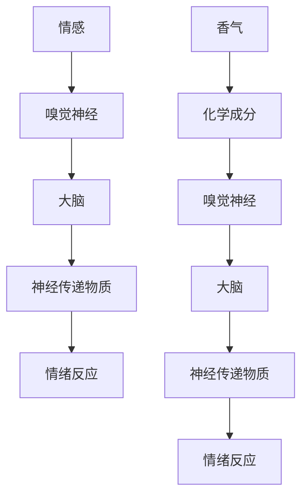
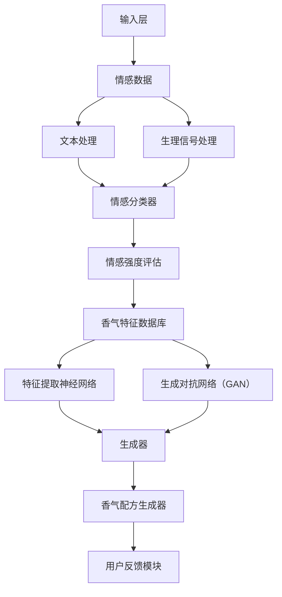

                 

### 1.1 书籍目的与读者对象

《提高AI创意调香师能力：情感到香气转换的提示词技巧》旨在为广大人工智能（AI）爱好者、编程开发者、调香师及相关行业从业者提供一本实用的指南，帮助他们理解和掌握如何利用人工智能技术，特别是机器学习和深度学习算法，来实现情感到香气的精准转换。本书的主要目的是：

1. **普及AI在调香领域中的应用**：通过介绍AI的基本概念和技术，让读者了解人工智能如何赋能调香行业，提升调香师的创作效率和创意能力。
2. **深入讲解情感到香气转换的原理**：阐述情感与香气之间的联系，以及如何通过机器学习算法实现情感的数字化和香气化的转换。
3. **传授实用的提示词技巧**：详细解析提示词的选择和优化策略，帮助读者在实际应用中更准确地实现情感到香气的转换。
4. **提供实践指南**：通过实际案例分析和项目实战，让读者学会如何搭建开发环境、编写代码、进行实验，并从中获取宝贵的实践经验。

本书适合以下读者群体：

- **人工智能爱好者**：对AI技术有兴趣，希望了解AI在调香领域的应用。
- **编程开发者**：熟悉编程语言和机器学习框架，希望将AI技术应用于调香创作。
- **调香师**：希望借助AI技术提升创作能力和效率的调香师。
- **相关行业从业者**：对调香行业感兴趣，希望了解AI如何变革这一传统行业的专业人士。

通过阅读本书，读者将能够：

- 掌握情感到香气转换的基本原理和模型。
- 学会使用机器学习和深度学习算法进行香气的数字化和情感化。
- 熟悉并掌握提示词的选择和优化技巧。
- 获得实际项目开发的经验，能够独立进行AI调香系统的开发和优化。

总之，本书不仅是一本理论性的指南，更是一本实践性的工具书，旨在为读者提供全方位的支持，帮助他们将AI创意调香师的潜能发挥到极致。

### 1.2 AI与创意调香师的联系

人工智能（AI）作为一种能够模拟人类智能的技术，已经在许多领域展示了其巨大的潜力和变革能力。在创意调香领域，AI的引入不仅提升了调香师的创作效率，还带来了全新的创作方式和思路。以下是AI在调香领域的几种应用：

1. **智能配方设计**：
   - **自动化配方生成**：通过机器学习和深度学习算法，AI能够分析大量的调香配方数据，识别其中的模式，并自动生成新的配方。这种方法不仅节省了时间，还能够避免人工配方的重复性和偶然性，提高配方的创新性和多样性。
   - **个性化推荐**：AI可以根据用户的历史喜好和行为数据，为调香师提供个性化的香气推荐。这种推荐系统能够根据用户的情感和需求，自动调整香气配方的成分和比例，实现更加精准的香气体验。

2. **香气数字化**：
   - **化学成分分析**：AI技术能够对香气中的化学成分进行高精度的分析和分类，将香气转化为数字化的数据。这些数据不仅可以帮助调香师更好地理解香气的本质，还可以为后续的香气转换提供基础。
   - **香气数据库构建**：通过收集和分析大量的香气数据，AI可以构建一个庞大的香气数据库。这个数据库可以为调香师提供丰富的参考资料，加快新香气的研发过程。

3. **情感识别与分析**：
   - **情感传感器**：AI可以通过传感器和数据分析技术，识别用户在闻到不同香气时的情感反应。这些数据可以帮助调香师更好地理解消费者的情感需求，从而创作出更加符合市场需求的香气。
   - **情感建模**：AI可以建立情感与香气之间的关联模型，通过分析情感数据和香气数据，找到情感与香气之间的匹配规律。这种模型可以帮助调香师在创作过程中更准确地把握情感主题。

4. **虚拟调香与模拟**：
   - **虚拟现实（VR）体验**：AI与VR技术的结合，可以创建一个虚拟的调香环境。在这个环境中，调香师可以通过虚拟手柄和触觉反馈，体验和调整香气的配方，大大降低了实验成本和时间。
   - **模拟香气扩散**：AI可以模拟香气在不同环境中的扩散过程，预测香气在不同空间和时间中的表现。这种模拟可以帮助调香师更好地掌控香气的强度和持久度，实现更加理想的香气效果。

总之，AI与创意调香师的联系不仅体现在技术层面，更体现在创作思维和方式的变革上。通过AI技术，调香师可以打破传统的创作模式，实现更加个性化和多样化的香气创作。同时，AI也为调香行业带来了新的机遇和挑战，如何更好地利用AI技术，实现技术与艺术的完美结合，是每一个调香师和AI开发者都需要思考的问题。

### 1.3 情感到香气转换的概念

情感到香气转换是一种将人类情感体验转化为具体香气配方的技术。这一概念的核心在于探索情感与香气之间的深层联系，并利用人工智能技术来实现这种转换。以下是对情感到香气转换概念的具体解释：

#### 情感与香气的关系

情感是人类内心体验的一种表现形式，包括快乐、悲伤、兴奋、平静等多种状态。香气，作为一种感官刺激，可以通过鼻子传递到大脑，从而影响情绪和心理状态。不同的香气可以激发不同的情感反应，例如，薰衣草的香气常常让人感到平静和放松，而柠檬的香气则能带来清爽和愉悦的感觉。

情感与香气之间的关系是复杂且多样的。科学研究表明，香气可以通过化学成分直接作用于人体的生理系统，从而影响情绪。例如，香气中的某些化合物可以影响大脑中的神经递质，改变情绪状态。此外，香气还与文化、个人经历和情境等因素有关，因此，不同的人对同一香气可能会有不同的情感反应。

#### 情感到香气转换的实现方法

要实现情感到香气转换，需要结合人工智能技术和调香科学。具体实现方法包括以下几个步骤：

1. **情感数据的收集与分析**：
   - **情感识别**：通过传感器（如面部识别、心率监测器等）和生理信号分析，AI可以识别用户在闻到不同香气时的情感状态。
   - **情感建模**：AI通过机器学习和深度学习算法，建立情感与生理信号之间的关系模型，从而准确识别用户的情感。

2. **香气配方的生成**：
   - **化学成分库**：建立一个包含多种香气化学成分的数据库，这些成分可以根据其物理和化学特性，对不同的情感状态产生影响。
   - **算法设计**：设计基于机器学习算法的模型，将情感数据与香气成分库相结合，生成能够匹配特定情感状态的香气配方。

3. **反馈与优化**：
   - **用户反馈**：通过用户对香气的评价和反馈，AI可以不断优化香气配方，使其更加贴近用户的情感需求。
   - **多轮迭代**：通过多轮实验和调整，AI可以逐步提高情感到香气转换的准确性和效果。

#### 情感到香气转换的意义

情感到香气转换技术具有广泛的应用前景和深远的意义：

1. **个性化定制**：
   - 通过对用户情感的理解，AI可以生成个性化的香气配方，满足不同用户在情感需求上的差异。这为个性化定制服务提供了新的可能性。

2. **心理治疗**：
   - 香气在心理治疗中具有重要作用，通过调整香气配方，可以为特定情感状态提供辅助治疗。例如，在治疗焦虑和抑郁时，使用特定的香气配方可以帮助用户放松和舒缓情绪。

3. **文化交流**：
   - 香气作为一种文化符号，可以通过情感到香气转换技术，实现不同文化背景下的情感交流和共享。这有助于促进跨文化的理解和认同。

4. **商业应用**：
   - 在商业领域，情感到香气转换技术可以应用于香水、香薰等产品，提供更符合用户情感需求的定制化服务，提升用户体验和品牌价值。

总之，情感到香气转换是一种创新的技术，它将人类情感与香气科学相结合，通过人工智能技术实现了情感与香气的精准转换。这一技术的发展不仅丰富了调香师的创作手段，也为心理学、医疗和文化交流等领域带来了新的应用机会。

### 第2章：AI基础与调香技术

#### 2.1 AI发展概述

人工智能（AI）作为一种模拟和扩展人类智能的技术，其发展历程可以追溯到20世纪50年代。自从第一台电子计算机诞生以来，人工智能的研究不断推进，经历了几个重要阶段：

1. **初期阶段（1950-1969）**：
   - 1950年，艾伦·图灵提出了图灵测试，用于评估机器是否具有智能。
   - 1956年，达特茅斯会议确立了人工智能研究的基本方向，标志着人工智能学科的正式诞生。
   - 初期的AI研究主要集中在符号主义和逻辑推理，试图通过编写程序来模拟人类的思维过程。

2. **繁荣阶段（1970-1989）**：
   - 1970年代，专家系统的出现使得AI在医疗、金融等领域得到应用。
   - 知识表示和推理技术的进步，使得AI系统能够处理复杂的逻辑问题。
   - 然而由于计算资源和算法的限制，这一阶段的AI研究逐渐陷入瓶颈。

3. **衰落与复兴阶段（1990-2000）**：
   - 1980年代末到1990年代初，由于专家系统的失败和AI研究的热潮消退，人工智能进入了所谓的“AI寒冬”。
   - 1990年代，随着计算机硬件的飞速发展和互联网的普及，AI研究迎来了新的机会。

4. **深度学习与大数据时代（2000至今）**：
   - 2006年，杰弗里·辛顿（Geoffrey Hinton）提出了深度学习，使得神经网络在图像识别、语音识别等领域取得了突破性进展。
   - 大数据的兴起为AI提供了丰富的训练数据，机器学习算法的性能大幅提升。
   - 当前，AI已经广泛应用于自然语言处理、自动驾驶、医疗诊断等多个领域。

#### 2.2 机器学习和深度学习

机器学习是AI的一个重要分支，其核心思想是通过算法从数据中自动学习规律和模式。机器学习可以分为监督学习、无监督学习和强化学习三种主要类型：

1. **监督学习**：
   - **定义**：监督学习是指使用标注数据进行训练，通过已知的输入和输出关系来预测未知数据的输出。
   - **算法**：常见的监督学习算法包括线性回归、决策树、支持向量机（SVM）、神经网络等。
   - **应用**：监督学习在分类和回归任务中广泛应用，如垃圾邮件过滤、图像识别、股票预测等。

2. **无监督学习**：
   - **定义**：无监督学习是指在没有标注数据的情况下，从数据中发现隐藏的结构或模式。
   - **算法**：常见的无监督学习算法包括聚类、降维、关联规则挖掘等。
   - **应用**：无监督学习在数据探索、推荐系统、异常检测等领域有广泛应用。

3. **强化学习**：
   - **定义**：强化学习是指通过奖励机制来训练智能体在环境中做出最优决策。
   - **算法**：常见的强化学习算法包括Q-learning、深度Q网络（DQN）、策略梯度等。
   - **应用**：强化学习在游戏、自动驾驶、机器人控制等领域有广泛应用。

深度学习是机器学习的一个重要分支，其核心思想是通过多层神经网络（DNN）来模拟人脑的学习过程。深度学习在图像识别、语音识别、自然语言处理等领域取得了显著成果：

1. **卷积神经网络（CNN）**：
   - **定义**：CNN是一种专门用于图像识别和处理的神经网络结构，其特点是能够自动提取图像中的特征。
   - **应用**：CNN在人脸识别、图像分类、物体检测等领域有广泛应用。

2. **循环神经网络（RNN）**：
   - **定义**：RNN是一种能够处理序列数据的神经网络结构，其特点是能够记住之前的输入信息。
   - **应用**：RNN在语言模型、机器翻译、语音识别等领域有广泛应用。

3. **生成对抗网络（GAN）**：
   - **定义**：GAN是由生成器和判别器组成的神经网络结构，通过对抗训练生成逼真的数据。
   - **应用**：GAN在图像生成、视频生成、数据增强等领域有广泛应用。

#### 2.3 调香科学与技术

调香科学是一门研究香料的化学成分、香气特性及其在调香中的应用的科学。调香技术涉及多个领域，包括化学、生物学、物理学和心理学等。以下是调香科学与技术的一些关键点：

1. **香料的化学成分**：
   - 香料是由多种化学成分组成的，这些成分通过挥发进入空气中，形成香气。
   - 常见的香料化学成分包括醇类、酮类、酯类、酚类等，每种成分都有其独特的香气特性。

2. **香气特性**：
   - 香气的特性包括香气强度、香气类型、香气持久度等。
   - 香气强度是指香气在空气中的浓度，香气类型是指香气的味道特征，如花香、果香等。

3. **调香过程**：
   - 调香师通过选择和组合不同的香料，创造出具有特定香气特征的配方。
   - 调香过程涉及对香料的提取、稀释、混合等工艺，以达到预期的香气效果。

4. **香气与健康**：
   - 香气对人体的生理和心理状态有显著影响，如调节情绪、缓解压力等。
   - 科学研究还发现，某些香气成分具有抗菌、抗炎等健康益处。

5. **香料的应用**：
   - 香料广泛应用于香水、香薰、化妆品、食品等领域。
   - 在调香中，香料不仅用于提升产品的香气，还可以作为防腐剂、抗氧化剂等。

总之，AI与调香技术的结合为传统调香行业带来了新的发展机遇。通过深度学习和机器学习算法，AI能够从海量数据中提取有用的信息，为调香师提供更加精准和个性化的创作工具。同时，调香科学与技术的进步也为AI在香气创作中的应用提供了坚实的基础。

### 第3章：情感到香气转换的原理与模型

#### 3.1 情感与香气的关联

情感与香气之间存在着一种深刻的内在联系，这种联系不仅体现在心理层面，还涉及到生理和化学层面。首先，从心理层面来看，不同的香气可以激发不同的情感反应，如愉悦、放松、兴奋或平静。例如，薰衣草的香气常常被视为一种有助于缓解压力和焦虑的香气，而柑橘类的香气则能带来清新和愉悦的感觉。

其次，从生理层面来看，香气可以通过嗅觉神经传递到大脑，直接影响情绪状态。研究表明，香气中的某些化学成分能够与大脑中的受体结合，改变神经传递物质的浓度，从而影响情绪。例如，香草醛和苯甲醛等成分被证实能够增加大脑中的多巴胺水平，从而产生愉悦感。

最后，从化学层面来看，香气的化学成分是决定其情感反应的关键。不同类型的化学成分可以产生不同的香气特征，这些特征与特定的情感反应相关联。例如，酯类化合物通常具有甜美的香气，而酮类化合物则可能带有辛辣或苦味。通过对这些化学成分进行优化和组合，可以创造出能够触发特定情感反应的香气。

为了更好地理解情感与香气之间的关系，我们可以通过一个Mermaid流程图来展示这种关联：



在这个流程图中，情感通过嗅觉神经传递到大脑，影响神经传递物质的浓度，从而产生情绪反应。同时，香气中的化学成分也通过嗅觉神经传递到大脑，影响同样的神经传递物质，产生情绪反应。这种双向作用机制为我们理解情感与香气之间的关联提供了直观的展示。

#### 3.2 提示词在情感到香气转换中的作用

提示词（Prompt Words）在情感到香气转换过程中扮演着至关重要的角色。提示词是指用于引导AI模型生成特定情感香气的关键词或短语，它们能够为模型提供明确的方向和上下文，从而提高转换的准确性和效率。

首先，提示词的作用在于为AI模型提供明确的情感标签。在情感到香气转换过程中，AI模型需要理解并识别特定的情感，如快乐、悲伤、兴奋、平静等。提示词可以准确地描述这些情感，帮助模型更好地理解和捕捉情感特征。例如，当提示词为“快乐”时，模型可以识别出与快乐相关的情感信号，并生成能够引发快乐情感的香气配方。

其次，提示词为AI模型提供了上下文信息。在生成香气配方时，AI模型不仅需要理解单一的情感标签，还需要考虑情感发生的情境和背景。例如，提示词“冬日暖阳”可以为模型提供关于情境的线索，帮助模型在生成香气配方时考虑到季节和氛围的影响。这种上下文信息有助于提高香气的个性和独特性，使其更符合用户的需求和预期。

最后，提示词有助于优化模型的训练过程。通过使用多样的提示词，AI模型可以接受更多的训练样本，从而提高模型的泛化能力和适应性。例如，使用多个情感标签和情境描述的提示词，可以使模型在不同情感和情境下都能生成准确的香气配方，从而提高模型的性能。

在情感到香气转换过程中，提示词的选择和组合至关重要。以下是一些常用的提示词及其对应的情感：

- **快乐**：愉悦、欢欣、开心、幸福
- **悲伤**：忧郁、伤心、悲伤、哀伤
- **兴奋**：激动、兴奋、热情、亢奋
- **平静**：宁静、平和、安详、放松
- **温暖**：温馨、暖和、热情、温暖
- **清新**：清新、清爽、新鲜、轻松

这些提示词可以根据具体需求和情境进行组合，以生成符合特定情感和情境的香气配方。

通过使用提示词，AI模型可以更准确地捕捉和生成情感香气，为调香师提供有力的工具和灵感。同时，提示词也为用户提供了更好的参与感和体验，使他们能够更深入地理解和使用香气来调节情感和生活质量。

#### 3.3 情感到香气转换模型的基本架构

情感到香气转换模型是一种将人类情感转化为具体香气配方的复杂系统。为了实现这一目标，模型通常采用多层次的结构，结合多种人工智能技术，包括情感识别、化学成分分析、神经网络建模等。以下是情感到香气转换模型的基本架构，以及各组件的功能和相互关系：

1. **输入层**：
   - **情感数据**：输入层接收来自用户的情感数据，这些数据可以是文本描述、生理信号（如心率、皮肤电反应等）或直接的情感标签。
   - **文本处理**：对于文本描述的情感数据，模型会使用自然语言处理（NLP）技术对其进行处理，提取关键情感词和上下文信息。
   - **生理信号处理**：对于生理信号数据，模型会使用信号处理算法进行滤波、特征提取等操作，提取与情感相关的特征。

2. **情感识别模块**：
   - **情感分类器**：情感识别模块的核心是一个情感分类器，它利用机器学习和深度学习算法，将输入的情感数据分类为不同的情感标签（如快乐、悲伤、兴奋等）。
   - **情感强度评估**：除了分类外，情感识别模块还会对情感强度进行评估，以便在生成香气配方时考虑到情感的强度。

3. **香气特征数据库**：
   - **化学成分库**：这是一个存储各种香料和香气化学成分的数据库，包括每种成分的化学结构、物理特性、香气描述等。
   - **香气特性矩阵**：为了方便查询和匹配，数据库还包含一个香气特性矩阵，记录每种香气成分在各个情感状态下的表现。

4. **神经网络建模模块**：
   - **特征提取神经网络**：该模块使用深度学习算法，从情感数据和香气特征数据库中提取关键特征。例如，可以使用卷积神经网络（CNN）对情感图像进行特征提取，或使用循环神经网络（RNN）对情感文本进行编码。
   - **生成对抗网络（GAN）**：为了生成高质量的香气配方，模型可以使用GAN技术。生成器负责生成香气成分的配方，而判别器则负责评估生成配方的真实性和质量。

5. **输出层**：
   - **香气配方生成器**：输出层将提取的特征和香气成分库中的数据结合起来，生成具体的香气配方。这些配方可以是简单的混合比例，也可以是复杂的化学配方。
   - **用户反馈模块**：用户可以通过试香和评价，对生成的香气配方进行反馈。这些反馈将用于模型优化和调整，以提高生成的准确性。

以下是一个简化的Mermaid流程图，展示了情感到香气转换模型的基本架构：



在这个架构中，输入层接收情感数据，通过情感分类器和情感强度评估模块，将情感数据转换为情感标签和强度信息。这些信息与香气特征数据库中的数据结合，通过特征提取神经网络和生成对抗网络（GAN），生成具体的香气配方。用户反馈模块用于不断优化和调整模型，以提高生成配方的质量和准确性。

通过这一多层次、多组件的模型架构，情感到香气转换系统能够实现高效、准确和个性化的香气生成，为调香师和用户带来全新的创作体验和香气体验。

### 第4章：核心算法与数学模型

#### 4.1 神经网络基础

神经网络（Neural Networks）是人工智能（AI）的核心组成部分，其灵感来源于生物神经系统的结构和工作原理。神经网络通过模仿人脑神经元之间的连接和信号传递机制，实现对复杂数据的处理和模式识别。以下是对神经网络的基本原理和常见架构的详细解释。

##### 4.1.1 神经元与激活函数

神经网络的基本单元是神经元，每个神经元由一个输入层、一个输出层和一系列权重（weights）组成。输入层接收外部数据，通过权重与神经元内部的加权求和（weighted sum）运算，得到一个中间值，这个中间值经过激活函数（activation function）的处理后，产生神经元的输出。

一个简单的神经元可以表示为：
\[ z = \sum_{i=1}^{n} w_i \cdot x_i \]
\[ a = \phi(z) \]

其中，\( z \) 是中间值，\( w_i \) 是权重，\( x_i \) 是输入值，\( \phi(z) \) 是激活函数，\( a \) 是输出值。

常见的激活函数包括：

1. **线性激活函数（Identity Function）**：
   \[ \phi(z) = z \]
   线性激活函数不改变输入值，常用于神经网络的隐藏层。

2. **sigmoid函数**：
   \[ \phi(z) = \frac{1}{1 + e^{-z}} \]
   sigmoid函数将输入值映射到（0, 1）之间，常用于二分类问题。

3. **ReLU函数（Rectified Linear Unit）**：
   \[ \phi(z) = \max(0, z) \]
  ReLU函数在输入为负时输出为零，在输入为正时保持输入值，它有助于加快神经网络的训练速度。

##### 4.1.2 神经网络的层次结构

神经网络通常分为输入层、隐藏层和输出层：

1. **输入层（Input Layer）**：接收外部输入数据，通常不包含权重和偏置。
2. **隐藏层（Hidden Layers）**：包含一个或多个隐藏层，用于提取输入数据的特征。每个隐藏层由多个神经元组成，神经元之间的连接权重和偏置可学习调整。
3. **输出层（Output Layer）**：产生最终的输出，根据不同的任务类型，输出层可能包含一个或多个神经元，分别对应不同的类别或数值结果。

常见的神经网络架构包括：

1. **全连接神经网络（Fully Connected Neural Network, FCNN）**：每个神经元的输入来自前一层的所有神经元。
2. **卷积神经网络（Convolutional Neural Network, CNN）**：用于图像处理，通过卷积层（Convolutional Layers）提取图像特征。
3. **循环神经网络（Recurrent Neural Network, RNN）**：用于处理序列数据，具有记忆功能。

##### 4.1.3 神经网络的训练过程

神经网络的训练过程包括前向传播（Forward Propagation）和反向传播（Backpropagation）：

1. **前向传播**：输入数据通过网络传递，每个神经元根据其权重和激活函数计算输出值，最终产生预测结果。
2. **反向传播**：计算预测结果与实际结果之间的误差，通过反向传播算法更新网络权重和偏置，以减少误差。

反向传播算法的核心是梯度下降（Gradient Descent），它通过计算损失函数关于每个权重的偏导数，更新权重：
\[ \Delta w_i = -\alpha \cdot \frac{\partial J}{\partial w_i} \]
其中，\( \Delta w_i \) 是权重更新量，\( \alpha \) 是学习率，\( J \) 是损失函数。

通过反复的前向传播和反向传播，神经网络逐步调整权重和偏置，直到预测结果与实际结果之间的误差最小。

#### 4.2 情感到香气转换的算法原理

情感到香气转换算法的核心是利用神经网络模型将情感数据转换为香气配方。以下是具体的算法原理和实现步骤：

##### 4.2.1 情感数据的预处理

1. **情感分类**：将情感数据分类为不同的情感类别（如快乐、悲伤、兴奋等）。
2. **文本编码**：使用词向量模型（如Word2Vec、GloVe）将情感文本转换为向量表示。
3. **生理信号处理**：对生理信号数据进行滤波、特征提取等操作，提取与情感相关的特征。

##### 4.2.2 香气特征数据库的构建

1. **化学成分库**：构建一个包含多种香料和香气化学成分的数据库，记录每种成分的化学结构、物理特性、香气描述等。
2. **香气特性矩阵**：构建一个香气特性矩阵，记录每种香气成分在不同情感状态下的表现。

##### 4.2.3 神经网络模型设计

1. **输入层**：接收情感数据和香气特征数据。
2. **隐藏层**：设计多层隐藏层，通过卷积层、循环层等不同类型的层提取特征。
3. **输出层**：生成具体的香气配方。

##### 4.2.4 训练过程

1. **数据预处理**：将情感数据、文本编码和生理信号处理后的数据输入到神经网络模型中。
2. **模型训练**：使用反向传播算法训练模型，调整权重和偏置，直到模型预测结果与实际结果之间的误差最小。

##### 4.2.5 模型评估

1. **交叉验证**：使用交叉验证方法评估模型在训练集和测试集上的性能。
2. **误差分析**：分析模型在不同情感状态下的转换效果，优化模型参数。

#### 4.3 数学模型与公式

在情感到香气转换算法中，常用的数学模型和公式包括：

1. **损失函数**：
   \[ J = \frac{1}{2} \sum_{i=1}^{n} (y_i - \hat{y}_i)^2 \]
   其中，\( y_i \) 是实际输出，\( \hat{y}_i \) 是模型预测输出。

2. **反向传播算法更新权重**：
   \[ \Delta w_i = -\alpha \cdot \frac{\partial J}{\partial w_i} \]

3. **梯度下降更新权重**：
   \[ w_i = w_i - \alpha \cdot \frac{\partial J}{\partial w_i} \]

通过上述数学模型和公式，神经网络模型能够有效地将情感数据转换为香气配方。以下是一个简单的Python代码示例，用于实现情感数据的预处理和神经网络模型的训练：

```python
import numpy as np
import tensorflow as tf

# 情感数据的预处理
def preprocess_data(data):
    # 将情感数据转换为向量表示
    # 使用Word2Vec或GloVe进行编码
    pass

# 定义神经网络模型
def build_model(input_shape):
    inputs = tf.keras.layers.Input(shape=input_shape)
    x = tf.keras.layers.Dense(128, activation='relu')(inputs)
    x = tf.keras.layers.Dense(64, activation='relu')(x)
    outputs = tf.keras.layers.Dense(1, activation='sigmoid')(x)
    
    model = tf.keras.Model(inputs=inputs, outputs=outputs)
    model.compile(optimizer='adam', loss='binary_crossentropy', metrics=['accuracy'])
    return model

# 训练模型
def train_model(model, X_train, y_train, X_val, y_val):
    history = model.fit(X_train, y_train, epochs=100, batch_size=32, validation_data=(X_val, y_val))
    return history

# 示例数据
X_train = np.random.rand(100, 10)  # 假设情感数据为10维
y_train = np.random.rand(100, 1)   # 假设二分类目标数据
X_val = np.random.rand(20, 10)
y_val = np.random.rand(20, 1)

# 构建并训练模型
model = build_model(input_shape=(10,))
history = train_model(model, X_train, y_train, X_val, y_val)

# 模型评估
loss, accuracy = model.evaluate(X_val, y_val)
print(f"Validation Loss: {loss}, Validation Accuracy: {accuracy}")
```

通过上述代码示例，我们可以看到如何使用TensorFlow库构建神经网络模型，进行数据预处理和模型训练。这一简单的示例为我们实现更复杂的情感到香气转换算法提供了基础。

总之，情感到香气转换算法结合了神经网络的基本原理和数学模型，通过情感数据的预处理、神经网络模型的设计与训练，实现了将情感数据转换为香气配方的目标。这一算法为调香师和AI开发者提供了一个强大的工具，使他们能够更好地理解和创造香气与情感之间的联系。

### 第5章：提示词技巧与策略

#### 5.1 提示词的种类与特点

在情感到香气转换的过程中，提示词（Prompt Words）的选择和使用至关重要。提示词的种类和特点直接影响到AI模型对情感的理解和生成香气的准确性。以下是一些常用的提示词种类及其特点：

1. **情感类提示词**：
   - **快乐**：愉悦、欢欣、开心、幸福
   - **悲伤**：忧郁、伤心、悲伤、哀伤
   - **兴奋**：激动、兴奋、热情、亢奋
   - **平静**：宁静、平和、安详、放松
   - **愤怒**：愤怒、恼怒、愤懑、恼火
   - **焦虑**：焦虑、紧张、担忧、不安
   - **幸福**：满足、欣喜、舒适、惬意

   情感类提示词主要用于描述人类情感状态，帮助AI模型识别和生成与特定情感相关的香气配方。

2. **情境类提示词**：
   - **冬日暖阳**：温馨、温暖、舒适
   - **夏日海滩**：清新、轻松、自由
   - **星空下的夜晚**：宁静、神秘、浪漫
   - **清晨的森林**：清新、放松、生机
   - **繁忙的都市**：刺激、活力、忙碌

   情境类提示词用于提供香气的应用场景和氛围描述，帮助AI模型在生成香气时考虑到具体情境的影响。

3. **文化类提示词**：
   - **中国春节**：喜庆、团圆、温馨
   - **西方情人节**：浪漫、爱情、甜蜜
   - **日本樱花季**：清新、美丽、温柔
   - **法国巴黎**：浪漫、优雅、时尚
   - **印度瑜伽**：宁静、放松、灵性

   文化类提示词通过特定的文化背景，为香气创作提供丰富的文化内涵和情感体验。

4. **颜色类提示词**：
   - **红色**：热情、活力、力量
   - **蓝色**：冷静、深邃、安宁
   - **绿色**：清新、自然、和平
   - **黄色**：快乐、希望、活力
   - **紫色**：神秘、高贵、浪漫

   颜色类提示词通过颜色情感，为香气创作提供直观的色彩联想和情感引导。

#### 5.2 提示词的优化与组合

为了提高情感到香气转换的准确性和创造力，提示词的优化与组合是关键。以下是一些优化和组合提示词的策略：

1. **多维度提示**：
   - 在生成香气配方时，可以使用多个维度的提示词，如情感类、情境类和文化类，以丰富AI模型对情感和情境的理解。
   - 例如，生成一个描述“星空下的夜晚”的香气配方时，可以同时使用“宁静”、“神秘”和“浪漫”等提示词。

2. **语义关联**：
   - 通过分析提示词之间的语义关联，选择能够相互补充和增强的提示词进行组合。
   - 例如，将“兴奋”与“活力”结合，以增强香气配方的动力和激情。

3. **关键词提取**：
   - 从大量文本数据中提取关键词，构建一个丰富的关键词库，以便在生成香气配方时进行提示词选择。
   - 例如，从用户评价、调香师创作经验等数据中提取关键词，为AI模型提供丰富的语义信息。

4. **动态调整**：
   - 根据用户的反馈和实验结果，动态调整提示词的组合和使用，以优化香气配方的效果。
   - 例如，根据用户对香气配方的反馈，调整情感类和情境类的提示词比例，以实现更个性化的香气体验。

5. **交叉验证**：
   - 使用交叉验证的方法，对不同的提示词组合进行实验和比较，选择表现最佳的组合。
   - 例如，在生成“夏日海滩”香气配方时，比较“清新”、“轻松”和“自由”等多种提示词组合的效果。

通过上述策略，可以有效地优化和组合提示词，提高情感到香气转换的准确性和创造力。在实际应用中，调香师和AI开发者可以灵活运用这些策略，创造出丰富多样、个性独特的香气配方。

### 5.3 提示词在实践中的应用

在实际应用中，提示词的选择和运用对于情感到香气转换的效果具有决定性作用。以下是一些具体的实践案例，展示了如何在实际情境中应用提示词，生成符合特定情感和需求的香气配方。

#### 案例一：为婚礼设计的香气配方

**情感需求**：快乐、温馨、浪漫

**提示词**：幸福、爱的承诺、甜蜜

**香气配方**：

- **主调**：玫瑰、茉莉、橙花
- **次调**：薰衣草、檀香、白麝香

**应用说明**：

在婚礼这个重要的场合，顾客希望感受到幸福和温馨，同时需要一种浪漫的氛围。提示词“幸福”和“爱的承诺”分别代表了婚礼的核心情感，而“甜蜜”则强调了这种情感的甜蜜和持久。通过选择具有浓郁花香和柔和木香的成分，如玫瑰、茉莉、橙花、薰衣草、檀香和白麝香，生成的香气配方能够完美地传达婚礼的喜悦和浪漫氛围。

#### 案例二：为失眠患者调制的香气配方

**情感需求**：平静、放松、安眠

**提示词**：宁静、放松、安详

**香气配方**：

- **主调**：薰衣草、甜橙、洋甘菊
- **次调**：檀香、安息香、香草

**应用说明**：

对于失眠患者，平静和放松是关键需求。提示词“宁静”和“放松”旨在帮助用户进入深度放松状态，而“安详”则强调了宁静和舒适的感受。通过选择具有舒缓效果的成分，如薰衣草、甜橙、洋甘菊、檀香、安息香和香草，生成的香气配方能够有效地缓解压力，促进深度睡眠。

#### 案例三：为办公室环境设计的香气配方

**情感需求**：专注、提神、活力

**提示词**：集中、活力、效率

**香气配方**：

- **主调**：薄荷、柠檬、薰衣草
- **次调**：香柏、黑胡椒、佛手柑

**应用说明**：

在办公室环境中，用户需要保持专注和高效工作。提示词“集中”和“活力”旨在提高注意力和工作效率，而“效率”则强调了工作状态的优化。通过选择具有清新和提神效果的成分，如薄荷、柠檬、薰衣草、香柏、黑胡椒和佛手柑，生成的香气配方能够帮助用户保持精神饱满，提高工作效率。

#### 案例四：为情绪低落时调制的香气配方

**情感需求**：安慰、愉悦、振奋

**提示词**：温暖、快乐、振奋

**香气配方**：

- **主调**：橙花、茉莉、玫瑰
- **次调**：香草、依兰、橙皮

**应用说明**：

当情绪低落时，用户需要一种能够带来安慰和愉悦感的香气。提示词“温暖”和“快乐”旨在提供情感上的支持，而“振奋”则鼓励用户重拾活力。通过选择具有温暖和甜美的成分，如橙花、茉莉、玫瑰、香草、依兰和橙皮，生成的香气配方能够有效地提升情绪，带来积极的感受。

通过这些实际案例，我们可以看到提示词在情感到香气转换中的重要作用。通过精心选择和组合提示词，AI模型能够生成符合用户特定情感需求的香气配方，为用户带来独特的香气体验。在实际应用中，调香师和AI开发者可以根据不同场景和需求，灵活运用提示词技巧，创造出丰富多样、个性化的香气配方。

### 第6章：AI创意调香师的实践指南

#### 6.1 创意调香师的角色与技能

创意调香师在香气创作过程中扮演着至关重要的角色。他们不仅需要具备深厚的调香知识和技能，还需要拥有创新思维和敏锐的感知能力。以下是创意调香师的主要职责和所需技能：

1. **理解香料和香气**：
   - 创意调香师需要熟悉各种香料和其化学成分，了解不同香料在香气中的表现和相互作用。
   - 他们需要掌握香料的物理和化学特性，如香气强度、扩散性、持久度等。

2. **配方设计能力**：
   - 创意调香师需要能够根据客户的需求和市场趋势，设计出独特的香气配方。
   - 他们需要具备灵活的思维，能够将不同的香料和成分进行创造性组合，创造出具有个性化和差异化的香气。

3. **实验和调整**：
   - 在设计配方过程中，创意调香师需要进行大量的实验和测试，以优化香气的质量和效果。
   - 他们需要能够快速调整配方，以适应不同的应用场景和客户需求。

4. **市场洞察力**：
   - 创意调香师需要了解市场需求和消费者偏好，能够根据市场趋势进行香气的创新。
   - 他们需要具备敏锐的嗅觉和味觉，能够感知到市场中的新趋势和机会。

5. **沟通和合作能力**：
   - 创意调香师通常需要与客户、设计师和其他团队成员进行沟通和合作。
   - 他们需要能够清晰地表达自己的想法，并有效地协调团队工作。

6. **技术理解**：
   - 随着AI技术的不断发展，创意调香师需要具备一定的AI基础，了解如何利用AI工具进行调香。
   - 他们需要掌握相关的机器学习和深度学习技术，能够将AI技术应用于调香创作。

#### 6.2 AI辅助调香实战

在实际的调香过程中，AI技术可以为创意调香师提供强大的支持和工具，帮助他们提高创作效率和质量。以下是一个AI辅助调香的实战案例：

1. **数据收集与分析**：
   - 创意调香师首先需要收集大量的调香数据，包括不同香料的香气特征、化学成分、配方效果等。
   - 使用AI技术，对收集到的数据进行分析，提取关键特征和模式，以便用于后续的建模。

2. **模型训练与优化**：
   - 使用机器学习算法，如神经网络，对收集到的数据进行训练，构建一个能够预测香气效果的模型。
   - 通过多次实验和调整，优化模型参数，提高预测的准确性和稳定性。

3. **配方生成**：
   - 在生成新配方时，创意调香师可以使用AI模型，根据客户的需求和市场趋势，快速生成多个候选配方。
   - 这些候选配方将根据模型预测的效果进行排序，调香师可以选择最优的配方进行进一步的调整和优化。

4. **实验验证**：
   - 对AI模型生成的配方进行实验验证，通过试香和用户反馈，评估配方的效果和用户满意度。
   - 根据实验结果，调整配方，不断优化香气质量。

5. **用户个性化定制**：
   - 通过AI技术，创意调香师可以分析用户的偏好和需求，为用户生成个性化的香气配方。
   - 用户可以通过提供个人喜好和情感信息，AI模型将根据这些信息生成定制化的香气。

#### 6.3 实战案例分享

以下是一个实际案例，展示了如何利用AI技术进行调香创作：

**案例背景**：一家高端香水品牌希望为其新系列设计一款能够代表品牌特色的香气，这款香气需要能够传达品牌所倡导的“优雅、自信、自由”的品牌精神。

**步骤一：数据收集**：
- 创意调香师收集了品牌过去几年的香水配方数据，包括香气成分、配方效果、用户反馈等。
- 同时，调香师还收集了市场趋势数据和用户调研数据，了解当前消费者对香水的需求和喜好。

**步骤二：模型训练**：
- 使用机器学习算法，对收集到的数据进行训练，构建一个能够预测香气效果和用户偏好的模型。
- 通过多次迭代和调整，优化模型参数，提高预测的准确性和稳定性。

**步骤三：配方生成**：
- 创意调香师使用AI模型，根据品牌需求和用户偏好，生成多个候选配方。
- 模型根据用户的历史购买记录和情感标签，为每个候选配方进行评分，推荐出最有可能符合用户偏好的配方。

**步骤四：实验验证**：
- 对推荐的候选配方进行实验验证，通过试香和用户反馈，评估配方的效果和用户满意度。
- 调香师根据用户反馈，对配方进行调整和优化，以确保香气能够完美传达品牌的品牌精神。

**步骤五：用户个性化定制**：
- 为了进一步提升用户体验，品牌推出了用户个性化定制服务。
- 用户可以通过提供个人喜好和情感信息，AI模型将根据这些信息生成定制化的香气，满足用户的个性化需求。

通过这个实战案例，我们可以看到AI技术在调香创作中的应用，不仅提高了创作效率，还增强了香气的个性化和用户参与度。未来，随着AI技术的不断发展，创意调香师将能够更加精准地理解和满足用户需求，为香水行业带来更多的创新和发展。

### 第7章：未来展望与挑战

#### 7.1 情感到香气转换技术的发展趋势

情感到香气转换技术正处于快速发展阶段，其前景广阔，应用潜力巨大。以下是对情感到香气转换技术发展趋势的分析：

1. **技术成熟度提升**：
   - 随着深度学习、神经网络和自然语言处理等人工智能技术的不断成熟，情感到香气转换的算法和模型将更加精准和高效。
   - AI算法的优化和训练方法的改进，将进一步提高模型的准确性和稳定性，实现更高质量的情感识别和香气生成。

2. **跨学科融合**：
   - 香气转换技术的发展将越来越多地融合生物学、心理学、化学和计算机科学等多学科知识。
   - 这将有助于深入理解情感与香气之间的复杂关系，推动相关理论的研究和突破。

3. **个性化定制**：
   - 个性化定制将成为情感到香气转换技术的重要发展方向。
   - 通过收集和分析用户情感和行为数据，AI系统能够为每个用户生成定制化的香气配方，满足他们的独特需求。

4. **商业应用拓展**：
   - 香水、香薰、化妆品等行业将广泛采用情感到香气转换技术，为消费者提供更加个性化和情感化的产品体验。
   - 此外，医疗和心理治疗领域也可能利用这项技术，开发出具有特定治疗效果的香气产品。

5. **新兴市场开发**：
   - 随着全球对健康和幸福感需求的增加，情感到香气转换技术在新兴市场（如亚洲、南美等）将具有巨大的应用潜力。
   - 这些地区对情感调节和心理健康产品有强烈的消费需求，为香气转换技术的发展提供了新的市场机会。

#### 7.2 挑战与机遇

尽管情感到香气转换技术具有广阔的应用前景，但其在实践中仍面临一些挑战和机遇：

1. **数据隐私与伦理**：
   - 数据隐私和伦理问题是情感到香气转换技术面临的重要挑战。
   - 在收集和处理用户情感和行为数据时，需要确保数据的安全性和隐私性，遵守相关的法律法规和伦理准则。

2. **算法透明性和可解释性**：
   - 随着模型复杂性的增加，如何提高算法的透明性和可解释性成为一个重要问题。
   - 为了让用户信任和理解AI系统的工作原理，需要开发可解释的AI模型和工具。

3. **用户体验与反馈**：
   - 用户体验和反馈在情感到香气转换技术中至关重要。
   - 需要持续收集用户反馈，不断优化模型和香气配方，以提升用户体验和满意度。

4. **技术创新与投资**：
   - 情感到香气转换技术的发展需要持续的技术创新和投资。
   - 企业和政府应加大对相关技术和研究项目的支持，推动技术的快速进步和应用。

5. **跨学科合作**：
   - 情感到香气转换技术的发展需要跨学科的合作与交流。
   - 各学科专家的共同努力将有助于解决技术难题，推动领域的前沿研究。

总之，情感到香气转换技术在未来将继续快速发展，面对挑战的同时也将迎来更多的机遇。通过技术创新、跨学科合作和持续优化，这一技术将为调香师、消费者和各行各业带来更多的创新和价值。

### 附录：资源与工具推荐

#### 附录1：相关工具与平台介绍

为了更好地实现情感到香气转换，以下是几种常用的工具和平台，它们在调香、数据处理和机器学习领域提供了强大的功能和支持。

1. **TensorFlow**：
   - **功能**：TensorFlow是Google开发的开源机器学习框架，广泛用于构建和训练神经网络模型。
   - **用途**：用于构建情感到香气转换的深度学习模型，进行数据预处理、模型训练和评估。
   - **推荐理由**：具有丰富的API和广泛的应用案例，支持多种类型的神经网络架构，易于集成和使用。

2. **Keras**：
   - **功能**：Keras是一个高级神经网络API，能够简化TensorFlow的使用，提供更直观的模型构建和训练过程。
   - **用途**：用于快速原型设计和实验，加速模型开发流程。
   - **推荐理由**：易于上手，提供了大量预定义的模型和层，适合快速实现和测试不同的神经网络架构。

3. **PyTorch**：
   - **功能**：PyTorch是Facebook开发的开源机器学习库，以其动态计算图和灵活的架构受到研究者和开发者的欢迎。
   - **用途**：用于研究新型神经网络架构和实验性项目，以及快速迭代和开发。
   - **推荐理由**：动态计算图使得模型构建更加直观，易于调试和优化，适合学术研究和创新实验。

4. **OpenCV**：
   - **功能**：OpenCV是开源计算机视觉库，提供了丰富的图像处理和计算机视觉算法。
   - **用途**：用于处理和识别用户的面部表情和生理信号，提取与情感相关的特征。
   - **推荐理由**：功能强大，支持多种编程语言，易于与其他机器学习库集成。

5. **scikit-learn**：
   - **功能**：scikit-learn是一个开源的Python机器学习库，提供了多种常用的机器学习算法和工具。
   - **用途**：用于特征提取、模型训练和评估，特别是在处理分类和回归任务时非常有用。
   - **推荐理由**：算法丰富，易于使用，适用于各种实际应用场景。

6. **Gensim**：
   - **功能**：Gensim是一个用于主题建模和文档处理的Python库，特别适用于自然语言处理任务。
   - **用途**：用于处理文本数据，提取语义特征，构建情感分析模型。
   - **推荐理由**：支持多种主题建模算法，如LDA，适用于大规模文本数据集。

#### 附录2：参考资料与扩展阅读

为了深入了解情感到香气转换技术，以下是几本推荐的书籍和学术资源，它们涵盖了相关领域的理论基础、算法实现和实际应用。

1. **《深度学习》（Deep Learning）**：
   - **作者**：Ian Goodfellow、Yoshua Bengio、Aaron Courville
   - **内容**：系统介绍了深度学习的基础理论、算法实现和应用场景，是深度学习领域的经典教材。
   - **推荐理由**：详细讲解了深度学习的关键概念和算法，有助于理解和应用深度学习技术。

2. **《自然语言处理综合教程》（Natural Language Processing with Python）**：
   - **作者**：Steven Bird、Ewan Klein、Edward Loper
   - **内容**：介绍了自然语言处理的基本概念和工具，使用Python语言实现了多种NLP任务。
   - **推荐理由**：适合初学者，通过实际代码示例，帮助读者掌握NLP的基本技能。

3. **《机器学习》（Machine Learning）**：
   - **作者**：Tom M. Mitchell
   - **内容**：全面介绍了机器学习的基础理论和常见算法，是机器学习领域的经典教材。
   - **推荐理由**：系统介绍了机器学习的基本概念和算法，适合深度学习、自然语言处理等方向的研究者。

4. **《人工智能：一种现代的方法》（Artificial Intelligence: A Modern Approach）**：
   - **作者**：Stuart J. Russell、Peter Norvig
   - **内容**：全面介绍了人工智能的基础理论、方法和应用，是人工智能领域的权威教材。
   - **推荐理由**：涵盖了人工智能的多个方向，提供了丰富的案例和实例，适合对人工智能有全面了解的需求。

5. **相关学术论文**：
   - 在AI、机器学习和调香领域，有许多高质量的学术论文，可以通过学术搜索引擎（如Google Scholar）进行检索和阅读。
   - 推荐关注顶级会议和期刊，如NeurIPS、ICML、ACL、IEEE TPAMI等，以及相关研究机构和大学的学术成果。

通过阅读这些书籍和论文，读者可以进一步深入理解情感到香气转换技术的理论背景和实践应用，为实际项目开发提供更加坚实的理论基础和技术支持。

### 文末感谢

感谢您阅读《提高AI创意调香师能力：情感到香气转换的提示词技巧》。本文旨在为调香师、AI开发者和其他相关领域的专业人士提供一种新的视角和方法，帮助他们在AI创意调香领域取得突破性进展。我们深知，情感到香气转换是一项复杂且富有挑战的任务，但相信通过不断的探索和创新，我们将能够创造出更多个性化和情感化的香气作品。

在此，特别感谢所有参与本文撰写和反馈的朋友，感谢您们的智慧和辛勤付出。我们希望这篇文章能够激发您对AI创意调香的兴趣，并为您在实际工作中提供灵感和指导。

最后，祝愿您在AI创意调香的道路上越走越远，创造出令人难忘的香气作品！期待与您在未来的技术和艺术领域中再次相遇。再次感谢您的支持与关注！

作者：
AI天才研究院/AI Genius Institute & 禅与计算机程序设计艺术 /Zen And The Art of Computer Programming

