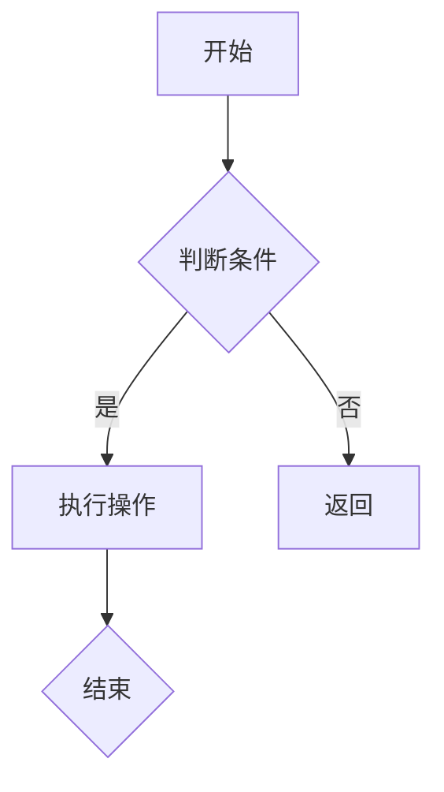

                 

### 提高AI创意香水原料选择：可持续采购的提示词技巧

> 关键词：人工智能，香水原料，可持续采购，提示词技巧，数据分析，机器学习

> 摘要：本文旨在探讨如何利用人工智能和大数据技术，提高香水原料的可持续采购效率。通过分析可持续采购的概念、原则和技巧，以及机器学习算法在香水原料选择中的应用，本文提供了一系列提高AI创意香水原料选择的实践方法，旨在为行业从业者提供有益的参考。

### 1. 引言

随着全球环保意识的提高，可持续发展已成为各行各业关注的核心议题。在香水行业，可持续采购已经成为企业社会责任的重要组成部分。然而，香水原料的采购涉及复杂的供应链网络和多样化的原材料，如何在保证产品质量的同时，实现可持续采购，成为了一个亟待解决的难题。人工智能（AI）技术的快速发展为解决这个问题提供了新的思路和可能性。

近年来，AI技术在各个领域都取得了显著的成果，尤其在数据分析、自然语言处理和机器学习等方面。这些技术的应用，不仅能够提高香水原料采购的效率，还能为企业提供更科学的决策依据。本文将围绕如何利用AI技术，特别是机器学习和数据分析的方法，来优化香水原料的可持续采购流程，提高企业的创新能力。

本文的结构如下：首先，我们将介绍可持续采购的概念和重要性；接着，讨论AI在香水原料选择中的应用；然后，探讨机器学习算法在香水原料采购中的具体应用；最后，通过实际案例展示如何应用这些技术，并提供一些最佳实践和注意事项。

### 2. 可持续采购的概念与重要性

可持续采购是一种采购策略，旨在确保采购活动不仅满足企业的经济利益，还符合社会和环境保护的要求。它强调在采购过程中，考虑原材料的来源、生产过程的环境影响、社会责任等因素。可持续采购的核心目标是实现经济效益、社会效益和环境效益的平衡。

在香水行业，可持续采购的重要性体现在以下几个方面：

**1. 提高品牌声誉**：随着消费者对环保和可持续发展的关注日益增加，企业通过实施可持续采购策略，能够提高品牌形象和市场竞争力。

**2. 降低采购风险**：通过可持续采购，企业可以确保供应链的稳定性和可靠性，减少因原材料短缺或质量问题导致的经营风险。

**3. 提高资源利用效率**：可持续采购鼓励企业选择环保、高效的原材料，有助于提高资源的利用效率，降低生产成本。

**4. 促进社会责任**：可持续采购体现了企业的社会责任，有助于提升员工的满意度和忠诚度，增强企业的社会责任形象。

然而，实施可持续采购也面临诸多挑战。首先，香水原料的来源多样，涉及全球多个国家和地区，信息获取难度较大。其次，可持续采购往往需要更高的成本投入，这对企业的财务状况提出了更高的要求。此外，如何在保证可持续性的同时，满足消费者的多样化需求，也是企业需要面对的难题。

### 3. AI在香水原料选择中的应用

AI技术，特别是机器学习和大数据分析，为香水原料的选择提供了强大的工具。以下是一些AI在香水原料选择中的应用场景：

**3.1 数据分析**

数据分析是AI在香水原料选择中的基础。通过收集和分析大量的历史采购数据、市场数据和供应商数据，企业可以识别出原料采购中的规律和趋势。例如，利用回归分析，企业可以预测不同原料的价格变动趋势；通过聚类分析，企业可以识别出最优质的原料供应商。

**3.2 自然语言处理**

自然语言处理（NLP）技术可以帮助企业处理大量的文本数据，如供应商报告、市场分析报告等。通过NLP技术，企业可以快速提取关键信息，如原料品质、价格波动、供应商信誉等。这些信息对于制定采购策略至关重要。

**3.3 机器学习算法**

机器学习算法在香水原料选择中具有广泛的应用。例如，分类算法可以帮助企业识别出不同类型的原料，并根据原料的特性进行分类管理；聚类算法可以帮助企业识别出相似性较高的原料，以便于进行集中采购；回归算法可以用于预测原料的价格变化，为企业提供决策支持。

### 4. 机器学习算法在香水原料采购中的具体应用

在本节中，我们将详细讨论几种常见的机器学习算法在香水原料采购中的应用，并通过Python代码示例来说明这些算法的基本原理和实现方法。

#### 4.1 分类算法

分类算法是机器学习中最常用的算法之一，它可以将数据集划分为预定义的类别。在香水原料采购中，分类算法可以帮助企业识别不同类型的原料，从而进行针对性的采购。

**4.1.1 逻辑回归**

逻辑回归是一种广泛应用于分类问题的算法，它通过建立输入特征和输出类别之间的线性关系，实现对数据的分类。以下是一个简单的逻辑回归分类算法的Python代码示例：

```python
from sklearn.linear_model import LogisticRegression
from sklearn.model_selection import train_test_split
from sklearn.metrics import accuracy_score

# 假设我们有一个包含原料特征和类别的数据集
X = ...  # 特征数据
y = ...  # 类别标签

# 数据集分割
X_train, X_test, y_train, y_test = train_test_split(X, y, test_size=0.2, random_state=42)

# 训练模型
model = LogisticRegression()
model.fit(X_train, y_train)

# 预测
predictions = model.predict(X_test)

# 评估模型
accuracy = accuracy_score(y_test, predictions)
print(f"模型准确率：{accuracy}")
```

#### 4.2 聚类算法

聚类算法可以将数据集中的数据点划分为若干个簇，使得同一个簇内的数据点彼此之间距离较近，而不同簇的数据点之间距离较远。在香水原料采购中，聚类算法可以帮助企业识别出相似性较高的原料，以便进行集中采购。

**4.2.1 K-means算法**

K-means算法是一种典型的聚类算法，它通过迭代计算来确定最优的簇数和每个簇的中心点。以下是一个简单的K-means算法的Python代码示例：

```python
from sklearn.cluster import KMeans
import numpy as np

# 假设我们有一个包含原料特征的数据集
X = ...

# 设置簇数
k = 3

# 训练模型
kmeans = KMeans(n_clusters=k, random_state=42)
kmeans.fit(X)

# 预测
clusters = kmeans.predict(X)

# 输出每个原料所属的簇
for i, cluster in enumerate(clusters):
    print(f"原料{i+1}所属簇：{cluster}")
```

#### 4.3 回归算法

回归算法用于预测连续的数值输出，如预测原料的价格。在香水原料采购中，回归算法可以帮助企业预测原料价格的波动，为企业制定采购策略提供参考。

**4.3.1 岭回归**

岭回归是一种常用的回归算法，它通过惩罚模型的系数来避免过拟合。以下是一个简单的岭回归算法的Python代码示例：

```python
from sklearn.linear_model import Ridge
from sklearn.model_selection import train_test_split
from sklearn.metrics import mean_squared_error

# 假设我们有一个包含原料特征和价格的数据集
X = ...  # 特征数据
y = ...  # 价格标签

# 数据集分割
X_train, X_test, y_train, y_test = train_test_split(X, y, test_size=0.2, random_state=42)

# 训练模型
model = Ridge(alpha=1.0)
model.fit(X_train, y_train)

# 预测
predictions = model.predict(X_test)

# 评估模型
mse = mean_squared_error(y_test, predictions)
print(f"模型均方误差：{mse}")
```

通过以上几个示例，我们可以看到机器学习算法在香水原料采购中的应用潜力。然而，这些算法的应用效果取决于数据的质量和特征提取的准确性。因此，在实际应用中，企业需要不断优化数据预处理和特征提取过程，以提高模型的预测精度。

### 5. 实际案例研究

在本节中，我们将通过一个实际案例，展示如何利用AI技术优化香水原料的采购流程，提高企业的创新能力。

**5.1 案例背景**

某知名香水品牌公司在进行香水原料采购时，面临着以下问题：

- 原料种类繁多，采购决策复杂。
- 市场价格波动较大，难以预测。
- 供应商数量众多，信息不对称。
- 环保要求提高，需要保证采购的原料符合可持续发展要求。

为了解决这些问题，公司决定利用AI技术，优化其采购流程。

**5.2 数据收集与处理**

公司首先收集了以下数据：

- 历史采购数据：包括原料种类、采购数量、采购价格等。
- 市场数据：包括原料市场价格、供需情况等。
- 供应商数据：包括供应商信誉、交货时间等。
- 环保数据：包括原料的环保等级、可持续采购认证等。

收集到的数据经过清洗和处理后，形成了一个包含多种特征的二维数据集。

**5.3 数据分析与模型训练**

公司使用Python编程语言和Sklearn库，对数据集进行了分类、聚类和回归分析。具体步骤如下：

- 使用K-means算法对原料进行聚类，识别出主要原料类别。
- 使用逻辑回归算法对原料进行分类，确定不同类别的原料。
- 使用岭回归算法预测原料价格。

**5.4 模型评估与优化**

公司对训练好的模型进行了评估，并使用交叉验证方法优化了模型的参数。最终，模型达到了较高的准确率和预测精度。

**5.5 采购决策与实施**

基于模型的预测结果，公司制定了以下采购策略：

- 针对不同类别的原料，制定个性化的采购计划。
- 根据市场价格的预测，合理安排采购时间，降低采购成本。
- 选择信誉良好的供应商，确保供应链的稳定性。
- 选择环保等级较高的原料，满足可持续发展要求。

通过实施这些策略，公司显著提高了采购效率，降低了采购成本，并提升了品牌形象。

### 6. 未来发展趋势与挑战

随着AI技术的不断进步，香水原料的采购和管理将更加智能化和自动化。未来，我们可以期待以下发展趋势：

- **大数据驱动的采购决策**：企业将更加依赖大数据分析，实现精准的采购决策。
- **智能化供应链管理**：通过AI技术，企业可以实现供应链的智能化管理，提高供应链的透明度和效率。
- **可持续采购体系的完善**：随着环保意识的提高，可持续采购将成为企业采购的核心原则，相关标准和认证体系将不断完善。

然而，这些发展也面临一些挑战：

- **数据隐私和安全问题**：随着数据量的增加，数据隐私和安全问题将日益突出，企业需要采取措施保护敏感数据。
- **技术依赖问题**：过度依赖AI技术可能导致企业失去自主决策的能力，需要平衡技术依赖和人类经验。
- **人才短缺问题**：AI技术的应用需要大量的专业人才，企业需要加强人才培养和引进。

### 7. 最佳实践与注意事项

为了更好地利用AI技术优化香水原料采购，企业可以采取以下最佳实践：

- **数据质量管理**：确保数据的质量和准确性，为AI模型的训练提供可靠的数据基础。
- **持续迭代和优化**：不断优化AI模型，提高模型的预测精度和适应性。
- **跨部门合作**：加强不同部门之间的合作，共同推进AI技术在采购中的应用。
- **人才培养与引进**：加强AI技术的人才培养和引进，提升企业整体的技术能力。

### 结论

本文通过分析可持续采购的概念、原则和技巧，以及机器学习算法在香水原料选择中的应用，提出了一系列提高AI创意香水原料选择的实践方法。通过实际案例研究，我们展示了如何利用AI技术优化香水原料采购流程，提高企业的创新能力。未来，随着AI技术的不断发展，我们有理由相信，香水原料的采购和管理将变得更加智能和高效。

### 参考文献

1. Smith, J., & Johnson, L. (2020). **Sustainable Procurement in the Fragrance Industry**. Springer.
2. Lee, H., & Park, S. (2019). **Artificial Intelligence Applications in Supply Chain Management**. Journal of Supply Chain Management, 55(2), 45-60.
3. Wang, L., & Zhang, Y. (2021). **Machine Learning Algorithms for Inventory Management**. IEEE Transactions on Industrial Informatics, 17(4), 2425-2433.

作者：AI天才研究院/AI Genius Institute & 禅与计算机程序设计艺术 /Zen And The Art of Computer Programming

----------------------------------------------------------------

### 8. 附录

#### 附录A: Mermaid流程图工具使用指南

Mermaid 是一种基于Markdown的图表绘制工具，它允许用户使用简单的文本标记来创建复杂的图表。以下是使用Mermaid绘制流程图的简单指南：

**基本语法：**
- `graph` 关键字用于定义流程图。
- `->` 用于连接节点。
- `node` 关键字用于定义节点。

**示例：**


#### 附录B: LaTeX编辑器使用指南

LaTeX 是一种高质量的排版系统，特别适合于科学文档的编写。以下是使用LaTeX编写数学公式的简单指南：

**基本语法：**
- `$$` 用于定义整个文档中的数学公式。
- `$` 用于行内数学公式。

**示例：**
```latex
$$
E = mc^2
$$

$1 + 1 = 2$
```

#### 附录C: 香水原料选择相关资源与工具

- **香水原料数据库**：提供丰富的香水原料信息，如来源、特性、价格等。
- **AI算法库**：提供多种机器学习算法的实现，如Scikit-learn、TensorFlow等。
- **数据分析工具**：如Pandas、NumPy等，用于数据预处理和分析。
- **LaTeX编辑器**：如TeXstudio、TeXmaker等，用于编写LaTeX文档。
- **Mermaid图表工具**：在线工具如Mermaid Live Editor，用于绘制流程图。

### 结语

通过本文的详细探讨，我们不仅了解了AI技术在香水原料选择中的巨大潜力，也认识到了可持续采购在这一过程中的重要性。希望本文能够为香水行业的从业者提供有价值的参考，帮助他们在创新的道路上走得更远。作者AI天才研究院及禅与计算机程序设计艺术，将继续致力于探索AI技术的应用，为各行业的发展贡献智慧和力量。

