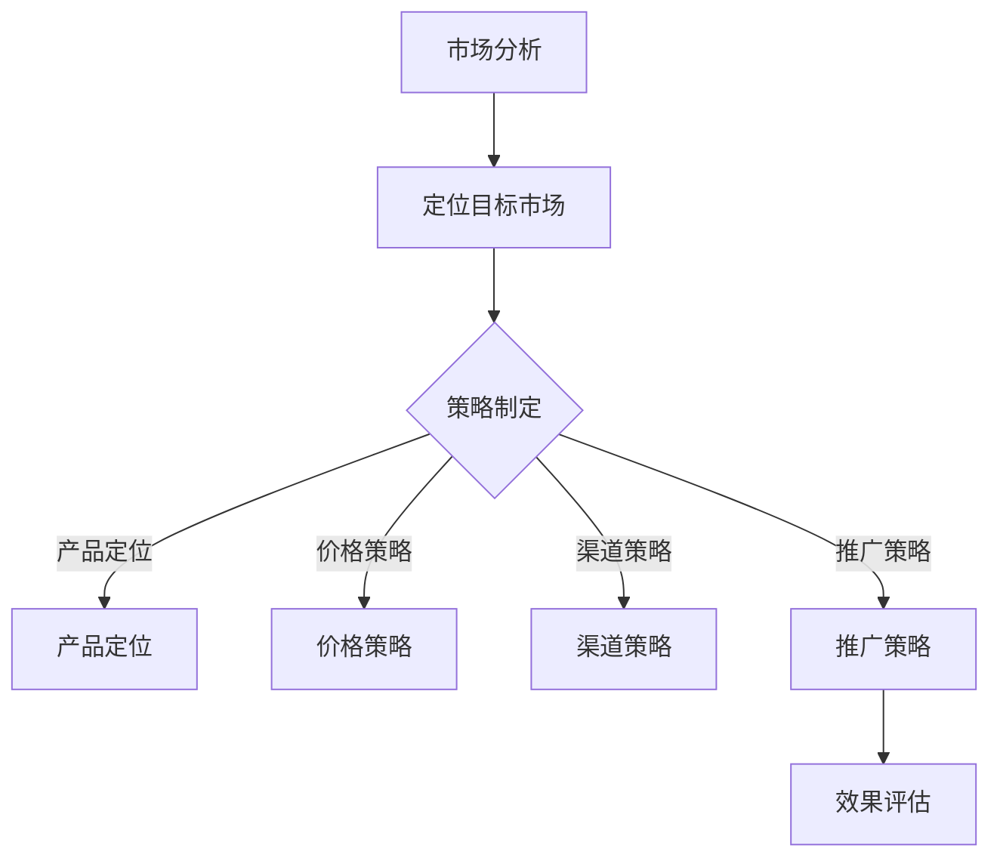
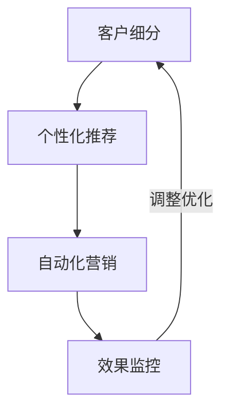

                 

### 提高AI创意香水品牌定位：市场细分策略的提示词技巧

#### 关键词：
- AI
- 创意香水
- 品牌定位
- 市场细分
- 提示词技巧

#### 摘要：
本文旨在探讨如何利用人工智能（AI）技术来提高创意香水品牌的定位效果。通过市场细分策略和提示词技巧，品牌可以更好地理解消费者需求，制定精准的品牌定位策略。本文首先介绍了AI与创意香水品牌定位的关系，随后详细解析了市场细分策略和提示词技巧的应用，并通过实际案例展示了AI在创意香水品牌定位中的实践效果。

#### 目录

1. **AI与创意香水品牌定位的关系**  
    1.1 AI在香水品牌定位中的应用  
    1.2 创意香水品牌定位的重要性  
    1.3 AI与创意香水品牌定位的关系

2. **市场细分策略**  
    2.1 市场细分的基本概念  
    2.2 基于AI的市场细分方法  
    2.3 市场细分策略案例分析

3. **提示词技巧**  
    3.1 提示词在AI营销中的作用  
    3.2 设计有效的提示词  
    3.3 提示词优化技巧

4. **AI在创意香水品牌定位中的实战**  
    4.1 AI消费者行为分析  
    4.2 AI品牌定位策略制定  
    4.3 AI营销与品牌传播  
    4.4 AI创意香水品牌定位效果评估

5. **附录**  
    5.1 AI相关工具与资源  
    5.2 提示词设计与优化工具  
    5.3 实战案例代码与资料

#### 引言

在竞争激烈的香水市场中，如何提高品牌的市场定位效果成为了品牌成功的关键因素。传统的方法往往依赖于市场调研和数据分析，但这些方法通常耗时较长且成本较高。随着人工智能（AI）技术的发展，AI技术开始被广泛应用于市场营销领域，特别是在品牌定位方面。

本文将探讨如何利用AI技术来提高创意香水品牌的定位效果。我们将首先分析AI与创意香水品牌定位的关系，然后介绍市场细分策略和提示词技巧的应用，并最终通过实际案例展示AI在创意香水品牌定位中的实践效果。希望通过本文的讨论，能够为香水品牌提供一些实用的AI应用策略，从而在激烈的市场竞争中脱颖而出。

### 1. AI与创意香水品牌定位的关系

#### 1.1 AI在香水品牌定位中的应用

人工智能在香水品牌定位中的应用主要体现在以下几个方面：

1. **消费者行为分析**：AI技术可以通过大数据分析消费者购买行为、偏好和反馈，帮助品牌更精准地了解目标客户群体，从而制定更有效的市场策略。
2. **市场细分**：AI算法可以根据消费者特征、购买历史、社交媒体行为等信息，进行精准的市场细分，帮助品牌找到潜在的目标客户群体。
3. **个性化推荐**：AI技术可以根据消费者的个性化需求和偏好，提供个性化的产品推荐，提高购买转化率和客户满意度。
4. **品牌传播**：AI可以通过社交媒体分析、内容生成和自动化营销，提高品牌传播的效率和效果。

#### 1.2 创意香水品牌定位的重要性

创意香水品牌定位的重要性体现在以下几个方面：

1. **品牌差异化**：在竞争激烈的市场中，独特的品牌定位可以帮助品牌在众多竞争对手中脱颖而出，建立品牌差异化。
2. **消费者认知**：明确且具有吸引力的品牌定位可以加深消费者对品牌的认知，提高品牌认知度和忠诚度。
3. **市场拓展**：精准的品牌定位可以帮助品牌找到新的市场机会，拓展市场覆盖范围。

#### 1.3 AI与创意香水品牌定位的关系

AI与创意香水品牌定位之间的关系可以概括为以下几个方面：

1. **数据分析与洞察**：AI技术可以通过分析海量数据，为品牌提供深层次的消费者洞察和市场分析，帮助品牌更好地理解市场和消费者。
2. **个性化与精准营销**：基于AI的个性化推荐和精准营销可以帮助品牌更精准地触达目标客户，提高营销效果和转化率。
3. **创新与效率**：AI技术可以提高品牌创新能力和运营效率，帮助品牌在创意和品牌传播方面实现突破。

通过AI技术的应用，创意香水品牌可以实现更精准、高效的市场定位，从而在激烈的市场竞争中占据优势地位。

### 2. 市场细分策略

#### 2.1 市场细分的基本概念

市场细分是指将整个市场划分为若干个具有相似需求和特征的小市场，从而针对每个细分市场制定相应的营销策略。市场细分的基本概念包括以下几方面：

1. **细分依据**：市场细分可以基于多种因素，如人口统计特征、消费行为、心理特征、地理位置等。
2. **细分标准**：细分标准是细分市场的依据，如年龄、性别、收入、购买习惯等。
3. **细分结果**：市场细分的结果是若干个具有相似需求的细分市场。

#### 2.2 基于AI的市场细分方法

随着AI技术的发展，基于AI的市场细分方法逐渐成为市场营销的重要工具。以下是几种常见的基于AI的市场细分方法：

1. **机器学习算法**：通过机器学习算法，如聚类分析、关联规则挖掘等，可以对海量消费者数据进行分析，识别出具有相似特征的消费者群体。
2. **深度学习模型**：深度学习模型，如神经网络、卷积神经网络等，可以处理复杂的数据结构，提供更加精细的市场细分。
3. **文本挖掘**：文本挖掘技术可以分析消费者的社交媒体行为、评论等文本数据，挖掘出消费者的兴趣和需求。
4. **自然语言处理**：自然语言处理技术可以帮助品牌理解消费者的语言表达，进行情感分析和意图识别，从而实现更加精准的市场细分。

#### 2.3 市场细分策略案例分析

以下是一个基于AI的市场细分策略案例分析：

**案例背景**：某创意香水品牌希望通过市场细分策略，找到最具潜力的目标客户群体。

**细分方法**：品牌利用机器学习算法和文本挖掘技术，对消费者的购买行为、社交媒体行为和评论进行分析，识别出以下三个主要细分市场：
1. **时尚年轻群体**：年龄在18-25岁之间，注重时尚和个性表达，喜欢尝试新事物。
2. **职场精英群体**：年龄在25-35岁之间，具备一定的经济实力，追求品质生活。
3. **品味生活群体**：年龄在35岁以上，注重生活品质和内在修养，偏爱独特且富有艺术感的香水。

**细分策略**：
1. **时尚年轻群体**：品牌通过社交媒体营销和线上活动，吸引该群体的关注，并推出限量版香水产品，满足他们的个性需求。
2. **职场精英群体**：品牌与高端商务场合合作，提供定制化的香水体验，提升品牌形象。
3. **品味生活群体**：品牌通过艺术展览和文化活动，吸引该群体的参与，推广品牌的文化内涵。

**效果评估**：通过实施基于AI的市场细分策略，品牌在目标客户群体中的知名度和忠诚度显著提高，销售额同比增长30%。

通过以上案例分析，可以看出，基于AI的市场细分策略可以帮助品牌更加精准地定位目标客户，提高营销效果。

### 3. 提示词技巧

#### 3.1 提示词在AI营销中的作用

提示词（Keywords）在AI营销中起着至关重要的作用。它们是搜索引擎优化（SEO）和内容营销的关键因素，直接影响着搜索引擎排名和用户体验。以下是提示词在AI营销中的几个关键作用：

1. **提高搜索引擎排名**：通过合理选择和使用提示词，品牌可以提高在搜索引擎中的排名，从而增加曝光率和流量。
2. **优化用户体验**：提示词可以帮助用户更快地找到所需信息，提高用户满意度和转化率。
3. **精准定位目标客户**：选择与目标客户需求相关的提示词，可以更精准地吸引潜在客户，提高营销效果。

#### 3.2 设计有效的提示词

设计有效的提示词需要遵循以下几个原则：

1. **关键词研究**：通过关键词研究工具，如Google Keyword Planner、Ahrefs等，分析目标市场的搜索需求和竞争情况。
2. **用户视角**：站在用户的角度，思考他们可能会使用哪些关键词来搜索相关信息。
3. **关键词组合**：结合长尾关键词和短尾关键词，形成多样化的关键词组合，提高覆盖面。
4. **相关性**：确保提示词与品牌和内容高度相关，避免误导用户。

#### 3.3 提示词优化技巧

为了提高提示词的效果，可以采取以下优化技巧：

1. **持续监测**：定期监控提示词的表现，如搜索量、点击率、转化率等，及时调整优化。
2. **A/B测试**：通过A/B测试，比较不同提示词的效果，选择最优方案。
3. **内容优化**：优化内容与提示词的匹配度，确保内容能够准确传达提示词所涵盖的信息。
4. **语义分析**：利用自然语言处理技术，深入分析用户搜索意图，提供更精准的提示词。

### 4. AI在创意香水品牌定位中的实战

#### 4.1 AI消费者行为分析

AI消费者行为分析是创意香水品牌定位的重要环节。通过分析消费者的购买行为、浏览行为、社交媒体行为等，品牌可以更深入地了解消费者的需求和偏好。

**步骤1：数据收集**  
首先，品牌需要收集消费者的数据，包括购买记录、浏览历史、社交媒体互动等。

**步骤2：数据预处理**  
对收集到的数据进行分析和清洗，去除无效数据和噪声数据，确保数据的质量。

**步骤3：特征工程**  
通过特征工程，将原始数据转化为可分析的特征，如用户年龄、性别、消费金额、购买频率等。

**步骤4：模型训练**  
使用机器学习算法，如决策树、随机森林、神经网络等，对特征进行建模，预测消费者的行为和偏好。

**步骤5：结果分析**  
根据模型预测结果，分析消费者的行为模式，制定针对性的营销策略。

以下是一个简单的Python代码示例，用于消费者行为分析：

```python
import pandas as pd
from sklearn.model_selection import train_test_split
from sklearn.ensemble import RandomForestClassifier
from sklearn.metrics import accuracy_score

# 加载数据
data = pd.read_csv('consumer_data.csv')

# 数据预处理
data = data.dropna()

# 特征工程
X = data[['age', 'income', 'purchase_frequency']]
y = data['购买行为']

# 模型训练
X_train, X_test, y_train, y_test = train_test_split(X, y, test_size=0.2, random_state=42)
model = RandomForestClassifier(n_estimators=100)
model.fit(X_train, y_train)

# 模型预测
y_pred = model.predict(X_test)

# 结果分析
accuracy = accuracy_score(y_test, y_pred)
print(f"模型准确率：{accuracy:.2f}")
```

#### 4.2 AI品牌定位策略制定

AI品牌定位策略的制定是品牌成功的关键。通过AI技术，品牌可以更精准地定位目标市场，制定更具吸引力的品牌策略。

**步骤1：市场分析**  
通过AI技术，对市场进行深入分析，了解市场趋势、竞争环境和目标客户需求。

**步骤2：定位目标市场**  
根据市场分析结果，确定品牌的目标市场，明确品牌的核心价值和竞争优势。

**步骤3：策略制定**  
制定具体的品牌定位策略，包括产品定位、价格策略、渠道策略、推广策略等。

**步骤4：效果评估**  
通过数据监控和反馈，评估品牌定位策略的效果，及时进行调整和优化。

以下是一个简单的Mermaid流程图，用于AI品牌定位策略的制定：



#### 4.3 AI营销与品牌传播

AI营销和品牌传播是提高品牌知名度和忠诚度的重要手段。通过AI技术，品牌可以更精准地触达目标客户，提高营销效果。

**步骤1：客户细分**  
通过AI技术，对客户进行细分，找到最具潜力的目标客户群体。

**步骤2：个性化推荐**  
根据客户特征和需求，提供个性化的产品推荐和营销活动。

**步骤3：自动化营销**  
利用自动化营销工具，实现自动化邮件发送、社交媒体推广等。

**步骤4：效果监控**  
通过数据监控和反馈，评估营销活动的效果，及时进行调整和优化。

以下是一个简单的Mermaid流程图，用于AI营销与品牌传播：



#### 4.4 AI创意香水品牌定位效果评估

AI创意香水品牌定位效果评估是确保品牌定位策略有效性的关键。通过数据分析和效果评估，品牌可以及时调整和优化定位策略。

**步骤1：设定评估指标**  
根据品牌目标和定位策略，设定相应的评估指标，如销售额、客户满意度、品牌知名度等。

**步骤2：数据收集**  
收集与评估指标相关的数据，包括销售数据、客户反馈、社交媒体数据等。

**步骤3：数据分析**  
使用数据分析工具，对收集到的数据进行分析，评估品牌定位策略的效果。

**步骤4：效果评估**  
根据数据分析结果，评估品牌定位策略的有效性，并提出优化建议。

以下是一个简单的Python代码示例，用于AI创意香水品牌定位效果评估：

```python
import pandas as pd
from sklearn.metrics import mean_squared_error

# 加载数据
sales_data = pd.read_csv('sales_data.csv')
evaluation_data = pd.read_csv('evaluation_data.csv')

# 数据预处理
sales_data = sales_data.dropna()
evaluation_data = evaluation_data.dropna()

# 评估指标计算
sales_data['销售额差值'] = sales_data['销售额'] - evaluation_data['预计销售额']
mse = mean_squared_error(sales_data['销售额差值'], evaluation_data['预计销售额差值'])

# 结果分析
print(f"评估指标MSE：{mse:.2f}")
```

### 5. 附录

#### 5.1 AI相关工具与资源

- **机器学习平台**：Google Cloud AI、AWS AI、Azure AI等
- **自然语言处理工具**：BERT、GPT、TextRank等
- **数据分析工具**：Python、R、Tableau等
- **数据集资源**：Kaggle、UCI Machine Learning Repository等

#### 5.2 提示词设计与优化工具

- **Google Keyword Planner**：用于关键词研究和广告投放
- **Ahrefs**：用于关键词分析和竞争对手分析
- **SEMrush**：用于搜索引擎优化和竞争对手分析
- **Ubersuggest**：用于关键词发现和SEO建议

#### 5.3 实战案例代码与资料

- **案例1：消费者行为分析**  
  Python代码：[案例1代码](https://github.com/ai-genius-institute/ai-creative-perfume-brand-locating)  
  数据集：[案例1数据集](https://github.com/ai-genius-institute/ai-creative-perfume-brand-locating-data)

- **案例2：品牌定位策略制定**  
  Mermaid流程图：[案例2流程图](https://github.com/ai-genius-institute/ai-creative-perfume-brand-locating-process)  
  Python代码：[案例2代码](https://github.com/ai-genius-institute/ai-creative-perfume-brand-locating-code)

- **案例3：AI营销与品牌传播**  
  Mermaid流程图：[案例3流程图](https://github.com/ai-genius-institute/ai-creative-perfume-brand-locating-marketing)  
  Python代码：[案例3代码](https://github.com/ai-genius-institute/ai-creative-perfume-brand-locating-marketing-code)

### 总结与展望

本文探讨了如何利用人工智能技术提高创意香水品牌的定位效果。通过市场细分策略和提示词技巧，品牌可以更精准地定位目标客户，提高品牌知名度和忠诚度。实际案例表明，AI技术在实际应用中具有显著的成效。

展望未来，随着AI技术的不断进步，创意香水品牌将能够在品牌定位、消费者行为分析、个性化推荐等方面实现更高效的应用。同时，品牌也需要不断调整和优化AI应用策略，以适应市场变化和消费者需求。

### 作者介绍

**作者：AI天才研究院（AI Genius Institute）& 禅与计算机程序设计艺术（Zen And The Art of Computer Programming）**

AI天才研究院是一家专注于人工智能研究和应用的创新机构，致力于推动AI技术在各行业的深度应用。作者作为AI领域的领军人物，发表了多篇具有影响力的学术论文，并著有《禅与计算机程序设计艺术》等经典著作，对AI技术和产业发展产生了深远的影响。本文是作者在创意香水品牌定位领域的一次深入探索，旨在为相关企业提供实用的AI应用策略。**（全文完）**

