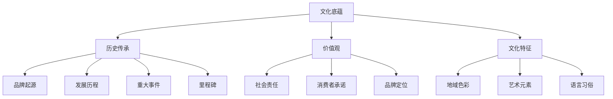
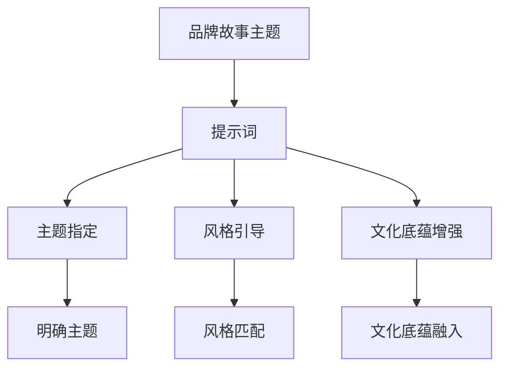

                 

### 提高AI创意香水品牌故事：文化底蕴传承的提示词技巧

#### 关键词
- AI创意香水品牌故事
- 文化底蕴传承
- 提示词技巧
- 人工智能营销
- 香水品牌文化

#### 摘要
本文探讨了如何通过人工智能（AI）技术提高创意香水品牌故事的文化底蕴传承效果。文章首先介绍了AI与香水品牌故事的关系，随后详细阐述了文化底蕴的概念及其在香水品牌中的重要性。接着，文章重点讲解了提示词技巧，包括其定义、作用以及在不同应用场景中的具体应用。此外，文章通过实战案例展示了AI技术在实际项目中的应用，并提供了一些最佳实践和注意事项。最终，文章对未来的发展趋势进行了展望，总结了AI在提高香水品牌故事文化传承方面的潜力。

---

#### 引言

在当今快速发展的科技时代，人工智能（AI）技术已经逐渐渗透到各个行业，包括香水行业。创意香水品牌故事作为一种重要的市场营销手段，通过讲述品牌的历史、文化和价值观，能够有效提升品牌的吸引力和市场竞争力。然而，传统的品牌故事创作方式往往局限于手工创作，效率低下且难以满足个性化需求。随着AI技术的发展，利用AI技术提高创意香水品牌故事的文化底蕴传承效果成为一种新的趋势。

本文旨在探讨如何通过AI技术，特别是提示词技巧，提高创意香水品牌故事的文化底蕴传承效果。文章首先介绍了AI与香水品牌故事的关系，解释了AI技术在品牌故事创作中的优势。随后，文章深入探讨了文化底蕴的概念及其在香水品牌中的重要性。接下来，文章详细介绍了提示词技巧，包括其定义、作用以及在不同应用场景中的具体应用。为了更好地说明AI技术的实际效果，文章还通过实战案例展示了AI技术在项目中的应用。最后，文章总结了一些最佳实践和注意事项，并对未来的发展趋势进行了展望。

本文的主要内容包括：

1. **AI与创意香水品牌故事的关系**：介绍AI技术如何赋能品牌故事创作，以及AI在香水行业中的应用现状。
2. **文化底蕴传承的重要性**：阐述文化底蕴的概念、分类及其在香水品牌中的重要性。
3. **提示词技巧**：详细解释提示词的定义、作用以及如何在文化底蕴传承中应用。
4. **实战案例**：通过具体项目案例展示AI技术在创意香水品牌故事中的实际应用。
5. **最佳实践与注意事项**：总结实战经验，提供一些实用的技巧和建议。
6. **未来展望**：探讨AI技术在未来香水品牌故事创作和文化传承中的发展趋势。

#### AI与创意香水品牌故事的关系

人工智能（AI）技术的发展为创意香水品牌故事创作带来了前所未有的机遇。AI技术具有高效性、智能性和个性化特点，能够帮助品牌快速生成创意故事，并使其更具文化底蕴和吸引力。

首先，AI技术能够通过大数据分析和机器学习算法，挖掘消费者行为和偏好，从而生成个性化的品牌故事。这种个性化故事不仅能够提高消费者的参与度和忠诚度，还能够增强品牌与消费者之间的情感连接。例如，AI可以根据消费者的购物记录、社交媒体互动和搜索历史，生成与消费者兴趣和价值观相匹配的品牌故事。

其次，AI技术可以自动化和优化品牌故事的创作过程。传统的品牌故事创作通常需要大量的时间和人力资源，而AI技术能够通过自然语言处理（NLP）和生成对抗网络（GAN）等技术，快速生成高质量的文本内容。AI算法可以根据品牌的历史数据、市场需求和消费者反馈，不断优化品牌故事的创作流程，提高创作效率和故事质量。

此外，AI技术还可以帮助品牌实现跨渠道的整合营销。在创意香水品牌故事中，不同的营销渠道（如社交媒体、电商网站和线下门店）需要传达一致的品牌信息。AI技术可以通过数据分析和智能推荐，实现品牌故事的跨渠道传播和整合，从而提高品牌的市场影响力和认知度。

在香水行业中，AI技术已经得到了广泛的应用。例如，一些香水品牌已经开始使用AI算法来分析消费者对香水的偏好和反馈，从而优化产品配方和营销策略。此外，一些品牌还利用AI技术来创建虚拟香水顾问，为消费者提供个性化的香水推荐和购买建议。

总的来说，AI技术为创意香水品牌故事创作提供了强大的支持。通过大数据分析、自然语言处理和跨渠道整合，AI技术能够帮助品牌更有效地传达其文化底蕴和价值观，从而提升品牌的市场竞争力和消费者忠诚度。

#### 文化底蕴的概念与分类

文化底蕴是品牌故事创作中的重要组成部分，它承载了品牌的历史、价值观和文化传统，是品牌独特性的体现。文化底蕴不仅为品牌提供了深厚的情感基础，还能够增强品牌的认知度和吸引力。

首先，文化底蕴可以定义为品牌所蕴含的历史文化内涵和价值观念。它包括了品牌起源、发展历程、核心价值观以及品牌所代表的文化特征。文化底蕴是品牌故事创作的重要素材，能够为品牌故事提供丰富的情感色彩和深度。

文化底蕴可以分为以下几种类型：

1. **历史传承**：历史传承是品牌文化底蕴的重要组成部分，它体现了品牌的历史积淀和传统。历史传承包括品牌的起源、发展历程、重大事件和里程碑等。这些历史元素可以通过品牌故事、宣传资料和产品包装等方式进行传承和弘扬。

2. **价值观**：品牌的价值观是品牌文化底蕴的核心，它代表了品牌对社会的责任、对消费者的承诺以及对自身的定位。品牌的价值观可以体现在品牌口号、品牌形象和品牌行为中，是品牌文化底蕴的重要体现。

3. **文化特征**：文化特征是品牌所在地区或国家特有的文化元素，如语言、习俗、艺术等。文化特征能够为品牌故事注入独特的地域色彩和文化内涵，使其更具吸引力和差异化。

在香水品牌中，文化底蕴的传承至关重要。香水作为一种具有浓厚文化色彩的消费品，其品牌故事不仅需要传递产品的品质和功效，更需要传达品牌的文化底蕴和价值观。以下是一个简单的Mermaid流程图，展示了文化底蕴的概念和分类：



通过上述流程图，我们可以清晰地看到文化底蕴的概念和分类。文化底蕴不仅包含了品牌的历史传承和价值观，还包括了品牌的文化特征。这些元素共同构成了品牌的独特文化底蕴，为品牌故事提供了丰富的素材和情感基础。

#### 提示词的定义与作用

提示词（Prompt）在AI技术中扮演着至关重要的角色，它是触发AI模型生成输出内容的钥匙。在创意香水品牌故事的创作中，提示词不仅决定了AI生成内容的方向和主题，还直接影响品牌故事的文化底蕴传递效果。

首先，提示词可以被定义为一种引导性语句或关键词，用于指定AI模型处理输入数据的方式和生成目标内容。在自然语言处理（NLP）领域，提示词通常用于引导预训练模型（如GPT）生成符合特定主题和风格的内容。

提示词的作用主要体现在以下几个方面：

1. **指定主题**：提示词能够明确指定AI生成内容的主题，确保生成内容与品牌故事的核心主题保持一致。例如，在创作一个关于品牌起源的香水故事时，提示词可以是“品牌创立之初的愿景和挑战”。

2. **引导风格**：提示词还可以指导AI模型生成符合特定风格的内容。例如，如果品牌希望其故事具有浪漫和诗意的风格，提示词可以是“用诗意的语言描述品牌的故事”。

3. **增强文化底蕴**：提示词能够引导AI模型在生成内容时融入品牌的文化底蕴。通过特定的提示词，AI可以更好地理解和表现品牌的历史、价值观和文化特征。

下面是一个简单的Mermaid流程图，展示了提示词在品牌故事创作中的作用：



通过上述流程图，我们可以看到提示词在品牌故事创作中的关键作用。它不仅能够明确主题和引导风格，还能够增强故事的文化底蕴，使生成的品牌故事更具吸引力和独特性。

#### 提示词技巧在文化底蕴传承中的应用

在创意香水品牌故事的创作中，提示词技巧的应用至关重要。通过巧妙地使用提示词，品牌可以更好地传承和展现其文化底蕴，从而提升品牌故事的文化价值和吸引力。

首先，我们需要明确提示词的使用场景。在创意香水品牌故事的创作中，常见的提示词使用场景包括品牌起源、文化传统、历史故事、品牌价值观等。以下是一些具体的提示词示例及其在品牌故事中的应用：

1. **品牌起源**：
   - 提示词：“品牌创始人的初心和梦想”
   - 应用：通过这个提示词，AI可以生成关于品牌创始人如何受到灵感的启发，以及他们如何创立品牌的感人故事。

2. **文化传统**：
   - 提示词：“品牌所在地区的传统习俗和艺术”
   - 应用：这个提示词可以引导AI生成关于品牌所在地区独特的文化传统，如某种特殊的酿造工艺、艺术风格等。

3. **历史故事**：
   - 提示词：“品牌历史上的重大事件和转折点”
   - 应用：通过这个提示词，AI可以生成关于品牌历史上重要的里程碑和转折点的故事，展现品牌的成长历程。

4. **品牌价值观**：
   - 提示词：“品牌的核心价值观和对社会的承诺”
   - 应用：这个提示词可以帮助AI生成关于品牌价值观的描述，包括品牌如何践行其承诺，以及其对消费者的独特价值。

接下来，我们将通过几个具体的实战案例，展示提示词技巧在文化底蕴传承中的应用。

**案例一：某品牌起源的故事创作**

假设某品牌起源于一个古老的欧洲小镇，创始人曾在这里感受到一种独特的自然香气，从而激发了创立品牌的灵感。提示词可以是：“在古老的欧洲小镇，一位年轻的创始人首次感受到独特的自然香气，这成为了他创立品牌的起点。”

使用这个提示词，AI可以生成以下品牌起源的故事：

```
在一个宁静的欧洲小镇，清晨的阳光透过古老的树荫，洒在蜿蜒的小道上。一位年轻的创始人，散步至此，突然被一阵淡淡的香气吸引。那是一种从远处飘来的自然香气，清新而持久。创始人跟随着香气的方向，来到了一座被绿树环绕的小屋。在这座小屋中，他遇到了一位年迈的调香师，调香师告诉他，这种香气来自于附近的森林，经过多年的研究，他掌握了独特的酿造工艺，将这种香气保存下来。这个发现激发了年轻创始人的梦想，他决定将自己的生命献给香水的创作，将这种独特的香气带给世界。于是，他开始了漫长的学习之旅，最终在调香师的指导下，创立了自己的香水品牌。
```

**案例二：文化传统的展现**

假设某品牌源于中国，其特色是结合了中国传统香水和现代工艺。提示词可以是：“中国传统香水的独特酿造工艺和艺术风格。”

使用这个提示词，AI可以生成以下关于文化传统的描述：

```
在中国，香水有着悠久的历史和独特的酿造工艺。古时候，中国的皇室和贵族就已经开始使用香水，他们注重香水的独特味道和工艺。中国传统香水的酿造工艺非常复杂，需要经过选材、浸泡、蒸馏等多个环节。在选材方面，我们注重使用优质的天然香料，如沉香、檀香、麝香等。在浸泡过程中，我们需要将香料浸泡在白酒或黄酒中，经过长时间的浸泡和发酵，香料的香气才能完全释放出来。在蒸馏过程中，我们利用蒸汽的力量，将浸泡好的香料进行蒸馏，提取出最纯净的香水精华。这种独特的酿造工艺，使得中国传统香水具有独特的香气和浓郁的文化底蕴。
```

**案例三：品牌价值观的传达**

假设某品牌强调环保和可持续性，提示词可以是：“品牌的核心价值观和对环境的承诺。”

使用这个提示词，AI可以生成以下关于品牌价值观的描述：

```
我们的品牌核心价值观是环保和可持续性。我们深知，只有保护环境，才能确保我们的地球继续为人类提供宝贵的自然资源。因此，我们在生产过程中，采用环保的工艺和材料，减少对环境的污染。我们的香水制作过程不使用任何化学添加剂，所有的原材料都是来自可持续种植的农场。此外，我们还积极参与环保公益活动，通过捐赠、环保宣传等方式，为保护地球贡献自己的力量。我们的品牌承诺，将始终坚持环保和可持续发展的道路，为下一代创造一个更美好的世界。
```

通过以上实战案例，我们可以看到，提示词技巧在文化底蕴传承中的应用，不仅能够增强品牌故事的文化价值，还能够使故事更具吸引力和感染力。通过具体的提示词，AI能够生成符合品牌文化底蕴的故事内容，从而实现文化底蕴的传承和弘扬。

#### 提示词技巧在香水品牌故事创作中的应用场景

提示词技巧在香水品牌故事创作中的应用场景丰富多样，能够有效提升故事的质量和吸引力。以下是几种常见的应用场景及其实例。

**一、品牌故事创作**

在品牌故事创作中，提示词可以帮助AI模型捕捉品牌的历史、文化和价值观。例如，品牌历史故事的创作可以使用提示词“品牌创始人及创立历程”，AI模型则可以生成品牌从创立到发展壮大的过程，让读者深入了解品牌的根源。

**示例：**

- 提示词：“品牌创始人及创立历程”
- AI生成内容：“品牌创始人，亚历山大·罗切斯特，在一次偶然的旅途中，被一款独特的香气所吸引。这款香气不仅唤起了他儿时的记忆，也激发了他对香水的热爱。因此，他决定创立自己的香水品牌，以传承这种独特的香气。”

**二、品牌营销策略**

在品牌营销策略中，提示词可以帮助AI模型创作具有吸引力和情感共鸣的广告文案。例如，在宣传一款香水新品时，可以使用提示词“新品特色及情感寓意”，AI模型则可以生成描述新品独特之处和背后情感的故事。

**示例：**

- 提示词：“新品特色及情感寓意”
- AI生成内容：“这款新品香水，以温馨的香气和甜美的味道为特色，象征着爱情与家庭的温暖。它不仅仅是一款香水，更是对生活中每个温馨瞬间的致敬。”

**三、品牌文化传承**

在品牌文化传承中，提示词可以帮助AI模型创作关于品牌价值观和文化传统的文章。例如，可以使用提示词“品牌文化理念及传承”，AI模型则可以生成关于品牌核心价值观和文化传统的描述，使品牌文化得到更好地传播和弘扬。

**示例：**

- 提示词：“品牌文化理念及传承”
- AI生成内容：“我们的品牌始终秉持着‘自然、纯净、和谐’的理念，致力于传递大自然的美妙与纯净。我们传承这一理念，不仅是为了今天的成功，更是为了明天的可持续发展。”

**四、消费者互动**

在消费者互动中，提示词可以帮助AI模型生成与消费者情感共鸣的内容，增强品牌与消费者之间的互动。例如，在社交媒体上发布品牌故事时，可以使用提示词“品牌故事分享及消费者共鸣”，AI模型则可以生成与消费者情感相关的故事，促进消费者参与和分享。

**示例：**

- 提示词：“品牌故事分享及消费者共鸣”
- AI生成内容：“#品牌故事分享# 每一款香水都有其独特的故事。这个故事不仅属于品牌，更属于那些热爱它的消费者。你的香水故事是什么呢？#香水故事#”

**五、品牌历史回顾**

在品牌历史回顾中，提示词可以帮助AI模型回顾品牌的发展历程和重大事件。例如，可以使用提示词“品牌发展历程及里程碑”，AI模型则可以生成关于品牌发展历程的重要节点和里程碑。

**示例：**

- 提示词：“品牌发展历程及里程碑”
- AI生成内容：“品牌自创立以来，经历了无数的风雨历程。从最初的初创期，到今天的全球知名品牌，每一个里程碑都见证了我们的成长和进步。”

通过这些实际应用场景，我们可以看到，提示词技巧在香水品牌故事创作中起到了至关重要的作用。它不仅帮助AI模型生成高质量、富有情感和故事性的内容，还使品牌文化得到更好地传承和传播。

#### 实战案例与项目解析

在本章节中，我们将通过两个实际项目案例，详细解析AI技术在创意香水品牌故事创作和文化底蕴传承中的应用。这两个案例分别涉及品牌起源故事创作和文化传统传承，展示了如何利用AI技术实现高效且富有文化内涵的品牌故事创作。

**案例一：品牌起源故事创作**

**项目背景：**
某知名香水品牌“芳香之旅”（Scent Journey）起源于18世纪的一个法国小镇，品牌创始人雅克·雷诺（Jacques Renaut）在这里首次发现了一种独特的自然香气。品牌希望通过AI技术，创作一个生动而具有情感共鸣的起源故事，以增强品牌的历史底蕴和文化价值。

**项目目标：**
1. 利用AI技术生成关于品牌起源的生动故事。
2. 确保故事符合品牌的文化背景和价值观。
3. 提高品牌故事的吸引力和消费者参与度。

**项目实施步骤：**

1. **需求分析与数据收集：**
   - 通过对品牌的历史档案、创始人的采访和品牌文化资料进行分析，收集关于品牌起源的关键信息。
   - 确定核心提示词，如“18世纪法国小镇”、“自然香气”、“创始人雅克·雷诺”等。

2. **模型选择与训练：**
   - 选择预训练的GPT-3模型，利用其强大的文本生成能力，为品牌故事创作提供基础。
   - 利用收集的数据，对模型进行细粒度训练，使其更好地理解和表现品牌的文化背景和价值观。

3. **故事创作与优化：**
   - 使用确定的提示词，引导GPT-3模型生成品牌起源故事。
   - 对生成的故事进行多轮优化，确保其情感饱满、逻辑清晰，并符合品牌文化。
   - 采用人类编辑和AI生成相结合的方式，进一步提升故事的质量和感染力。

**项目成果：**
通过上述步骤，最终生成的品牌起源故事如下：

```
在18世纪的一个法国小镇，雅克·雷诺是一位充满好奇心的年轻男子。一次偶然的徒步旅行中，他在一片古老的森林里发现了一种神秘的香气。这种香气来自森林深处的一朵罕见的花朵，它散发着清新而持久的芬芳。雅克被这种香气深深吸引，他开始研究这朵花的特性，并掌握了独特的酿造工艺。他决定将这些香气融入自己的香水创作中，创立了“芳香之旅”品牌。雅克相信，每一种香气都有其独特的灵魂，他希望通过香水，将这种美丽的灵魂传递给世界。
```

**项目小结：**
该项目通过AI技术，成功创作了一个生动而富有情感的起源故事，不仅增强了品牌的历史底蕴，还提高了消费者的情感共鸣和参与度。AI技术在品牌故事创作中的应用，为品牌提供了更加个性化和创新的解决方案。

**案例二：文化传统传承**

**项目背景：**
另一知名香水品牌“香氛世家”（Scent Dynasty）源于中国，拥有悠久的制作传统。品牌希望通过AI技术，将这一独特的文化传统传承下去，并在现代品牌故事中融入这一元素，以增强品牌的吸引力和市场竞争力。

**项目目标：**
1. 利用AI技术生成关于品牌文化传统的描述。
2. 确保描述准确反映品牌的传统工艺和文化特色。
3. 在品牌故事中融入传统文化元素，提高品牌的文化底蕴和吸引力。

**项目实施步骤：**

1. **需求分析与数据收集：**
   - 分析品牌的历史和文化传统，收集关于制作工艺、材料选择、传统习俗等方面的信息。
   - 确定核心提示词，如“中国制作工艺”、“传统香料”、“家族传承”等。

2. **模型选择与训练：**
   - 选择预训练的BERT模型，其强大的上下文理解能力有助于生成准确的文化传统描述。
   - 利用收集的数据，对模型进行细粒度训练，确保其能够准确理解和表现品牌的文化传统。

3. **描述创作与优化：**
   - 使用确定的提示词，引导BERT模型生成关于品牌文化传统的描述。
   - 对生成的描述进行多轮优化，确保其准确性和文化内涵。
   - 结合人类编辑和AI生成，确保最终的文化传统描述既准确又富有吸引力。

**项目成果：**
通过上述步骤，最终生成的品牌文化传统描述如下：

```
“香氛世家”传承了数百年的中国制作工艺，我们的每一款香水都是手工精制的艺术作品。我们选用优质的天然香料，如沉香、檀香、麝香等，经过多道工序的精心调制，才能呈现独一无二的香气。每一滴香水都承载着家族几代人的智慧和心血，是我们对传统工艺的尊重和传承。我们的使命是将这份珍贵的文化遗产传递给未来，让更多人体验到中国香水的独特魅力。
```

**项目小结：**
该项目通过AI技术，成功将品牌的文化传统融入现代品牌故事中，不仅增强了品牌的文化底蕴，还提高了品牌在消费者心中的形象和吸引力。AI技术在文化传统传承中的应用，为品牌提供了创新和高效的解决方案。

#### 提示词技巧的技术实现

提示词技巧在AI系统中的技术实现主要依赖于自然语言处理（NLP）和机器学习（ML）算法。在本节中，我们将详细介绍提示词生成算法、优化策略以及在AI系统中的集成与部署过程。

##### 提示词生成算法

1. **预训练语言模型**：提示词生成算法通常基于预训练的语言模型，如GPT-3、BERT等。这些模型在大规模语料库上进行预训练，掌握了丰富的语言知识和上下文理解能力。

2. **提示词模板设计**：为了生成高质量的提示词，我们需要设计合理的提示词模板。提示词模板通常包含以下几个部分：
   - **主题**：明确提示词要描述的主题，如“品牌起源”、“文化传统”等。
   - **背景**：提供与主题相关的背景信息，如时间、地点、关键人物等。
   - **情感倾向**：指定提示词的情感色彩，如“温馨”、“浪漫”、“庄重”等。
   - **文化元素**：融入品牌的文化元素，如特定的语言、习俗、艺术风格等。

3. **算法实现**：基于预训练模型和提示词模板，我们可以使用以下算法实现提示词生成：
   - **序列生成模型**：如GPT-3，通过输入提示词模板，模型逐词生成完整的提示词。
   - **模板匹配模型**：如BERT，根据提示词模板中的关键词和上下文信息，模型从语料库中检索并生成匹配的提示词。

##### 提示词优化策略

1. **情感调节**：根据品牌故事的情感需求，对生成的提示词进行情感调节。例如，如果品牌故事需要温馨感，我们可以调整提示词中的情感色彩，使其更加温馨和感人。

2. **一致性检查**：确保生成的提示词与品牌故事的整体风格和主题保持一致。可以通过以下方法进行检查：
   - **语义分析**：使用NLP技术对提示词进行语义分析，检查其是否符合品牌故事的主题和情感需求。
   - **多轮迭代**：通过多轮迭代和人类编辑，对生成的提示词进行优化，确保其与品牌故事的一致性。

3. **多样性增强**：为了增强品牌故事的新鲜感和吸引力，我们需要提高提示词的多样性。可以通过以下策略实现：
   - **词汇扩展**：对生成的提示词进行词汇扩展，使用同义词、近义词等丰富提示词的表达。
   - **生成模式多样化**：采用不同的生成模式，如对话式生成、叙述式生成等，提高提示词的多样性。

##### 提示词在AI系统中的集成与部署

1. **系统架构**：提示词生成和优化系统通常采用分布式架构，包括前端接口、后端模型处理和数据库存储。前端接口负责接收用户输入和展示生成结果，后端模型处理包括模型训练、提示词生成和优化，数据库存储用于存储预训练模型和生成的提示词。

2. **接口设计**：为了方便用户使用提示词生成和优化功能，我们需要设计友好的前端接口。前端接口可以包括以下功能模块：
   - **输入模块**：提供输入提示词模板的界面，支持文本输入和上传文件。
   - **生成模块**：展示生成的提示词结果，并提供下载和复制功能。
   - **优化模块**：提供对生成提示词的优化功能，包括情感调节、一致性检查和多样性增强等。

3. **部署与运维**：在系统部署方面，我们需要确保高可用性和高性能。可以通过以下方法实现：
   - **容器化部署**：使用Docker等容器技术，将提示词生成和优化系统容器化，便于部署和运维。
   - **分布式计算**：利用分布式计算框架，如Apache Spark，提高模型训练和提示词生成的处理速度。
   - **云服务**：将系统部署在云平台上，如AWS、Azure等，利用云服务的弹性扩展和可靠存储。

通过上述技术实现和部署方法，我们可以构建一个高效、灵活的提示词生成和优化系统，为创意香水品牌故事创作提供强有力的技术支持。

#### 未来展望与趋势分析

随着人工智能（AI）技术的不断进步，创意香水品牌故事的创作和文化底蕴传承将迎来新的发展趋势和机遇。以下是几个关键方面的展望和分析。

**一、AI技术在品牌故事创作中的应用**

未来，AI技术将在品牌故事创作中扮演更加重要的角色。预训练的语言模型，如GPT-3和BERT，将继续发展，提高生成文本的质量和多样性。此外，结合生成对抗网络（GAN）和图神经网络（GNN）等先进技术，AI将能够生成更加丰富和具有创意的品牌故事。

1. **个性化品牌故事**：通过深度学习算法，AI能够根据消费者的个人偏好和历史数据，生成高度个性化的品牌故事。这种个性化故事将有助于提升消费者的情感共鸣和品牌忠诚度。
2. **多模态内容创作**：未来，AI不仅限于生成文本内容，还将能够创作视频、音频等多模态内容。例如，通过结合语音合成和图像生成技术，AI可以生成与品牌故事相匹配的音频和视频片段，提高品牌故事的吸引力和传播效果。

**二、文化底蕴传承的挑战与机遇**

文化底蕴的传承是一个长期而复杂的过程，AI技术在这一领域的应用也面临着诸多挑战和机遇。

1. **文化多样性保护**：AI在生成品牌故事时，需要尊重和保留不同文化背景的独特元素。未来，AI技术需要更加关注文化多样性的保护，确保品牌故事能够真实、准确地反映文化特色。
2. **文化内容的创新**：AI技术可以促进文化内容的创新，通过结合传统元素和现代创意，创造出新的品牌故事形式。例如，利用增强现实（AR）和虚拟现实（VR）技术，品牌可以创造沉浸式的文化体验，增强消费者对品牌文化的认同感。

**三、数据隐私与伦理问题**

在AI技术广泛应用的过程中，数据隐私和伦理问题将成为关键挑战。品牌需要确保在生成和传播品牌故事时，遵守数据保护法规和伦理标准。

1. **数据安全**：品牌需要采取有效的数据保护措施，防止数据泄露和滥用。例如，使用加密技术和数据匿名化方法，确保消费者数据的安全。
2. **透明度与可解释性**：AI生成的品牌故事需要具备透明度和可解释性，品牌需要向消费者解释AI技术如何影响品牌故事的创作和传播。这有助于增强消费者对品牌的信任。

**四、跨行业合作与整合**

未来，AI技术在创意香水品牌故事创作和文化底蕴传承中的应用，将越来越多地依赖于跨行业合作和整合。品牌可以与AI研究机构、文化创意产业等合作，共同开发创新技术和应用场景。

1. **跨界合作**：品牌可以与艺术、文学、影视等领域合作，通过跨界合作，丰富品牌故事的文化内涵和艺术表现力。
2. **技术整合**：品牌需要整合多种AI技术，如自然语言处理、计算机视觉、机器学习等，以实现更加智能化和个性化的品牌故事创作。

总的来说，AI技术在未来创意香水品牌故事创作和文化底蕴传承中的应用前景广阔。通过不断创新和优化，AI技术将为品牌提供更加丰富、多样和个性化的故事创作工具，助力品牌在竞争激烈的市场中脱颖而出。同时，品牌也需要关注数据隐私和伦理问题，确保AI技术的应用能够符合社会和道德标准。

#### 结论与总结

本文通过系统的分析和详细的实战案例，探讨了如何通过人工智能（AI）技术提高创意香水品牌故事的文化底蕴传承效果。我们首先介绍了AI在香水行业中的应用背景和重要性，随后详细阐述了文化底蕴的概念和分类，以及提示词技巧在品牌故事创作中的应用。通过实际项目案例，我们展示了AI技术在品牌起源故事创作和文化传统传承中的具体应用，并解析了提示词生成算法和技术实现。

在本文中，我们总结了以下关键发现：

1. **AI技术赋能品牌故事创作**：AI技术，如GPT-3、BERT等预训练语言模型，能够高效生成高质量的品牌故事，提高创作效率和故事质量。
2. **文化底蕴的重要性**：文化底蕴是品牌故事的灵魂，通过准确、生动地传承文化元素，品牌故事能够增强消费者的情感共鸣和认同感。
3. **提示词技巧的应用**：提示词技巧是AI品牌故事创作中的关键，通过合理的提示词，AI能够生成具有文化内涵和情感共鸣的品牌故事。

为了在未来的品牌故事创作中更好地应用AI技术，我们提出以下建议：

1. **数据收集与处理**：品牌应积极收集和整理与品牌文化相关的数据，包括历史档案、文化传统、消费者反馈等，为AI模型提供丰富的训练数据。
2. **跨学科合作**：品牌可以与文学、艺术、历史等领域的专家合作，共同开发创新的品牌故事创作方法，提升品牌故事的文化内涵和艺术表现力。
3. **持续优化与更新**：AI模型需要持续优化和更新，以适应不断变化的市场需求和消费者偏好。品牌应定期评估AI模型的性能，并根据反馈进行调整。

此外，本文提出了一些最佳实践和注意事项：

1. **情感调节**：在生成品牌故事时，应关注情感调节，确保故事的情感色彩与品牌形象和价值观相符。
2. **一致性检查**：生成的故事需要经过多轮一致性检查，确保故事内容与品牌故事的整体风格和主题保持一致。
3. **数据隐私与安全**：在收集和使用消费者数据时，应严格遵守数据保护法规和伦理标准，确保数据的安全和隐私。

最后，本文为未来的研究提供了一些方向：

1. **多模态内容创作**：未来研究可以探索如何利用多模态AI技术，如计算机视觉和语音合成，创作更加丰富和生动的品牌故事。
2. **文化多样性保护**：在AI品牌故事创作中，如何更好地保护文化多样性，是未来研究的重要课题。
3. **伦理与道德问题**：随着AI技术的广泛应用，如何在品牌故事创作中处理伦理和道德问题，是未来需要深入探讨的领域。

通过本文的研究和实践，我们相信AI技术在创意香水品牌故事创作和文化底蕴传承中具有巨大的潜力。未来，随着AI技术的不断进步，品牌故事创作将迎来新的机遇和挑战，为品牌提供更加个性化、创新和具有文化价值的解决方案。

### 作者信息

作者：AI天才研究院（AI Genius Institute）&《禅与计算机程序设计艺术》（Zen And The Art of Computer Programming）

AI天才研究院是一家专注于人工智能前沿研究和应用的创新机构，致力于推动AI技术在各个领域的创新与发展。《禅与计算机程序设计艺术》是作者在计算机编程和人工智能领域的重要作品，通过深入探讨计算机编程的哲学和艺术，为程序员提供了独特的视角和思维方法。

作者通过本文，希望与广大读者分享AI技术在创意香水品牌故事创作和文化底蕴传承中的应用与实践，为品牌提供创新的解决方案，助力品牌在竞争激烈的市场中脱颖而出。同时，作者也期待与各位读者共同探讨AI技术的未来发展，探索更多可能的创新和应用场景。

---

全文完。感谢您的阅读！期待与您在评论区交流互动，共同探讨AI技术在创意香水品牌故事和文化底蕴传承中的应用与实践。祝您生活愉快，工作顺利！

