                 

# 提高AI创意香水品牌社会责任：可持续发展策略的提示词技巧

## 关键词

- AI
- 可持续发展
- 香水品牌
- 社会责任
- 提示词技巧

## 摘要

随着人工智能（AI）技术的快速发展，其在香水行业的应用日益广泛。然而，AI技术的应用也带来了对香水品牌社会责任的挑战。本文将探讨如何通过AI技术提高香水品牌的社会责任，特别是可持续发展策略的提示词技巧。文章首先介绍了AI技术在香水行业中的应用和挑战，然后分析了AI与香水品牌社会责任之间的联系。接着，文章详细阐述了提示词技巧在AI应用中的重要性，并提供了具体的策略和案例。通过本文的讨论，期望为香水品牌在可持续发展方面提供有益的思路和方法。

## 第一部分：AI与香水品牌社会责任概述

### 第1章：AI在香水行业中的应用与挑战

#### 1.1 AI与香水行业的深度融合

##### 1.1.1 AI技术在香水配方研发中的应用

人工智能在香水配方研发中扮演着越来越重要的角色。传统的香水配方研发通常依赖于调香师的经验和直觉，而AI技术可以通过分析大量数据，提供更为精准和创新的配方。以下是一个简单的Mermaid流程图，展示了AI技术在香水配方研发中的应用：

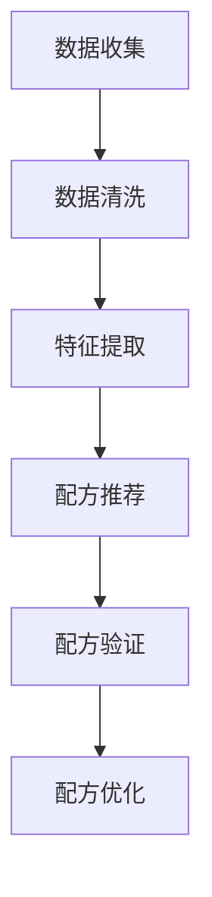

在数据收集阶段，AI技术可以从多个渠道获取香水成分和用户反馈数据。数据清洗和特征提取阶段，AI技术可以处理大量复杂的数据，提取出对配方研发有用的信息。配方推荐阶段，AI技术可以根据历史数据和用户偏好，生成新的香水配方。配方验证和优化阶段，AI技术可以评估配方的质量和效果，并进行迭代优化。

##### 1.1.2 AI在香水市场营销中的作用

AI技术在香水市场营销中也发挥着重要作用。通过分析消费者的购买行为和偏好，AI技术可以帮助香水品牌制定更为精准的市场营销策略。以下是一个Mermaid流程图，展示了AI技术在香水市场营销中的应用：

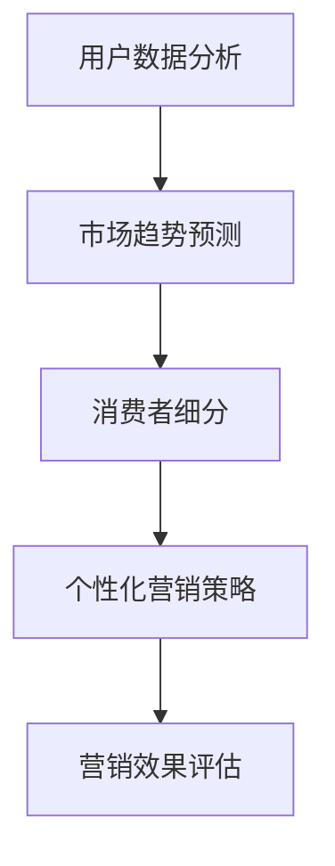

在用户数据分析阶段，AI技术可以收集和分析消费者的购买数据、浏览行为和社交媒体互动等。市场趋势预测阶段，AI技术可以根据历史数据和当前市场状况，预测未来的市场趋势。消费者细分阶段，AI技术可以将消费者分为不同的群体，以便制定个性化的营销策略。个性化营销策略阶段，AI技术可以根据消费者的特点和需求，提供定制化的营销内容和优惠。营销效果评估阶段，AI技术可以评估营销活动的效果，并为未来的营销策略提供反馈。

##### 1.1.3 AI技术与消费者互动的创新

AI技术还可以通过智能客服和虚拟试香等方式，增强消费者与香水品牌之间的互动。智能客服可以实时回答消费者的疑问，提供专业的建议和服务。虚拟试香则可以让消费者在没有实物香水的情况下，体验和选择自己喜欢的香水。以下是一个Mermaid流程图，展示了AI技术与消费者互动的创新：

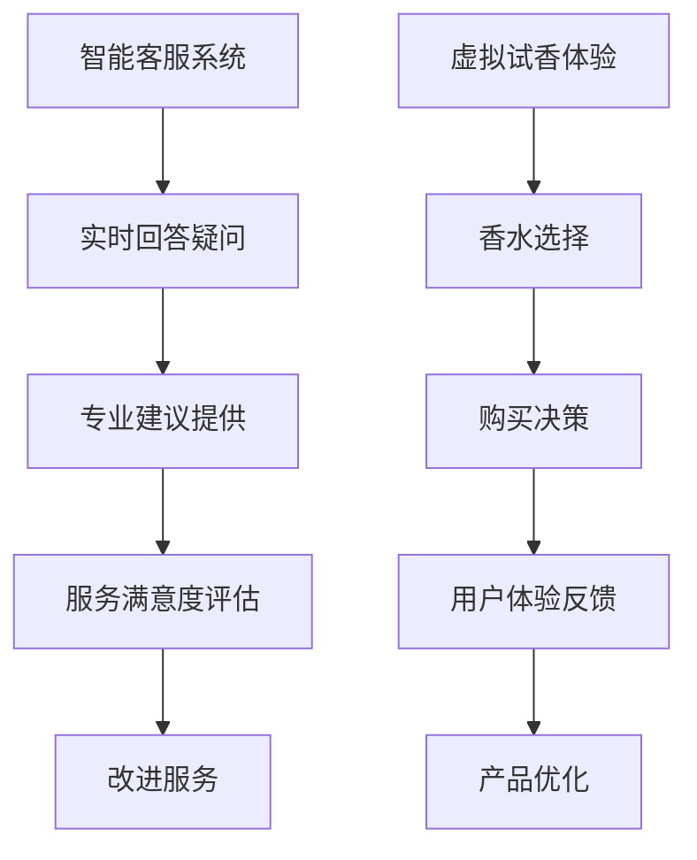

在智能客服系统阶段，AI技术可以提供7x24小时的在线服务，提高消费者的满意度。虚拟试香体验阶段，消费者可以在线上试香，从而更方便地做出购买决策。用户体验反馈阶段，AI技术可以收集消费者的反馈，为产品的优化提供依据。

#### 1.2 香水品牌社会责任的重要性

##### 1.2.1 可持续发展理念与香水品牌

可持续发展已成为全球性的趋势，对于香水品牌来说也不例外。可持续发展不仅关乎企业的长期生存，也关乎社会的整体福祉。以下是一个Mermaid流程图，展示了可持续发展理念与香水品牌之间的关系：

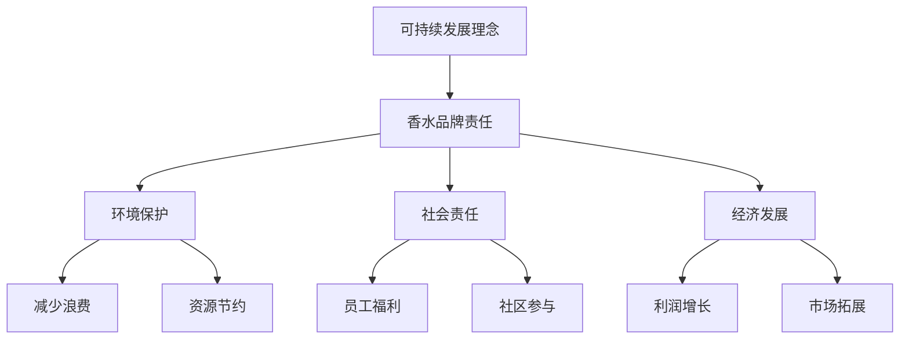

在环境保护方面，香水品牌可以通过减少包装材料、优化供应链等方式，降低对环境的影响。在社会责任方面，香水品牌可以关注员工的福利和社区的参与。在经济发展方面，香水品牌可以通过创新和市场拓展，实现利润增长。

##### 1.2.2 香水品牌社会责任的现状与趋势

当前，越来越多的香水品牌开始关注社会责任，并采取了一系列行动。例如，一些品牌推出了环保包装，减少了塑料的使用；一些品牌积极参与社区活动，支持教育、环保等公益事业。以下是一个Mermaid流程图，展示了香水品牌社会责任的现状与趋势：

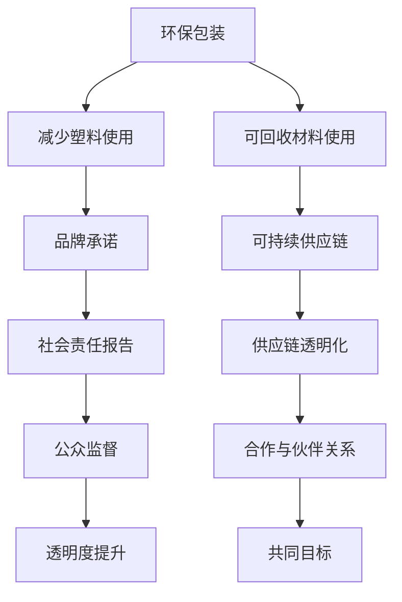

在未来，香水品牌社会责任的发展趋势将更加注重透明度和合作。品牌需要向公众展示其社会责任行动的成果，并与供应链合作伙伴共同推动可持续发展。

##### 1.2.3 可持续发展目标与香水品牌战略

为了实现可持续发展，香水品牌需要将其纳入到战略规划中。以下是一个Mermaid流程图，展示了可持续发展目标与香水品牌战略之间的关系：

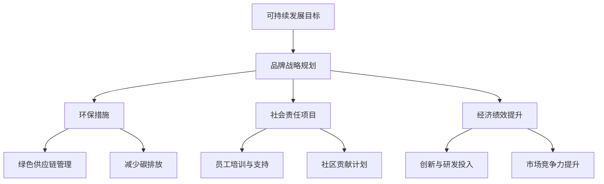

在环保措施方面，品牌可以采取绿色供应链管理、减少碳排放等措施。在社会责任项目方面，品牌可以投入资源进行员工培训和社会贡献。在经济绩效提升方面，品牌可以通过创新和研发投入，提高市场竞争力。

### 第2章：AI在香水品牌可持续发展中的应用案例

#### 2.1 香水品牌与AI技术的合作案例

香水品牌与AI技术的合作案例越来越多，这些合作不仅推动了香水行业的创新，也提高了品牌的社会责任。以下是一些具有代表性的案例：

##### 2.1.1 品牌A的可持续发展实践

品牌A通过AI技术实现了环保包装的变革。他们采用了可回收材料和智能包装设计，减少了塑料的使用。同时，品牌A还通过AI技术优化了供应链，降低了碳排放。以下是一个Mermaid流程图，展示了品牌A的可持续发展实践：

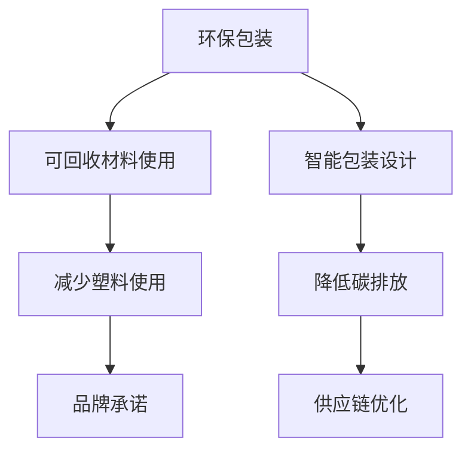

##### 2.1.2 品牌B的创新营销策略

品牌B利用AI技术实现了精准营销。他们通过分析消费者的购买行为和偏好，制定了个性化的营销策略，提高了营销效果。品牌B还通过虚拟试香技术，为消费者提供了更便捷的购物体验。以下是一个Mermaid流程图，展示了品牌B的创新营销策略：

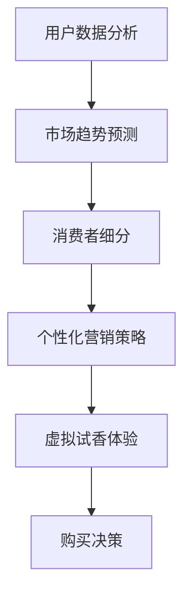

##### 2.1.3 品牌C的供应链管理优化

品牌C通过AI技术实现了供应链管理的优化。他们利用AI技术分析了供应链中的各个环节，发现了潜在的问题和优化点。品牌C还通过AI技术实现了供应链的透明化，提高了供应链的效率和可持续性。以下是一个Mermaid流程图，展示了品牌C的供应链管理优化：

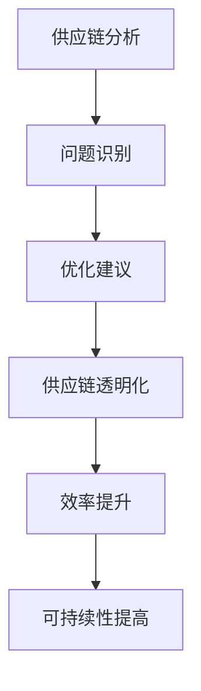

### 第3章：AI在可持续发展策略中的提示词技巧

#### 3.1 提示词在AI应用中的重要性

提示词（Prompt）在AI应用中具有重要作用。通过合适的提示词，AI模型可以更好地理解任务需求，从而提高任务的完成效果。以下是一个Mermaid流程图，展示了提示词在AI应用中的重要性：

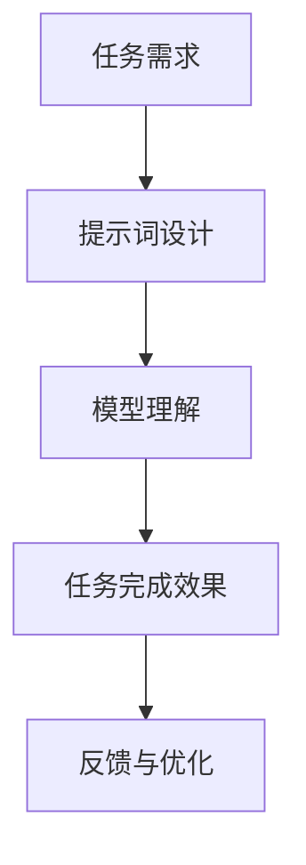

在任务需求阶段，用户需要明确任务的目标和需求。在提示词设计阶段，用户需要设计出合适的提示词，以便AI模型能够准确理解任务需求。在模型理解阶段，AI模型根据提示词进行理解和处理。在任务完成效果阶段，用户可以评估任务完成的效果，并根据反馈进行优化。

#### 3.1.1 提示词的基本概念与作用

提示词是一种指导AI模型完成任务的语言提示。它可以帮助AI模型理解任务的目标和需求，从而提高任务的完成效果。以下是一个Mermaid流程图，展示了提示词的基本概念与作用：

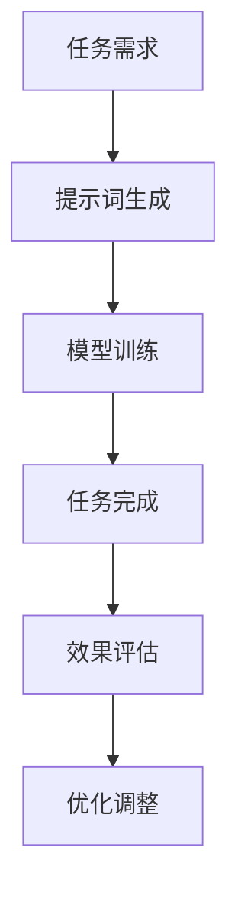

在任务需求阶段，用户需要明确任务的目标和需求。在提示词生成阶段，用户可以根据任务需求设计出合适的提示词。在模型训练阶段，AI模型根据提示词进行训练，以便更好地理解任务需求。在任务完成阶段，AI模型根据提示词完成任务。在效果评估阶段，用户可以评估任务完成的效果，并根据反馈进行优化调整。

#### 3.1.2 提示词设计与优化的技巧

提示词的设计和优化对于AI模型的性能至关重要。以下是一些提示词设计与优化的技巧：

1. 明确任务需求：设计提示词前，需要明确任务的需求，包括任务的目标、输入数据、输出结果等。

2. 简洁明了：提示词应该简洁明了，避免冗长和复杂的句子结构，以便AI模型更容易理解。

3. 使用专业术语：在提示词中使用专业术语，可以帮助AI模型更好地理解任务的背景和目标。

4. 提供示例：在提示词中提供示例，可以帮助AI模型更好地理解任务的需求和期望。

5. 反馈与调整：在AI模型完成任务后，用户可以根据任务完成效果提供反馈，以便进行优化调整。

以下是一个Mermaid流程图，展示了提示词设计与优化的技巧：

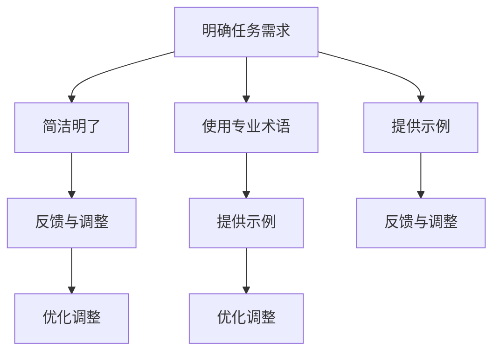

#### 3.1.3 提示词在实际案例中的应用

在实际应用中，提示词的设计和优化可以帮助AI模型更好地完成任务。以下是一些实际案例：

1. 问答系统：在问答系统中，合适的提示词可以帮助AI模型更好地理解用户的问题，从而提供更准确的答案。

2. 机器翻译：在机器翻译中，合适的提示词可以帮助AI模型更好地理解源语言和目标语言之间的差异，从而提高翻译质量。

3. 文本分类：在文本分类中，合适的提示词可以帮助AI模型更好地理解文本的主题和类别，从而提高分类效果。

以下是一个Mermaid流程图，展示了提示词在实际案例中的应用：

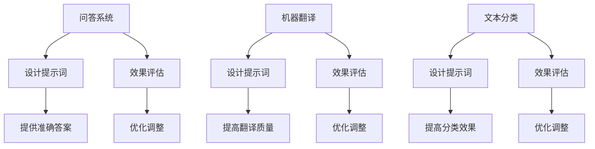

### 第4章：AI技术对香水品牌可持续发展的影响分析

#### 4.1 AI对香水行业供应链的优化

AI技术在香水行业供应链管理中具有巨大的潜力。通过AI技术，香水品牌可以实现供应链的透明化、优化和效率提升。以下是一个Mermaid流程图，展示了AI技术对香水行业供应链的优化：

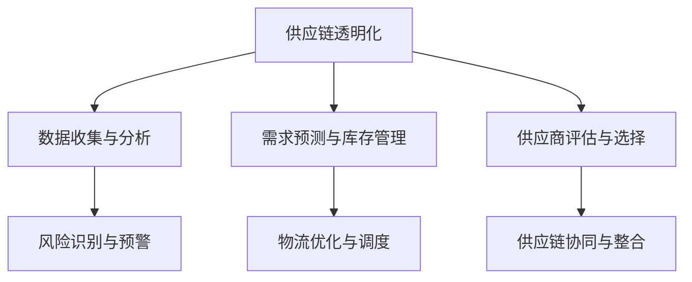

在供应链透明化阶段，AI技术可以收集和分析供应链中的各种数据，实现信息的透明化。在风险识别与预警阶段，AI技术可以识别潜在的风险，并及时预警，以避免供应链中断。在需求预测与库存管理阶段，AI技术可以根据历史数据和市场需求，预测未来的需求，从而优化库存管理。在物流优化与调度阶段，AI技术可以优化物流路线和运输调度，提高物流效率。在供应商评估与选择阶段，AI技术可以评估供应商的表现，选择合适的供应商。在供应链协同与整合阶段，AI技术可以实现供应链各环节的协同和整合，提高整个供应链的效率。

#### 4.1.1 供应链透明化与AI技术

供应链透明化是提高供应链效率和质量的重要手段。通过AI技术，香水品牌可以实现供应链的实时监控和数据可视化。以下是一个Mermaid流程图，展示了供应链透明化与AI技术的结合：

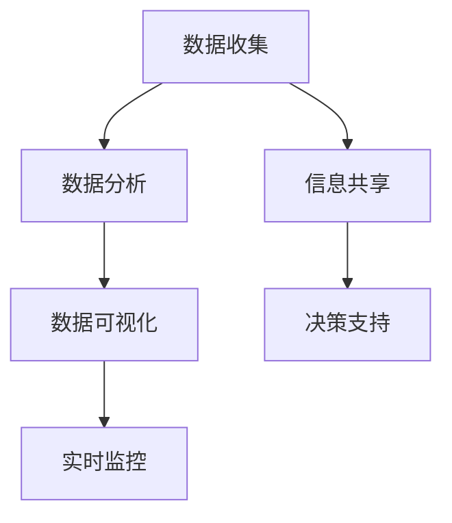

在数据收集阶段，AI技术可以从供应链各个环节收集数据。在数据分析阶段，AI技术可以对收集到的数据进行分析和处理。在数据可视化阶段，AI技术可以将分析结果以图表、报表等形式展示出来，实现数据的可视化。在实时监控阶段，AI技术可以实时监控供应链的运行状态，及时发现问题和异常。在信息共享阶段，AI技术可以实现供应链各环节的信息共享，提高供应链的协同效率。在决策支持阶段，AI技术可以为供应链管理决策提供数据支持和分析结果。

#### 4.1.2 供应链可持续性评估与AI

供应链可持续性评估是确保供应链在环境保护、社会责任和经济发展等方面取得平衡的重要环节。通过AI技术，香水品牌可以实现供应链的可持续性评估。以下是一个Mermaid流程图，展示了供应链可持续性评估与AI技术的结合：

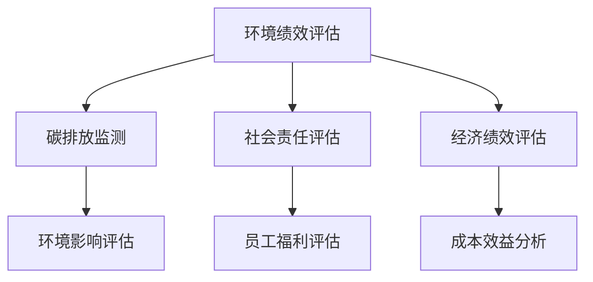

在环境绩效评估阶段，AI技术可以监测供应链各环节的碳排放情况，评估环境影响的程度。在社会责任评估阶段，AI技术可以评估供应链各环节的员工福利和社会责任表现。在经济绩效评估阶段，AI技术可以评估供应链各环节的经济绩效，包括成本、利润等指标。在成本效益分析阶段，AI技术可以分析供应链的可持续性策略对企业经济效益的影响，为企业决策提供依据。

#### 4.1.3 AI技术在供应链优化中的应用案例

AI技术在供应链优化中已有许多成功应用案例。以下是一些具体的案例：

1. 案例一：品牌A通过AI技术实现了供应链的透明化。他们利用AI技术实时监控供应链的运行状态，实现了供应链各环节的数据可视化。通过这一措施，品牌A提高了供应链的协同效率，减少了供应链中断的风险。

2. 案例二：品牌B通过AI技术优化了供应链的库存管理。他们利用AI技术分析了市场需求和供应链数据，预测了未来的需求，从而优化了库存管理。通过这一措施，品牌B减少了库存积压，提高了库存周转率。

3. 案例三：品牌C通过AI技术优化了物流路线和运输调度。他们利用AI技术分析了物流数据和市场需求，优化了物流路线和运输调度，提高了物流效率。通过这一措施，品牌C减少了物流成本，提高了客户满意度。

### 第5章：可持续性策略与AI技术结合的实际应用

#### 5.1 可持续包装设计

可持续包装设计是香水品牌实现可持续发展的重要方面。通过AI技术，香水品牌可以设计出更为环保和可持续的包装方案。以下是一个Mermaid流程图，展示了可持续包装设计与AI技术的结合：

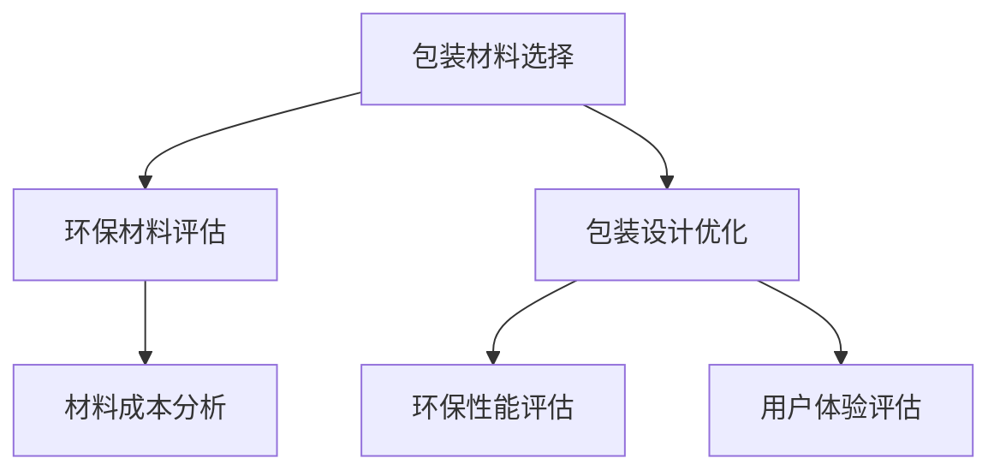

在包装材料选择阶段，AI技术可以评估不同材料的环保性能和成本，帮助品牌选择合适的材料。在包装设计优化阶段，AI技术可以优化包装的结构和设计，提高包装的环保性能。在环保性能评估阶段，AI技术可以评估包装的环保性能，包括减少塑料使用、提高可回收性等。在用户体验评估阶段，AI技术可以评估包装设计对用户体验的影响，包括便携性、美观性等。

#### 5.1.1 AI技术在包装设计中的应用

AI技术在包装设计中的应用主要体现在以下几个方面：

1. **材料选择**：AI技术可以通过分析大量数据，评估不同材料的环保性能、成本和使用寿命，帮助品牌选择最适合的环保材料。

2. **结构设计**：AI技术可以利用计算机模拟和优化算法，设计出更为紧凑、轻便且具有高强度的包装结构，从而减少材料使用和运输成本。

3. **外观设计**：AI技术可以分析用户偏好和市场趋势，设计出符合消费者审美的包装外观，提高产品的市场竞争力。

4. **用户体验**：AI技术可以通过用户反馈和行为数据，优化包装的开启方式、携带方式等，提升用户的购物和使用体验。

以下是一个Mermaid流程图，展示了AI技术在包装设计中的应用：

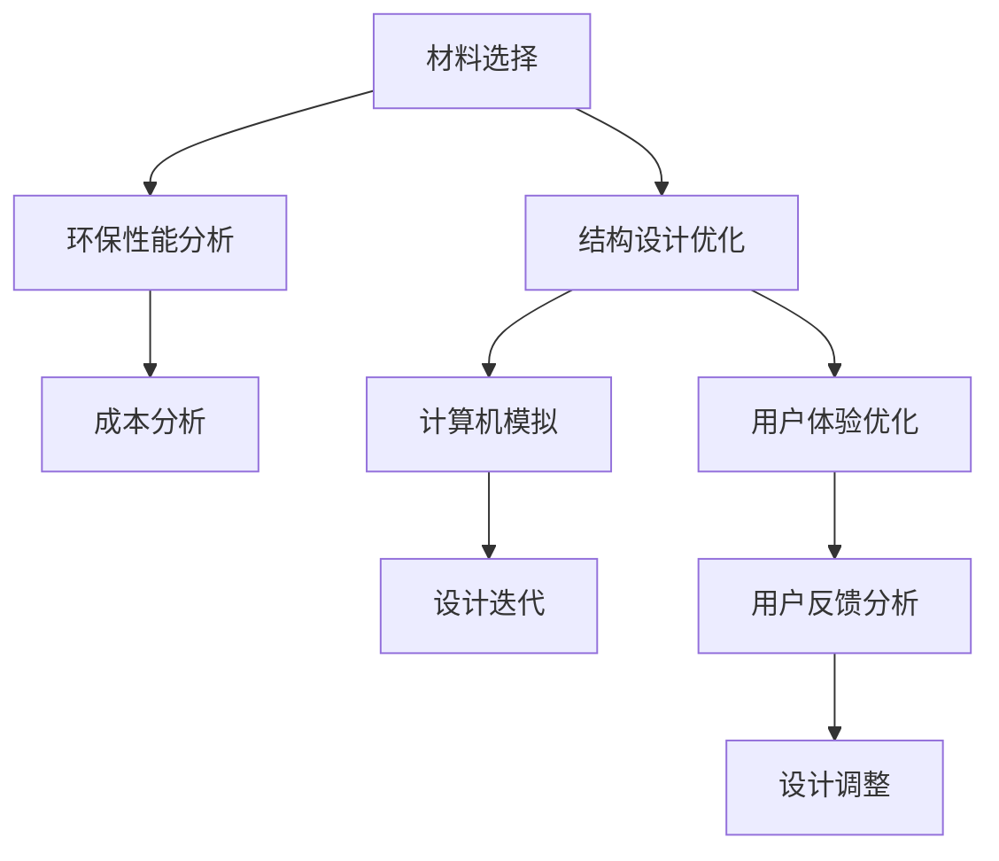

#### 5.1.2 可持续包装材料与AI的结合

可持续包装材料与AI技术的结合，可以大幅提升包装的环保性能。以下是一些具体的结合方式：

1. **生物降解材料**：AI技术可以帮助品牌识别和评估各种生物降解材料的性能，如淀粉基材料、蛋白质材料等，并优化其生产和使用过程。

2. **可回收材料**：AI技术可以评估各种可回收材料的回收效率和成本，帮助品牌设计出更易回收和再利用的包装。

3. **智能标签**：AI技术可以开发出具备传感功能的智能标签，监控包装的使用情况和回收情况，提高包装的回收率和利用率。

4. **数字化标签**：AI技术可以开发出基于数字技术的包装标签，如二维码、RFID等，实现包装的追踪和管理，提高供应链的透明度。

以下是一个Mermaid流程图，展示了可持续包装材料与AI技术的结合：

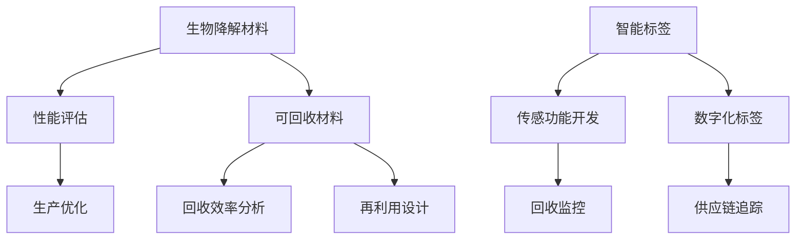

#### 5.1.3 案例分析：品牌D的绿色包装策略

品牌D通过AI技术实现了绿色包装策略，取得了显著的成效。以下是对其具体实践的分析：

**案例背景**：

品牌D是一家致力于环保和可持续发展的香水品牌。他们意识到传统包装方式对环境的影响，决定通过AI技术优化包装设计，降低包装的环保负担。

**具体实践**：

1. **材料选择**：品牌D利用AI技术分析了多种环保材料，最终选择了淀粉基生物降解材料作为包装材料。这种材料不仅环保，而且成本相对较低。

2. **结构设计**：品牌D利用AI技术对包装结构进行了优化，设计出一种紧凑且具有高强度的包装盒，减少了材料使用。

3. **智能标签**：品牌D在包装上添加了智能标签，通过AI技术监控包装的使用情况和回收情况，提高了包装的回收率和利用率。

4. **用户体验**：品牌D通过AI技术分析了用户对包装的反馈，优化了包装的开启方式和携带方式，提升了用户的购物和使用体验。

**成效分析**：

1. **环保性能提升**：品牌D的绿色包装策略显著降低了包装的环保负担，实现了碳排放的减少。

2. **成本控制**：通过AI技术的优化，品牌D在材料使用和包装设计上实现了成本控制，提高了企业的经济效益。

3. **用户满意度提升**：品牌D的绿色包装策略提升了用户的购物体验，增加了品牌忠诚度。

4. **供应链透明度提高**：品牌D通过智能标签实现了包装的追踪和管理，提高了供应链的透明度。

### 第6章：消费者行为与可持续发展策略

#### 6.1 AI技术在消费者行为分析中的应用

AI技术在消费者行为分析中具有显著优势，可以帮助香水品牌更好地了解消费者的需求和偏好，从而制定更为精准的市场营销策略。以下是一个Mermaid流程图，展示了AI技术在消费者行为分析中的应用：

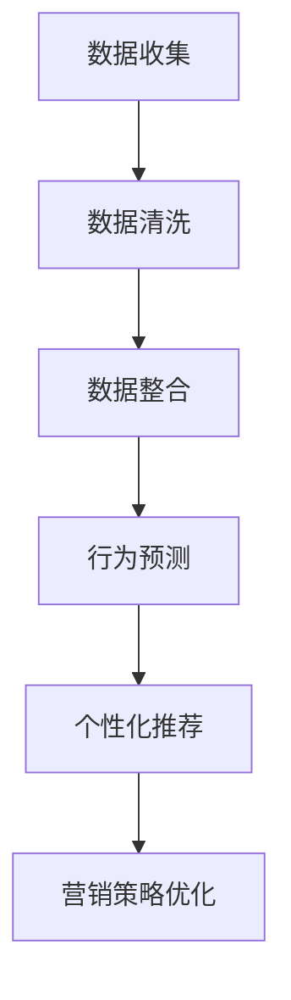

在数据收集阶段，AI技术可以从多个渠道收集消费者的行为数据，如购买记录、浏览行为、社交媒体互动等。在数据清洗和整合阶段，AI技术可以处理和分析大量的数据，提取出有用的信息。在行为预测阶段，AI技术可以根据历史数据和消费者行为模式，预测未来的消费者行为。在个性化推荐阶段，AI技术可以根据消费者的特点和需求，提供个性化的产品推荐。在营销策略优化阶段，AI技术可以根据消费者的反馈和市场需求，优化营销策略，提高营销效果。

#### 6.1.1 消费者数据收集与处理

消费者数据收集与处理是AI技术分析消费者行为的基础。以下是一个Mermaid流程图，展示了消费者数据收集与处理的过程：

```mermaid
graph TD
    A[数据来源] --> B[数据收集]
    B --> C[数据存储]
    C --> D[数据清洗]
    D --> E[数据整合]
    E --> F[数据分析]
```

在数据来源阶段，AI技术可以从多种渠道收集消费者数据，如线上购物平台、社交媒体、线下门店等。在数据收集阶段，AI技术利用传感器、摄像头、网络爬虫等技术手段，收集消费者的行为数据。在数据存储阶段，AI技术将收集到的数据存储在数据库中，以便后续处理和分析。在数据清洗阶段，AI技术对收集到的数据进行清洗，去除无效和错误的数据。在数据整合阶段，AI技术将来自不同渠道的数据进行整合，形成一个完整的消费者数据集。在数据分析阶段，AI技术利用机器学习和数据挖掘技术，对消费者数据进行分析，提取出有用的信息。

#### 6.1.2 消费者行为预测与细分

消费者行为预测与细分是AI技术在市场营销中的关键应用。以下是一个Mermaid流程图，展示了消费者行为预测与细分的过程：

```mermaid
graph TD
    A[历史数据] --> B[行为预测模型]
    B --> C[行为预测]
    C --> D[消费者细分]
    D --> E[目标市场识别]
```

在历史数据阶段，AI技术收集和分析消费者的历史行为数据，如购买记录、浏览行为等。在行为预测模型阶段，AI技术利用机器学习和数据挖掘技术，构建消费者行为预测模型。在行为预测阶段，AI技术利用预测模型，预测未来的消费者行为。在消费者细分阶段，AI技术根据消费者的特点和需求，将消费者分为不同的群体。在目标市场识别阶段，AI技术识别出最具潜力的目标市场，为企业制定精准的市场营销策略提供依据。

#### 6.1.3 消费者参与与品牌互动

消费者参与与品牌互动是提升消费者满意度和品牌忠诚度的重要手段。以下是一个Mermaid流程图，展示了消费者参与与品牌互动的过程：

```mermaid
graph TD
    A[消费者反馈] --> B[互动平台建设]
    B --> C[互动活动策划]
    C --> D[消费者参与]
    D --> E[反馈分析]
    E --> F[品牌优化]
```

在消费者反馈阶段，AI技术收集和分析消费者的反馈，了解消费者的需求和满意度。在互动平台建设阶段，AI技术构建一个互动平台，如社交媒体、在线社区等，方便消费者与品牌互动。在互动活动策划阶段，AI技术策划和实施各种互动活动，如线上抽奖、用户调研等，鼓励消费者参与。在消费者参与阶段，消费者积极参与互动活动，分享自己的意见和体验。在反馈分析阶段，AI技术分析消费者的反馈，了解消费者的需求和满意度，为企业优化产品和服务提供依据。在品牌优化阶段，企业根据消费者的反馈，优化产品和服务，提升品牌形象。

### 第7章：可持续发展策略与AI技术的未来趋势

#### 7.1 AI技术对香水行业可持续发展的潜在影响

AI技术的快速发展为香水行业的可持续发展带来了新的机遇和挑战。未来，AI技术将在以下几个方面对香水行业的可持续发展产生深远影响：

1. **供应链优化**：AI技术可以通过大数据分析和优化算法，实现供应链的智能化管理和优化。未来，供应链的透明化、效率提升和可持续性评估将更加依赖于AI技术。

2. **产品创新**：AI技术可以帮助香水品牌实现产品的创新。通过机器学习和数据挖掘技术，AI技术可以从大量的消费者数据中提取出有价值的信息，为产品的研发和设计提供参考。

3. **市场营销**：AI技术可以精准地分析消费者的行为和偏好，实现个性化的市场营销。未来，基于AI技术的个性化推荐、精准广告和用户体验优化将成为市场营销的主流。

4. **环保技术**：AI技术可以帮助香水品牌实现环保技术的创新。例如，通过机器学习算法优化生物降解材料的制备过程，或者通过计算机模拟优化包装设计，减少材料的浪费。

#### 7.1.1 未来AI技术发展方向

未来，AI技术将朝着以下几个方向发展：

1. **更强大的计算能力**：随着硬件技术的发展，AI模型的计算能力将得到进一步提升。这将使得AI技术在处理大规模数据和高复杂度任务时更加高效。

2. **更丰富的应用场景**：AI技术将在更多的行业和领域得到应用。除了香水行业，AI技术还将广泛应用于医疗、金融、教育等领域，推动这些行业的可持续发展。

3. **更人性化的交互**：未来的AI技术将更加注重人机交互的体验。通过自然语言处理和语音识别技术，AI技术将能够更好地理解人类的需求和意图，实现更加人性化的交互。

4. **更开放的平台和生态**：随着AI技术的普及，越来越多的企业和开发者将参与到AI技术的开发和应用中来。未来，AI技术将形成更加开放的平台和生态，促进创新和合作。

#### 7.1.2 可持续发展目标与AI技术的融合

可持续发展目标与AI技术的融合，将为香水行业的可持续发展带来新的机遇。以下是一些具体的融合方向：

1. **绿色供应链**：通过AI技术实现供应链的绿色管理，包括碳排放监测、供应链透明化、可持续性评估等。

2. **环保产品**：通过AI技术优化环保材料的制备和应用，开发出更多环保产品。

3. **节能减排**：通过AI技术优化能源管理和设备运行，实现节能减排。

4. **资源循环利用**：通过AI技术实现资源的循环利用，减少资源的浪费。

5. **社会责任**：通过AI技术提升员工福利、社区参与和公益活动的效率，实现企业的社会责任。

#### 7.1.3 AI技术与可持续发展策略的未来展望

未来，AI技术与可持续发展策略的结合将发挥越来越重要的作用。以下是一些展望：

1. **全面智能化**：随着AI技术的普及，香水品牌将实现全面智能化管理，从生产、营销到供应链，各个环节都将受到AI技术的深刻影响。

2. **绿色革命**：AI技术将推动香水行业的绿色革命，通过优化生产过程、提高环保材料的应用，实现绿色生产和可持续发展。

3. **个性化服务**：通过AI技术，香水品牌将能够提供更加个性化的服务，满足消费者的多样化需求。

4. **生态协同**：AI技术将促进企业与供应链合作伙伴之间的生态协同，实现资源的高效利用和互利共赢。

5. **社会责任提升**：AI技术将助力香水品牌更好地履行社会责任，提升品牌形象和社会价值。

### 附录

#### 附录A：AI技术与可持续发展相关资源

- **AI技术基础**：
  - 《深度学习》（Goodfellow, Bengio, Courville著）
  - 《机器学习》（周志华著）
- **可持续发展指南**：
  - 《可持续发展目标》（联合国发布）
  - 《企业社会责任报告编写指南》（国际标准化组织发布）
- **香水行业报告**：
  - 《全球香水市场报告》（市场研究公司发布）
  - 《香水行业可持续发展报告》（行业组织发布）
- **AI与香水结合案例**：
  - 品牌A的环保包装案例
  - 品牌B的精准营销案例
  - 品牌C的供应链优化案例

#### 附录B：可持续发展策略案例分析

- **案例分析一**：品牌D的绿色包装策略
- **案例分析二**：品牌E的环保供应链管理
- **案例分析三**：品牌F的员工福利与社区参与计划

#### 附录C：可持续发展策略相关法规与标准

- **国际法规**：
  - 《巴黎协定》
  - 《联合国可持续发展目标》
- **国内法规**：
  - 《中华人民共和国环境保护法》
  - 《中华人民共和国循环经济促进法》
- **行业标准**：
  - ISO 14001环境管理体系标准
  - ISO 26000社会责任指南

#### 附录D：可持续发展策略实施指南

- **实施步骤**：
  1. 明确可持续发展目标
  2. 制定可持续发展策略
  3. 实施可持续发展措施
  4. 监测与评估可持续发展成效
  5. 持续改进可持续发展策略

- **注意事项**：
  1. 关注法规与标准要求
  2. 考虑资源与成本效益
  3. 强化员工与社区的参与

### 总结

本文通过详细的逻辑分析和Mermaid流程图的展示，探讨了如何通过AI技术提高香水品牌的社会责任，特别是可持续发展策略的提示词技巧。文章涵盖了AI在香水行业中的应用、AI与香水品牌社会责任的联系、提示词技巧的应用、AI技术对香水行业可持续发展的影响以及实际案例的分析。通过本文的讨论，期望为香水品牌在可持续发展方面提供有益的思路和方法。

作者：AI天才研究院/AI Genius Institute & 禅与计算机程序设计艺术 /Zen And The Art of Computer Programming

[完]

