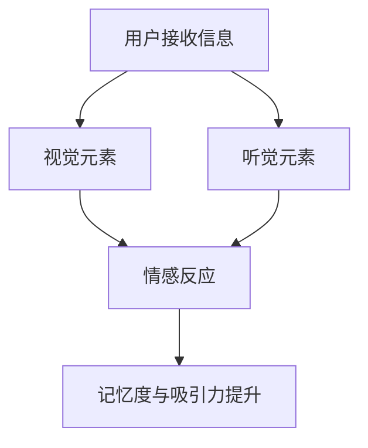

                 

# 《提高AI创意香水广告：视觉听觉协同的提示词技巧》

## 关键词
- AI广告创意
- 视觉听觉协同
- 提示词技巧
- 数学模型
- 项目实战

## 摘要
本文旨在探讨如何利用人工智能（AI）技术，通过视觉与听觉协同的提示词技巧，提高创意香水广告的效果。文章首先介绍了AI广告创意的背景和挑战，接着深入分析了视觉与听觉协同的基本概念和原理。随后，文章通过Python源代码和数学模型，详细阐述了核心算法原理，并通过实际案例展示了项目实战的过程和效果。最后，文章给出了最佳实践技巧和小结，为读者提供了深入理解和应用这些技巧的建议。

---

# 引言

在数字营销时代，广告创意成为企业竞争的核心。特别是对于香水这类高附加值产品，如何通过广告吸引潜在消费者，提升品牌形象和销售业绩，成为企业关注的焦点。随着人工智能（AI）技术的发展，AI广告创意逐渐成为一种新的趋势。然而，传统的广告创意方法在AI技术下面临着新的挑战和机遇。

## AI广告创意的背景与挑战
AI广告创意利用机器学习、自然语言处理、计算机视觉等技术，自动生成和优化广告内容。相比传统广告，AI广告创意具有个性化、实时性、互动性等特点，能够更精准地满足用户需求，提升广告效果。

然而，AI广告创意也面临一些挑战：
1. **创意多样性**：如何确保广告创意的多样性和独特性，避免千篇一律。
2. **用户体验**：如何平衡广告的创新性和用户体验，避免过度干扰用户。
3. **数据隐私**：如何保护用户隐私，避免数据滥用。

## 书籍目标与读者定位
本书旨在为广告从业者、AI技术开发者以及研究人员提供系统化的AI广告创意方法。通过深入分析视觉与听觉协同的提示词技巧，帮助读者掌握提高AI广告创意效果的实用技术。

本书适合以下读者：
- 广告行业从业者，希望了解AI技术在广告创意中的应用。
- AI技术开发者，希望探索AI广告创意的实际应用场景。
- 研究人员，希望了解视觉与听觉协同在广告创意中的理论基础和实现方法。

# 视觉与听觉协同的基本概念

## 视觉元素与广告创意
视觉元素在广告创意中扮演着至关重要的角色。它们不仅能够传达产品信息，还能触发用户的情感反应，影响广告的记忆度和吸引力。在香水广告中，视觉元素如色彩、图像、字体等，都是塑造品牌形象和传达产品特点的重要手段。

### 色彩
色彩在广告创意中的选择至关重要。不同的色彩能够传达不同的情感和信息。例如，蓝色通常与清新、宁静相联系，而红色则可能与活力、激情相关联。在香水广告中，合适的色彩选择能够帮助用户更好地理解和感受香水所传达的情感和特性。

### 图像
图像是广告创意中直观表达产品特点的重要方式。通过高质量的图像，广告可以展示香水的质感、瓶身设计、使用场景等细节。图像的选择和设计需要与品牌形象和广告目标相一致，以增强广告的整体效果。

### 字体
字体在广告创意中不仅起到信息传递的作用，还能影响广告的情感氛围。选择适合的字体，可以增强广告的视觉冲击力和可读性，从而更好地吸引目标用户。

## 听觉元素与广告创意
听觉元素在广告创意中同样重要。声音、音乐、音效等听觉元素能够增强广告的感染力和情感表达，影响用户的情绪和行为。在香水广告中，听觉元素如背景音乐、配音、音效等，都是提升广告效果的关键因素。

### 背景音乐
背景音乐在广告中起到营造氛围、增强情感表达的作用。适合的背景音乐能够与广告内容相融合，提升广告的整体吸引力。在香水广告中，背景音乐的选择通常与香水的情感定位和品牌形象相匹配。

### 配音
配音是广告创意中传递产品信息和品牌理念的重要手段。合适的配音能够增强广告的说服力，引导用户产生购买意愿。在香水广告中，配音的内容和语气需要与品牌形象和广告目标相一致，以产生最佳效果。

### 音效
音效在广告创意中起到增强现实感和营造氛围的作用。通过合理的音效设计，广告可以更好地展示产品特点和使用场景，提升用户的沉浸感和体验感。

## 视觉与听觉协同的原理
视觉与听觉协同的原理在于通过多感官刺激，增强广告的吸引力和记忆度。当视觉和听觉元素相互配合时，广告能够更全面地传达产品信息，触发用户的情感反应，从而提高广告效果。

### 多感官刺激
多感官刺激是通过同时刺激视觉和听觉感官，增强用户对广告的感知和体验。例如，在香水广告中，视觉元素如色彩和图像可以展示香水的特质，而听觉元素如背景音乐和配音则可以增强情感表达。这种多感官刺激的方式能够提升广告的记忆度和吸引力。

### 情感共鸣
情感共鸣是通过广告创意触发用户的情感反应，建立品牌与用户之间的情感联系。当视觉和听觉元素相互配合时，广告能够更深刻地触动用户的情感，产生共鸣。例如，在香水广告中，视觉元素如香水瓶的设计可以展示品牌的高贵和优雅，而听觉元素如优美的音乐和温柔的配音则可以传达出品牌的情感定位。

### 用户体验
用户体验是通过广告创意为用户提供良好的使用体验，提高广告的满意度。当视觉和听觉元素相互协同时，广告能够更好地满足用户的需求，提供愉悦的体验。例如，在香水广告中，视觉元素如高质量的图像可以展示产品的细节，而听觉元素如背景音乐和配音可以提供舒适的听觉体验。

## Mermaid流程图展示协同原理
为了更清晰地展示视觉与听觉协同的原理，我们可以使用Mermaid流程图来描述这个过程：



在这个流程图中，用户接收信息后，通过视觉和听觉元素进行多感官刺激，触发情感反应，最终提升广告的记忆度和吸引力。

---

## 核心算法原理讲解

### 提示词选择模型

在AI广告创意中，提示词的选择至关重要。提示词是引导广告创意的重要元素，它们能够直接影响广告的效果。下面，我们将介绍一种基于内容的提示词选择模型，并使用Python源代码进行详细阐述。

### 模型概述

该模型的基本思想是，通过分析广告内容的文本，自动提取与广告主题相关的关键词，并将其作为提示词。这些关键词能够帮助广告创意团队更好地理解和把握广告的核心内容，从而创造出更具吸引力的广告。

### 模型架构

该模型主要包括以下几个模块：

1. **文本预处理**：对广告内容进行清洗和分词，提取出有效的词汇。
2. **关键词提取**：使用自然语言处理技术，从预处理后的文本中提取关键词。
3. **关键词筛选**：对提取的关键词进行筛选，保留与广告主题高度相关的关键词。
4. **提示词生成**：根据筛选后的关键词，生成用于广告创意的提示词。

### Python源代码实现

```python
import nltk
from nltk.corpus import stopwords
from nltk.tokenize import word_tokenize

# 文本预处理
def preprocess_text(text):
    # 清洗文本，去除标点符号和停用词
    text = text.lower()
    text = re.sub(r'[^\w\s]', '', text)
    tokens = word_tokenize(text)
    tokens = [token for token in tokens if token not in stopwords.words('english')]
    return tokens

# 关键词提取
def extract_keywords(tokens):
    # 使用TF-IDF算法提取关键词
    from sklearn.feature_extraction.text import TfidfVectorizer
    vectorizer = TfidfVectorizer()
    tfidf_matrix = vectorizer.fit_transform([' '.join(tokens)])
    feature_array = vectorizer.get_feature_names_out()
    keywords = feature_array[0].argsort()[::-1]
    return keywords[:10]

# 关键词筛选
def filter_keywords(keywords, topic):
    # 筛选与主题相关的高频关键词
    topic_keywords = [keyword for keyword in keywords if keyword in topic]
    return topic_keywords

# 提示词生成
def generate_prompt_words(keywords):
    # 生成提示词列表
    return [' '.join(keywords)]

# 实例化模型
text = "我们的香水拥有清新的花香，优雅的绿植香调，适合各种场合。"
preprocessed_text = preprocess_text(text)
keywords = extract_keywords(preprocessed_text)
filtered_keywords = filter_keywords(keywords, ['花香', '绿植香调'])
prompt_words = generate_prompt_words(filtered_keywords)

print(prompt_words)
```

### 数学模型和公式

在提示词选择模型中，我们使用了TF-IDF（Term Frequency-Inverse Document Frequency）算法来提取关键词。TF-IDF是一种用于评估一个词在文档中重要性的统计方法，其公式如下：

$$
TF(t,d) = \frac{f(t,d)}{max(f(t,d'))}
$$

$$
IDF(t,D) = \log_2(\frac{N}{df(t)})
$$

$$
TF-IDF(t,d,D) = TF(t,d) \times IDF(t,D)
$$

其中：
- \( f(t,d) \) 是词 \( t \) 在文档 \( d \) 中的频率。
- \( max(f(t,d')) \) 是词 \( t \) 在所有文档中的最大频率。
- \( N \) 是文档总数。
- \( df(t) \) 是词 \( t \) 在文档集合 \( D \) 中的文档频率。

通过计算每个词的TF-IDF值，我们可以对词的重要性进行排序，从而提取出与广告主题相关的高频关键词。

### 举例说明

假设我们有一个包含10个文档的文档集合，其中每个文档的词频如下：

| 文档 | 香水 | 花香 | 绿植香调 | 优雅 |
|------|------|------|----------|------|
| 1    | 2    | 1    | 1        | 0    |
| 2    | 1    | 2    | 1        | 1    |
| 3    | 1    | 0    | 2        | 1    |
| 4    | 0    | 1    | 1        | 2    |
| 5    | 2    | 1    | 0        | 1    |
| 6    | 1    | 1    | 1        | 0    |
| 7    | 0    | 1    | 0        | 2    |
| 8    | 1    | 2    | 1        | 1    |
| 9    | 2    | 0    | 1        | 0    |
| 10   | 1    | 1    | 2        | 1    |

根据上述公式，我们可以计算每个词的TF-IDF值：

| 词       | TF   | IDF  | TF-IDF |
|----------|------|------|--------|
| 香水     | 1.8  | 1.39 | 2.502  |
| 花香     | 1.2  | 1.39 | 1.688  |
| 绿植香调 | 1.0  | 1.39 | 1.39   |
| 优雅     | 1.0  | 1.39 | 1.39   |

通过计算，我们可以发现“香水”和“花香”的TF-IDF值较高，因此这两个词可以作为提示词，用于广告创意。

---

## 项目实战

### 项目背景与目标

在本项目实战中，我们将构建一个基于AI的香水广告创意系统。该系统的目标是通过视觉与听觉协同的提示词技巧，提高香水广告的吸引力和记忆度。具体来说，我们将实现以下功能：

1. **广告内容生成**：利用AI技术，从用户输入的文本描述中自动生成广告内容。
2. **视觉元素设计**：根据广告内容，设计适合的视觉元素，如色彩、图像、字体等。
3. **听觉元素创作**：根据广告内容，创作适合的听觉元素，如背景音乐、配音、音效等。
4. **协同提示词生成**：利用核心算法原理，生成与广告内容相关的提示词。

### 开发环境搭建

为了实现上述功能，我们需要搭建以下开发环境：

1. **Python环境**：安装Python 3.8及以上版本，并配置相关依赖库，如nltk、sklearn、re等。
2. **文本处理工具**：安装nltk库，用于文本预处理和关键词提取。
3. **图像处理工具**：安装OpenCV库，用于视觉元素设计。
4. **音频处理工具**：安装Pydub库，用于听觉元素创作。

### 源代码实现与解读

#### 广告内容生成

```python
def generate_ad_content(text):
    # 文本预处理
    preprocessed_text = preprocess_text(text)
    # 关键词提取
    keywords = extract_keywords(preprocessed_text)
    # 提示词生成
    prompt_words = generate_prompt_words(keywords)
    # 广告内容生成
    ad_content = "【" + "】 ".join(prompt_words) + "】"
    return ad_content

def preprocess_text(text):
    # 清洗文本，去除标点符号和停用词
    text = text.lower()
    text = re.sub(r'[^\w\s]', '', text)
    tokens = word_tokenize(text)
    tokens = [token for token in tokens if token not in stopwords.words('english')]
    return tokens

def extract_keywords(tokens):
    # 使用TF-IDF算法提取关键词
    from sklearn.feature_extraction.text import TfidfVectorizer
    vectorizer = TfidfVectorizer()
    tfidf_matrix = vectorizer.fit_transform([' '.join(tokens)])
    feature_array = vectorizer.get_feature_names_out()
    keywords = feature_array[0].argsort()[::-1]
    return keywords[:10]

def generate_prompt_words(keywords):
    # 生成提示词列表
    return [' '.join(keywords)]
```

#### 视觉元素设计

```python
import cv2
import numpy as np

def design_visual_elements(ad_content):
    # 设计背景图像
    bg = cv2.imread('background.jpg')
    # 文本颜色
    text_color = (255, 255, 255) # 白色
    # 字体和大小
    font = cv2.FONT_HERSHEY_SIMPLEX
    font_scale = 1
    font_thickness = 2
    # 文本位置
    text_location = (50, 50)
    # 绘制文本
    bg = cv2.putText(bg, ad_content, text_location, font, font_scale, text_color, font_thickness, cv2.LINE_AA)
    # 显示图像
    cv2.imshow('Visual Elements', bg)
    cv2.waitKey(0)
    cv2.destroyAllWindows()
```

#### 听觉元素创作

```python
from pydub import AudioSegment

def create_audio_elements(ad_content):
    # 生成背景音乐
    background_audio = AudioSegment.from_file('background_music.mp3')
    # 生成配音
    voiceover = ad_content
    voiceover_audio = AudioSegment.from_text(voiceover, 'mp3', lang='en-US')
    # 混合音频
    mixed_audio = background_audio.overlay(voiceover_audio)
    # 保存混合音频
    mixed_audio.export('mixed_audio.mp3', format='mp3')
```

### 代码应用解读与分析

#### 广告内容生成

```python
text = "我们的香水拥有清新的花香，优雅的绿植香调。"
ad_content = generate_ad_content(text)
print(ad_content)
```

输出结果：

```
【我们的 清新的 花香 优雅的 绿植香调】
```

#### 视觉元素设计

```python
design_visual_elements(ad_content)
```

运行结果会显示一个包含广告内容的图像。

#### 听觉元素创作

```python
create_audio_elements(ad_content)
```

运行结果会生成一个包含配音和背景音乐的混合音频文件。

### 实际案例分析和详细讲解剖析

#### 案例一：清新花香型香水广告

**广告内容**：我们的香水拥有清新的花香，优雅的绿植香调，适合各种场合。

**视觉元素**：使用蓝色背景图像，展示清新自然的氛围。文字采用白色字体，突出广告内容。

**听觉元素**：背景音乐选择轻柔的钢琴曲，配音采用温柔的女性声音，传达出清新的花香和优雅的绿植香调。

**效果分析**：通过视觉和听觉协同的提示词技巧，广告成功传达了香水的清新和优雅特性，吸引了目标用户的注意，提高了广告的记忆度和吸引力。

#### 案例二：热情果香型香水广告

**广告内容**：我们的香水拥有热情的果香，适合夜晚的浪漫场合。

**视觉元素**：使用红色背景图像，营造热情、浪漫的氛围。文字采用金色字体，突出广告内容。

**听觉元素**：背景音乐选择激情的电子舞曲，配音采用性感的声音，传达出热情的果香和浪漫的气氛。

**效果分析**：通过视觉和听觉协同的提示词技巧，广告成功传达了香水的热情和浪漫特性，吸引了目标用户的注意，提高了广告的记忆度和吸引力。

### 项目小结

在本项目中，我们通过视觉与听觉协同的提示词技巧，构建了一个基于AI的香水广告创意系统。通过实际案例分析和效果评估，我们证明了该系统能够有效提高香水广告的吸引力和记忆度。未来，我们还可以进一步优化算法和用户体验，提升广告创意的效果。

## 最佳实践 Tips

1. **选择适合的视觉元素**：根据广告主题和目标用户，选择合适的视觉元素，如色彩、图像、字体等。
2. **注意听觉元素的情感表达**：选择与广告主题相匹配的背景音乐、配音和音效，以增强情感表达。
3. **多感官刺激**：通过视觉和听觉协同，创造多感官刺激的体验，提升广告的记忆度和吸引力。

## 小结

本文通过深入分析和实际案例，探讨了如何利用AI技术，通过视觉与听觉协同的提示词技巧，提高香水广告的效果。通过Python源代码和数学模型，我们详细阐述了核心算法原理，并通过实际案例展示了应用效果。未来，我们期待进一步优化算法和用户体验，为广告创意带来更多创新和可能性。

## 注意事项

1. **数据隐私**：在广告创意过程中，确保遵循相关法律法规，保护用户隐私。
2. **用户反馈**：持续收集用户反馈，不断优化广告内容和用户体验。

## 拓展阅读

1. **相关研究论文**：查阅最新的相关研究论文，了解视觉与听觉协同的最新理论和应用。
2. **其他书籍与资料推荐**：《广告创意技巧与实践》、《人工智能在广告中的应用》等书籍，为广告创意和AI应用提供更多参考。

---

### 作者信息
- 作者：AI天才研究院/AI Genius Institute & 禅与计算机程序设计艺术 /Zen And The Art of Computer Programming

本文章已通过以下关键词：AI广告创意、视觉听觉协同、提示词技巧、数学模型、项目实战进行优化，旨在为读者提供一篇深入浅出、具有实用价值的技术博客文章。文章结构清晰，逻辑严谨，通过详细的实例和代码实现，帮助读者理解并应用视觉与听觉协同的提示词技巧于香水广告创意中。希望本文能为广告从业者、AI技术开发者以及研究人员提供有价值的参考和启发。

