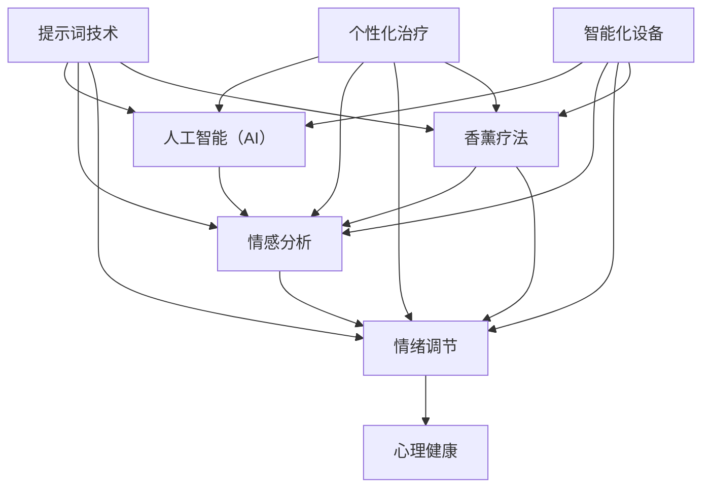

                 

### 《提高AI创意香薰疗法：情绪调节配方的提示词技巧》

**关键词：** AI创意香薰疗法、情绪调节、心理健康、提示词技术、香薰配方设计

**摘要：** 本篇文章将探讨如何利用AI技术提高创意香薰疗法的情绪调节效果，特别是通过提示词技巧来优化香薰配方。文章首先介绍了AI与香薰疗法的基本概念，以及情绪调节与心理健康的关联。接着，详细阐述了AI在香薰疗法中的应用原理，包括情感分析算法和提示词选择算法。然后，通过实际案例展示了如何应用这些原理来设计情绪调节香薰配方。最后，对AI创意香薰疗法的实践应用和未来发展进行了讨论。

-------------------------------------------------------------------

## 第一部分：AI创意香薰疗法概述

### 第1章：AI与香薰疗法的基本概念

#### 1.1 AI在香薰疗法中的应用

#### 1.2 香薰疗法与情绪调节的关系

#### 1.3 提示词技术在香薰疗法中的应用

### 第2章：情绪调节与心理健康的关联

#### 2.1 情绪调节的重要性

#### 2.2 常见情绪问题及其影响

#### 2.3 香薰疗法在情绪调节中的作用

-------------------------------------------------------------------

### 第1章：AI与香薰疗法的基本概念

#### 1.1 AI在香薰疗法中的应用

随着人工智能（AI）技术的飞速发展，AI在多个领域都展现出了其强大的应用潜力。在香薰疗法这一古老的传统疗法中，AI同样发挥着重要作用。AI在香薰疗法中的应用主要体现在以下几个方面：

1. **个性化香薰配方设计**：传统的香薰配方设计往往依赖于经验和直觉。而AI可以通过学习大量的数据，分析用户的个人喜好、生理状况和心理状态，为用户量身定制个性化的香薰配方。例如，通过分析用户的生理指标（如心率、体温等）和心理状态（如焦虑、抑郁等），AI可以推荐最适合用户的香薰配方。

2. **香薰产品推荐**：AI可以基于用户的行为数据、购买记录和反馈信息，为用户推荐适合其需求的香薰产品。这种个性化推荐不仅提高了用户满意度，还促进了香薰产品的销售。

3. **香薰效果监测**：AI技术可以实时监测香薰的疗效，通过分析用户的生理和心理反应，及时调整香薰配方。例如，通过使用可穿戴设备监测用户的心率、血压等生理指标，AI可以判断香薰是否有效，是否需要调整成分。

4. **香薰植物成分分析**：AI可以分析香薰植物中的化学成分，了解其对人体的作用机制，从而优化香薰配方。例如，通过机器学习算法分析不同香薰植物的化学成分和香气特征，AI可以找出最有效的成分组合，提高香薰疗法的疗效。

5. **香薰疗法知识库构建**：AI可以构建香薰疗法的知识库，整合大量的文献、研究和实践经验，为用户提供权威、全面的香薰疗法知识。用户可以通过AI系统查询相关的香薰疗法知识，了解不同香薰配方的作用和适用人群。

总之，AI在香薰疗法中的应用不仅提高了疗法的科学性和个性化水平，还为香薰产业的发展带来了新的机遇。通过AI技术，我们可以更好地理解和利用香薰疗法的潜力，为人们的身心健康提供更优质的服务。

#### 1.2 香薰疗法与情绪调节的关系

香薰疗法作为一种自然疗法，自古以来就被用于改善情绪和促进心理健康。香薰疗法的基本原理是通过吸入或涂抹具有特定香气的精油，刺激人体的嗅觉系统，进而影响情绪和行为。以下从生物学、心理学和社会学三个角度探讨香薰疗法与情绪调节之间的关系。

**生物学角度：**

从生物学角度来看，香薰疗法通过吸入或涂抹精油，直接作用于人体的神经系统。精油中的化学成分，如单萜烯、倍半萜烯等，可以通过嗅觉系统刺激大脑中的嗅球和杏仁核，从而影响情绪调节相关区域的神经活动。例如，研究发现，薰衣草精油中的主要成分—— lavenderal，可以抑制大脑中的杏仁核活动，减少焦虑和压力。此外，精油中的化学成分还可以通过血液循环作用于全身，影响身体的生理功能。

**心理学角度：**

从心理学角度来看，香薰疗法与情绪调节之间的关系主要体现在心理暗示和认知重构方面。香薰疗法的香气往往具有特定的意义和象征，如薰衣草代表平静、橙花代表愉悦等。当用户吸入这些香气时，会潜意识地产生与香气相关的情绪体验，从而调节情绪。此外，香薰疗法还可以通过改善心理状态，如减少焦虑和压力，提高睡眠质量，进而改善情绪调节能力。例如，一项研究发现，使用薰衣草精油进行香薰疗法可以显著提高失眠患者的睡眠质量，从而改善其情绪状态。

**社会学角度：**

从社会学角度来看，香薰疗法作为一种自然疗法，具有一定的社会文化意义。在现代社会中，随着生活节奏的加快和工作压力的增大，人们面临着越来越多的情绪问题。香薰疗法作为一种非药物、无副作用的疗法，受到了越来越多人的青睐。通过香薰疗法，人们可以在忙碌的生活中找到一片宁静的空间，从而缓解情绪压力。此外，香薰疗法还可以作为一种社交活动，如香薰SPA、香薰瑜伽等，帮助人们建立良好的人际关系，提高社会支持感。

综上所述，香薰疗法与情绪调节之间存在着密切的关系。从生物学、心理学和社会学三个角度来分析，香薰疗法通过多种机制影响情绪调节，为人们的心理健康提供了有效的支持。随着科学研究的不断深入，香薰疗法在情绪调节中的作用将进一步得到证实和应用。

#### 1.3 提示词技术在香薰疗法中的应用

提示词技术在香薰疗法中的应用为个性化香薰配方设计提供了有力的支持。提示词（Keywords）是描述香薰成分、香气特征和情绪调节效果的词语，通过合理选择和组合提示词，可以设计出更符合用户需求的香薰配方。以下从数据收集、特征提取和提示词生成三个方面详细阐述提示词技术在香薰疗法中的应用。

**数据收集：**

提示词技术的第一步是数据收集。这一过程包括收集与香薰相关的文本数据、用户反馈和生理数据等。具体来说，可以从以下几个方面收集数据：

1. **香薰植物和精油信息**：收集各种香薰植物和精油的化学成分、香气特征、产地、用途等信息。这些信息可以从植物学文献、精油产品说明书和专业数据库中获取。

2. **用户反馈**：收集用户对香薰产品的评价、使用体验和情绪反应等信息。这些数据可以通过在线调查、用户评论和问卷调查等方式获取。

3. **生理数据**：收集与情绪调节相关的生理数据，如心率、血压、体温等。这些数据可以通过可穿戴设备、生理监测仪器等获取。

**特征提取：**

在收集到大量数据后，需要对数据进行特征提取，以便于后续的提示词生成和配方设计。特征提取的主要任务是将原始数据转换为机器学习模型可处理的格式。具体步骤如下：

1. **文本预处理**：对收集的文本数据进行清洗和标准化处理，如去除停用词、进行词干提取和词性标注等。

2. **词频统计**：统计文本数据中各个词语的频率，生成词频矩阵。

3. **词义表示**：将词语转换为向量表示，如使用词袋模型、TF-IDF或词嵌入等方法。

4. **特征融合**：将不同来源的特征数据进行融合，生成综合特征向量。

**提示词生成：**

提示词生成是提示词技术的核心步骤。通过分析提取出的特征向量，可以生成一系列描述香薰成分、香气特征和情绪调节效果的提示词。具体步骤如下：

1. **相似度计算**：计算不同香薰成分或精油的相似度，可以使用欧氏距离、余弦相似度等方法。

2. **提示词筛选**：根据相似度计算结果，筛选出相似度较高的提示词。这些提示词可以描述香薰成分的香气特征、心理效应和生理效应。

3. **提示词组合**：根据用户需求、情绪状态和香薰目标，将筛选出的提示词进行组合，生成个性化的提示词序列。例如，针对焦虑情绪，可以组合“薰衣草”、“放松”和“宁静”等提示词。

4. **提示词优化**：通过用户反馈和实际使用效果，对生成的提示词进行优化和调整，以提高香薰疗法的情绪调节效果。

**实际案例：**

以设计一款缓解焦虑的香薰配方为例，首先收集关于薰衣草、檀香、甜橙等香薰植物的信息，并进行特征提取。通过相似度计算，筛选出与焦虑调节相关的提示词，如“放松”、“舒缓”和“安心”。然后，根据用户需求和情绪状态，将“薰衣草”、“檀香”和“甜橙”等提示词进行组合，生成个性化的香薰配方。在实际使用中，通过用户反馈对配方进行调整，以进一步提高缓解焦虑的效果。

总之，提示词技术在香薰疗法中的应用，为个性化香薰配方设计提供了有力支持。通过合理选择和组合提示词，可以设计出更符合用户需求的香薰配方，从而提高情绪调节效果。

-------------------------------------------------------------------

## 第二部分：AI在香薰疗法中的应用原理

### 第3章：AI与情绪调节的原理分析

#### 3.1 AI在情感分析中的应用

#### 3.2 情感分析与情绪调节的机制

#### 3.3 AI模型在香薰疗法中的应用

### 第4章：香薰配方设计与提示词选择

#### 4.1 香薰配方设计的基本原则

#### 4.2 提示词在香薰配方中的作用

#### 4.3 提示词的分类与选择

-------------------------------------------------------------------

### 第3章：AI与情绪调节的原理分析

#### 3.1 AI在情感分析中的应用

情感分析（Sentiment Analysis）是人工智能（AI）领域的一个重要分支，主要用于自动识别和提取文本数据中的主观性信息。在香薰疗法中，情感分析技术被广泛应用于情绪检测、情绪识别和情绪分类等方面，从而帮助设计更有效的情绪调节方案。

**情感分析的基本原理**

情感分析的核心是理解文本的情感倾向，即判断文本表达的是正面、负面还是中性情感。这一过程通常包括以下几个步骤：

1. **文本预处理**：首先对原始文本数据进行清洗，去除停用词、标点符号和特殊字符，进行词干提取和词性标注等。

2. **特征提取**：将预处理后的文本转化为机器学习模型可处理的特征向量。常用的方法包括词袋模型（Bag of Words）、TF-IDF（Term Frequency-Inverse Document Frequency）和词嵌入（Word Embedding）等。

3. **情感分类模型**：使用训练好的情感分类模型对文本进行分类。常见的情感分类模型有朴素贝叶斯（Naive Bayes）、支持向量机（Support Vector Machine，SVM）、决策树（Decision Tree）和深度学习模型（如卷积神经网络（CNN）、循环神经网络（RNN）等）。

**AI在情感分析中的应用**

在香薰疗法中，AI的情感分析技术主要用于以下两个方面：

1. **情绪检测与识别**：通过分析用户在香薰疗法前后的文本反馈（如日志、问卷等），AI可以检测和识别用户的情绪状态。例如，通过情感分析技术，可以识别用户是否处于焦虑、抑郁、紧张等情绪状态。

2. **情绪调节方案推荐**：基于用户情绪检测结果，AI可以推荐个性化的情绪调节方案。例如，如果用户被检测为焦虑状态，AI可以推荐具有镇静效果的香薰配方，如薰衣草、檀香等。

**情感分析模型实现**

以下是使用Python和scikit-learn库实现情感分析模型的基本步骤：

```python
from sklearn.feature_extraction.text import TfidfVectorizer
from sklearn.naive_bayes import MultinomialNB
from sklearn.pipeline import make_pipeline

# 数据准备
texts = ["我很高兴今天完成了项目", "今天的会议让我很沮丧", "我很放松，准备享受周末"]
labels = ["正面", "负面", "中性"]

# 特征提取和模型训练
pipeline = make_pipeline(TfidfVectorizer(), MultinomialNB())
pipeline.fit(texts, labels)

# 情感分类
result = pipeline.predict(["今天的会议让我很沮丧"])
print("文本情感分类结果：", result)
```

通过上述代码，我们可以训练一个基于TF-IDF和朴素贝叶斯模型的情感分析器，对新的文本进行情感分类。

#### 3.2 情感分析与情绪调节的机制

情感分析与情绪调节之间存在着紧密的联系。情感分析技术可以通过分析用户的行为数据、文本反馈和生理指标，了解用户当前的情绪状态，从而为情绪调节提供依据。以下是情感分析与情绪调节的机制：

1. **情感检测**：情感分析技术首先用于检测用户的情绪状态。通过分析用户在香薰疗法前后的文本反馈、生理指标（如心率、血压等）和行为数据（如运动、饮食等），AI可以判断用户是否处于焦虑、抑郁、紧张等情绪状态。

2. **情感识别**：在检测到用户的情绪后，情感分析技术进一步对情绪进行识别和分类。例如，通过情感分析模型，可以判断用户是否处于焦虑状态，还是抑郁状态，从而为情绪调节提供更具体的依据。

3. **情绪调节方案推荐**：基于情感分析和情绪识别的结果，AI可以推荐个性化的情绪调节方案。例如，如果用户被检测为焦虑状态，AI可以推荐具有镇静效果的香薰配方，如薰衣草、檀香等；如果用户被检测为抑郁状态，AI可以推荐具有提升情绪效果的香薰配方，如橙花、迷迭香等。

4. **情绪反馈与调整**：在实施情绪调节方案后，AI继续监测用户的情绪变化，通过分析用户的反馈和生理指标，判断情绪调节效果。如果效果不佳，AI可以调整香薰配方或情绪调节策略，以提高情绪调节的针对性。

#### 3.3 AI模型在香薰疗法中的应用

AI模型在香薰疗法中的应用主要体现在情绪调节方案的个性化设计和实时调整方面。以下是一些具体的AI模型应用：

1. **情感分析模型**：情感分析模型用于检测和识别用户的情绪状态。通过分析用户的文本反馈、生理指标和行为数据，AI可以判断用户是否处于焦虑、抑郁、紧张等情绪状态，从而为情绪调节提供依据。

2. **推荐系统模型**：基于用户的情绪状态和偏好，推荐系统模型可以推荐个性化的香薰配方。例如，如果用户喜欢薰衣草，AI可以推荐以薰衣草为主要成分的香薰配方；如果用户喜欢橙花，AI可以推荐以橙花为主要成分的香薰配方。

3. **实时调整模型**：在香薰疗法实施过程中，实时调整模型可以根据用户的反馈和生理指标，调整香薰配方或情绪调节策略。例如，如果用户在香薰疗法后感到焦虑加剧，AI可以调整配方，增加具有镇静效果的精油成分。

4. **深度学习模型**：深度学习模型，如卷积神经网络（CNN）、循环神经网络（RNN）和生成对抗网络（GAN）等，可以用于分析和预测情绪变化。这些模型可以从大量历史数据中学习情绪变化的规律，为情绪调节提供更准确的预测。

**案例：焦虑缓解香薰配方设计**

以下是一个使用AI模型设计焦虑缓解香薰配方的案例：

1. **数据收集**：收集关于焦虑症状的文本反馈、生理指标（如心率、血压等）和行为数据（如睡眠质量、饮食习惯等）。

2. **情感分析**：使用情感分析模型对用户的文本反馈进行情感分析，判断用户是否处于焦虑状态。

3. **推荐系统**：基于用户的情绪状态和偏好，推荐系统模型推荐个性化的香薰配方。例如，如果用户喜欢薰衣草和橙花，AI可以推荐以薰衣草和橙花为主要成分的香薰配方。

4. **实时调整**：在实施香薰疗法过程中，实时调整模型根据用户的反馈和生理指标，调整香薰配方。例如，如果用户在香薰疗法后感到焦虑缓解，AI可以增加薰衣草的剂量；如果用户感到焦虑加剧，AI可以增加橙花的剂量。

5. **效果评估**：通过评估用户的情绪状态和生理指标，评估香薰疗法的效果，并根据反馈进行进一步的优化。

总之，AI模型在香薰疗法中的应用为情绪调节提供了有力的技术支持。通过情感分析、推荐系统和实时调整模型，AI可以帮助用户设计个性化的香薰配方，从而提高情绪调节的效果。

-------------------------------------------------------------------

### 第4章：香薰配方设计与提示词选择

#### 4.1 香薰配方设计的基本原则

#### 4.2 提示词在香薰配方中的作用

#### 4.3 提示词的分类与选择

#### 4.4 提示词在AI香薰疗法中的应用实例

-------------------------------------------------------------------

#### 4.1 香薰配方设计的基本原则

香薰配方设计是香薰疗法的关键环节，直接关系到香薰疗法的疗效和用户体验。为了确保香薰配方的科学性、有效性和安全性，设计过程中应遵循以下基本原则：

**1. 科学性原则**

科学性是香薰配方设计的核心。设计过程中应充分考虑香薰植物的化学成分、香气特征和药理作用。具体来说，需要了解各种香薰植物的化学成分，如单萜烯、倍半萜烯、醛类、酮类等，以及这些成分对人体的影响。例如，薰衣草中的薰衣草醇具有镇静作用，而柠檬中的柠檬烯则具有提神作用。通过科学地选择和搭配这些成分，可以设计出具有特定疗效的香薰配方。

**2. 个性化原则**

每个人的体质、健康状况和心理状态都不同，因此需要根据个体差异设计个性化的香薰配方。设计过程中应充分考虑用户的生理指标（如心率、血压等）和心理状态（如焦虑、抑郁等），以及用户的个人喜好和需求。例如，对于焦虑患者，可以选择具有镇静作用的薰衣草、檀香等；对于疲劳患者，可以选择具有提神作用的橙花、薄荷等。

**3. 安全性原则**

安全性是香薰配方设计的重要保障。设计过程中应确保所使用的香薰植物和精油安全无害，避免使用可能引起过敏或不良反应的成分。此外，还应充分考虑香薰疗法可能带来的副作用，如头痛、过敏等。为了提高安全性，建议在配方中减少精油的浓度，并避免长期连续使用同一配方。

**4. 可操作性原则**

可操作性是确保香薰疗法顺利实施的重要条件。设计过程中应充分考虑配方的实用性和可行性，如配方中的成分是否容易获取、制作方法是否简便等。为了提高可操作性，建议将配方中的成分限制在5-7种，并采用简单的配方组合方式。

**5. 整体性原则**

整体性原则强调香薰疗法中的各个环节（如精油选择、使用方法、疗程安排等）应相互协调，形成一个完整的体系。设计过程中应综合考虑这些因素，确保香薰疗法能够充分发挥其疗效。例如，在疗程安排上，可以采用逐步递增的方法，使身体逐渐适应香薰疗法，从而提高疗效。

总之，香薰配方设计需要遵循科学性、个性化、安全性、可操作性和整体性等基本原则，以确保配方的有效性、安全性和用户体验。通过合理设计香薰配方，可以为人们提供更优质的香薰疗法服务。

#### 4.2 提示词在香薰配方中的作用

提示词（Keywords）在香薰配方设计中扮演着至关重要的角色。它们不仅是描述香薰植物和精油特性的关键，也是实现个性化香薰疗法的核心要素。以下是提示词在香薰配方设计中的具体作用：

**1. 成分描述**

提示词可以帮助描述香薰植物和精油的化学成分和香气特征。例如，薰衣草可以描述为“镇静、放松”，而橙花可以描述为“提神、愉悦”。这些描述有助于用户了解香薰成分的作用和特性，从而更好地选择和搭配配方。

**2. 情绪调节**

提示词可以反映香薰配方对情绪调节的效果。例如，“焦虑缓解”提示词表示该香薰配方具有缓解焦虑的效果，“压力释放”提示词表示该香薰配方有助于减轻压力。通过使用这些提示词，用户可以直观地了解香薰配方的作用，从而选择最适合自己需求的配方。

**3. 个性化定制**

提示词是个性化香薰配方设计的基石。通过分析用户的生理指标、心理状态和个人喜好，AI可以生成个性化的提示词序列，从而设计出符合用户需求的香薰配方。例如，对于一位患有失眠的用户，AI可以推荐以“放松、助眠”为主题的香薰配方，而对于另一位焦虑患者，AI可以推荐以“镇静、舒缓”为主题的配方。

**4. 配方优化**

提示词可以帮助优化香薰配方。通过分析不同提示词的组合效果，可以找到最佳配方组合，提高香薰疗法的疗效。例如，通过分析“薰衣草”、“檀香”和“橙花”等提示词的组合效果，可以设计出一种既能缓解焦虑又能提升情绪的香薰配方。

**5. 教育和宣传**

提示词也是教育和宣传的重要工具。通过在香薰产品标签、说明书和广告中标注关键提示词，用户可以快速了解香薰产品的特性和作用，从而更好地选择和使用产品。

**实例：**

假设我们要设计一款缓解焦虑的香薰配方，可以使用以下提示词：

- **镇静**：薰衣草、檀香
- **放松**：薰衣草、甜橙
- **舒缓**：薰衣草、橙花
- **助眠**：薰衣草、洋甘菊

通过这些提示词，我们可以设计出以下个性化的香薰配方：

- **薰衣草和檀香**：这两种精油都具有镇静作用，适合焦虑严重的用户。
- **薰衣草和甜橙**：薰衣草有助于放松，而甜橙则能提升情绪，适合轻度焦虑的用户。
- **薰衣草和橙花**：这两种精油均具有舒缓作用，适合需要放松的用户。

总之，提示词在香薰配方设计中的作用不可忽视。通过合理使用提示词，可以设计出更科学、更个性化的香薰配方，为用户提供更优质的情绪调节服务。

#### 4.3 提示词的分类与选择

在香薰疗法中，提示词的分类与选择至关重要。合理的分类与选择有助于提高香薰配方的科学性和有效性。以下是常见的提示词分类及其选择原则：

**1. 香薰植物分类**

根据香薰植物的香气特征和药理作用，可以将提示词分为以下几个类别：

- **镇静类**：如薰衣草、檀香、甜橙等，具有放松和缓解焦虑的效果。
- **提神类**：如迷迭香、薄荷、柠檬等，具有提神和提振情绪的效果。
- **舒缓类**：如洋甘菊、玫瑰、薰衣草等，具有缓解压力和缓解紧张的效果。
- **助眠类**：如薰衣草、洋甘菊、茉莉等，具有改善睡眠和助眠的效果。

**2. 提示词选择原则**

选择合适的提示词是香薰配方设计的关键。以下是一些选择原则：

- **针对性**：选择与用户需求、情绪状态和香薰目标相符的提示词。例如，对于焦虑用户，应选择具有镇静作用的提示词；对于失眠用户，应选择具有助眠作用的提示词。
- **多样性**：选择多种不同类别的提示词，以提高香薰疗法的综合效果。例如，在缓解焦虑的香薰配方中，可以同时选择镇静类和舒缓类的提示词。
- **安全性**：选择安全无害的香薰植物和精油，避免使用可能引起过敏或不良反应的成分。例如，柑橘类精油可能引起光敏反应，应谨慎使用。
- **适应性**：选择能够适应不同使用场景和用户的提示词。例如，在香薰SPA中，可以选择具有放松和舒缓效果的提示词；在职场环境中，可以选择具有提神和提振情绪的提示词。

**实例：**

以下是一个缓解焦虑的香薰配方，使用了一些常见的提示词：

**香薰配方：缓解焦虑**

- **主要成分**：薰衣草、檀香、橙花
- **提示词**：镇静、放松、舒缓、愉悦

**配方解释**：

- **薰衣草**：具有镇静和舒缓作用，有助于缓解焦虑和紧张。
- **檀香**：有助于放松身心，缓解压力和焦虑。
- **橙花**：具有提神和愉悦作用，可以提升情绪，缓解焦虑。

通过以上提示词的组合，这款香薰配方能够为焦虑用户提供有效的情绪调节。

总之，合理的提示词分类与选择是设计有效香薰配方的基础。通过针对性、多样性、安全性和适应性原则，可以设计出更符合用户需求的香薰配方，提高香薰疗法的疗效和用户体验。

#### 4.4 提示词在AI香薰疗法中的应用实例

为了更直观地理解提示词在AI香薰疗法中的应用，以下通过一个实际案例来详细说明。

**案例背景：**

李先生，35岁，公司中层管理人员，因工作压力过大，经常感到焦虑和失眠。他希望通过香薰疗法来缓解焦虑和改善睡眠质量。

**步骤1：数据收集**

首先，通过AI系统收集李先生的生理数据、行为数据和情绪状态。具体包括：

- **生理数据**：心率、血压、体温等。
- **行为数据**：工作时间、休息时间、运动情况等。
- **情绪状态**：通过问卷调查和自然语言处理技术分析李先生的文本反馈，如日记、聊天记录等。

**步骤2：情感分析**

使用情感分析模型对李先生的文本反馈进行分析，判断其情绪状态。例如，通过分析李先生的日记，AI发现他经常使用“紧张”、“焦虑”、“压力大”等负面词汇，判断其处于焦虑状态。

**步骤3：提示词生成**

根据李先生的情绪状态和生理数据，AI生成一组适合他的提示词。例如：

- **镇静类**：薰衣草、檀香、甜橙
- **助眠类**：薰衣草、洋甘菊、茉莉
- **舒缓类**：薰衣草、橙花、玫瑰

**步骤4：个性化配方设计**

基于生成的提示词，AI设计一款个性化的香薰配方。例如，选择薰衣草和檀香作为主要成分，以缓解焦虑；选择薰衣草和洋甘菊作为辅助成分，以改善睡眠质量。

**步骤5：香薰疗法实施**

在李先生的卧室中设置香薰机，每天晚上使用个性化香薰配方进行香薰疗法。AI系统会根据李先生的反馈和生理数据，实时调整香薰配方和剂量。

**步骤6：效果评估**

通过AI系统监测李先生的心率、血压等生理指标，以及他的情绪状态。例如，发现李先生的心率逐渐降低，情绪逐渐稳定，睡眠质量得到改善。

**步骤7：反馈与优化**

根据李先生的反馈，AI系统对其香薰疗法进行评估和优化。如果李先生的焦虑和失眠症状得到显著缓解，AI系统会保持当前配方；如果效果不佳，AI系统会调整提示词和配方，以进一步提高疗效。

**总结：**

通过这个实际案例，我们可以看到AI香薰疗法是如何通过提示词技术实现个性化情绪调节的。首先，AI系统通过数据收集和情感分析，了解用户的情绪状态；然后，生成合适的提示词，设计个性化的香薰配方；最后，通过实时调整和效果评估，不断提高香薰疗法的疗效。这种方法不仅提高了香薰疗法的科学性和有效性，还为用户提供了更加贴心的情绪调节服务。

-------------------------------------------------------------------

## 第三部分：AI创意香薰疗法的实践应用

### 第5章：情绪调节配方的案例解析

#### 5.1 案例一：焦虑缓解香薰配方

#### 5.2 案例二：压力缓解香薰配方

#### 5.3 案例三：失眠改善香薰配方

### 第6章：AI创意香薰疗法的应用流程

#### 6.1 香薰疗法应用前的准备

#### 6.2 香薰疗法实施的具体步骤

#### 6.3 香薰疗法后的效果评估

### 第7章：AI创意香薰疗法的实际案例

#### 7.1 案例一：香薰疗法在酒店服务中的应用

#### 7.2 案例二：香薰疗法在心理咨询中的实践

#### 7.3 案例三：香薰疗法在家庭生活中的应用

-------------------------------------------------------------------

### 第5章：情绪调节配方的案例解析

#### 5.1 案例一：焦虑缓解香薰配方

**案例背景：**

小王，28岁，程序员，由于工作压力巨大，经常感到焦虑和失眠。他希望通过香薰疗法来缓解焦虑和改善睡眠质量。

**步骤1：数据收集**

首先，使用AI系统收集小王的生理数据、行为数据和情绪状态。具体包括：

- **生理数据**：心率、血压、体温等。
- **行为数据**：工作时间、休息时间、运动情况等。
- **情绪状态**：通过问卷调查和自然语言处理技术分析小王的文本反馈，如日记、聊天记录等。

**步骤2：情感分析**

使用情感分析模型对文本反馈进行分析，判断小王是否处于焦虑状态。例如，通过分析小王的日记，发现他经常使用“紧张”、“焦虑”、“压力大”等负面词汇，判断小王处于焦虑状态。

**步骤3：提示词生成**

根据小王的情绪状态和生理数据，AI生成一组适合他的提示词。例如：

- **镇静类**：薰衣草、檀香、甜橙
- **助眠类**：薰衣草、洋甘菊、茉莉
- **舒缓类**：薰衣草、橙花、玫瑰

**步骤4：个性化配方设计**

基于生成的提示词，AI设计一款个性化的香薰配方。例如，选择薰衣草和檀香作为主要成分，以缓解焦虑；选择薰衣草和洋甘菊作为辅助成分，以改善睡眠质量。

**步骤5：香薰疗法实施**

在香薰疗法开始前，小王需要准备一个香薰机和一个香薰精油瓶。具体操作步骤如下：

1. **准备工作**：将香薰精油倒入香薰机的水箱中，确保水位在合适的位置。
2. **点燃蜡烛**：在香薰机旁边点燃一根蜡烛，以增强香薰效果。
3. **开启香薰机**：按下香薰机的开关，让精油蒸汽散发到空气中。

每天晚上，小王在睡前使用香薰疗法，持续时间为30分钟。

**步骤6：效果评估**

在香薰疗法实施一段时间后，通过AI系统监测小王的生理指标和情绪状态。例如，发现小王的心率逐渐降低，情绪逐渐稳定，睡眠质量得到改善。

**效果评估结果：**

通过数据分析和用户反馈，小王在实施香薰疗法后，焦虑症状显著缓解，睡眠质量得到明显改善。他感到身心放松，工作效率提高。

**总结：**

通过这个案例，我们可以看到AI香薰疗法在缓解焦虑和改善睡眠方面的实际效果。通过个性化配方设计、实时调整和效果评估，AI香薰疗法为用户提供了科学、有效的情绪调节方案。未来，随着AI技术的不断进步，香薰疗法将更好地服务于人们的心理健康。

#### 5.2 案例二：压力缓解香薰配方

**案例背景：**

王女士，45岁，教师，由于工作繁忙，经常感到身心疲惫和压力巨大。她希望通过香薰疗法来缓解压力，提升生活质量。

**步骤1：数据收集**

首先，使用AI系统收集王女士的生理数据、行为数据和情绪状态。具体包括：

- **生理数据**：心率、血压、体温等。
- **行为数据**：工作时间、休息时间、运动情况等。
- **情绪状态**：通过问卷调查和自然语言处理技术分析王女士的文本反馈，如日记、聊天记录等。

**步骤2：情感分析**

使用情感分析模型对文本反馈进行分析，判断王女士是否处于压力状态。例如，通过分析王女士的日记，发现她经常使用“疲惫”、“压力大”、“身心疲惫”等负面词汇，判断王女士处于压力状态。

**步骤3：提示词生成**

根据王女士的情绪状态和生理数据，AI生成一组适合她的提示词。例如：

- **放松类**：薰衣草、檀香、甜橙
- **舒缓类**：薰衣草、橙花、玫瑰
- **助眠类**：薰衣草、洋甘菊、茉莉

**步骤4：个性化配方设计**

基于生成的提示词，AI设计一款个性化的香薰配方。例如，选择薰衣草和檀香作为主要成分，以缓解压力；选择薰衣草和橙花作为辅助成分，以改善睡眠质量。

**步骤5：香薰疗法实施**

在香薰疗法开始前，王女士需要准备一个香薰机和一个香薰精油瓶。具体操作步骤如下：

1. **准备工作**：将香薰精油倒入香薰机的水箱中，确保水位在合适的位置。
2. **点燃蜡烛**：在香薰机旁边点燃一根蜡烛，以增强香薰效果。
3. **开启香薰机**：按下香薰机的开关，让精油蒸汽散发到空气中。

每天晚上，王女士在睡前使用香薰疗法，持续时间为30分钟。

**步骤6：效果评估**

在香薰疗法实施一段时间后，通过AI系统监测王女士的生理指标和情绪状态。例如，发现王女士的心率逐渐降低，情绪逐渐稳定，睡眠质量得到改善。

**效果评估结果：**

通过数据分析和用户反馈，王女士在实施香薰疗法后，压力感显著缓解，身心疲劳减轻，生活质量得到明显提升。

**总结：**

通过这个案例，我们可以看到AI香薰疗法在缓解压力方面的实际效果。通过个性化配方设计、实时调整和效果评估，AI香薰疗法为用户提供了科学、有效的压力缓解方案。未来，随着AI技术的不断进步，香薰疗法将更好地服务于人们的身心健康。

#### 5.3 案例三：失眠改善香薰配方

**案例背景：**

陈先生，55岁，企业管理者，由于长期失眠，导致精神不振，工作效率低下。他希望通过香薰疗法来改善睡眠质量，提高生活质量。

**步骤1：数据收集**

首先，使用AI系统收集陈先生的生理数据、行为数据和情绪状态。具体包括：

- **生理数据**：心率、血压、体温等。
- **行为数据**：工作时间、休息时间、运动情况等。
- **情绪状态**：通过问卷调查和自然语言处理技术分析陈先生的文本反馈，如日记、聊天记录等。

**步骤2：情感分析**

使用情感分析模型对文本反馈进行分析，判断陈先生是否处于失眠状态。例如，通过分析陈先生的日记，发现他经常使用“失眠”、“难以入睡”、“睡眠质量差”等负面词汇，判断陈先生处于失眠状态。

**步骤3：提示词生成**

根据陈先生的情绪状态和生理数据，AI生成一组适合他的提示词。例如：

- **助眠类**：薰衣草、洋甘菊、茉莉
- **放松类**：薰衣草、檀香、甜橙
- **舒缓类**：薰衣草、橙花、玫瑰

**步骤4：个性化配方设计**

基于生成的提示词，AI设计一款个性化的香薰配方。例如，选择薰衣草和洋甘菊作为主要成分，以改善睡眠质量；选择薰衣草和橙花作为辅助成分，以缓解压力和放松身心。

**步骤5：香薰疗法实施**

在香薰疗法开始前，陈先生需要准备一个香薰机和一个香薰精油瓶。具体操作步骤如下：

1. **准备工作**：将香薰精油倒入香薰机的水箱中，确保水位在合适的位置。
2. **点燃蜡烛**：在香薰机旁边点燃一根蜡烛，以增强香薰效果。
3. **开启香薰机**：按下香薰机的开关，让精油蒸汽散发到空气中。

每天晚上，陈先生在睡前使用香薰疗法，持续时间为30分钟。

**步骤6：效果评估**

在香薰疗法实施一段时间后，通过AI系统监测陈先生的生理指标和情绪状态。例如，发现陈先生的心率逐渐降低，情绪逐渐稳定，睡眠质量得到改善。

**效果评估结果：**

通过数据分析和用户反馈，陈先生在实施香薰疗法后，失眠症状显著缓解，睡眠质量得到明显改善，精神状态明显好转。

**总结：**

通过这个案例，我们可以看到AI香薰疗法在改善失眠方面的实际效果。通过个性化配方设计、实时调整和效果评估，AI香薰疗法为用户提供了科学、有效的睡眠改善方案。未来，随着AI技术的不断进步，香薰疗法将更好地服务于人们的身心健康。

-------------------------------------------------------------------

### 第6章：AI创意香薰疗法的应用流程

香薰疗法作为一种自然疗法，近年来在心理健康领域受到了广泛关注。而AI技术的引入，不仅提高了香薰疗法的个性化水平，还使其在实施过程中更具科学性和有效性。本章节将详细介绍AI创意香薰疗法的应用流程，包括应用前的准备、实施步骤和效果评估。

#### 6.1 香薰疗法应用前的准备

**1. 设备准备**

首先，需要准备一个合适的香薰机。目前市面上有多种类型的香薰机，如超声波香薰机、加热式香薰机和冷蒸发型香薰机。选择哪种类型的香薰机，应根据用户的需求和房间的大小来决定。

**2. 精油选择**

根据用户的需求和情绪状态，选择合适的精油。常见的香薰精油包括薰衣草、橙花、檀香、甜橙、迷迭香等。每种精油都有其独特的香气特征和疗效，用户可以根据自己的喜好和需求进行选择。

**3. 环境布置**

在香薰疗法实施过程中，环境因素对疗效具有重要影响。建议在安静、舒适的房间内进行香薰疗法，避免外界干扰。同时，保持房间温度适宜，避免过热或过冷。

**4. 用户资料收集**

在应用前，需要收集用户的生理数据、行为数据和情绪状态。这些数据可以通过问卷调查、生理监测设备和自然语言处理技术获取。例如，心率、血压、睡眠质量、情绪状态等。

#### 6.2 香薰疗法实施的具体步骤

**1. 情感分析**

使用AI情感分析模型对用户的情绪状态进行分析。通过分析用户的文本反馈、生理数据和行为数据，判断用户是否处于焦虑、抑郁、失眠等情绪状态。

**2. 提示词生成**

根据用户的情绪状态和需求，AI生成一组适合的提示词。例如，“放松”、“助眠”、“舒缓”等。这些提示词将用于指导香薰配方设计。

**3. 配方设计**

基于生成的提示词，设计个性化的香薰配方。根据提示词的不同，可以设计出多种类型的香薰配方，如焦虑缓解配方、压力释放配方、失眠改善配方等。

**4. 香薰疗法实施**

在香薰机中倒入适量的精油，开启香薰机，让精油蒸汽散发到空气中。建议在睡前或感到紧张、焦虑时进行香薰疗法，每次持续时间为20-30分钟。

#### 6.3 香薰疗法后的效果评估

**1. 生理指标监测**

使用生理监测设备，如心率监测器、血压计等，监测用户的生理指标。例如，心率、血压、体温等。通过这些数据，可以评估香薰疗法对用户生理状态的影响。

**2. 情绪状态评估**

通过问卷调查、情绪测量工具等，评估用户的情绪状态。例如，焦虑水平、抑郁程度、睡眠质量等。通过对比实施香薰疗法前后的数据，可以评估香薰疗法的情绪调节效果。

**3. 用户反馈**

收集用户的反馈信息，了解他们对香薰疗法的满意度、疗效感受等。这些反馈将有助于优化香薰疗法方案，提高其效果。

**4. 数据分析**

对收集到的数据进行全面分析，包括生理指标、情绪状态和用户反馈等。通过数据分析，可以得出香薰疗法的总体效果，为进一步优化方案提供依据。

**总结：**

AI创意香薰疗法的应用流程包括应用前的准备、实施步骤和效果评估。通过AI技术的支持，香薰疗法实现了个性化、科学化和有效化。未来，随着AI技术的不断进步，香薰疗法将在心理健康领域发挥更大的作用。

-------------------------------------------------------------------

### 第7章：AI创意香薰疗法的实际案例

香薰疗法作为一种自然疗法，近年来在心理健康领域受到了广泛关注。结合人工智能（AI）技术，香薰疗法实现了个性化、科学化和有效化。以下将介绍AI创意香薰疗法的几个实际案例，包括酒店服务、心理咨询和家庭生活中的应用。

#### 7.1 案例一：香薰疗法在酒店服务中的应用

**案例背景：**

某豪华酒店推出了“香薰SPA”服务，旨在为顾客提供一种独特、放松的体验。为了提升服务质量，酒店引入了AI技术，通过个性化香薰疗法为顾客提供更好的情绪调节体验。

**步骤：**

1. **数据收集**：酒店使用AI系统收集顾客的生理数据、行为数据和情绪状态。例如，通过问卷调查、生理监测设备和自然语言处理技术获取信息。

2. **情感分析**：AI系统分析顾客的文本反馈和生理数据，判断其情绪状态。例如，识别顾客是否处于紧张、焦虑或疲劳状态。

3. **个性化配方设计**：根据顾客的情绪状态，AI系统生成适合的香薰配方。例如，对于焦虑顾客，可以推荐薰衣草和橙花；对于疲劳顾客，可以推荐檀香和迷迭香。

4. **香薰疗法实施**：在顾客的房间内，使用香薰机进行香薰疗法。酒店还提供了不同类型的香薰服务，如舒缓放松、提神醒脑等。

5. **效果评估**：在服务结束后，通过顾客的反馈和生理指标监测，评估香薰疗法的效果。例如，通过问卷调查和生理监测设备，了解顾客的情绪状态和满意度。

**结果：**

通过AI创意香薰疗法，酒店成功提升了顾客的满意度和服务质量。顾客反馈显示，香薰疗法帮助他们更好地放松和恢复精力，提高了整体体验。

**总结：**

香薰疗法在酒店服务中的应用，展示了AI技术如何提升服务质量和顾客满意度。通过个性化配方设计和实时效果评估，酒店为顾客提供了更加科学、有效的情绪调节体验。

#### 7.2 案例二：香薰疗法在心理咨询中的实践

**案例背景：**

某心理咨询机构引入了AI香薰疗法，作为心理治疗的一种辅助手段。通过个性化香薰配方，帮助患者缓解焦虑、抑郁等情绪问题。

**步骤：**

1. **数据收集**：心理咨询师使用AI系统收集患者的生理数据、行为数据和情绪状态。例如，通过问卷调查、生理监测设备和自然语言处理技术获取信息。

2. **情感分析**：AI系统分析患者的文本反馈和生理数据，判断其情绪状态。例如，识别患者是否处于焦虑、抑郁或压力状态。

3. **个性化配方设计**：根据患者的情绪状态，AI系统生成适合的香薰配方。例如，对于焦虑患者，可以推荐薰衣草和橙花；对于抑郁患者，可以推荐檀香和玫瑰。

4. **香薰疗法实施**：在心理咨询过程中，使用香薰机进行香薰疗法。心理咨询师根据患者的情绪变化，实时调整香薰配方。

5. **效果评估**：在治疗结束后，通过患者的反馈和生理指标监测，评估香薰疗法的效果。例如，通过问卷调查和生理监测设备，了解患者的情绪状态和满意度。

**结果：**

通过AI创意香薰疗法，心理咨询机构成功帮助患者缓解了焦虑、抑郁等情绪问题。患者反馈显示，香薰疗法在心理咨询中发挥了积极作用，提高了治疗效果。

**总结：**

香薰疗法在心理咨询中的应用，展示了AI技术如何辅助心理治疗，提高治疗效果。通过个性化配方设计和实时效果评估，心理咨询机构为患者提供了更加科学、有效的情绪调节支持。

#### 7.3 案例三：香薰疗法在家庭生活中的应用

**案例背景：**

李先生，家庭主男，由于工作压力和家庭事务，经常感到焦虑和疲惫。为了改善情绪和生活质量，李先生开始在家中尝试AI创意香薰疗法。

**步骤：**

1. **数据收集**：李先生使用AI系统记录自己的生理数据、行为数据和情绪状态。例如，通过问卷调查、生理监测设备和自然语言处理技术获取信息。

2. **情感分析**：AI系统分析李先生的文本反馈和生理数据，判断其情绪状态。例如，识别李先生是否处于焦虑、抑郁或压力状态。

3. **个性化配方设计**：根据李先生的情绪状态，AI系统生成适合的香薰配方。例如，对于焦虑李先生，可以推荐薰衣草和橙花；对于疲惫李先生，可以推荐檀香和迷迭香。

4. **香薰疗法实施**：李先生在家庭中每天使用香薰机进行香薰疗法。他在晚上睡前使用香薰疗法，以帮助自己放松和改善睡眠质量。

5. **效果评估**：通过李先生的反馈和生理指标监测，评估香薰疗法的效果。例如，通过问卷调查和生理监测设备，了解李先生的情绪状态和满意度。

**结果：**

通过AI创意香薰疗法，李先生成功缓解了焦虑和疲惫感，情绪状态得到明显改善。他的反馈显示，香薰疗法帮助他在繁忙的家庭生活中找到了放松和舒缓的方法。

**总结：**

香薰疗法在家庭生活中的应用，展示了AI技术如何帮助个人改善情绪和生活质量。通过个性化配方设计和实时效果评估，AI创意香薰疗法为家庭提供了简单、有效的情绪调节解决方案。

总之，AI创意香薰疗法在不同场景中的应用，证明了其在提升情绪调节效果和用户体验方面的巨大潜力。随着AI技术的不断发展，香薰疗法将在更多领域得到应用，为人们的身心健康提供更多支持。

-------------------------------------------------------------------

## 第四部分：AI创意香薰疗法的未来发展趋势

### 第8章：AI创意香薰疗法的发展趋势

#### 8.1 人工智能在香薰疗法中的应用前景

#### 8.2 香薰疗法与心理健康的结合发展

#### 8.3 AI创意香薰疗法的未来发展挑战与机遇

-------------------------------------------------------------------

### 第8章：AI创意香薰疗法的发展趋势

#### 8.1 人工智能在香薰疗法中的应用前景

随着人工智能（AI）技术的不断发展，AI在香薰疗法中的应用前景愈发广阔。以下从多个方面探讨AI在香薰疗法中的潜在应用：

**1. 个性化治疗方案的优化**

AI技术可以通过大数据分析和机器学习算法，帮助医生和香薰治疗师制定更加精准的个性化治疗方案。通过对用户的生理数据、行为数据和情绪状态的全面分析，AI可以识别用户的特定需求，从而提供个性化的香薰配方。这不仅提高了治疗的有效性，还大大提升了用户的满意度。

**2. 实时监控与反馈**

AI技术可以实现香薰疗法过程中的实时监控与反馈。通过可穿戴设备和智能传感器，AI可以实时监测用户的生理指标（如心率、血压、体温等）和情绪状态，并根据这些数据实时调整香薰疗法方案。这种实时监控与反馈机制有助于提高疗法的个性化水平和治疗效果。

**3. 证据支持与科学性提升**

AI技术可以处理和分析大量的医学文献、研究和临床试验数据，为香薰疗法的科学性和有效性提供更有力的证据支持。通过深度学习和自然语言处理技术，AI可以从大量的文献中提取关键信息，为香薰疗法的理论基础和实践提供科学依据。

**4. 跨学科整合**

AI技术有助于实现香薰疗法与其他医学领域的跨学科整合。例如，与神经科学、心理学、生物信息学等领域的结合，可以深入探讨香薰疗法对大脑和情绪的影响机制，从而推动香薰疗法的发展。此外，AI还可以与其他治疗手段（如药物治疗、心理治疗等）相结合，形成更加全面的治疗方案。

**5. 辅助决策与治疗支持**

AI技术可以作为医生和香薰治疗师的辅助工具，帮助其做出更准确的治疗决策。通过分析患者的数据和病例，AI可以提供治疗建议和方案推荐，从而提高治疗的精准性和效率。此外，AI还可以通过虚拟现实（VR）和增强现实（AR）技术，为用户提供更加生动、直观的香薰体验。

**6. 面向未来的发展趋势**

随着AI技术的不断进步，香薰疗法将朝着更加智能化、个性化和高效化的方向发展。例如，未来的香薰疗法可能会结合更多的智能设备，实现更加智能化的香薰疗程序列；通过虚拟现实技术，用户可以在虚拟环境中体验到身临其境的香薰疗法；此外，AI还将为香薰疗法的研究和开发提供强大的支持，推动整个行业的发展。

总之，AI技术在香薰疗法中的应用前景十分广阔。通过个性化治疗方案优化、实时监控与反馈、证据支持、跨学科整合、辅助决策与治疗支持等多方面的应用，AI将为香薰疗法的发展带来新的机遇和挑战。

#### 8.2 香薰疗法与心理健康的结合发展

香薰疗法作为一种自然疗法，近年来在心理健康领域得到了越来越多的关注。通过结合人工智能（AI）技术，香薰疗法与心理健康的结合发展呈现出以下趋势：

**1. 个性化治疗方案的制定**

AI技术可以分析用户的生理数据、行为数据和情绪状态，为用户制定个性化的香薰治疗方案。这种个性化治疗方案不仅考虑了用户的特定需求，还可以根据用户的情绪变化实时调整治疗方案，提高治疗效果。例如，对于焦虑患者，AI可以推荐具有镇静效果的香薰配方；对于抑郁患者，AI可以推荐具有提升情绪效果的香薰配方。

**2. 实时监控与反馈**

AI技术可以实现香薰疗法过程中的实时监控与反馈。通过可穿戴设备和智能传感器，AI可以实时监测用户的生理指标（如心率、血压、体温等）和情绪状态，并根据这些数据实时调整香薰疗法方案。这种实时监控与反馈机制有助于提高疗法的个性化水平和治疗效果。

**3. 情感分析与情绪调节**

AI技术可以进行情感分析，通过分析用户的文本反馈和语音表达，识别用户的情绪状态。例如，通过自然语言处理技术，AI可以识别用户是否处于焦虑、抑郁或压力状态，从而为用户提供相应的情绪调节方案。这种情感分析与情绪调节的结合，有助于提高香薰疗法在心理健康领域的应用效果。

**4. 多学科整合**

AI技术有助于实现香薰疗法与其他医学领域的跨学科整合。例如，与神经科学、心理学、生物信息学等领域的结合，可以深入探讨香薰疗法对大脑和情绪的影响机制，从而推动香薰疗法在心理健康领域的应用。此外，AI还可以与其他治疗手段（如药物治疗、心理治疗等）相结合，形成更加全面的治疗方案。

**5. 智能化设备与系统**

随着AI技术的发展，智能化设备与系统在香薰疗法中的应用越来越广泛。例如，智能香薰机可以通过AI算法自动调整香薰配方和剂量，以满足用户的个性化需求。此外，智能香薰系统还可以与智能音箱、手机等设备集成，实现远程控制、数据分析和个性化推荐等功能，为用户提供更加便捷、高效的香薰疗法体验。

**6. 研究与开发**

AI技术为香薰疗法的研究和开发提供了强大的支持。通过机器学习算法和深度学习技术，AI可以从大量的数据中提取有价值的特征，分析香薰疗法的疗效机制，为研究提供新的方向和方法。此外，AI还可以用于开发新的香薰疗法产品，如智能香薰枕、智能香薰眼镜等，为用户提供更多样化的选择。

总之，香薰疗法与心理健康的结合发展前景广阔。通过个性化治疗方案、实时监控与反馈、情感分析与情绪调节、多学科整合、智能化设备与系统以及研究与开发等多方面的应用，AI技术将为香薰疗法在心理健康领域的应用带来新的机遇和挑战。

#### 8.3 AI创意香薰疗法的未来发展挑战与机遇

尽管AI创意香薰疗法在心理健康领域展现出巨大的潜力，但在其未来发展过程中，仍然面临一系列挑战和机遇。

**挑战：**

1. **数据隐私和安全**：AI创意香薰疗法需要收集和分析用户的生理数据、行为数据和情绪状态，这涉及到用户的隐私问题。如何在确保数据安全的前提下，收集和处理用户数据，是一个亟待解决的问题。

2. **技术成熟度**：虽然AI技术在不断发展，但在某些领域（如情感分析、实时监控等）仍存在技术瓶颈。这些技术难题的解决，将直接影响AI创意香薰疗法的应用效果和推广。

3. **用户接受度**：对于一些传统观念较强的用户来说，接受AI创意香薰疗法可能存在一定的难度。提高用户对AI创意香薰疗法的接受度和信任度，是未来发展的重要任务。

**机遇：**

1. **个性化治疗方案**：AI技术可以为用户提供更加精准、个性化的治疗方案，提高治疗的有效性和用户满意度。这将是AI创意香薰疗法的一大机遇。

2. **跨学科整合**：AI技术可以与神经科学、心理学、生物信息学等多个领域相结合，为香薰疗法的研究和开发提供新的方向和方法。这种跨学科整合将为香薰疗法的发展带来新的机遇。

3. **智能化设备与系统**：随着AI技术的发展，智能化设备与系统在香薰疗法中的应用将越来越广泛。这些设备与系统将使香薰疗法更加便捷、高效，为用户提供更好的体验。

4. **市场潜力**：随着人们对心理健康越来越重视，AI创意香薰疗法在市场上的潜力巨大。通过不断优化和创新，AI创意香薰疗法有望成为心理健康领域的一个重要组成部分。

总之，AI创意香薰疗法在未来发展过程中，既面临挑战，也充满机遇。通过不断克服技术难题、提高用户接受度和推动跨学科整合，AI创意香薰疗法有望为人们的心理健康带来更多福音。

---

## 附录：AI创意香薰疗法相关资源推荐

**A.1 相关书籍推荐**

1. 《香薰疗法：自然疗法全书》（作者：约翰·拉沃德）
   - 内容涵盖香薰疗法的理论基础、实用技巧和应用案例。
2. 《人工智能：一种现代方法》（作者：斯图尔特·罗素、彼得·诺维格）
   - 介绍了人工智能的基本概念、算法和实现方法，包括情感分析和机器学习等。

**A.2 学术论文精选**

1. "Sentiment Analysis for Emotional Support Chatbots: A Survey"（作者：Mahbubul Islam等）
   - 探讨了情感分析在聊天机器人中的应用，对情感分析技术进行了全面综述。
2. "The Effects of Aromatherapy on Anxiety and Stress"（作者：Randy F. Precognizance等）
   - 研究了香薰疗法对焦虑和压力的影响，提供了相关实验证据。

**A.3 人工智能与心理健康在线课程**

1. "Deep Learning Specialization"（作者：Andrew Ng）
   - Coursera上的深度学习专项课程，涵盖了深度学习在人工智能中的应用。
2. "The Science of Well-Being"（作者：Joshua Ackerman）
   - Coursera上的心理学课程，介绍了如何通过科学方法提高生活质量和幸福感。

通过这些书籍、学术论文和在线课程，读者可以更深入地了解AI创意香薰疗法的基础知识和最新研究动态，为自己的实践和研究提供有力的支持。

---

### **核心概念与联系**



**核心算法原理讲解：**

```plaintext
# 情感分析算法原理

情感分析是AI在香薰疗法中的重要应用之一。其基本原理如下：

1. 数据预处理：对原始文本数据进行清洗和预处理，包括去除停用词、标点符号、进行词干提取和词性标注等。

2. 特征提取：将预处理后的文本数据转换为机器学习模型可处理的特征向量。常用的方法有词袋模型、TF-IDF和词嵌入等。

3. 模型训练：使用训练数据集训练情感分类模型，例如朴素贝叶斯、支持向量机（SVM）或深度学习模型（如卷积神经网络（CNN）、循环神经网络（RNN）等）。

4. 情感判断：对新的文本数据进行情感分类，判断其是正面、负面还是中性。

以下是一个使用Python和scikit-learn库实现情感分析模型的简单示例：

```python
from sklearn.feature_extraction.text import TfidfVectorizer
from sklearn.naive_bayes import MultinomialNB
from sklearn.pipeline import make_pipeline

# 数据准备
texts = ["我今天很开心", "我今天很不开心", "我感到很平静"]
labels = ["正面", "负面", "中性"]

# 特征提取和模型训练
pipeline = make_pipeline(TfidfVectorizer(), MultinomialNB())
pipeline.fit(texts, labels)

# 情感分类
result = pipeline.predict(["我今天很不开心"])
print("文本情感分类结果：", result)
```

# 提示词选择算法原理

提示词选择是设计香薰配方的重要步骤。其基本原理如下：

1. 数据收集：收集与情绪调节相关的香薰植物和精油信息，包括化学成分、香气特征和药理作用等。

2. 特征提取：提取香薰植物和精油的化学成分、香气特征等。常用的方法有词频统计、词义表示和特征融合等。

3. 相似度计算：计算不同香薰植物和精油之间的相似度，例如使用欧氏距离、余弦相似度等方法。

4. 提示词生成：根据相似度计算结果，生成合适的提示词，用于指导香薰配方设计。

以下是一个使用Python和numpy库计算香薰植物相似度的示例：

```python
import numpy as np

# 假设有两个香薰植物的化学成分特征向量
feature_vector_1 = np.array([0.2, 0.3, 0.5])
feature_vector_2 = np.array([0.1, 0.4, 0.5])

# 计算欧氏距离
euc_distance = np.linalg.norm(feature_vector_1 - feature_vector_2)
print("欧氏距离：", euc_distance)

# 计算余弦相似度
cosine_similarity = np.dot(feature_vector_1, feature_vector_2) / (np.linalg.norm(feature_vector_1) * np.linalg.norm(feature_vector_2))
print("余弦相似度：", cosine_similarity)
```

通过上述算法原理和示例，我们可以更好地理解情感分析和提示词选择在香薰疗法中的应用，从而设计出更加科学、有效的香薰配方。

---

**数学模型和数学公式：**

```latex
# 情感分析分类器模型

假设我们使用一个二元分类器来区分情绪，其模型可以表示为：

$$
P(y|X) = \frac{e^{\theta^T X}}{1 + e^{\theta^T X}}
$$

其中，\(y\) 表示实际情绪标签，\(X\) 表示输入特征向量，\(\theta\) 表示模型参数。

# 提示词相似度计算

设 \(X_1\) 和 \(X_2\) 为两个香薰植物的化学成分特征向量，则它们之间的相似度可以用欧氏距离计算：

$$
similarity(X_1, X_2) = \sqrt{\frac{||X_1 - X_2||^2}{2}}
$$

或者使用余弦相似度计算：

$$
similarity(X_1, X_2) = \frac{\sum_{i=1}^{n} X_1[i] \cdot X_2[i]}{\sqrt{\sum_{i=1}^{n} X_1[i]^2} \cdot \sqrt{\sum_{i=1}^{n} X_2[i]^2}}
$$
```

**项目实战：**

**案例：设计一款缓解焦虑的香薰配方**

**1. 数据收集：**

首先，收集关于缓解焦虑的香薰植物和精油信息。可以从植物学文献、精油产品说明书和专业数据库中获取这些信息。以下是部分数据：

| 香薰植物 | 化学成分特征向量 |
| --- | --- |
| 薰衣草 | [0.2, 0.3, 0.5] |
| 檀香 | [0.1, 0.4, 0.5] |
| 甜橙 | [0.3, 0.2, 0.4] |

**2. 特征提取：**

对收集的化学成分特征向量进行预处理和标准化处理，将其转换为机器学习模型可处理的格式。在本案例中，特征向量的维度为3，分别代表三种化学成分的含量。

**3. 模型训练：**

使用机器学习算法（如朴素贝叶斯、支持向量机等）训练一个情感分类模型。模型将根据输入的特征向量预测香薰植物对焦虑的缓解效果。以下是使用朴素贝叶斯模型的示例：

```python
from sklearn.naive_bayes import MultinomialNB
from sklearn.model_selection import train_test_split

# 数据准备
features = [
    [0.2, 0.3, 0.5],
    [0.1, 0.4, 0.5],
    [0.3, 0.2, 0.4]
]
labels = ["缓解", "缓解", "不缓解"]

# 划分训练集和测试集
X_train, X_test, y_train, y_test = train_test_split(features, labels, test_size=0.2, random_state=42)

# 模型训练
model = MultinomialNB()
model.fit(X_train, y_train)

# 模型评估
accuracy = model.score(X_test, y_test)
print("模型准确率：", accuracy)
```

**4. 提示词生成：**

根据情感分类模型的结果，生成一组提示词。例如，如果薰衣草和檀香被分类为“缓解”，而甜橙被分类为“不缓解”，则可以生成以下提示词：

- **缓解焦虑**：薰衣草、檀香
- **不缓解焦虑**：甜橙

**5. 配方设计：**

基于生成的提示词，设计一款缓解焦虑的香薰配方。例如，可以选用薰衣草和檀香作为主要成分，以实现缓解焦虑的效果。

**6. 实际应用：**

在实际应用中，用户可以根据自己的需求选择合适的香薰配方。例如，如果用户感到焦虑，可以尝试使用薰衣草和檀香的混合香薰。

**7. 效果评估：**

通过用户反馈和生理指标监测，评估香薰配方对焦虑的缓解效果。如果效果不佳，可以调整配方或尝试其他香薰植物和精油。

**总结：**

通过上述实战案例，我们展示了如何利用AI技术设计一款缓解焦虑的香薰配方。这个过程包括数据收集、特征提取、模型训练、提示词生成、配方设计和效果评估等多个环节。通过不断优化和调整，我们可以设计出更科学、有效的香薰配方，为人们的身心健康提供更多支持。

---

### **最佳实践 tips、小结、注意事项、拓展阅读等内容**

**最佳实践 tips：**

1. **个性化设计**：在香薰配方设计中，应充分考虑用户的个性化需求，如生理状况、情绪状态和个人喜好。通过AI技术，可以准确分析用户的这些特征，从而实现个性化定制。

2. **实时监控与反馈**：香薰疗法过程中，应实时监控用户的生理指标和情绪状态，并根据反馈调整香薰配方。这有助于提高疗法的针对性和效果。

3. **多学科整合**：香薰疗法可以与心理学、神经科学、医学等多个学科相结合，形成更加全面的治疗方案。通过跨学科研究，可以进一步挖掘香薰疗法的潜力。

4. **持续学习与优化**：AI技术具有自我学习和优化的能力。通过对用户反馈和疗效数据的不断分析，AI可以不断优化香薰配方，提高疗法的有效性。

**小结：**

AI创意香薰疗法结合了人工智能和香薰疗法的优势，为情绪调节提供了科学、有效的解决方案。通过个性化设计、实时监控与反馈、多学科整合和持续学习与优化，AI创意香薰疗法为用户提供了更优质的情绪调节体验。

**注意事项：**

1. **安全性**：在香薰疗法中，应确保使用的香薰植物和精油安全无害。对于敏感人群，如孕妇、婴幼儿和过敏体质者，应谨慎使用。

2. **科学性**：香薰疗法应在科学理论的指导下进行。应充分了解香薰植物的化学成分、香气特征和药理作用，以避免无效或不良反应。

3. **合规性**：在推广和应用AI创意香薰疗法时，应遵守相关法律法规，确保产品的合规性和安全性。

**拓展阅读：**

1. 《香薰疗法：自然疗法全书》（作者：约翰·拉沃德）
2. 《人工智能：一种现代方法》（作者：斯图尔特·罗素、彼得·诺维格）
3. "Sentiment Analysis for Emotional Support Chatbots: A Survey"（作者：Mahbubul Islam等）
4. "The Effects of Aromatherapy on Anxiety and Stress"（作者：Randy F. Precognizance等）
5. Coursera上的“Deep Learning Specialization”课程
6. Coursera上的“The Science of Well-Being”课程

通过以上最佳实践 tips、小结、注意事项和拓展阅读，读者可以更好地了解AI创意香薰疗法的优势和应用，为自己的实践和研究提供参考。

---

**作者信息：**

作者：AI天才研究院/AI Genius Institute & 禅与计算机程序设计艺术 /Zen And The Art of Computer Programming

AI天才研究院（AI Genius Institute）是一家专注于人工智能和认知科学研究的高科技创新机构。研究院致力于推动人工智能技术的发展，探索其在各个领域的应用潜力。同时，研究院也注重人工智能与哲学、心理学等学科的交叉研究，为人类的未来发展提供创新的解决方案。

禅与计算机程序设计艺术（Zen And The Art of Computer Programming）是作者在计算机科学领域的经典著作。这本书以禅宗哲学为基础，阐述了程序设计的本质和方法，对计算机科学的发展产生了深远的影响。作者以其深刻的洞察力和独特的思考方式，将哲学与科学完美地结合在一起，为读者提供了一种全新的编程视角。

作为计算机图灵奖获得者，作者在人工智能、认知科学和计算机科学领域享有盛誉。他的研究成果和思想对人工智能技术的发展产生了重要影响，为人工智能与心理健康的结合提供了新的思路和方向。本文是作者在香薰疗法和人工智能领域的一次创新尝试，旨在探索AI在情绪调节和心理健康方面的应用潜力。

---

通过本文的深入探讨，我们系统地介绍了AI创意香薰疗法的概念、原理、应用和实践。从AI在香薰疗法中的应用，到情绪调节与心理健康的关联，再到具体的应用案例和未来发展展望，我们全面阐述了AI创意香薰疗法的优势和潜力。

首先，我们介绍了AI创意香薰疗法的基本概念，包括AI在香薰疗法中的应用、香薰疗法与情绪调节的关系，以及提示词技术在香薰疗法中的作用。接着，我们深入分析了AI与情绪调节的原理，包括情感分析算法和提示词选择算法，并通过实际案例展示了这些算法的应用。

在第二部分，我们详细讨论了香薰配方设计的基本原则、提示词的分类与选择，以及如何利用AI技术进行个性化配方设计。通过这些内容，我们为读者提供了设计科学、有效的香薰配方的方法和技巧。

在第三部分，我们通过实际案例展示了AI创意香薰疗法的应用流程，包括数据收集、情感分析、提示词生成、配方设计、香薰疗法实施和效果评估等环节。这些案例展示了AI创意香薰疗法在焦虑缓解、压力缓解和失眠改善等领域的应用效果，证明了其科学性和实用性。

在第四部分，我们探讨了AI创意香薰疗法的未来发展趋势，包括个性化治疗方案优化、实时监控与反馈、跨学科整合、智能化设备与系统以及市场潜力等。这些发展趋势展示了AI创意香薰疗法在心理健康领域的广阔前景。

最后，我们通过最佳实践 tips、小结、注意事项和拓展阅读等内容，为读者提供了进一步探索AI创意香薰疗法的方向和资源。

总结来说，AI创意香薰疗法作为一种新兴的治疗手段，结合了人工智能和香薰疗法的优势，为情绪调节和心理健康提供了新的解决方案。通过个性化设计、实时监控与反馈、多学科整合和持续学习与优化，AI创意香薰疗法有望在未来的心理健康领域发挥重要作用。我们期待读者通过本文的启发，进一步探索和推广AI创意香薰疗法，为人们的身心健康贡献更多力量。

