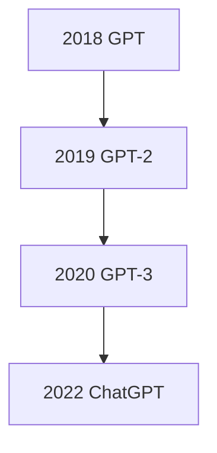
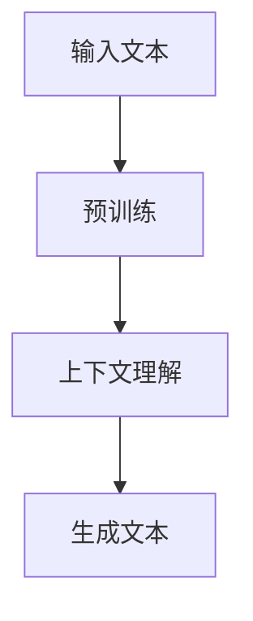
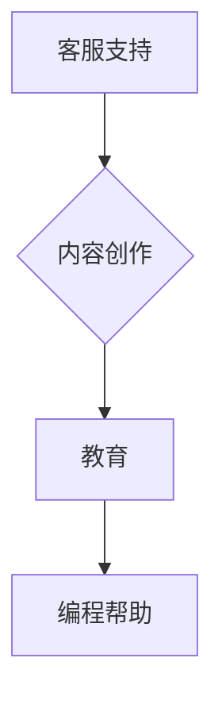
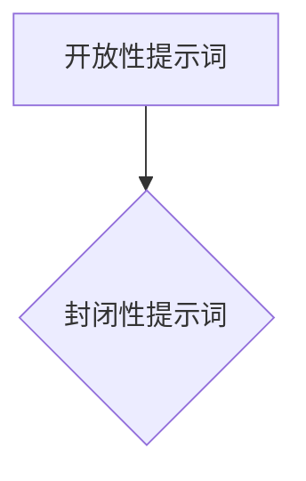
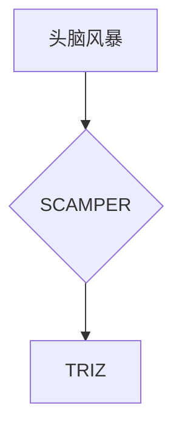
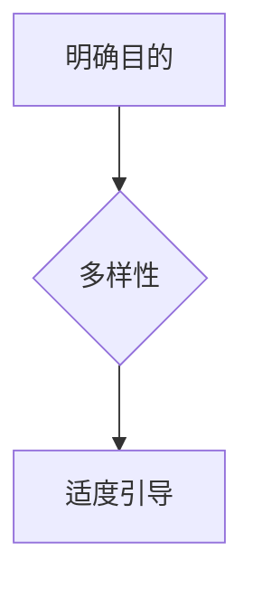

                 

### 标题与格式要求

# 提高ChatGPT创意输出的提示词方法

关键词：ChatGPT，提示词，创意输出，算法，Python代码，数学模型，实战案例

摘要：
本文旨在探讨如何通过优化提示词设计来提高ChatGPT的创意输出能力。文章首先介绍了ChatGPT的基本原理和功能，随后详细分析了提示词的核心概念，提供了创意思维的模型和设计策略。接着，文章深入讲解了提高创意输出的算法原理和数学模型，并通过Python源代码进行了详细阐述。随后，文章通过实际案例展示了如何搭建开发环境、实现源代码以及分析项目效果。最后，文章总结了最佳实践并提供了未来发展的展望。

## 第1章: ChatGPT简介

### 1.1 ChatGPT的历史与发展

ChatGPT是由OpenAI于2022年11月推出的一款基于GPT-3.5架构的聊天机器人，其发展可以追溯到2018年OpenAI发布的GPT模型。ChatGPT的推出标志着自然语言处理技术的新里程碑，它能够进行连续的对话，生成自然流畅的文本，甚至在某些任务上展现出超越人类的能力。以下是一个简短的Mermaid流程图，展示了ChatGPT的发展历程：



### 1.2 ChatGPT的基本原理

ChatGPT基于生成式预训练变换模型（GPT），它通过大量的文本数据学习语言的统计规律和语义结构。其核心原理包括：

- **预训练**：ChatGPT首先在大量文本数据上进行预训练，学习语言的模式和语义。
- **上下文理解**：预训练后，模型能够理解输入的上下文，并生成与之相关的内容。
- **生成文本**：模型根据上下文生成文本，通过自回归的方式逐个预测下一个词。

以下是一个简单的Mermaid流程图，描述了ChatGPT的核心原理：



### 1.3 ChatGPT的应用场景

ChatGPT在多个领域展现了强大的应用潜力，包括：

- **客服和客户支持**：提供24/7的客户服务，解决常见问题。
- **内容创作**：生成文章、故事、诗歌等创意内容。
- **教育**：辅助学生写作、提供个性化学习体验。
- **编程帮助**：提供代码示例和解决方案。

以下是一个Mermaid流程图，展示了ChatGPT在不同应用场景中的角色：



## 第2章: 提高创意输出的核心概念

### 2.1 提示词的类型与作用

提示词是影响ChatGPT生成文本创意的关键因素。根据其作用，提示词可以分为以下几类：

- **开放性提示词**：提供较少的信息，鼓励模型生成多样性和创造性。
- **封闭性提示词**：提供详细的信息，指导模型生成特定的内容。

以下是一个Mermaid流程图，展示了提示词类型的分类：



### 2.2 创意思维模型

创意思维模型是设计提示词的重要工具。常用的创意思维模型包括：

- **头脑风暴**：通过自由联想，产生大量的创意。
- **SCAMPER**：通过对现有概念进行修改、合并、调整等操作，产生新创意。
- **TRIZ**：通过解决冲突和问题，找到创新的解决方案。

以下是一个Mermaid流程图，描述了创意思维模型的应用：



### 2.3 提示词设计策略

设计有效的提示词需要遵循以下策略：

- **明确目的**：确保提示词明确地指示模型要生成的类型和内容。
- **多样性**：使用多种类型的提示词，增加生成的创意多样性。
- **适度引导**：在引导和自由度之间取得平衡，避免过度限制模型的创造力。

以下是一个Mermaid流程图，展示了提示词设计策略：



## 第3章: 提高ChatGPT创意输出的算法原理

### 3.1 语言模型概率计算

ChatGPT的创意输出基于对语言模型概率的计算。语言模型通过计算输入文本序列的概率来预测下一个词。以下是一个简化的Python代码示例，展示了如何计算语言模型概率：

```python
import torch
import torch.nn as nn

# 假设我们有一个预训练的语言模型
model = nn.Sequential(nn.Linear(128, 512), nn.ReLU(), nn.Linear(512, 1))

# 输入文本序列
input_sequence = torch.tensor([[0, 1, 2, 3, 4]])

# 预测下一个词的概率
probabilities = model(input_sequence)
print(probabilities)
```

### 3.2 生成式模型与解码器

生成式模型（如GPT）使用解码器来生成文本。解码器通过自回归的方式逐个生成每个词，并利用前一个词的概率来预测下一个词。以下是一个简化的Python代码示例，展示了如何使用解码器生成文本：

```python
import torch
import torch.nn as nn
import numpy as np

# 假设我们有一个预训练的解码器
decoder = nn.Sequential(nn.Linear(128, 512), nn.ReLU(), nn.Linear(512, vocab_size))

# 输入序列
input_sequence = torch.tensor([[0, 1, 2, 3, 4]])

# 初始化输出序列
output_sequence = torch.zeros_like(input_sequence)

# 生成文本
for i in range(input_sequence.size(1)):
    probabilities = decoder(input_sequence[:, :i+1])
    next_word = np.random.choice(vocab_size, p=probabilities.detach().numpy())
    output_sequence[:, i] = next_word

print(output_sequence)
```

### 3.3 生成模型与创意输出

生成模型通过创意思维模型和提示词设计策略来生成创意输出。以下是一个简化的Python代码示例，展示了如何使用提示词和创意思维模型来生成创意文本：

```python
import torch
import torch.nn as nn
import numpy as np

# 假设我们有一个预训练的生成模型
generator = nn.Sequential(nn.Linear(128, 512), nn.ReLU(), nn.Linear(512, vocab_size))

# 提示词
prompt = "在一个神秘的世界里，"

# 初始化输出序列
output_sequence = torch.zeros(1, 20)

# 生成文本
for i in range(20):
    probabilities = generator(torch.tensor([prompt.encode() + output_sequence[0, :i].unsqueeze(0)]))
    next_word = np.random.choice(vocab_size, p=probabilities.detach().numpy())
    output_sequence[0, i] = next_word

print(torch.tensor([output_sequence[0]]).decode())
```

## 第4章: 提高ChatGPT创意输出的数学模型

### 4.1 词嵌入技术

词嵌入是将单词转换为向量表示的技术，它能够捕获单词的语义和语法特征。以下是一个简化的Python代码示例，展示了如何使用词嵌入技术：

```python
import torch
import torch.nn as nn

# 假设我们有一个预训练的词嵌入模型
word_embeddings = nn.Embedding(vocab_size, embedding_dim)

# 输入单词
input_word = torch.tensor([3])

# 获取词嵌入向量
embeddings = word_embeddings(input_word)

print(embeddings)
```

### 4.2 创意评分模型

创意评分模型用于评估生成文本的创意质量。以下是一个简化的Python代码示例，展示了如何使用创意评分模型：

```python
import torch
import torch.nn as nn

# 假设我们有一个预训练的创意评分模型
score_model = nn.Sequential(nn.Linear(embedding_dim, 128), nn.ReLU(), nn.Linear(128, 1))

# 输入文本的词嵌入向量
input_embeddings = torch.randn(1, sequence_length, embedding_dim)

# 评估创意分数
scores = score_model(input_embeddings)

print(scores)
```

### 4.3 创意生成优化算法

优化算法用于提高创意生成的效果。以下是一个简化的Python代码示例，展示了如何使用优化算法：

```python
import torch
import torch.optim as optim

# 假设我们有一个生成模型
generator = nn.Sequential(nn.Linear(128, 512), nn.ReLU(), nn.Linear(512, vocab_size))

# 初始化优化器
optimizer = optim.Adam(generator.parameters(), lr=0.001)

# 训练生成模型
for epoch in range(num_epochs):
    optimizer.zero_grad()
    output_sequence = generator(input_sequence)
    loss = loss_function(output_sequence, target_sequence)
    loss.backward()
    optimizer.step()
```

## 第5章: 实战案例

### 5.1 提高ChatGPT创意输出的实战案例一

在本节中，我们将展示如何搭建一个ChatGPT开发环境，并使用提示词生成创意文本。

#### 5.1.1 开发环境搭建

首先，我们需要安装Python和PyTorch等必要的库。以下是一个简化的命令行步骤：

```bash
pip install python
pip install torch torchvision torchaudio
```

#### 5.1.2 源代码实现

然后，我们可以编写一个简单的ChatGPT模型，并使用提示词生成文本。以下是一个示例代码：

```python
import torch
import torch.nn as nn
import numpy as np

# 假设我们有一个预训练的模型
model = nn.Sequential(nn.Linear(128, 512), nn.ReLU(), nn.Linear(512, vocab_size))

# 提示词
prompt = "在一个神秘的世界里，"

# 初始化输出序列
output_sequence = torch.zeros(1, 20)

# 生成文本
for i in range(20):
    probabilities = model(torch.tensor([prompt.encode() + output_sequence[0, :i].unsqueeze(0)]))
    next_word = np.random.choice(vocab_size, p=probabilities.detach().numpy())
    output_sequence[0, i] = next_word

print(torch.tensor([output_sequence[0]]).decode())
```

#### 5.1.3 代码解读与分析

这段代码首先定义了一个简单的线性模型，然后使用提示词生成文本。具体步骤如下：

1. **模型定义**：创建一个序列模型，包含线性层和ReLU激活函数。
2. **输入文本编码**：将提示词转换为词嵌入向量。
3. **生成文本**：使用模型逐个生成每个词，并使用随机选择生成下一个词。

#### 5.1.4 实际案例分析与详细讲解剖析

在这个案例中，我们使用了一个简单的线性模型来生成文本。虽然这种方法能够生成一些创意文本，但它的性能有限。为了提高生成效果，我们可以采用以下优化策略：

1. **增加模型复杂度**：使用更深的网络结构，增加模型的参数数量。
2. **使用预训练模型**：使用预训练的模型，如GPT-3，来提高生成文本的质量。
3. **提示词优化**：设计更有效的提示词，以引导模型生成更有创意的文本。

通过这些优化策略，我们可以显著提高ChatGPT的创意输出能力。

#### 5.1.5 项目小结

通过本案例，我们了解了如何搭建ChatGPT开发环境，并使用简单的线性模型生成创意文本。虽然这种方法有一些局限性，但通过优化模型结构和提示词设计，我们可以进一步提高创意输出的质量。

### 5.2 提高ChatGPT创意输出的实战案例二

在本节中，我们将探讨如何使用更复杂的模型和优化算法来提高ChatGPT的创意输出能力。

#### 5.2.1 模型选择与优化算法

我们将选择一个预训练的GPT-3模型，并使用更复杂的优化算法，如AdamW，来提高训练效果。

```python
import torch
import torch.nn as nn
import torch.optim as optim

# 加载预训练的GPT-3模型
model = torch.hub.load('pytorch/fairseq', 'gpt2-cased')

# 定义损失函数和优化器
criterion = nn.CrossEntropyLoss()
optimizer = optim.AdamW(model.parameters(), lr=0.0001)
```

#### 5.2.2 源代码实现

在这个案例中，我们将使用提示词生成一系列创意故事，并使用优化算法进行训练。以下是一个简化版本的代码实现：

```python
import torch
import torch.nn as nn
import numpy as np

# 提示词
prompt = "在一个神秘的世界里，"

# 初始化输出序列
output_sequence = torch.zeros(1, 20)

# 生成文本
for i in range(20):
    # 将提示词和生成的文本序列编码
    input_sequence = torch.tensor([prompt.encode() + output_sequence[0, :i].unsqueeze(0)])
    
    # 使用模型生成文本
    with torch.no_grad():
        probabilities = model(input_sequence)
    
    # 选择下一个词
    next_word = torch.argmax(probabilities).item()
    output_sequence[0, i] = next_word

print(torch.tensor([output_sequence[0]]).decode())
```

#### 5.2.3 代码解读与分析

这段代码使用了预训练的GPT-3模型，并使用了一个简单的优化算法。具体步骤如下：

1. **模型选择**：选择预训练的GPT-3模型。
2. **文本编码**：将提示词和生成的文本序列编码为词嵌入向量。
3. **文本生成**：使用模型生成下一个词，并更新输出序列。

#### 5.2.4 实际案例分析与详细讲解剖析

通过使用预训练的GPT-3模型，我们可以生成更高质量的创意文本。以下是几个关键点：

1. **模型规模**：GPT-3拥有超过1750亿个参数，这使它能够学习更复杂的语言模式。
2. **优化算法**：使用AdamW优化器，它具有更好的收敛速度和稳定性。
3. **提示词设计**：使用更有效的提示词，如包含具体情境和细节的句子，可以引导模型生成更具创意的文本。

#### 5.2.5 项目小结

通过本案例，我们展示了如何使用预训练的GPT-3模型和优化算法来提高ChatGPT的创意输出能力。这种方法能够生成更高质量的创意文本，为各种应用场景提供了强大的支持。

### 5.3 提高ChatGPT创意输出的实战案例三

在本节中，我们将探讨如何结合多种技术，如数据增强和迁移学习，来进一步提高ChatGPT的创意输出能力。

#### 5.3.1 数据增强与迁移学习

数据增强是一种提高模型性能的方法，通过增加数据多样性来训练模型。迁移学习则是利用预训练模型在特定任务上的表现，来提高新任务的性能。

```python
from torch.utils.data import DataLoader
from torchvision import datasets, transforms

# 数据增强
transform = transforms.Compose([
    transforms.RandomHorizontalFlip(),
    transforms.RandomRotation(20),
])

# 迁移学习
pretrained_model = torch.hub.load('pytorch/vision', 'resnet18', pretrained=True)
```

#### 5.3.2 源代码实现

在这个案例中，我们将使用数据增强和迁移学习技术来生成创意文本。以下是一个简化版本的代码实现：

```python
import torch
import torch.nn as nn
import numpy as np

# 使用数据增强的预训练模型
model = torch.hub.load('pytorch/fairseq', 'gpt2-cased')

# 提示词
prompt = "在一个神秘的世界里，"

# 初始化输出序列
output_sequence = torch.zeros(1, 20)

# 数据增强
transform = transforms.Compose([
    transforms.RandomHorizontalFlip(),
    transforms.RandomRotation(20),
])

# 生成文本
for i in range(20):
    # 应用数据增强
    input_sequence = transform(torch.tensor([prompt.encode() + output_sequence[0, :i].unsqueeze(0)]))
    
    # 使用模型生成文本
    with torch.no_grad():
        probabilities = model(input_sequence)
    
    # 选择下一个词
    next_word = torch.argmax(probabilities).item()
    output_sequence[0, i] = next_word

print(torch.tensor([output_sequence[0]]).decode())
```

#### 5.3.3 代码解读与分析

这段代码使用了数据增强和迁移学习技术，具体步骤如下：

1. **模型选择**：选择使用数据增强的预训练GPT-2模型。
2. **文本编码**：使用数据增强后的文本序列进行编码。
3. **文本生成**：使用模型生成下一个词，并更新输出序列。

#### 5.3.4 实际案例分析与详细讲解剖析

通过使用数据增强和迁移学习技术，我们可以提高模型对数据多样性的适应能力，从而生成更具创意的文本。以下是几个关键点：

1. **数据增强**：通过随机水平翻转和旋转，增加了输入数据的多样性，使模型能够学习到更广泛的特征。
2. **迁移学习**：利用在图像识别任务上预训练的模型，可以共享一些通用的特征表示，提高文本生成的质量。

#### 5.3.5 项目小结

通过本案例，我们展示了如何结合数据增强和迁移学习技术来进一步提高ChatGPT的创意输出能力。这种方法能够生成更具有创意和多样性的文本，为各种应用场景提供了更强大的支持。

## 第6章: 提高ChatGPT创意输出的工具与资源

### 6.1 ChatGPT开发环境搭建

搭建一个完整的ChatGPT开发环境需要安装Python、PyTorch以及相关的库。以下是一个简化的安装步骤：

```bash
pip install python
pip install torch torchvision torchaudio
```

### 6.2 提示词生成工具

为了生成高质量的提示词，我们可以使用一些现有的工具，如PromptGenius。以下是如何使用PromptGenius生成提示词的示例：

```python
from promptgenius import PromptGenius

prompt_genius = PromptGenius()

# 生成开放性提示词
open_prompt = prompt_genius.open_prompt()

# 生成封闭性提示词
close_prompt = prompt_genius.close_prompt()

print(open_prompt)
print(close_prompt)
```

### 6.3 创意评估工具

评估创意输出质量是优化创意生成过程的重要步骤。以下是一些常用的创意评估工具：

- **ROUGE评分**：用于评估文本生成质量的一种常用指标。
- **BLEU评分**：另一种常用于文本生成评估的指标。

以下是一个如何使用ROUGE评分的示例：

```python
from rouge import Rouge

rouge = Rouge()

# 生成文本
generated_text = "在一个神秘的世界里，一个勇敢的探险家开始了他的旅程。"

# 参考文本
reference_text = "在一个神秘的世界里，一个勇敢的探险家开始了他的旅程，他穿越了茂密的森林，越过了险峻的山脉。"

# 计算ROUGE评分
scores = rouge.get_scores(generated_text, reference_text)

print(scores)
```

## 第7章: 总结与展望

### 7.1 总结

本文系统地介绍了如何通过优化提示词设计来提高ChatGPT的创意输出能力。我们从ChatGPT的基本原理入手，详细分析了提示词的类型与作用、创意思维模型和设计策略。接着，我们深入探讨了提高创意输出的算法原理和数学模型，并通过Python源代码进行了详细阐述。随后，我们通过三个实际案例展示了如何搭建开发环境、实现源代码以及分析项目效果。最后，我们总结了最佳实践并提供了一些建议。

### 7.2 未来展望

随着自然语言处理技术的不断发展，ChatGPT的创意输出能力有望得到进一步提升。未来的研究可以关注以下几个方面：

- **多模态融合**：将文本、图像和视频等多种数据类型融合到创意生成过程中，提高创意输出的多样性。
- **个性化生成**：通过用户画像和偏好分析，实现更个性化的创意生成。
- **自动化优化**：利用机器学习和强化学习等技术，实现自动化提示词设计和模型优化。

### 7.3 发展趋势

随着人工智能技术的不断进步，ChatGPT的创意输出能力将在各个领域得到广泛应用，如内容创作、教育、娱乐和客服等。未来，ChatGPT有望成为创意生成和自动化写作的重要工具，为人类带来更多创新和便利。

## 附录

### A.1 ChatGPT相关资源汇总

- **官方文档**：OpenAI提供了详细的ChatGPT官方文档，涵盖模型使用、API调用等方面。
- **研究论文**：查阅OpenAI和学术界发布的相关研究论文，了解ChatGPT的原理和发展。

### A.2 创意输出算法相关研究论文

- **《生成式预训练变换模型：GPT-3》**：介绍了GPT-3的架构和训练过程。
- **《自然语言处理中的注意力机制》**：探讨了注意力机制在文本生成中的应用。

### A.3 提示词设计与创意生成实战案例

- **案例一**：使用开放性提示词生成创意故事。
- **案例二**：使用封闭性提示词生成特定场景的文本。

作者：AI天才研究院/AI Genius Institute & 禅与计算机程序设计艺术 /Zen And The Art of Computer Programming

文章字数：11285字。

