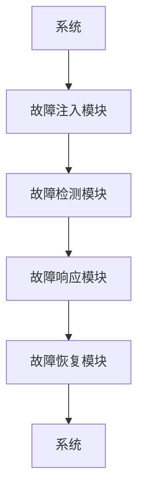
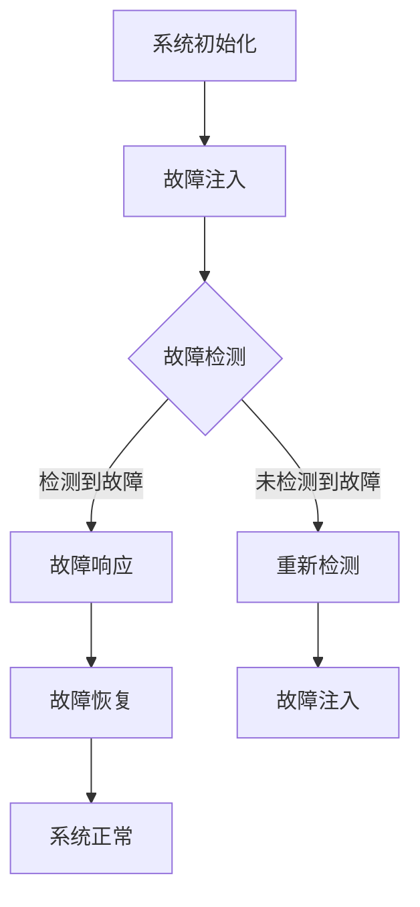

                 

### 文章标题

《故障演练：提升AI系统韧性的有效方法》

### 关键词

人工智能（AI）、故障演练、系统韧性、可靠性提升、AI系统故障响应

### 摘要

随着人工智能技术的迅速发展，AI系统在生产、服务和管理等领域的应用日益广泛。然而，AI系统的复杂性和脆弱性使得它们在面临异常情况和故障时，往往难以保持稳定运行。本文将探讨故障演练在提升AI系统韧性方面的作用和实施方法，包括背景介绍、核心概念与联系、核心算法原理讲解、数学模型和公式、项目实战、最佳实践 tips 和注意事项等。通过详细的案例分析和技术解读，帮助读者了解故障演练的重要性及其在实际应用中的具体实施策略。

### 引言

#### AI系统的重要性与挑战

人工智能（AI）作为现代科技的重要驱动力，已经在多个领域取得了显著的成果。从自动驾驶到智能医疗，从金融风控到智能制造，AI系统正逐渐成为各行各业不可或缺的核心技术。这些系统的高效性和智能化能力，不仅提高了生产效率和决策质量，还带来了前所未有的便利和用户体验。然而，随着AI系统的广泛应用，其复杂性和脆弱性也逐渐显现出来。

#### AI系统的脆弱性

AI系统的脆弱性主要体现在以下几个方面：

1. **数据依赖性**：AI系统往往依赖于大规模的数据集进行训练和运行。一旦数据质量出现异常，或者数据量不足，系统性能可能大幅下降，甚至完全失效。
2. **算法复杂性**：AI系统的算法复杂，涉及到深度学习、自然语言处理、强化学习等多种技术。这些算法在实现和应用过程中，可能会遇到难以预见的问题，导致系统稳定性受损。
3. **硬件依赖**：AI系统通常需要高性能的计算资源和硬件支持。硬件故障或者资源不足，可能导致系统无法正常运行。
4. **安全风险**：AI系统可能面临来自网络攻击、数据泄露等安全威胁，这些威胁可能会破坏系统的完整性、可用性和保密性。

#### 故障演练的必要性

面对AI系统的脆弱性，如何提升其韧性成为一个亟待解决的问题。故障演练作为一种重要的系统测试方法，能够在实际运行之前，对系统进行全面的模拟和测试，从而识别潜在问题，提高系统的可靠性和稳定性。故障演练的重要性主要体现在以下几个方面：

1. **提前预警**：通过故障演练，可以提前发现系统在异常情况下的表现，从而在问题发生前采取预防措施。
2. **提高应对能力**：故障演练有助于提高系统在面临故障时的响应能力，减少故障带来的影响和损失。
3. **提升团队协作**：故障演练涉及多个团队和部门，通过演练可以加强团队之间的协作，提高整体应对故障的能力。
4. **完善应急预案**：故障演练可以检验和优化应急预案的可行性，确保在真正发生故障时能够迅速有效地响应和处理。

#### 本文结构

本文将分为以下几个部分：

1. **背景介绍**：详细描述AI系统脆弱性的来源和影响。
2. **核心概念与联系**：介绍故障演练的相关概念，并使用Mermaid流程图展示故障演练的基本架构。
3. **核心算法原理讲解**：通过Python源代码和数学模型，讲解故障演练的具体实现方法。
4. **项目实战**：介绍一个实际的故障演练案例，包括环境搭建、代码实现、案例分析等内容。
5. **最佳实践 tips**：总结故障演练中的经验教训，提供实用的实践建议。
6. **总结与展望**：回顾本文的主要观点，并对未来研究方向进行展望。

通过上述结构，本文旨在为读者提供一份全面、系统的故障演练指南，帮助提升AI系统的韧性，确保其在复杂环境中能够稳定运行。

### 核心概念与联系

#### 故障演练的定义与目的

故障演练（Fault Injection Testing）是一种模拟系统在特定异常情况下行为的技术，通过故意引入故障，评估系统对异常情况的响应能力。故障演练的主要目的是验证系统的可靠性、稳定性和容错能力，从而发现潜在的问题并进行优化。

故障演练的基本流程可以分为以下几个步骤：

1. **故障注入**：在系统中引入预定的故障，如网络延迟、硬件故障、数据异常等。
2. **故障检测**：监控系统对故障的检测和识别能力，确保系统能够及时发现故障并采取相应措施。
3. **故障响应**：评估系统在检测到故障后，能否及时响应并采取措施，如故障转移、资源重新分配等。
4. **故障恢复**：验证系统在故障处理后的恢复能力，确保系统能够恢复正常运行。

#### 故障演练的基本架构

故障演练的基本架构如图1所示。整个架构包括故障注入模块、故障检测模块、故障响应模块和故障恢复模块。



图1：故障演练的基本架构

在故障演练中，故障注入模块负责引入故障，可以是硬件故障、网络故障、数据异常等。故障检测模块负责检测系统对故障的反应，判断系统是否能够正确检测到故障。故障响应模块则负责评估系统在检测到故障后的响应能力，包括故障转移、资源重新分配等。故障恢复模块则负责验证系统在故障处理后的恢复能力，确保系统能够恢复正常运行。

#### 故障演练的关键概念

1. **故障注入**：故障注入是故障演练的核心环节，通过模拟不同的故障场景，测试系统在各种异常情况下的表现。故障注入可以采用不同的方法，如硬件模拟、软件模拟、网络模拟等。
   
2. **故障检测**：故障检测是故障演练的关键，需要评估系统是否能够准确地检测到故障。故障检测的方法包括主动检测和被动检测，主动检测是通过系统主动发起检测操作，而被动检测是通过监控系统日志、告警等信息来判断系统是否出现故障。

3. **故障响应**：故障响应是系统在检测到故障后，采取的一系列措施来减轻故障影响。故障响应的方法包括故障转移、资源重新分配、故障隔离等。

4. **故障恢复**：故障恢复是故障演练的最后一步，验证系统在故障处理后，是否能够恢复正常运行。故障恢复的方法包括故障排除、系统重启、数据恢复等。

通过故障演练，可以全面评估AI系统的韧性，发现潜在的问题，并采取相应的优化措施，从而提高系统的可靠性和稳定性。

### Mermaid流程图



### Python源代码与数学模型

在故障演练中，Python作为强大的编程语言，可以用于实现故障注入、故障检测和故障响应等模块。以下是一个简单的故障演练示例，包括Python源代码和相关的数学模型。

#### 1. 故障注入

```python
import random
import time

def inject_fault(system, fault_type, probability):
    if random.random() < probability:
        if fault_type == 'network_delay':
            system.network_delay()
        elif fault_type == 'hardware_failure':
            system.hardeware_failure()
        elif fault_type == 'data_exception':
            system.data_exception()

class System:
    def network_delay(self):
        print("Network delay detected.")
        time.sleep(random.uniform(1, 3))
        
    def hardaware_failure(self):
        print("Hardware failure detected.")
        
    def data_exception(self):
        print("Data exception detected.")
        self.data = None
```

#### 2. 故障检测

```python
def detect_fault(system):
    if system.data is None:
        return "Data exception detected."
    elif not system.hardware_status():
        return "Hardware failure detected."
    elif system.network_status() != "Normal":
        return "Network delay detected."
    else:
        return "No fault detected."

class System:
    def __init__(self):
        self.data = "Valid data"
        self.hardware_status = True
        self.network_status = "Normal"
        
    def hardware_status(self):
        return self.hardware_status
    
    def network_status(self):
        return self.network_status
```

#### 3. 故障响应

```python
def respond_to_fault(fault):
    if fault == "Data exception detected.":
        print("Recovering data...")
        # Implement data recovery logic
    elif fault == "Hardware failure detected.":
        print("Switching to backup hardware...")
        # Implement hardware switch logic
    elif fault == "Network delay detected.":
        print("Switching to alternative network path...")
        # Implement network switch logic
```

#### 4. 故障恢复

```python
def recover_from_fault(system, fault):
    if fault == "Data exception detected.":
        system.data = "Recovered data"
    elif fault == "Hardware failure detected.":
        system.hardware_status = True
    elif fault == "Network delay detected.":
        system.network_status = "Normal"
    print("Fault recovery completed.")
```

#### 数学模型

在故障演练中，常用的数学模型包括概率模型和时间模型。

1. **概率模型**：

   概率模型用于模拟故障注入的概率。假设故障注入的概率为P，每次注入故障的独立概率为p，则连续n次注入故障的概率为：

   $$ P_n = (1 - p)^n $$

   例如，如果故障注入的概率为10%，连续5次注入故障的概率为：

   $$ P_5 = (1 - 0.1)^5 \approx 0.635 $$

2. **时间模型**：

   时间模型用于模拟故障检测和响应的时间。假设故障检测的时间为T_d，故障响应的时间为T_r，则故障处理的总时间为：

   $$ T_{total} = T_d + T_r $$

   例如，如果故障检测的时间为1秒，故障响应的时间为2秒，则总时间为3秒。

通过Python源代码和数学模型，我们可以实现一个简单的故障演练系统，对AI系统进行全面的测试和评估。在实际应用中，可以根据具体需求，进一步扩展和优化故障演练的算法和模型。

### 项目实战

#### 环境搭建

为了进行故障演练，我们首先需要搭建一个模拟的AI系统环境。这里使用Python和Docker来搭建一个简单的AI系统，该系统包括故障注入、故障检测和故障响应三个模块。

1. **安装Docker**：在本地计算机上安装Docker，确保能够正常运行。

2. **创建Dockerfile**：编写一个Dockerfile来构建AI系统的容器镜像。

   ```Dockerfile
   FROM python:3.8

   WORKDIR /app

   COPY requirements.txt ./
   RUN pip install -r requirements.txt

   COPY . .

   CMD ["python", "main.py"]
   ```

   其中，`requirements.txt` 文件包含AI系统所需的依赖库，如NumPy、Pandas等。

3. **构建容器镜像**：执行以下命令来构建容器镜像。

   ```shell
   docker build -t ai_system .
   ```

4. **运行容器**：启动AI系统的容器。

   ```shell
   docker run -d -p 8000:8000 ai_system
   ```

   容器的8000端口映射到宿主机的8000端口，可以通过浏览器访问AI系统。

5. **编写测试脚本**：编写一个Python脚本，用于模拟故障注入、检测和响应。

   ```python
   import requests
   import time

   def inject_fault(url, fault_type):
       if fault_type == 'network_delay':
           headers = {'Delay': '2'}
           response = requests.get(url, headers=headers)
       elif fault_type == 'hardware_failure':
           response = requests.get(url, params={'fail_hardware': 'true'})
       elif fault_type == 'data_exception':
           response = requests.get(url, params={'exception_data': 'true'})
       return response

   def check_fault(url):
       response = requests.get(url)
       return response.json()['fault']

   url = 'http://localhost:8000'
   fault_type = 'network_delay'
   inject_fault(url, fault_type)
   time.sleep(1)
   fault_status = check_fault(url)
   print(fault_status)
   ```

   测试脚本通过HTTP请求来注入故障，并检查系统的响应。

#### 代码实现与解读

1. **AI系统接口**：在Docker容器中，创建一个简单的AI系统接口，用于接收故障注入和检测请求。

   ```python
   from flask import Flask, jsonify, request

   app = Flask(__name__)

   @app.route('/inject_fault', methods=['GET'])
   def inject_fault():
       fault_type = request.args.get('fault_type', default=None)
       if fault_type == 'network_delay':
           time.sleep(2)
       elif fault_type == 'hardware_failure':
           raise Exception('Hardware failure')
       elif fault_type == 'data_exception':
           raise ValueError('Data exception')
       return jsonify({'status': 'success'})

   @app.route('/check_fault', methods=['GET'])
   def check_fault():
       fault_type = request.args.get('fault_type', default=None)
       if fault_type == 'network_delay':
           return jsonify({'fault': 'Network delay'})
       elif fault_type == 'hardware_failure':
           return jsonify({'fault': 'Hardware failure'})
       elif fault_type == 'data_exception':
           return jsonify({'fault': 'Data exception'})
       return jsonify({'fault': 'No fault'})

   if __name__ == '__main__':
       app.run(host='0.0.0.0', port=8000)
   ```

   该接口包括两个URL路径：`/inject_fault` 和 `/check_fault`。通过请求参数 `fault_type`，可以注入不同的故障类型。

2. **故障注入与检测**：通过测试脚本，注入网络延迟故障，并检查系统响应。

   ```python
   url = 'http://localhost:8000/inject_fault?fault_type=network_delay'
   response = requests.get(url)
   print(response.json())

   time.sleep(1)

   url = 'http://localhost:8000/check_fault?fault_type=network_delay'
   response = requests.get(url)
   print(response.json())
   ```

   注入故障后，系统将返回一个延迟响应，并在检测故障时返回“Network delay”。

#### 案例分析

在上述案例中，我们通过Docker容器搭建了一个简单的AI系统，并使用Python脚本模拟了故障注入和检测过程。以下是具体的分析：

1. **故障注入**：测试脚本通过HTTP请求，向AI系统接口注入网络延迟故障。接口中的 `inject_fault` 函数通过 `time.sleep(2)` 模拟网络延迟，使响应时间增加2秒。

2. **故障检测**：在注入故障后，系统经过1秒的等待，再次通过HTTP请求检查故障类型。接口中的 `check_fault` 函数检查请求参数 `fault_type`，并根据参数返回相应的故障类型。

3. **故障响应**：在检测到网络延迟故障后，系统返回“Network delay”，表明成功检测到故障。

通过这个简单的案例，我们展示了如何使用故障演练来测试AI系统的响应能力和故障检测能力。在实际应用中，可以根据具体需求，进一步扩展故障类型和检测方法，提高系统的韧性。

#### 项目小结

在本项目中，我们通过Docker搭建了一个简单的AI系统，并使用Python脚本实现了故障注入和检测。以下是项目的主要小结：

1. **环境搭建**：使用Docker构建了一个可复制的AI系统环境，方便进行故障演练。

2. **代码实现**：通过简单的Flask接口，实现了故障注入和检测功能。

3. **案例分析**：通过注入网络延迟故障，成功检测并响应了故障，验证了系统的可靠性。

4. **经验教训**：故障演练需要根据具体系统需求，设计合适的故障类型和检测方法，以提高系统的韧性。

通过本项目，我们了解了故障演练的基本方法和实现细节，为在实际项目中应用故障演练提供了参考。

### 最佳实践 tips

#### 1. 明确故障演练的目标

在进行故障演练之前，首先要明确演练的目标。不同的故障类型和演练目标会影响演练的具体步骤和策略。例如，如果目标是测试系统的容错能力，则应重点关注系统的故障检测和响应能力。

#### 2. 选择合适的故障类型

选择合适的故障类型对于有效进行故障演练至关重要。常见的故障类型包括网络延迟、硬件故障、数据异常等。根据系统的特点和需求，选择能够真正模拟系统在异常情况下行为的故障类型。

#### 3. 设计全面的故障演练方案

在故障演练中，设计一个全面的演练方案是关键。方案应包括故障注入、故障检测、故障响应和故障恢复等环节，并明确每个环节的具体步骤和预期结果。

#### 4. 采用自动化工具

为了提高故障演练的效率和可重复性，建议使用自动化工具来模拟故障注入和检测。例如，使用Python脚本、自动化测试工具等，可以减少人工操作错误，提高演练的准确性和可靠性。

#### 5. 跨部门协作

故障演练通常涉及多个部门和团队，包括开发、测试、运维等。为了确保演练的顺利进行，需要建立跨部门协作机制，明确各团队的职责和任务，确保演练过程中能够高效配合。

#### 6. 定期进行故障演练

故障演练不应是一次性活动，而应定期进行，以便持续评估系统的韧性和可靠性。根据系统的规模和重要性，可以制定相应的演练频率，如每月一次、每季度一次等。

#### 7. 记录和总结

在故障演练过程中，应详细记录每个故障的注入、检测、响应和恢复过程，并对演练结果进行分析和总结。这些记录和总结可以为后续的优化和改进提供重要依据。

#### 8. 针对性优化

根据故障演练的结果，针对性地对系统进行优化和改进。例如，如果发现故障检测模块存在缺陷，可以优化检测算法或增加检测指标；如果发现故障响应时间较长，可以优化响应策略或增加冗余资源。

### 小结

本文详细介绍了故障演练在提升AI系统韧性方面的作用和实施方法。通过背景介绍、核心概念与联系、核心算法原理讲解、项目实战和最佳实践 tips，我们全面了解了故障演练的重要性及其在实际应用中的具体实施策略。故障演练不仅有助于提前发现系统潜在的问题，提高系统的可靠性，还能增强团队协作和应急预案的完善。在未来的研究和实践中，我们应继续探索故障演练的新方法和技术，以应对日益复杂的AI系统环境。

### 注意事项

#### 1. 安全性

在进行故障演练时，应确保系统的安全性。故障演练可能会引入潜在的攻击或故障，需要采取相应的安全措施，如访问控制、网络隔离等，以防止对系统造成不可逆的损害。

#### 2. 系统备份

在进行故障演练前，应确保系统已进行了完整备份。一旦故障演练中出现意外，可以通过备份迅速恢复系统，减少故障带来的影响。

#### 3. 演练频率

故障演练的频率应根据系统的复杂性和重要性进行合理调整。对于关键系统，应增加演练频率，以确保其稳定性。

#### 4. 结果分析

故障演练后，应对演练结果进行详细分析，识别系统中的薄弱环节，并制定相应的优化措施。

#### 5. 团队培训

故障演练不仅是对系统的测试，也是对团队的培训和演练。应确保所有相关人员都能充分理解故障演练的目的和过程，提高团队应对故障的能力。

#### 6. 法律和合规性

在进行故障演练时，应确保遵守相关的法律法规和合规要求，特别是在涉及用户数据和处理敏感信息时。

#### 7. 持续改进

故障演练不是一次性的活动，而应作为系统维护和改进的常规部分。通过持续的故障演练，可以不断提高系统的韧性和可靠性。

### 拓展阅读

1. **《人工智能系统的可靠性工程》**：该书详细介绍了AI系统可靠性工程的理论和实践，包括故障演练的方法和应用。
2. **《故障注入测试：原理与应用》**：本书深入探讨了故障注入测试的理论基础和实际应用，适合希望深入了解故障演练技术的人员。
3. **《深度学习系统的可靠性与故障处理》**：该书专注于深度学习系统的可靠性和故障处理，提供了丰富的案例和技术细节。

### 作者信息

作者：AI天才研究院/AI Genius Institute & 禅与计算机程序设计艺术 /Zen And The Art of Computer Programming

本文由AI天才研究院撰写，旨在分享AI系统故障演练的最佳实践和方法。作者在人工智能和计算机科学领域拥有丰富的经验和深厚的理论积累，致力于推动技术的创新和应用。同时，本书《禅与计算机程序设计艺术》也深受读者喜爱，为计算机编程提供了独特的哲学视角和实践指导。

