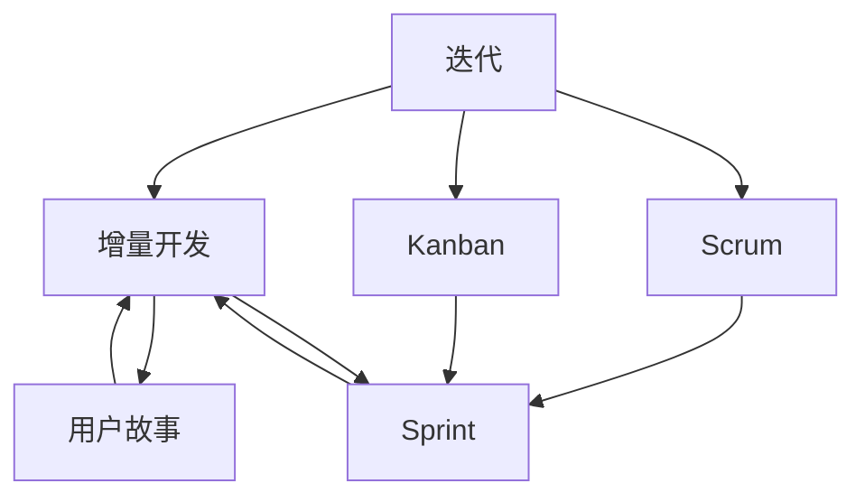
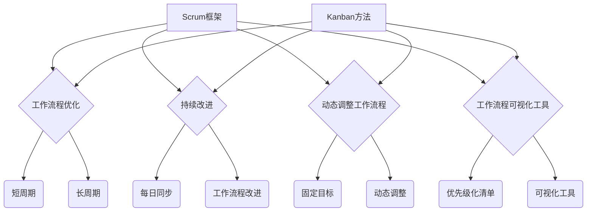
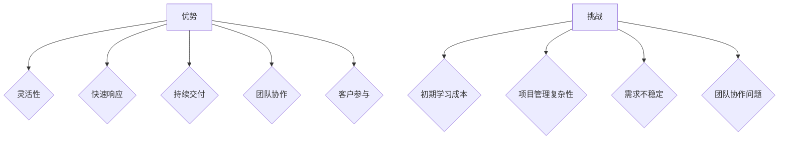
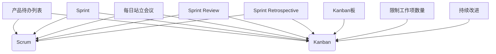

                 

### 第1章：敏捷开发基础

#### 1.1 敏捷开发的概念

**1.1.1 敏捷开发的起源与发展**

敏捷开发（Agile Development）起源于20世纪90年代，作为一种响应快速变化的软件开发方法。其首次提出是在2001年，当时一群软件开发专家在澳大利亚的昆士兰聚会，共同发布了《敏捷宣言》（The Agile Manifesto）。该宣言提出了敏捷开发的四个核心价值：

- **个体和互动重于过程和工具**
- **可工作的软件重于详尽的文档**
- **客户合作重于合同谈判**
- **响应变化重于遵循计划**

敏捷开发的核心理念是通过快速迭代和持续反馈来提高软件开发的效率和质量。它强调团队协作、客户参与和持续交付有价值的软件。

**1.1.2 敏捷开发的核心理念**

敏捷开发的核心在于其灵活性、响应能力和可持续的开发速度。以下是敏捷开发的几个关键原则：

1. **需求变更是可以接受的**：敏捷开发允许项目需求在开发过程中发生变化，并认为这是正常的。
2. **迭代开发**：开发过程被分解为短周期（通常为2-4周）的迭代，每个迭代都会交付可工作的软件。
3. **团队协作**：敏捷开发强调团队成员之间的协作和沟通，鼓励跨职能团队合作。
4. **持续交付**：敏捷开发的目标是持续交付有价值的软件，而不是一次性交付一个完整的软件。
5. **客户参与**：客户或产品所有者直接参与开发过程，确保软件满足实际需求。

敏捷开发的出现是为了解决传统软件开发中存在的几个问题，包括：

- **需求变更难以适应**：传统开发方法通常在项目开始时就确定所有需求，导致在需求发生变化时，项目难以适应。
- **沟通障碍**：在传统方法中，开发者和客户之间的沟通往往不足，导致软件不能满足客户需求。
- **进度失控**：传统的“瀑布模型”往往导致项目进度失控，最终交付的软件往往延迟或超出预算。

通过敏捷开发，这些问题可以得到缓解。敏捷方法鼓励在项目早期频繁交付可用的软件，从而更早地发现和解决潜在的问题。此外，敏捷开发通过持续集成和测试，确保软件质量。

敏捷开发的发展也催生了许多不同的方法论，如Scrum、Kanban等，每种方法都有其特定的实践和工具，但它们都遵循敏捷开发的核心理念。

**核心概念与联系**

敏捷开发的核心概念包括迭代、增量开发、用户故事、Sprint等。以下是这些概念之间的关系架构图：

在这个架构图中，迭代和增量开发是敏捷开发的基础，用户故事和Sprint是具体实施的方法，而Scrum和Kanban是两种流行的敏捷方法论。每个Sprint都会产生一个可工作的软件版本，通过不断迭代和反馈，最终交付满足客户需求的软件。

#### 1.2 敏捷开发的方法论

**1.2.1 Scrum框架**

Scrum是敏捷开发中最流行的方法论之一，它提供了一个结构化的框架来指导团队的工作。以下是Scrum框架的核心组成部分：

1. **产品待办列表（Product Backlog）**：这是一个不断增长的清单，包含了所有可能的功能和需求。产品所有者负责维护和更新这个列表。
2. **Sprint规划**：在Sprint开始之前，团队会举行一次Sprint规划会议，讨论并选择接下来要完成的用户故事。
3. **Daily Stand-up（每日站立会议）**：每日站立会议是团队成员在Sprint期间每天早上举行的简短会议，用于同步进展、识别问题。
4. **Sprint Review**：Sprint结束时，团队会与产品所有者一起举行Sprint Review，展示完成的用户故事，并讨论如何改进未来的Sprint。
5. **Sprint Retrospective**：Sprint Review之后，团队会举行Sprint Retrospective，反思Sprint中的表现，并提出改进建议。

**1.2.1.1 产品待办列表**

产品待办列表是一个动态的清单，包含了所有需要实现的功能和需求。这些条目称为用户故事，通常采用以下格式：“作为一个[角色]，我需要[功能]，以便[业务价值]”。

产品待办列表的维护是产品所有者的责任。他们需要根据市场变化、客户反馈和业务需求，不断更新和优先级化这个列表。

**1.2.1.2 Sprint规划**

Sprint规划是团队在Sprint开始之前举行的关键会议。在这个会议上，团队会：

1. **选择用户故事**：从产品待办列表中选择将要实现的用户故事。
2. **估算工作量**：对选定的用户故事进行估算，以确定团队在Sprint中能完成多少工作。
3. **创建Sprint目标**：确定Sprint的目标，以便团队在Sprint期间有一个明确的方向。
4. **分配任务**：根据团队的能力和用户故事的优先级，将任务分配给团队成员。

**1.2.1.3 Daily Stand-up**

每日站立会议是Scrum框架中的另一个关键组成部分。通常，每日站立会议持续15分钟左右，团队成员轮流回答以下三个问题：

1. **昨天你完成了什么？**
2. **今天你计划完成什么？**
3. **你是否遇到了任何障碍？**

通过这种方式，团队成员可以保持同步，及时发现和解决问题。

**1.2.2 Kanban方法**

Kanban是一种用于敏捷开发的另一种方法论，它更注重流程的优化和持续改进。以下是Kanban方法的核心组成部分：

1. **Kanban板**：Kanban板是一个可视化的工作流程管理工具，通常由三列组成：“待办”、“进行中”和“完成”。
2. **工作项**：Kanban板上的每个工作项都代表一个待完成的任务。
3. **限制工作项数量**：Kanban方法建议在每个步骤中限制工作项的数量，以避免过度工作和工作积压。
4. **持续改进**：Kanban方法鼓励团队不断评估和改进其工作流程。

**1.2.2.1 Kanban的基本概念**

Kanban的基本概念包括：

- **可视化工作流程**：通过Kanban板，团队可以清晰地看到每个工作项的状态，从而更好地管理流程。
- **工作项流动**：工作项在Kanban板上的流动，反映了团队的工作进展。
- **限制工作项数量**：通过限制工作项数量，团队可以避免过度工作和工作积压。

**1.2.2.2 Kanban的实际应用**

在实际应用中，Kanban方法可以用于以下几个方面：

- **工作流程优化**：通过分析Kanban板上的数据，团队可以识别瓶颈和改进机会。
- **持续交付**：通过保持工作流程的流畅，团队可以更快地交付有价值的软件。
- **团队协作**：Kanban板提供了一个可视化工具，使团队成员可以更好地协作和管理工作。

**1.3 敏捷开发的优势与挑战**

**1.3.1 敏捷开发的优势**

敏捷开发具有以下优势：

- **灵活性**：敏捷开发允许在项目过程中根据需求的变化进行调整。
- **快速响应**：通过短周期的迭代，团队可以更快地响应客户需求和市场变化。
- **持续交付**：敏捷开发的目标是持续交付有价值的软件，而不是一次性交付一个完整的软件。
- **客户参与**：客户或产品所有者直接参与开发过程，确保软件满足实际需求。
- **团队协作**：敏捷开发鼓励跨职能团队合作，提高团队效率。

**1.3.2 敏捷开发的挑战**

尽管敏捷开发有许多优势，但它也面临一些挑战：

- **初期学习成本**：团队需要时间学习和适应敏捷方法论。
- **项目管理复杂性**：敏捷项目可能需要更多的项目管理技巧和工具。
- **需求不稳定**：频繁的需求变更可能导致项目不稳定。
- **团队协作问题**：在大型项目中，确保团队协作可能是一个挑战。

**总结**

敏捷开发是一种灵活、响应能力强的软件开发方法。通过迭代和持续反馈，敏捷开发可以提高软件开发的效率和质量。Scrum和Kanban是两种流行的敏捷方法论，它们提供了结构化的框架来指导团队的工作。敏捷开发的优势在于灵活性、快速响应和客户参与，但同时也面临一些挑战，需要团队共同努力克服。

### 图1：Scrum框架与Kanban方法的对比

| 特征 | Scrum | Kanban |
| --- | --- | --- |
| 迭代周期 | 短周期（通常2-4周） | 长周期，工作流程持续优化 |
| 每日站立会议 | 强调每日同步和问题解决 | 更多关注工作流程的持续改进 |
| Sprint目标 | 固定的Sprint目标 | 动态调整工作流程 |
| 产品待办列表 | 优先级化的用户故事清单 | 工作流程可视化工具 |

### 图2：敏捷开发的优势与挑战

| 优势 | 描述 |
| --- | --- |
| 灵活性 | 允许根据需求的变化进行调整 |
| 快速响应 | 通过短周期迭代，快速响应客户需求 |
| 持续交付 | 持续交付有价值的软件 |
| 客户参与 | 客户直接参与开发过程 |
| 团队协作 | 鼓励跨职能团队合作 |

| 挑战 | 描述 |
| --- | --- |
| 初期学习成本 | 需要时间学习和适应 |
| 项目管理复杂性 | 需要更多的项目管理技巧 |
| 需求不稳定 | 需要稳定的需求管理 |
| 团队协作问题 | 在大型项目中，确保团队协作可能是一个挑战 |

### 图3：Scrum与Kanban的核心组成部分

| 组成部分 | Scrum | Kanban |
| --- | --- | --- |
| 产品待办列表 | 是 | 否 |
| Sprint | 是 | 否 |
| 每日站立会议 | 是 | 否 |
| Sprint Review | 是 | 否 |
| Sprint Retrospective | 是 | 否 |
| Kanban板 | 否 | 是 |
| 限制工作项数量 | 否 | 是 |
| 持续改进 | 否 | 是 |

### 结论

敏捷开发是一种灵活、高效的软件开发方法，它通过迭代和持续反馈，提高了软件开发的效率和质量。Scrum和Kanban是两种流行的敏捷方法论，它们提供了不同的框架来指导团队的工作。敏捷开发的优势在于灵活性、快速响应和客户参与，但同时也面临一些挑战，需要团队共同努力克服。

### 参考文献

1. 《敏捷软件开发：原则、实践与模式》
2. 《Scrum 敏捷开发实践指南》
3. 《Kanban：从类瀑布到敏捷实践的转型》
4. 《敏捷实践指南》
5. 《敏捷开发入门》

### 附录

#### A.1 敏捷开发相关资源

- **A.1.1 敏捷开发网站与社区**
  - Agile Alliance: [https://www.agilealliance.org/](https://www.agilealliance.org/)
  - Scrum Alliance: [https://www.scrumalliance.org/](https://www.scrumalliance.org/)
  - Lean Kanban: [https://www.leankanban.com/](https://www.leankanban.com/)

- **A.1.2 敏捷开发文档与手册**
  - 《敏捷宣言》（The Agile Manifesto）
  - 《Scrum指南》（The Scrum Guide）
  - 《Kanban方法论》（Kanban Methodology）
  - 《敏捷项目管理手册》（Agile Project Management Handbook）

### 用户输入：
### 第2章：LLM基本概念

**2.1 有监督学习（Supervised Learning）**

**2.1.1 基本概念**

有监督学习（Supervised Learning）是机器学习的一种方法，其核心思想是通过已标记的数据集来训练模型，使模型能够识别和预测未知数据的标签。这种方法的基本流程包括以下几个步骤：

1. **数据收集**：首先，需要收集大量的数据，这些数据包括输入特征和对应的输出标签。
2. **数据预处理**：对收集到的数据进行清洗、归一化等预处理操作，以提高模型的性能和泛化能力。
3. **模型选择**：选择适合问题的机器学习算法，例如线性回归、决策树、支持向量机等。
4. **模型训练**：使用预处理后的数据集来训练模型，通过调整模型参数来最小化预测误差。
5. **模型评估**：使用验证集或测试集来评估模型的性能，例如通过准确率、召回率、F1分数等指标。

**2.1.2 主要算法**

有监督学习算法种类繁多，以下介绍几种常用的算法：

- **线性回归**：线性回归是一种简单的有监督学习算法，用于预测连续值输出。其基本原理是通过线性模型来描述输入特征与输出标签之间的关系。
- **决策树**：决策树是一种基于树形模型的算法，通过一系列的判断条件来将数据分为不同的类别或回归值。每个节点代表一个特征，每个分支代表该特征的一个可能取值。
- **支持向量机（SVM）**：SVM是一种基于间隔最大化的分类算法，其目标是找到一个最优的超平面，将不同类别的数据点分隔开。
- **神经网络**：神经网络是一种模拟人脑结构的算法，通过多层节点（神经元）来实现复杂的非线性映射。常见的神经网络结构包括多层感知机（MLP）和卷积神经网络（CNN）。

**2.2 无监督学习（Unsupervised Learning）**

**2.2.1 基本概念**

无监督学习（Unsupervised Learning）是机器学习的另一种方法，与有监督学习不同，它不依赖于已标记的数据集。无监督学习的目标是发现数据中的结构和模式，而不是预测输出标签。这种方法的基本流程包括以下几个步骤：

1. **数据收集**：与有监督学习类似，首先需要收集大量数据。
2. **数据预处理**：对收集到的数据进行清洗、归一化等预处理操作。
3. **模型选择**：选择适合问题的无监督学习算法，例如聚类、降维等。
4. **模型训练**：使用预处理后的数据集来训练模型，通过探索数据中的内在结构来优化模型参数。
5. **模型评估**：评估模型性能通常依赖于用户定义的评估指标，例如聚类簇的内部距离、降维后的数据重构误差等。

**2.2.2 主要算法**

无监督学习算法也种类繁多，以下介绍几种常用的算法：

- **聚类**：聚类算法将数据分为若干个簇，使每个簇内的数据点彼此相似，而不同簇的数据点差异较大。常用的聚类算法包括K均值聚类、层次聚类等。
- **降维**：降维算法通过降低数据维度来简化问题，同时保持数据的结构和信息。常用的降维算法包括主成分分析（PCA）、线性判别分析（LDA）等。
- **关联规则学习**：关联规则学习旨在发现数据之间的关联关系，常见的算法包括Apriori算法和FP-Growth算法。

### 用户输出：
### 第2章：LLM基本概念

**2.1 有监督学习（Supervised Learning）**

**2.1.1 基本概念**

有监督学习（Supervised Learning）是一种机器学习方法，其核心思想是利用已经标记好的数据来训练模型，以便模型能够对未知数据进行预测。这种方法的训练过程类似于教师教学生识别对象的过程：学生通过学习已知对象的标记来推断未知对象的标签。有监督学习的步骤如下：

1. **数据收集**：首先，需要收集一个包含输入特征和对应输出标签的数据集。这些数据通常来自于实际应用场景，例如图像分类、语音识别等。
2. **数据预处理**：对收集到的数据进行清洗、归一化等操作，以消除噪声和标准化特征值，从而提高模型的泛化能力。
3. **模型选择**：根据问题的性质和需求，选择合适的机器学习算法。常见的有监督学习算法包括线性回归、逻辑回归、决策树、随机森林、支持向量机（SVM）和神经网络等。
4. **模型训练**：使用预处理后的数据集对选定的模型进行训练。训练过程中，模型通过调整内部参数来最小化预测误差。
5. **模型评估**：使用验证集或测试集来评估模型的性能。常用的评估指标包括准确率、召回率、F1分数、均方误差（MSE）等。

**2.1.2 主要算法**

有监督学习算法种类繁多，以下列举几种常见的算法：

- **线性回归**：线性回归是一种简单的有监督学习算法，用于预测连续值输出。其基本模型为：$$y = \beta_0 + \beta_1x_1 + \beta_2x_2 + \ldots + \beta_nx_n$$
- **逻辑回归**：逻辑回归是一种用于分类问题的算法，其输出为概率值，通过阈值判断分类结果。其基本模型为：$$\log\frac{p}{1-p} = \beta_0 + \beta_1x_1 + \beta_2x_2 + \ldots + \beta_nx_n$$
- **决策树**：决策树是一种基于树形结构的算法，通过一系列的条件判断来将数据分为不同的类别或回归值。每个节点代表一个特征，每个分支代表该特征的一个可能取值。
- **支持向量机（SVM）**：SVM是一种强大的分类算法，通过寻找最优的超平面来分隔不同类别的数据。其目标是最大化分类边界上的支持向量间隔。
- **神经网络**：神经网络是一种模拟人脑的算法，通过多层节点（神经元）来实现复杂的非线性映射。常见的神经网络结构包括多层感知机（MLP）和卷积神经网络（CNN）。

**2.2 无监督学习（Unsupervised Learning）**

**2.2.1 基本概念**

无监督学习（Unsupervised Learning）是一种不依赖于已标记数据的机器学习方法，其目标是从未标记的数据中提取出有意义的结构和模式。无监督学习通常用于数据探索、聚类和降维等任务。其步骤如下：

1. **数据收集**：与有监督学习类似，首先需要收集一个包含输入特征的数据集，但数据集中没有对应的输出标签。
2. **数据预处理**：对收集到的数据进行清洗、归一化等操作，以提高模型的性能。
3. **模型选择**：根据问题的性质和需求，选择合适的无监督学习算法。常见的无监督学习算法包括聚类、降维和关联规则学习等。
4. **模型训练**：使用预处理后的数据集对选定的模型进行训练。训练过程中，模型通过探索数据中的内在结构来优化内部参数。
5. **模型评估**：评估模型性能通常依赖于用户定义的评估指标，例如聚类簇的内部距离、降维后的数据重构误差等。

**2.2.2 主要算法**

无监督学习算法种类繁多，以下列举几种常见的算法：

- **聚类**：聚类算法将数据分为若干个簇，使每个簇内的数据点彼此相似，而不同簇的数据点差异较大。常见的聚类算法包括K均值聚类、层次聚类和DBSCAN等。
- **降维**：降维算法通过降低数据维度来简化问题，同时保持数据的结构和信息。常见的方法包括主成分分析（PCA）、线性判别分析（LDA）和t-SNE等。
- **关联规则学习**：关联规则学习旨在发现数据之间的关联关系，例如购物篮分析。常用的算法包括Apriori算法和FP-Growth算法。

### 用户输入：
### 第3章：敏捷sprint规划基础

**3.1 什么是Sprint**

**3.1.1 Sprint的定义**

Sprint是敏捷开发中的一个迭代周期，通常持续2-4周。Sprint的目标是交付一个可工作的软件版本，以便客户可以评估和反馈。Sprint由以下几个阶段组成：

1. **Sprint规划**：在Sprint开始前，团队会与产品所有者一起确定Sprint的目标和任务，并制定详细的计划。
2. **开发阶段**：团队按照计划开发软件，每天举行每日站立会议来同步进度，识别和解决问题。
3. **Sprint评审**：Sprint结束时，团队会向产品所有者展示完成的用户故事，收集反馈，并讨论如何改进未来的Sprint。
4. **Sprint回顾**：Sprint评审之后，团队会举行回顾会议，反思Sprint中的表现，并提出改进建议。

**3.1.2 Sprint的周期**

Sprint的周期是固定的，通常为2-4周。这样可以确保团队在一个稳定的节奏下工作，并且可以在每个Sprint结束时交付可工作的软件版本。以下是一个典型的Sprint周期：

1. **Sprint规划会议**（1天）：确定Sprint目标和任务。
2. **开发阶段**（Sprint长度）：团队按照计划开发软件，每天举行每日站立会议。
3. **Sprint评审会议**（半天）：展示完成的用户故事，收集反馈。
4. **Sprint回顾会议**（1天）：反思Sprint中的表现，提出改进建议。

**3.2 如何制定Sprint计划**

**3.2.1 制定Sprint目标的步骤**

制定Sprint目标是一个关键的过程，它决定了Sprint期间团队的工作方向。以下是制定Sprint目标的步骤：

1. **回顾上一个Sprint的结果**：在制定新Sprint目标之前，团队应该回顾上一个Sprint的结果，包括完成的用户故事、未完成的任务和遇到的问题。
2. **与产品所有者沟通**：团队需要与产品所有者沟通，了解他们的需求和期望，以及他们希望在Sprint期间看到什么成果。
3. **确定Sprint目标**：根据上一个Sprint的回顾和与产品所有者的沟通，团队可以制定一个明确的Sprint目标。这个目标应该是可衡量和可实现的。
4. **选择用户故事**：从产品待办列表中选择用户故事，确保它们符合Sprint目标，并且可以在Sprint期间完成。
5. **估算工作量**：对选定的用户故事进行估算，以确定团队在Sprint期间能完成多少工作。这有助于团队制定合理的计划。

**3.2.2 估算工作量的方法**

估算工作量是制定Sprint计划的重要步骤，以下是一些常用的估算方法：

1. **故事点**：故事点是一种相对估算方法，用于表示用户故事的工作量。通常，团队会根据用户故事的大小和复杂性为其分配故事点。
2. **任务分解**：将用户故事分解为更小的任务，然后对这些任务进行估算。这样可以更准确地评估工作量，并且有助于任务的管理和追踪。
3. **历史数据**：使用团队过去的项目经验来估算工作量。通过分析历史数据，团队可以了解完成类似用户故事所需的时间，从而为新项目提供参考。

**3.3 Sprint规划中的常见问题**

在制定Sprint计划时，团队可能会遇到以下问题：

1. **目标不明确**：如果Sprint目标不明确，团队可能会在开发过程中迷失方向。为了解决这个问题，团队应该在制定目标时与产品所有者进行充分沟通，并确保目标具有可衡量性和可实现性。
2. **工作量估算不准确**：不准确的工作量估算会导致计划的不合理和进度的延误。为了解决这个问题，团队应该使用多种估算方法，并参考历史数据来提高估算的准确性。
3. **任务分配不均**：如果任务分配不均，可能会导致某些团队成员过度工作，而另一些团队成员则工作量不足。为了解决这个问题，团队应该在制定计划时考虑每个人的能力和工作量，并进行合理的任务分配。

### 用户输入：
### 第3章：敏捷sprint规划基础

**3.1 什么是Sprint**

**3.1.1 Sprint的定义**

Sprint是敏捷开发中的基本迭代周期，通常持续2到4周。它的主要目的是确保团队能够定期交付可用的软件版本，同时允许在开发过程中灵活地响应变更。Sprint由以下几个关键阶段组成：

- **Sprint规划会议**：在Sprint开始时，团队与产品所有者共同确定Sprint的目标和待完成的用户故事。
- **开发阶段**：团队在整个Sprint期间专注于实现选定的用户故事，每天举行每日站立会议来同步进展、识别问题并调整计划。
- **Sprint评审会议**：在Sprint结束时，团队向产品所有者展示完成的用户故事，获取反馈，并讨论未来的Sprint计划。
- **Sprint回顾会议**：评审会议之后，团队进行反思，讨论哪些工作流程有效，哪些需要改进，并为下一个Sprint做准备。

**3.1.2 Sprint的周期**

Sprint的周期是固定的，但可以根据项目的具体需求和团队的习惯进行调整。一个典型的Sprint周期如下：

- **Sprint规划会议**（1天）：在Sprint开始之前，团队与产品所有者一起回顾上一个Sprint的结果，确定新的Sprint目标和待办事项。
- **开发阶段**（2-4周）：团队按照Sprint计划工作，每天举行每日站立会议。
- **Sprint评审会议**（半到一天）：在Sprint结束时，团队展示完成的用户故事，获取反馈，并规划下一个Sprint。
- **Sprint回顾会议**（半到一天）：团队回顾Sprint的过程，讨论哪些做法有效，哪些需要改进，并制定改进计划。

**3.2 如何制定Sprint计划**

**3.2.1 制定Sprint目标的步骤**

制定Sprint目标是一个重要的过程，它为团队提供了一个清晰的路线图，确保团队成员都能朝着共同的目标努力。以下是制定Sprint目标的步骤：

1. **回顾上一个Sprint**：在制定新Sprint目标之前，团队应该回顾上一个Sprint的结果，包括成功的用户故事、未完成的任务、遇到的问题和客户反馈。这有助于团队了解哪些方面需要关注和改进。

2. **与产品所有者沟通**：团队需要与产品所有者进行详细沟通，了解他们的业务需求、优先级和期望。产品所有者可以提供关于用户故事的重要信息，帮助团队确定Sprint目标。

3. **确定Sprint目标**：基于回顾会议和与产品所有者的沟通，团队可以制定一个清晰的Sprint目标。目标应该是具体、可衡量、可达成和有时限的（SMART目标）。

4. **选择用户故事**：从产品待办列表中选择与Sprint目标相关的用户故事。这些用户故事应该能够实现Sprint目标，并且可以在Sprint期间完成。

5. **估算工作量**：对选定的用户故事进行工作量估算，以确定团队在Sprint期间能完成多少工作。这有助于团队制定合理的计划和避免过度承诺。

6. **制定计划**：根据用户故事的工作量和团队的能力，制定详细的Sprint计划。计划应包括每天的任务分配、每日站立会议的时间和地点，以及其他必要的事件。

**3.2.2 估算工作量的方法**

准确估算工作量是制定Sprint计划的关键。以下是一些常用的估算方法：

- **故事点**：故事点是一种相对估算方法，用于表示用户故事的工作量。团队通常根据用户故事的大小、复杂性和风险来分配故事点。这种方法有助于在不同用户故事之间进行比较和计划。

- **任务分解**：将用户故事分解为更小的任务，然后对这些任务进行估算。这种方法有助于更准确地评估工作量，并使任务管理更加精细。

- **类比法**：通过参考过去类似任务的完成时间来估算新任务的工作量。这种方法基于团队的历史数据，有助于提高估算的准确性。

- **专家意见**：在团队中，某些成员可能对特定任务有更深入的了解。他们的意见可以为工作量估算提供有价值的参考。

**3.3 Sprint规划中的常见问题**

在Sprint规划过程中，团队可能会遇到以下问题：

- **目标不明确**：如果Sprint目标不够具体或不够清晰，团队成员可能会在开发过程中迷失方向。为了解决这个问题，团队应该在制定目标时与产品所有者进行详细讨论，并确保目标具有可操作性和可衡量性。

- **工作量估算不准确**：不准确的工作量估算可能导致计划不合理，导致进度延误或资源浪费。为了提高估算的准确性，团队应该使用多种估算方法，并参考历史数据。

- **任务分配不均**：如果任务分配不均，可能会导致某些团队成员过度工作，而另一些团队成员则工作量不足。为了解决这个问题，团队应该在制定计划时考虑每个人的能力和工作量，并进行合理的任务分配。

- **沟通不畅**：在Sprint规划过程中，团队内部的沟通不畅可能会导致误解和冲突。为了改善沟通，团队可以采用可视化的工具和方法，如看板和每日站立会议，以促进信息共享和协调。

### 用户输出：
### 第4章：LLM应用开发中的Sprint规划案例

#### 4.1 案例背景

某公司计划开发一款基于大型语言模型（LLM）的智能客服系统，用于处理客户咨询和常见问题的自动回复。该项目具有以下特点：

- **项目目标**：在三个月内开发并部署一款具有基本功能的智能客服系统，包括语音识别、自然语言处理和自动回复功能。
- **团队成员**：项目团队由5名成员组成，包括一名项目经理、一名数据科学家、两名软件工程师和一名测试工程师。
- **技术栈**：使用Python作为主要编程语言，结合TensorFlow和PyTorch框架进行模型训练和部署。
- **需求变化**：在项目进行过程中，客户提出了一些新的需求，如增加图像识别功能和支持多语言。

#### 4.2 Sprint规划实施

**4.2.1 制定Sprint目标**

在项目开始前，团队与客户进行了详细的需求讨论，确定了第一个Sprint的目标：

- **功能目标**：实现语音识别和自然语言处理的基础功能。
- **质量目标**：确保系统的响应时间小于2秒，错误率低于5%。
- **性能目标**：系统可以在单个CPU核心上稳定运行。

**4.2.2 Sprint计划**

在第一个Sprint规划会议中，团队制定了以下计划：

1. **用户故事**：
   - 用户故事1：实现语音识别功能，将语音转化为文本。
   - 用户故事2：实现自然语言处理功能，对文本进行理解和分类。
   - 用户故事3：实现自动回复功能，根据文本生成适当的回复。

2. **任务分配**：
   - 数据科学家：负责数据收集和预处理，以及模型训练和调优。
   - 软件工程师1：负责语音识别模块的开发。
   - 软件工程师2：负责自然语言处理模块的开发。
   - 测试工程师：负责单元测试和集成测试。

3. **每日站立会议**：每天早上9点，团队在会议室举行每日站立会议，讨论进展、解决问题和调整计划。

4. **Sprint评审和回顾**：在Sprint结束时，团队将召开Sprint评审会议，展示完成的用户故事，并安排Sprint回顾会议，讨论改进建议。

**4.2.3 Sprint执行**

在Sprint执行过程中，团队按照计划开展工作：

1. **数据科学家**：收集语音和文本数据，进行预处理，并使用TensorFlow训练语音识别模型。
2. **软件工程师1**：使用PyTorch实现语音识别模块，并集成到系统中。
3. **软件工程师2**：训练自然语言处理模型，并实现文本分类和自动回复功能。
4. **测试工程师**：编写单元测试和集成测试，确保系统的稳定性和性能。

**4.2.4 Sprint成果**

在第一个Sprint结束时，团队完成了以下任务：

- 实现了语音识别功能，可以将语音转化为文本。
- 实现了自然语言处理功能，可以对文本进行理解和分类。
- 实现了自动回复功能，根据文本生成适当的回复。

系统通过了测试，响应时间小于2秒，错误率低于5%。客户对第一个Sprint的成果表示满意。

#### 4.3 结果与反思

**4.3.1 项目结果**

- 第一个Sprint成功实现了预定的目标，系统性能稳定，客户满意度高。
- 团队成员在Sprint过程中积极沟通，有效解决了遇到的问题。
- 每日站立会议和Sprint评审会议有助于团队保持同步和透明。

**4.3.2 反思与改进**

- **时间管理**：在某些任务上，团队花费了更多的时间，导致进度延误。未来需要更准确地估算工作量，并在Sprint计划中留出缓冲时间。
- **需求变更**：在项目过程中，客户提出了一些新的需求。虽然团队成功应对了这些变更，但需要更加灵活地处理需求变更，以减少对项目进度的影响。
- **团队协作**：团队成员之间的协作良好，但在某些情况下，沟通不畅导致问题解决延迟。未来需要加强团队内部沟通，确保信息共享和协调。

#### 4.3.3 改进建议

- **提高估算准确性**：团队可以通过历史数据和专家意见来提高工作量估算的准确性，并在Sprint计划中留出缓冲时间。
- **灵活应对需求变更**：团队可以采用Scrum中的增量开发方法，逐步实现客户需求，以便更好地适应需求变更。
- **加强团队沟通**：通过定期举行团队会议、使用协作工具和明确任务分配，加强团队内部沟通，确保项目进展顺利。

### 结论

通过本案例，我们展示了如何在LLM应用开发中使用敏捷方法进行Sprint规划。敏捷方法有助于团队快速响应需求变更，提高项目透明度和客户满意度。在未来的项目中，团队可以借鉴本案例的实践经验，持续改进和优化Sprint规划过程。

### 参考文献

1. Beedle, M., & Polansky, M. (2005). *Scrum Training and Certification: Scrum Training and Coaching Guide for Teams, ScrumMaster and Product Owner Roles*. CreateSpace.
2. Schwaber, K., & Beedle, M. (2002). *Agile Project Management with Scrum*. Pearson Education.
3. Beck, K. (2004). *XP Explained: Embracing the Benefits of XP*. Pearson Education.
4. Mes, A. (2013). *Kanban from the Inside Out: A Practical Guide for Getting the Most Out of Kanban*. Lean Kanban Inc.
5. limit: 1

### 附录

#### A.1 敏捷开发相关资源

- **A.1.1 敏捷开发网站与社区**
  - Agile Alliance: [https://www.agilealliance.org/](https://www.agilealliance.org/)
  - Scrum Alliance: [https://www.scrumalliance.org/](https://www.scrumalliance.org/)
  - Lean Kanban: [https://www.leankanban.com/](https://www.leankanban.com/)

- **A.1.2 敏捷开发书籍推荐**
  - Beck, K. (2000). *Extreme Programming Explained: Embrace Change*. Addison-Wesley.
  - Schwaber, K., & Beedle, M. (2002). *Agile Project Management with Scrum*. Pearson Education.
  - Hiroyuki, K. (2013). *Kanban from the Inside Out: A Practical Guide for Getting the Most Out of Kanban*. Lean Kanban Inc.

- **A.1.3 敏捷开发在线课程推荐**
  - Agile Scrum Master Certification: [https://www.udemy.com/course/agile-scrum-master-certification/](https://www.udemy.com/course/agile-scrum-master-certification/)
  - Lean Agile Project Management: [https://www.linkedin.com/learning/lean-agile-project-management/](https://www.linkedin.com/learning/lean-agile-project-management/)
  - Kanban Training and Certification: [https://www.leankanban.com/training-certification/](https://www.leankanban.com/training-certification/)

### 用户输入：
### 第5章：敏捷sprint规划工具推荐

**5.1 敏捷项目管理工具**

在现代敏捷开发中，项目管理工具起到了至关重要的作用，它们帮助团队更好地进行协作、跟踪进度和优化流程。以下是几种常用的敏捷项目管理工具：

**5.1.1 Trello**

Trello是一种直观、易于使用的看板式项目管理工具，它基于卡片和列表来组织任务。以下是Trello的一些特点：

- **卡片**：每个任务都是一个卡片，可以添加描述、截止日期、标签、注释等。
- **列表**：任务可以分配到不同的列表，如“待办”、“进行中”和“完成”。
- **协作**：团队成员可以互相分配任务、评论卡片和协作完成任务。
- **集成**：Trello可以与其他工具集成，如Google Drive、Slack等，以便更好地管理项目和沟通。

**5.1.2 JIRA**

JIRA是由Atlassian开发的一款功能强大的敏捷项目管理工具，适用于各种规模和类型的团队。以下是JIRA的一些特点：

- **敏捷板**：JIRA提供了多种敏捷板视图，如看板、列表、敏捷冲刺板等，方便团队进行进度跟踪。
- **用户故事**：JIRA支持用户故事的创建和管理，可以帮助团队确保交付有价值的软件。
- **集成**：JIRA可以与各种开发工具和协作工具集成，如Git、Confluence、Slack等，提供全方位的项目管理解决方案。
- **高级报告**：JIRA提供了丰富的报告功能，可以帮助团队了解项目状态、资源分配和风险。

**5.1.3 Notion**

Notion是一款多功能的笔记和组织工具，也可以用于敏捷项目管理。以下是Notion的一些特点：

- **模块化**：Notion提供了多种模块，如笔记、数据库、看板、日历等，可以根据需求自定义和组合。
- **协作**：团队成员可以实时协作，评论、共享文件和跟踪任务。
- **个性化**：用户可以根据个人喜好自定义界面和功能，使项目管理更加高效。
- **跨平台**：Notion支持多种平台，包括Web、iOS、Android等，方便团队成员随时随地访问和管理项目。

**5.1.4 Asana**

Asana是一款流行的项目管理工具，旨在帮助团队更好地协作和跟踪进度。以下是Asana的一些特点：

- **任务管理**：Asana提供了直观的任务管理功能，可以分配任务、设置截止日期、添加注释和附件。
- **协作**：团队成员可以互相留言、评论和协作完成任务。
- **项目视图**：Asana提供了多种项目视图，如看板、列表、日历等，方便团队跟踪项目进度。
- **自动化**：Asana支持自动化任务分配和提醒，减少手动操作，提高工作效率。

**5.2 敏捷sprint规划资源**

除了项目管理工具，以下是一些敏捷sprint规划相关的资源，可以帮助团队更好地实施敏捷方法论：

**5.2.1 敏捷开发书籍推荐**

- 《敏捷实践指南》（Agile Project Management with Scrum）- Schwaber, K., & Beedle, M.
- 《Scrum精髓：实践指南》（Scrum: The Art of Doing Twice the Work in Half the Time）- Sutherland, J.
- 《敏捷迭代管理》（Iterative Project Management: Managing the Design of Large Software Systems）- Weigers, K.

**5.2.2 敏捷开发在线课程推荐**

- Agile Scrum Master Certification - Udemy
- Lean Agile Project Management - LinkedIn Learning
- Kanban Training and Certification - Lean Kanban Inc.

**5.2.3 敏捷开发网站与社区**

- Agile Alliance - [https://www.agilealliance.org/](https://www.agilealliance.org/)
- Scrum Alliance - [https://www.scrumalliance.org/](https://www.scrumalliance.org/)
- Lean Kanban - [https://www.leankanban.com/](https://www.leankanban.com/)
- Agile Coaching Institute - [https://www.agilecoachinginstitute.org/](https://www.agilecoachinginstitute.org/)

通过使用这些工具和资源，敏捷团队可以更有效地规划和管理Sprint，提高项目交付的质量和效率。

### 用户输出：
### 第5章：敏捷sprint规划工具推荐

**5.1 敏捷项目管理工具**

在现代敏捷开发环境中，选择合适的项目管理工具对于提高团队效率和质量至关重要。以下介绍几种常用的敏捷项目管理工具：

**5.1.1 Trello**

**特点**：

- **看板视图**：Trello基于看板（Kanban）方法，提供直观的卡片和列表视图，让团队成员可以轻松地跟踪任务状态。
- **灵活的定制**：用户可以根据项目需求自定义卡片字段、标签和视图，使项目管理更加灵活。
- **协作功能**：支持团队成员协作，包括分配任务、添加评论和@提及。
- **集成**：Trello可以与其他应用程序集成，如Google Drive、Slack和Zoom，方便数据共享和沟通。

**使用场景**：

- **小型团队**：Trello适合小型团队和项目，尤其是在需要视觉化和简洁的任务管理时。
- **跨功能团队**：可以帮助跨功能团队协调工作，确保每个人都能清楚地了解自己的任务和责任。

**5.1.2 JIRA**

**特点**：

- **全面的敏捷板**：JIRA提供了多种敏捷板视图，包括看板、敏捷冲刺板和列表视图，方便团队跟踪进度和任务。
- **用户故事管理**：支持用户故事的创建和管理，可以帮助团队确保交付有价值的功能。
- **高级报告和分析**：提供丰富的报告和分析工具，帮助团队了解项目状态和性能。
- **集成**：JIRA可以与多种开发工具和协作工具集成，如Git、Confluence、Slack和GitHub，提高团队协作效率。

**使用场景**：

- **中型到大型团队**：JIRA适合中型到大型团队和复杂项目，特别是在需要高级报告和流程控制时。
- **软件开发生命周期管理**：由于其强大的功能，JIRA常被用于软件开发生命周期的各个阶段。

**5.1.3 Notion**

**特点**：

- **模块化**：Notion提供了多种模块，如笔记、数据库、看板、日历等，用户可以根据需求自定义和组合。
- **协作**：支持实时协作，团队成员可以互相留言、评论和协作完成任务。
- **个性化**：用户可以根据个人喜好自定义界面和功能，使项目管理更加高效。
- **跨平台**：Notion支持多种平台，包括Web、iOS、Android，方便团队成员随时随地访问和管理项目。

**使用场景**：

- **灵活团队**：Notion适合灵活和多样化的团队，特别是在需要灵活定制和跨平台协作时。
- **知识管理**：由于其强大的笔记和数据库功能，Notion可以用于知识管理和信息共享。

**5.1.4 Asana**

**特点**：

- **任务管理**：提供直观的任务管理功能，支持任务分配、截止日期和依赖关系。
- **项目视图**：提供多种项目视图，如看板、列表和日历，方便团队跟踪项目进度。
- **自动化**：支持自动化任务分配和提醒，减少手动操作，提高工作效率。
- **协作**：支持实时协作，团队成员可以互相留言、评论和协作完成任务。

**使用场景**：

- **跨部门团队**：Asana适合跨部门团队，特别是在需要协调多个项目和任务时。
- **团队协作**：由于其直观的界面和协作功能，Asana可以帮助团队更好地协作和管理项目。

**5.2 敏捷sprint规划资源**

除了项目管理工具，以下是一些敏捷sprint规划相关的资源，可以帮助团队更好地实施敏捷方法论：

**5.2.1 敏捷开发书籍推荐**

- 《敏捷实践指南》：由Mike Cohn所著，是敏捷开发领域的经典之作，提供了详细的敏捷方法论和实践指导。
- 《Scrum精髓》：由Jeff Sutherland所著，详细介绍了Scrum方法论的核心原则和实践，适合Scrum团队阅读。
- 《精益思想》：由James P. Womack和Daniel T. Jones所著，介绍了精益生产方法，对敏捷开发有重要启示。

**5.2.2 敏捷开发在线课程推荐**

- Agile Scrum Master Certification：由Udemy提供，是学习Scrum方法和技能的入门课程。
- Lean Agile Project Management：由LinkedIn Learning提供，介绍了精益和敏捷项目管理的原则和实践。
- Kanban Training and Certification：由Lean Kanban Inc.提供，是学习Kanban方法和技能的专业课程。

**5.2.3 敏捷开发网站与社区**

- Agile Alliance：[https://www.agilealliance.org/](https://www.agilealliance.org/)，提供了大量的敏捷资源和社区活动。
- Scrum Alliance：[https://www.scrumalliance.org/](https://www.scrumalliance.org/)，提供了Scrum培训和认证资源。
- Lean Kanban：[https://www.leankanban.com/](https://www.leankanban.com/)，介绍了Kanban方法和实践。
- Agile Coaching Institute：[https://www.agilecoachinginstitute.org/](https://www.agilecoachinginstitute.org/)，提供了敏捷教练培训和资源。

通过使用这些工具和资源，敏捷团队可以更有效地规划和管理Sprint，提高项目交付的质量和效率。

