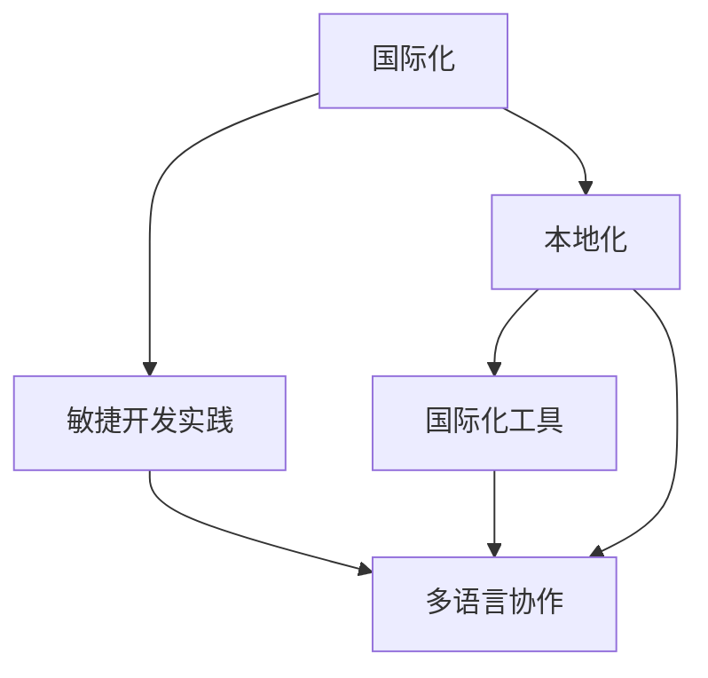

                 


### 2.1 敏捷团队的多语言协作

#### 背景介绍

在当今全球化背景下，软件产品和服务的多语言支持变得越来越重要。国际化的需求和用户多样化的语言背景，要求开发团队在敏捷开发过程中不仅要快速响应变化，还要高效地处理多语言开发任务。然而，多语言协作不仅涉及代码层面的国际化和本地化，还包括文档、测试、用户界面等各个方面。这对于原本就强调快速迭代和高效协作的敏捷团队来说，是一个巨大的挑战。

#### 核心概念与联系

在讨论敏捷团队的多语言协作时，需要理解几个核心概念及其之间的联系：

1. **国际化（Internationalization）**：指在设计软件时，使其能够支持多种语言和地区的过程，通常在软件开发的早期阶段进行。

2. **本地化（Localization）**：在国际化基础上，针对特定语言和文化进行软件的定制化，使其适应目标市场的需求。

3. **国际化工具**：如国际化框架、本地化编辑器、翻译记忆库等，用于支持多语言开发流程。

4. **敏捷开发实践**：如Scrum、Kanban等，强调迭代交付、持续集成和团队协作。

5. **多语言协作**：包括团队成员之间的沟通、任务分配、代码库管理等多个方面。

为了更清晰地理解这些概念之间的关系，我们可以使用Mermaid流程图来展示它们的工作流程：



#### 核心算法原理讲解

虽然多语言协作主要涉及的是软件工程和管理学原理，但我们可以用Python源代码来模拟一个简单的国际化任务，以便更好地理解过程。

```python
# Python示例：国际化与本地化基础

# 假设我们有一个基础信息对象，包含基本的国际化需求
info = {
    'title': 'Welcome to our Application',
    'greeting': 'Hello',
    'language': 'en'
}

# 国际化函数，将基础信息转换为指定语言
def internationalize(info, target_language):
    translations = {
        'en': {
            'title': 'Welcome to our Application',
            'greeting': 'Hello'
        },
        'es': {
            'title': 'Bienvenido a nuestra Aplicación',
            'greeting': 'Hola'
        },
        'fr': {
            'title': 'Bienvenue sur notre Application',
            'greeting': 'Bonjour'
        }
    }
    
    # 如果目标语言存在，则替换基础信息的语言部分
    if target_language in translations:
        info.update(translations[target_language])
    else:
        print(f"Language {target_language} not supported.")
    
    return info

# 使用国际化函数
localized_info = internationalize(info, 'es')
print(localized_info)
```

上述代码展示了如何使用Python来实现一个简单的国际化任务。在这个示例中，我们定义了一个包含基础信息的字典，然后创建了一个国际化函数，该函数根据目标语言返回相应的翻译。通过调用国际化函数，我们可以将应用界面转换为西班牙语。

#### 数学模型和公式讲解

国际化与本地化过程涉及的一些关键数学模型和公式主要与概率论和统计学有关，例如：

- **语言模型概率**：用于预测某个单词或短语在特定语言中出现的概率。
- **贝叶斯公式**：用于根据已知条件概率和先验概率计算后验概率。

假设我们有一个简单的语言模型，它用于预测单词“application”在英语中出现的位置。我们可以使用以下公式来计算：

$$
P(\text{"application"} | \text{English}) = \frac{P(\text{English} | \text{"application"}) \cdot P(\text{"application})}{P(\text{English})}
$$

其中，\( P(\text{"application"}) \) 表示单词“application”在所有语言中出现的概率，\( P(\text{English}) \) 表示英语语言的概率，\( P(\text{English} | \text{"application"}) \) 表示在“application”出现的条件下英语语言的概率。

#### 项目实战

为了更好地展示多语言协作在实际项目中的应用，我们可以搭建一个简单的国际化Web应用。

**开发环境搭建**

1. 安装Python环境（例如使用Python 3.8及以上版本）。
2. 安装Flask（一个轻量级的Web应用框架）和其他相关依赖。

```bash
pip install Flask
```

**源代码详细实现**

```python
# app.py - 一个简单的国际化Web应用

from flask import Flask, render_template, request

app = Flask(__name__)

# 假设的翻译字典
translations = {
    'en': {
        'title': 'Welcome to Our Application',
        'greeting': 'Hello',
    },
    'es': {
        'title': 'Bienvenido a Nuestra Aplicación',
        'greeting': 'Hola',
    },
    'fr': {
        'title': 'Bienvenue sur Notre Application',
        'greeting': 'Bonjour',
    }
}

@app.route('/', methods=['GET', 'POST'])
def index():
    language = request.form.get('language', 'en')
    if language not in translations:
        language = 'en'
    return render_template('index.html', translations=translations[language])

if __name__ == '__main__':
    app.run(debug=True)
```

**HTML模板**

```html
<!-- templates/index.html - 简单的HTML模板，根据语言动态渲染内容 -->

<!DOCTYPE html>
<html lang="en">
<head>
    <meta charset="UTF-8">
    <title>{{ translations.title }}</title>
</head>
<body>
    <h1>{{ translations.greeting }}</h1>
    <form method="post">
        <select name="language" onchange="this.form.submit()">
            <option value="en" {{ 'selected' if language == 'en' else '' }}>English</option>
            <option value="es" {{ 'selected' if language == 'es' else '' }}>Spanish</option>
            <option value="fr" {{ 'selected' if language == 'fr' else '' }}>French</option>
        </select>
    </form>
</body>
</html>
```

**代码应用解读与分析**

上述代码展示了如何使用Flask和HTML模板来创建一个简单的国际化Web应用。用户可以通过下拉菜单选择不同的语言，Web应用会根据用户选择的语言动态渲染页面内容。

**实际案例分析和详细讲解剖析**

我们可以通过以下案例来进一步分析多语言协作的实际应用：

- **案例：电子商务网站**：电子商务网站通常需要支持多种语言，以便吸引全球用户。在开发过程中，团队需要确保产品描述、用户界面和客户服务等都能适应不同语言和文化。
- **案例：社交媒体应用**：社交媒体应用也需要支持多种语言，以适应全球用户的需求。多语言协作不仅包括用户界面的国际化，还包括内容生成和管理的本地化。

**项目小结**

通过上述项目实战，我们可以看到多语言协作在敏捷开发中的应用。国际化工具和框架、敏捷开发实践以及团队成员之间的沟通都是确保多语言协作顺利进行的关键。在实际项目中，团队需要灵活应对语言差异和文化背景，以确保产品的国际化成功。

#### 最佳实践 tips、小结、注意事项、拓展阅读

- **最佳实践 tips**：
  - 在项目初期就进行国际化设计，避免后期大规模修改。
  - 建立清晰的翻译流程和标准，确保翻译质量和一致性。
  - 定期审查和更新国际化工具和框架，以适应新技术的发展。

- **小结**：
  - 敏捷团队的多语言协作是一个复杂的过程，涉及国际化、本地化和敏捷开发实践。
  - 通过使用国际化工具、建立清晰的翻译流程和灵活的敏捷实践，团队可以有效地应对多语言协作的挑战。

- **注意事项**：
  - 多语言协作可能会导致开发和维护成本增加，团队需要提前做好预算规划。
  - 文化差异和语言习惯的差异可能会影响用户的使用体验，团队需要充分考虑这些因素。

- **拓展阅读**：
  - 《国际化Web开发》（International Web Development）- 提供了Web应用国际化的详细指南。
  - 《敏捷开发实践指南》（The Agile Practice Guide）- 提供了敏捷开发的全面实践指导。

---

在这一章节中，我们介绍了敏捷团队多语言协作的背景、核心概念与联系、核心算法原理讲解、数学模型和公式讲解、项目实战以及最佳实践 tips。在接下来的章节中，我们将进一步探讨多语言开发流程的设计、LLM国际化的实现策略以及敏捷多语言开发的挑战与解决方案。

