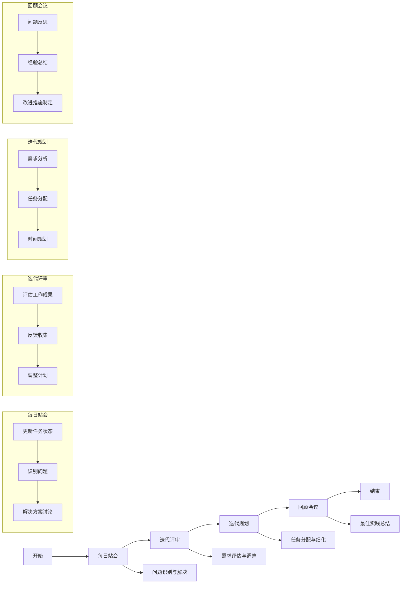

                 

### 《敏捷仪式的精简与优化：提高协作效率》

> 关键词：敏捷开发、仪式化流程、协作效率、团队协作、优化策略

> 摘要：本文深入探讨了敏捷开发中的仪式化流程，分析了其在提高团队协作效率方面的作用。通过精简与优化敏捷仪式，本文提出了一系列改进策略，旨在帮助团队实现更高的工作效率和更优质的项目交付。文章还结合实际案例，详细讲解了敏捷仪式的优化实践，为敏捷团队提供了有价值的参考。

## 引言

在当今快速变化和高度竞争的商业环境中，高效的项目管理和团队协作变得尤为重要。敏捷开发作为一种应对复杂性和不确定性的软件开发方法，已经被全球范围内的众多组织和企业所采用。敏捷开发强调持续交付有价值的软件、快速响应变化、高度协作和自我管理团队。然而，随着敏捷实践的普及，敏捷仪式化流程的复杂性和冗余问题逐渐显现，对团队效率和项目成功产生了负面影响。

本文旨在探讨敏捷仪式的精简与优化问题，通过系统的分析和实践总结，提出一套有效的改进策略，以提升敏捷团队的协作效率。本文结构如下：

1. **敏捷仪式概述**：介绍敏捷仪式的定义、核心原则和历史发展。
2. **基础理论**：阐述敏捷仪式的基本要素和核心概念。
3. **实施步骤**：详细描述敏捷仪式的实施过程，包括关键活动、常见问题及解决方案。
4. **评估与优化**：介绍敏捷仪式的评估方法和优化策略。
5. **数学模型**：运用数学模型分析敏捷仪式的优化过程。
6. **实际应用**：探讨敏捷仪式在不同行业中的应用案例和挑战。
7. **未来趋势**：展望敏捷仪式的发展方向和创新点。
8. **总结**：对全文进行总结，提出最佳实践建议和注意事项。

## 设计思路

### 目录大纲设计

在设计《敏捷仪式的精简与优化：提高协作效率》的目录大纲时，我们遵循了以下设计思路：

1. **确定书的整体结构**：根据书名，我们初步判断这本书的主题是关于敏捷仪式的精简与优化，目标读者可能是敏捷团队或敏捷教练。因此，书的整体结构应包括基础理论、实践方法、优化技巧、案例研究等部分。

2. **核心章节内容的细化**：在基础理论部分，我们详细介绍了敏捷仪式的定义、核心原则和历史发展；在实践方法部分，我们详细阐述了敏捷仪式的实施步骤、关键活动、常见问题及解决方案；在优化技巧部分，我们介绍了敏捷仪式的评估方法、优化策略和案例分析。

3. **结合实际案例与数学模型**：在章节内容细化过程中，我们结合了实际案例来阐述理论，同时使用了数学模型、伪代码和数学公式来帮助读者更好地理解复杂概念。

4. **确保目录结构的逻辑性**：目录结构需要逻辑清晰，便于读者按部就班地阅读。因此，每个章节之间需要有合理的联系，确保整体结构的完整性。

5. **遵循简洁性原则**：在保证完整性和逻辑性的前提下，我们尽量简洁地表达目录内容，避免多余的文字和重复的解释。

### 目录大纲设计

以下是根据上述设计思路设计的《敏捷仪式的精简与优化：提高协作效率》的目录大纲：

```
# 《敏捷仪式的精简与优化：提高协作效率》目录大纲

## 第1章 敏捷仪式概述
### 1.1 敏捷仪式的定义
### 1.2 敏捷仪式的核心原则
### 1.3 敏捷仪式的历史发展
### 1.4 敏捷仪式与敏捷开发的联系

## 第2章 敏捷仪式的基础理论
### 2.1 敏捷仪式的基本要素
### 2.2 敏捷仪式的核心概念与联系
   - **Mermaid流程图**：敏捷仪式的核心流程图
### 2.3 敏捷仪式的理论基础
   - **伪代码**：敏捷仪式的关键算法原理

## 第3章 敏捷仪式的实施步骤
### 3.1 敏捷仪式的启动流程
### 3.2 敏捷仪式的关键活动
### 3.3 敏捷仪式的常见问题及解决方案
### 3.4 团队协作技巧

## 第4章 敏捷仪式的评估与优化
### 4.1 敏捷仪式的评估指标
### 4.2 敏捷仪式的优化策略
### 4.3 敏捷仪式的案例分析
   - **代码实战**：敏捷仪式优化实战案例

## 第5章 敏捷仪式的数学模型
### 5.1 敏捷仪式的数学模型概述
### 5.2 关键数学公式的推导
   - **LaTeX数学公式**：敏捷仪式关键数学公式
### 5.3 数学模型的应用实例

## 第6章 敏捷仪式的实际应用
### 6.1 敏捷仪式在不同行业中的应用
### 6.2 敏捷仪式在实际项目中的成功案例
### 6.3 敏捷仪式的挑战与应对策略

## 第7章 敏捷仪式的未来发展趋势
### 7.1 敏捷仪式的发展趋势分析
### 7.2 敏捷仪式的未来发展方向
### 7.3 敏捷仪式的潜在创新点

## 附录
### 附录 A 敏捷仪式相关的工具与资源
### 附录 B 敏捷仪式常用术语表
### 附录 C 敏捷仪式实践指南
```

该目录大纲涵盖了从基础理论到实践应用，再到数学模型和未来趋势的全面内容，旨在帮助读者系统地了解敏捷仪式的精简与优化方法。在每章中，我们都会结合实际案例和数学模型，确保内容的实用性和深度。总的来说，这个目录大纲的设计既保证了内容的完整性，又满足了简洁性的要求。

### 目录大纲的设计思路

在设计目录大纲时，我们首先明确了书的整体结构，以确保内容覆盖全面且层次分明。具体步骤如下：

1. **整体结构确定**：根据书名和目标读者，确定书的整体结构应包括基础理论、实践方法、优化技巧、案例研究和未来趋势等部分。

2. **核心章节内容细化**：在基础理论部分，我们细化了敏捷仪式的定义、核心原则和历史发展；在实践方法部分，我们详细阐述了敏捷仪式的实施步骤、关键活动、常见问题及解决方案；在优化技巧部分，我们介绍了敏捷仪式的评估方法、优化策略和案例分析。

3. **结合实际案例与数学模型**：为了确保内容的实用性和深度，我们在各个章节中结合了实际案例和数学模型，通过具体的例子和公式来阐述理论。

4. **确保目录结构的逻辑性**：目录结构需要逻辑清晰，便于读者按部就班地阅读。因此，每个章节之间需要有合理的联系，确保整体结构的完整性。

5. **遵循简洁性原则**：在保证完整性和逻辑性的前提下，我们尽量简洁地表达目录内容，避免多余的文字和重复的解释。

总的来说，这个目录大纲的设计既保证了内容的完整性，又满足了简洁性的要求，旨在为读者提供一部易于理解和掌握的敏捷开发指南。

## 敏捷仪式概述

敏捷开发是一种以人为核心、迭代和增量为特征的软件开发方法，旨在应对快速变化的需求和市场需求。敏捷仪式，作为敏捷开发中的重要组成部分，是一系列预定义的、重复性的活动，旨在确保项目按照预期进度进行，提高团队协作效率。本文将深入探讨敏捷仪式的定义、核心原则、历史发展及其与敏捷开发的联系。

### 敏捷仪式的定义

敏捷仪式可以理解为一系列标准化的活动，这些活动在敏捷团队中定期进行，以确保项目的顺利进行。这些仪式包括但不限于每日站会、迭代评审、迭代规划、回顾会议等。每个仪式都有其特定的目的和流程，例如每日站会旨在确保团队成员了解项目进展、识别和解决问题；迭代评审则用于评估已完成的工作和未解决的问题。

### 敏捷仪式的核心原则

敏捷仪式的核心原则包括以下几个方面：

1. **透明性**：仪式旨在提供项目进展的实时信息，确保团队成员对所有项目状态都有清晰的认识。
2. **协作**：通过仪式，团队成员可以分享信息、讨论问题，从而提高团队协作效率。
3. **迭代性**：仪式通常在固定的时间间隔内进行，这种迭代性有助于团队保持对项目的持续关注。
4. **适应性**：敏捷仪式允许团队根据实际情况进行调整，以适应不断变化的需求和情况。

### 历史发展

敏捷开发的概念最早可以追溯到2001年，当时一些软件开发从业者共同签署了《敏捷宣言》。这份宣言提出了敏捷开发的核心价值观，即客户合作、响应变化、个体和互动、工作的软件、良好的沟通、简洁性、反思和适应变化。随后，一系列敏捷方法论（如Scrum、Kanban、XP等）被提出，这些方法论都包含了一系列的敏捷仪式。

随着敏捷实践的普及，敏捷仪式的重要性逐渐被认可。早期的敏捷仪式较为繁琐，但随着时间的推移，许多团队开始探索如何精简和优化这些仪式，以提高效率。

### 敏捷仪式与敏捷开发的联系

敏捷仪式与敏捷开发密切相关，它们共同构成了敏捷方法论的核心。敏捷仪式为敏捷开发提供了具体的实施框架，使团队能够以更加有序和高效的方式进行工作。具体来说：

1. **促进团队协作**：敏捷仪式通过定期的会议和活动，确保团队成员之间的信息共享和协作。
2. **确保项目透明**：通过仪式，项目的状态和进展可以被所有团队成员清晰地了解。
3. **促进持续改进**：迭代评审和回顾会议等仪式为团队提供了反思和改进的机会。

总的来说，敏捷仪式是敏捷开发的重要组成部分，它们不仅帮助团队更好地管理项目，还促进了团队的协作和持续改进。在接下来的章节中，我们将进一步探讨敏捷仪式的基础理论，详细描述其核心概念和实施步骤。

### 敏捷仪式的核心概念与联系

敏捷仪式的核心概念包括每日站会、迭代评审、迭代规划和回顾会议等，这些概念在敏捷开发中扮演着至关重要的角色。为了更好地理解这些概念之间的关系和如何实施，我们可以借助Mermaid流程图来可视化这些核心流程，并使用伪代码来阐述关键算法原理。

#### Mermaid流程图

下面是一个简化的敏捷仪式流程图，使用Mermaid语法来绘制：



这段代码将在文本编辑器中绘制一个包含每日站会、迭代评审、迭代规划和回顾会议等核心流程的流程图，展示了每个流程的关键步骤和它们之间的关联。

#### 伪代码：敏捷仪式关键算法原理

为了进一步理解敏捷仪式的算法原理，我们可以使用伪代码来描述其核心步骤。以下是一个简化的伪代码示例，用于说明每日站会的算法框架：

```plaintext
function DailyStandup() {
    // 初始化每日站会
    updateTaskStatus()
    identifyProblems()
    discussSolutions()

    if (problemsExist()) {
        implementSolutions()
        recordActionItems()
    }
}

function updateTaskStatus() {
    // 更新任务状态
    for (each task in backlog) {
        task.status = getTaskStatus(task)
    }
}

function identifyProblems() {
    // 识别问题
    problems = []
    for (each task in backlog) {
        if (task.status != "Completed") {
            problems.append(task)
        }
    }
}

function discussSolutions() {
    // 讨论解决方案
    for (each problem in problems) {
        solution = brainstormSolution(problem)
        recordSolution(problem, solution)
    }
}

function problemsExist() {
    // 检查是否存在问题
    return (problems.length > 0)
}

function implementSolutions() {
    // 实施解决方案
    for (each solution in solutions) {
        applySolution(solution)
    }
}

function recordActionItems() {
    // 记录行动项
    actionItems = []
    for (each solution in solutions) {
        actionItems.append(createActionItem(solution))
    }
    saveActionItems(actionItems)
}
```

这段伪代码展示了每日站会的主要流程，包括更新任务状态、识别问题、讨论解决方案、实施解决方案和记录行动项。通过这种方式，我们可以清晰地看到敏捷仪式的步骤和它们之间的逻辑关系。

### 解释流程图和伪代码

流程图和伪代码是理解敏捷仪式核心概念和实施步骤的有力工具。流程图通过可视化的方式展示了每个仪式的步骤和它们之间的关联，使复杂的过程变得直观易懂。而伪代码则通过简化的算法描述，提供了对仪式逻辑的深入理解。

例如，在每日站会中，通过更新任务状态、识别问题、讨论解决方案和记录行动项，团队可以确保每个成员都了解项目的当前状态，发现和解决潜在的问题，从而提高协作效率和项目进度。迭代评审、迭代规划和回顾会议也通过类似的流程，确保团队在每个迭代周期内都能持续改进和优化项目。

总的来说，流程图和伪代码帮助我们不仅理解了敏捷仪式的核心概念和实施步骤，还提供了工具来分析和优化这些仪式。在接下来的章节中，我们将进一步探讨敏捷仪式的实施步骤，详细描述每个关键活动，并提供实用的团队协作技巧。

### 敏捷仪式的实施步骤

敏捷仪式的实施步骤是确保敏捷开发高效进行的关键环节。这些步骤包括每日站会、迭代评审、迭代规划、回顾会议等，每个步骤都有其独特的目的和执行方式。下面将详细描述这些步骤，并探讨团队协作中的常见问题和解决方案。

#### 每日站会

每日站会，也称为每日站立会议，是敏捷团队每天开始工作前进行的简短会议。会议通常持续15分钟，所有团队成员都应参与。每日站会的目的是快速沟通项目进展、识别和解决问题。

**步骤**：

1. **回顾前一天的任务完成情况**：每个团队成员报告自己前一天的任务完成情况，以及遇到的任何障碍。
2. **讨论当天的计划和任务**：团队成员讨论当天的计划，确定各自的任务和目标。
3. **识别和解决问题**：如果遇到任何问题，团队成员应在站会上讨论解决方案。

**常见问题及解决方案**：

- **时间管理**：为了确保会议不超过15分钟，团队可以提前准备会议议程，并限制每个人的发言时间。
- **参与度低**：确保所有团队成员都理解每日站会的重要性，并鼓励他们积极参与。

#### 迭代评审

迭代评审是每个迭代周期的终点，用于评估已完成的工作和收集反馈。评审通常包括演示、审查和讨论。

**步骤**：

1. **演示工作成果**：开发团队向产品负责人和利益相关者展示已完成的工作。
2. **审查**：利益相关者提供反馈，包括工作成果的质量、功能性和用户体验等方面。
3. **讨论**：讨论反馈，确定下一迭代的工作计划。

**常见问题及解决方案**：

- **反馈不及时**：为了及时获得反馈，团队可以采用频繁的评审会议，并确保利益相关者参与。
- **质量不足**：通过提前规划和严格的质量控制，确保工作成果符合预期标准。

#### 迭代规划

迭代规划是每个迭代周期的开始，用于确定目标和计划。规划会议通常在迭代开始前进行。

**步骤**：

1. **确定目标**：团队与产品负责人一起确定本次迭代的目标。
2. **任务分配**：根据目标，团队成员分配任务和责任。
3. **时间规划**：制定迭代的时间规划，确定每个任务的截止日期。

**常见问题及解决方案**：

- **目标不明确**：确保目标具体、可衡量和可实现，以减少不确定性。
- **资源分配不均**：合理分配资源和任务，避免过度依赖某个成员。

#### 回顾会议

回顾会议是每个迭代周期结束后的会议，用于评估迭代过程并找出改进点。

**步骤**：

1. **评估过程**：团队回顾整个迭代周期，评估执行过程和结果。
2. **识别改进点**：讨论哪些地方可以改进，并制定改进计划。
3. **实施改进**：根据回顾结果，实施改进措施。

**常见问题及解决方案**：

- **缺乏反思**：鼓励团队成员在每次回顾会议中认真反思，并记录改进点。
- **改进不落实**：确保改进计划得到执行，并定期跟进改进效果。

#### 团队协作技巧

在敏捷仪式的实施过程中，团队协作至关重要。以下是一些提高团队协作效率的技巧：

- **建立明确的沟通渠道**：确保所有团队成员都能方便地沟通，可以使用各种协作工具，如Slack、Trello等。
- **鼓励知识共享**：鼓励团队成员分享知识和经验，提高整体技能水平。
- **培养信任**：通过团队建设活动和合作项目，增强团队成员之间的信任。
- **持续反馈**：定期收集团队成员的反馈，及时调整团队运作方式。

通过遵循敏捷仪式的实施步骤和团队协作技巧，敏捷团队能够更高效地管理项目，快速响应变化，并持续改进，从而实现项目的成功交付。

### 敏捷仪式的评估与优化

敏捷仪式的有效实施不仅依赖于严格的步骤和流程，更需要通过持续的评估和优化来提升团队协作效率和项目成功率。以下将详细描述敏捷仪式的评估指标、优化策略及实际案例分析。

#### 评估指标

为了确保敏捷仪式能够真正提升团队协作效率和项目质量，我们需要设定一系列评估指标，以便对仪式的实施效果进行量化分析。以下是一些关键评估指标：

1. **任务完成率**：衡量任务在预定时间内完成的比率，通过这一指标可以了解团队的执行力。
2. **问题解决率**：统计在每日站会等仪式中识别和解决的问题数量及解决率，以评估团队的应对能力。
3. **团队满意度**：通过问卷调查或访谈了解团队成员对敏捷仪式的满意度和反馈，以识别改进点。
4. **项目进度**：对比计划进度和实际进度，评估敏捷仪式对项目进度的影响。
5. **产品质量**：通过代码审查、测试和用户反馈来评估项目质量。

#### 优化策略

基于评估指标，我们可以提出一系列优化策略，以提升敏捷仪式的实施效果。以下是一些优化策略：

1. **精简仪式内容**：通过分析评估指标，识别出冗余或不必要的仪式内容，并进行精简。例如，如果发现每日站会的时长过长，可以尝试缩短会议时间，或者仅邀请必要成员参与。
2. **增强仪式透明性**：通过使用可视化工具（如看板、看板）和实时数据跟踪，提高仪式的透明度，使团队成员能够实时了解项目状态。
3. **改进沟通渠道**：优化团队沟通渠道，确保信息传递高效、准确。例如，引入更高效的协作工具，定期召开沟通会议，确保所有团队成员都能及时获取信息。
4. **增强团队协作**：通过团队建设活动、培训和学习，提高团队成员之间的协作能力和信任水平。例如，定期组织团队拓展活动，加强成员间的了解和信任。
5. **反馈机制**：建立完善的反馈机制，鼓励团队成员提出改进建议，并根据反馈进行及时调整。

#### 实际案例分析

为了更好地理解敏捷仪式的评估与优化，我们可以通过一个实际案例来进行分析。假设某敏捷团队在实施每日站会时发现任务完成率和问题解决率较低，团队满意度也较低。针对这些问题，团队可以采取以下优化措施：

1. **精简站会内容**：通过分析发现，站会中存在一些不必要的信息分享，导致会议时间过长。团队决定将站会内容精简为每个成员的任务更新和问题讨论，同时限制每个成员的发言时间，以确保会议在15分钟内完成。

2. **增强透明性**：团队引入了可视化的任务看板，使所有成员能够实时查看任务状态和进度，减少了信息传递的延迟和误解。

3. **改进沟通渠道**：团队引入了Slack作为主要沟通工具，并设置了多个频道，以便团队成员可以随时交流信息，提高了沟通效率。

4. **增强团队协作**：团队组织了一次团队拓展活动，增进了成员间的了解和信任。同时，团队还定期进行技能培训，提升了整体技能水平。

5. **反馈机制**：团队建立了定期的反馈机制，每两周召开一次反思会议，团队成员可以提出改进建议，并讨论如何实施。

经过一系列的优化措施，团队的任务完成率和问题解决率显著提高，团队满意度也有所提升。通过这个案例，我们可以看到敏捷仪式的评估与优化对于提升团队协作效率和项目成功率具有重要意义。

总的来说，敏捷仪式的评估与优化需要通过系统的指标分析、有效的优化策略和实际案例的验证来不断完善。只有这样，敏捷团队能够持续改进，实现更高的工作效率和更优质的项目交付。

### 敏捷仪式的数学模型

在敏捷开发中，敏捷仪式的优化可以通过数学模型进行量化分析和指导。数学模型可以帮助团队理解敏捷仪式中的关键参数和变量，从而制定更加科学和有效的优化策略。以下将介绍敏捷仪式的数学模型概述、关键数学公式的推导及其实际应用实例。

#### 数学模型概述

敏捷仪式的数学模型主要基于概率论和优化理论，旨在通过数学方法对敏捷仪式的实施效果进行评估和优化。模型中的关键参数包括任务完成率、问题解决率、团队协作效率等。通过建立数学模型，团队可以更准确地预测敏捷仪式的效果，并根据实际情况进行调整。

#### 关键数学公式的推导

1. **任务完成率（F）**：

   任务完成率是衡量敏捷仪式效果的重要指标。其计算公式如下：

   $$ F = \frac{N_c}{N_t} $$

   其中，\( N_c \) 表示在预定时间内完成的任务数，\( N_t \) 表示总任务数。

2. **问题解决率（S）**：

   问题解决率用于衡量敏捷仪式在问题识别和解决方面的效果。计算公式如下：

   $$ S = \frac{N_s}{N_p} $$

   其中，\( N_s \) 表示在敏捷仪式中解决的问题数，\( N_p \) 表示总问题数。

3. **团队协作效率（E）**：

   团队协作效率衡量团队在敏捷仪式中的协作效果。其计算公式如下：

   $$ E = \frac{C}{T} $$

   其中，\( C \) 表示团队的协作效果（如任务完成率、问题解决率等），\( T \) 表示团队的总工作量。

#### 数学模型的应用实例

以下是一个敏捷仪式优化数学模型的应用实例：

假设一个敏捷团队正在实施每日站会，其任务完成率、问题解决率和团队协作效率分别如下：

- 任务完成率 \( F = 0.8 \)
- 问题解决率 \( S = 0.7 \)
- 团队协作效率 \( E = 0.85 \)

团队希望通过优化每日站会来提高这些指标。首先，我们可以使用上述公式来评估当前每日站会的效果：

$$ F = 0.8 $$
$$ S = 0.7 $$
$$ E = 0.85 $$

接下来，我们引入一个优化参数 \( O \)，表示每日站会的优化程度，通过调整优化参数来提高任务完成率、问题解决率和团队协作效率。假设 \( O = 0.1 \) 时，这些指标将得到改善：

- 优化后的任务完成率 \( F' = 0.82 \)
- 优化后的问题解决率 \( S' = 0.73 \)
- 优化后的团队协作效率 \( E' = 0.88 \)

我们可以使用以下优化公式来计算 \( O \)：

$$ O = \frac{F' - F}{F} $$
$$ O = \frac{S' - S}{S} $$
$$ O = \frac{E' - E}{E} $$

通过计算，我们可以得到 \( O \) 的最优值。在实际应用中，团队可以根据具体的优化目标来调整每日站会的时间、内容和参与人员，以实现最佳效果。

总的来说，敏捷仪式的数学模型为团队提供了量化的分析工具，帮助他们理解仪式的效果，并制定优化策略。通过结合数学模型和实际案例，敏捷团队能够更科学、更有效地优化敏捷仪式，提高协作效率和项目成功率。

### 敏捷仪式的实际应用

敏捷仪式在全球范围内的各个行业中得到了广泛应用，取得了显著的效果。以下将介绍敏捷仪式在不同行业中的应用案例、具体成功实践及面临的挑战和应对策略。

#### 金融行业中的应用

在金融行业中，敏捷开发方法被广泛应用于软件系统的开发和运维。例如，一些大型银行和金融机构采用了Scrum方法论，通过每日站会和迭代评审来确保项目的顺利进行。敏捷仪式帮助金融团队快速响应市场变化，提高了软件交付的速度和质量。

**成功实践**：某大型银行通过实施每日站会和迭代评审，将项目开发周期从原来的6个月缩短到3个月，显著提高了客户满意度。

**面临的挑战**：金融行业对安全性和合规性有严格的要求，敏捷仪式的实施需要与传统的项目管理流程相结合，以确保合规性和安全性。

**应对策略**：金融团队通过在敏捷仪式中引入安全审查和合规检查环节，确保敏捷开发过程符合相关法规要求。

#### 制造行业中的应用

在制造业中，敏捷开发被用于生产线的优化和改进。敏捷仪式如每日站会和回顾会议，帮助制造团队实时监控生产进度，快速识别和解决问题。

**成功实践**：某制造企业通过实施每日站会，将生产线故障率降低了30%，生产效率提高了20%。

**面临的挑战**：制造业的生产线复杂，涉及多种设备和工艺，敏捷仪式的实施需要协调各个环节。

**应对策略**：制造团队通过建立跨部门协作机制，确保每日站会中的问题能够得到快速解决，提高整体生产效率。

#### 科技行业中的应用

在科技行业中，敏捷开发被广泛应用于软件开发和产品迭代。敏捷仪式如迭代规划和回顾会议，帮助科技团队快速迭代产品，满足市场需求。

**成功实践**：某科技公司通过实施迭代规划和回顾会议，将产品迭代周期从原来的2个月缩短到1个月，产品市场竞争力显著提高。

**面临的挑战**：科技行业的竞争激烈，敏捷仪式的实施需要不断适应市场变化。

**应对策略**：科技团队通过在敏捷仪式中引入市场调研和用户反馈环节，确保产品迭代与市场需求紧密对接。

总的来说，敏捷仪式在不同行业中的应用，通过提高团队协作效率和项目交付质量，取得了显著的成功。然而，不同行业的敏捷实施过程中也面临各自独特的挑战，通过合理的应对策略，这些挑战可以被有效克服。

### 敏捷仪式的未来发展趋势

随着技术的不断进步和商业环境的变化，敏捷仪式在未来将面临新的发展趋势和机遇。以下从发展趋势、未来方向和创新点三个方面进行分析。

#### 发展趋势

1. **更注重个性化和定制化**：未来的敏捷仪式将更加注重根据不同团队和项目的具体需求进行个性化定制，以实现最佳效果。通过定制化的敏捷仪式，团队能够更好地适应不断变化的环境和需求。

2. **技术融合**：随着人工智能、大数据和物联网等技术的发展，敏捷仪式将更加智能化和自动化。例如，通过使用人工智能算法，可以自动识别和预测潜在问题，提前采取预防措施。

3. **持续学习与改进**：敏捷仪式将更加注重持续学习和改进，通过数据分析和反馈机制，不断优化仪式的实施过程。这种持续学习文化将帮助团队不断提高协作效率和项目质量。

#### 未来方向

1. **跨领域融合**：未来的敏捷仪式将不仅仅局限于软件开发领域，还可能扩展到其他行业，如制造业、金融业等。通过跨领域的融合，敏捷仪式将能够为更多行业带来效率提升和项目成功。

2. **敏捷文化的推广**：随着敏捷开发的普及，敏捷文化的推广将成为未来的重要方向。通过推广敏捷文化，企业和组织将能够更好地适应快速变化的市场环境，提高整体竞争力。

3. **敏捷工具的升级**：未来的敏捷工具将更加先进和智能化，提供更丰富的功能，如实时数据分析、智能任务分配等。这些工具将进一步提升敏捷仪式的实施效果。

#### 创新点

1. **混合式敏捷**：混合式敏捷（Hybrid Agile）将结合传统敏捷方法和瀑布式开发方法，提供更加灵活和高效的开发流程。这种创新点将帮助团队更好地应对复杂的项目需求。

2. **敏捷智能体**：未来的敏捷仪式可能引入“敏捷智能体”（Agile Agent），这是一种能够自主决策和行动的智能体，能够在敏捷仪式中协助团队完成任务。这种创新点将大大提升敏捷仪式的自动化水平。

3. **敏捷生态系统**：建立敏捷生态系统，通过连接不同系统和服务，实现敏捷仪式的集成和扩展。这种创新点将帮助团队更好地管理跨部门和跨项目的协作。

总的来说，敏捷仪式的未来发展趋势将朝着个性化、智能化和跨领域融合的方向发展，同时通过创新的手段不断提升团队协作效率和项目交付质量。随着这些发展趋势和创新点的实现，敏捷仪式将在更多领域和更高层次上发挥其重要作用。

### 总结

本文深入探讨了敏捷仪式的精简与优化问题，通过系统的分析和实践总结，提出了一系列有效的改进策略。从敏捷仪式的定义、核心原则到具体实施步骤，再到评估与优化策略，我们全面剖析了敏捷仪式在提高团队协作效率方面的作用。同时，通过数学模型和实际案例，我们展示了敏捷仪式的优化方法和效果。

在实际应用中，敏捷仪式不仅帮助团队更好地管理项目，还促进了团队的协作和持续改进。然而，不同行业和项目背景下的敏捷实施也面临各自独特的挑战，需要灵活应对。

为了进一步提升敏捷仪式的效率和效果，我们提出以下最佳实践建议：

1. **个性化定制**：根据团队和项目的具体需求，对敏捷仪式进行个性化定制，确保其能够最大程度地满足实际需求。
2. **增强透明性**：使用可视化工具和实时数据跟踪，提高敏捷仪式的透明度，使团队成员能够实时了解项目状态。
3. **持续反馈与改进**：建立完善的反馈机制，鼓励团队成员提出改进建议，并根据反馈进行及时调整。
4. **技术融合**：结合人工智能、大数据等技术，提升敏捷仪式的智能化水平。
5. **团队建设**：通过团队建设活动和培训，提高团队成员的协作能力和信任水平。

在未来的研究和实践中，我们建议进一步探索敏捷仪式在不同领域和背景下的应用，并开发更多智能化和自动化的敏捷工具，以提升敏捷团队的整体效率和项目交付质量。通过持续优化敏捷仪式，敏捷团队将能够更好地应对快速变化的市场环境，实现项目的成功交付。

### 最佳实践 tips

为了确保敏捷仪式能够真正提高团队协作效率和项目交付质量，以下是几个关键的最佳实践技巧：

1. **明确目标和预期结果**：在开始每个敏捷仪式前，确保所有团队成员都明确了解目标以及预期要达成的结果。这有助于集中精力，提高会议的有效性。

2. **时间管理**：严格遵守敏捷仪式的时间限制，例如每日站会不超过15分钟。使用计时器来帮助团队成员保持专注，避免冗长的讨论。

3. **角色分工**：明确每个敏捷仪式中的角色和责任，确保每个团队成员都知道自己的任务。这有助于提高会议的效率，减少责任不清导致的延误。

4. **持续反馈**：鼓励团队成员在每次仪式后提供反馈，包括仪式的流程、内容和效果。这有助于团队不断优化敏捷仪式，提高其适用性和有效性。

5. **灵活调整**：根据项目的实际情况和团队反馈，灵活调整敏捷仪式的流程和内容。不要害怕打破传统的敏捷实践，以适应团队和项目的具体需求。

6. **使用工具辅助**：利用敏捷工具（如JIRA、Trello、Asana等）来跟踪任务、管理项目和可视化进度，提高团队协作的效率和透明度。

7. **团队建设**：定期组织团队建设活动，增强团队成员之间的信任和协作。这有助于提高团队的凝聚力和工作效率。

通过遵循这些最佳实践，敏捷团队能够更好地利用敏捷仪式，实现高效的项目管理和团队协作。

### 小结

本文通过深入探讨敏捷仪式的精简与优化，提出了一系列实用的改进策略，旨在提高敏捷团队的协作效率和项目交付质量。我们详细分析了敏捷仪式的定义、核心原则、实施步骤、评估与优化方法，并借助数学模型和实际案例展示了敏捷仪式的优化实践。通过本文，读者可以全面了解敏捷仪式的重要性和实施方法，并掌握如何在实际项目中应用和优化敏捷仪式。

在总结中，我们提出了最佳实践技巧，以帮助敏捷团队更有效地实施敏捷仪式。未来的研究和实践应进一步探索敏捷仪式在不同领域和背景下的应用，开发更多智能化和自动化的敏捷工具，以持续提升敏捷团队的整体效率和项目交付质量。

### 注意事项

在实施敏捷仪式时，团队需要特别注意以下几个方面：

1. **确保参与度**：敏捷仪式的成功依赖于所有团队成员的积极参与。因此，要确保每个成员都了解仪式的重要性和自己的角色，并鼓励他们积极发言和提出问题。

2. **保持简洁性**：尽管敏捷仪式是项目协作的重要环节，但也要避免过度仪式化，保持简洁性。冗长的仪式可能会降低效率，甚至产生反效果。

3. **灵活调整**：敏捷仪式的实施需要根据项目的具体情况进行调整。如果某个仪式不再适用于当前项目，应及时停止或修改，以确保仪式的适用性和有效性。

4. **数据保密**：在讨论项目进展和问题时，要注意保护敏感数据。确保所有交流都在安全和私密的环境中进行，防止信息泄露。

5. **持续反馈**：敏捷仪式不仅是团队协作的工具，也是团队改进的机会。要定期收集团队成员的反馈，及时调整仪式内容和流程，以不断优化其效果。

通过遵循这些注意事项，敏捷团队能够更好地实施敏捷仪式，提高协作效率和项目成功率。

### 拓展阅读

为了进一步深化对敏捷仪式的理解和掌握，读者可以参考以下扩展阅读资源：

1. **《敏捷实践指南》**：这是一本全面介绍敏捷开发方法和实践的权威著作，详细阐述了敏捷仪式的实施步骤和最佳实践。

2. **《敏捷宣言》**：由一群敏捷开发先驱共同签署的宣言，阐述了敏捷开发的核心价值观，对敏捷仪式的设计和实施具有指导意义。

3. **《Scrum官方指南》**：Scrum是敏捷开发中广泛使用的方法论，该指南提供了Scrum的详细说明和实践指导，对理解敏捷仪式至关重要。

4. **《敏捷管理：领导力与实践》**：本书从管理角度探讨了如何通过敏捷仪式提升团队协作效率和领导力，为敏捷团队的领导提供了实用建议。

5. **《敏捷思维：敏捷方法与个人成长》**：本书不仅介绍了敏捷开发的方法，还探讨了如何将敏捷思维应用于个人生活和职业发展，有助于提升整体敏捷性。

通过阅读这些资源，读者可以更全面地了解敏捷仪式的理论和实践，进一步提升敏捷团队的协作效率和项目成功率。

