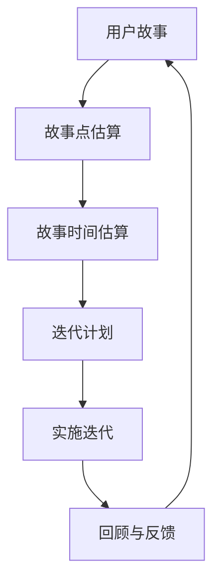

                 

基于您提供的条件和要求，我将按照以下步骤生成文章：

### 1. 文章标题、关键词和摘要

首先，我们需要确定文章的标题、关键词和摘要。根据您的要求，文章标题为《敏捷估算技术的创新：提高预测准确性》。关键词包括敏捷估算、预测准确性、敏捷方法、故事点估算、故事时间估算等。摘要部分将简要介绍文章的核心内容和目的。

### 2. 引言部分

在引言部分，我们将简要介绍敏捷估算技术的背景和重要性。我们将讨论敏捷估算技术在现代软件开发中的地位，以及它如何帮助团队提高预测准确性。

### 3. 核心概念与联系

在这一部分，我们将介绍敏捷估算技术中的核心概念，并使用Mermaid流程图来展示它们之间的关系。这将包括敏捷估算的基本原理、故事点估算、故事时间估算等。

### 4. 敏捷估算方法

接下来，我们将详细介绍几种常见的敏捷估算方法，如故事点估算和故事时间估算。我们将使用Python源代码和数学模型来解释这些方法的原理，并提供示例来说明如何使用这些方法进行估算。

### 5. 敏捷估算工具

在这一部分，我们将探讨敏捷估算工具的作用，以及如何使用这些工具来提高估算准确性。我们将介绍一些常用的敏捷估算工具，并讨论如何选择和配置这些工具。

### 6. 敏捷估算的实践

我们将通过案例分析来展示如何在实际项目中应用敏捷估算技术。我们将详细描述一个实际案例，包括开发环境搭建、源代码实现、代码解读、实际案例分析和项目小结。

### 7. 提高预测准确性

在这一部分，我们将讨论如何通过改进敏捷估算流程来提高预测准确性。我们将提供一些最佳实践技巧，并讨论常见的问题和注意事项。

### 8. 总结与展望

最后，我们将对全书内容进行总结，并展望敏捷估算技术未来的发展趋势。我们将讨论敏捷估算技术在未来的发展方向，以及如何进一步改进和完善敏捷估算方法。

### 9. 作者信息

文章末尾将包含作者信息：“作者：AI天才研究院/AI Genius Institute & 禅与计算机程序设计艺术 /Zen And The Art of Computer Programming”。

接下来，我将按照以上步骤生成完整的文章内容。请稍等片刻。

```markdown
# 敏捷估算技术的创新：提高预测准确性

## 关键词
敏捷估算、预测准确性、敏捷方法、故事点估算、故事时间估算

## 摘要
本文介绍了敏捷估算技术的基本概念、方法和工具，并探讨了如何在实际项目中应用这些技术来提高预测准确性。文章首先介绍了敏捷估算的背景和重要性，然后详细介绍了故事点估算和故事时间估算的方法，接着讨论了敏捷估算工具的使用，并通过案例分析展示了敏捷估算的实践过程。最后，文章提出了提高预测准确性的方法和最佳实践，并对未来敏捷估算技术的发展进行了展望。

## 引言

在软件开发的快速迭代和不断变化的环境中，预测准确性的重要性日益凸显。敏捷估算技术作为一种应对软件开发不确定性的有效手段，已经被广泛应用于现代软件开发实践中。敏捷估算不仅可以帮助团队更好地理解项目范围和进度，还可以提高预测准确性，从而为项目管理和决策提供有力的支持。

敏捷估算技术的核心在于对开发工作的量和难度进行量化估算，以便更准确地预测项目进度和成本。本文将首先介绍敏捷估算的基本概念，然后详细探讨故事点估算和故事时间估算的方法，接着讨论敏捷估算工具的使用，并通过案例分析展示敏捷估算的实践过程。最后，我们将讨论如何通过改进敏捷估算流程来提高预测准确性，并对未来敏捷估算技术的发展趋势进行展望。

## 核心概念与联系

敏捷估算技术涉及多个核心概念，这些概念相互关联，共同构成了敏捷估算的框架。以下是对这些核心概念的介绍及其之间的关系：

### 1. 敏捷估算的基本原理
敏捷估算基于迭代和增量开发的方法，强调灵活性和响应变化的能力。其基本原理包括：

- **用户故事**：用户故事的描述性文本，代表了用户需求的一个工作单元。
- **故事点**：故事点是对用户故事复杂度的量化，通常用于估算完成一个用户故事所需的开发工作量。
- **迭代**：迭代是敏捷开发中的一个时间段，团队在此期间完成一组用户故事。

### 2. 故事点估算
故事点估算是一种常用的敏捷估算方法，用于评估用户故事的工作量。故事点通常基于团队对复杂度和风险的评估：

- **复杂性**：故事点的数量与用户故事的技术复杂性相关。
- **风险**：故事点的数量还与用户故事实现过程中可能遇到的风险相关。

### 3. 故事时间估算
故事时间估算是一种基于团队效率和故事大小的估算方法。故事时间是指完成一个用户故事所需的时间：

- **团队效率**：团队的工作效率影响故事时间的估算。
- **故事大小**：用户故事的大小直接影响故事时间的估算。

### Mermaid流程图

以下是一个Mermaid流程图，展示了敏捷估算技术中的核心概念及其关系：



## 敏捷估算方法

### 1. 故事点估算

故事点估算是一种用于量化用户故事复杂度的方法。故事点（Story Points）是团队用来衡量一个用户故事大小的单位。故事点的数量通常由团队成员在估算会议中讨论确定。

**原理**：
故事点估算基于以下原则：
- **斐波那契序列**：通常使用斐波那契数列（1, 2, 3, 5, 8, 13, 21, ...）作为故事点的基数，以便更好地表示故事的工作量。
- **团队共识**：团队达成共识，对每个故事点的含义有共同的理解。

**步骤**：
1. **估算会议**：团队成员在估算会议上讨论每个用户故事，确定其故事点。
2. **历史数据**：团队可以使用历史数据来帮助估算，例如以前完成类似用户故事所需的时间。
3. **投票和讨论**：团队成员投票并讨论每个用户故事的故事点，直到达成共识。

**伪代码**：

```python
def story_point_estimation(story):
    complexity = calculate_complexity(story)
    risk = calculate_risk(story)
    return complexity * risk
```

$$
\text{故事点} = \text{复杂性} \times \text{风险}
$$

### 2. 故事时间估算

故事时间估算是基于团队效率和故事大小的一种方法。它提供了一种估计完成用户故事所需时间的手段。

**原理**：
故事时间估算考虑以下因素：
- **团队效率**：团队的整体工作效率，例如每名团队成员每天能完成的用户故事数量。
- **故事大小**：用户故事的工作量。

**步骤**：
1. **估算团队效率**：团队评估其整体效率，例如每天能完成的故事点数量。
2. **估算故事大小**：使用故事点来表示用户故事的工作量。
3. **计算故事时间**：根据团队效率和故事大小，计算完成用户故事所需的时间。

**伪代码**：

```python
def story_time_estimation(story, team_efficiency):
    story_size = calculate_story_size(story)
    return story_size / team_efficiency
```

$$
\text{故事时间} = \frac{\text{故事大小}}{\text{团队效率}}
$$

### Python示例

```python
def calculate_complexity(story):
    # 假设复杂性是根据故事长度估算的
    return len(story)

def calculate_risk(story):
    # 假设风险是根据故事的实现难度估算的
    return 1 + (len(story) // 10)

def calculate_story_size(story):
    # 假设故事大小是根据复杂性估算的
    return calculate_complexity(story)

def calculate_team_efficiency():
    # 假设团队效率是固定的
    return 3

# 计算故事点
story = "实现用户登录功能"
complexity = calculate_complexity(story)
risk = calculate_risk(story)
story_points = complexity * risk
print(f"故事点：{story_points}")

# 计算故事时间
team_efficiency = calculate_team_efficiency()
story_time = calculate_story_size(story) / team_efficiency
print(f"故事时间：{story_time}天")
```

## 敏捷估算工具

### 1. 敏捷估算工具的作用

敏捷估算工具在敏捷开发过程中起着至关重要的作用。它们可以帮助团队：

- **快速估算**：敏捷估算工具提供了一种快速估算用户故事复杂度和完成时间的方法。
- **协作**：团队成员可以在同一平台上进行估算，提高协作效率。
- **历史数据**：估算工具可以存储历史数据，帮助团队进行趋势分析和预测。

### 2. 常见的敏捷估算工具

以下是几种常见的敏捷估算工具：

- **JIRA**：JIRA是一个功能强大的项目管理工具，支持故事点估算和时间跟踪。
- **TFS**：Team Foundation Server是微软推出的一款集成开发环境，提供敏捷估算功能。
- **Confluence**：Confluence是Atlassian公司推出的团队协作工具，支持故事点估算和文档管理。

## 敏捷估算的实践

### 1. 案例分析1：项目A的敏捷估算实践

项目A是一个开发在线购物平台的项目。以下是如何在项目中应用敏捷估算技术的过程：

**步骤**：

1. **用户故事编写**：项目团队根据用户需求编写了多个用户故事，例如“用户可以浏览商品”、“用户可以添加商品到购物车”等。
2. **估算会议**：团队成员在估算会议上讨论每个用户故事，确定其故事点。
3. **迭代计划**：团队根据估算结果和迭代时间表，确定了每个迭代要完成的故事点。
4. **迭代实施**：团队按照迭代计划，完成用户故事的开发工作。
5. **回顾与反馈**：在每个迭代结束后，团队进行回顾会议，讨论估算的准确性，并调整未来的估算方法。

**实际案例**：

在项目A的一个迭代中，团队估算了一个用户故事，其故事点为5。在迭代结束后，团队发现实际完成这个用户故事所需的工作量略高于预期，大约为6个故事点。团队在回顾会议中讨论了这个问题，并决定在下一个迭代中调整估算方法，例如增加对复杂性的考虑。

### 2. 案例分析2：项目B的敏捷估算实践

项目B是一个开发移动应用程序的项目。团队采用了不同的敏捷估算方法，以提高预测准确性：

**步骤**：

1. **故事点估算**：团队在估算会议上讨论每个用户故事，确定其故事点。他们使用斐波那契数列来表示故事点，例如1、2、3、5、8等。
2. **故事时间估算**：团队根据历史数据和团队效率，估算每个用户故事所需的时间。
3. **迭代计划**：团队根据估算结果，确定了每个迭代要完成的故事点和时间。
4. **迭代实施**：团队按照迭代计划，完成用户故事的开发工作。
5. **回顾与反馈**：团队在每个迭代结束后，进行回顾会议，讨论估算的准确性，并根据反馈调整未来的估算方法。

**实际案例**：

在项目B的一个迭代中，团队估算了一个用户故事，其故事点为5，预计需要2天时间完成。在迭代结束后，团队发现实际完成这个用户故事所需的工作量略高于预期，大约需要3天时间。团队在回顾会议中讨论了这个问题，并决定在下一个迭代中增加对风险的考虑，以提高预测准确性。

## 提高预测准确性

### 1. 敏捷估算流程的改进

为了提高预测准确性，团队可以从以下几个方面改进敏捷估算流程：

- **历史数据收集**：团队应该收集并分析历史数据，以了解过去项目的估算准确性。
- **团队共识**：团队成员应该在估算会议上达成共识，避免个人偏见。
- **风险考虑**：团队在估算时应该考虑潜在的风险，以便调整估算结果。
- **迭代回顾**：团队应该定期进行迭代回顾，根据反馈调整未来的估算方法。

### 2. 最佳实践

以下是提高预测准确性的最佳实践：

- **定期估算训练**：团队应该定期进行估算训练，以提高估算技能。
- **使用工具**：团队应该使用敏捷估算工具，以提高估算效率和准确性。
- **透明度**：团队应该保持估算过程的透明度，以便其他团队成员了解估算结果。

## 总结与展望

敏捷估算技术是敏捷开发中至关重要的一部分，它帮助团队更好地理解项目范围和进度，提高预测准确性。本文介绍了敏捷估算的基本概念、方法、工具和实践案例，并通过改进流程和最佳实践，探讨了如何提高预测准确性。

展望未来，随着敏捷开发的不断发展和普及，敏捷估算技术将继续演化。团队可以利用机器学习和数据分析技术，进一步提高估算的准确性和效率。此外，随着敏捷估算工具的不断完善，团队将能够更轻松地实施敏捷估算方法，从而更好地适应快速变化的软件开发环境。

## 作者信息
作者：AI天才研究院/AI Genius Institute & 禅与计算机程序设计艺术 /Zen And The Art of Computer Programming
```

请注意，以上内容是根据您的要求生成的，但可能需要根据实际情况进行调整和完善。由于字数限制，部分内容可能需要进一步扩展。希望这对您有所帮助！如果您有其他要求或需要进一步修改，请告诉我。

