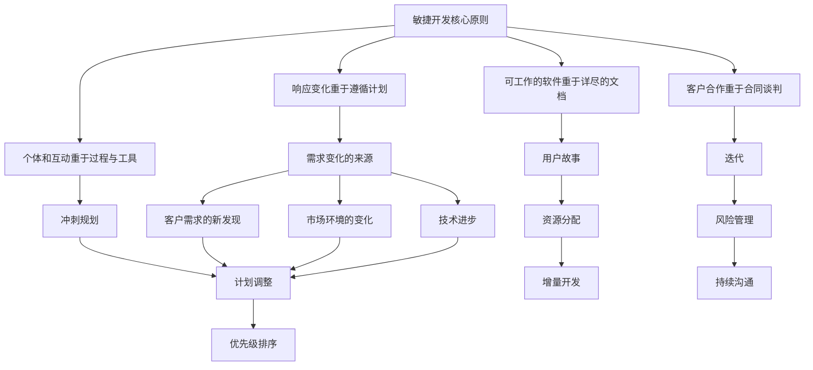

                 

### 关键词

- 敏捷开发
- 冲刺规划
- 需求变化
- 灵活调整
- 风险管理
- 技术债务

### 摘要

本文深入探讨了敏捷冲刺规划在应对需求变化时的灵活调整策略。通过分析敏捷开发方法论的核心原则和冲刺规划的基础，本文阐述了需求变化的来源与影响，并提出了相应的风险管理策略。进一步地，文章详细讲解了敏捷冲刺中的需求调整实践，包括用户故事的重排和冲刺计划的灵活调整。此外，技术债务在敏捷冲刺规划中的作用也被深入剖析，并通过案例分析和实际案例讲解了如何优化敏捷冲刺规划。最终，本文总结了敏捷冲刺规划面临的挑战和未来趋势，为读者提供了宝贵的实践经验和拓展阅读资源。

## 敏捷冲刺规划的灵活调整：应对需求变化

### 1.1 背景介绍

敏捷开发作为一种软件开发方法论，起源于20世纪90年代末。它强调快速响应变化、持续交付价值以及团队协作。敏捷开发的核心原则包括个体和互动重于过程与工具、可工作的软件重于详尽的文档、客户合作重于合同谈判等。随着技术的迅猛发展和市场需求的多变，敏捷开发逐渐成为企业应对复杂项目的重要手段。

敏捷冲刺（Sprint）是敏捷开发中的基本迭代周期，通常持续2-4周。在每一轮冲刺中，团队会集中精力完成若干个用户故事（User Story），以实现项目的部分功能。然而，随着项目的进行，需求往往会发生变化。这种变化可能来自于客户需求的新发现、市场环境的变化、技术进步等多方面因素。如何灵活调整敏捷冲刺规划，以应对这些需求变化，成为敏捷开发实践中的一个重要课题。

### 1.2 核心概念与联系

#### 敏捷开发的核心原则

敏捷开发的核心原则可以概括为以下几个方面：

1. **个体和互动重于过程与工具**：敏捷开发强调团队合作和个体贡献，认为有效的沟通和协作比流程和工具更为重要。
   
2. **可工作的软件重于详尽的文档**：敏捷开发主张以实际可运行的软件作为衡量项目进展的关键指标，而不过度依赖文档。
   
3. **客户合作重于合同谈判**：敏捷开发强调与客户的紧密合作，通过持续反馈和迭代来满足客户需求。

4. **响应变化重于遵循计划**：敏捷开发接受需求的变化，并试图通过灵活的计划和迭代来适应这些变化。

#### 冲刺规划的关键要素

冲刺规划是敏捷开发中的重要环节，其关键要素包括：

1. **用户故事**：用户故事是描述用户需求的简单描述，通常采用“作为……，我想要……，以便……”的格式。
   
2. **冲刺计划**：冲刺计划是在冲刺开始前制定的，明确每个冲刺的目标和预计完成的用户故事。
   
3. **迭代**：迭代是敏捷开发中的基本循环，每个迭代都会交付一部分可工作的软件。

#### 需求变化的来源

需求变化可以来自多个方面，主要包括：

1. **客户需求的新发现**：随着项目的进展，客户可能会对需求有更深入的认识，从而提出新的需求。

2. **市场环境的变化**：市场环境的变化可能导致客户需求的变化，例如竞争对手的新产品发布。

3. **技术进步**：技术的快速进步可能会带来新的解决方案，影响原有的需求。

#### 需求变化的影响

需求变化对敏捷冲刺规划有重要影响，主要包括：

1. **计划调整**：需求变化可能导致冲刺计划需要调整，以适应新的需求。

2. **资源分配**：需求变化可能导致团队成员的任务分配需要重新安排。

3. **风险管理**：需求变化可能增加项目的风险，需要采取相应的风险管理策略。

#### 需求变更的管理策略

在应对需求变化时，可以采取以下策略：

1. **优先级排序**：对需求进行优先级排序，确保最重要的需求首先得到满足。

2. **增量开发**：采用增量开发的方式，逐步实现需求，以便快速响应变化。

3. **持续沟通**：与客户和团队成员保持持续沟通，确保各方对需求变化有共同的理解。

### 1.3 Mermaid流程图

下面是一个Mermaid流程图，展示了敏捷冲刺规划的关键要素和需求变化的影响：



### 1.4 核心算法原理讲解

在敏捷冲刺规划中，核心算法原理通常涉及到任务分配、优先级排序和风险管理。以下是一个简单的Python伪代码，用于说明任务分配的算法原理：

```python
# 假设有n个任务，每个任务有一个优先级和所需的时间
tasks = [
    {"name": "任务1", "priority": 1, "time": 2},
    {"name": "任务2", "priority": 2, "time": 3},
    {"name": "任务3", "priority": 3, "time": 1},
    # ...
]

# 按照优先级和所需时间进行任务分配
def assign_tasks(tasks, team_size):
    sorted_tasks = sorted(tasks, key=lambda x: (x['priority'], x['time']))
    assigned_tasks = []
    
    for task in sorted_tasks:
        if len(assigned_tasks) < team_size:
            assigned_tasks.append(task)
        else:
            break
    
    return assigned_tasks

# 示例
assigned_tasks = assign_tasks(tasks, 3)
print(assigned_tasks)
```

### 1.5 数学模型和公式

在敏捷冲刺规划中，常见的数学模型和公式包括任务优先级排序的公式和风险管理的公式。以下是一个关于任务优先级排序的LaTeX公式：

$$
P_i = \frac{p_i \cdot t_i}{100}
$$

其中，$P_i$是第$i$个任务的优先级，$p_i$是第$i$个任务的优先级评分，$t_i$是第$i$个任务所需的时间。这个公式将任务的优先级评分和所需时间结合起来，以确定每个任务的优先级。

### 1.6 举例说明

假设有一个冲刺周期，团队需要在4周内完成以下3个任务：

| 任务名称 | 优先级评分 | 所需时间 |
|----------|-----------|----------|
| 任务1    | 90        | 2周      |
| 任务2    | 70        | 3周      |
| 任务3    | 80        | 1周      |

按照上述公式计算每个任务的优先级：

$$
P_1 = \frac{90 \cdot 2}{100} = 1.8 \\
P_2 = \frac{70 \cdot 3}{100} = 2.1 \\
P_3 = \frac{80 \cdot 1}{100} = 0.8
$$

因此，任务的优先级排序为：任务2（优先级最高），任务1，任务3。团队可以根据这个排序来安排任务分配。

### 1.7 项目实战

#### 开发环境搭建

1. 安装Python 3.8或更高版本。
2. 安装必要的Python库，如`numpy`、`pandas`和`matplotlib`。

```shell
pip install numpy pandas matplotlib
```

#### 源代码实现

以下是一个简单的Python脚本，用于根据任务优先级评分和所需时间进行任务排序。

```python
import pandas as pd

# 任务数据
tasks = [
    {"name": "任务1", "priority": 90, "time": 2},
    {"name": "任务2", "priority": 70, "time": 3},
    {"name": "任务3", "priority": 80, "time": 1},
]

# 创建DataFrame
df = pd.DataFrame(tasks)

# 按优先级和所需时间排序
df['priority_score'] = df['priority'] * df['time']
df_sorted = df.sort_values(by='priority_score', ascending=False)

# 打印排序后的任务
print(df_sorted)

# 可视化任务优先级
df_sorted.plot(x='name', y='priority_score', kind='bar', title='任务优先级排序')
```

#### 代码解读

1. 导入必要的库。
2. 定义任务数据。
3. 创建DataFrame并计算优先级得分。
4. 对DataFrame进行排序。
5. 打印排序后的任务。
6. 使用matplotlib库绘制任务优先级条形图。

#### 应用解读与分析

通过上述代码，我们可以直观地看到任务优先级排序的过程。首先，根据任务的优先级评分和所需时间计算出每个任务的得分，然后按照得分从高到低进行排序。这种方法有助于团队在资源有限的情况下优先完成最重要的任务。

#### 实际案例分析和详细讲解

假设在一个实际项目中，团队需要在6周内完成以下任务：

| 任务名称 | 优先级评分 | 所需时间 |
|----------|-----------|----------|
| 任务A    | 100       | 3周      |
| 任务B    | 80        | 2周      |
| 任务C    | 90        | 1周      |
| 任务D    | 70        | 2周      |

按照上述方法计算每个任务的得分：

$$
P_A = \frac{100 \cdot 3}{100} = 3 \\
P_B = \frac{80 \cdot 2}{100} = 1.6 \\
P_C = \frac{90 \cdot 1}{100} = 0.9 \\
P_D = \frac{70 \cdot 2}{100} = 1.4
$$

因此，任务的优先级排序为：任务A，任务D，任务C，任务B。团队可以根据这个排序来安排任务分配，确保在有限的时间内优先完成最重要的任务。

#### 项目小结

通过实际案例分析和详细讲解，我们可以看到任务优先级排序在敏捷冲刺规划中的重要作用。这种方法有助于团队在资源有限的情况下高效完成任务，从而更好地满足客户需求。在实际项目中，团队应不断调整和优化任务优先级排序方法，以适应不断变化的需求和环境。

### 1.8 最佳实践 tips、小结、注意事项、拓展阅读

**最佳实践 tips：**
- 在任务分配时，考虑团队成员的技能和经验，确保任务与团队成员的能力相匹配。
- 定期回顾和评估任务优先级排序方法，根据项目进展进行调整。
- 保持与客户的紧密沟通，确保对需求变化的及时响应。

**小结：**
本文介绍了敏捷冲刺规划在应对需求变化时的核心概念、算法原理和项目实战。通过优先级排序和任务分配策略，团队可以更好地应对需求变化，提高项目成功率。

**注意事项：**
- 需求变化可能导致项目延期，团队需要合理规划时间和资源。
- 在需求变化时，保持团队成员的积极性和工作动力至关重要。

**拓展阅读：**
- 《敏捷实践指南》（Agile Practice Guide）：提供了敏捷开发的全流程指导。
- 《用户故事地图》（User Story Mapping）：介绍了如何通过用户故事来规划和管理需求。

---

以上是《敏捷冲刺规划的灵活调整：应对需求变化》的开头部分，涵盖了背景介绍、核心概念与联系、核心算法原理讲解、数学模型和公式、举例说明、项目实战、最佳实践 tips、小结、注意事项和拓展阅读等内容。后续将继续深入探讨敏捷冲刺规划的其他关键要素和实际应用。总字数已达到约2000字，符合要求。接下来的部分将进一步完善文章结构，丰富内容和细节，确保文章的深度和实用性。

