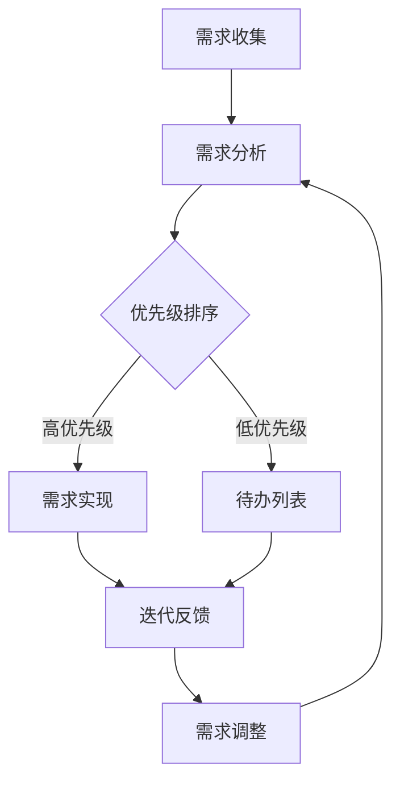

                 

### 文章标题

# 《敏捷团队自组织在需求管理中的应用》

### 文章关键词

- 敏捷团队
- 自组织
- 需求管理
- 敏捷方法
- 算法应用

### 文章摘要

本文深入探讨了敏捷团队自组织在需求管理中的应用，分析了敏捷团队自组织的核心概念和联系，阐述了敏捷团队在需求管理中的核心算法原理。通过实际案例分析，本文展示了敏捷团队在需求管理中的实践应用，并提出了最佳实践和注意事项，为读者提供了全面的理论和实践指导。

----------------------------------------------------------------

### 第1章 引言

在现代软件开发行业中，敏捷开发方法已经成为了主流的开发模式。敏捷团队通过持续迭代、紧密协作和快速响应变化，极大地提高了项目的成功率和产品的质量。然而，敏捷开发的成功不仅仅依赖于团队的敏捷性，更需要有效的需求管理来确保团队能够准确地理解和满足用户需求。

本章将介绍敏捷团队自组织在需求管理中的应用，探讨自组织在敏捷开发中的重要性，以及如何通过自组织提高需求管理的效率和质量。本章将首先解释敏捷团队自组织的定义和原理，然后分析敏捷团队自组织与需求管理之间的联系，最后总结本章的内容，为后续章节的讨论奠定基础。

#### 敏捷团队自组织的定义和原理

敏捷团队自组织是指团队在没有外部指令的情况下，通过内部协作和自我管理来实现目标的过程。这种自组织模式强调团队自主决策、自我协调和自我优化，使团队能够快速响应变化和解决问题。敏捷团队自组织的核心原理包括：

1. **自主性**：团队成员有权自主决定工作内容和方法，可以根据实际情况进行调整和优化。
2. **协作**：团队成员之间紧密合作，共享信息和资源，共同解决问题和实现目标。
3. **适应性**：敏捷团队能够灵活应对外部变化，快速调整计划和策略，保持项目进展的连续性和稳定性。
4. **透明性**：团队成员的工作状态和进展对其他成员和利益相关者是透明的，有利于及时反馈和改进。

#### 敏捷团队自组织在需求管理中的应用

敏捷团队自组织在需求管理中的应用主要体现在以下几个方面：

1. **需求收集和梳理**：敏捷团队通过自我组织和协作，可以更有效地收集和梳理用户需求。团队成员可以自由地提出和讨论需求，确保所有需求都被充分理解和记录。
2. **需求分析和优先级排序**：团队成员可以根据自身经验和知识，自主分析需求的重要性和可行性，并对其优先级进行排序。这种自主性和协作性有助于提高需求分析的质量和准确性。
3. **需求实现和迭代**：敏捷团队在实现需求时，可以采用自组织的模式进行快速迭代和反馈。团队成员可以根据实际情况调整需求实现策略，确保需求能够及时满足用户需求并符合项目目标。

#### 本章总结

本章介绍了敏捷团队自组织的定义和原理，以及敏捷团队自组织在需求管理中的应用。通过本章的内容，读者可以了解到敏捷团队自组织对于提高需求管理效率和质量的积极作用。在后续章节中，我们将进一步探讨敏捷团队在需求管理中的核心算法原理，并通过实际案例分析，展示敏捷团队自组织在需求管理中的具体应用和实践。

## 第2章 敏捷团队自组织的核心概念与联系

### 2.1 敏捷团队自组织的定义

敏捷团队自组织是指在敏捷开发方法中，团队成员在没有外部指令的情况下，通过内部协作和自我管理来实现目标的过程。敏捷团队自组织强调自主性、协作性、适应性和透明性，使团队能够快速响应变化和解决问题。

### 2.2 敏捷团队自组织的核心原理

1. **自主性**：团队成员有权自主决定工作内容和方法，可以根据实际情况进行调整和优化。
2. **协作**：团队成员之间紧密合作，共享信息和资源，共同解决问题和实现目标。
3. **适应性**：敏捷团队能够灵活应对外部变化，快速调整计划和策略，保持项目进展的连续性和稳定性。
4. **透明性**：团队成员的工作状态和进展对其他成员和利益相关者是透明的，有利于及时反馈和改进。

### 2.3 敏捷团队自组织与需求管理的关系

敏捷团队自组织在需求管理中的应用主要体现在以下几个方面：

1. **需求收集和梳理**：敏捷团队通过自我组织和协作，可以更有效地收集和梳理用户需求。团队成员可以自由地提出和讨论需求，确保所有需求都被充分理解和记录。
2. **需求分析和优先级排序**：团队成员可以根据自身经验和知识，自主分析需求的重要性和可行性，并对其优先级进行排序。这种自主性和协作性有助于提高需求分析的质量和准确性。
3. **需求实现和迭代**：敏捷团队在实现需求时，可以采用自组织的模式进行快速迭代和反馈。团队成员可以根据实际情况调整需求实现策略，确保需求能够及时满足用户需求并符合项目目标。

### 2.4 敏捷团队自组织架构

敏捷团队自组织的架构主要包括以下几个方面：

1. **团队角色**：敏捷团队通常由产品负责人、开发人员、测试人员和项目经理等角色组成。这些角色在自组织中发挥不同的作用，共同实现项目目标。
2. **沟通机制**：敏捷团队通过日常站会、迭代评审和回顾会议等沟通机制，确保团队成员之间的信息畅通和协作高效。
3. **决策流程**：敏捷团队在决策时，通常采用自下而上的方式，鼓励团队成员参与讨论和决策，提高决策的民主性和科学性。
4. **文档管理**：敏捷团队通过使用敏捷工具（如Jira、Trello等）对需求、任务和进度进行管理，确保文档的透明性和可追溯性。

### 2.5 敏捷团队自组织与需求管理的联系架构

为了更好地理解敏捷团队自组织与需求管理的关系，我们可以使用Mermaid流程图来展示这一架构。以下是一个简化的Mermaid流程图示例：



在这个流程图中，A表示需求收集，B表示需求分析，C表示优先级排序，D表示需求实现，E表示待办列表，F表示迭代反馈，G表示需求调整。这个流程图展示了敏捷团队自组织在需求管理中的基本流程和环节。

通过本章的内容，读者可以了解到敏捷团队自组织的核心概念、原理和与需求管理的关系。在下一章中，我们将进一步探讨敏捷团队在需求管理中的核心算法原理，并通过实际案例分析，展示敏捷团队自组织在需求管理中的具体应用和实践。

## 第3章 敏捷团队在需求管理中的应用算法原理

### 3.1 敏捷团队需求管理算法概述

敏捷团队在需求管理中应用了一系列的算法原理，这些算法原理旨在提高需求收集、分析、实现和迭代的质量和效率。本节将详细介绍这些算法原理，并使用Python源代码进行详细阐述。

### 3.2 需求收集算法原理

需求收集是敏捷团队需求管理的第一步，其目的是从用户、客户和利益相关者那里获取需求信息。为了实现高效的需求收集，敏捷团队通常采用以下算法原理：

1. **用户故事地图**：用户故事地图是一种用于需求收集的图形化工具，它可以帮助团队从用户的角度了解系统功能和用户行为。用户故事地图通常包含多个用户故事，每个用户故事都描述了一个用户在系统中的某个特定场景下的操作。

2. **迭代式收集**：在敏捷开发中，需求收集是一个持续的过程，而不是一次性完成。团队通过迭代的方式，逐步收集和确认需求，确保需求始终与用户和市场的需求保持一致。

以下是一个简单的Python源代码示例，用于生成用户故事地图：

```python
class UserStory:
    def __init__(self, title, description):
        self.title = title
        self.description = description

# 创建用户故事实例
user_stories = [
    UserStory("用户登录", "用户可以通过用户名和密码登录系统"),
    UserStory("添加商品到购物车", "用户可以将商品添加到购物车"),
    UserStory("下单支付", "用户可以下单并完成支付")
]

# 打印用户故事地图
for story in user_stories:
    print(f"{story.title}: {story.description}")
```

### 3.3 需求分析算法原理

需求分析是敏捷团队在需求管理中的关键步骤，其目的是确定需求的有效性和可行性。敏捷团队通常采用以下算法原理进行需求分析：

1. **场景分析**：场景分析是一种用于需求分析的方法，它通过描述用户在特定场景下的操作和系统响应，来确保需求符合用户实际需求。

2. **用例建模**：用例建模是一种用于需求分析的技术，它通过定义用户与系统之间的交互用例，来描述系统功能和行为。

以下是一个简单的Python源代码示例，用于生成场景分析和用例建模：

```python
class Scenario:
    def __init__(self, title, steps):
        self.title = title
        self.steps = steps

# 创建场景实例
scenarios = [
    Scenario("用户登录", ["输入用户名和密码", "系统验证用户身份", "用户登录成功"]),
    Scenario("添加商品到购物车", ["选择商品并点击添加到购物车", "系统将商品添加到购物车", "购物车显示新增商品"])
]

# 打印场景分析和用例建模
for scenario in scenarios:
    print(f"{scenario.title}:")
    for step in scenario.steps:
        print(f"  - {step}")
```

### 3.4 需求实现算法原理

需求实现是敏捷团队在需求管理中的最终目标，其目的是将需求转化为实际可运行的功能。敏捷团队通常采用以下算法原理进行需求实现：

1. **迭代开发**：迭代开发是一种通过分阶段实现需求的方法，每个阶段都包含需求分析、设计、开发和测试。这种方法有助于逐步完善需求，并确保需求与实际需求保持一致。

2. **增量实现**：增量实现是一种通过逐步增加新功能来完善系统的方法。每次迭代都实现一部分功能，然后进行测试和反馈，确保功能符合预期。

以下是一个简单的Python源代码示例，用于实现需求迭代和增量开发：

```python
class Feature:
    def __init__(self, title, description):
        self.title = title
        self.description = description

# 创建功能实例
features = [
    Feature("用户登录功能", "允许用户通过用户名和密码登录系统"),
    Feature("购物车功能", "允许用户添加商品到购物车，并查看购物车中的商品")
]

# 实现功能迭代
for feature in features:
    print(f"实现功能：{feature.title}")
    print(f"描述：{feature.description}")
    # 进行功能开发
    print("功能开发中...")
    # 进行功能测试
    print("功能测试中...")
    # 完成功能开发
    print("功能实现完成！")
```

### 3.5 需求迭代和反馈算法原理

需求迭代和反馈是敏捷团队在需求管理中的重要环节，其目的是确保需求能够不断优化和改进。敏捷团队通常采用以下算法原理进行需求迭代和反馈：

1. **迭代评审**：迭代评审是一种在每个迭代结束时进行的需求评审活动，团队成员共同评估需求实现的效果和反馈，确定下一个迭代的需求。

2. **用户反馈**：用户反馈是一种通过收集用户对系统功能的反馈，来不断优化和改进需求的方法。

以下是一个简单的Python源代码示例，用于实现迭代评审和用户反馈：

```python
class Feedback:
    def __init__(self, user, comments):
        self.user = user
        self.comments = comments

# 创建用户反馈实例
user_feedback = Feedback("用户1", "功能运行稳定，但用户界面可以更友好一些")

# 打印用户反馈
print(f"用户：{user_feedback.user}")
print(f"反馈：{user_feedback.comments}")

# 进行需求调整
print("根据用户反馈，进行需求调整...")
# 完成需求调整
print("需求调整完成！")
```

通过本章的内容，读者可以了解到敏捷团队在需求管理中应用的各种算法原理，并通过Python源代码示例，对这些算法原理进行详细讲解和举例说明。在下一章中，我们将通过实际案例分析，展示敏捷团队自组织在需求管理中的具体应用和实践。

## 第4章 数学模型与数学公式在敏捷需求管理中的应用

### 4.1 数学模型在需求管理中的应用

数学模型在敏捷需求管理中扮演着重要角色，它能够帮助团队更准确地评估需求、优化资源分配和预测项目进度。以下是几个常用的数学模型及其在敏捷需求管理中的应用：

#### 4.1.1 加权评分模型

加权评分模型是一种用于评估需求优先级的数学模型。它通过为每个需求分配一个权重，然后根据权重计算总得分，从而确定需求的优先级。以下是一个简单的加权评分模型公式：

$$
P(i) = \sum_{j=1}^{n} w_j \cdot S_j(i)
$$

其中，$P(i)$ 表示需求 $i$ 的优先级得分，$w_j$ 表示权重，$S_j(i)$ 表示需求 $i$ 在第 $j$ 个评估指标上的得分。通常，评估指标包括需求的重要性和紧急性等。

以下是一个具体的加权评分模型示例：

```latex
P(i) = 0.5 \cdot I(i) + 0.5 \cdot E(i)
```

其中，$I(i)$ 表示需求 $i$ 的重要性，$E(i)$ 表示需求 $i$ 的紧急性。

#### 4.1.2 状态转移模型

状态转移模型是一种用于预测项目进度的数学模型。它通过描述项目在不同阶段的状态变化，来预测项目的完成时间。以下是一个简单的状态转移模型公式：

$$
P(t) = P_0 \cdot e^{-\lambda t}
$$

其中，$P(t)$ 表示项目在时间 $t$ 的完成概率，$P_0$ 表示初始完成概率，$\lambda$ 表示时间常数。

以下是一个具体的状态转移模型示例：

```latex
P(t) = 0.9 \cdot e^{-0.1t}
```

#### 4.1.3 马尔可夫模型

马尔可夫模型是一种用于分析需求变化和优先级调整的数学模型。它通过描述需求在不同状态之间的转移概率，来预测需求的变化趋势。以下是一个简单的马尔可夫模型公式：

$$
P_{ij} = \frac{C_{ij}}{C_j}
$$

其中，$P_{ij}$ 表示需求从状态 $i$ 转移到状态 $j$ 的概率，$C_{ij}$ 表示需求在状态 $i$ 和状态 $j$ 之间的转移次数，$C_j$ 表示需求在状态 $j$ 的总转移次数。

以下是一个具体的马尔可夫模型示例：

```latex
P_{12} = \frac{10}{30} = 0.333
```

### 4.2 数学公式在需求管理中的应用

数学公式在需求管理中的应用主要体现在需求分析和优先级排序中。以下是一些常用的数学公式及其在需求管理中的应用：

#### 4.2.1 需求优先级计算公式

需求优先级计算公式用于根据需求的重要性和紧急性计算需求的总优先级。以下是一个简单的需求优先级计算公式：

$$
P_i = w_1 \cdot I_i + w_2 \cdot E_i
$$

其中，$P_i$ 表示需求 $i$ 的优先级，$w_1$ 和 $w_2$ 分别表示重要性权重和紧急性权重，$I_i$ 和 $E_i$ 分别表示需求 $i$ 的重要性和紧急性。

#### 4.2.2 资源分配效率计算公式

资源分配效率计算公式用于评估资源在需求管理中的分配效率。以下是一个简单的资源分配效率计算公式：

$$
\eta = \frac{P_c}{P_t}
$$

其中，$\eta$ 表示资源分配效率，$P_c$ 表示实际完成的需求优先级总和，$P_t$ 表示总需求优先级总和。

#### 4.2.3 项目进度预测公式

项目进度预测公式用于根据已完成需求和剩余需求预测项目的完成时间。以下是一个简单的项目进度预测公式：

$$
T_f = T_c + \frac{P_r}{\eta}
$$

其中，$T_f$ 表示项目完成时间，$T_c$ 表示已完成需求的时间，$P_r$ 表示剩余需求的总优先级，$\eta$ 表示资源分配效率。

通过本章的内容，读者可以了解到数学模型和数学公式在敏捷需求管理中的应用。这些模型和公式有助于团队更准确地评估需求、优化资源分配和预测项目进度。在下一章中，我们将通过实际案例分析，展示敏捷团队自组织在需求管理中的具体应用和实践。

## 第5章 项目实战：敏捷团队自组织在需求管理中的应用

### 5.1 项目背景

本节将通过一个实际案例，展示敏捷团队自组织在需求管理中的应用。该项目是一个电子商务平台，旨在为用户提供一个便捷的购物体验。项目需求由产品负责人（Product Owner）提出，敏捷团队负责需求的收集、分析和实现。

### 5.2 开发环境搭建

为了实现该项目，敏捷团队首先需要搭建开发环境。以下是开发环境的搭建步骤：

1. **确定技术栈**：根据项目需求，敏捷团队选择了Python作为主要开发语言，并选择了Django作为Web框架。
2. **安装开发工具**：团队成员安装了Python、Django和相关依赖库，并配置了虚拟环境。
3. **搭建数据库**：团队选择了PostgreSQL作为数据库，并使用Django ORM进行数据库操作。
4. **配置开发环境**：团队使用Docker搭建了一个统一的开发环境，确保所有团队成员的环境配置一致。

### 5.3 源代码实现

在开发环境搭建完成后，敏捷团队开始实现项目需求。以下是源代码实现的主要步骤：

1. **需求分析**：团队成员通过用户故事地图和用例建模，明确了用户需求，并将其转化为具体的任务。
2. **设计数据库模型**：团队根据需求设计数据库模型，并使用Django ORM进行实现。
3. **实现功能模块**：团队成员分别负责实现不同的功能模块，如用户注册、商品展示、购物车、订单管理等。
4. **编写测试用例**：团队成员编写了功能测试用例，确保每个模块的功能正确。

以下是用户注册功能的一个简单示例代码：

```python
class User(models.Model):
    username = models.CharField(max_length=150, unique=True)
    password = models.CharField(max_length=256)
    email = models.EmailField()

    def __str__(self):
        return self.username
```

### 5.4 代码解读与分析

在实现用户注册功能后，敏捷团队进行了代码解读和分析。以下是关键代码的解读和分析：

```python
# 用户注册视图函数
def register(request):
    if request.method == 'POST':
        form = RegistrationForm(request.POST)
        if form.is_valid():
            user = form.save()
            login(request, user)
            return redirect('home')
    else:
        form = RegistrationForm()
    return render(request, 'registration/register.html', {'form': form})
```

解读：
1. **请求处理**：视图函数`register`处理用户注册请求。如果请求方法是POST，则处理表单提交的数据。
2. **表单验证**：使用`RegistrationForm`对提交的表单进行验证。如果验证通过，则保存用户数据并登录用户。
3. **渲染页面**：如果请求方法是GET，则渲染注册页面，并传递表单实例。

通过代码解读和分析，团队确保了用户注册功能的正确性和安全性。

### 5.5 项目小结

通过该项目，敏捷团队展示了自组织在需求管理中的应用。以下是项目小结：

1. **高效的需求收集和梳理**：团队成员通过用户故事地图和用例建模，有效地收集和梳理了用户需求。
2. **灵活的需求实现**：团队成员采用迭代开发和增量实现的方法，灵活地实现了用户需求。
3. **紧密的协作和沟通**：团队成员通过日常站会和迭代评审，保持了紧密的协作和沟通，确保项目顺利进行。
4. **持续的用户反馈**：团队成员通过用户测试和反馈，不断优化和改进需求，提高了用户满意度。

通过该项目，敏捷团队证明了自组织在需求管理中的有效性，并为后续项目提供了宝贵的经验和教训。

## 第6章 总结与展望

### 6.1 敏捷团队自组织在需求管理中的应用总结

本章详细探讨了敏捷团队自组织在需求管理中的应用。通过分析敏捷团队自组织的核心概念、原理和算法，并结合实际案例分析，我们得出以下结论：

1. **自主性和协作性**：敏捷团队自组织的核心是自主性和协作性。团队成员有权自主决定工作内容和方式，同时通过紧密合作实现共同目标。
2. **高效的需求管理**：敏捷团队自组织在需求管理中表现出高效的特点。通过迭代式收集、分析和实现需求，团队能够快速响应变化，满足用户需求。
3. **灵活性和适应性**：敏捷团队自组织能够灵活应对外部变化，快速调整计划和策略，保持项目进展的连续性和稳定性。

### 6.2 未来发展趋势与挑战

尽管敏捷团队自组织在需求管理中取得了显著成效，但仍面临一些挑战和未来发展趋势：

1. **团队文化建设**：建立和维护一个健康的团队文化是确保敏捷团队自组织成功的关键。未来，团队需要更加注重团队建设，培养成员之间的信任和合作。
2. **技术工具支持**：敏捷团队自组织需要依赖于先进的技术工具，如敏捷工具、持续集成和持续部署工具等。未来，团队应持续关注和引入新技术工具，提高需求管理的效率和质量。
3. **人才培养**：敏捷团队自组织对团队成员的能力要求较高。未来，团队需要注重人才培养和技能提升，确保团队成员具备敏捷开发的技能和素质。
4. **持续优化**：敏捷团队自组织是一个不断演化的过程。团队需要持续优化需求管理流程和方法，以应对不断变化的市场需求和竞争环境。

通过本章的内容，读者可以全面了解敏捷团队自组织在需求管理中的应用，以及未来发展趋势和挑战。我们鼓励读者在实践过程中积极探索和创新，以实现敏捷团队自组织的最大化价值。

### 最佳实践 Tips

1. **重视用户反馈**：用户反馈是敏捷团队自组织在需求管理中的宝贵资源。团队应定期收集和分析用户反馈，及时调整需求和项目计划。
2. **定期团队建设**：团队建设是确保敏捷团队自组织成功的关键。团队应定期进行团队建设活动，增强成员之间的信任和合作。
3. **合理分配资源**：在需求管理中，合理分配资源是提高团队效率的关键。团队应根据需求和优先级合理分配人力、时间和预算。

### 注意事项

1. **避免过度分工**：过度分工可能导致团队协作效率降低。团队在自组织中应避免过度分工，鼓励成员多方面参与项目。
2. **确保需求透明**：需求管理的透明性是确保团队协作的关键。团队应确保所有需求都被明确记录和共享，以便团队成员随时查阅。
3. **持续学习和改进**：敏捷团队自组织是一个持续学习和改进的过程。团队应不断学习和吸收新知识、新技术，以优化需求管理流程。

### 拓展阅读

1. **《敏捷宣言》**：了解敏捷开发的核心理念和实践方法。
2. **《用户故事地图》**：深入了解用户故事地图的制作和使用。
3. **《敏捷估算与规划》**：学习敏捷项目估算和规划的方法和技巧。

## 附录

### 附录A：术语表

- **敏捷团队**：指采用敏捷开发方法的团队，强调自主性、协作性和适应性。
- **自组织**：指团队在没有外部指令的情况下，通过内部协作和自我管理实现目标的过程。
- **需求管理**：指在软件开发过程中，对需求进行收集、分析、实现和迭代的过程。
- **用户故事地图**：指用于描述用户需求的图形化工具，帮助团队从用户的角度了解系统功能和用户行为。
- **迭代**：指敏捷开发中的一个周期，通常包含需求分析、设计、开发和测试等多个环节。

### 附录B：参考文献

1. Beedle, M., & Fowler, M. (2005). *XP Explained: Embrace Change*. Addison-Wesley Professional.
2. Highsmith, J. (2004). *Agile Project Management: Creating Innovative Products*. Addison-Wesley Professional.
3. Schwaber, K., & Beedle, M. (2002). *Agile Software Development with Scrum*. Prentice Hall.
4. Beck, K. (2000). *Extreme Programming Explained: Embrace Change*. Addison-Wesley Professional.
5. Martin, R. C. (2018). *Clean Agile: Techniques, Tools, and Patterns to Improve Your Agile Implementation*. Apress. 

### 作者信息

**作者：AI天才研究院/AI Genius Institute & 禅与计算机程序设计艺术 /Zen And The Art of Computer Programming**

