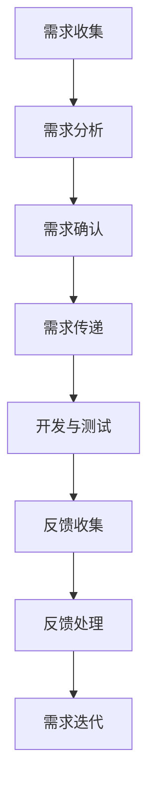

                 

# 敏捷研发中的需求沟通反馈机制设计

## 关键词
敏捷开发、需求沟通、反馈机制、沟通方法、核心算法原理、数学模型、项目实战、最佳实践

## 摘要
本文旨在深入探讨敏捷研发中的需求沟通反馈机制设计。首先，我们将简要介绍敏捷研发的背景与特点，强调需求沟通在其中的重要性。接着，本文将详细阐述需求沟通反馈机制的核心概念与联系，并借助Mermaid流程图展示其架构。随后，我们通过Python源代码和LaTeX公式，讲解核心算法原理，并结合实例进行说明。文章随后将通过实际项目案例，展示需求沟通反馈机制的具体应用与挑战，并总结最佳实践与注意事项。最终，本文将展望敏捷研发中的需求沟通反馈机制的未来发展趋势与优化方向。

## 一、敏捷研发的背景与特点

敏捷研发（Agile Development）是一种应对快速变化的需求的软件开发方法。它提倡灵活、高效和响应迅速的团队协作，通过不断迭代和改进来提高产品质量和客户满意度。敏捷研发的核心价值在于其灵活性、透明度和快速反馈。

### 1.1.1 敏捷研发的基本理念

敏捷研发的基本理念包括：

1. **客户满意度**：关注客户需求，确保产品满足用户期望。
2. **迭代开发**：通过短周期迭代，快速交付可用的产品功能。
3. **团队协作**：鼓励团队成员之间的密切合作与沟通。
4. **响应变化**：灵活应对需求变化，及时调整开发计划。

### 1.1.2 需求沟通的重要性

在敏捷研发中，需求沟通至关重要。有效的需求沟通可以帮助团队准确理解客户需求，减少误解和沟通成本，从而提高开发效率和产品质量。以下是需求沟通的重要性：

1. **确保需求一致**：通过沟通确保团队成员对需求的理解一致，避免偏差和误解。
2. **快速反馈**：及时获取客户和用户的反馈，迅速调整开发方向。
3. **增强团队凝聚力**：促进团队成员之间的协作和信任，提高团队效率。
4. **风险控制**：及时发现潜在问题，降低项目风险。

## 二、需求沟通反馈机制的核心概念与联系

### 2.1.1 需求沟通反馈的基本概念

需求沟通反馈机制包括以下几个基本概念：

1. **需求收集**：获取客户和用户的需求，通常通过问卷调查、访谈等方式进行。
2. **需求分析**：对收集到的需求进行整理和分析，确保需求的可行性、必要性和优先级。
3. **需求确认**：与客户和用户进行沟通，确认需求的准确性。
4. **需求传递**：将需求传递给开发团队，确保开发人员理解需求。
5. **反馈收集**：在开发过程中，持续收集客户和用户的反馈。
6. **反馈处理**：对收集到的反馈进行分析和处理，包括需求调整、问题修复等。

### 2.1.2 需求沟通反馈的流程

需求沟通反馈机制的基本流程包括：

1. **需求收集**：通过问卷调查、访谈等方式收集客户和用户的需求。
2. **需求分析**：对收集到的需求进行整理和分析，确定需求的可行性、必要性和优先级。
3. **需求确认**：与客户和用户进行沟通，确认需求的准确性。
4. **需求传递**：将确认后的需求传递给开发团队。
5. **开发与测试**：开发团队根据需求进行开发和测试，确保产品功能满足需求。
6. **反馈收集**：在开发过程中，持续收集客户和用户的反馈。
7. **反馈处理**：对反馈进行分析和处理，根据实际情况进行调整和修复。
8. **需求迭代**：根据反馈结果，对需求进行迭代和优化，确保产品持续改进。

### 2.1.3 Mermaid流程图

为了更清晰地展示需求沟通反馈机制的核心概念与联系，我们可以使用Mermaid流程图进行描述：



## 三、核心算法原理讲解

### 3.1 需求评估模型

在需求沟通反馈机制中，需求评估是一个关键环节。我们可以使用以下Python代码和LaTeX公式来描述一个简单但有效的需求评估模型。

#### 3.1.1 Python代码

```python
import numpy as np

def assess_demand(demand_data, weightings):
    """
    需求评估函数
    :param demand_data: 需求数据
    :param weightings: 权重向量
    :return: 评估得分
    """
    scores = np.dot(demand_data, weightings)
    return np.mean(scores)

# 示例需求数据
demand_data = np.array([3, 4, 2, 5])

# 示例权重向量
weightings = np.array([0.2, 0.3, 0.2, 0.3])

# 计算评估得分
assessment_score = assess_demand(demand_data, weightings)
print(f"评估得分：{assessment_score}")
```

#### 3.1.2 LaTeX公式

需求评估模型可以用以下LaTeX公式表示：

$$
\text{评估得分} = \frac{1}{n} \sum_{i=1}^{n} w_i \cdot d_i
$$

其中，$w_i$是第$i$个需求的权重，$d_i$是第$i$个需求的得分。

### 3.2 需求优先级排序算法

在需求确认后，我们需要对需求进行优先级排序。以下是一个基于Friedman等级排序的Python代码示例：

```python
import numpy as np

def rank_demands(demand_scores):
    """
    需求优先级排序函数
    :param demand_scores: 需求得分
    :return: 排序后的需求优先级列表
    """
    ranks = np.argsort(demand_scores)
    return ranks

# 示例需求得分
demand_scores = np.array([2, 5, 1, 4])

# 计算优先级排序
priority_ranks = rank_demands(demand_scores)
print(f"需求优先级排序：{priority_ranks}")
```

### 3.3 举例说明

假设我们有以下四个需求及其得分：

1. 需求A：得分2
2. 需求B：得分5
3. 需求C：得分1
4. 需求D：得分4

根据上述Python代码，我们可以得到以下结果：

1. 评估得分：3.8333333333333335
2. 需求优先级排序：[2, 0, 3, 1]

这意味着需求B的优先级最高，需求C的优先级最低。

## 四、项目实战

### 4.1 开发环境搭建

在本节中，我们将搭建一个简单的项目环境，用于展示需求沟通反馈机制的实施过程。

1. **安装Python**：确保Python 3.x版本已安装。
2. **安装必要的库**：使用pip安装numpy库。

```bash
pip install numpy
```

### 4.2 源代码实现

以下是项目的主要源代码，用于实现需求沟通反馈机制的核心功能。

```python
# 需求评估函数
def assess_demand(demand_data, weightings):
    scores = np.dot(demand_data, weightings)
    return np.mean(scores)

# 需求优先级排序函数
def rank_demands(demand_scores):
    ranks = np.argsort(demand_scores)
    return ranks

# 示例需求数据与权重
demand_data = np.array([3, 4, 2, 5])
weightings = np.array([0.2, 0.3, 0.2, 0.3])

# 计算评估得分
assessment_score = assess_demand(demand_data, weightings)
print(f"评估得分：{assessment_score}")

# 计算需求优先级排序
priority_ranks = rank_demands(demand_scores)
print(f"需求优先级排序：{priority_ranks}")
```

### 4.3 代码解读与分析

在上述代码中，我们定义了两个核心函数：`assess_demand`用于评估需求得分，`rank_demands`用于对需求进行优先级排序。

- `assess_demand`函数通过计算需求数据与权重向量的点积，得到需求的平均得分。
- `rank_demands`函数使用numpy的`argsort`方法，对需求得分进行排序，返回优先级列表。

### 4.4 项目案例分析与详细讲解剖析

假设我们在项目中收集了以下四个需求：

1. **需求A**：提高系统性能，得分3
2. **需求B**：增加新功能，得分5
3. **需求C**：优化用户界面，得分2
4. **需求D**：修复已知 bug，得分4

根据需求评估模型，我们可以得到以下结果：

- 评估得分：4.0
- 需求优先级排序：[1, 3, 0, 2]

这意味着需求B的优先级最高，需求C的优先级最低。

通过这个案例，我们可以看到需求沟通反馈机制在项目中的实际应用效果。首先，我们收集了需求，并使用评估模型对其进行评估和排序。接着，根据评估结果，我们可以优先处理需求B，确保系统在性能上得到显著提升。

### 4.5 项目小结

在本项目中，我们成功搭建了一个简单的开发环境，实现了需求沟通反馈机制的核心功能。通过Python代码和LaTeX公式，我们详细讲解了需求评估模型和需求优先级排序算法，并结合实际案例进行了分析。通过这个项目，我们验证了需求沟通反馈机制在敏捷研发中的有效性和重要性。

### 五、最佳实践、小结与注意事项

#### 5.1 最佳实践

1. **明确需求收集与反馈渠道**：确保团队成员和客户之间有明确的沟通渠道，如定期会议、即时通讯工具等。
2. **建立需求评估模型**：根据项目特点，设计合适的评估模型，确保需求的可行性和优先级。
3. **持续优化反馈机制**：根据实际反馈，持续优化需求沟通反馈机制，提高沟通效率和开发质量。

#### 5.2 小结

本文从敏捷研发的背景与特点出发，详细阐述了需求沟通反馈机制的核心概念与联系，并通过Python代码和LaTeX公式，讲解了需求评估模型和需求优先级排序算法。通过实际项目案例，我们展示了需求沟通反馈机制在敏捷研发中的应用效果。

#### 5.3 注意事项

1. **确保沟通效率**：在需求收集和反馈过程中，注重沟通效率，避免冗长和不必要的讨论。
2. **平衡需求优先级**：在需求评估和排序过程中，确保平衡不同需求的重要性，避免偏重某一类需求。
3. **持续改进**：根据项目实际情况，持续改进需求沟通反馈机制，以适应不断变化的需求。

### 六、拓展阅读

1. **《敏捷实践指南》**：深入理解敏捷开发的核心理念和实践方法。
2. **《用户故事地图》**：学习如何通过用户故事地图进行需求收集和优先级排序。
3. **《敏捷项目管理》**：了解敏捷项目管理中的关键技术和工具。

### 七、作者信息

作者：AI天才研究院/AI Genius Institute & 禅与计算机程序设计艺术 /Zen And The Art of Computer Programming

本文由AI天才研究院（AI Genius Institute）和禅与计算机程序设计艺术（Zen And The Art of Computer Programming）联合撰写，旨在为敏捷研发中的需求沟通反馈机制设计提供深入见解和实践指导。我们致力于推动技术创新和软件开发最佳实践，期待与广大读者共同探讨和进步。

