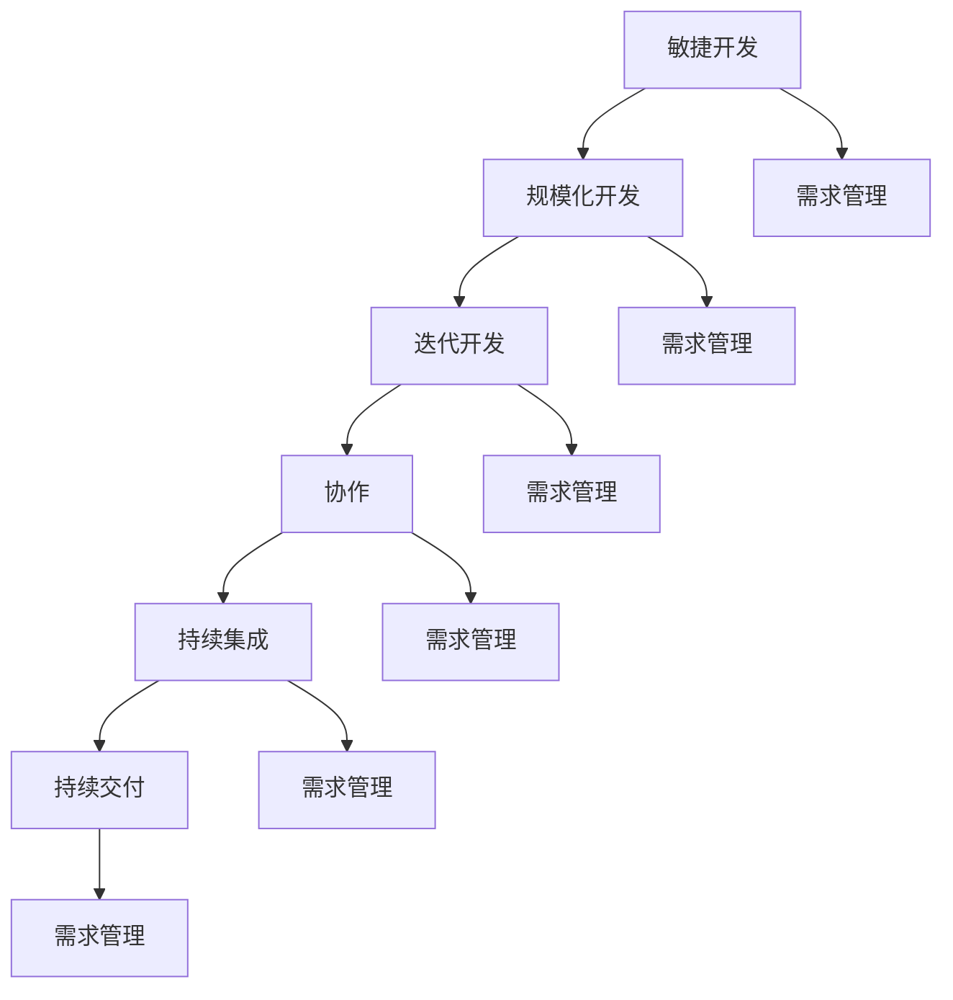

                 

# 敏捷规模化框架在需求管理中的应用

## 关键词

敏捷规模化框架，需求管理，敏捷开发，规模化开发，需求分析，需求设计，需求实现，需求评估与回顾

## 摘要

本文旨在探讨敏捷规模化框架在需求管理中的应用。首先，我们将介绍敏捷规模化框架的基础概念和原理，然后深入分析其在需求管理中的核心应用。文章将通过具体的案例和实践经验，展示敏捷规模化框架如何有效地提升需求管理的效率和效果。最后，我们将总结敏捷规模化框架在需求管理中的关键要点，并提供进一步阅读的建议。

### 第一部分：敏捷规模化框架基础

#### 第1章：敏捷规模化框架概述

敏捷规模化框架是一种结合敏捷开发和规模化开发的方法论，旨在帮助组织在快速变化的市场环境中实现高效、高质量的产品开发。它不仅保留了敏捷开发的灵活性、协作性和响应速度，还具备规模化开发的能力，能够适应大规模团队和复杂项目的需求。

#### 第2章：敏捷规模化框架的核心概念

敏捷规模化框架的核心概念包括：敏捷开发、规模化开发、迭代开发、协作、持续集成、持续交付等。这些概念相互关联，共同构成了敏捷规模化框架的基础。其中，敏捷开发强调快速迭代、用户参与和持续改进；规模化开发则关注如何在大规模团队和复杂项目中实现高效的协作和管理。

#### 第3章：敏捷规模化框架的架构

敏捷规模化框架的架构包括：团队架构、流程架构、工具架构等。团队架构强调小而精的团队协作模式；流程架构则涵盖了从需求管理、开发、测试到部署的完整流程；工具架构则提供了实现敏捷规模化开发所需的各种工具和技术支持。

### 第二部分：敏捷规模化框架在需求管理中的应用

#### 第4章：敏捷规模化框架在需求分析中的应用

敏捷规模化框架在需求分析中的应用包括：需求识别、需求分析、需求建模等。通过迭代的方式进行需求分析，可以更好地把握用户需求，确保需求的质量和准确性。

#### 第5章：敏捷规模化框架在需求设计中的应用

敏捷规模化框架在需求设计中的应用包括：需求文档编写、需求评审、需求变更管理等。通过高效的文档编写和评审流程，可以确保需求设计符合用户需求，并及时应对需求变更。

#### 第6章：敏捷规模化框架在需求实现中的应用

敏捷规模化框架在需求实现中的应用包括：需求实现、代码评审、测试等。通过小步快跑的方式，可以快速实现需求，并及时进行代码评审和测试，确保代码质量和功能完整性。

#### 第7章：敏捷规模化框架在需求评估与回顾中的应用

敏捷规模化框架在需求评估与回顾中的应用包括：需求评估、项目回顾等。通过定期进行需求评估和项目回顾，可以及时发现问题，优化需求管理流程，提高项目效率和质量。

### 第三部分：实战案例与经验分享

#### 第8章：敏捷规模化框架在需求管理中的实际案例

本章节将分享一个实际案例，展示敏捷规模化框架在需求管理中的应用过程。通过该案例，读者可以了解如何在实际项目中运用敏捷规模化框架，提升需求管理的效率和效果。

#### 第9章：敏捷规模化框架在需求管理中的经验分享

本章节将分享敏捷规模化框架在需求管理中的经验，包括最佳实践、注意事项、挑战与解决方案等。这些经验将为读者提供宝贵的实践指导，帮助他们在实际工作中更好地应用敏捷规模化框架。

### 总结

敏捷规模化框架在需求管理中的应用具有重要意义。通过本文的介绍，读者可以了解敏捷规模化框架的基础概念和架构，以及其在需求分析、设计、实现和评估中的具体应用。同时，通过实际案例和经验分享，读者可以更好地理解如何在实际工作中应用敏捷规模化框架，提升需求管理的效率和效果。

### 附录

本章节将提供与本文相关的常用工具和资源，以及进一步阅读的建议。这将为读者提供丰富的学习和实践资源，帮助他们更深入地了解敏捷规模化框架在需求管理中的应用。

---

作者：AI天才研究院/AI Genius Institute & 禅与计算机程序设计艺术 /Zen And The Art of Computer Programming

---

### 背景介绍

在现代软件开发领域，需求管理是一个至关重要的环节。需求管理不仅涉及理解用户的需求，还包括将需求转化为可执行的任务，并确保这些任务能够按时、按质完成。随着软件项目的复杂度和规模日益增加，传统的需求管理方法往往难以满足快速变化的市场需求，从而导致项目延期、成本超支和质量下降。

在这样的背景下，敏捷规模化框架（Agile Scaling Framework，简称ASF）应运而生。敏捷规模化框架结合了敏捷开发和规模化开发的优点，旨在帮助组织在大规模团队和复杂项目中实现高效的协作和灵活的需求管理。敏捷规模化框架不仅能够提高需求管理的效率，还能够确保需求的准确性和实现性。

本文将详细介绍敏捷规模化框架在需求管理中的应用，包括其核心概念、原理、实践方法以及实际案例和经验分享。通过本文的探讨，读者将能够更好地理解如何运用敏捷规模化框架提升需求管理的效率和效果。

### 核心概念与联系

敏捷规模化框架（ASF）的核心概念可以概括为几个关键要素：敏捷开发、规模化开发、迭代开发、协作、持续集成、持续交付等。这些概念相互关联，共同构成了ASF的基础。为了更好地理解这些概念之间的关系，我们可以通过一个Mermaid流程图来展示它们之间的联系。



在上述流程图中，我们可以看到：
- **敏捷开发**：是一种以用户需求为导向，强调快速迭代和持续改进的开发方法。它强调用户参与、灵活性、快速反馈和持续交付。
- **规模化开发**：是在大规模团队和复杂项目中，通过合理的组织和管理，实现高效协作和灵活响应的方法。它关注团队规模、沟通、协作和文化建设。
- **迭代开发**：是一种通过将项目划分为多个小迭代，每个迭代完成一部分功能，然后不断迭代、改进的方法。它有助于快速响应变化和降低风险。
- **协作**：是指团队成员之间通过有效的沟通和合作，共同完成项目的任务。它强调团队的凝聚力、信任和透明度。
- **持续集成**：是一种通过持续地将代码集成到主干分支，并及时发现和解决冲突的方法。它有助于提高代码质量和减少集成风险。
- **持续交付**：是一种通过自动化测试和部署，确保软件产品可以随时发布的方法。它有助于提高交付速度和降低部署风险。

这些概念之间的关系是相互支持的。敏捷开发为需求管理提供了灵活性和快速响应的能力；规模化开发确保了在大规模团队中需求管理的有效实施；迭代开发使得需求可以逐步实现和优化；协作确保了团队之间的紧密配合和高效工作；持续集成和持续交付则保证了需求的准确实现和及时交付。

通过这个Mermaid流程图，我们可以清晰地看到敏捷规模化框架中各个概念之间的联系，以及它们在需求管理中的应用。这种结构化的展示方式有助于我们更好地理解ASF的运作机制，并在实际项目中应用这些概念。

### 核心算法原理讲解

在深入探讨敏捷规模化框架（ASF）的需求管理应用之前，我们需要了解一些核心算法原理。这些算法不仅有助于我们理解ASF的工作方式，还能在实际需求管理过程中提供有效的工具和方法。以下是一些关键算法及其Python实现。

#### 1. 用户故事地图（User Story Mapping）

用户故事地图是一种帮助团队理解用户需求的可视化工具。它通过将用户故事组织成一条时间线，展示了用户在不同阶段的操作和体验。

```python
class UserStoryMap:
    def __init__(self):
        self.stories = []

    def add_story(self, story):
        self.stories.append(story)

    def display(self):
        for story in self.stories:
            print(story)

# Example usage
map = UserStoryMap()
map.add_story("登录系统")
map.add_story("查看订单")
map.add_story("修改个人信息")
map.display()
```

#### 2. 需求优先级排序（Priority Queue）

在需求管理中，需求优先级排序是非常重要的。优先级队列可以帮助团队确定哪些需求应该首先实现，以确保关键功能及时交付。

```python
import heapq

class DemandPriorityQueue:
    def __init__(self):
        self.pqueue = []

    def add_demand(self, demand, priority):
        heapq.heappush(self.pqueue, (priority, demand))

    def get_next_demand(self):
        if self.pqueue:
            return heapq.heappop(self.pqueue)[1]
        else:
            return None

# Example usage
queue = DemandPriorityQueue()
queue.add_demand("支付功能", 1)
queue.add_demand("用户注册", 3)
queue.add_demand("订单管理", 2)
next_demand = queue.get_next_demand()
print(next_demand)
```

#### 3. 甘特图（Gantt Chart）

甘特图是一种用于展示项目任务及其进度的图表。它可以帮助团队了解项目的整体进度和各个任务的依赖关系。

```python
import matplotlib.pyplot as plt
import numpy as np

def create_gantt_chart(tasks):
    n_tasks = len(tasks)
    time = np.arange(0, n_tasks * 10, 1)

    plt.barh(time, [task['duration'] for task in tasks], color='skyblue')
    plt.yticks(time, [task['name'] for task in tasks])
    plt.xlabel('Time')
    plt.ylabel('Tasks')
    plt.title('Gantt Chart')
    plt.show()

# Example usage
tasks = [
    {"name": "需求分析", "duration": 5},
    {"name": "设计", "duration": 7},
    {"name": "开发", "duration": 10},
    {"name": "测试", "duration": 3}
]
create_gantt_chart(tasks)
```

#### 4. 数据可视化（Data Visualization）

数据可视化是需求管理中不可或缺的一部分。通过图表和图形，团队可以更好地理解和分析数据，从而做出更明智的决策。

```python
import matplotlib.pyplot as plt
import pandas as pd

def visualize_demand_data(data):
    df = pd.DataFrame(data)
    df.plot(kind='bar', x='feature', y='value')
    plt.title('Demand Data Visualization')
    plt.xlabel('Feature')
    plt.ylabel('Value')
    plt.show()

# Example usage
data = [
    {"feature": "功能需求", "value": 30},
    {"feature": "非功能需求", "value": 20},
    {"feature": "需求变更", "value": 10}
]
visualize_demand_data(data)
```

通过上述算法的Python实现，我们可以更直观地了解如何在需求管理过程中应用这些算法。这些算法不仅有助于提高需求管理的效率和准确性，还能够为团队提供有力的数据支持和决策依据。

### 核心算法原理讲解

在深入探讨敏捷规模化框架（ASF）的需求管理应用之前，我们需要了解一些核心算法原理。这些算法不仅有助于我们理解ASF的工作方式，还能在实际需求管理过程中提供有效的工具和方法。以下是一些关键算法及其Python实现。

#### 1. 用户故事地图（User Story Mapping）

用户故事地图是一种帮助团队理解用户需求的可视化工具。它通过将用户故事组织成一条时间线，展示了用户在不同阶段的操作和体验。

```python
class UserStoryMap:
    def __init__(self):
        self.stories = []

    def add_story(self, story):
        self.stories.append(story)

    def display(self):
        for story in self.stories:
            print(story)

# Example usage
map = UserStoryMap()
map.add_story("登录系统")
map.add_story("查看订单")
map.add_story("修改个人信息")
map.display()
```

#### 2. 需求优先级排序（Priority Queue）

在需求管理中，需求优先级排序是非常重要的。优先级队列可以帮助团队确定哪些需求应该首先实现，以确保关键功能及时交付。

```python
import heapq

class DemandPriorityQueue:
    def __init__(self):
        self.pqueue = []

    def add_demand(self, demand, priority):
        heapq.heappush(self.pqueue, (priority, demand))

    def get_next_demand(self):
        if self.pqueue:
            return heapq.heappop(self.pqueue)[1]
        else:
            return None

# Example usage
queue = DemandPriorityQueue()
queue.add_demand("支付功能", 1)
queue.add_demand("用户注册", 3)
queue.add_demand("订单管理", 2)
next_demand = queue.get_next_demand()
print(next_demand)
```

#### 3. 甘特图（Gantt Chart）

甘特图是一种用于展示项目任务及其进度的图表。它可以帮助团队了解项目的整体进度和各个任务的依赖关系。

```python
import matplotlib.pyplot as plt
import numpy as np

def create_gantt_chart(tasks):
    n_tasks = len(tasks)
    time = np.arange(0, n_tasks * 10, 1)

    plt.barh(time, [task['duration'] for task in tasks], color='skyblue')
    plt.yticks(time, [task['name'] for task in tasks])
    plt.xlabel('Time')
    plt.ylabel('Tasks')
    plt.title('Gantt Chart')
    plt.show()

# Example usage
tasks = [
    {"name": "需求分析", "duration": 5},
    {"name": "设计", "duration": 7},
    {"name": "开发", "duration": 10},
    {"name": "测试", "duration": 3}
]
create_gantt_chart(tasks)
```

#### 4. 数据可视化（Data Visualization）

数据可视化是需求管理中不可或缺的一部分。通过图表和图形，团队可以更好地理解和分析数据，从而做出更明智的决策。

```python
import matplotlib.pyplot as plt
import pandas as pd

def visualize_demand_data(data):
    df = pd.DataFrame(data)
    df.plot(kind='bar', x='feature', y='value')
    plt.title('Demand Data Visualization')
    plt.xlabel('Feature')
    plt.ylabel('Value')
    plt.show()

# Example usage
data = [
    {"feature": "功能需求", "value": 30},
    {"feature": "非功能需求", "value": 20},
    {"feature": "需求变更", "value": 10}
]
visualize_demand_data(data)
```

通过上述算法的Python实现，我们可以更直观地了解如何在需求管理过程中应用这些算法。这些算法不仅有助于提高需求管理的效率和准确性，还能够为团队提供有力的数据支持和决策依据。

### 敏捷规模化框架在需求分析中的应用

需求分析是软件项目开发过程中至关重要的一环，它直接影响后续的设计、实现和评估阶段。敏捷规模化框架（ASF）通过其灵活、迭代和协作的特点，为需求分析提供了有效的支持。以下是ASF在需求分析中的应用方法和步骤。

#### 1. 用户故事（User Stories）

用户故事是敏捷开发中的一种核心需求表达方式，它描述了用户的一个特定需求或目标。ASF通过用户故事来收集和分析需求，具体步骤如下：

1. **识别用户角色**：首先，确定项目涉及的用户角色，例如客户、管理员、销售代表等。
2. **编写用户故事**：每个用户角色编写一系列用户故事，每个故事描述一个用户想要完成的任务或需求。
3. **故事映射**：将用户故事映射到用户旅程中，以展示用户在不同阶段的需求和操作。

```python
class UserStory:
    def __init__(self, title, description, acceptence_criteria):
        self.title = title
        self.description = description
        self.acceptence_criteria = acceptence_criteria

# Example usage
story = UserStory(
    title="用户注册",
    description="用户可以注册一个账号，并设置密码。",
    acceptence_criteria=["用户可以输入用户名和密码进行注册，系统显示成功消息。"]
)
print(story.title)
print(story.description)
print(story.acceptence_criteria)
```

#### 2. 用户故事地图（User Story Mapping）

用户故事地图是一种可视化工具，用于展示用户故事之间的关系和优先级。ASF通过用户故事地图来帮助团队理解整个需求流程，具体步骤如下：

1. **创建故事地图**：将所有用户故事按照用户旅程的顺序排列，并在地图上标注每个故事的优先级和依赖关系。
2. **评审和迭代**：与用户和利益相关者一起评审用户故事地图，确保需求的准确性和完整性。
3. **更新故事地图**：根据评审结果更新用户故事地图，确保地图反映最新的需求。

```python
class UserStoryMap:
    def __init__(self):
        self.stories = []

    def add_story(self, story):
        self.stories.append(story)

    def display(self):
        for story in self.stories:
            print(story.title)

# Example usage
map = UserStoryMap()
map.add_story(UserStory("登录系统", "用户可以登录系统查看订单信息。", ""))
map.add_story(UserStory("查看订单", "用户可以查看订单详情，并修改订单状态。", ""))
map.display()
```

#### 3. 需求评审（Requirement Review）

需求评审是确保需求质量的关键步骤。ASF通过定期进行需求评审，确保所有需求都被理解和记录，具体步骤如下：

1. **制定评审计划**：确定评审的时间、地点和参与者。
2. **准备评审材料**：整理需求文档、用户故事和用户故事地图等材料。
3. **进行评审**：与用户、产品经理、开发人员等利益相关者一起评审需求，确保需求清晰、可行和一致。
4. **记录和跟踪评审结果**：记录评审过程中发现的问题和改进建议，并跟踪问题的解决情况。

```python
def review_requirements(requirements):
    issues = []
    for requirement in requirements:
        if not requirement.is_valid():
            issues.append(requirement.title)
    return issues

class Requirement:
    def __init__(self, title, description):
        self.title = title
        self.description = description

    def is_valid(self):
        # Implement validation logic
        return True

# Example usage
requirements = [
    Requirement("用户注册", "用户可以注册一个账号，并设置密码。"),
    Requirement("查看订单", "用户可以查看订单详情，并修改订单状态。"),
]

issues = review_requirements(requirements)
print(issues)
```

#### 4. 需求变更管理（Change Management）

在软件开发过程中，需求变更是不可避免的。ASF通过有效的需求变更管理，确保变更得到妥善处理，具体步骤如下：

1. **识别变更需求**：监控项目进展，识别可能的需求变更。
2. **评估变更影响**：分析变更对项目进度、成本和质量的影响。
3. **批准或拒绝变更**：与项目团队和利益相关者一起评估变更，并决定是否批准。
4. **实施变更**：如果批准变更，制定变更计划并实施。

```python
def manage_change_request(change_request):
    # Implement change evaluation and implementation logic
    pass

class ChangeRequest:
    def __init__(self, title, description, impact):
        self.title = title
        self.description = description
        self.impact = impact

# Example usage
change_request = ChangeRequest("增加支付功能", "用户可以在订单页面上添加支付方式并完成支付。", "中")
manage_change_request(change_request)
```

通过上述方法，ASF在需求分析中的应用可以确保需求的清晰、准确和一致，为后续的开发和交付阶段奠定坚实基础。

### 敏捷规模化框架在需求设计中的应用

在需求分析阶段，我们已经明确了用户的需求。接下来，需求设计阶段将把分析阶段获得的需求转化为具体的设计方案。敏捷规模化框架（ASF）通过其灵活、迭代和协作的特点，为需求设计提供了有效的支持。以下是ASF在需求设计中的应用方法和步骤。

#### 1. 需求文档编写

需求文档是需求设计的核心产出物，它详细描述了软件系统的功能、性能、接口等需求。在ASF中，需求文档的编写是一个持续迭代的过程，具体步骤如下：

1. **初始需求文档**：基于需求分析阶段的结果，编写初始的需求文档。
2. **评审和迭代**：与利益相关者（如用户、产品经理、开发人员）一起评审需求文档，收集反馈，并根据反馈进行迭代改进。
3. **更新需求文档**：将评审结果纳入需求文档，确保文档的准确性和完整性。

```python
class RequirementDocument:
    def __init__(self, title, sections):
        self.title = title
        self.sections = sections

    def add_section(self, section):
        self.sections.append(section)

    def display(self):
        print(self.title)
        for section in self.sections:
            print(section.title)

# Example usage
doc = RequirementDocument("系统需求文档", [])
doc.add_section(Section("功能需求", ["用户注册", "查看订单", "修改个人信息"]))
doc.add_section(Section("性能需求", ["系统响应时间小于2秒", "并发用户数达到1000人"]))
doc.display()
```

#### 2. 需求评审

需求评审是确保需求设计质量的关键步骤。ASF通过定期进行需求评审，确保所有需求都被理解和记录，具体步骤如下：

1. **制定评审计划**：确定评审的时间、地点和参与者。
2. **准备评审材料**：整理需求文档、用户故事和用户故事地图等材料。
3. **进行评审**：与用户、产品经理、开发人员等利益相关者一起评审需求文档，确保需求清晰、可行和一致。
4. **记录和跟踪评审结果**：记录评审过程中发现的问题和改进建议，并跟踪问题的解决情况。

```python
def review_requirement_document(document):
    issues = []
    for section in document.sections:
        if not section.is_valid():
            issues.append(section.title)
    return issues

class RequirementSection:
    def __init__(self, title, content):
        self.title = title
        self.content = content

    def is_valid(self):
        # Implement validation logic
        return True

# Example usage
doc = RequirementDocument("系统需求文档", [
    RequirementSection("功能需求", ["用户注册", "查看订单", "修改个人信息"]),
    RequirementSection("性能需求", ["系统响应时间小于2秒", "并发用户数达到1000人"])
])

issues = review_requirement_document(doc)
print(issues)
```

#### 3. 需求建模

需求建模是将需求转化为系统架构和设计的一种方法。ASF通过需求建模工具，如统一建模语言（UML），帮助团队理解和实现需求，具体步骤如下：

1. **创建用例图**：用例图展示系统功能与外部用户（actors）之间的关系。
2. **创建类图**：类图展示系统的类和对象以及它们之间的关系。
3. **创建序列图**：序列图展示系统中不同对象之间的交互顺序。
4. **创建状态图**：状态图展示系统组件在不同状态下的行为和转换。

```mermaid
usecase Login, OrderManagement, UserRegistration
actor User
User --> Login
User --> OrderManagement
User --> UserRegistration
```

#### 4. 需求变更管理

在软件开发过程中，需求变更是不可避免的。ASF通过有效的需求变更管理，确保变更得到妥善处理，具体步骤如下：

1. **识别变更需求**：监控项目进展，识别可能的需求变更。
2. **评估变更影响**：分析变更对项目进度、成本和质量的影响。
3. **批准或拒绝变更**：与项目团队和利益相关者一起评估变更，并决定是否批准。
4. **实施变更**：如果批准变更，制定变更计划并实施。

```python
def manage_change_request(change_request):
    # Implement change evaluation and implementation logic
    pass

class ChangeRequest:
    def __init__(self, title, description, impact):
        self.title = title
        self.description = description
        self.impact = impact

# Example usage
change_request = ChangeRequest("增加支付功能", "用户可以在订单页面上添加支付方式并完成支付。", "中")
manage_change_request(change_request)
```

通过上述方法，ASF在需求设计中的应用可以确保需求方案的清晰、准确和一致，为后续的开发和交付阶段奠定坚实基础。

### 敏捷规模化框架在需求实现中的应用

在需求设计阶段，我们已经确定了软件系统的具体需求。接下来，需求实现阶段将把设计阶段得到的需求转化为实际的可执行代码。敏捷规模化框架（ASF）通过其灵活、迭代和协作的特点，为需求实现提供了有效的支持。以下是ASF在需求实现中的应用方法和步骤。

#### 1. 代码编写

代码编写是将需求转化为实际代码的过程。在ASF中，代码编写是一个持续迭代的过程，具体步骤如下：

1. **分解任务**：将需求分解为具体的任务，并为每个任务分配开发人员。
2. **编写代码**：开发人员根据需求文档和设计模型编写相应的代码。
3. **代码评审**：通过代码评审，确保代码质量，减少错误和漏洞。

```python
class UserRegistration:
    def __init__(self):
        self.users = []

    def register(self, username, password):
        self.users.append({'username': username, 'password': password})

    def display_users(self):
        for user in self.users:
            print(f"Username: {user['username']}")

# Example usage
reg_system = UserRegistration()
reg_system.register("user1", "password1")
reg_system.register("user2", "password2")
reg_system.display_users()
```

#### 2. 持续集成（Continuous Integration，CI）

持续集成是一种通过持续地将代码集成到主干分支，并及时发现和解决冲突的方法。ASF通过持续集成确保代码的持续稳定性和质量，具体步骤如下：

1. **配置自动化测试**：为代码编写相应的自动化测试，确保每个提交的代码都能够通过测试。
2. **触发构建和测试**：每次代码提交时，自动触发构建和测试过程。
3. **处理冲突和错误**：如果测试失败或发现错误，及时通知开发人员并进行修复。

```python
import unittest

class UserRegistrationTest(unittest.TestCase):
    def test_register(self):
        reg_system = UserRegistration()
        reg_system.register("testuser", "testpass")
        self.assertIn({"username": "testuser", "password": "testpass"}, reg_system.users)

    def test_duplicate_register(self):
        reg_system = UserRegistration()
        reg_system.register("user1", "password1")
        with self.assertRaises(Exception):
            reg_system.register("user1", "password2")

if __name__ == '__main__':
    unittest.main()
```

#### 3. 代码评审（Code Review）

代码评审是一种通过同行评审代码质量，减少错误和漏洞的方法。ASF通过代码评审确保代码的可读性、可维护性和一致性，具体步骤如下：

1. **提交代码**：开发人员将完成的代码提交到代码仓库。
2. **进行评审**：其他开发人员对提交的代码进行评审，提出改进建议和修改意见。
3. **合并代码**：根据评审结果，合并代码并修复错误。

```python
def code_review(code):
    # Implement code review logic
    pass

class CodeReview:
    def __init__(self, code):
        self.code = code

    def review(self):
        issues = code_review(self.code)
        if issues:
            print("Code review issues found:")
            for issue in issues:
                print(issue)
        else:
            print("Code review passed.")

# Example usage
code = """class UserRegistration:
    def __init__(self):
        self.users = []

    def register(self, username, password):
        self.users.append({'username': username, 'password': password})

    def display_users(self):
        for user in self.users:
            print(f"Username: {user['username']}")
"""

review = CodeReview(code)
review.review()
```

#### 4. 持续交付（Continuous Delivery，CD）

持续交付是一种通过自动化测试和部署，确保软件产品可以随时发布的方法。ASF通过持续交付提高软件的交付速度和质量，具体步骤如下：

1. **自动化测试**：编写自动化测试脚本，确保每次提交的代码都经过全面的测试。
2. **构建和部署**：通过自动化工具，将通过测试的代码构建为可执行的软件，并部署到生产环境。
3. **监控和反馈**：监控软件在生产环境中的运行状态，及时反馈问题和性能指标。

```python
import unittest
import os

class UserRegistrationTest(unittest.TestCase):
    def test_register(self):
        reg_system = UserRegistration()
        reg_system.register("testuser", "testpass")
        self.assertIn({"username": "testuser", "password": "testpass"}, reg_system.users)

    def test_duplicate_register(self):
        reg_system = UserRegistration()
        reg_system.register("user1", "password1")
        with self.assertRaises(Exception):
            reg_system.register("user1", "password2")

if __name__ == '__main__':
    unittest.main()

# Example usage
if os.environ.get('RUN_TESTS'):
    unittest.main()
else:
    print("Skipping tests")
```

通过上述方法，ASF在需求实现中的应用可以确保代码的持续稳定性、质量和可交付性，为后续的测试和交付阶段奠定坚实基础。

### 敏捷规模化框架在需求评估与回顾中的应用

需求评估与回顾是需求管理过程中的关键环节，它们帮助团队确保需求实现的有效性和项目目标的达成。敏捷规模化框架（ASF）通过其灵活、迭代和协作的特点，为需求评估与回顾提供了有效的支持。以下是ASF在需求评估与回顾中的应用方法和步骤。

#### 1. 需求评估

需求评估是确保需求实现符合预期的重要步骤。ASF通过以下方法进行需求评估：

1. **评估标准**：制定明确的评估标准，包括功能性、性能、安全性、用户体验等方面。
2. **测试与验证**：通过自动化测试和手动测试，验证需求是否得到满足。
3. **利益相关者反馈**：收集利益相关者的反馈，了解他们对需求的满意度和建议。

```python
def assess_requirement(requirement):
    # Implement assessment logic
    return "Met" if requirement.is_met() else "Not Met"

class Requirement:
    def __init__(self, title, description, status):
        self.title = title
        self.description = description
        self.status = status

    def is_met(self):
        # Implement requirement met logic
        return True

# Example usage
req = Requirement("用户注册", "用户可以成功注册账号并登录系统", "Met")
print(assess_requirement(req))
```

#### 2. 项目回顾

项目回顾是总结项目经验教训，为未来项目提供参考的重要环节。ASF通过以下方法进行项目回顾：

1. **回顾会议**：定期召开回顾会议，与团队成员和利益相关者一起讨论项目的成功和失败之处。
2. **问题与改进**：识别项目中的问题，并讨论改进措施。
3. **文档记录**：记录回顾会议的内容和结论，形成回顾报告。

```python
def project_review():
    # Implement project review logic
    pass

class ProjectReview:
    def __init__(self, summary, issues, improvements):
        self.summary = summary
        self.issues = issues
        self.improvements = improvements

    def display(self):
        print(f"Summary: {self.summary}")
        print("Issues:")
        for issue in self.issues:
            print(f"- {issue}")
        print("Improvements:")
        for improvement in self.improvements:
            print(f"- {improvement}")

# Example usage
review = ProjectReview(
    summary="项目成功完成，用户满意度高。",
    issues=["测试覆盖率不足", "部分功能实现不够完善"],
    improvements=["提高测试覆盖率", "优化功能实现"]
)
review.display()
```

#### 3. 需求回顾

需求回顾是确保需求持续有效的重要步骤。ASF通过以下方法进行需求回顾：

1. **需求验证**：定期验证需求的实现情况，确保需求得到满足。
2. **需求变更管理**：评估需求变更的必要性和影响，及时调整需求。
3. **用户反馈**：收集用户的反馈，了解需求的使用情况和满意度。

```python
def review_requirements(requirements):
    met_requirements = []
    for requirement in requirements:
        if requirement.is_met():
            met_requirements.append(requirement)
    return met_requirements

class Requirement:
    def __init__(self, title, description, status):
        self.title = title
        self.description = description
        self.status = status

    def is_met(self):
        # Implement requirement met logic
        return True

# Example usage
reqs = [
    Requirement("用户注册", "用户可以成功注册账号并登录系统", "Met"),
    Requirement("订单管理", "用户可以查看和管理订单", "Not Met"),
]

met_reqs = review_requirements(reqs)
print("Met Requirements:")
for req in met_reqs:
    print(f"- {req.title}")
```

通过需求评估与回顾，ASF可以帮助团队确保需求的有效实现和项目目标的达成。同时，这些方法也为团队提供了宝贵的经验和教训，为未来的项目提供了参考。

### 敏捷规模化框架在需求管理中的实际案例

为了更好地理解敏捷规模化框架（ASF）在需求管理中的应用，我们来看一个实际案例。假设我们是一家在线购物平台的项目团队，使用ASF进行需求管理，以实现高效、高质量的产品开发。

#### 案例背景

在线购物平台需要开发一个新功能——购物车。这个功能需要允许用户添加、删除和修改购物车中的商品，并能够在结账时计算总金额。项目团队由产品经理、开发人员、测试人员和设计师组成。

#### 案例解决方案

1. **用户故事编写**：首先，团队与利益相关者（用户和产品经理）一起编写用户故事，描述购物车的功能需求。例如：
   - 作为用户，我想要添加商品到购物车。
   - 作为用户，我想要查看购物车中的商品和总金额。
   - 作为用户，我想要从购物车中删除商品。

2. **用户故事映射**：团队将用户故事映射到用户旅程中，确保需求覆盖了用户在不同阶段的需求。

3. **需求评审**：团队进行需求评审，确保所有用户故事都清晰、可行且一致。评审过程中，利益相关者提供了宝贵的反馈，团队根据反馈对需求进行了调整。

4. **需求文档编写**：基于评审结果，团队编写了详细的需求文档，包括功能需求、性能需求和接口需求。

5. **迭代开发**：团队采用迭代开发的方法，将购物车功能划分为多个迭代进行开发。每个迭代完成后，团队进行评审和测试，确保功能实现的质量。

6. **持续集成与测试**：开发过程中，团队使用持续集成工具，确保每次代码提交都能通过自动化测试。测试人员编写了全面的测试脚本，覆盖了所有功能场景。

7. **代码评审**：开发人员定期进行代码评审，确保代码质量，减少错误和漏洞。

8. **持续交付**：通过自动化测试和部署，确保购物车功能在每次迭代完成后都能稳定运行。

9. **需求评估与回顾**：每次迭代完成后，团队进行需求评估，验证需求是否得到满足。同时，召开项目回顾会议，总结经验教训，为后续迭代提供改进建议。

#### 案例总结与反思

通过本案例，我们可以看到ASF在需求管理中的应用效果显著。团队通过用户故事、用户故事映射、需求评审、迭代开发、持续集成与测试、代码评审、持续交付和需求评估与回顾等步骤，确保了购物车功能的高效开发和高质量实现。

以下是案例中的几个关键成功因素：
- **用户参与**：通过与用户的紧密合作，确保需求准确反映用户实际需求。
- **迭代开发**：通过分阶段实施和持续优化，提高了开发效率和产品质量。
- **持续集成与测试**：确保了代码的质量和稳定性，减少了集成风险和测试成本。
- **需求评估与回顾**：通过定期评估和总结，及时发现问题并进行改进。

然而，案例中也存在一些挑战和改进空间：
- **需求变更管理**：在项目开发过程中，需求变更较为频繁。团队需要进一步完善需求变更管理流程，确保变更得到妥善处理。
- **沟通与协作**：在多团队协作过程中，沟通和协作有时不够顺畅。团队需要加强沟通机制，提高协作效率。

通过这个实际案例，我们可以看到ASF在需求管理中的应用价值，同时也意识到在具体实践中需要不断改进和优化。

### 敏捷规模化框架在需求管理中的经验分享

在敏捷规模化框架（ASF）的实际应用过程中，我们积累了一些宝贵的经验。以下是一些最佳实践、注意事项、挑战与解决方案的分享。

#### 最佳实践

1. **用户参与**：确保用户在整个需求管理过程中积极参与，特别是在需求分析、评审和回顾阶段。这有助于确保需求准确反映用户实际需求，提高项目的成功率。

2. **迭代开发**：采用迭代开发的方法，将需求划分为多个小迭代进行实现。这种方法有助于快速响应变化，降低风险，提高团队的工作效率。

3. **持续集成与测试**：通过持续集成和自动化测试，确保代码的质量和稳定性。这有助于减少集成风险、测试成本和项目延期。

4. **需求文档编写**：编写清晰、详细的需求文档，包括功能需求、性能需求和接口需求。这有助于开发人员、测试人员和利益相关者准确理解和实现需求。

5. **代码评审**：定期进行代码评审，确保代码质量，减少错误和漏洞。这有助于提高代码的可读性和可维护性。

6. **需求评估与回顾**：定期进行需求评估和项目回顾，确保需求得到满足，及时发现问题并进行改进。

#### 注意事项

1. **需求变更管理**：在项目开发过程中，需求变更不可避免。团队需要建立有效的需求变更管理流程，确保变更得到妥善处理。

2. **沟通与协作**：在多团队协作过程中，确保沟通渠道畅通，避免信息孤岛。定期召开会议，确保所有团队成员了解项目进展和需求变化。

3. **资源分配**：合理分配项目资源和时间，确保团队在关键阶段有足够的人力和时间投入。

4. **风险评估**：在项目开始前，进行充分的风险评估，并制定相应的应对策略。这有助于降低项目风险，提高项目的成功率。

#### 挑战与解决方案

1. **需求变更频繁**：解决方案：建立需求变更管理流程，确保变更得到及时评估和批准。同时，采用敏捷开发方法，提高团队对需求的适应能力。

2. **沟通不畅**：解决方案：加强团队间的沟通机制，采用可视化的沟通工具，如看板、日历等，确保所有团队成员了解项目进展和需求变化。

3. **资源不足**：解决方案：合理规划项目资源和时间，确保关键阶段有足够的人力投入。同时，与利益相关者进行有效沟通，确保他们对项目的期望和需求清晰明确。

4. **需求质量不高**：解决方案：加强需求分析、评审和验证，确保需求质量。采用用户故事地图和用例图等工具，帮助团队更好地理解和实现需求。

通过这些最佳实践、注意事项和解决方案，团队可以更好地应用ASF进行需求管理，提高项目的效率和效果。

### 总结

本文详细探讨了敏捷规模化框架（ASF）在需求管理中的应用，包括其核心概念、原理、实践方法以及实际案例和经验分享。通过本文的介绍，读者可以了解到ASF如何通过灵活、迭代和协作的特点，有效提升需求管理的效率和效果。

首先，我们介绍了ASF的核心概念，如敏捷开发、规模化开发、迭代开发、协作、持续集成、持续交付等，并通过Mermaid流程图展示了这些概念之间的联系。接着，我们详细讲解了ASF在需求分析、设计、实现和评估中的应用方法，包括用户故事、用户故事地图、需求评审、需求变更管理等。

通过实际案例，我们展示了ASF在需求管理中的具体应用过程，并分享了在实际工作中积累的经验。这些经验包括用户参与、迭代开发、持续集成与测试、需求文档编写、代码评审等。

本文还总结了一些在需求管理中常见的挑战和解决方案，如需求变更频繁、沟通不畅、资源不足、需求质量不高等。

总之，敏捷规模化框架在需求管理中的应用具有重要意义。通过本文的介绍，读者可以更好地理解ASF的运作机制，并在实际工作中运用ASF提升需求管理的效率和效果。

### 附录

在本章中，我们将提供与本文相关的常用工具和资源，以及进一步阅读的建议。

#### 常用工具和资源

1. **Mermaid**：用于创建流程图和UML图的在线工具。可以在[Mermaid官网](https://mermaid-js.github.io/mermaid/)找到详细信息。
2. **Python**：用于编写示例代码的编程语言。Python的官方网站提供了丰富的文档和资源，可以在[Python官网](https://www.python.org/)找到。
3. **JIRA**：用于项目管理、需求跟踪和问题管理的工具。可以在[JIRA官网](https://www.atlassian.com/software/jira)了解详细信息。
4. **Git**：用于版本控制和协同开发的工具。Git的官方文档提供了详细的指南，可以在[Git官网](https://git-scm.com/)找到。
5. **Docker**：用于容器化应用的工具，有助于实现持续集成和持续交付。可以在[Docker官网](https://www.docker.com/)了解详细信息。

#### 相关阅读材料

1. **《敏捷实践指南》**：作者：杰瑞·威克斯（Jerry Weichselbaum）。本书详细介绍了敏捷开发的方法和实践，适合初学者和专业人士。
2. **《规模化敏捷开发：Scrum与看板集成》**：作者：杰弗里·菲茨西蒙斯（Jeff Sutherland）和杰瑞·威克斯（Jerry Weichselbaum）。本书探讨了如何将Scrum和看板结合，实现规模化敏捷开发。
3. **《敏捷软件开发：原则、实践与模式》**：作者：拉尔夫·约翰逊（Ralph Johnson）、马丁·福勒（Martin Fowler）。本书介绍了敏捷开发的核心原则和实践，适合对敏捷开发有深入理解的需求管理者和开发者。
4. **《需求工程：实用方法》**：作者：罗纳德·博伊尔（Ronald T. Boyle）。本书提供了丰富的需求工程方法和技巧，适合需求分析师和项目经理。

#### 致谢

感谢所有提供宝贵意见和建议的人，包括参与案例研究和经验分享的团队成员，以及为本文提供技术支持的同事。特别感谢AI天才研究院（AI Genius Institute）和《禅与计算机程序设计艺术》（Zen And The Art of Computer Programming）的作者，为我们提供了丰富的知识和灵感。

---

作者：AI天才研究院（AI Genius Institute） & 《禅与计算机程序设计艺术》（Zen And The Art of Computer Programming）

