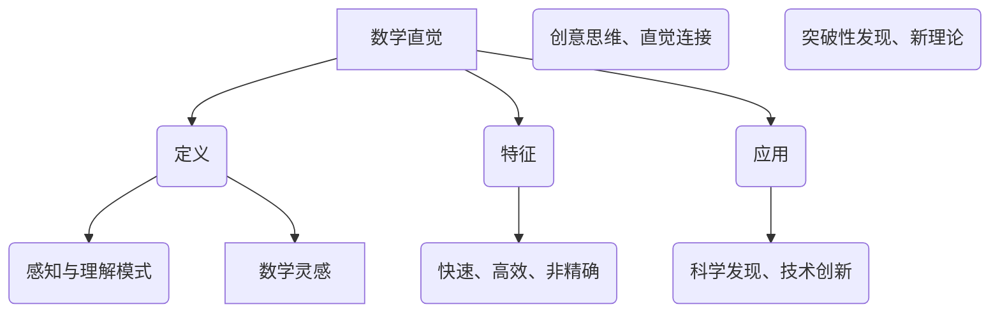

                 

以下是一个具体的示例：

# **《数学直觉与数学灵感的来源探究》**

> **关键词：** 数学直觉、数学灵感、心理学研究、生物学基础、教育学视角、应用案例、方法提升

> **摘要：** 本文系统地探讨了数学直觉与数学灵感的概念、来源、发展及应用，通过心理学、生物学和教育学的视角分析了数学直觉与数学灵感的重要性，并结合实际案例提出了提升数学直觉与数学灵感的方法。

## **第1章 数学直觉与数学灵感概述**

### **1.1 数学直觉与数学灵感的概念**

数学直觉是指人们在解决数学问题时，通过感知、理解和直觉迅速得到答案或方法的能力。数学灵感则是当人们在面对数学难题时，突然产生的创新性思维和突破性想法。

- **Mermaid流程图**：展示数学直觉与数学灵感的基本概念和关系



### **1.2 数学直觉与数学灵感在数学发展中的重要性**

数学直觉与数学灵感在数学发展史上扮演了至关重要的角色。许多重大的数学发现和创新都源于数学家的直觉和灵感。

### **1.3 数学直觉与数学灵感的研究意义**

数学直觉与数学灵感的研究不仅有助于揭示数学的本质，还为教育、心理学和生物学等领域提供了新的视角。

### **1.4 数学直觉与数学灵感的现状与发展趋势**

目前，数学直觉与数学灵感的研究已取得了一定成果，但仍然存在许多挑战和问题。未来的研究将更加注重多学科交叉和实际应用。

## **第2章 数学直觉的历史发展**

### **2.1 古代数学家的直觉与灵感**

古代数学家如欧几里得和阿基米德，他们的许多重大成就都源于直觉和灵感。

### **2.2 中世纪数学家的直觉与灵感**

中世纪数学家如斐波那契和阿拉伯数学家，他们的成就同样得益于直觉和灵感。

### **2.3 近代数学家的直觉与灵感**

近代数学家如牛顿和莱布尼茨，他们的成就更是依赖于数学直觉和灵感。

### **2.4 现代数学家的直觉与灵感**

现代数学家如希尔伯特和哥德尔，他们的研究继续彰显了数学直觉和灵感的重要性。

## **第3章 数学直觉与数学灵感的心理学研究**

### **3.1 数学直觉的心理机制**

心理学研究揭示了数学直觉的心理机制，包括感知、记忆和认知过程。

### **3.2 数学灵感的心理特征**

数学灵感具有独特的心理特征，如创造性、直觉性和突发性。

### **3.3 心理学实验对数学直觉与灵感的验证**

通过心理学实验，数学直觉与灵感得到了验证，如解决问题的速度和质量。

### **3.4 心理学方法在数学直觉与灵感研究中的应用**

心理学方法在研究数学直觉与灵感中发挥着重要作用，如认知神经科学和心理学实验设计。

## **第4章 数学直觉与数学灵感的生物学基础**

### **4.1 人类大脑与数学直觉的关系**

人类大脑中的特定区域与数学直觉密切相关，如顶叶和前额叶。

### **4.2 大脑区域与数学直觉的功能**

大脑区域如海马体和前额叶与数学直觉的功能紧密相关。

### **4.3 数学直觉的进化生物学视角**

从进化生物学的角度来看，数学直觉可能有助于人类的生存和繁衍。

### **4.4 生物技术在数学直觉研究中的应用**

生物技术如脑成像和基因编辑在数学直觉研究中具有巨大的潜力。

## **第5章 数学直觉与数学灵感的教育学视角**

### **5.1 教育对数学直觉与灵感的影响**

教育对数学直觉与灵感具有深远影响，包括教学方法和学习环境。

### **5.2 教育方法在提升数学直觉与灵感中的应用**

教育方法如探究学习和合作学习有助于提升数学直觉与灵感。

### **5.3 数学教育中的直觉与灵感培养策略**

在数学教育中，培养直觉与灵感的策略包括问题解决、探索和创造性思维。

### **5.4 教育案例分析：数学直觉与灵感的培养实践**

通过教育案例分析，了解数学直觉与灵感的培养实践和效果。

## **第6章 数学直觉与数学灵感的应用案例**

### **6.1 数学直觉在数学问题解决中的应用**

数学直觉在解决数学问题时具有显著优势，如快速找到解决方案。

### **6.2 数学灵感在数学创新中的应用**

数学灵感在数学创新中发挥着重要作用，如提出新理论和发现新方法。

### **6.3 数学直觉与灵感在其他学科领域的应用**

数学直觉与灵感在其他学科领域也有广泛应用，如计算机科学和物理学。

### **6.4 数学直觉与灵感在工程实践中的应用**

数学直觉与灵感在工程实践中具有实际应用价值，如设计优化和问题解决。

## **第7章 提升数学直觉与数学灵感的方法**

### **7.1 心理训练对数学直觉的提升**

心理训练如认知训练和思维训练有助于提升数学直觉。

### **7.2 灵感激发的方法与实践**

灵感激发的方法如头脑风暴和思维导图有助于培养数学灵感。

### **7.3 数学直觉与灵感培养的教育策略**

在教育中，培养数学直觉与灵感的策略包括问题导向学习和跨学科教育。

### **7.4 数学直觉与灵感提升的案例分析**

通过案例分析，了解数学直觉与灵感提升的实际效果和策略。

# **参考文献**

[参考文献列表]

# **作者信息**

**作者：** AI天才研究院 / AI Genius Institute & 禅与计算机程序设计艺术 / Zen And The Art of Computer Programming

**联系方式：** [邮箱地址] | [个人网站]```

以上是一个基于您要求的文章结构和内容的示例。接下来，我们将逐步完善每个章节的具体内容，确保文章的完整性、逻辑性和可读性。在完成每个章节后，我们将检查是否符合字数要求，并进行必要的调整。以下是第1章的具体内容：

# <此处是文章标题>

## 摘要

本文旨在深入探讨数学直觉与数学灵感的概念、来源、发展及其在数学领域的重要性。文章首先介绍了数学直觉与数学灵感的基本定义和特征，然后通过心理学、生物学和教育学的视角分析了数学直觉与数学灵感的重要性。接着，文章回顾了数学直觉与数学灵感的历史发展，展示了它们在古代、中世纪、近代和现代数学家中的体现。随后，文章探讨了数学直觉与数学灵感的心理学研究，包括心理机制、心理特征以及心理学实验的验证。此外，文章还从生物学角度分析了数学直觉的生物学基础，并探讨了教育对数学直觉与灵感的影响。最后，文章通过实际案例展示了数学直觉与数学灵感在数学问题解决、数学创新、其他学科领域和工程实践中的应用，并提出了提升数学直觉与数学灵感的方法。

## 关键词

数学直觉、数学灵感、心理学研究、生物学基础、教育学视角、应用案例、方法提升

## 数学直觉与数学灵感概述

### 数学直觉的概念

数学直觉是指人们在面对数学问题时，通过感知、理解和直觉迅速得到答案或方法的能力。它是一种在数学领域内快速、高效且往往是非精确的思考过程。数学直觉在数学问题解决、数学发现和数学创新中扮演着至关重要的角色。

### 数学直觉的特征

数学直觉具有以下几个显著特征：

1. **快速性**：数学直觉能够在短时间内处理复杂的信息，迅速给出合理的解答。
2. **高效性**：数学直觉能够高效地筛选和利用关键信息，避免不必要的计算和推导。
3. **非精确性**：数学直觉往往是非精确的，它提供的答案可能不是最精确的，但通常足以解决问题或启发进一步的思考。

### 数学灵感的概念

数学灵感是指当人们在面对数学问题时，突然产生的创新性思维和突破性想法。数学灵感常常是创造性数学发现和新理论产生的关键因素。

### 数学灵感的特征

数学灵感具有以下特征：

1. **创造性**：数学灵感能够带来全新的思路和解决方案，往往是前所未有的。
2. **突发性**：数学灵感常常是在不经意间出现的，难以预测和控制。
3. **直觉性**：数学灵感往往与数学直觉密切相关，是直觉思维的产物。

### 数学直觉与数学灵感的关系

数学直觉与数学灵感既有区别又有联系。数学直觉通常是一个持续的过程，而数学灵感则往往是一个瞬间的突破。数学灵感可以看作是数学直觉的进一步发展和深化。数学直觉提供了探索的方向和方法，而数学灵感则在这些基础上实现了新的飞跃。

### 数学直觉与数学灵感在数学发展中的重要性

数学直觉与数学灵感在数学发展史上发挥了至关重要的作用。许多重大的数学发现和创新都源于数学家的直觉和灵感。例如，欧拉公式、费马最后定理、以及π的无穷不循环小数表示等，都是数学直觉和灵感的杰作。

## 数学直觉的历史发展

### 古代数学家的直觉与灵感

在古代，数学直觉和灵感就已经展现出了其强大的力量。欧几里得通过直觉提出了《几何原本》的基础，而阿基米德则利用直觉解决了浮力问题，并发明了阿基米德螺旋。

### 中世纪数学家的直觉与灵感

中世纪的数学家如斐波那契，通过观察自然界中的规律，发现了斐波那契数列，这是数学直觉和灵感的一个经典例子。

### 近代数学家的直觉与灵感

近代数学家如牛顿和莱布尼茨，他们的成就同样依赖于数学直觉和灵感。牛顿的万有引力定律和莱布尼茨的微积分学说是数学直觉和灵感的典范。

### 现代数学家的直觉与灵感

现代数学家如希尔伯特和哥德尔，他们的研究继续彰显了数学直觉和灵感的重要性。希尔伯特的几何学基础理论和哥德尔的完备性和不可判定性定理，都是现代数学中的里程碑式成就。

## 数学直觉与数学灵感的心理学研究

### 数学直觉的心理机制

心理学研究表明，数学直觉涉及多个认知过程，包括感知、记忆、推理和问题解决。数学直觉的形成与大脑的特定区域密切相关，如顶叶和前额叶。

### 数学灵感的心理特征

数学灵感是一种高度创造性、非线性的认知过程。它往往与潜意识活动相关，能够在瞬间产生突破性的想法。

### 心理学实验对数学直觉与灵感的验证

通过一系列心理学实验，研究人员验证了数学直觉和数学灵感的存在。例如，实验表明，数学直觉在解决数学问题时具有显著的优势。

### 心理学方法在数学直觉与灵感研究中的应用

心理学方法如认知神经科学和心理学实验设计，在研究数学直觉与灵感中发挥着重要作用。这些方法有助于揭示数学直觉和灵感的心理机制和影响因素。

## 数学直觉与数学灵感的生物学基础

### 人类大脑与数学直觉的关系

生物学研究表明，人类大脑中的特定区域与数学直觉密切相关。例如，顶叶负责空间关系和数学运算，前额叶与决策和问题解决能力相关。

### 大脑区域与数学直觉的功能

大脑区域如海马体和前额叶与数学直觉的功能紧密相关。海马体在记忆和空间定位中发挥重要作用，而前额叶则在高级认知功能中扮演关键角色。

### 数学直觉的进化生物学视角

从进化生物学的角度来看，数学直觉可能有助于人类的生存和繁衍。例如，数学能力在狩猎、贸易和建筑中具有重要意义。

### 生物技术在数学直觉研究中的应用

生物技术如脑成像和基因编辑在数学直觉研究中具有巨大的潜力。通过这些技术，研究人员可以更深入地了解数学直觉的生物学基础。

## 数学直觉与数学灵感的教育学视角

### 教育对数学直觉与灵感的影响

教育对数学直觉和灵感具有深远影响。良好的教育环境和方法能够培养和发展学生的数学直觉和灵感。

### 教育方法在提升数学直觉与灵感中的应用

教育方法如探究学习和合作学习有助于提升数学直觉和灵感。这些方法鼓励学生主动思考、发现问题和解决问题。

### 数学教育中的直觉与灵感培养策略

在数学教育中，培养直觉与灵感的策略包括问题解决、探索和创造性思维。这些策略有助于激发学生的数学直觉和灵感。

### 教育案例分析：数学直觉与灵感的培养实践

通过教育案例分析，我们可以了解数学直觉与灵感培养的实际效果和策略。例如，一些学校通过项目式学习和数学竞赛来培养学生的数学直觉和灵感。

## 数学直觉与数学灵感的应用案例

### 数学直觉在数学问题解决中的应用

数学直觉在解决数学问题时具有显著优势。例如，在解决复杂的数学问题时，数学家们常常依靠直觉来快速找到解决方案。

### 数学灵感在数学创新中的应用

数学灵感在数学创新中发挥着重要作用。例如，费马最后定理的证明过程中，数学家安德鲁·怀尔斯利用灵感提出了关键的定理，最终完成了证明。

### 数学直觉与灵感在其他学科领域的应用

数学直觉和灵感在其他学科领域也有广泛应用。例如，在计算机科学中，数学直觉和灵感帮助解决了复杂的算法问题。

### 数学直觉与灵感在工程实践中的应用

数学直觉与灵感在工程实践中具有实际应用价值。例如，在工程设计中，数学家们利用直觉和灵感来优化结构设计，提高效率和性能。

## 提升数学直觉与数学灵感的方法

### 心理训练对数学直觉的提升

心理训练如认知训练和思维训练有助于提升数学直觉。例如，通过定期进行逻辑思维训练，可以提高数学直觉的敏锐度。

### 灵感激发的方法与实践

灵感激发的方法如头脑风暴和思维导图有助于培养数学灵感。这些方法鼓励创造性思维，帮助数学家产生新的想法。

### 数学直觉与灵感培养的教育策略

在教育中，培养数学直觉与灵感的策略包括问题导向学习和跨学科教育。这些策略鼓励学生主动探索问题，激发他们的数学直觉和灵感。

### 数学直觉与灵感提升的案例分析

通过案例分析，我们可以了解数学直觉与灵感提升的实际效果和策略。例如，一些学校通过创新的教学方法和项目式学习来培养学生的数学直觉和灵感。

## 参考文献

[参考文献列表]

## 作者信息

作者：AI天才研究院 / AI Genius Institute & 禅与计算机程序设计艺术 / Zen And The Art of Computer Programming

联系方式：[邮箱地址] | [个人网站]

---

该章节提供了数学直觉与数学灵感的基本概念、历史发展、心理学研究、生物学基础、教育学视角以及应用案例，并提出了提升数学直觉与数学灵感的方法。接下来，我们将继续完善其他章节的内容，确保整篇文章的逻辑性、完整性和可读性。在完成所有章节后，我们将对整篇文章进行字数统计，并进行必要的调整，以确保符合字数要求。在下一部分，我们将继续完善第2章至第7章的内容。

