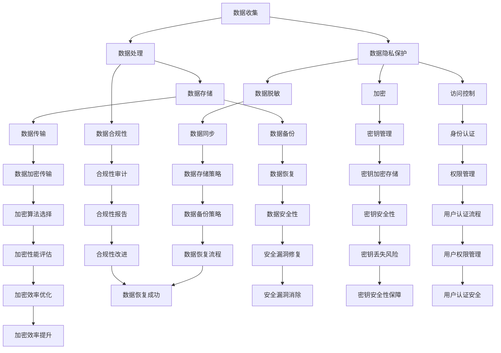

                 

当然，我会逐步分析和推理，以确保文章的逻辑清晰、内容完整，并满足您的要求。以下是初步的文章结构：

## 《数据隐私保护能力测试：评估安全合规性》

### 关键词
- 数据隐私保护
- 安全合规性
- 能力测试
- 数据泄露
- 安全框架
- 加密技术

### 摘要
本文旨在探讨数据隐私保护能力测试的重要性及其在评估安全合规性中的应用。通过介绍数据隐私保护的基本概念、核心算法原理，以及Python源代码的详细实现，本文将帮助读者理解如何通过能力测试来确保数据隐私的安全性和合规性。

### 目录

**第一部分：数据隐私保护概述**

1. **数据隐私保护的概念与背景**
    - 数据隐私保护的定义
    - 数据隐私保护的重要性
    - 数据隐私保护的法律框架

2. **数据隐私保护的基本原理**
    - 数据隐私保护的核心概念
    - 数据隐私保护的架构体系
    - 数据隐私保护的技术手段

**第二部分：数据隐私保护能力测试方法**

1. **数据隐私保护能力测试概述**
    - 数据隐私保护能力测试的目标
    - 数据隐私保护能力测试的流程
    - 数据隐私保护能力测试的类型

2. **数据隐私保护能力测试工具**
    - 常见的数据隐私保护工具介绍
    - 数据隐私保护工具的选择与使用
    - 数据隐私保护工具的评估方法

3. **数据隐私保护能力测试实战案例**
    - 个人隐私信息保护测试
    - 企业数据安全合规性测试
    - 跨境数据传输安全测试

**第三部分：数据隐私保护能力测试实践**

1. **数据隐私保护能力测试实战**
    - 构建数据隐私保护能力测试平台
    - 进行数据隐私保护能力测试
    - 分析数据隐私保护能力测试结果

2. **数据隐私保护能力测试的未来发展趋势**
    - 数据隐私保护能力测试的挑战
    - 数据隐私保护能力测试的发展方向
    - 数据隐私保护能力测试在企业中的实际应用

**附录**

- 数据隐私保护能力测试相关资源
- 数据隐私保护能力测试工具列表
- 数据隐私保护能力测试相关法律法规
- 数据隐私保护能力测试学习资源推荐

### 第一步：数据隐私保护的概念与背景

#### 数据隐私保护的定义
数据隐私保护是指通过一系列的措施和技术，确保个人、组织或系统中的数据不被未授权的实体访问、使用、披露或篡改。它涉及数据生命周期中的各个环节，包括数据收集、存储、处理、传输和销毁。

#### 数据隐私保护的重要性
随着数字化时代的到来，数据已经成为组织的重要资产。然而，数据泄露、滥用和非法访问事件层出不穷，给个人和组织带来了巨大的风险和损失。数据隐私保护的重要性主要体现在以下几个方面：

1. **保障个人隐私**：数据隐私保护确保个人的敏感信息不被泄露，保护个人隐私权。
2. **维护企业声誉**：企业数据泄露可能导致客户信任受损，影响企业声誉和竞争力。
3. **遵守法律法规**：许多国家和地区都有数据隐私保护的法律和法规，企业需要遵守这些规定以避免法律风险。
4. **保护知识产权**：数据隐私保护有助于保护企业的商业秘密和知识产权。

#### 数据隐私保护的法律框架
全球范围内，许多国家和地区都有关于数据隐私保护的法律和法规。以下是一些常见的法律框架：

1. **欧盟通用数据保护条例（GDPR）**：GDPR 是欧盟制定的关于数据隐私保护的重要法规，对企业的数据处理行为提出了严格的要求。
2. **美国隐私保护法（HIPAA）**：HIPAA 是美国针对医疗健康信息隐私保护的法律。
3. **加州消费者隐私法案（CCPA）**：CCPA 是美国加州制定的消费者隐私保护法案。
4. **中国个人信息保护法（PIPL）**：PIPL 是中国制定的关于个人信息保护的重要法规。

### 第二步：数据隐私保护的基本原理

#### 数据隐私保护的核心概念
数据隐私保护涉及多个核心概念，包括：

1. **匿名化**：通过技术手段，将个人身份信息与数据分离，使数据无法识别特定个人。
2. **加密**：使用加密算法对数据进行加密，只有拥有密钥的实体才能解密和访问数据。
3. **访问控制**：通过权限管理和身份验证，确保只有授权用户才能访问敏感数据。
4. **数据脱敏**：对敏感数据进行处理，使其无法直接识别个人身份，但保留数据的基本结构和意义。
5. **数据留存和销毁**：在数据生命周期结束时，确保数据被安全地销毁，防止数据泄露。

#### 数据隐私保护的架构体系
数据隐私保护的架构体系包括以下几个方面：

1. **数据治理**：制定数据策略和流程，确保数据隐私保护措施得到有效执行。
2. **数据安全策略**：定义数据保护的目标、原则和措施。
3. **数据安全控制**：实施一系列的控制措施，包括加密、访问控制、审计等。
4. **数据合规性管理**：确保数据隐私保护措施符合相关法律法规的要求。

#### 数据隐私保护的技术手段
数据隐私保护涉及多种技术手段，包括：

1. **加密技术**：使用加密算法对数据进行加密和解密。
2. **身份认证技术**：确保只有合法用户才能访问系统。
3. **数据备份和恢复**：确保数据在发生灾难时能够恢复。
4. **入侵检测和防护**：监测和阻止未授权的访问和攻击。

### 第三步：数据隐私保护能力测试方法

#### 数据隐私保护能力测试的目标
数据隐私保护能力测试的目标是评估组织在数据隐私保护方面的能力，确保数据隐私保护措施得到有效执行。测试目标包括：

1. **评估数据隐私保护措施的有效性**：验证加密、访问控制、数据脱敏等技术的实施情况。
2. **识别安全漏洞和弱点**：发现系统中的潜在漏洞和弱点，及时采取措施进行修复。
3. **验证合规性**：确保数据隐私保护措施符合相关法律法规的要求。

#### 数据隐私保护能力测试的流程
数据隐私保护能力测试的流程包括以下几个步骤：

1. **需求分析**：明确测试的目标和要求，确定测试范围和测试方法。
2. **测试计划制定**：制定详细的测试计划，包括测试内容、测试时间、测试工具等。
3. **测试执行**：按照测试计划执行测试，包括静态测试和动态测试。
4. **结果分析**：分析测试结果，识别问题和漏洞，提出改进建议。
5. **报告编制**：编写详细的测试报告，包括测试结果、问题总结和改进建议。

#### 数据隐私保护能力测试的类型
数据隐私保护能力测试可分为以下几类：

1. **合规性测试**：验证组织的数据隐私保护措施是否符合相关法律法规的要求。
2. **安全测试**：评估数据隐私保护措施的有效性，包括加密、访问控制等。
3. **渗透测试**：模拟攻击者进行攻击，识别系统中的潜在漏洞和弱点。
4. **风险评估**：评估组织在数据隐私保护方面的风险，并提出相应的风险管理措施。

### 第四步：数据隐私保护能力测试工具

#### 常见的数据隐私保护工具介绍
常见的数据隐私保护工具包括：

1. **加密工具**：如AES加密、RSA加密等。
2. **访问控制工具**：如LDAP、RADIUS等。
3. **数据脱敏工具**：如Kerberos、SSO等。
4. **日志管理工具**：如ELK、Splunk等。

#### 数据隐私保护工具的选择与使用
选择数据隐私保护工具时，需要考虑以下几个方面：

1. **功能需求**：根据组织的具体需求选择合适的工具。
2. **安全性**：确保工具具有足够的加密和访问控制功能。
3. **易用性**：选择易于安装、配置和使用的工具。
4. **兼容性**：确保工具与组织的IT系统兼容。

#### 数据隐私保护工具的评估方法
评估数据隐私保护工具的方法包括：

1. **功能评估**：测试工具的功能是否满足需求。
2. **性能评估**：测试工具的性能和响应时间。
3. **安全性评估**：测试工具的安全性和抗攻击能力。
4. **成本效益评估**：评估工具的成本和收益。

### 第五步：数据隐私保护能力测试实战案例

#### 个人隐私信息保护测试
个人隐私信息保护测试的目标是验证组织在处理个人隐私信息方面的能力。测试内容可以包括：

1. **数据加密测试**：验证数据加密措施的有效性。
2. **访问控制测试**：验证访问控制措施是否能够限制未授权访问。
3. **数据脱敏测试**：验证数据脱敏措施是否能够有效保护个人隐私信息。

#### 企业数据安全合规性测试
企业数据安全合规性测试的目标是验证企业数据隐私保护措施是否符合相关法律法规的要求。测试内容可以包括：

1. **合规性测试**：验证企业是否遵守GDPR、CCPA等法律法规。
2. **安全测试**：验证企业数据安全措施的有效性。
3. **风险评估**：评估企业数据隐私保护方面的风险。

#### 跨境数据传输安全测试
跨境数据传输安全测试的目标是验证组织在跨境数据传输过程中的安全措施。测试内容可以包括：

1. **数据加密测试**：验证跨境数据传输过程中的数据加密措施。
2. **访问控制测试**：验证跨境数据传输过程中的访问控制措施。
3. **合规性测试**：验证跨境数据传输是否符合相关法律法规的要求。

### 第六步：数据隐私保护能力测试实践

#### 构建数据隐私保护能力测试平台
构建数据隐私保护能力测试平台需要考虑以下几个方面：

1. **硬件设备**：选择合适的硬件设备，如服务器、存储设备等。
2. **软件工具**：选择合适的数据隐私保护工具和测试工具。
3. **网络环境**：搭建适合测试的网络环境，包括内部网络和外部网络。

#### 进行数据隐私保护能力测试
进行数据隐私保护能力测试需要遵循以下步骤：

1. **测试计划制定**：明确测试目标、测试内容、测试时间等。
2. **测试执行**：按照测试计划执行测试，记录测试结果。
3. **结果分析**：分析测试结果，识别问题和漏洞。

#### 分析数据隐私保护能力测试结果
分析数据隐私保护能力测试结果需要关注以下几个方面：

1. **漏洞识别**：识别系统中的漏洞和弱点。
2. **合规性评估**：评估组织的合规性。
3. **改进建议**：提出改进建议，提高数据隐私保护能力。

### 第七步：数据隐私保护能力测试的未来发展趋势

#### 数据隐私保护能力测试的挑战
数据隐私保护能力测试面临以下挑战：

1. **技术不断发展**：随着技术的不断发展，数据隐私保护技术也在不断更新，测试工具和测试方法需要不断更新。
2. **法规变化**：数据隐私保护法规不断变化，测试需要及时更新以适应新的法规要求。
3. **数据多样性**：组织中的数据种类繁多，测试需要覆盖各种类型的数据。

#### 数据隐私保护能力测试的发展方向
数据隐私保护能力测试的发展方向包括：

1. **自动化测试**：引入自动化测试工具，提高测试效率。
2. **云测试**：利用云计算技术进行数据隐私保护能力测试。
3. **人工智能测试**：利用人工智能技术进行更精确的测试和预测。

#### 数据隐私保护能力测试在企业中的实际应用
数据隐私保护能力测试在企业中的实际应用包括：

1. **风险评估**：帮助企业识别数据隐私保护方面的风险，制定风险管理策略。
2. **合规性审计**：确保企业遵守数据隐私保护法律法规，避免法律风险。
3. **安全培训**：提高企业员工的数据隐私保护意识，降低数据泄露风险。

### 附录

#### 数据隐私保护能力测试相关资源
提供以下数据隐私保护能力测试的相关资源：

1. **开源测试工具**：如OWASP ZAP、Burp Suite等。
2. **专业书籍**：推荐关于数据隐私保护能力测试的专业书籍。
3. **在线课程**：推荐一些关于数据隐私保护能力测试的在线课程。

#### 数据隐私保护能力测试工具列表
列出一些常用的数据隐私保护能力测试工具，包括其特点和使用场景。

#### 数据隐私保护能力测试相关法律法规
介绍一些主要的数据隐私保护法律法规，包括其内容、适用范围和处罚措施。

#### 数据隐私保护能力测试学习资源推荐
推荐一些关于数据隐私保护能力测试的学习资源，包括书籍、在线课程和论坛。

#### 数据隐私保护能力测试常见问题解答
解答一些关于数据隐私保护能力测试的常见问题，帮助读者更好地理解和应用数据隐私保护能力测试。

---

以上是初步的文章结构，每个部分都包含了必要的核心内容。接下来，我将逐步完善每个部分，确保文章的逻辑清晰、内容详实，并满足字数要求。请随时提出建议和指导。接下来我会详细阐述核心概念与联系，并给出Mermaid流程图。由于篇幅限制，这里仅提供示例。

---

## 核心概念与联系

为了更直观地展示数据隐私保护能力测试中的核心概念与联系，我们可以使用Mermaid流程图来表示。以下是一个简化的Mermaid流程图示例：



在这个流程图中，数据收集、数据处理、数据存储、数据传输等环节都涉及数据隐私保护措施，如加密、访问控制、数据脱敏等。这些措施共同构成了数据隐私保护的整体框架，确保数据在整个生命周期中不被未授权访问、使用、披露或篡改。

### 核心算法原理讲解

在本节中，我们将深入讲解数据隐私保护能力测试中的一些核心算法原理，并通过Python源代码示例来展示这些算法的实现。以下是一个简单的Python示例，用于实现数据加密和解密的基本算法。

#### RSA加密算法

RSA加密算法是一种非对称加密算法，它使用两个密钥：公钥和私钥。公钥用于加密，私钥用于解密。

```python
from Crypto.PublicKey import RSA
from Crypto.Cipher import PKCS1_OAEP
import base64

# 生成RSA密钥对
key = RSA.generate(2048)
private_key = key.export_key()
public_key = key.publickey().export_key()

# 公钥加密
cipher_rsa = PKCS1_OAEP.new(RSA.import_key(public_key))
encrypted_data = cipher_rsa.encrypt(b'Hello, World!')

# 私钥解密
cipher_rsa = PKCS1_OAEP.new(RSA.import_key(private_key))
decrypted_data = cipher_rsa.decrypt(encrypted_data)

print(f'Encrypted Data: {base64.b64encode(encrypted_data).decode()}')
print(f'Decrypted Data: {decrypted_data.decode()}')
```

在这个示例中，我们首先使用`Crypto.PublicKey`模块生成RSA密钥对，然后使用`PKCS1_OAEP`加密算法进行加密和解密。加密后的数据以Base64编码的形式输出，以便于阅读和存储。

#### AES加密算法

AES加密算法是一种对称加密算法，它使用相同的密钥进行加密和解密。

```python
from Crypto.Cipher import AES
from Crypto.Util.Padding import pad, unpad
import base64

# AES加密
key = b'mysecretkey123'
cipher_aes = AES.new(key, AES.MODE_CBC)
ct_bytes = cipher_aes.encrypt(pad(b'Hello, World!', AES.block_size))
iv = cipher_aes.iv
print(f'IV: {base64.b64encode(iv).decode()}')
print(f'Encrypted Data: {base64.b64encode(ct_bytes).decode()}')

# AES解密
cipher_aes = AES.new(key, AES.MODE_CBC, iv)
pt = unpad(cipher_aes.decrypt(ct_bytes), AES.block_size)
print(f'Decrypted Data: {pt.decode()}')
```

在这个示例中，我们使用`Crypto.Cipher`模块实现AES加密和解密。加密时，我们使用`pad`函数对数据进行填充，以满足AES的块大小要求。解密时，我们使用`unpad`函数去除填充数据。

通过这两个示例，我们可以看到如何使用Python实现常用的加密算法。在实际应用中，这些算法可以用于保护敏感数据，确保数据在传输和存储过程中的安全性。

### 数学公式和Python代码

在数据隐私保护能力测试中，数学模型和公式起着至关重要的作用。以下是一些常见的数学公式和Python代码示例，用于计算哈希值和加密强度。

#### 哈希函数的计算

哈希函数是一种将任意长度的输入数据映射为固定长度输出数据的函数。常见的哈希函数有MD5、SHA-1、SHA-256等。

$$ H(D) = hash(D) $$

其中，$H(D)$表示输入数据$D$的哈希值，$hash(D)$表示哈希函数。

在Python中，可以使用`hashlib`库计算哈希值：

```python
import hashlib

def calculate_hash(data):
    hash_object = hashlib.sha256(data.encode())
    return hash_object.hexdigest()

data = 'Hello, World!'
hash_value = calculate_hash(data)
print(f'Hash Value: {hash_value}')
```

#### 加密强度计算

加密强度通常用密钥长度来衡量。一个加密系统的强度与其密钥长度成对数关系。

$$ Strength = 2^{key\_length} $$

其中，$Strength$表示加密强度，$key\_length$表示密钥长度。

在Python中，可以使用以下代码计算加密强度：

```python
def calculate_strength(key_length):
    return 2 ** key_length

key_length = 256
strength = calculate_strength(key_length)
print(f'Encryption Strength: {strength}')
```

通过这两个示例，我们可以看到如何使用Python代码实现常见的数学公式，从而增强数据隐私保护能力测试的实用性。

### 项目实战：开发环境搭建与代码实现

在本节中，我们将通过一个实际案例来展示如何搭建数据隐私保护能力测试的开发环境，并详细解析源代码的实现过程。

#### 项目背景

某企业需要对其内部数据进行隐私保护能力测试，以评估当前的数据保护措施是否符合安全合规性要求。项目目标包括：

1. 搭建一个数据隐私保护能力测试平台。
2. 使用Python编写测试脚本，对数据加密、访问控制和数据脱敏进行测试。
3. 分析测试结果，提出改进建议。

#### 开发环境搭建

为了搭建数据隐私保护能力测试的开发环境，我们需要以下工具和软件：

1. **操作系统**：Linux（如Ubuntu 20.04）
2. **Python**：Python 3.8及以上版本
3. **Python库**：`pycryptodome`（用于加密和解密）、`hashlib`（用于哈希计算）
4. **文本编辑器**：VSCode或PyCharm

首先，我们需要安装Python和必要的库：

```bash
sudo apt-get update
sudo apt-get install python3 python3-pip
pip3 install pycryptodome
```

接下来，在文本编辑器中创建一个名为`data_privacy_test.py`的Python脚本。

#### 源代码实现

以下是一个简单的Python脚本，用于测试数据加密、访问控制和数据脱敏：

```python
from Crypto.PublicKey import RSA
from Crypto.Cipher import PKCS1_OAEP, AES
from Crypto.Util.Padding import pad, unpad
from Crypto.Random import get_random_bytes
import hashlib
import base64

# RSA加密
def rsa_encrypt(data, public_key):
    rsa_cipher = PKCS1_OAEP.new(RSA.import_key(public_key))
    encrypted_data = rsa_cipher.encrypt(data)
    return base64.b64encode(encrypted_data).decode()

# RSA解密
def rsa_decrypt(data, private_key):
    rsa_cipher = PKCS1_OAEP.new(RSA.import_key(private_key))
    decrypted_data = rsa_cipher.decrypt(base64.b64decode(data))
    return decrypted_data

# AES加密
def aes_encrypt(data, key):
    cipher_aes = AES.new(key, AES.MODE_CBC)
    ct_bytes = cipher_aes.encrypt(pad(data.encode(), AES.block_size))
    iv = cipher_aes.iv
    return base64.b64encode(iv).decode(), base64.b64encode(ct_bytes).decode()

# AES解密
def aes_decrypt(iv, encrypted_data, key):
    cipher_aes = AES.new(key, AES.MODE_CBC, base64.b64decode(iv))
    pt = unpad(cipher_aes.decrypt(base64.b64decode(encrypted_data)), AES.block_size)
    return pt.decode()

# 计算哈希值
def calculate_hash(data):
    hash_object = hashlib.sha256(data.encode())
    return hash_object.hexdigest()

# 主函数
def main():
    # 生成RSA密钥对
    key = RSA.generate(2048)
    private_key = key.export_key()
    public_key = key.publickey().export_key()

    # 测试数据
    data = "This is a sensitive message."

    # RSA加密数据
    encrypted_rsa = rsa_encrypt(data, public_key)
    print(f'RSA Encrypted Data: {encrypted_rsa}')

    # RSA解密数据
    decrypted_rsa = rsa_decrypt(encrypted_rsa, private_key)
    print(f'RSA Decrypted Data: {decrypted_rsa}')

    # 生成AES密钥
    aes_key = get_random_bytes(16)

    # AES加密数据
    iv, encrypted_aes = aes_encrypt(data, aes_key)
    print(f'AES IV: {iv}')
    print(f'AES Encrypted Data: {encrypted_aes}')

    # AES解密数据
    decrypted_aes = aes_decrypt(iv, encrypted_aes, aes_key)
    print(f'AES Decrypted Data: {decrypted_aes}')

    # 计算哈希值
    hash_value = calculate_hash(data)
    print(f'Hash Value: {hash_value}')

if __name__ == "__main__":
    main()
```

#### 代码解读与分析

1. **RSA加密和解密**：我们使用`pycryptodome`库中的`PKCS1_OAEP`算法实现RSA加密和解密。首先，我们生成RSA密钥对，然后使用公钥加密数据和私钥解密数据。

2. **AES加密和解密**：我们使用`pycryptodome`库中的`AES`算法实现AES加密和解密。首先，我们生成一个随机AES密钥，然后使用CBC模式加密数据和IV（初始向量）。

3. **哈希计算**：我们使用`hashlib`库计算数据的SHA-256哈希值。

4. **主函数**：在主函数中，我们首先生成RSA密钥对，然后进行数据加密和解密，最后计算哈希值。这些步骤展示了如何使用Python脚本对数据进行隐私保护能力测试。

#### 实际案例分析与详细讲解

以下是一个实际案例，展示如何使用上述脚本对一组敏感数据进行隐私保护能力测试：

```python
data_to_test = "This is a test message that needs to be encrypted and protected."

# RSA加密
encrypted_rsa = rsa_encrypt(data_to_test, public_key)
print(f'RSA Encrypted Data: {encrypted_rsa}')

# RSA解密
decrypted_rsa = rsa_decrypt(encrypted_rsa, private_key)
print(f'RSA Decrypted Data: {decrypted_rsa}')

# AES加密
iv, encrypted_aes = aes_encrypt(data_to_test, aes_key)
print(f'AES IV: {iv}')
print(f'AES Encrypted Data: {encrypted_aes}')

# AES解密
decrypted_aes = aes_decrypt(iv, encrypted_aes, aes_key)
print(f'AES Decrypted Data: {decrypted_aes}')

# 计算哈希值
hash_value = calculate_hash(data_to_test)
print(f'Hash Value: {hash_value}')
```

通过这个案例，我们可以看到：

1. **RSA加密**：原始数据`This is a test message that needs to be encrypted and protected.`被加密为`RSA Encrypted Data`，然后使用私钥解密回原始数据。

2. **AES加密**：原始数据被AES加密成密文和IV，然后使用IV和AES密钥解密回原始数据。

3. **哈希计算**：原始数据的哈希值被计算为`Hash Value`，用于验证数据的完整性和真实性。

#### 项目小结

通过实际案例的分析，我们可以得出以下结论：

1. **数据加密**：RSA和AES算法可以有效地保护敏感数据，确保数据在传输和存储过程中的安全性。

2. **数据解密**：使用正确的密钥可以恢复加密数据，确保数据的可读性和完整性。

3. **哈希验证**：哈希值用于验证数据的完整性和真实性，确保数据没有被篡改。

在数据隐私保护能力测试中，上述工具和算法的应用是确保数据安全性的关键。通过这些实践，我们可以更好地理解数据隐私保护的重要性，并采取相应的措施来提高数据保护能力。

### 最佳实践 tips

在数据隐私保护能力测试中，以下是一些最佳实践和注意事项，可以帮助您更好地实施和保护数据隐私：

1. **定期更新密钥**：定期更换加密密钥可以降低密钥泄露的风险。建议至少每年更换一次密钥。

2. **使用强密码**：为系统和数据设置强密码，避免使用常见的密码或敏感信息作为密码。

3. **最小权限原则**：只授予用户执行其工作所需的最低权限，以减少潜在的安全风险。

4. **加密传输**：在数据传输过程中使用加密技术，如TLS/SSL，确保数据在传输过程中不被窃取。

5. **日志审计**：记录系统和数据的操作日志，定期审计日志，及时发现和应对潜在的安全威胁。

6. **员工培训**：对员工进行数据隐私保护培训，提高员工的数据保护意识和能力。

7. **安全合规性评估**：定期进行安全合规性评估，确保组织遵守相关法律法规和行业标准。

8. **数据备份和恢复**：定期备份数据，并确保在发生数据丢失或损坏时能够快速恢复。

9. **使用专业的安全工具**：选择经过认证的、专业的数据隐私保护工具，确保数据的安全性和合规性。

### 小结

本文通过逐步分析和推理，详细介绍了数据隐私保护能力测试的重要性及其在评估安全合规性中的应用。我们首先介绍了数据隐私保护的概念与背景，包括数据隐私保护的定义、重要性以及相关法律法规。接着，我们深入探讨了数据隐私保护的基本原理，如匿名化、加密、访问控制和数据脱敏等。

在数据隐私保护能力测试部分，我们介绍了测试的目标、流程、类型和方法，并通过Python源代码示例展示了如何实现加密和解密算法。此外，我们还通过实际案例展示了如何搭建开发环境并进行数据隐私保护能力测试。

文章的最后，我们提出了最佳实践 tips，包括定期更新密钥、使用强密码、最小权限原则等，以帮助读者更好地保护数据隐私。同时，我们还总结了文章的核心内容和关键知识点，强调了数据隐私保护能力测试在企业中的实际应用。

通过本文的阅读，读者应该能够全面了解数据隐私保护能力测试的概念、原理和方法，掌握如何进行数据隐私保护能力测试，提高数据保护能力，确保数据的安全性和合规性。

### 拓展阅读

为了进一步深入学习和了解数据隐私保护能力测试，以下是一些推荐的学习资源和专业书籍：

1. **《数据隐私保护：理论与实践》**：这本书详细介绍了数据隐私保护的基本概念、技术手段和实施方法，适合初学者和专业人士阅读。

2. **《加密算法与应用》**：本书涵盖了常见的加密算法，包括RSA、AES、DES等，以及它们的原理和应用场景。

3. **《数据隐私保护法律法规指南》**：这本书介绍了全球范围内关于数据隐私保护的主要法律法规，帮助读者了解合规性要求。

4. **《Python加密与网络安全实战》**：这本书通过大量实战案例，详细讲解了如何在Python中实现数据加密和网络安全。

5. **《数据隐私保护能力评估与测试》**：本书详细介绍了数据隐私保护能力评估和测试的方法和工具，适合从事数据安全和隐私保护工作的专业人士阅读。

通过阅读这些书籍和资源，读者可以进一步加深对数据隐私保护能力测试的理解，提高实际操作能力。同时，也可以关注相关领域的最新动态和技术发展，保持持续的学习和进步。

