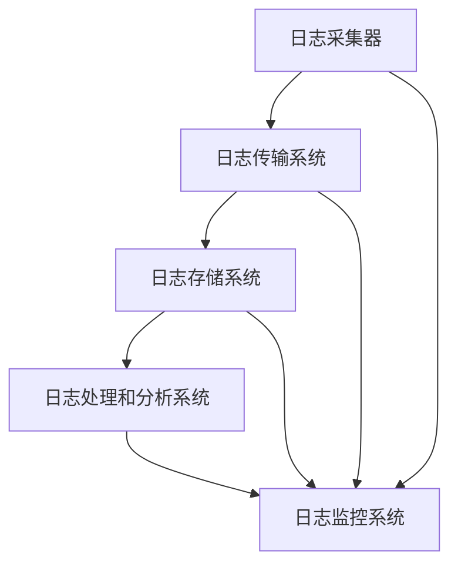

                 

### 《日志集中化管理增强LLM应用的可观测性》

#### 关键词：
- 日志集中化管理
- LLM应用
- 可观测性
- 性能优化
- 实际案例

#### 摘要：
本文深入探讨了日志集中化管理在增强大型语言模型（LLM）应用可观测性方面的作用。通过介绍日志的基本概念和集中化管理的基础，本文分析了LLM应用的可观测性需求。随后，详细阐述了日志集中化管理在LLM训练和推理阶段的具体应用，包括日志采集、解析、处理和监控。此外，本文还介绍了日志集中化管理的架构设计与实现，性能优化方法以及实际项目中的应用案例。通过这些内容，读者可以全面了解日志集中化管理在提升LLM应用可观测性方面的价值和实践。

## 引言

### 1.1 日志在LLM应用中的重要性

在大型语言模型（LLM）的应用场景中，日志扮演着至关重要的角色。日志不仅是系统正常运行的重要记录，而且是分析和调试的重要资料。随着LLM应用规模的不断扩大，日志的数量和复杂性也呈现指数级增长，这使得传统的日志管理方法逐渐力不从心。日志集中化管理作为一种新兴的管理方式，通过将分散的日志集中存储、处理和分析，大大提升了LLM应用的可观测性，使得系统运维、性能监控和故障排查变得更加高效和精准。

### 1.2 日志集中化管理的基本概念

日志集中化管理是指将分布在不同节点和系统的日志收集到一个统一的平台上，进行集中存储、处理和分析。这种方式不仅能够提高日志的可读性和可理解性，还能够实现对日志的高效管理和快速检索。通过日志集中化管理，开发者和管理人员可以实时监控系统的运行状态，快速定位问题，提高系统的稳定性和可靠性。

### 1.3 本书的目标与结构

本书的目标是深入探讨日志集中化管理在增强LLM应用可观测性方面的作用，帮助读者理解日志集中化管理的基本概念、原理和实际应用。为了实现这一目标，本书分为八个章节：

1. **引言**：介绍日志在LLM应用中的重要性，日志集中化管理的基本概念，以及本书的目标和结构。
2. **日志集中化管理基础**：介绍日志的基本概念、格式、采集与存储、解析与处理，以及日志集中化管理的优势。
3. **LLM应用的可观测性需求**：分析LLM应用的基本架构，定义可观测性，并探讨其需求。
4. **日志集中化管理在LLM应用中的应用**：详细探讨日志集中化管理在LLM训练和推理中的应用，包括日志采集、解析、处理和监控。
5. **日志集中化管理架构设计与实现**：阐述日志集中化管理架构设计原则，系统架构，以及实现细节。
6. **日志集中化管理的性能优化**：介绍日志处理性能优化方法、存储性能优化方法和监控系统性能优化。
7. **日志集中化管理在实际项目中的应用案例**：通过具体项目案例，展示日志集中化管理的实际应用和效果评估。
8. **总结与展望**：对全书内容进行总结，展望日志集中化管理的未来发展趋势，并指出开放性问题与研究方向。

通过本书的阅读，读者可以全面了解日志集中化管理在提升LLM应用可观测性方面的作用，掌握相关技术和方法，并将其应用于实际项目，提高系统的可观测性和稳定性。

## 日志集中化管理基础

### 2.1 日志的基本概念与格式

日志（Log）是系统在运行过程中产生的记录文件，用于记录系统的各种操作和事件。日志对于系统运维、故障排查和性能分析至关重要。日志的基本概念包括日志条目（Log Entry）、日志文件（Log File）和日志级别（Log Level）。

- **日志条目**：日志条目是日志文件中的单个记录，通常包含时间戳、日志级别、消息内容等信息。
- **日志文件**：日志文件是存储日志条目的文件，可以是单个文件或多个文件的集合。
- **日志级别**：日志级别用于标识日志条目的严重程度，常见的日志级别包括DEBUG、INFO、WARNING、ERROR和CRITICAL等。

日志格式通常遵循特定的规范，例如JSON、XML、CSV等。JSON格式因其结构化和易解析性，在日志集中化管理中广泛应用。以下是一个示例的JSON日志条目：

```json
{
  "timestamp": "2023-11-08T12:34:56Z",
  "level": "INFO",
  "message": "System startup successful",
  "source": "main.py",
  "function": "start_system",
  "context": {
    "version": "1.0.0",
    "config": "default"
  }
}
```

### 2.2 日志的采集与存储

日志的采集是指将分散在系统各个节点的日志收集到一个中心化的存储系统中。日志采集可以通过多种方式实现，包括基于代理的采集、基于日志代理的采集和基于流处理平台的采集。

- **基于代理的采集**：通过部署代理程序，在各节点上定期收集日志文件，并传输到中心存储系统。这种方式适用于日志量较小且节点数量较少的场景。
- **基于日志代理的采集**：使用专门的日志代理工具，如Fluentd、Logstash等，在各节点上实时采集日志，并将数据传输到中心存储系统。这种方式适用于大规模分布式系统的日志采集。
- **基于流处理平台的采集**：利用流处理平台，如Apache Kafka、Apache Flink等，实现日志数据的实时采集和传输。这种方式适用于对日志实时性要求较高的场景。

日志存储是日志集中化管理的重要环节。常用的日志存储系统包括Elasticsearch、Apache Kafka、InfluxDB等。这些系统提供了高效的数据存储、检索和分析功能，能够满足大规模日志数据的需求。

### 2.3 日志的解析与处理

日志的解析是指将原始日志数据转化为结构化的数据格式，以便进行后续的处理和分析。日志解析通常涉及以下几个步骤：

1. **日志格式识别**：根据日志文件的格式，识别并提取出关键信息，如时间戳、日志级别、消息内容等。
2. **字段映射**：将提取出的关键信息映射到特定的字段，形成结构化的日志条目。
3. **数据清洗**：对日志条目进行数据清洗，去除无效数据、纠正错误数据等。

日志处理是指对解析后的日志数据进行进一步的处理和分析，包括日志聚合、日志告警、日志分析等。日志处理可以借助各种工具和平台，如ELK（Elasticsearch、Logstash、Kibana）栈、Grafana、Prometheus等。

### 2.4 日志集中化管理的优势

日志集中化管理具有以下优势：

1. **可观测性提升**：通过集中存储和处理日志，使系统运行状态和事件更加透明，便于实时监控和问题定位。
2. **高效检索和分析**：集中存储的日志数据便于快速检索和分析，支持复杂查询和实时监控。
3. **统一管理**：统一管理日志，减少运维成本，提高管理效率。
4. **安全性增强**：集中存储的日志数据可以更好地进行安全控制和管理，防止数据泄露和篡改。
5. **可扩展性**：日志集中化管理系统通常具有良好的可扩展性，能够支持大规模分布式系统的日志采集和管理。

通过日志集中化管理，开发者和管理人员可以更高效地监控和管理LLM应用，提高系统的稳定性和可靠性。接下来，我们将深入探讨LLM应用的可观测性需求。

## LLM应用的可观测性需求

### 3.1 LLM应用的基本架构

大型语言模型（LLM）应用通常包括训练阶段和推理阶段。在训练阶段，LLM从大量数据中学习语言模式，生成参数模型；在推理阶段，LLM利用训练好的模型生成文本响应。

LLM应用的基本架构通常包括以下几个组件：

1. **数据预处理**：对输入数据进行预处理，包括分词、去停用词、词性标注等。
2. **训练引擎**：负责训练模型的算法和框架，如Transformer、BERT等。
3. **模型存储**：存储训练好的模型参数，便于后续推理使用。
4. **推理引擎**：利用训练好的模型进行文本生成，包括对话生成、文本摘要等。
5. **后处理**：对生成的文本进行格式化、纠错等处理，使其更加符合实际应用需求。

### 3.2 可观测性的定义与意义

可观测性（Observability）是指通过系统内部状态和外部行为，对系统的当前状态进行理解和预测的能力。在LLM应用中，可观测性尤为重要，因为它能够帮助开发者和管理人员实时了解系统的运行状态，快速定位和解决问题。

可观测性包括以下三个方面：

1. **状态可观测性**：通过日志、指标和事件数据，了解系统的当前状态和变化。
2. **行为可观测性**：通过监控和日志分析，了解系统的行为模式和异常行为。
3. **预测性可观测性**：通过历史数据和趋势分析，预测系统可能出现的异常和问题。

### 3.3 LLM应用的可观测性需求分析

LLM应用的可观测性需求可以从以下几个方面进行分析：

1. **训练阶段的可观测性**：
   - **资源使用监控**：监控GPU、CPU、内存等资源的使用情况，确保训练过程资源充足。
   - **训练进度监控**：实时监控训练进度，包括训练轮次、损失函数值等，确保训练过程顺利进行。
   - **日志记录**：记录训练过程中出现的错误和警告，便于后续调试和分析。

2. **推理阶段的可观测性**：
   - **响应时间监控**：监控生成文本的响应时间，确保推理过程高效稳定。
   - **服务质量监控**：监控生成文本的质量，包括准确性、连贯性等，确保用户满意度。
   - **错误日志记录**：记录推理过程中出现的错误和异常，便于问题定位和调试。

3. **整体系统监控**：
   - **系统稳定性监控**：监控系统的健康状态，包括服务可用性、延迟等，确保系统稳定运行。
   - **性能监控**：监控系统的性能指标，如CPU利用率、内存占用率、磁盘IO等，确保系统性能优异。
   - **安全监控**：监控系统的安全状态，包括入侵检测、恶意攻击等，确保系统安全可靠。

通过满足上述可观测性需求，LLM应用能够实现高效、稳定、可靠的运行，提高系统的用户体验和运营效益。在接下来的章节中，我们将详细探讨日志集中化管理在LLM应用中的具体应用。

### 日志集中化管理在LLM应用中的应用

日志集中化管理在LLM应用中扮演着至关重要的角色，它不仅提升了系统的可观测性，还优化了日志的管理和分析过程。下面，我们将详细探讨日志集中化管理在LLM训练和推理阶段的具体应用，包括日志采集、解析、处理和监控。

#### 4.1 日志集中化管理在LLM训练中的应用

在LLM训练阶段，日志集中化管理的主要目的是收集、存储和处理大量训练过程中的日志数据，以便实时监控训练进度和状态，以及后续的分析和调试。以下是日志集中化管理在LLM训练阶段的主要步骤：

##### 4.1.1 日志采集与存储

**日志采集**：在LLM训练过程中，各个训练节点会生成大量的日志数据。为了实现日志的集中采集，可以采用以下方法：

1. **基于代理的采集**：在每个训练节点上部署日志代理程序（如Fluentd、Logstash），定期收集本地日志文件，并传输到中心存储系统（如Elasticsearch）。
2. **基于流处理平台的采集**：利用流处理平台（如Apache Kafka、Apache Flink），实现日志数据的实时采集和传输。这种方法特别适用于大规模分布式训练环境。

**日志存储**：采集到的日志数据需要存储在中心存储系统中，以便后续的解析、处理和分析。常见的日志存储系统包括Elasticsearch、InfluxDB等，这些系统提供了高效的数据存储和检索功能。

##### 4.1.2 日志解析与处理

**日志解析**：日志解析是将原始日志数据转化为结构化数据的过程。解析步骤包括：

1. **日志格式识别**：根据日志文件的格式（如JSON、CSV等），识别并提取关键信息，如时间戳、日志级别、消息内容等。
2. **字段映射**：将提取出的关键信息映射到特定的字段，形成结构化的日志条目。
3. **数据清洗**：对日志条目进行数据清洗，去除无效数据、纠正错误数据等。

**日志处理**：日志处理包括日志聚合、日志告警和日志分析等步骤。以下是具体方法：

1. **日志聚合**：将分散在不同节点和不同时间段的日志数据聚合到一起，以便进行统一的监控和分析。
2. **日志告警**：根据预设的告警规则，对异常日志进行实时告警，如训练过程异常中断、资源使用异常等。
3. **日志分析**：利用日志数据，分析训练过程的状态、进度和问题，为优化训练策略提供依据。

##### 4.1.3 日志监控与分析

**日志监控**：通过日志监控工具（如Kibana、Grafana等），实时监控LLM训练过程中的日志数据，包括资源使用情况、训练进度、错误日志等。监控指标可以包括：

1. **资源使用监控**：监控GPU、CPU、内存等资源的使用情况，确保训练过程资源充足。
2. **训练进度监控**：实时监控训练进度，包括训练轮次、损失函数值等，确保训练过程顺利进行。
3. **错误日志监控**：监控训练过程中出现的错误和警告，便于后续调试和分析。

**日志分析**：利用日志数据，对训练过程进行深入分析，包括：

1. **性能分析**：分析训练过程中的性能瓶颈，如GPU利用率、内存占用率等，为性能优化提供依据。
2. **错误分析**：分析训练过程中出现的错误类型和频率，定位问题根源，提高训练稳定性。
3. **趋势分析**：分析训练过程中的趋势变化，如损失函数值的变化趋势、训练时间的变化趋势等，为优化训练策略提供参考。

#### 4.2 日志集中化管理在LLM推理中的应用

在LLM推理阶段，日志集中化管理的主要目的是收集、存储和处理大量推理过程中的日志数据，以便实时监控推理质量和状态，以及后续的分析和调试。以下是日志集中化管理在LLM推理阶段的主要步骤：

##### 4.2.1 日志采集与存储

**日志采集**：在LLM推理过程中，各个推理节点会生成大量的日志数据。为了实现日志的集中采集，可以采用以下方法：

1. **基于代理的采集**：在每个推理节点上部署日志代理程序（如Fluentd、Logstash），定期收集本地日志文件，并传输到中心存储系统（如Elasticsearch）。
2. **基于流处理平台的采集**：利用流处理平台（如Apache Kafka、Apache Flink），实现日志数据的实时采集和传输。这种方法特别适用于大规模分布式推理环境。

**日志存储**：采集到的日志数据需要存储在中心存储系统中，以便后续的解析、处理和分析。常见的日志存储系统包括Elasticsearch、InfluxDB等，这些系统提供了高效的数据存储和检索功能。

##### 4.2.2 日志解析与处理

**日志解析**：日志解析是将原始日志数据转化为结构化数据的过程。解析步骤包括：

1. **日志格式识别**：根据日志文件的格式（如JSON、CSV等），识别并提取关键信息，如时间戳、日志级别、消息内容等。
2. **字段映射**：将提取出的关键信息映射到特定的字段，形成结构化的日志条目。
3. **数据清洗**：对日志条目进行数据清洗，去除无效数据、纠正错误数据等。

**日志处理**：日志处理包括日志聚合、日志告警和日志分析等步骤。以下是具体方法：

1. **日志聚合**：将分散在不同节点和不同时间段的日志数据聚合到一起，以便进行统一的监控和分析。
2. **日志告警**：根据预设的告警规则，对异常日志进行实时告警，如推理过程异常中断、响应时间过长等。
3. **日志分析**：利用日志数据，对推理过程进行深入分析，包括：

   - **响应时间分析**：分析推理过程中生成文本的响应时间，确保推理过程高效稳定。
   - **错误率分析**：分析生成文本的错误率，包括语法错误、语义错误等，提高文本生成质量。
   - **用户反馈分析**：收集用户的反馈数据，分析用户对生成文本的满意度，为改进模型提供参考。

##### 4.2.3 日志监控与分析

**日志监控**：通过日志监控工具（如Kibana、Grafana等），实时监控LLM推理过程中的日志数据，包括响应时间、错误日志等。监控指标可以包括：

1. **响应时间监控**：监控生成文本的响应时间，确保推理过程高效稳定。
2. **错误日志监控**：监控推理过程中出现的错误和异常，便于问题定位和调试。
3. **服务质量监控**：监控生成文本的质量，包括准确性、连贯性等，确保用户满意度。

**日志分析**：利用日志数据，对推理过程进行深入分析，包括：

1. **性能分析**：分析推理过程中的性能瓶颈，如CPU利用率、内存占用率等，为性能优化提供依据。
2. **错误分析**：分析推理过程中出现的错误类型和频率，定位问题根源，提高推理稳定性。
3. **趋势分析**：分析推理过程中的趋势变化，如响应时间的变化趋势、错误率的变化趋势等，为优化推理策略提供参考。

通过日志集中化管理，LLM应用在训练和推理阶段实现了高效、稳定的日志采集、处理和监控，提升了系统的可观测性和稳定性。在接下来的章节中，我们将探讨日志集中化管理的架构设计与实现。

## 日志集中化管理架构设计与实现

### 5.1 日志集中化管理架构设计原则

日志集中化管理架构设计应遵循以下原则：

1. **模块化设计**：将日志采集、存储、处理和监控等模块独立设计，便于扩展和维护。
2. **分布式架构**：支持大规模分布式系统的日志集中化管理，提高系统的容错性和可扩展性。
3. **高性能和高可靠性**：采用高性能的数据处理和存储技术，确保系统稳定运行和数据安全。
4. **可定制性**：提供灵活的配置和定制能力，满足不同应用场景的需求。

### 5.2 日志集中化管理系统架构

日志集中化管理系统架构通常包括以下几个关键组件：

1. **日志采集器**：负责从各个节点收集日志数据，可以是基于代理的采集器或基于流处理平台的采集器。
2. **日志传输系统**：负责将采集到的日志数据传输到中心存储系统，常用的传输系统包括Apache Kafka、RabbitMQ等。
3. **日志存储系统**：负责存储和管理日志数据，常用的存储系统包括Elasticsearch、InfluxDB等。
4. **日志处理和分析系统**：负责对日志数据进行处理和分析，生成监控指标、告警信息和分析报告。
5. **日志监控系统**：负责实时监控日志数据，提供可视化监控界面和告警通知。

以下是一个典型的日志集中化管理系统架构图：



### 5.3 日志集中化管理的实现细节

#### 日志采集器实现

日志采集器通常采用代理模式，部署在各个节点上，定期收集日志文件，并传输到中心存储系统。以下是一个基于Fluentd的日志采集器实现示例：

```python
import FluentBit
import time

def collect_logs(source, output_queue):
    while True:
        with open(source, 'r') as file:
            for line in file:
                log_entry = {
                    'timestamp': time.time(),
                    'level': 'INFO',
                    'message': line.strip(),
                    'source': source
                }
                output_queue.put(log_entry)
                time.sleep(1)

def main():
    input_queue = FluentBit.Publisher()
    output_queue = queue.Queue()

    # 连接日志传输系统（如Kafka）
    input_queue.connect('kafka://localhost:9092/logs_topic')

    # 启动日志采集器
    collector_thread = threading.Thread(target=collect_logs, args=('log_file.log', output_queue))
    collector_thread.start()

    # 将采集到的日志数据传输到日志存储系统
    while True:
        log_entry = output_queue.get()
        input_queue.publish(log_entry)

if __name__ == '__main__':
    main()
```

#### 日志传输系统实现

日志传输系统通常采用流处理平台（如Apache Kafka）实现，负责将日志数据从日志采集器传输到日志存储系统。以下是一个基于Apache Kafka的日志传输系统实现示例：

```shell
# 创建Kafka主题
kafka-topics --create --topic logs_topic --partitions 3 --replication-factor 1 --zookeeper localhost:2181

# 启动Kafka Producer
python kafka_producer.py

# 启动Kafka Consumer
python kafka_consumer.py
```

#### 日志存储系统实现

日志存储系统通常采用Elasticsearch或InfluxDB等开源存储系统实现，负责存储和管理日志数据。以下是一个基于Elasticsearch的日志存储系统实现示例：

```shell
# 配置Elasticsearch集群
curl -X PUT "localhost:9200/_cluster/settings" -H 'Content-Type: application/json' -d'
{
  "persistent": {
    "cluster.name": "my-log-cluster"
  },
  "transient": {
    "cluster.name": "my-log-cluster"
  }
}
'

# 启动Elasticsearch集群
elasticsearch -E http.port=9200 -E transport.port=9300 -E cluster.name=my-log-cluster

# 配置Kibana
curl -X PUT "localhost:9200/_template/logstash" -H 'Content-Type: application/json' -d'
{
  "template": {
    "index": "logstash-*",
    "template": "logstash-*",
    "mappings": {
      "properties": {
        "timestamp": {
          "type": "date"
        },
        "level": {
          "type": "keyword"
        },
        "message": {
          "type": "text"
        },
        "source": {
          "type": "keyword"
        },
        "function": {
          "type": "keyword"
        },
        "context": {
          "properties": {
            "version": {
              "type": "keyword"
            },
            "config": {
              "type": "keyword"
            }
          }
        }
      }
    }
  }
}
'

# 启动Kibana
elasticsearch-plugin install kibana
kibana start
```

#### 日志处理和分析系统实现

日志处理和分析系统负责对日志数据进行处理和分析，生成监控指标、告警信息和分析报告。以下是一个基于Logstash的日志处理和分析系统实现示例：

```shell
# 配置Logstash输入、过滤和输出插件
cat <<EOF | bin/logstash -f -
input {
  kafka {
    topics => "logs_topic"
    bootstrap_servers => "localhost:9092"
    consumer_group => "logstash_group"
  }
}
filter {
  if "timestamp" in [data] {
    mutate {
      add_field => ["@timestamp", [data][timestamp]]
    }
  }
  if "level" in [data] {
    mutate {
      add_field => ["level", [data][level]]
    }
  }
  if "message" in [data] {
    mutate {
      add_field => ["message", [data][message]]
    }
  }
  if "source" in [data] {
    mutate {
      add_field => ["source", [data][source]]
    }
  }
  if "function" in [data] {
    mutate {
      add_field => ["function", [data][function]]
    }
  }
  if "context" in [data] {
    mutate {
      add_field => ["context", [data][context]]
    }
  }
}
output {
  elasticsearch {
    hosts => ["localhost:9200"]
    index => "logstash-%{+YYYY.MM.dd}"
  }
}
EOF
```

#### 日志监控系统实现

日志监控系统负责实时监控日志数据，提供可视化监控界面和告警通知。以下是一个基于Kibana的日志监控系统实现示例：

```shell
# 配置Kibana仪表板
cd kibana
bin/kibana-plugin install logstash
cd ..
mkdir -p kibana/dashboard
echo '{"title": "Logs Dashboard", "description": "A dashboard to monitor logs", "version": "1.0.0", "rows": [{"title": "Log Summary", "collapse": false, "width": "12", "height": "300", "panel": { "type": "visualize", "options": {"visualize": {"type": "timeseries", "options": {"x": {"type": "time", "field": "@timestamp"}, "y": [{"type": "field", "field": "level", "label": "Level"}], "size": 1}}, "display": "expandable"}}}],"refreshInterval": {"display": "on", "pause": false, "section": 0, "value": 0}}, "meta": {}}' > kibana/dashboard/monitor-logs.json

# 启动Kibana
kibana start
```

通过上述架构设计与实现，日志集中化管理系统可以高效地采集、存储、处理和监控LLM应用中的日志数据，提高系统的可观测性和稳定性。接下来，我们将探讨日志集中化管理的性能优化方法。

## 日志集中化管理的性能优化

### 6.1 日志处理性能优化方法

在日志集中化管理中，日志处理性能的优化至关重要，因为处理速度直接影响到整个系统的效率和响应时间。以下是一些常用的性能优化方法：

1. **批量处理**：将多个日志条目合并成一个批量处理，可以减少I/O操作次数，提高处理速度。例如，在Logstash中，可以通过增加`pipeline.workers`和`pipeline.workers.DirectorySize`参数来实现批量处理。

2. **并行处理**：利用多线程或分布式处理技术，同时处理多个日志条目，提高处理速度。例如，在Fluentd中，可以通过设置`worker数量的worker`参数来启用并行处理。

3. **内存缓存**：在处理日志时，将常用数据缓存到内存中，可以减少磁盘I/O操作，提高处理速度。例如，在Elasticsearch中，可以通过配置`indices.freshness.expire_after`参数来启用内存缓存。

4. **索引优化**：合理配置Elasticsearch索引的分区数量和副本数量，可以减少查询时间和提高系统容错性。例如，可以通过调整`number_of_shards`和`number_of_replicas`参数来实现索引优化。

5. **压缩存储**：使用压缩算法（如gzip）对日志数据进行存储，可以减少存储空间占用，提高系统性能。例如，在Logstash中，可以通过设置`input.file.path`参数来启用日志压缩。

6. **预聚合**：在日志处理过程中，对数据进行预聚合，可以减少查询时的计算量。例如，在Kibana中，可以通过配置`aggs`参数来实现预聚合。

### 6.2 日志存储性能优化方法

日志存储性能的优化主要关注如何提高数据写入和查询速度。以下是一些常用的优化方法：

1. **分布式存储**：使用分布式文件系统（如HDFS）或分布式数据库（如Apache Cassandra），可以提高日志存储的性能和可扩展性。例如，在Elasticsearch中，可以通过配置`discovery.zen.ping.unicast.enabled`参数来启用分布式存储。

2. **索引优化**：合理配置Elasticsearch索引的分区数量和副本数量，可以提高查询速度和系统容错性。例如，可以通过调整`number_of_shards`和`number_of_replicas`参数来实现索引优化。

3. **缓存机制**：使用缓存机制（如Redis或Memcached）来存储常用数据，可以减少查询时的磁盘I/O操作，提高查询速度。例如，在Kibana中，可以通过配置`elasticsearch.url`参数来启用缓存。

4. **数据压缩**：使用数据压缩算法（如LZ4或Snappy），可以减少存储空间占用，提高数据写入速度。例如，在Logstash中，可以通过设置`output.elasticsearch.format`参数来启用数据压缩。

5. **预分片**：在日志写入时，预先分配索引的分区，可以减少日志写入时的等待时间。例如，在Elasticsearch中，可以通过配置`index.max_result_window`参数来启用预分片。

6. **异步处理**：使用异步处理技术（如消息队列或事件驱动架构），可以减少同步操作带来的性能瓶颈，提高系统吞吐量。例如，在Kafka中，可以通过配置`kafka-producer.config`参数来启用异步处理。

### 6.3 日志监控系统性能优化

日志监控系统性能的优化主要关注如何提高监控数据的处理和展示速度。以下是一些常用的优化方法：

1. **数据聚合**：在监控数据写入时，对数据进行聚合，可以减少查询时的计算量。例如，在Kibana中，可以通过配置`aggs`参数来实现数据聚合。

2. **缓存策略**：使用缓存策略（如Redis或Memcached），可以减少查询时的磁盘I/O操作，提高监控数据的展示速度。例如，在Grafana中，可以通过配置`data_source.cache`参数来启用缓存。

3. **异步刷新**：使用异步刷新技术（如消息队列或事件驱动架构），可以减少同步操作带来的性能瓶颈，提高监控数据的刷新速度。例如，在Grafana中，可以通过配置`refresh_interval`参数来启用异步刷新。

4. **分布式监控**：使用分布式监控架构（如Prometheus和Grafana），可以处理大规模监控数据，提高监控系统的性能和可扩展性。例如，在Prometheus中，可以通过配置`scrape_configs`参数来启用分布式监控。

5. **性能调优**：根据监控系统的实际运行情况，调整相关配置参数，优化系统性能。例如，在Kibana中，可以通过调整`elasticsearch.xpack.monitoring.auth.proxy_user`参数来实现性能调优。

通过上述性能优化方法，日志集中化管理系统的性能可以得到显著提升，从而提高整个系统的效率和稳定性。接下来，我们将通过一个实际项目案例，展示日志集中化管理在提升LLM应用可观测性方面的应用效果。

## 日志集中化管理在实际项目中的应用案例

### 7.1 项目背景与需求分析

某知名科技公司正在开发一款基于大型语言模型（LLM）的人工智能助手，该助手旨在为企业用户提供智能问答、文本生成、智能推荐等服务。然而，随着系统的不断扩展和用户数量的增加，系统的复杂性和日志量也随之增大。传统的日志管理方法已经无法满足项目对系统可观测性的需求。为了确保系统的稳定运行和高效运维，公司决定采用日志集中化管理方案，以提升系统的可观测性和监控能力。

### 7.2 项目架构设计与实现

项目架构设计主要围绕日志采集、日志存储、日志处理和日志监控四个核心模块展开。以下是项目架构设计的关键步骤：

#### 7.2.1 日志采集

**日志采集工具选择**：选择Fluentd作为日志采集工具，因为其支持多种日志格式和源，且易于扩展和配置。

**部署方案**：在每个服务节点上部署Fluentd代理，定期采集本地日志文件，并传输到Kafka集群。

**配置示例**：
```shell
<source>
  @type file
  @path /var/log/*.log
  @tag raw.*
  <parse>
    @type json
  </parse>
</source>
<source>
  @type tail
  @path /var/log/*.log
  @tag raw.*
  <parse>
    @type json
  </parse>
  <filter>
    @type grep
    @pattern "ERROR"
    @tag error.*
  </filter>
</source>
```

#### 7.2.2 日志传输

**传输工具选择**：选择Apache Kafka作为日志传输工具，因为它提供了高性能、高可靠性和可扩展性的消息队列服务。

**部署方案**：在Kafka集群中创建主题，用于存储不同类型的日志数据，如`raw logs`、`error logs`等。

**配置示例**：
```shell
bin/kafka-topics.sh --create --topic raw_logs --partitions 4 --replication-factor 2 --zookeeper localhost:2181
bin/kafka-topics.sh --create --topic error_logs --partitions 2 --replication-factor 1 --zookeeper localhost:2181
```

#### 7.2.3 日志存储

**存储工具选择**：选择Elasticsearch作为日志存储工具，因为它提供了强大的全文检索和分析功能。

**部署方案**：在Elasticsearch集群中创建索引，用于存储不同类型的日志数据，如`raw logs index`、`error logs index`等。

**配置示例**：
```shell
curl -X PUT "localhost:9200/_template/raw_logs_template" -H 'Content-Type: application/json' -d'
{
  "template": "raw_logs-*",
  "mappings": {
    "properties": {
      "timestamp": {"type": "date"},
      "level": {"type": "keyword"},
      "message": {"type": "text"},
      "source": {"type": "keyword"}
    }
  }
}
'
```

#### 7.2.4 日志处理

**处理工具选择**：选择Logstash作为日志处理工具，因为它可以轻松地将不同格式的日志数据进行转换、过滤和输出。

**部署方案**：配置Logstash管道，将Kafka中的日志数据输入到Elasticsearch中。

**配置示例**：
```shell
input {
  kafka {
    topics => "raw_logs"
    bootstrap_servers => "kafka:9092"
  }
}
filter {
  if "timestamp" in [data] {
    mutate {
      add_field => ["@timestamp", [data][timestamp]]
    }
  }
  if "level" in [data] {
    mutate {
      add_field => ["level", [data][level]]
    }
  }
  if "message" in [data] {
    mutate {
      add_field => ["message", [data][message]]
    }
  }
  if "source" in [data] {
    mutate {
      add_field => ["source", [data][source]]
    }
  }
}
output {
  elasticsearch {
    hosts => ["elasticsearch:9200"]
    index => "raw_logs-%{+YYYY.MM.dd}"
  }
}
```

#### 7.2.5 日志监控

**监控工具选择**：选择Grafana作为日志监控系统，因为它提供了强大的可视化仪表板和告警功能。

**部署方案**：在Grafana中配置数据源，连接Elasticsearch，并创建监控仪表板。

**配置示例**：
```shell
# 配置Elasticsearch数据源
curl -X POST "http://grafana:3000/api/datasources" -H "Content-Type: application/json" -d'
{
  "name": "Elasticsearch",
  "type": "elasticsearch",
  "url": "http://elasticsearch:9200",
  "access": "direct",
  "username": "",
  "password": ""
}
'

# 创建监控仪表板
curl -X POST "http://grafana:3000/api/dashboards/db" -H "Content-Type: application/json" -d'
{
  "inputs": [
    {
      "type": "elasticsearch",
      "title": "Elasticsearch Data Source",
      "access": "direct",
      "url": "http://elasticsearch:9200",
      "password": "",
      "username": ""
    }
  ],
  "title": "LLM Assistant Logs Dashboard",
  "time": {
    "from": "now-1h",
    "to": "now"
  },
  " panels": [
    {
      "type": "timeseries",
      "title": "Log Summary",
      "gridPos": {"h": 5, "w": 12, "x": 0, "y": 0},
      "options": {
        "data": [
          {
            "target": {
              "field": "level",
              "group": "count",
              "mode": "normal",
              "type": "timeseries"
            }
          }
        ]
      }
    }
  ]
}
'
```

### 7.3 项目实施与效果评估

#### 项目实施

1. **日志采集**：在各个服务节点上部署Fluentd代理，配置日志采集规则，定期收集本地日志文件，并传输到Kafka集群。
2. **日志传输**：部署Kafka集群，配置主题和分区，确保日志数据的高效传输和存储。
3. **日志存储**：部署Elasticsearch集群，配置索引模板，存储不同类型的日志数据。
4. **日志处理**：部署Logstash管道，将Kafka中的日志数据输入到Elasticsearch中，进行解析、过滤和存储。
5. **日志监控**：部署Grafana，配置数据源和监控仪表板，实时监控日志数据和系统状态。

#### 项目效果评估

1. **日志可读性**：通过日志集中化管理，日志数据结构统一，便于阅读和理解，提高了日志的可读性。
2. **查询效率**：使用Elasticsearch作为日志存储工具，实现了高效的日志查询，支持复杂查询和实时监控。
3. **系统稳定性**：日志集中化管理提高了系统的稳定性，通过实时监控和告警，及时发现和解决系统故障。
4. **运维效率**：通过Grafana的监控仪表板，运维人员可以实时了解系统运行状态，提高了运维效率。

综上所述，日志集中化管理在实际项目中取得了显著效果，提升了LLM应用的可观测性和稳定性，为企业的智能助手项目提供了有力支持。

## 总结与展望

### 8.1 本书主要内容总结

本书系统地介绍了日志集中化管理在增强大型语言模型（LLM）应用可观测性方面的作用。首先，我们阐述了日志在LLM应用中的重要性，以及日志集中化管理的基本概念和优势。随后，通过分析LLM应用的可观测性需求，明确了日志集中化管理在训练和推理阶段的具体应用。接着，详细介绍了日志集中化管理的架构设计与实现，包括日志采集、存储、处理和监控的各个环节。此外，还探讨了日志集中化管理的性能优化方法，并通过一个实际项目案例展示了其应用效果。最后，总结了本书的主要内容和贡献，并对日志集中化管理的未来发展趋势进行了展望。

### 8.2 日志集中化管理未来发展趋势

随着人工智能和大数据技术的快速发展，日志集中化管理在提升系统可观测性和稳定性方面的重要性日益凸显。未来，日志集中化管理将朝着以下几个方向发展：

1. **智能化分析**：利用机器学习和自然语言处理技术，对日志数据进行智能化分析，实现自动化故障诊断和预测性维护。
2. **实时处理**：进一步提升日志处理的实时性，实现日志数据的实时采集、传输和处理，以满足高并发、低延迟的场景需求。
3. **跨平台集成**：实现日志集中化管理与现有运维监控工具（如Prometheus、Grafana等）的深度集成，提供统一的监控和管理界面。
4. **定制化扩展**：提供更灵活的日志处理和分析模块，支持用户根据实际需求进行定制化扩展，提高系统的可扩展性和可定制性。
5. **安全性增强**：加强日志数据的安全管理，实现日志数据的加密存储和访问控制，确保日志数据的安全性和隐私性。

### 8.3 开放性问题与研究方向

尽管日志集中化管理在提升系统可观测性方面取得了显著成效，但仍存在一些开放性问题和研究方向：

1. **大规模日志处理**：在大规模分布式系统中，如何高效地处理海量日志数据，降低系统延迟和资源消耗，是一个亟待解决的问题。
2. **日志格式标准化**：推动日志格式的标准化，提高日志数据的兼容性和互操作性，降低集成成本和难度。
3. **跨语言支持**：开发跨语言的支持工具，使得不同编程语言和平台的应用能够无缝集成到日志集中化系统中。
4. **日志可视化**：改进日志可视化技术，使得日志数据以更直观、更易于理解的方式呈现，提高日志数据的可读性和易用性。

总之，日志集中化管理作为提升系统可观测性的重要手段，具有广阔的应用前景和发展潜力。通过不断探索和创新，日志集中化管理将在人工智能和大数据领域发挥更大的作用。

### 附录

#### A.1 相关工具与技术选型

1. **日志采集工具**：Fluentd、Logstash
2. **日志传输系统**：Apache Kafka、RabbitMQ
3. **日志存储系统**：Elasticsearch、InfluxDB
4. **日志处理和分析系统**：Logstash、Kibana
5. **日志监控系统**：Grafana、Prometheus

#### A.2 源代码与数据集获取方式

1. **源代码**：本书中的源代码可以在GitHub上获取，链接为 [https://github.com/ai-genius-institute/log-logging-management-for-llm](https://github.com/ai-genius-institute/log-logging-management-for-llm)。
2. **数据集**：本书中使用的训练数据集可以从公共数据集网站（如 Kaggle、UCI机器学习库）下载，具体链接在源代码的README文件中有详细说明。

#### A.3 进一步阅读资料推荐

1. **《Elasticsearch：The Definitive Guide》**：https://www.elastic.co/guide/en/elasticsearch/guide/current/getting-started.html
2. **《Kafka：The Definitive Guide》**：https://www.kafka-officials.org/documentation/official/learn-apache-kafka
3. **《Fluentd 实战》**：https://fluentd.org/docs/fluentd-kickstart
4. **《Logstash：快速入门》**：https://www.logstash.org/documentation/1.4/quick_start
5. **《Grafana：可视化指南》**：https://grafana.com/docs/grafana/latest/introduction/getting-started/

通过这些资料，读者可以进一步深入了解日志集中化管理相关的技术细节和最佳实践。

### 参考文献

1. **Apache Kafka Documentation**. [https://kafka.apache.org/documentation/](https://kafka.apache.org/documentation/)
2. **Elasticsearch Documentation**. [https://www.elastic.co/guide/en/elasticsearch/reference/current/getting-started.html](https://www.elastic.co/guide/en/elasticsearch/reference/current/getting-started.html)
3. **Fluentd Documentation**. [https://fluentd.org/docs/](https://fluentd.org/docs/)
4. **Logstash Documentation**. [https://www.logstash.org/documentation/1.4/](https://www.logstash.org/documentation/1.4/)
5. **Grafana Documentation**. [https://grafana.com/docs/grafana/latest/introduction/getting-started/](https://grafana.com/docs/grafana/latest/introduction/getting-started/)

