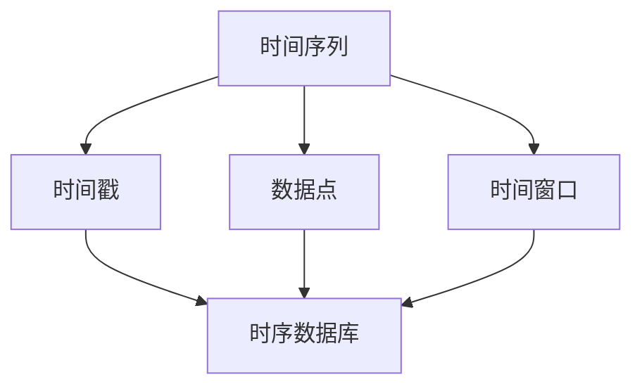

                 

### 1.1.1 什么是时序数据库

时序数据库（Time-Series Database，简称TSDB）是一种专门为处理时间序列数据而设计的数据库系统。时间序列数据是一种按照时间顺序排列的数据序列，每个数据点都带有时间戳信息。这种数据模式广泛应用于各种领域，包括金融、物联网、工业制造、气象预报、医疗健康、交通管理以及在线广告等。

#### 核心概念与联系

- **时间序列（Time Series）**：时间序列是按时间顺序排列的数据点集合。这些数据点可以是温度、股票价格、设备运行状态、网络流量等。时间序列数据具有时间连续性和时间依赖性，即后续的数据点受到之前数据点的影响。

- **时间戳（Timestamp）**：时间戳是一个与时间序列数据点相关联的具体时间点，通常以秒或毫秒为单位。时间戳对于时间序列数据的处理和分析至关重要，因为它定义了数据点在时间维度上的位置。

- **数据点（Data Point）**：数据点是时间序列数据的基本组成单元，通常包含数值和附加信息，如标签、元数据等。

- **时间窗口（Time Window）**：时间窗口是用于数据分析和查询的时间范围，它定义了数据切片的起始和结束时间点。常见的窗口大小有1分钟、1小时、1天等。

#### Mermaid 流程图



#### 时序数据库的工作原理

时序数据库的核心功能是高效地存储、检索和查询时间序列数据。它们通常采用以下几种原理和架构：

1. **数据压缩**：由于时间序列数据具有时间连续性，可以采用各种压缩算法（如差分编码、时间序列预测等）减少存储空间。

2. **时间索引**：为了快速查询和分析时间序列数据，时序数据库通常会建立时间索引，如时间线索引、倒排索引等。

3. **高效写入**：为了处理大量实时数据，时序数据库通常支持高效的批量写入和流式写入。

4. **查询优化**：针对时间序列数据的查询特点，时序数据库会提供优化查询算法，如范围查询、聚合查询等。

#### Python 源代码示例

下面是一个简单的Python代码示例，展示了如何使用Pandas库处理时间序列数据。

```python
import pandas as pd

# 创建一个时间序列数据
data = {'Timestamp': pd.to_datetime(['2021-01-01 10:00', '2021-01-01 10:01', '2021-01-01 10:02']),
         'Temperature': [23, 24, 23.5]}
df = pd.DataFrame(data)

# 将Timestamp列设置为索引
df.set_index('Timestamp', inplace=True)

# 打印时间序列数据
print(df)
```

运行这段代码，会生成一个包含时间戳和温度数据的时间序列DataFrame，并设置时间戳为索引。

```plaintext
                           Temperature
Timestamp                                 
2021-01-01 10:00:00                23.0
2021-01-01 10:01:00                24.0
2021-01-01 10:02:00                23.5
```

#### 数学模型和公式

时间序列数据分析中，常用的一些数学模型和公式包括：

- **自回归模型（AR）**：$X_t = c + \phi_1 X_{t-1} + \phi_2 X_{t-2} + \cdots + \phi_p X_{t-p} + \epsilon_t$
- **移动平均模型（MA）**：$X_t = c + \theta_1 \epsilon_{t-1} + \theta_2 \epsilon_{t-2} + \cdots + \theta_q \epsilon_{t-q}$
- **自回归移动平均模型（ARMA）**：$X_t = c + \phi_1 X_{t-1} + \phi_2 X_{t-2} + \cdots + \phi_p X_{t-p} + \theta_1 \epsilon_{t-1} + \theta_2 \epsilon_{t-2} + \cdots + \theta_q \epsilon_{t-q}$

这些模型和公式用于预测和分析时间序列数据，帮助我们从历史数据中提取有用信息。

### 1.1.2 时序数据的特性

时序数据具有一系列独特的特性，这些特性决定了其处理和分析的方法。

#### 时间连续性

时间序列数据是按时间顺序排列的，每个数据点都带有时间戳。这使得时间序列数据在时间维度上具有连续性，可以用于监控和追踪实时动态。

#### 时间依赖性

时间序列数据中的后续数据点通常受到之前数据点的影响。例如，股票价格的走势可能会受到前一天价格变动的影响。因此，时间序列数据的分析需要考虑时间依赖性。

#### 数据密度波动

时间序列数据在不同时间段的数据密度可能存在波动。例如，某些传感器可能每秒产生大量数据，而其他传感器可能每天只生成少量数据。这种波动性要求时序数据库能够适应不同数据密度，提供高效的存储和查询能力。

#### 数据趋势和季节性

时间序列数据通常具有趋势和季节性。趋势是指数据随时间增加或减少的整体趋势，而季节性是指数据在特定时间段内的周期性变化。识别和建模这些趋势和季节性对于预测和分析时间序列数据至关重要。

#### 数据噪声

时间序列数据中可能存在噪声和异常值。噪声是指那些不影响数据主要趋势和模式的小波动，而异常值是指那些明显偏离数据整体分布的数据点。处理这些噪声和异常值是时间序列数据分析的一个重要环节。

### 1.1.3 时序数据库的应用场景

时序数据库在众多领域都有广泛的应用，以下是一些常见的应用场景：

#### 金融领域

在金融领域，时序数据库用于存储和分析股票价格、交易量、市场指数等金融时间序列数据。通过分析这些数据，投资者可以做出更明智的投资决策。

#### 物联网

物联网（IoT）设备产生的数据通常是时间序列数据。时序数据库可以高效地存储和处理这些数据，用于设备监控、性能分析和预测维护。

#### 智能制造

在制造业中，时序数据库用于收集和分析生产线设备的状态数据、生产效率数据等。这些数据有助于优化生产流程、提高设备利用率和降低维护成本。

#### 气象预报

气象预报依赖于对天气数据的时间序列分析。时序数据库可以存储和处理大量历史天气数据，用于预测未来的天气状况。

#### 医疗健康

在医疗健康领域，时序数据库用于存储和处理患者的健康数据，如血压、血糖、心率等。通过分析这些数据，医生可以更准确地诊断和治疗疾病。

#### 交通管理

交通管理部门使用时序数据库存储和分析交通流量、路况数据等，以优化交通信号控制和疏导方案，提高交通效率。

#### 在线广告

在线广告平台使用时序数据库存储和分析用户行为数据，如点击率、转化率等，以优化广告投放策略，提高广告效果。

#### 结论

时序数据库因其专门为处理时间序列数据而设计，具有高效的数据存储、检索和分析能力。在金融、物联网、智能制造、气象预报、医疗健康、交通管理和在线广告等众多领域，时序数据库发挥着关键作用。通过理解时序数据库的基本概念和应用场景，我们可以更好地利用这些数据库来分析和优化各类时间序列数据。在接下来的部分中，我们将进一步探讨时序数据库的原理和技术细节。

