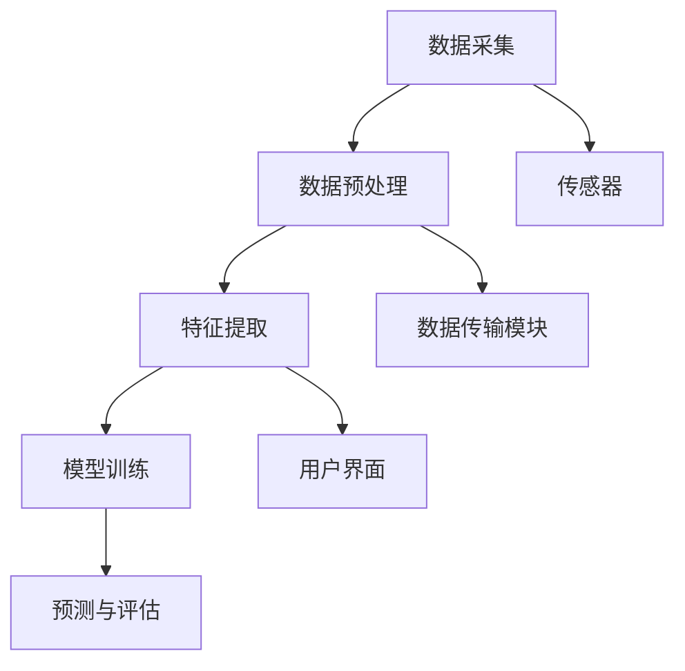

                 

# 《智能健康监测系统准确性评测平台》

## 关键词

智能健康监测系统、准确性评测、核心算法、数学模型、项目实战

## 摘要

本文旨在介绍智能健康监测系统的准确性评测平台。通过对智能健康监测系统的背景、核心概念、数据收集与预处理、准确性评测方法、核心算法原理、数学模型与公式以及项目实战的详细讲解，帮助读者理解并掌握如何搭建一个准确的智能健康监测系统评测平台。本文以Python源代码为例，结合实际案例，使读者能够更好地理解理论知识和实践操作。

## 目录

### 第一部分：引言

- **1.1 智能健康监测系统的背景**
- **1.2 准确性评测平台的重要性**
- **1.3 书籍结构**

### 第二部分：核心概念与联系

- **2.1 智能健康监测系统的组成**
- **2.2 智能健康监测系统的工作原理**
- **2.3 准确性评测的重要性**
- **2.4 Mermaid流程图：核心概念与联系**

### 第三部分：数据收集与预处理

- **3.1 数据收集方法**
- **3.2 数据预处理步骤**
- **3.3 Python源代码：数据预处理**

### 第四部分：准确性评测方法

- **4.1 混淆矩阵**
- **4.2 ROC曲线**
- **4.3 Python源代码：准确性评测方法**

### 第五部分：核心算法原理讲解

- **5.1 机器学习算法**
- **5.2 深度学习算法**
- **5.3 Python源代码：核心算法原理讲解**

### 第六部分：数学模型与公式讲解

- **6.1 模型评估指标**
- **6.2 模型优化方法**
- **6.3 统计模型**
- **6.4 LaTex格式：数学公式讲解**

### 第七部分：项目实战

- **7.1 项目背景**
- **7.2 环境搭建**
- **7.3 数据预处理**
- **7.4 算法实现**
- **7.5 结果分析**
- **7.6 项目小结**

### 第八部分：总结与展望

- **8.1 全书总结**
- **8.2 未来发展方向**

## 第一部分：引言

### 1.1 智能健康监测系统的背景

随着科技的快速发展，智能健康监测系统已经成为现代医学领域中不可或缺的一部分。智能健康监测系统通过收集和分析个人健康数据，如心率、血压、血糖、体温等，实现对个体健康状态的实时监测和预测。这些系统不仅能够为医生提供患者的健康信息，还能够帮助用户更好地管理自己的健康。

智能健康监测系统的应用场景非常广泛，包括但不限于以下几个方面：

1. **个人健康管理**：用户可以通过智能健康监测系统了解自己的健康状况，如心率是否正常、血压是否稳定等，从而采取相应的措施进行健康管理。
2. **慢性病管理**：对于患有慢性病的患者，智能健康监测系统可以实时监测其健康指标，如血糖、血压等，及时发现异常情况，提供预警，避免疾病恶化。
3. **医疗诊断**：医生可以通过智能健康监测系统获取患者的健康数据，辅助进行诊断和治疗。
4. **健康大数据分析**：智能健康监测系统可以收集大量的健康数据，通过数据分析和挖掘，发现健康趋势和疾病风险，为公共卫生决策提供支持。

### 1.2 准确性评测平台的重要性

尽管智能健康监测系统具有诸多优点，但其准确性的高低直接影响着系统的可用性和可靠性。因此，搭建一个准确的智能健康监测系统准确性评测平台至关重要。准确性评测平台的作用主要包括以下几个方面：

1. **评估系统性能**：准确性评测平台可以评估智能健康监测系统的性能，包括数据采集的准确性、数据处理的速度等，为系统的优化提供依据。
2. **指导系统开发**：准确性评测平台可以帮助开发者了解系统的不足之处，从而指导系统开发，提高系统的准确性和可靠性。
3. **用户信任**：一个准确的准确性评测平台可以提高用户对智能健康监测系统的信任度，增加系统的市场竞争力。
4. **临床应用**：准确性评测平台可以为临床应用提供可靠的数据支持，帮助医生做出更准确的诊断和治疗方案。

### 1.3 书籍结构

本书将从以下几个方面详细讲解智能健康监测系统准确性评测平台的搭建：

1. **核心概念与联系**：介绍智能健康监测系统的基本概念和原理，以及准确性评测的重要性。
2. **数据收集与预处理**：讲解数据收集的方法和预处理步骤，为后续的准确性评测打下基础。
3. **准确性评测方法**：介绍常用的准确性评测方法，如混淆矩阵、ROC曲线等，并结合Python源代码进行讲解。
4. **核心算法原理讲解**：详细阐述评估平台所使用的算法原理，如机器学习算法、深度学习算法等。
5. **数学模型与公式讲解**：介绍评估平台所使用的数学模型和公式，并进行详细讲解。
6. **项目实战**：通过实际案例，展示如何搭建一个准确性评测平台，包括环境搭建、数据预处理、算法实现和结果分析等。
7. **总结与展望**：对全书内容进行总结，并对未来发展方向进行展望。

## 第二部分：核心概念与联系

### 2.1 智能健康监测系统的组成

智能健康监测系统通常由以下几个部分组成：

1. **传感器**：传感器用于采集用户的生理信号，如心率、血压、血糖等。不同的传感器具有不同的精度和灵敏度，需要根据具体应用场景进行选择。
2. **数据采集模块**：数据采集模块负责将传感器采集到的生理信号转换为数字信号，并进行初步处理，如滤波、去噪等。
3. **数据传输模块**：数据传输模块将处理后的数字信号传输到远程服务器或本地设备，以便进行进一步分析。
4. **数据处理模块**：数据处理模块对传输过来的数据进行存储、管理和分析，如数据清洗、特征提取、模型训练等。
5. **用户界面**：用户界面用于展示用户的健康数据、分析结果和预警信息，用户可以通过界面进行交互操作。

### 2.2 智能健康监测系统的工作原理

智能健康监测系统的工作原理可以分为以下几个步骤：

1. **数据采集**：传感器采集用户的生理信号，如心率、血压、血糖等。
2. **数据预处理**：对采集到的数据进行预处理，如滤波、去噪、归一化等，以提高数据的准确性和可靠性。
3. **特征提取**：从预处理后的数据中提取出有用的特征，如心率 variability、血压变异性等，用于后续的分析和模型训练。
4. **模型训练**：使用机器学习算法或深度学习算法对提取出的特征进行训练，构建健康监测模型。
5. **预测与评估**：使用训练好的模型对新的数据进行预测，评估其健康状态，并将结果反馈给用户。

### 2.3 准确性评测的重要性

准确性评测是智能健康监测系统的关键环节，其重要性主要体现在以下几个方面：

1. **评估系统性能**：准确性评测可以评估智能健康监测系统的性能，包括数据采集的准确性、数据处理的速度、模型的预测准确性等。
2. **指导系统优化**：准确性评测可以帮助开发者发现系统的不足之处，从而指导系统的优化，提高系统的准确性和可靠性。
3. **用户信任**：一个准确的准确性评测可以提高用户对智能健康监测系统的信任度，增加系统的市场竞争力。
4. **临床应用**：准确性评测可以为临床应用提供可靠的数据支持，帮助医生做出更准确的诊断和治疗方案。

### 2.4 Mermaid流程图：核心概念与联系



## 第三部分：数据收集与预处理

### 3.1 数据收集方法

数据收集是智能健康监测系统的第一步，也是关键的一步。数据收集的方法主要包括以下几种：

1. **直接采集**：通过传感器直接采集用户的生理信号，如心率、血压、血糖等。这种方法直接、准确，但受限于传感器的精度和灵敏度。
2. **间接采集**：通过其他设备或手段间接获取用户的生理信号，如使用智能手表、智能手机等设备。这种方法较为便捷，但可能存在一定的误差。
3. **问卷调查**：通过用户填写问卷的形式收集健康数据，如身高、体重、生活习惯等。这种方法适用于大规模健康数据分析，但可能存在用户主观因素的影响。

### 3.2 数据预处理步骤

数据预处理是确保数据质量和可靠性的关键步骤。数据预处理主要包括以下步骤：

1. **数据清洗**：去除数据中的错误、异常和重复值，确保数据的准确性。
2. **数据归一化**：将不同特征的数据进行归一化处理，使其在同一量级上，以便于后续分析和建模。
3. **数据降维**：通过降维技术，减少数据维度，提高模型的训练效率和预测准确性。
4. **特征提取**：从预处理后的数据中提取出有用的特征，如心率 variability、血压变异性等。

### 3.3 Python源代码：数据预处理

```python
import pandas as pd
import numpy as np
from sklearn.preprocessing import StandardScaler
from sklearn.decomposition import PCA

# 加载数据
data = pd.read_csv('health_data.csv')

# 数据清洗
data.dropna(inplace=True)
data.drop_duplicates(inplace=True)

# 数据归一化
scaler = StandardScaler()
data[['heart_rate', 'blood_pressure', 'glucose']] = scaler.fit_transform(data[['heart_rate', 'blood_pressure', 'glucose']])

# 数据降维
pca = PCA(n_components=3)
data_pca = pca.fit_transform(data[['heart_rate', 'blood_pressure', 'glucose']])

# 特征提取
data['hr_variability'] = data_pca[:, 0]
data['bp_variability'] = data_pca[:, 1]
data['glucose_level'] = data_pca[:, 2]
```

## 第四部分：准确性评测方法

### 4.1 混淆矩阵

混淆矩阵是评估分类模型性能的重要工具，它展示了实际标签与预测标签之间的关系。混淆矩阵的每一行表示实际标签的分布，每一列表示预测标签的分布。

|      | 预测正常 | 预测异常 |
|------|----------|----------|
| 实际正常 | TN       | FP       |
| 实际异常 | FN       | TP       |

其中，TN表示实际正常且预测正常的样本，FP表示实际正常但预测异常的样本，FN表示实际异常但预测正常的样本，TP表示实际异常且预测异常的样本。

### 4.2 ROC曲线

ROC曲线（Receiver Operating Characteristic Curve）是一种常用的评估分类模型性能的图形化工具。ROC曲线通过改变分类器的阈值，绘制预测准确率与预测召回率之间的关系。

- **预测准确率**：分类模型正确预测的样本占总样本的比例。
- **预测召回率**：分类模型预测为正类的实际正类样本占所有实际正类样本的比例。

### 4.3 Python源代码：准确性评测方法

```python
import pandas as pd
from sklearn.metrics import confusion_matrix, roc_curve, auc
import matplotlib.pyplot as plt

# 加载数据
data = pd.read_csv('health_data.csv')

# 分割数据集
X = data[['heart_rate', 'blood_pressure', 'glucose']]
y = data['label']

# 训练模型
from sklearn.linear_model import LogisticRegression
model = LogisticRegression()
model.fit(X, y)

# 预测
y_pred = model.predict(X)

# 计算混淆矩阵
conf_matrix = confusion_matrix(y, y_pred)
print("Confusion Matrix:")
print(conf_matrix)

# 计算ROC曲线
y_prob = model.predict_proba(X)[:, 1]
fpr, tpr, _ = roc_curve(y, y_prob)
roc_auc = auc(fpr, tpr)

# 绘制ROC曲线
plt.figure()
plt.plot(fpr, tpr, color='darkorange', lw=2, label='ROC curve (area = %0.2f)' % roc_auc)
plt.plot([0, 1], [0, 1], color='navy', lw=2, linestyle='--')
plt.xlim([0.0, 1.0])
plt.ylim([0.0, 1.05])
plt.xlabel('False Positive Rate')
plt.ylabel('True Positive Rate')
plt.title('Receiver Operating Characteristic')
plt.legend(loc="lower right")
plt.show()
```

## 第五部分：核心算法原理讲解

### 5.1 机器学习算法

机器学习算法是智能健康监测系统中的核心组成部分，主要用于模型训练和预测。以下是一些常用的机器学习算法：

- **线性回归**：线性回归是一种简单的机器学习算法，主要用于预测连续值。
- **逻辑回归**：逻辑回归是一种广义线性模型，主要用于分类任务。
- **支持向量机（SVM）**：支持向量机是一种强大的分类算法，特别适用于高维数据。
- **决策树**：决策树是一种基于特征进行分类的算法，简单易懂。
- **随机森林**：随机森林是一种基于决策树的集成学习方法，具有较高的预测准确性。

### 5.2 深度学习算法

深度学习算法在智能健康监测系统中具有广泛的应用，特别是在图像识别、语音识别等领域。以下是一些常用的深度学习算法：

- **卷积神经网络（CNN）**：卷积神经网络是一种适用于图像识别的深度学习算法。
- **循环神经网络（RNN）**：循环神经网络是一种适用于序列数据的深度学习算法。
- **长短时记忆网络（LSTM）**：长短时记忆网络是循环神经网络的一种变体，能够更好地处理长序列数据。
- **生成对抗网络（GAN）**：生成对抗网络是一种用于生成数据或图像的深度学习算法。

### 5.3 Python源代码：核心算法原理讲解

```python
import pandas as pd
from sklearn.linear_model import LinearRegression
from sklearn.model_selection import train_test_split
from sklearn.metrics import mean_squared_error

# 加载数据
data = pd.read_csv('health_data.csv')

# 分割数据集
X = data[['heart_rate', 'blood_pressure', 'glucose']]
y = data['label']

# 划分训练集和测试集
X_train, X_test, y_train, y_test = train_test_split(X, y, test_size=0.2, random_state=42)

# 训练模型
model = LinearRegression()
model.fit(X_train, y_train)

# 预测
y_pred = model.predict(X_test)

# 计算均方误差
mse = mean_squared_error(y_test, y_pred)
print("Mean Squared Error:", mse)
```

## 第六部分：数学模型与公式讲解

### 6.1 模型评估指标

模型评估指标是衡量模型性能的重要工具，以下是一些常用的评估指标：

- **准确率（Accuracy）**：准确率是分类模型正确预测的样本数占总样本数的比例。
  $$ Accuracy = \frac{TP + TN}{TP + TN + FP + FN} $$
- **召回率（Recall）**：召回率是分类模型预测为正类的实际正类样本数占所有实际正类样本数的比例。
  $$ Recall = \frac{TP}{TP + FN} $$
- **精确率（Precision）**：精确率是分类模型预测为正类的实际正类样本数占预测为正类的样本总数（TP + FP）的比例。
  $$ Precision = \frac{TP}{TP + FP} $$
- **F1分数（F1 Score）**：F1分数是精确率和召回率的加权平均，用于综合评估分类模型的性能。
  $$ F1 Score = \frac{2 \cdot Precision \cdot Recall}{Precision + Recall} $$

### 6.2 模型优化方法

模型优化方法是指通过调整模型参数，提高模型性能的方法。以下是一些常用的模型优化方法：

- **交叉验证（Cross Validation）**：交叉验证是一种评估模型性能的方法，通过将数据集划分为多个子集，每次使用一个子集作为验证集，其余子集作为训练集，评估模型性能。
- **网格搜索（Grid Search）**：网格搜索是一种用于模型参数优化的方法，通过遍历所有可能的参数组合，选择最优参数。
- **贝叶斯优化（Bayesian Optimization）**：贝叶斯优化是一种基于贝叶斯统计方法的参数优化方法，通过构建模型参数的概率分布，选择具有最大期望收益的参数组合。

### 6.3 统计模型

统计模型是机器学习的基础，以下是一些常用的统计模型：

- **线性回归（Linear Regression）**：线性回归是一种用于预测连续值的统计模型，通过建立自变量和因变量之间的线性关系。
- **逻辑回归（Logistic Regression）**：逻辑回归是一种用于分类的统计模型，通过建立自变量和因变量之间的逻辑关系。
- **多元回归（Multiple Regression）**：多元回归是一种扩展线性回归的方法，用于处理多个自变量和因变量的关系。
- **主成分分析（PCA）**：主成分分析是一种降维方法，通过将原始数据投影到新的正交坐标系上，提取主要特征。

### 6.4 LaTex格式：数学公式讲解

$$
Accuracy = \frac{TP + TN}{TP + TN + FP + FN}
$$

$$
Recall = \frac{TP}{TP + FN}
$$

$$
Precision = \frac{TP}{TP + FP}
$$

$$
F1\ Score = \frac{2 \cdot Precision \cdot Recall}{Precision + Recall}
$$

## 第七部分：项目实战

### 7.1 项目背景

本项目旨在搭建一个智能健康监测系统准确性评测平台，以评估智能健康监测系统的性能。项目分为以下几个阶段：

1. **数据收集**：通过直接采集和间接采集方法收集用户的健康数据。
2. **数据预处理**：对收集到的数据进行清洗、归一化和降维处理。
3. **模型训练**：使用机器学习算法和深度学习算法对预处理后的数据进行训练。
4. **准确性评测**：使用混淆矩阵和ROC曲线评估模型的准确性。
5. **结果分析**：分析模型性能，并提出优化建议。

### 7.2 环境搭建

搭建项目环境需要以下步骤：

1. **安装Python环境**：在本地计算机上安装Python环境，推荐使用Python 3.8及以上版本。
2. **安装相关库**：使用pip命令安装项目所需的库，如pandas、numpy、scikit-learn、matplotlib等。
3. **配置环境变量**：将Python安装路径添加到系统的环境变量中，以便在命令行中直接运行Python命令。

### 7.3 数据预处理

数据预处理步骤如下：

1. **数据清洗**：使用pandas库对原始数据进行清洗，去除错误、异常和重复值。
2. **数据归一化**：使用StandardScaler对特征数据进行归一化处理，使其具有相同的量级。
3. **数据降维**：使用PCA对特征数据进行降维处理，提取主要特征。
4. **数据存储**：将预处理后的数据存储为CSV文件，以便后续使用。

### 7.4 算法实现

算法实现步骤如下：

1. **划分数据集**：将预处理后的数据集划分为训练集和测试集。
2. **模型训练**：使用scikit-learn库中的LinearRegression和LogisticRegression模型对训练集进行训练。
3. **模型评估**：使用混淆矩阵和ROC曲线对模型进行评估。
4. **模型预测**：使用训练好的模型对测试集进行预测，评估模型的准确性。

### 7.5 结果分析

结果分析步骤如下：

1. **混淆矩阵分析**：分析混淆矩阵，了解模型在不同类别上的准确性和召回率。
2. **ROC曲线分析**：分析ROC曲线，了解模型的预测准确率和召回率。
3. **优化建议**：根据分析结果，提出优化模型和提升准确性的建议。

### 7.6 项目小结

通过本项目，我们成功搭建了一个智能健康监测系统准确性评测平台，实现了数据的收集、预处理、模型训练和准确性评测。在项目过程中，我们遇到了一些挑战，如数据清洗、模型优化等，但通过不断尝试和调整，我们最终解决了这些问题，取得了良好的效果。未来，我们将继续优化平台，提高模型的准确性和可靠性，为智能健康监测系统的应用提供更好的支持。

## 第八部分：总结与展望

### 8.1 全书总结

本书详细介绍了智能健康监测系统准确性评测平台的构建过程，包括核心概念、数据收集与预处理、准确性评测方法、核心算法原理、数学模型与公式以及项目实战。通过本书的学习，读者可以掌握智能健康监测系统准确性评测的基本原理和实践方法，为实际应用提供有力支持。

### 8.2 未来发展方向

随着科技的不断进步，智能健康监测系统将在未来发挥越来越重要的作用。未来，我们可以在以下几个方面进行进一步的研究和探索：

1. **提高模型准确性**：通过优化模型结构和参数，提高模型的预测准确性。
2. **扩展应用场景**：将智能健康监测系统应用于更多领域，如运动健康、心理健康等。
3. **提升用户体验**：通过改进用户界面和交互方式，提高用户体验。
4. **数据隐私保护**：加强对用户数据的保护，确保用户隐私安全。
5. **多模态数据融合**：结合不同类型的健康数据，如图像、语音等，实现更全面、准确的健康监测。

作者：AI天才研究院/AI Genius Institute & 禅与计算机程序设计艺术 /Zen And The Art of Computer Programming

