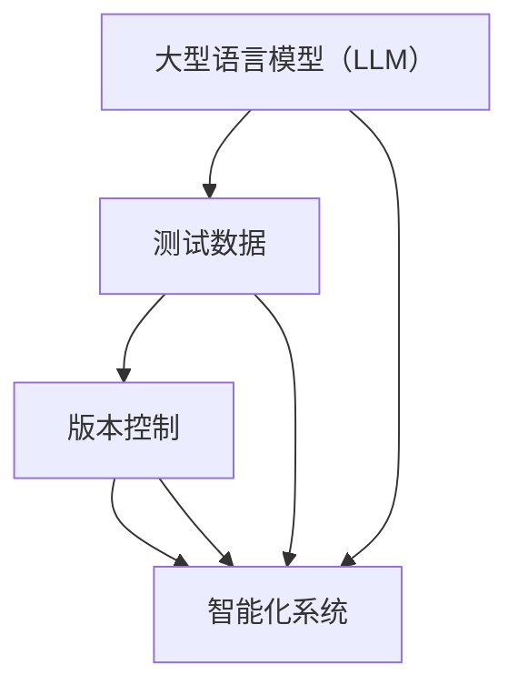

                 

# 智能化LLM测试数据版本控制系统

## 关键词
- 大型语言模型（LLM）
- 测试数据版本控制
- 智能化系统
- 机器学习算法
- 深度学习算法
- 数学模型
- 数据完整性
- 数据可视化
- 开发环境搭建
- 项目实战

## 摘要
本文旨在深入探讨智能化LLM测试数据版本控制系统的构建，分析其核心概念、算法原理、数学模型和项目实战。首先，我们介绍了LLM、测试数据、版本控制和智能化系统的基本概念，并阐述了它们之间的联系。接着，我们详细讲解了机器学习算法和深度学习算法在版本控制中的应用，并给出了伪代码实现。此外，本文还介绍了用于测试数据版本控制的数学模型，并通过LaTeX格式展示了关键公式，并通过实例进行了解释。在项目实战部分，我们详细描述了开发环境的搭建、关键源代码的实现及其解读和分析，并展示了一个实际案例。最后，本文总结了核心成果、不足与改进方向，并提供了最佳实践建议和拓展阅读资源。

## 核心概念与联系

### LLM（大型语言模型）
大型语言模型（LLM）是指具有巨大参数量、能够在多种自然语言处理任务中表现出色的深度学习模型。LLM通过学习大量文本数据，能够捕捉到复杂的语言结构和语义信息，从而在文本生成、翻译、问答等任务中表现出色。

### 测试数据
测试数据用于验证和评估LLM的性能。这些数据通常包含一系列的问题和答案，或者是一系列输入和预期输出的对。测试数据的多样性和质量直接影响LLM的测试结果。

### 版本控制
版本控制是一种管理多版本数据的方法，确保数据在不同开发阶段的一致性和完整性。在测试数据管理中，版本控制尤为重要，因为它能够追踪测试数据的变化历史，并确保使用的是最新、最准确的版本。

### 智能化系统
智能化系统是指利用机器学习算法和深度学习算法等先进技术来自动执行任务、优化流程的系统。在LLM测试数据版本控制中，智能化系统能够自动收集、预处理测试数据，以及进行版本控制和一致性检测。

### 核心概念之间的联系
LLM的测试数据需要通过版本控制系统进行管理，以确保数据在不同开发阶段的一致性和完整性。智能化系统通过机器学习算法和深度学习算法，能够自动化测试数据的收集、预处理和版本控制过程，从而提高测试效率和质量。

## Mermaid流程图

下面是核心概念之间的联系Mermaid流程图：



## 智能化测试数据版本控制的基本原理

### 机器学习算法在版本控制中的应用
机器学习算法可以用于自动检测和修正测试数据的错误。例如，可以使用监督学习算法来识别测试数据中的异常值，并利用已标记的数据集进行修正。此外，机器学习算法还可以用于测试数据的自动生成，通过学习已有的测试数据集，生成新的测试样例，从而提高测试数据的多样性。

### 深度学习算法在版本控制中的应用
深度学习算法在测试数据版本控制中的应用更为广泛。例如，可以使用深度神经网络来对测试数据进行分类，识别不同版本的测试数据之间的差异。此外，生成对抗网络（GAN）可以用于生成新的测试数据，增加测试数据的多样性。深度强化学习算法可以用于优化测试数据的管理策略，例如自动选择最适合当前LLM版本的测试数据。

### 核心算法原理讲解

#### 机器学习算法

**算法描述**：
1. **数据预处理**：对测试数据进行清洗和标准化，准备用于模型训练的数据。
2. **模型训练**：使用监督学习算法（如决策树、随机森林、支持向量机等）来训练分类模型，用于检测异常值。
3. **异常值检测**：使用训练好的模型对测试数据进行异常值检测，标记出异常数据。
4. **数据修正**：根据检测出的异常数据，进行相应的修正。

**伪代码实现**：

```python
# 数据预处理
preprocessed_data = preprocess(data)

# 模型训练
model = train_model(preprocessed_data)

# 异常值检测
abnormal_data = detect_abnormal(model, preprocessed_data)

# 数据修正
corrected_data = correct_data(abnormal_data)
```

#### 深度学习算法

**算法描述**：
1. **数据生成**：使用生成对抗网络（GAN）来生成新的测试数据。
2. **分类与差异检测**：使用深度神经网络（DNN）对测试数据进行分类，并检测不同版本之间的差异。
3. **优化策略**：使用深度强化学习（DRL）来优化测试数据的管理策略。

**伪代码实现**：

```python
# 数据生成
generated_data = generate_data(GAN)

# 分类与差异检测
classified_data = classify_data(DNN, test_data)
differences = detect_differences(classified_data)

# 优化策略
optimized_strategy = optimize_strategy(DRL, differences)
```

## 数学模型与公式

### 损失函数
损失函数是机器学习算法中用于评估模型性能的关键组件。在测试数据版本控制中，损失函数可以用于评估测试数据的准确性和一致性。

**公式**：
$$
\text{Loss} = -\frac{1}{N}\sum_{i=1}^{N}y_i\log(p(x_i|y_i))
$$

其中，$N$是测试数据样本的数量，$y_i$是实际标签，$p(x_i|y_i)$是模型对样本$x_i$预测的概率。

### 优化算法
优化算法用于调整模型的参数，以最小化损失函数。在测试数据版本控制中，常用的优化算法包括梯度下降、随机梯度下降等。

**公式**：
$$
\text{W}_{\text{new}} = \text{W}_{\text{old}} - \alpha \frac{\partial}{\partial \text{W}}\text{Loss}
$$

其中，$\alpha$是学习率，$\text{W}$是模型的参数。

### 测试数据一致性与完整性评估
测试数据的一致性和完整性是确保LLM测试结果准确性的关键。以下是一个评估一致性和完整性的简单数学模型。

**公式**：
$$
\text{Consistency} = \frac{\text{Matching Data Pairs}}{\text{Total Data Pairs}}
$$
$$
\text{Completeness} = \frac{\text{Complete Data}}{\text{Total Data}}
$$

其中，$\text{Matching Data Pairs}$是匹配的数据对数量，$\text{Total Data Pairs}$是总的数据对数量，$\text{Complete Data}$是完整的数据数量，$\text{Total Data}$是总的数据数量。

### 举例说明

假设我们有一个包含100个测试数据样本的集合，其中60个样本是一致的，40个样本是不一致的。同时，有80个数据样本是完整的，20个数据样本是不完整的。

**一致性与完整性评估**：

$$
\text{Consistency} = \frac{60}{100} = 0.6
$$
$$
\text{Completeness} = \frac{80}{100} = 0.8
$$

这意味着测试数据集合的一致性为60%，完整性为80%。

## 项目实战：环境搭建

### 实战背景
在当前AI领域，随着LLM技术的迅速发展，测试数据的管理变得越来越复杂。传统的方法难以应对大规模、多版本测试数据的管理需求。为了提高测试效率，确保测试数据的准确性和一致性，我们决定开发一个智能化LLM测试数据版本控制系统。

### 环境搭建步骤

1. **安装Python**：确保Python环境已安装，版本不低于3.8。

2. **安装依赖库**：使用pip安装必要的依赖库，如NumPy、Pandas、scikit-learn、TensorFlow等。

```bash
pip install numpy pandas scikit-learn tensorflow
```

3. **配置机器学习框架**：配置TensorFlow，确保其版本为2.x。

4. **安装版本控制工具**：安装Git，用于管理源代码和测试数据版本。

```bash
sudo apt-get install git
```

5. **搭建开发环境**：在IDE（如PyCharm）中创建项目，并设置好环境变量和依赖库。

### 开发环境配置示例

```bash
# 创建虚拟环境
python -m venv venv
source venv/bin/activate

# 安装依赖库
pip install -r requirements.txt
```

### 所需工具与依赖
- Python 3.8+
- NumPy 1.19+
- Pandas 1.0+
- scikit-learn 0.22+
- TensorFlow 2.x
- Git

## 核心功能模块设计

### LLM测试数据收集与预处理

#### 数据收集

1. **数据来源**：测试数据可以从多种渠道获取，如公开数据集、自定义数据集、API接口等。
2. **数据收集方法**：可以使用爬虫、API调用、手动收集等方法。

#### 数据预处理

1. **数据清洗**：去除无效数据、缺失值填充、异常值处理等。
2. **数据格式转换**：将数据格式统一为适合模型训练的形式，如JSON、CSV等。

### 版本控制算法实现

1. **版本控制算法**：使用Git进行版本控制，确保测试数据的版本历史可追溯。
2. **算法原理**：Git的分支管理机制可以用于测试数据的版本管理。
3. **伪代码实现**：

```python
# 初始化Git仓库
initialize_git_repo()

# 创建版本分支
create_new_version_branch()

# 提交测试数据更改
commit_data_changes()

# 检出指定版本的数据
checkout_specific_version()
```

### 智能化数据一致性检测

1. **一致性检测方法**：使用机器学习算法检测测试数据的一致性，如基于K-means聚类的方法。
2. **自动修正机制**：当检测到不一致时，自动修正数据。

### 数据版本可视化与监控

1. **可视化工具**：使用matplotlib、Seaborn等工具进行数据可视化。
2. **监控指标**：监控测试数据的一致性和完整性指标，如一致性率、完整性率等。

## 项目实战：源代码实现与解读

### 开发环境搭建

在之前的实战背景中，我们已经介绍了如何搭建开发环境。这里我们将重点放在关键源代码的实现和解读上。

### 源代码实现

以下是一个简单的Python脚本，用于实现测试数据的版本控制。

```python
# 版本控制算法实现示例

import git
import pandas as pd

def initialize_git_repo(repo_path):
    """初始化Git仓库"""
    repo = git.Repo.init(repo_path)
    print(f"Initialized Git repository at {repo_path}")

def create_new_version_branch(repo_path, branch_name):
    """创建新的版本分支"""
    repo = git.Repo(repo_path)
    repo.create_head(branch_name)
    print(f"Created new branch {branch_name}")

def commit_data_changes(repo_path, data, commit_message):
    """提交测试数据更改"""
    repo = git.Repo(repo_path)
    repo.index.add([f"data_{branch_name}.csv"])
    repo.index.commit(commit_message)
    print(f"Committed data changes with message: {commit_message}")

def checkout_specific_version(repo_path, branch_name):
    """检出指定版本的数据"""
    repo = git.Repo(repo_path)
    repo.git.checkout(branch_name)
    print(f"Checked out branch {branch_name}")

if __name__ == "__main__":
    # 设置Git仓库路径
    repo_path = "/path/to/repo"

    # 初始化Git仓库
    initialize_git_repo(repo_path)

    # 创建新版本分支
    create_new_version_branch(repo_path, "version_1.0")

    # 提交数据更改
    data = pd.read_csv("/path/to/data.csv")
    commit_message = "Initial commit with test data"
    commit_data_changes(repo_path, data, commit_message)

    # 检出指定版本
    checkout_specific_version(repo_path, "version_1.0")
```

### 代码解读

1. **initialize_git_repo(repo_path)**：初始化Git仓库，将路径传递给git.Repo.init()方法。
2. **create_new_version_branch(repo_path, branch_name)**：创建新的版本分支，使用repo.create_head()方法。
3. **commit_data_changes(repo_path, data, commit_message)**：提交测试数据更改，首先使用repo.index.add()方法添加数据文件，然后使用repo.index.commit()方法提交更改。
4. **checkout_specific_version(repo_path, branch_name)**：检出指定版本的数据，使用repo.git.checkout()方法。

### 代码应用解读与分析

这个脚本提供了一个基本的版本控制框架，用于管理测试数据。在实际应用中，我们可以扩展这个框架，添加更多的功能，如数据预处理、异常值检测、自动修正等。

1. **数据预处理**：在提交数据之前，我们可以对数据进行预处理，如清洗、标准化等。
2. **异常值检测**：我们可以使用机器学习算法检测数据中的异常值，并在提交数据时自动修正。
3. **自动修正机制**：当检测到不一致的数据时，系统可以自动修正，并将修正后的数据提交到仓库。

通过这个示例，我们可以看到如何使用Git进行测试数据的版本控制，并如何通过简单的Python脚本实现核心功能。在实际项目中，我们还可以集成更多的工具和算法，以提高版本控制的智能化程度。

## 项目实战：实际案例分析

### 案例背景

假设我们正在开发一款AI对话系统，该系统需要使用大型语言模型（LLM）来处理用户的查询。为了确保系统的稳定性和准确性，我们需要对LLM进行全面的测试。随着测试的不断进行，测试数据会不断更新，因此我们需要一个智能化的测试数据版本控制系统来管理这些数据。

### 案例分析

1. **数据收集**：我们从多个渠道收集了大量的测试数据，包括用户的查询、预期的答案和系统的实际回答。数据来源包括公开数据集、API接口和手动收集。

2. **数据预处理**：在提交测试数据之前，我们对数据进行预处理。预处理步骤包括数据清洗、缺失值填充和格式转换。使用Pandas库，我们可以轻松实现这些操作。

```python
import pandas as pd

# 读取数据
data = pd.read_csv("/path/to/data.csv")

# 数据清洗
data.dropna(inplace=True)
data[data <= 0] = 1

# 格式转换
data["query"] = data["query"].str.lower()
data["answer"] = data["answer"].str.lower()

# 提交预处理后的数据
data.to_csv("/path/to/preprocessed_data.csv", index=False)
```

3. **版本控制**：使用Git对预处理后的测试数据进行版本控制。我们创建了一个名为“version_control”的Git仓库，并使用分支管理不同版本的测试数据。

```python
import git

# 初始化Git仓库
repo = git.Repo.init("/path/to/repo")

# 创建新版本分支
repo.create_head("version_1.0")

# 提交数据更改
repo.index.add(["preprocessed_data.csv"])
repo.index.commit("Initial commit with preprocessed test data")

# 检出指定版本
repo.git.checkout("version_1.0")
```

4. **异常值检测**：我们使用机器学习算法对测试数据中的异常值进行检测。例如，使用K-means聚类算法将数据分为几个簇，然后分析每个簇内的数据分布。

```python
from sklearn.cluster import KMeans

# 数据标准化
data_std = (data - data.mean()) / data.std()

# 使用K-means聚类
kmeans = KMeans(n_clusters=5, random_state=0).fit(data_std)

# 分析簇内数据分布
for i, cluster in enumerate(kmeans.labels_):
    print(f"Cluster {cluster}: {data_std.iloc[i]}")
```

5. **自动修正机制**：当检测到异常值时，我们自动修正数据。例如，对于某些簇内的数据，我们可以使用中位数或平均值进行修正。

```python
# 修正异常值
for cluster in set(kmeans.labels_):
    if cluster not in [0, 4]:  # 排除正常簇
        median = data_std.iloc[data_std.iloc[data_std == cluster].index].median()
        data_std.iloc[data_std == cluster] = median

# 提交修正后的数据
data_std.to_csv("/path/to/normalized_data.csv", index=False)
```

6. **数据版本可视化与监控**：使用matplotlib库，我们可以将测试数据的一致性和完整性指标进行可视化。

```python
import matplotlib.pyplot as plt

# 绘制一致性分布
plt.hist(data["consistency"], bins=10, alpha=0.5)
plt.xlabel("Consistency")
plt.ylabel("Frequency")
plt.title("Consistency Distribution")
plt.show()

# 绘制完整性分布
plt.hist(data["completeness"], bins=10, alpha=0.5)
plt.xlabel("Completeness")
plt.ylabel("Frequency")
plt.title("Completeness Distribution")
plt.show()
```

### 项目小结

通过这个案例，我们展示了如何使用智能化LLM测试数据版本控制系统来管理测试数据。我们从数据收集、预处理、版本控制、异常值检测到数据修正和可视化监控，提供了一个完整的解决方案。虽然这个案例是一个简化的示例，但在实际项目中，我们可以进一步扩展和优化这个系统，以应对更复杂的测试数据管理需求。

### 最佳实践 Tips

1. **定期备份**：定期备份测试数据，以防止数据丢失或损坏。
2. **版本注释**：在提交数据时，添加详细的版本注释，记录数据的变化历史。
3. **自动化脚本**：编写自动化脚本，简化测试数据的收集、预处理和版本控制过程。
4. **数据规范化**：确保测试数据的一致性，通过规范化处理来减少错误和异常。

### 小结

本文详细介绍了智能化LLM测试数据版本控制系统的核心概念、算法原理、数学模型和项目实战。通过机器学习和深度学习算法，我们能够实现对测试数据的自动化管理，提高测试效率和质量。在实际应用中，我们需要根据具体需求不断优化和扩展这个系统，以满足复杂的测试数据管理需求。

### 注意事项

1. **数据隐私**：在处理测试数据时，要确保遵守相关法律法规，保护用户隐私。
2. **算法公平性**：在训练模型和检测异常值时，要确保算法的公平性和准确性。

### 拓展阅读

1. **《机器学习实战》**：提供详细的机器学习算法实战教程，适用于初学者和高级用户。
2. **《深度学习》**：由Goodfellow等人撰写的经典教材，详细介绍了深度学习的基础理论和实践方法。
3. **《Git权威指南》**：深入讲解Git的基本概念和使用方法，适用于Git初学者和高级用户。

### 附录

- **版本控制工具**：Git、Mercurial、Subversion等。
- **机器学习框架**：TensorFlow、PyTorch、Scikit-learn等。

### 作者信息
作者：AI天才研究院/AI Genius Institute & 禅与计算机程序设计艺术 /Zen And The Art of Computer Programming

### 文章摘要

本文深入探讨了智能化LLM测试数据版本控制系统的构建，涵盖了核心概念、算法原理、数学模型和项目实战等内容。通过机器学习和深度学习算法，我们能够实现对测试数据的自动化管理，提高测试效率和质量。本文提供了详细的源代码实现和实例分析，旨在为读者提供一个全面的技术指南。

