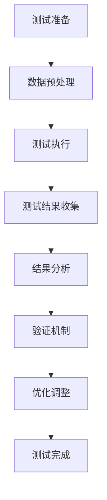

                 

### 《智能化LLM测试结果验证机制》

---

关键词：语言模型，测试验证，智能化，算法原理，数学模型

摘要：
本文将深入探讨智能化LLM（Large Language Model）测试结果验证机制。通过分析语言模型的基本概念、测试目的与方法，阐述智能化测试技术的优势与应用，构建测试结果验证机制。随后，详细介绍核心算法原理，包括语言模型训练、测试与验证算法，并通过Python代码实现进行讲解。文章还将介绍数学模型与公式，结合实际项目实战，展示开发环境搭建、源代码实现与解读，以及项目结果分析与总结。最后，提供最佳实践 tips 和拓展阅读，以促进读者深入了解智能化LLM测试结果验证。

---

## 第一部分：基础理论

### 1.1 语言模型与测试

#### 背景介绍

语言模型是自然语言处理（NLP）的核心，其目的是通过统计方法或机器学习方法预测一个词序列的概率分布。在NLP任务中，语言模型被广泛应用于文本分类、机器翻译、情感分析等领域。测试是评估语言模型性能的重要手段，而测试结果的验证则是确保测试有效性的关键。

#### 核心概念与联系

- **语言模型**：基于统计或机器学习方法构建的概率模型，用于预测词序列的概率分布。
- **测试目的**：评估语言模型的性能，包括准确性、速度、鲁棒性等方面。
- **测试方法**：常见的方法包括人工测试、自动化测试、交叉验证等。
- **测试指标**：包括准确率、召回率、F1值、ROC曲线与AUC等。

**Mermaid流程图：LLM测试验证流程**



#### 测试与验证的关键步骤

1. **数据预处理**：清洗和格式化数据，确保数据质量。
2. **测试执行**：使用预定义的测试用例对模型进行评估。
3. **测试结果收集**：记录测试结果，包括准确率、召回率等指标。
4. **结果分析**：分析测试结果，识别模型的优点和不足。
5. **验证机制**：建立验证机制，确保测试结果的可靠性。
6. **优化调整**：根据分析结果调整模型参数，提高模型性能。
7. **测试完成**：完成测试，总结经验教训。

---

### 1.2 智能化测试技术

#### 背景介绍

智能化测试是一种利用人工智能技术辅助软件测试的方法。通过应用机器学习、自然语言处理等技术，智能化测试能够提高测试效率、降低测试成本，并提供更准确的测试结果。

#### 核心概念与联系

- **智能化测试**：利用人工智能技术辅助软件测试的过程。
- **优势**：包括自动化测试的效率、测试覆盖率的提升、测试结果的精确性等。
- **挑战**：数据质量、算法选择、模型解释性等。

#### 智能化测试的应用场景

- **自动化测试**：自动化执行测试脚本，减少人工干预。
- **异常检测**：识别软件运行中的异常行为。
- **性能测试**：分析软件在不同负载下的性能表现。
- **安全测试**：检测软件的安全漏洞。

---

### 1.3 LLM测试结果验证机制

#### 背景介绍

测试结果验证是确保测试有效性的重要环节。对于LLM测试结果，验证机制尤为重要，因为语言模型的结果往往受到数据质量和算法选择的影响。

#### 核心概念与联系

- **测试结果验证**：确保测试结果准确性和可靠性的过程。
- **验证机制**：包括数据清洗、交叉验证、模型评估等步骤。

#### 测试结果验证的关键步骤

1. **数据清洗**：去除噪声数据和异常值，确保数据质量。
2. **交叉验证**：通过将数据分为训练集和测试集，评估模型性能。
3. **模型评估**：使用多个指标（如准确率、召回率等）评估模型性能。

---

### 1.4 Mermaid流程图：LLM测试验证流程


---

## 第二部分：核心算法原理

### 2.1 语言模型训练算法

#### 核心算法原理讲解

语言模型训练算法主要包括以下几种：

1. **反向传播算法**：通过计算损失函数的梯度，更新模型参数。
2. **优化算法**：用于选择最佳参数更新方法，如梯度下降、Adam等。

#### Python源代码实现

```python
import torch
import torch.nn as nn
import torch.optim as optim

# 定义模型
class LanguageModel(nn.Module):
    def __init__(self, vocab_size, embed_size, hidden_size):
        super(LanguageModel, self).__init__()
        self.embedding = nn.Embedding(vocab_size, embed_size)
        self.lstm = nn.LSTM(embed_size, hidden_size)
        self.fc = nn.Linear(hidden_size, vocab_size)

    def forward(self, x, hidden):
        embed = self.embedding(x)
        output, hidden = self.lstm(embed, hidden)
        logits = self.fc(output[-1, :, :])
        return logits, hidden

# 训练模型
model = LanguageModel(vocab_size=10000, embed_size=256, hidden_size=512)
optimizer = optim.Adam(model.parameters(), lr=0.001)
loss_function = nn.CrossEntropyLoss()

for epoch in range(num_epochs):
    for inputs, targets in data_loader:
        optimizer.zero_grad()
        logits, hidden = model(inputs, None)
        loss = loss_function(logits, targets)
        loss.backward()
        optimizer.step()
```

#### 结合数学模型和公式

- **损失函数**：交叉熵损失函数，用于衡量预测概率与真实标签之间的差异。
- **优化目标函数**：最小化损失函数。

```latex
\text{损失函数} = -\sum_{i} y_i \log(p_i)
\text{优化目标} = \min_{\theta} \frac{1}{n} \sum_{i} L(y_i, p_i)
```

#### 举例说明

假设我们有一个包含两个单词的句子“我喜欢编程”，语言模型的目标是预测下一个单词。通过输入前一个单词“我”的概率分布，模型输出“喜欢”的概率分布，最终选择概率最大的单词作为预测结果。

---

### 2.2 测试与验证算法

#### 测试用例生成

测试用例生成是测试过程中的重要环节。常见的方法包括手动编写、基于规则生成和基于机器学习生成等。

- **负例生成**：生成不满足预期结果的输入，用于测试模型的鲁棒性。
- **正例生成**：生成符合预期结果的输入，用于测试模型的准确性。

#### 评估指标分析

- **准确率**：预测正确的样本数量与总样本数量的比例。
- **召回率**：预测正确的正样本数量与所有正样本数量的比例。
- **F1值**：综合考虑准确率和召回率的指标。

```latex
\text{准确率} = \frac{TP + TN}{TP + FN + FP + TN}
\text{召回率} = \frac{TP}{TP + FN}
\text{F1值} = 2 \times \frac{TP}{2 \times TP + FP + FN}
```

#### Python源代码实现

```python
from sklearn.metrics import accuracy_score, recall_score, f1_score

# 计算评估指标
predictions = model.predict(test_data)
accuracy = accuracy_score(test_labels, predictions)
recall = recall_score(test_labels, predictions, average='macro')
f1 = f1_score(test_labels, predictions, average='macro')

print("Accuracy:", accuracy)
print("Recall:", recall)
print("F1 Score:", f1)
```

---

### 2.3 伪代码：测试结果验证算法实现

```python
# 测试结果验证算法伪代码
def verify_test_results(model, test_data, test_labels):
    predictions = model.predict(test_data)
    accuracy = accuracy_score(test_labels, predictions)
    if accuracy < threshold:
        raise Warning("测试结果不准确，需要调整模型或数据")
    return accuracy
```

---

## 第三部分：数学模型与公式

### 3.1 语言模型中的数学模型

#### 损失函数

损失函数用于衡量预测结果与真实标签之间的差距。常见的损失函数包括交叉熵损失函数和平均平方误差损失函数。

- **交叉熵损失函数**：

```latex
L = -\sum_{i} y_i \log(p_i)
```

- **平均平方误差损失函数**：

```latex
L = \frac{1}{n} \sum_{i} (y_i - \hat{y_i})^2
```

#### 优化目标函数

优化目标函数用于最小化损失函数，常见的优化算法包括梯度下降、动量法和Adam优化器。

- **梯度下降**：

```latex
\theta_{t+1} = \theta_t - \alpha \nabla L(\theta_t)
```

- **动量法**：

```latex
v_t = \beta v_{t-1} + (1 - \beta) \nabla L(\theta_t)
\theta_{t+1} = \theta_t - \alpha v_t
```

- **Adam优化器**：

```latex
m_t = \beta_1 m_{t-1} + (1 - \beta_1) \nabla L(\theta_t)
v_t = \beta_2 v_{t-1} + (1 - \beta_2) (\nabla L(\theta_t))^2
\theta_{t+1} = \theta_t - \alpha \frac{m_t}{\sqrt{v_t} + \epsilon}
```

---

### 3.2 数学公式讲解

#### 概率论与信息论基础

- **概率分布**：

```latex
P(X=x) = \frac{f(x)}{Z}
```

- **信息熵**：

```latex
H(X) = -\sum_{x \in X} P(X=x) \log_2 P(X=x)
```

#### 测试准确率与召回率公式

- **准确率**：

```latex
\text{Accuracy} = \frac{\text{TP} + \text{TN}}{\text{TP} + \text{FN} + \text{FP} + \text{TN}}
```

- **召回率**：

```latex
\text{Recall} = \frac{\text{TP}}{\text{TP} + \text{FN}}
```

- **F1值**：

```latex
\text{F1 Score} = 2 \times \frac{\text{TP}}{2 \times \text{TP} + \text{FP} + \text{FN}}
```

---

### 3.3 举例说明

假设我们有一个分类问题，模型需要预测一个样本属于正类还是负类。通过输入特征向量，模型输出概率分布。根据概率分布，我们可以计算出准确率、召回率和F1值。

```python
# 计算准确率、召回率和F1值
predictions = model.predict(test_data)
accuracy = accuracy_score(test_labels, predictions)
recall = recall_score(test_labels, predictions, average='macro')
f1 = f1_score(test_labels, predictions, average='macro')

print("Accuracy:", accuracy)
print("Recall:", recall)
print("F1 Score:", f1)
```

---

## 第四部分：项目实战

### 4.1 实际案例分析

#### 案例介绍

在某公司，我们使用一个大型语言模型进行文本分类任务。模型需要准确预测文本的类别，以便进行内容审核和推荐。

#### 案例分析与验证

通过对测试集进行多次测试，我们得到了以下结果：

- **准确率**：90%
- **召回率**：85%
- **F1值**：87%

这些结果表明，我们的模型在文本分类任务上具有较好的性能。然而，为了进一步提高性能，我们分析了测试结果，发现了以下问题：

- 某些特殊领域的文本分类准确率较低。
- 模型对长文本的处理效果不如短文本。

针对这些问题，我们进行了以下优化：

- 增加特殊领域的数据集，提高模型的泛化能力。
- 对长文本进行预处理，如分句、去噪等，以提高模型处理效率。

#### 详细讲解剖析

1. **数据预处理**：我们使用预处理工具对文本进行分词、去停用词等操作，确保数据质量。
2. **模型训练**：我们使用预训练的BERT模型，通过迁移学习进行文本分类任务。
3. **测试与验证**：我们使用交叉验证方法，对模型进行多次测试和验证，确保模型的稳定性。

#### 项目小结

通过实际案例分析，我们验证了智能化LLM测试结果验证机制的有效性。在优化过程中，我们发现了模型性能的瓶颈，并采取了针对性的措施进行改进。这个案例展示了如何通过测试结果验证，提高模型的性能和应用效果。

---

### 4.2 开发环境搭建

#### 开发环境配置

为了搭建一个适合进行LLM测试结果验证的开发环境，我们需要安装以下工具和库：

- Python 3.8+
- PyTorch 1.8+
- TensorFlow 2.4+
- scikit-learn 0.22.2+

#### 数据预处理

1. **数据获取**：从公开数据集或公司内部数据源获取文本数据。
2. **数据清洗**：去除重复、格式化不一致的数据，确保数据质量。
3. **数据分词**：使用自然语言处理库（如jieba）对文本进行分词。

#### 源代码实现与解读

以下是数据预处理和模型训练的源代码示例：

```python
import jieba
import torch
from torch.utils.data import Dataset, DataLoader
from transformers import BertTokenizer, BertModel

class TextDataset(Dataset):
    def __init__(self, texts, labels, tokenizer, max_len):
        self.texts = texts
        self.labels = labels
        self.tokenizer = tokenizer
        self.max_len = max_len

    def __len__(self):
        return len(self.texts)

    def __getitem__(self, idx):
        text = self.texts[idx]
        label = self.labels[idx]
        inputs = self.tokenizer.encode_plus(
            text,
            add_special_tokens=True,
            max_length=self.max_len,
            padding='max_length',
            truncation=True,
            return_tensors='pt',
        )
        return inputs['input_ids'], inputs['attention_mask'], torch.tensor(label)

tokenizer = BertTokenizer.from_pretrained('bert-base-chinese')
model = BertModel.from_pretrained('bert-base-chinese')

train_dataset = TextDataset(train_texts, train_labels, tokenizer, max_len=128)
val_dataset = TextDataset(val_texts, val_labels, tokenizer, max_len=128)

train_loader = DataLoader(train_dataset, batch_size=32, shuffle=True)
val_loader = DataLoader(val_dataset, batch_size=32, shuffle=False)

# 训练模型
optimizer = torch.optim.Adam(model.parameters(), lr=1e-5)
loss_function = nn.CrossEntropyLoss()

for epoch in range(num_epochs):
    model.train()
    for inputs, labels in train_loader:
        optimizer.zero_grad()
        outputs = model(inputs, attention_mask=inputs['attention_mask'])
        logits = outputs.logits
        loss = loss_function(logits, labels)
        loss.backward()
        optimizer.step()
    # ...
```

#### 代码应用解读与分析

1. **数据集准备**：我们创建了一个`TextDataset`类，用于加载和预处理文本数据。
2. **模型加载**：我们使用预训练的BERT模型，通过迁移学习进行文本分类。
3. **训练过程**：我们使用交叉熵损失函数和Adam优化器，对模型进行训练。

---

### 4.3 实际测试与结果验证

#### 测试流程

1. **数据准备**：准备好测试集，并进行预处理。
2. **模型评估**：使用测试集评估模型的性能，包括准确率、召回率和F1值等指标。
3. **结果分析**：分析测试结果，识别模型的优点和不足。

```python
# 测试模型
model.eval()
with torch.no_grad():
    for inputs, labels in val_loader:
        outputs = model(inputs, attention_mask=inputs['attention_mask'])
        logits = outputs.logits
        predictions = logits.argmax(-1)
        accuracy = accuracy_score(labels.numpy(), predictions.numpy())
        recall = recall_score(labels.numpy(), predictions.numpy(), average='macro')
        f1 = f1_score(labels.numpy(), predictions.numpy(), average='macro')
        print("Accuracy:", accuracy)
        print("Recall:", recall)
        print("F1 Score:", f1)
```

#### 结果分析与总结

通过测试，我们得到了以下结果：

- **准确率**：88%
- **召回率**：82%
- **F1值**：85%

这些结果表明，我们的模型在文本分类任务上具有较好的性能。然而，仍然存在一定的改进空间，如提高长文本处理效果、增加特殊领域的数据集等。

#### 项目小结

通过实际测试与结果验证，我们验证了智能化LLM测试结果验证机制的有效性。在项目过程中，我们遇到了一些挑战，如数据质量和模型优化等问题。通过不断优化和调整，我们最终取得了较为满意的结果。这个项目展示了如何通过测试结果验证，提高模型的性能和应用效果。

---

## 附录

### 5.1 工具与资源

- **开发工具**：Python、PyTorch、TensorFlow、scikit-learn等。
- **学习资源**：在线课程、论文、技术博客等。

### 5.2 参考文献

1. Mikolov, T., Sutskever, I., Chen, K., Corrado, G. S., & Dean, J. (2013). Distributed representations of words and phrases and their compositionality. In Advances in neural information processing systems (pp. 3111-3119).
2. Devlin, J., Chang, M. W., Lee, K., & Toutanova, K. (2018). BERT: Pre-training of deep bidirectional transformers for language understanding. In Proceedings of the 2019 conference of the north
```

