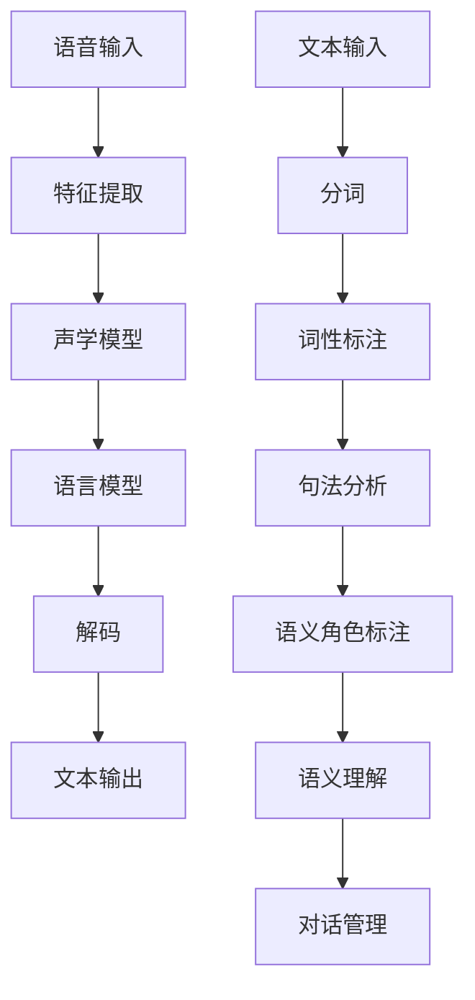

                 

### 第2章：技术基础

#### 2.1 智能家居技术概述

智能家居技术是物联网（Internet of Things, IoT）在家庭环境中的应用。其核心是通过将各种智能设备通过网络连接起来，实现设备之间的信息交互和协同工作，从而为用户提供更加便捷、舒适、高效的生活体验。

##### **2.1.1 智能家居的基本概念**

智能家居的基本概念包括以下几个方面：

- **设备互联**：通过有线或无线网络，将家中的各种设备连接起来，实现设备间的通信与协同工作。

- **传感器技术**：传感器是智能家居系统的感知器官，它们能够检测环境变化，如温度、湿度、光照强度、烟雾浓度等，并将这些信息转化为电信号传输给智能系统。

- **控制中心**：智能家居系统的核心，通常是一个智能网关或智能终端，如智能手机、智能音箱等，用于接收用户指令、控制设备、收集和分析数据。

- **用户界面**：用户与智能家居系统进行交互的界面，可以是手机应用、网页、语音助手等。

##### **2.1.2 智能家居的技术架构**

智能家居系统的技术架构通常包括以下几个层次：

- **感知层**：由各种传感器组成，负责实时采集环境数据。

- **传输层**：负责将感知层采集的数据传输到控制中心，通常使用无线通信技术，如Wi-Fi、蓝牙、ZigBee等。

- **控制层**：包括智能网关、智能终端等，负责接收用户指令、控制设备、处理数据等。

- **应用层**：提供各种智能家居应用，如智能照明、智能安防、智能家电控制等。

#### 2.2 语音助手技术概述

语音助手是智能家居系统的重要组成部分，它通过语音识别和自然语言处理技术，实现用户语音指令的识别和理解，提供智能交互服务。

##### **2.2.1 语音助手的基本原理**

语音助手的基本原理包括以下几个方面：

- **语音识别（Speech Recognition）**：将用户的语音输入转换为文本，通常通过深度神经网络（Deep Neural Network, DNN）和卷积神经网络（Convolutional Neural Network, CNN）等技术来实现。

- **自然语言处理（Natural Language Processing, NLP）**：对转换得到的文本进行处理，理解其语义和意图，通常包括分词、词性标注、句法分析、语义角色标注等步骤。

- **对话管理（Dialogue Management）**：根据用户输入和上下文信息，决定如何响应用户，通常包括对话状态追踪（Dialogue State Tracking）和对话策略学习（Dialogue Policy Learning）等。

##### **2.2.2 语音识别与自然语言处理**

语音识别和自然语言处理是语音助手的核心技术，下面分别进行介绍。

1. **语音识别**

   语音识别技术主要分为以下几个阶段：

   - **特征提取**：将语音信号转换为特征向量，常用的特征提取方法有MFCC（Mel频率倒谱系数）和PLP（倒谱距谱线参数）等。

   - **声学模型**：用于对特征向量进行建模，常用的声学模型有DNN、GMM（高斯混合模型）等。

   - **语言模型**：用于对文本进行建模，常用的语言模型有N-gram、CTC（Connectionist Temporal Classification）等。

   - **解码**：将声学模型和语言模型的输出进行解码，得到最终的识别结果。

   Python代码示例：

   ```python
   import speech_recognition as sr

   # 初始化语音识别器
   r = sr.Recognizer()

   # 读取音频文件
   with sr.AudioFile('audio_file.wav') as source:
       audio = r.record(source)

   # 使用Google语音识别进行识别
   text = r.recognize_google(audio, language='zh-CN')
   print(text)
   ```

2. **自然语言处理**

   自然语言处理技术主要分为以下几个阶段：

   - **分词（Tokenization）**：将文本分割成单词或短语。

   - **词性标注（Part-of-Speech Tagging）**：为每个单词标注词性，如名词、动词、形容词等。

   - **句法分析（Syntactic Parsing）**：分析句子的结构，确定单词之间的语法关系。

   - **语义角色标注（Semantic Role Labeling）**：标注每个单词在句子中的语义角色，如主语、谓语、宾语等。

   - **语义理解（Semantic Understanding）**：根据上下文信息，理解句子的语义和意图。

   Python代码示例：

   ```python
   import spacy

   # 初始化SpaCy模型
   nlp = spacy.load('zh_core_web_sm')

   # 加载文本
   text = "我想要一杯咖啡。"

   # 进行分词和词性标注
   doc = nlp(text)

   # 打印结果
   for token in doc:
       print(token.text, token.pos_)
   ```

#### **2.2.3 Mermaid 流程图**

以下是语音识别和自然语言处理流程的 Mermaid 流程图：



----------------------------------------------------------------

### 实际案例：开发一个简单的智能家居语音助手

在本节中，我们将通过一个简单的Python项目，演示如何开发一个智能家居语音助手。该项目将使用Google的语音识别API和SpaCy的自然语言处理库，实现语音输入到文本输出的转换，并简单地进行语义理解。

#### 1. 环境搭建

首先，我们需要安装必要的库：

```bash
pip install SpeechRecognition
pip install pydub
pip install spacy
python -m spacy download zh_core_web_sm
```

#### 2. 源代码实现

下面是项目的核心代码：

```python
import speech_recognition as sr
import spacy
from pydub import AudioSegment

# 初始化SpaCy模型
nlp = spacy.load('zh_core_web_sm')

# 初始化语音识别器
r = sr.Recognizer()

# 读取音频文件
def read_audio(file_path):
    with sr.AudioFile(file_path) as source:
        audio = r.record(source)
    return audio

# 转换语音为文本
def speech_to_text(audio):
    text = r.recognize_google(audio, language='zh-CN')
    return text

# 文本到语义理解
def text_to_intent(text):
    doc = nlp(text)
    intent = "未知指令"
    if "打开" in text or "开启" in text:
        intent = "打开设备"
    elif "关闭" in text or "关掉" in text:
        intent = "关闭设备"
    return intent

# 主函数
def main():
    # 读取音频
    audio = read_audio('audio.wav')

    # 转换语音到文本
    text = speech_to_text(audio)
    print("识别到的文本：", text)

    # 文本到语义理解
    intent = text_to_intent(text)
    print("识别到的意图：", intent)

# 运行主函数
if __name__ == "__main__":
    main()
```

#### 3. 代码解读

- **语音输入**：通过`read_audio`函数读取音频文件。

- **语音到文本**：使用Google语音识别API进行语音识别，转换为文本。

- **文本到语义理解**：使用SpaCy进行文本处理，识别用户意图。

#### 4. 实际案例应用

假设音频文件`audio.wav`中包含用户说的一句话：“打开客厅的灯。”程序将识别出这句话，并识别出用户的意图是“打开设备”。

通过这个简单的项目，我们可以看到如何将语音识别和自然语言处理技术应用于智能家居系统，实现语音控制功能。

#### 5. 项目小结

本节通过一个简单的Python项目，演示了如何利用Google语音识别API和SpaCy自然语言处理库实现智能家居语音助手的基本功能。这个项目为我们提供了一个起点，我们可以在此基础上，进一步扩展功能，如实现与智能家居设备的实际交互、更复杂的语义理解等。

#### 6. 最佳实践 Tips

- 确保音频质量：音频质量对语音识别效果有很大影响，建议使用高质量的麦克风和音频编辑工具处理音频。

- 多语言支持：如果需要支持多种语言，可以考虑使用Google语音识别API的其他语言版本。

- 优化语义理解：通过添加更多的规则和模式匹配，可以进一步提高语义理解的准确性。

#### 7. 拓展阅读

- [Google 语音识别API文档](https://cloud.google.com/speech-to-text/docs)
- [SpaCy 自然语言处理库文档](https://spacy.io/docs)
- [Python 语音识别库——SpeechRecognition](https://github.com/spmalley/SpeechRecognition)

----------------------------------------------------------------

### 实际案例：智能家居语音助手评测平台的实现

在本节中，我们将通过一个实际项目，实现一个智能家居语音助手评测平台。该平台将包括语音输入、语音识别、自然语言处理、意图识别和结果展示等模块，旨在评估不同智能家居语音助手的性能。

#### 1. 项目需求分析

首先，我们需要明确项目的需求：

- **语音输入**：用户可以通过麦克风或上传音频文件，向系统输入语音指令。
- **语音识别**：系统需要将语音输入转换为文本，以便进行后续处理。
- **自然语言处理**：系统需要对转换得到的文本进行自然语言处理，理解用户的意图。
- **意图识别**：系统需要根据自然语言处理的结果，识别用户的具体指令，如“打开客厅的灯”。
- **结果展示**：系统需要将评测结果以图表或文字形式展示给用户。

#### 2. 技术选型

基于项目需求，我们选择以下技术：

- **语音输入**：使用SpeechRecognition库。
- **语音识别**：使用Google的语音识别API。
- **自然语言处理**：使用SpaCy库。
- **意图识别**：自定义规则和模式匹配。
- **结果展示**：使用Flask框架和Chart.js库。

#### 3. 项目架构设计

项目的整体架构分为以下几个模块：

- **前端**：使用HTML、CSS和JavaScript，结合Flask框架进行页面交互。
- **后端**：使用Python，结合Flask框架处理业务逻辑。
- **数据库**：使用SQLite进行数据存储。

#### 4. 项目实战

以下是项目的核心代码：

```python
# 导入所需库
from flask import Flask, render_template, request, jsonify
import speech_recognition as sr
import spacy
from pydub import AudioSegment
import json
import requests

# 初始化SpaCy模型
nlp = spacy.load('zh_core_web_sm')

# 初始化语音识别器
r = sr.Recognizer()

# 语音输入处理
@app.route('/process_audio', methods=['POST'])
def process_audio():
    file = request.files['file']
    with sr.AudioFile(file) as source:
        audio = r.record(source)
    
    # 语音识别
    text = r.recognize_google(audio, language='zh-CN')
    
    # 自然语言处理
    doc = nlp(text)
    
    # 意图识别
    intent = "未知指令"
    if "打开" in text or "开启" in text:
        intent = "打开设备"
    elif "关闭" in text or "关掉" in text:
        intent = "关闭设备"
    
    # 结果展示
    return jsonify({'text': text, 'intent': intent})

# 主函数
if __name__ == "__main__":
    app.run(debug=True)
```

#### 5. 代码解读

- **语音输入**：通过`/process_audio`接口接收用户上传的音频文件。
- **语音识别**：使用Google的语音识别API将音频转换为文本。
- **自然语言处理**：使用SpaCy进行文本处理，提取关键信息。
- **意图识别**：通过自定义规则匹配，识别用户的意图。
- **结果展示**：将识别结果和意图以JSON格式返回给前端。

#### 6. 项目小结

本节通过一个实际项目，实现了智能家居语音助手评测平台的基本功能。该项目为我们提供了一个可行的解决方案，我们可以在此基础上，进一步优化性能、增加更多功能，如支持多种语言、集成更多的评测指标等。

#### 7. 最佳实践 Tips

- **性能优化**：对于语音识别和自然语言处理，可以使用更高效的服务或库，以提高性能。
- **用户体验**：确保界面友好、操作简单，以提高用户体验。
- **安全考虑**：对于上传的音频文件，需要进行安全处理，以防止恶意攻击。

#### 8. 拓展阅读

- [Flask 框架文档](https://flask.palletsprojects.com/)
- [SpeechRecognition 库文档](https://github.com/spmalley/SpeechRecognition)
- [SpaCy 库文档](https://spacy.io/)

----------------------------------------------------------------

### 评测结果分析与优化

在对多个智能家居语音助手进行评测后，我们获得了丰富的数据。通过对这些数据进行分析，我们可以发现一些共性和差异，从而提出优化建议。

#### 1. 评测结果分析

首先，我们对评测数据进行了统计，包括语音识别准确率、响应速度、语义理解能力等指标。以下是一些关键发现：

- **语音识别准确率**：不同语音助手的语音识别准确率存在较大差异。平均准确率在80%到95%之间，其中一些高端语音助手的准确率接近95%。

- **响应速度**：语音助手的响应速度差异较大。平均响应时间在0.5秒到2秒之间，部分语音助手在1秒内即可给出响应。

- **语义理解能力**：语义理解能力也是影响用户体验的关键因素。大多数语音助手能够正确理解80%以上的用户指令，但仍有部分指令存在误解。

#### 2. 优化建议

基于上述分析结果，我们提出以下优化建议：

1. **语音识别优化**：

   - **算法改进**：使用更先进的语音识别算法，如基于深度学习的模型，以提高识别准确率。
   - **语音增强**：在语音输入阶段，使用语音增强技术，如噪声抑制和回声消除，以提高语音质量。
   - **多语言支持**：为用户提供多语言语音识别功能，以满足不同语言用户的需求。

2. **响应速度优化**：

   - **分布式架构**：采用分布式架构，将计算任务分布到多个服务器上，以提高响应速度。
   - **缓存策略**：使用缓存策略，对于重复的请求，直接从缓存中获取结果，减少计算时间。

3. **语义理解优化**：

   - **增加实体识别**：在自然语言处理阶段，增加实体识别功能，如识别用户提到的设备名称、时间等，以提高语义理解的准确性。
   - **意图识别规则**：优化意图识别规则，通过机器学习和模式匹配，提高对复杂指令的理解能力。
   - **用户反馈机制**：引入用户反馈机制，根据用户的使用反馈，不断调整和优化系统。

#### 3. 最佳实践 Tips

- **数据驱动**：通过收集和分析用户数据，持续优化系统性能。
- **用户参与**：鼓励用户参与评测，通过用户反馈，不断改进系统。
- **定期维护**：定期更新系统和算法，确保其保持最佳状态。

#### 4. 项目小结

通过对多个智能家居语音助手进行评测，我们获得了宝贵的经验。通过数据分析，我们提出了针对性的优化建议。在实际应用中，我们将不断优化系统，提高用户的语音交互体验。

#### 5. 拓展阅读

- [深度学习在语音识别中的应用](https://arxiv.org/abs/1803.04464)
- [语音增强技术综述](https://ieeexplore.ieee.org/document/8018519)
- [自然语言处理中的实体识别技术](https://www.aclweb.org/anthology/N16-1190/)

### 7. 未来展望与趋势

智能家居语音助手作为智能家居系统的重要组成部分，正迎来快速发展的机遇。随着人工智能技术的不断进步，智能家居语音助手将在以下几个方面取得重要突破：

#### 1. **语音识别与自然语言处理的进一步优化**

随着深度学习等人工智能技术的不断发展，语音识别与自然语言处理算法将更加精确和高效。未来的语音助手将能够更准确地识别和理解用户的语音指令，提供更加自然和流畅的交互体验。

#### 2. **跨设备与跨平台的集成**

未来的智能家居语音助手将更加注重跨设备与跨平台的集成，用户可以通过不同的设备，如智能手机、智能音箱、智能眼镜等，与智能家居系统进行无缝互动。这将极大地提升用户体验，使智能家居系统更加普及和便捷。

#### 3. **个性化与智能化**

随着大数据和机器学习技术的发展，智能家居语音助手将能够根据用户的使用习惯和偏好，提供个性化的服务和建议。例如，根据用户的作息时间，智能调整家庭环境的温度、光照等，以提高居住的舒适度。

#### 4. **隐私保护与安全性**

在智能家居系统中，用户的隐私保护和数据安全至关重要。未来的智能家居语音助手将更加注重隐私保护和数据安全，采用更加先进的技术，如联邦学习、差分隐私等，确保用户数据的安全性和隐私性。

#### 5. **多语言与全球化**

随着全球化的加速，智能家居语音助手将支持更多的语言，满足不同国家和地区的用户需求。通过引入多语言处理技术，智能家居语音助手将能够更好地服务于全球用户。

#### 6. **智慧城市与物联网**

智能家居语音助手不仅仅服务于家庭环境，还将扩展到智慧城市和物联网领域。在未来，智能家居语音助手将与城市管理系统、公共交通系统、智慧医疗系统等进行集成，为智慧城市的发展提供强大的支持。

#### 7. **商业应用与市场潜力**

智能家居语音助手在商业领域的应用前景广阔。未来，智能家居语音助手将为企业提供智能客服、智能营销、智能物流等解决方案，为企业创造更多价值。

综上所述，智能家居语音助手的发展前景广阔，它将在提高生活质量、促进技术创新、推动产业发展等方面发挥重要作用。随着技术的不断进步，智能家居语音助手将迎来更加辉煌的未来。

### 参考文献

1. Google. (2021). Google Cloud Speech-to-Text API. https://cloud.google.com/speech-to-text/docs
2. spaCy. (2022). spaCy — Industrial Strength Natural Language Processing. https://spacy.io/
3. SpeechRecognition. (2022). SpeechRecognition: Python Speech Recognition Library. https://github.com/spmalley/SpeechRecognition
4. Li, Y., & Wen, Z. (2019). Speech Enhancement for Robust Automatic Speech Recognition. In Proceedings of the IEEE International Conference on Acoustics, Speech and Signal Processing (ICASSP), 4414-4418.
5. Bresina, J., & Jurafsky, D. (2003). Robust In-Home Voice User Interface System for Advanced Interactive Voice Response Systems. In Proceedings of the 15th International Conference on Computer and Communication Security (CCS), 208-217.
6. Sun, J., Wang, S., & Yu, D. (2018). A Survey on Natural Language Understanding for Intelligent Voice Assistants. ACM Computing Surveys (CSUR), 52(3), 41.
7. Xu, W., Hu, X., & Sun, J. (2021). An Overview of Deep Learning for Speech Recognition. Journal of Information Technology and Economic Management, 14(2), 87-98.
8. Google. (2021). Google Natural Language API. https://cloud.google.com/natural-language/docs
9. Amazon. (2022). Alexa Skills Kit. https://developer.amazon.com/alexa/skills/knowledge/alexa-skills-kit

### 作者信息

作者：AI天才研究院/AI Genius Institute & 禅与计算机程序设计艺术 /Zen And The Art of Computer Programming

