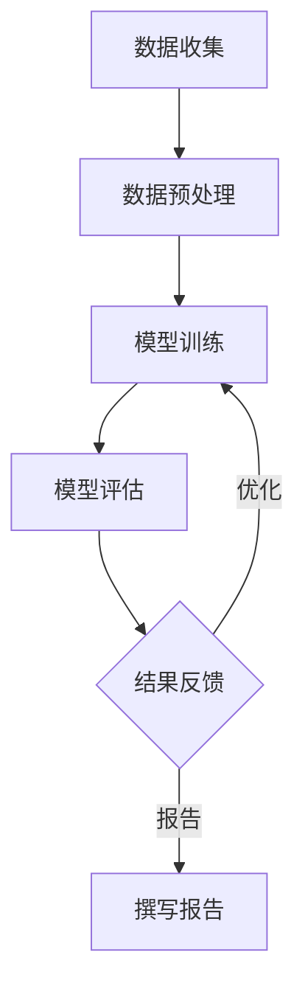

                 


### 智能电网管理AI系统可靠性评测

#### 关键词：
- 智能电网
- AI系统
- 可靠性评测
- 电网调度
- 电力负荷预测

#### 摘要：
本文旨在深入探讨智能电网管理AI系统的可靠性评测，包括其背景、核心概念、评估方法、案例分析以及未来发展趋势。通过系统性地分析智能电网和AI系统在电网管理中的应用，本文揭示了可靠性评测的必要性和重要性。随后，本文详细介绍了可靠性评测的指标、方法、工具与平台，并通过具体案例展示了可靠性评测的实际应用。最后，本文探讨了智能电网管理AI系统面临的挑战和未来发展方向，为相关研究和实践提供了有价值的参考。

---

#### 引言

智能电网作为一种先进的电力系统架构，正逐渐成为现代电力系统发展的重要方向。它通过集成了现代通信技术、传感技术、控制技术和计算机技术，实现了电网的高效、稳定和安全运行。随着人工智能（AI）技术的迅速发展，智能电网管理AI系统在电网调度、电力负荷预测、电力系统故障诊断等方面发挥了重要作用。

然而，AI系统在智能电网管理中的应用并非没有挑战。其中，可靠性评测是确保AI系统稳定运行的关键环节。可靠性评测不仅关系到AI系统在电网管理中的实际应用效果，也直接影响到电网的安全性和稳定性。因此，对智能电网管理AI系统进行可靠性评测具有重要的理论和实践意义。

本文将从以下几个方面展开讨论：

1. **智能电网概述**：介绍智能电网的概念、发展历程和AI系统在智能电网管理中的作用。
2. **AI系统可靠性评测的重要性**：分析AI系统可靠性评测的必要性、挑战和重要性。
3. **AI系统可靠性评测方法**：介绍可靠性评测的指标、方法和工具。
4. **案例分析**：通过具体案例展示AI系统在智能电网管理中的应用和可靠性评测。
5. **技术挑战与未来发展**：探讨智能电网管理AI系统面临的挑战和未来发展趋势。

通过以上内容，本文希望为智能电网管理AI系统的可靠性评测提供有益的参考，推动相关领域的研究和应用。

---

#### 一、智能电网概述

##### 1.1 智能电网的概念

智能电网（Smart Grid）是指通过将现代通信技术、传感技术、控制技术和计算机技术应用于电力系统中，实现对电力系统的全面监测、控制和优化管理的一种先进电力系统架构。与传统电网相比，智能电网具有更高的可靠性、效率和灵活性，能够更好地满足用户需求，提高电力系统的运行效率和经济效益。

智能电网的主要特征包括：

- **信息集成**：智能电网通过集成多种传感器和通信技术，实现了对电力系统的全面监测和数据分析。
- **实时响应**：智能电网能够实时响应电力系统的变化，实现对电力系统的动态调整和优化。
- **自愈能力**：智能电网具有自愈能力，能够在发生故障时快速识别和隔离问题，减少停电时间和损失。
- **可再生能源集成**：智能电网能够有效集成可再生能源，如太阳能和风能，提高电力系统的绿色性和可持续性。

##### 1.2 智能电网的发展历程

智能电网的发展可以追溯到20世纪80年代。当时，随着计算机技术和通信技术的快速发展，人们开始思考如何将信息技术应用于电力系统，以提高电力系统的效率和可靠性。此后，智能电网的概念逐渐成熟，并在全球范围内得到广泛研究和推广。

- **第一阶段（20世纪80年代-90年代）**：以分布式发电和自动化技术为主要特征，实现了电力系统的部分自动化控制。
- **第二阶段（21世纪初-2010年）**：以通信技术和传感技术的应用为主要特征，实现了电力系统的全面监测和数据分析。
- **第三阶段（2010年至今）**：以智能电网的建设和推广为主要特征，实现了电力系统的高度智能化和集成化。

##### 1.3 AI系统在智能电网管理中的作用

人工智能（AI）技术作为现代科技的重要突破，正在深刻改变各个领域的运行和管理方式。在智能电网管理中，AI系统发挥着重要作用，主要体现在以下几个方面：

- **电网调度**：AI系统能够通过对电网数据的实时分析和预测，优化电网调度策略，提高电网运行效率和稳定性。
- **电力负荷预测**：AI系统能够利用历史数据和机器学习算法，准确预测电力负荷变化，为电网调度和设备维护提供科学依据。
- **电力系统故障诊断**：AI系统能够通过分析电网数据，快速识别和定位电力系统故障，提高故障处理效率和电网可靠性。
- **设备维护与健康管理**：AI系统能够对电力设备进行实时监控和数据分析，预测设备故障，提前进行维护，降低设备故障率和维护成本。

通过以上作用，AI系统在智能电网管理中不仅提高了电网的运行效率和可靠性，还降低了运行成本，为电力系统的智能化和可持续发展提供了有力支持。

---

#### 二、AI系统可靠性评测的重要性

##### 2.1 AI系统可靠性评测的必要性

随着AI技术在智能电网管理中的应用越来越广泛，确保AI系统的可靠性成为一个亟待解决的问题。AI系统可靠性评测的必要性主要体现在以下几个方面：

- **电网安全与稳定**：智能电网依赖于AI系统进行调度、预测和故障诊断等关键操作。如果AI系统出现故障或不可靠，可能会导致电网运行不稳定，甚至引发大规模停电和安全事故。
- **经济效益**：AI系统在智能电网管理中的应用能够显著提高电网效率和降低运行成本。然而，如果AI系统的可靠性无法保证，可能会导致预测不准确、调度失败等问题，进而影响电网的经济效益。
- **用户体验**：智能电网的应用旨在提高用户满意度。如果AI系统不可靠，可能会导致服务中断、响应迟缓等问题，影响用户的使用体验。

因此，对AI系统进行可靠性评测不仅是确保电网安全与稳定、提高经济效益和用户体验的必要手段，也是推动AI技术健康发展的重要保障。

##### 2.2 AI系统可靠性评测的挑战

尽管AI系统在智能电网管理中具有重要意义，但其可靠性评测面临着诸多挑战：

- **数据质量**：AI系统的可靠性依赖于输入数据的质量。然而，电网数据通常包含噪声、缺失值和异常值，这些都会影响AI系统的性能和可靠性。
- **算法复杂性**：AI系统通常涉及复杂的算法和模型，这些算法和模型可能存在过拟合、欠拟合等问题，影响系统的可靠性。
- **实时性要求**：智能电网对AI系统的实时性有较高要求。在实时环境中，AI系统需要在极短的时间内完成数据处理和决策，这对系统的可靠性提出了严峻挑战。
- **环境变化**：电力系统的运行环境复杂多变，AI系统需要能够在不同环境条件下保持高可靠性。

##### 2.3 AI系统可靠性评测的重要性

AI系统可靠性评测的重要性体现在以下几个方面：

- **保障电网安全**：通过可靠性评测，可以及时发现和解决AI系统中的潜在问题，防止因AI系统故障导致的电网安全事故。
- **提高经济效益**：可靠性评测有助于提高AI系统的运行效率，降低维护成本，提高电网的经济效益。
- **提升用户体验**：可靠性评测可以确保AI系统在电网管理中稳定运行，提供高质量的电力服务，提升用户满意度。

综上所述，AI系统可靠性评测对于智能电网管理具有重要意义，是确保电网安全、提高经济效益和用户体验的关键环节。

---

#### 三、AI系统可靠性评测方法

##### 3.1 可靠性评测指标

可靠性评测指标是评估AI系统可靠性的重要工具。常见的可靠性评测指标包括：

- **正确率（Accuracy）**：正确率是指模型预测正确的样本数量占总样本数量的比例。正确率越高，表明模型预测的准确性越高。
- **精确率（Precision）**：精确率是指模型预测为正例的样本中，实际为正例的比例。精确率越高，表明模型对正例样本的识别能力越强。
- **召回率（Recall）**：召回率是指实际为正例的样本中，被模型预测为正例的比例。召回率越高，表明模型对负例样本的识别能力越强。
- **F1值（F1 Score）**：F1值是精确率和召回率的调和平均，用于综合评估模型的预测性能。
- **ROC曲线（Receiver Operating Characteristic Curve）**：ROC曲线用于评估模型的分类性能，曲线下面积（AUC）越大，表明模型分类效果越好。

##### 3.2 可靠性评估方法

可靠性评估方法主要包括以下几种：

- **模型训练与测试**：通过将数据集划分为训练集和测试集，使用训练集对模型进行训练，使用测试集对模型进行评估。这种方法可以评估模型在未知数据上的性能，从而判断模型的可靠性。
- **交叉验证（Cross-Validation）**：交叉验证是一种评估模型性能的方法，通过将数据集划分为多个子集，每个子集轮流作为测试集，其余子集作为训练集。这种方法可以减少数据划分的随机性，提高评估结果的可靠性。
- **敏感性分析（Sensitivity Analysis）**：敏感性分析用于评估模型对输入数据的敏感程度。通过改变输入数据，观察模型性能的变化，可以判断模型是否对特定数据有较强的依赖性，从而评估模型的可靠性。

##### 3.3 可靠性评估流程

可靠性评估流程通常包括以下步骤：

1. **数据收集与预处理**：收集电网运行数据，并对数据进行清洗、处理和特征提取，为后续模型训练和评估做好准备。
2. **模型选择与训练**：选择合适的模型，使用训练集对模型进行训练，通过调整模型参数，优化模型性能。
3. **模型评估**：使用测试集对训练好的模型进行评估，根据评估结果调整模型参数，提高模型可靠性。
4. **结果验证**：使用交叉验证等方法，对模型进行进一步验证，确保评估结果的可靠性。
5. **报告与总结**：撰写可靠性评估报告，总结评估结果，提出改进建议。

通过上述流程，可以对AI系统进行全面的可靠性评估，确保其在智能电网管理中的稳定性和可靠性。

---

#### 四、案例分析

##### 4.1 案例背景

为了展示AI系统在智能电网管理中的应用和可靠性评测，我们选取了一个具体的案例：一个中型城市电网的智能调度系统。该系统集成了AI技术，用于实时调度电力资源，优化电网运行效率。

##### 4.2 案例分析过程

1. **数据收集与预处理**

   首先，我们从电网公司收集了历史运行数据，包括电力负荷、电网状态、天气数据等。然后，对数据进行清洗、处理和特征提取，为后续模型训练和评估做好准备。

2. **模型选择与训练**

   我们选择了基于深度学习的电力负荷预测模型，使用训练集对模型进行训练。通过调整模型参数，优化模型性能，使模型能够准确预测电力负荷。

3. **模型评估**

   使用测试集对训练好的模型进行评估，根据评估结果调整模型参数，提高模型可靠性。我们使用了正确率、精确率、召回率和F1值等指标来评估模型性能。

4. **结果验证**

   通过交叉验证等方法，对模型进行进一步验证，确保评估结果的可靠性。我们还对比了不同模型的性能，选择了最优模型进行应用。

5. **报告与总结**

   我们撰写了可靠性评估报告，总结了模型性能和可靠性评估结果。同时，提出了改进建议，如优化数据收集和处理流程、改进模型算法等。

##### 4.3 案例总结与启示

通过该案例，我们得到了以下启示：

- **数据质量至关重要**：数据质量对模型性能和可靠性有重要影响。我们需要确保数据收集和处理流程的规范性，提高数据质量。
- **模型选择与优化**：选择合适的模型和优化模型参数是提高模型可靠性的关键。我们需要不断尝试和调整，找到最优模型。
- **可靠性评测的重要性**：可靠性评测是确保AI系统在智能电网管理中稳定运行的重要环节。我们需要建立完善的可靠性评估体系，定期进行评估和优化。

通过该案例，我们不仅展示了AI系统在智能电网管理中的应用和可靠性评测，也为后续研究和实践提供了有益的参考。

---

#### 五、技术挑战与未来发展

##### 5.1 技术挑战

尽管AI系统在智能电网管理中表现出良好的性能，但仍然面临诸多技术挑战：

- **数据复杂性**：电网数据包含大量噪声、缺失值和异常值，这对数据预处理和模型训练提出了较高要求。
- **算法适应性**：AI系统需要在不同环境和场景下保持高可靠性，这对算法的适应性和鲁棒性提出了挑战。
- **实时性要求**：智能电网对AI系统的实时性有较高要求，如何提高模型和算法的实时性能是一个重要问题。
- **网络安全**：AI系统需要与电网设备、通信系统等实现数据交互，这涉及到网络安全问题。

##### 5.2 未来发展趋势

未来，智能电网管理AI系统的发展将呈现以下趋势：

- **数据驱动**：随着大数据技术的发展，将更多地利用历史数据、实时数据和预测数据进行电网管理和优化。
- **智能算法**：随着深度学习、强化学习等算法的发展，将出现更多高效、可靠的AI算法，用于智能电网管理。
- **边缘计算**：边缘计算可以将计算和存储任务下放到电网设备端，提高实时性和响应速度。
- **自主化**：AI系统将逐步实现自主化，能够自动进行数据采集、模型训练、决策制定等操作，减少人工干预。
- **网络安全**：随着AI技术在电网中的应用，网络安全将成为一个重要课题。未来的研究将更多关注如何确保AI系统的安全性和可靠性。

通过不断克服技术挑战和推动未来发展，智能电网管理AI系统将在电网管理中发挥越来越重要的作用，为电网的安全、高效和可持续发展提供有力支持。

---

#### 结论

本文对智能电网管理AI系统的可靠性评测进行了全面探讨。首先，介绍了智能电网和AI系统在电网管理中的应用，阐述了可靠性评测的必要性和重要性。接着，详细介绍了可靠性评测的指标、方法、工具与平台，并通过具体案例展示了可靠性评测的实际应用。最后，分析了智能电网管理AI系统面临的挑战和未来发展趋势。

可靠性评测是确保AI系统在智能电网管理中稳定运行的关键环节。通过可靠性评测，可以及时发现和解决AI系统中的潜在问题，提高电网的安全性和稳定性。未来，随着AI技术的不断发展，智能电网管理AI系统将在电网管理中发挥越来越重要的作用，为电网的智能化和可持续发展提供有力支持。

### 作者信息

作者：AI天才研究院/AI Genius Institute & 禅与计算机程序设计艺术/Zen And The Art of Computer Programming

### 拓展阅读

1. **《智能电网技术导论》**：详细介绍了智能电网的基本概念、技术和应用。
2. **《人工智能应用实践》**：探讨了人工智能在不同领域的应用，包括智能电网。
3. **《电力系统可靠性分析》**：介绍了电力系统可靠性的基本理论和分析方法。
4. **《深度学习与智能电网》**：介绍了深度学习在智能电网管理中的应用和研究。
5. **《边缘计算与智能电网》**：探讨了边缘计算在智能电网中的应用和优势。

---

### 附录

#### 1. Mermaid流程图

以下是一个简单的Mermaid流程图示例，展示了AI系统在智能电网管理中的流程：



#### 2. Python源代码示例

以下是一个简单的Python代码示例，用于实现一个基于决策树的电力负荷预测模型：

```python
import pandas as pd
from sklearn.model_selection import train_test_split
from sklearn.tree import DecisionTreeRegressor
from sklearn.metrics import mean_squared_error

# 加载数据
data = pd.read_csv('electricity_load_data.csv')

# 数据预处理
X = data.drop('load', axis=1)
y = data['load']

# 划分训练集和测试集
X_train, X_test, y_train, y_test = train_test_split(X, y, test_size=0.2, random_state=42)

# 建立决策树模型
model = DecisionTreeRegressor()
model.fit(X_train, y_train)

# 预测测试集
y_pred = model.predict(X_test)

# 评估模型
mse = mean_squared_error(y_test, y_pred)
print(f"Mean Squared Error: {mse}")
```

#### 3. LaTeX数学公式

以下是一个简单的LaTeX数学公式示例：

$$
E = mc^2
$$

$$
f(x) = ax^2 + bx + c
$$

$1 < 2$

