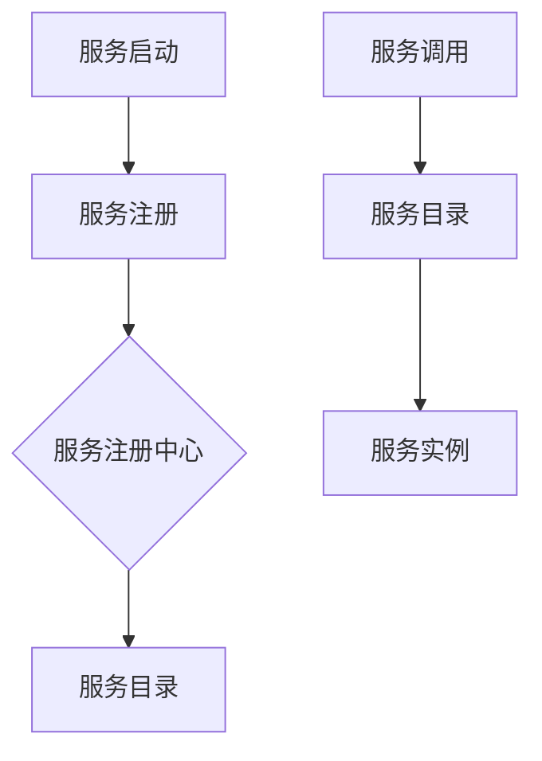

                 


# 服务发现：简化LLM微服务的管理

## 关键词
- 服务发现
- 微服务
- LLM
- 自动化
- 架构设计

## 摘要
本文将深入探讨服务发现机制，特别是在分布式系统中如何通过服务发现来简化大规模微服务的管理。我们重点关注基于大规模语言模型（LLM）的服务发现技术，介绍其基本原理、应用场景、架构设计以及实现细节。通过实际案例，我们将展示LLM在服务发现中的强大潜力，并讨论未来的发展趋势和挑战。

## 第一部分：服务发现基本概念与架构

### 第1章：服务发现概述

#### 1.1 服务发现的定义与作用

服务发现（Service Discovery）是分布式系统中一种关键机制，它使得服务消费者能够动态地发现和定位服务提供者。在微服务架构中，服务发现尤为重要，因为服务之间通常是无状态且松散耦合的。

服务发现的定义简单来说，就是确保服务消费者能够及时、准确地获取到服务提供者的位置信息。其作用主要体现在以下几个方面：

- **动态服务注册与发现**：当服务实例启动或停止时，服务注册中心会自动更新服务列表，确保服务消费者能够获取到最新的服务状态。
- **负载均衡**：通过服务发现机制，可以动态分配服务请求到健康且负载较低的服务实例上，提高系统的可用性和响应速度。
- **服务故障转移**：当某一服务实例出现故障时，服务消费者能够快速发现并切换到其他健康实例，确保系统的高可用性。

#### 1.2 服务发现的挑战

尽管服务发现机制在分布式系统中至关重要，但也面临一些挑战：

- **服务数量增长**：随着微服务架构的普及，服务数量呈指数级增长，给服务发现机制带来了巨大的数据管理压力。
- **服务配置管理**：如何有效地管理大量服务的配置信息，确保服务的一致性和可靠性，是服务发现面临的另一个挑战。
- **网络拓扑变化**：在分布式环境中，网络拓扑可能会频繁变化，服务发现需要能够快速适应这些变化，确保服务请求的顺利传递。

#### 1.3 服务发现的架构

服务发现的架构通常包括以下几个关键组件：

- **服务注册中心**：服务实例启动时会向服务注册中心注册自身信息，服务实例停止时则会注销。
- **服务目录**：服务注册中心维护一个服务目录，存储所有注册的服务实例的元数据，如服务名、地址、端口等。
- **服务调用者**：服务消费者通过查询服务目录来发现服务实例，并调用对应的服务。

### Mermaid流程图示例


### 第2章：服务发现协议与机制

#### 2.1 服务发现协议

服务发现通常依赖于以下协议：

- **DNS协议**：DNS（Domain Name System）是最早的服务发现协议，通过DNS记录来定位服务实例。
- **HTTP/HTTPS协议**：基于HTTP/HTTPS的机制，服务实例通过返回特定路径的URL来实现服务发现。
- **gRPC协议**：gRPC是一种高性能、跨平台的远程过程调用（RPC）框架，支持服务发现。

#### 2.2 服务发现的机制

服务发现的机制通常包括以下步骤：

- **服务注册**：服务实例启动时，向服务注册中心注册自身信息。
- **服务发现**：服务消费者从服务注册中心查询服务实例列表。
- **服务调用**：服务消费者通过服务实例信息发起请求。
- **服务健康检查**：定期检查服务实例的健康状态，确保服务的高可用性。

#### 2.3 服务发现的模式

服务发现主要有以下两种模式：

- **客户端发现模式**：客户端主动查询服务注册中心，获取服务实例信息。
- **服务端发现模式**：服务端维护服务实例列表，客户端直接从服务端获取实例信息。

### 第3章：服务发现工具与技术

#### 3.1 服务注册中心

常见的服务注册中心包括：

- **Eureka**：由Netflix开源，支持高可用性和故障转移。
- **ZooKeeper**：Apache开源的分布式协调服务，提供数据存储和一致性保证。
- **etcd**：CoreOS开源的分布式键值存储，常用于服务注册和配置存储。

#### 3.2 服务发现框架

常见的服务发现框架包括：

- **Netflix OSS**：Netflix开源的一系列微服务框架，包括Eureka、Hystrix等。
- **Apache Dubbo**：阿里巴巴开源的高性能RPC框架，支持服务注册和发现。
- **Spring Cloud**：Spring开源的微服务框架，集成服务注册、配置管理、负载均衡等。

#### 3.3 服务发现与微服务框架集成

服务发现可以与多种微服务框架集成，如：

- **Kubernetes**：容器编排平台，支持通过DNS进行服务发现。
- **Docker**：容器化技术，支持通过服务标签进行服务发现。

## 第二部分：基于LLM的服务发现设计

### 第4章：LLM在服务发现中的应用

#### 4.1 LLM的基本原理

LLM（Large Language Model）是指大规模语言模型，如GPT-3、BERT等。它们基于神经网络，能够对自然语言文本进行理解和生成。

LLM的基本原理包括：

- **词向量**：将自然语言文本转换为向量表示。
- **语言模型**：通过训练大量文本数据，预测下一个单词或句子。

#### 4.2 LLM在服务发现中的作用

LLM在服务发现中可以发挥以下作用：

- **服务自动分类**：LLM可以自动对服务进行分类，方便服务管理和调用。
- **服务智能推荐**：LLM可以根据用户需求，智能推荐合适的服务实例。

#### 4.3 LLM在服务发现中的挑战

LLM在服务发现中面临的挑战包括：

- **大规模数据处理**：服务数量庞大，LLM需要处理大量数据。
- **模型解释性**：如何确保LLM的决策过程是可解释的，是另一个挑战。

### 第5章：基于LLM的服务发现架构设计

#### 5.1 LLM服务发现架构概述

基于LLM的服务发现架构主要包括以下组件：

- **数据采集与处理**：收集服务元数据，进行预处理。
- **LLM模型训练与优化**：训练LLM模型，优化模型参数。
- **服务发现与调用**：通过LLM模型进行服务发现和调用。

#### 5.2 服务自动分类算法

服务自动分类算法可以使用以下伪代码表示：

```python
# 伪代码：服务自动分类
def service_auto_classify(service_metadata):
    # 预处理服务元数据
    preprocessed_metadata = preprocess_metadata(service_metadata)
    # 输入LLM模型
    model_output = lln_model.predict(preprocessed_metadata)
    # 获取分类结果
    category = get_top_category(model_output)
    return category
```

#### 5.3 服务智能推荐算法

服务智能推荐算法可以使用以下伪代码表示：

```python
# 伪代码：服务智能推荐
def service_intelligent_recommendation(user_preference):
    # 预处理用户偏好
    preprocessed_preference = preprocess_preference(user_preference)
    # 输入LLM模型
    model_output = lln_model.predict(preprocessed_preference)
    # 获取推荐服务列表
    recommended_services = get_recommended_services(model_output)
    return recommended_services
```

## 第6章：基于LLM的服务发现实现与优化

#### 6.1 服务注册与发现流程

服务注册与发现流程的伪代码如下：

```python
# 伪代码：服务注册
def service_register(service_info):
    # 将服务信息存储到注册中心
    register_center.store(service_info)
    print("服务已成功注册")

# 伪代码：服务发现
def service_discover(service_name):
    # 从注册中心获取服务列表
    services = register_center.list_services()
    # 找到匹配的服务
    for service in services:
        if service.name == service_name:
            return service
    return None
```

#### 6.2 服务健康检查与负载均衡

服务健康检查与负载均衡的伪代码如下：

```python
# 伪代码：服务健康检查
def service_health_check(service):
    # 执行健康检查
    health_status = service.perform_health_check()
    return health_status

# 伪代码：负载均衡
def load_balancer(service_list):
    # 对服务实例进行健康检查
    healthy_services = [s for s in service_list if service_health_check(s)]
    # 选择负载最低的服务实例
    min_load_service = min(healthy_services, key=lambda s: s.current_load)
    return min_load_service
```

#### 6.3 LLM模型优化与调整

LLM模型优化与调整的伪代码如下：

```python
# 伪代码：LLM模型优化
def optimize_lln_model(model, data, epochs):
    # 使用训练数据训练模型
    model.train(data, epochs=epochs)
    # 优化模型参数
    model.optimize_parameters()
    return model
```

## 第7章：项目实战与案例分析

### 7.1 项目实战背景

本节将介绍一个基于LLM的服务发现项目实战，包括开发环境搭建、源代码实现和代码解读。

### 7.2 服务自动分类实现

本节将详细讲解如何使用LLM实现服务自动分类，包括数据准备、模型训练和分类效果评估。

### 7.3 服务智能推荐实现

本节将展示如何利用LLM实现服务智能推荐，包括用户偏好收集、模型训练和推荐效果分析。

### 7.4 案例分析

本节将分析一个成功的LLM服务发现案例，并讨论一个失败案例的教训，总结项目经验和教训。

## 第8章：未来展望与趋势

### 8.1 服务发现技术的发展趋势

本节将探讨服务发现技术的发展趋势，如边缘计算、服务网格等。

### 8.2 LLM在服务发现中的未来应用

本节将展望LLM在服务发现中的未来应用，如自动化运维、服务安全等。

### 8.3 挑战与机遇

本节将讨论服务发现面临的挑战和机遇，如数据安全与隐私保护、模型解释性与可靠性等。

## 总结

本文深入探讨了服务发现机制，特别是在分布式系统中如何通过服务发现来简化大规模微服务的管理。我们重点关注了基于大规模语言模型（LLM）的服务发现技术，介绍了其基本原理、应用场景、架构设计以及实现细节。通过实际案例，我们展示了LLM在服务发现中的强大潜力，并讨论了未来的发展趋势和挑战。服务发现是分布式系统中不可或缺的一部分，而LLM的引入为其带来了新的机遇和挑战。随着技术的发展，我们可以期待服务发现机制将变得更加智能、高效和可靠。

## 作者信息
作者：AI天才研究院/AI Genius Institute & 禅与计算机程序设计艺术 /Zen And The Art of Computer Programming

---

**附录：Mermaid流程图与伪代码示例**

### Mermaid流程图示例


### 伪代码示例

```python
# 服务注册伪代码
def service_register(service_info):
    # 将服务信息存储到注册中心
    register_center.store(service_info)
    print("服务已成功注册")

# 服务发现伪代码
def service_discover(service_name):
    # 从注册中心获取服务列表
    services = register_center.list_services()
    # 找到匹配的服务
    for service in services:
        if service.name == service_name:
            return service
    return None

# 服务调用伪代码
def service_call(service):
    if service:
        response = service.invoke()
       
# 服务健康检查伪代码
def service_health_check(service):
    # 执行健康检查
    health_status = service.perform_health_check()
    return health_status

# 负载均衡伪代码
def load_balancer(service_list):
    # 对服务实例进行健康检查
    healthy_services = [s for s in service_list if service_health_check(s)]
    # 选择负载最低的服务实例
    min_load_service = min(healthy_services, key=lambda s: s.current_load)
    return min_load_service

# LLM服务自动分类伪代码
def service_auto_classify(service_metadata):
    # 预处理服务元数据
    preprocessed_metadata = preprocess_metadata(service_metadata)
    # 输入LLM模型
    model_output = lln_model.predict(preprocessed_metadata)
    # 获取分类结果
    category = get_top_category(model_output)
    return category

# LLM服务智能推荐伪代码
def service_intelligent_recommendation(user_preference):
    # 预处理用户偏好
    preprocessed_preference = preprocess_preference(user_preference)
    # 输入LLM模型
    model_output = lln_model.predict(preprocessed_preference)
    # 获取推荐服务列表
    recommended_services = get_recommended_services(model_output)
    return recommended_services

# LLM模型优化伪代码
def optimize_lln_model(model, data, epochs):
    # 使用训练数据训练模型
    model.train(data, epochs=epochs)
    # 优化模型参数
    model.optimize_parameters()
    return model
```

**注意事项：**
- 伪代码中的函数和类是抽象的概念，实际实现时可能需要根据具体的技术栈进行调整。
- Mermaid流程图中的节点和连接是根据伪代码的结构来设计的，用于直观展示服务发现的过程。

**拓展阅读：**
- 服务发现相关的开源框架和工具，如Eureka、ZooKeeper、etcd等。
- 大规模语言模型的原理和应用，如GPT-3、BERT等。
- 微服务架构的设计原则和实践，如Spring Cloud、Netflix OSS等。

通过本文的深入探讨，我们希望能够为读者提供关于服务发现和LLM应用的综合理解，助力在分布式系统设计中实现更高效、更可靠的服务管理。

