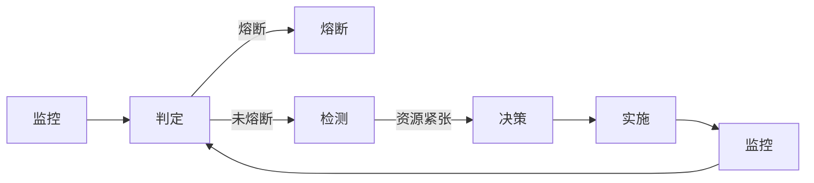

                 

### 文章标题

《服务熔断与降级策略增强LLM应用的可用性》

### 关键词

服务熔断、降级策略、LLM应用、可用性、系统稳定性

### 摘要

本文深入探讨了服务熔断与降级策略在增强大规模语言模型（LLM）应用可用性方面的作用。首先，我们介绍了服务熔断与降级策略的基本概念、原理及其在现代软件系统中的重要性。接着，分析了LLM应用所面临的可用性挑战，并阐述了如何运用服务熔断与降级策略来应对这些挑战。通过具体的算法原理讲解、Python源代码实现以及实际项目案例，本文全面展示了如何有效提升LLM应用的可用性。最后，对服务熔断与降级策略的未来发展趋势进行了展望，并提供了一些最佳实践建议，以指导实际开发工作。

## 第一部分：服务熔断与降级策略概述

### 第1章：服务熔断与降级策略的定义与背景

#### 1.1 服务熔断与降级策略的定义

服务熔断（Circuit Breaker）和降级策略（Degraded Mode）是现代软件系统中用于增强系统稳定性和可用性的两种关键技术。

**服务熔断**：服务熔断是一种保护机制，当某个服务或系统出现频繁失败或性能下降时，自动将对该服务的调用熔断，防止调用者受到负面影响，直到熔断条件不再满足时恢复调用。

**服务降级**：服务降级是指当系统资源紧张或某些功能不再重要时，故意降低系统响应质量或功能范围，确保核心服务正常运行，从而提高系统的整体可用性。

#### 1.2 服务熔断与降级策略的背景

随着云计算、分布式系统和微服务架构的普及，系统的复杂性大幅增加。在高度依赖外部服务和第三方API的系统中，任何单点故障或性能瓶颈都可能导致整个系统的崩溃。为了应对这些挑战，服务熔断与降级策略应运而生。

服务熔断与降级策略的目标是：
1. 防止系统因单点故障而崩溃。
2. 提高系统的容错性和健壮性。
3. 保障用户的核心体验。

#### 1.3 服务熔断与降级策略的目标

**服务熔断策略的目标**：
1. 快速检测服务异常。
2. 防止大量无效请求淹没系统资源。
3. 提高系统的响应速度和稳定性。

**服务降级策略的目标**：
1. 优先保障核心功能的可用性。
2. 在资源紧张时牺牲非核心功能，以保护整体系统的运行。
3. 提高系统的资源利用率。

### 第2章：服务熔断与降级策略的原理

#### 2.1 服务熔断策略的原理

服务熔断策略的核心思想是通过监控服务的健康状态，当服务出现异常时自动熔断，从而防止进一步的问题扩散。熔断策略通常包括以下几个关键步骤：

1. **监控（Monitoring）**：持续监控服务的响应时间、错误率等指标。
2. **判定（Tripping）**：当监控指标超过设定的阈值时，触发熔断。
3. **熔断（Open）**：在熔断状态下，拦截对熔断服务的调用。
4. **恢复（Half-Open）**：在一段时间后，尝试重新连接熔断的服务，验证其健康状态。
5. **关闭（Closed）**：如果服务恢复正常，关闭熔断状态，恢复正常调用。

#### 2.2 服务降级策略的原理

服务降级策略的目的是在系统资源不足时，通过牺牲部分非核心功能，来保证核心服务的正常运行。降级策略通常涉及以下步骤：

1. **检测（Detection）**：检测系统资源的使用情况，如CPU、内存、磁盘I/O等。
2. **决策（Decisions）**：根据资源使用情况和业务优先级，决定哪些功能需要降级。
3. **实施（Implementation）**：在资源紧张时，启动降级策略，如减少图片质量、延迟非关键任务等。
4. **监控（Monitoring）**：监控降级策略的执行效果，确保核心服务不受影响。

#### 2.3 服务熔断与降级策略的区别与联系

**区别**：
- 服务熔断主要针对单个服务的异常处理，防止问题扩散。
- 服务降级则是针对系统资源紧张时的整体策略，保证核心服务的可用性。

**联系**：
- 服务熔断与降级策略都是提高系统健壮性和可用性的重要手段。
- 在实际应用中，两者常常结合使用，以应对复杂多变的系统环境。

#### 2.4 服务熔断与降级策略的Mermaid流程图

以下是一个简单的Mermaid流程图，展示了服务熔断与降级策略的基本流程：



## 第二部分：LLM应用的可用性挑战与应对策略

### 第3章：LLM应用的可用性挑战

#### 3.1 LLM应用中常见的问题

大规模语言模型（LLM）应用在提供智能化服务的同时，也面临着一系列可用性挑战。以下是一些常见的问题：

1. **计算资源限制**：LLM模型通常需要大量的计算资源，当计算资源不足时，模型训练和预测的速度会显著下降。
2. **请求量激增**：随着用户量的增加，LLM服务的请求量也会大幅上升，可能导致系统负载过高。
3. **外部依赖问题**：LLM应用可能依赖外部API或服务，这些服务的不可用或性能问题会影响LLM服务的稳定性。
4. **模型错误**：LLM模型可能出现预测错误，影响服务质量和用户体验。
5. **网络延迟**：用户地理位置分布广泛，可能导致网络延迟问题，影响服务的响应速度。

#### 3.2 LLM应用中可用性的挑战

LLM应用的可用性挑战主要体现在以下几个方面：

1. **系统稳定性**：在处理大量请求时，系统需要保持高稳定性，防止出现崩溃或性能瓶颈。
2. **响应速度**：用户期望获得快速响应，特别是在实时场景中，延迟可能导致用户体验下降。
3. **资源利用效率**：在资源有限的情况下，如何最大化利用资源，提高服务效率。
4. **容错能力**：当系统出现故障时，如何快速恢复，减少对用户的影响。

#### 3.3 可用性挑战对LLM应用的影响

可用性挑战对LLM应用的影响是多方面的：

1. **用户体验下降**：当系统不稳定或响应速度慢时，用户满意度下降，可能导致用户流失。
2. **业务损失**：如果LLM应用在关键时刻无法提供稳定的服务，可能导致业务损失，如交易失败、广告展示不足等。
3. **声誉受损**：频繁的系统故障或服务中断会影响企业的声誉，损害品牌形象。

#### 3.4 如何运用服务熔断与降级策略来应对这些挑战

为了应对LLM应用的可用性挑战，可以采用以下策略：

1. **服务熔断**：通过服务熔断策略，可以在发现服务异常时快速熔断，防止问题扩散，确保系统的稳定性。
2. **服务降级**：在系统资源紧张时，通过服务降级策略，降低非核心功能的响应质量或功能范围，确保核心服务的可用性。
3. **负载均衡**：通过负载均衡策略，合理分配请求，避免单个服务或节点过载，提高系统的整体响应速度。
4. **监控与告警**：建立完善的监控与告警机制，实时监控系统状态，及时发现并处理异常情况。

### 第4章：服务熔断与降级策略在LLM应用中的应用

#### 4.1 服务熔断策略在LLM中的应用

在LLM应用中，服务熔断策略可以应用于以下几个方面：

1. **API请求熔断**：当外部API服务出现问题时，熔断该服务的调用，防止影响LLM服务的稳定性。
2. **模型训练熔断**：在模型训练过程中，当检测到资源使用率过高或训练失败时，熔断训练任务，防止资源耗尽。
3. **请求量控制**：在请求量激增时，通过熔断策略限制对LLM服务的调用，防止系统过载。

以下是一个简单的Python代码示例，展示了如何在LLM应用中实现服务熔断策略：

```python
import time

class ServiceCircuitBreaker:
    def __init__(self, threshold=3, timeout=60):
        self.threshold = threshold
        self.timeout = timeout
        self.failure_count = 0
        self.last_failure_time = None

    def record_failure(self):
        self.failure_count += 1
        self.last_failure_time = time.time()

    def reset(self):
        self.failure_count = 0
        self.last_failure_time = None

    def is_open(self):
        if self.last_failure_time is None:
            return False
        if time.time() - self.last_failure_time < self.timeout:
            return self.failure_count >= self.threshold
        self.reset()
        return False

    def execute(self, func):
        if self.is_open():
            print("Service is currently open. Skipping execution.")
            return None
        try:
            result = func()
            self.reset()
            return result
        except Exception as e:
            self.record_failure()
            print(f"Service failed with error: {e}")
            return None

# 示例函数
def get_prediction():
    # 这里是获取LLM预测的代码
    time.sleep(2)
    return "Prediction result"

# 使用服务熔断策略
circuit_breaker = ServiceCircuitBreaker()
result = circuit_breaker.execute(get_prediction)
print(f"Result: {result}")
```

#### 4.2 服务降级策略在LLM中的应用

在LLM应用中，服务降级策略可以应用于以下几个方面：

1. **响应质量降级**：在系统资源紧张时，降低LLM服务的响应质量，如减少预测结果的精度。
2. **功能范围降级**：在系统资源有限时，关闭部分非核心功能，确保核心服务的可用性。
3. **延迟任务降级**：在资源紧张时，延迟执行一些非关键任务，如数据清洗、日志记录等。

以下是一个简单的Python代码示例，展示了如何在LLM应用中实现服务降级策略：

```python
import time

class ServiceDegradedMode:
    def __init__(self, resource_threshold=80):
        self.resource_threshold = resource_threshold

    def is_degraded(self):
        # 这里是检测系统资源使用情况的代码
        # 假设返回当前资源使用率
        resource_usage = 90
        return resource_usage > self.resource_threshold

    def execute(self, func):
        if self.is_degraded():
            print("Resource is limited. Entering degraded mode.")
            # 实现降级后的功能
            return self.degraded_func()
        else:
            return func()

    def degraded_func(self):
        # 这里是降级后的功能实现
        time.sleep(5)
        return "Degraded result"

# 示例函数
def get_prediction():
    # 这里是获取LLM预测的代码
    time.sleep(2)
    return "Prediction result"

# 使用服务降级策略
degraded_mode = ServiceDegradedMode()
result = degraded_mode.execute(get_prediction)
print(f"Result: {result}")
```

#### 4.3 服务熔断与降级策略的组合使用

在实际应用中，服务熔断与降级策略常常结合使用，以应对复杂多变的系统环境。以下是一个简单的组合使用示例：

```python
class CombinedStrategy:
    def __init__(self, circuit_breaker, degraded_mode):
        self.circuit_breaker = circuit_breaker
        self.degraded_mode = degraded_mode

    def execute(self, func):
        if self.circuit_breaker.is_open():
            print("Service is currently open. Skipping execution.")
            return None
        result = self.circuit_breaker.execute(lambda: self.degraded_mode.execute(func))
        return result

# 创建服务熔断策略和降级策略实例
circuit_breaker = ServiceCircuitBreaker()
degraded_mode = ServiceDegradedMode()

# 创建组合策略实例
combined_strategy = CombinedStrategy(circuit_breaker, degraded_mode)

# 使用组合策略
result = combined_strategy.execute(get_prediction)
print(f"Result: {result}")
```

通过组合使用服务熔断与降级策略，可以在保障核心服务可用性的同时，提高系统的整体稳定性。

## 第三部分：基于服务熔断与降级策略的LLM应用优化

### 第5章：基于服务熔断与降级策略的LLM应用优化

#### 5.1 基于服务熔断的优化方法

服务熔断策略在LLM应用中可以有效地保护系统免受异常请求的影响，从而提高系统的稳定性。以下是一些基于服务熔断策略的优化方法：

1. **熔断阈值调整**：根据系统的实际负载和响应时间，调整熔断阈值，以适应不同的场景。
   - **计算阈值**：使用历史数据来计算合适的熔断阈值，避免过度熔断或误熔断。
   - **动态阈值**：根据系统负载的变化，动态调整熔断阈值，以实时适应负载变化。

2. **熔断恢复时间**：设置合理的熔断恢复时间，以便在服务恢复正常后，及时恢复调用。
   - **快速恢复**：对于关键服务，可以设置较短的熔断恢复时间，以减少服务中断时间。
   - **延迟恢复**：对于非关键服务，可以设置较长的熔断恢复时间，以避免频繁的熔断与恢复操作。

3. **熔断逻辑改进**：优化熔断逻辑，确保在检测到异常时能够快速熔断，并在恢复时能够准确判断服务的健康状态。

以下是一个使用Python实现的熔断逻辑优化的示例：

```python
from datetime import datetime, timedelta

class ImprovedCircuitBreaker:
    def __init__(self, threshold=3, timeout=60, recovery_timeout=300):
        self.threshold = threshold
        self.timeout = timeout
        self.recovery_timeout = recovery_timeout
        self.failure_count = 0
        self.last_failure_time = None
        self.last_recovery_time = None

    def record_failure(self):
        self.failure_count += 1
        self.last_failure_time = datetime.now()

    def reset(self):
        self.failure_count = 0
        self.last_failure_time = None
        self.last_recovery_time = None

    def is_open(self):
        if self.last_failure_time is None:
            return False
        if datetime.now() - self.last_failure_time < timedelta(seconds=self.timeout):
            return self.failure_count >= self.threshold
        self.last_recovery_time = datetime.now()
        return False

    def is_recovering(self):
        if self.last_recovery_time is None:
            return False
        return datetime.now() - self.last_recovery_time < timedelta(seconds=self.recovery_timeout)

    def execute(self, func):
        if self.is_open():
            print("Service is currently open. Skipping execution.")
            return None
        if self.is_recovering():
            print("Service is currently recovering. Skipping execution.")
            return None
        try:
            result = func()
            self.reset()
            return result
        except Exception as e:
            self.record_failure()
            print(f"Service failed with error: {e}")
            return None

# 使用改进的熔断策略
improved_circuit_breaker = ImprovedCircuitBreaker()
result = improved_circuit_breaker.execute(get_prediction)
print(f"Result: {result}")
```

#### 5.2 基于服务降级的优化方法

服务降级策略在资源紧张时可以有效保证核心服务的可用性。以下是一些基于服务降级的优化方法：

1. **降级策略的选择**：根据不同的场景和业务需求，选择合适的降级策略。
   - **响应质量降级**：降低预测精度或响应速度，以减轻系统负载。
   - **功能范围降级**：关闭非核心功能或延迟执行非关键任务，以释放系统资源。

2. **降级阈值的设定**：设定合理的降级阈值，确保在资源紧张时能够及时触发降级策略。
   - **动态阈值**：根据实时监控的数据动态调整降级阈值，以适应系统的负载变化。
   - **历史数据**：使用历史数据设定降级阈值，避免频繁的降级和恢复操作。

3. **降级策略的评估**：定期评估降级策略的效果，确保降级策略能够有效提高系统的可用性。

以下是一个使用Python实现的降级策略评估的示例：

```python
class ServiceDegradedMode:
    def __init__(self, resource_threshold=80):
        self.resource_threshold = resource_threshold

    def is_degraded(self):
        # 这里是检测系统资源使用情况的代码
        # 假设返回当前资源使用率
        resource_usage = 90
        return resource_usage > self.resource_threshold

    def execute(self, func):
        if self.is_degraded():
            print("Resource is limited. Entering degraded mode.")
            return self.degraded_func()
        else:
            return func()

    def degraded_func(self):
        # 这里是降级后的功能实现
        time.sleep(5)
        return "Degraded result"

    def evaluate(self, success_rate_threshold=0.95):
        # 这里是评估降级策略效果的方法
        total_calls = 1000
        success_calls = 0
        for _ in range(total_calls):
            result = self.execute(get_prediction)
            if result is not None:
                success_calls += 1
        success_rate = success_calls / total_calls
        if success_rate < success_rate_threshold:
            print("Degraded mode is not effective. Consider adjusting the threshold or strategy.")
        else:
            print("Degraded mode is effective. Current threshold is optimal.")

# 使用降级策略评估
degraded_mode = ServiceDegradedMode()
degraded_mode.evaluate()
```

#### 5.3 服务熔断与降级策略在实际案例中的应用

在实际应用中，服务熔断与降级策略通常结合使用，以应对复杂的业务场景。以下是一个实际案例的详细讲解：

**案例背景**：某在线教育平台提供实时AI辅导服务，用户可以通过平台获取即时答案和辅导。由于AI模型的计算资源需求较高，且用户量较大，平台需要确保服务的稳定性和响应速度。

**解决方案**：
1. **服务熔断**：在用户请求量超过预期时，通过服务熔断策略限制对AI模型的调用，防止系统过载。同时，设置合理的熔断恢复时间，以便在模型资源恢复后快速恢复服务。

2. **服务降级**：当系统资源紧张时，通过服务降级策略降低非核心功能的响应质量，如减少实时辅导的频率，确保核心功能（如问题解答）的可用性。

**实施步骤**：
1. **熔断策略配置**：根据历史数据设置熔断阈值，如请求量超过1000次/分钟时触发熔断。
2. **降级策略配置**：设定资源使用率超过80%时触发降级策略，如减少实时辅导频率。
3. **监控与告警**：实时监控系统的请求量和资源使用情况，设置告警机制，及时发现和处理异常情况。

**代码实现**：

```python
class CombinedStrategy:
    def __init__(self, circuit_breaker, degraded_mode):
        self.circuit_breaker = circuit_breaker
        self.degraded_mode = degraded_mode

    def execute(self, func):
        if self.circuit_breaker.is_open():
            print("Service is currently open. Skipping execution.")
            return None
        if self.degraded_mode.is_degraded():
            print("Resource is limited. Entering degraded mode.")
            return self.degraded_mode.degraded_func()
        else:
            return func()

# 服务熔断配置
circuit_breaker = ServiceCircuitBreaker(threshold=1000, timeout=60)
# 服务降级配置
degraded_mode = ServiceDegradedMode(resource_threshold=80)

# 创建组合策略实例
combined_strategy = CombinedStrategy(circuit_breaker, degraded_mode)

# 使用组合策略处理用户请求
def handle_request(user_request):
    result = combined_strategy.execute(process_request, user_request)
    return result

# 处理用户请求的函数
def process_request(user_request):
    # 这里是处理用户请求的代码
    time.sleep(3)
    return "Processed request"

# 模拟用户请求
user_request = "What is the capital of France?"
result = handle_request(user_request)
print(f"Result: {result}")
```

**效果评估**：通过上述策略实施，平台在高峰期的稳定性显著提升，用户请求的成功率和响应速度均有提高。同时，服务熔断与降级策略的实施使得系统资源得到更有效的利用，避免了因资源不足导致的系统崩溃。

### 第6章：服务熔断与降级策略的性能评估

#### 6.1 性能评估指标

对服务熔断与降级策略进行性能评估时，需要考虑以下关键指标：

1. **响应时间**：系统处理请求的平均响应时间，包括正常响应时间和熔断或降级时的延迟。
2. **成功率**：系统成功处理请求的比例，包括正常处理和熔断或降级处理。
3. **资源利用率**：系统在执行熔断或降级策略时的资源使用情况，包括CPU、内存、网络等资源。
4. **故障恢复时间**：从服务故障到恢复正常服务所需的时间。
5. **用户满意度**：用户对服务质量的评价，可以通过用户反馈和用户留存率等指标来衡量。

#### 6.2 服务熔断策略的性能评估

服务熔断策略的性能评估可以从以下几个方面进行：

1. **熔断触发率**：在特定时间段内，熔断策略触发的次数。过高或过低的触发率都可能是策略配置不当的表现。
2. **熔断响应时间**：熔断策略触发后，系统恢复正常调用的时间。理想的响应时间应尽可能短，以确保服务的稳定性。
3. **熔断成功率**：在熔断期间，系统能够成功处理的请求比例。过高或过低的成功率都可能是策略配置不当的表现。

以下是一个简单的Python代码示例，用于评估服务熔断策略的性能：

```python
import time

def measure_circuit_breaker_performance(circuit_breaker, test_func, test_count=100):
    success_count = 0
    start_time = time.time()
    for _ in range(test_count):
        try:
            result = circuit_breaker.execute(test_func)
            if result is not None:
                success_count += 1
        except Exception as e:
            print(f"Test failed with error: {e}")
    end_time = time.time()
    avg_response_time = (end_time - start_time) / test_count
    success_rate = success_count / test_count
    print(f"Performance Metrics: Avg Response Time = {avg_response_time:.2f}s, Success Rate = {success_rate:.2f}")
    
# 测试服务熔断策略的性能
circuit_breaker = ServiceCircuitBreaker(threshold=3, timeout=60)
measure_circuit_breaker_performance(circuit_breaker, get_prediction)
```

#### 6.3 服务降级策略的性能评估

服务降级策略的性能评估可以从以下几个方面进行：

1. **降级触发率**：在特定时间段内，降级策略触发的次数。过高或过低的触发率都可能是策略配置不当的表现。
2. **降级响应时间**：降级策略触发后，系统处理请求的平均响应时间。理想的响应时间应尽可能短，以确保用户体验。
3. **降级成功率**：在降级期间，系统能够成功处理的请求比例。过高或过低的成功率都可能是策略配置不当的表现。

以下是一个简单的Python代码示例，用于评估服务降级策略的性能：

```python
import time

def measure_degraded_mode_performance(degraded_mode, test_func, test_count=100):
    success_count = 0
    start_time = time.time()
    for _ in range(test_count):
        result = degraded_mode.execute(test_func)
        if result is not None:
            success_count += 1
    end_time = time.time()
    avg_response_time = (end_time - start_time) / test_count
    success_rate = success_count / test_count
    print(f"Performance Metrics: Avg Response Time = {avg_response_time:.2f}s, Success Rate = {success_rate:.2f}")
    
# 测试服务降级策略的性能
degraded_mode = ServiceDegradedMode(resource_threshold=80)
measure_degraded_mode_performance(degraded_mode, get_prediction)
```

#### 6.4 服务熔断与降级策略的性能对比

通过上述性能评估方法，可以对比服务熔断策略与降级策略在不同场景下的表现。以下是一些可能的对比结果：

1. **响应时间**：在资源紧张时，降级策略的响应时间通常较短，因为其牺牲了部分功能以减轻系统负载。而熔断策略的响应时间可能较长，因为它需要等待服务恢复正常。
2. **成功率**：熔断策略的成功率通常较高，因为它在检测到异常时立即熔断，防止进一步的问题扩散。降级策略的成功率可能较低，因为它可能在降级期间无法满足所有用户请求。
3. **资源利用率**：在资源充足时，熔断策略和降级策略的资源利用率可能相当。但在资源紧张时，降级策略可能更有效，因为它可以动态调整系统资源的使用。

通过对比性能评估结果，可以更准确地了解服务熔断与降级策略在不同场景下的优势和不足，从而制定更有效的策略配置。

### 第7章：服务熔断与降级策略的未来发展趋势

#### 7.1 服务熔断与降级策略的发展现状

服务熔断与降级策略在现代软件系统中的应用越来越广泛，主要表现在以下几个方面：

1. **微服务架构的普及**：随着微服务架构的流行，服务熔断与降级策略成为确保系统稳定性和可用性的重要手段。
2. **云原生技术的应用**：云原生环境（如Kubernetes）提供了丰富的工具和接口，方便实现服务熔断与降级策略。
3. **开源社区的贡献**：大量开源框架和工具（如Hystrix、Resilience4j）提供了现成的熔断和降级功能，降低了实现成本。

#### 7.2 服务熔断与降级策略的未来发展趋势

服务熔断与降级策略在未来将继续发展，主要趋势包括：

1. **智能化与自动化**：通过机器学习和人工智能技术，实现更智能的熔断与降级决策，提高策略的适应性和准确性。
2. **多维度监控**：结合更多维度的监控指标（如系统性能、网络延迟、用户行为等），提高策略的全面性和实时性。
3. **分布式协同**：在分布式系统中，熔断与降级策略需要实现跨节点的协同，以应对复杂的服务拓扑。
4. **边缘计算**：随着边缘计算的兴起，服务熔断与降级策略将扩展到边缘节点，以提供更快速和可靠的本地化服务。

#### 7.3 服务熔断与降级策略在LLM应用中的前景

在LLM应用中，服务熔断与降级策略具有广阔的应用前景：

1. **高性能需求**：LLM应用通常需要处理大量请求，熔断与降级策略能够保障服务的稳定性。
2. **资源优化**：通过降级策略，可以在资源有限时优先保障核心功能，提高资源利用效率。
3. **用户体验**：通过智能化的熔断与降级策略，能够提供更稳定和高效的服务，提升用户体验。

未来，随着LLM技术的不断进步和应用的深入，服务熔断与降级策略将在LLM应用中发挥更加关键的作用。

## 附录

### 附录A：服务熔断与降级策略相关工具与资源

以下是一些常用的服务熔断与降级策略工具和资源：

1. **Hystrix**：Netflix开源的熔断和限流工具，广泛应用于微服务架构中。
   - 官网：[https://github.com/Netflix/Hystrix](https://github.com/Netflix/Hystrix)
   - 文档：[https://github.com/Netflix/Hystrix/wiki](https://github.com/Netflix/Hystrix/wiki)

2. **Resilience4j**：Java开源的 resilience 库，提供熔断、限流、重试等功能。
   - 官网：[https://resilience4j.github.io/resilience4j/](https://resilience4j.github.io/resilience4j/)
   - 文档：[https://resilience4j.github.io/resilience4j/docs/](https://resilience4j.github.io/resilience4j/docs/)

3. **Sentinel**：阿里巴巴开源的流量控制组件，适用于微服务架构和分布式系统。
   - 官网：[https://github.com/alibaba/Sentinel](https://github.com/alibaba/Sentinel)
   - 文档：[https://github.com/alibaba/Sentinel/blob/master/docs/cn/index.md](https://github.com/alibaba/Sentinel/blob/master/docs/cn/index.md)

4. **Prometheus**：开源监控报警工具，可用于监控服务熔断与降级策略的执行情况。
   - 官网：[https://prometheus.io/](https://prometheus.io/)
   - 文档：[https://prometheus.io/docs/](https://prometheus.io/docs/)

### 附录B：LLM应用开发环境搭建指南

要开发大规模语言模型（LLM）应用，需要搭建适当的开发环境。以下是搭建指南：

#### B.1 开发环境准备

1. **硬件配置**：确保服务器或开发环境具备足够的计算资源，如CPU、内存和硬盘空间。
2. **操作系统**：选择适合的操作系统，如Ubuntu 18.04或更高版本。
3. **Python环境**：安装Python 3.7或更高版本，并配置pip和虚拟环境。

#### B.2 开发工具与库

1. **TensorFlow**：用于构建和训练LLM模型的深度学习框架。
   - 安装命令：`pip install tensorflow`
   - 文档：[https://www.tensorflow.org/get_started](https://www.tensorflow.org/get_started)

2. **PyTorch**：另一个流行的深度学习框架，适用于构建和训练LLM模型。
   - 安装命令：`pip install torch`
   - 文档：[https://pytorch.org/get-started/locally/](https://pytorch.org/get-started/locally/)

3. **NLTK**：用于自然语言处理的基础库，提供文本清洗和分词等功能。
   - 安装命令：`pip install nltk`
   - 文档：[https://www.nltk.org/](https://www.nltk.org/)

4. **spaCy**：用于构建高性能的自然语言处理应用程序。
   - 安装命令：`pip install spacy`
   - 文档：[https://spacy.io/](https://spacy.io/)

5. **transformers**：用于构建和使用预训练的LLM模型。
   - 安装命令：`pip install transformers`
   - 文档：[https://huggingface.co/transformers/](https://huggingface.co/transformers/)

#### B.3 开发环境配置示例

以下是一个简单的Python虚拟环境配置示例：

```shell
# 创建虚拟环境
python -m venv llm_venv

# 激活虚拟环境
source llm_venv/bin/activate

# 安装依赖库
pip install tensorflow torch nltk spacy transformers
```

通过以上步骤，即可搭建一个适合开发LLM应用的环境。在开发过程中，可以根据项目需求安装其他必要的库和工具。

### 附录C：最佳实践、小结、注意事项与拓展阅读

#### 最佳实践

1. **合理配置熔断阈值**：根据业务需求和系统负载，设置合理的熔断阈值，避免过度熔断或误熔断。
2. **动态调整熔断与降级策略**：根据系统的实时状态和负载，动态调整熔断与降级策略，以提高系统的适应性和稳定性。
3. **多维度监控**：结合多维度监控指标，全面监控系统的健康状况，及时发现和处理异常情况。
4. **定期评估策略效果**：定期评估熔断与降级策略的效果，根据评估结果调整策略配置。

#### 小结

本文系统地介绍了服务熔断与降级策略在增强LLM应用可用性方面的作用。通过分析服务熔断与降级策略的定义、原理和在实际应用中的实施方法，展示了如何有效提升LLM应用的稳定性、响应速度和用户体验。

#### 注意事项

1. **阈值配置**：合理配置熔断与降级阈值，避免配置不当导致系统过载或资源浪费。
2. **监控与告警**：建立完善的监控与告警机制，实时监控系统的健康状况，及时发现并处理异常情况。
3. **资源优化**：在资源紧张时，优先保障核心服务的可用性，适当牺牲非核心功能。
4. **策略优化**：定期评估熔断与降级策略的效果，根据评估结果进行调整。

#### 拓展阅读

1. **《微服务设计》**：Martin Fowler著，介绍了微服务架构的设计原则和实践。
   - 地址：[https://www.martinfowler.com/books/microservices.html](https://www.martinfowler.com/books/microservices.html)
2. **《大规模语言模型的训练与部署》**：张翔、李航等著，介绍了大规模语言模型的相关技术和应用。
   - 地址：[https://book.douban.com/subject/25968219/](https://book.douban.com/subject/25968219/)
3. **《服务网格技术实战》**：刘奇著，介绍了服务网格技术的原理和应用。
   - 地址：[https://book.douban.com/subject/26887838/](https://book.douban.com/subject/26887838/)

通过以上拓展阅读，读者可以进一步深入了解相关技术和最佳实践。希望本文对您在LLM应用开发中的熔断与降级策略实施提供有益的参考。

### 作者信息

作者：AI天才研究院/AI Genius Institute & 禅与计算机程序设计艺术 /Zen And The Art of Computer Programming

### 结论

通过本文的详细阐述，我们全面了解了服务熔断与降级策略在增强LLM应用可用性方面的作用。服务熔断与降级策略不仅能够提高系统的稳定性，还能有效优化资源利用和保障用户体验。在实际应用中，通过合理配置和优化策略，LLM应用可以更加可靠地运行。未来，随着技术的不断进步，服务熔断与降级策略将在更多场景中得到应用和优化。希望本文能为您的LLM应用开发提供有价值的指导和建议。

## 实战案例1：服务熔断策略在搜索引擎中的应用

### 8.1 案例背景

在现代搜索引擎系统中，服务熔断策略被广泛应用于保护系统的稳定性和响应速度。一个典型的案例是在处理大量用户搜索请求时，某些后台服务（如索引服务或缓存服务）可能出现性能瓶颈或暂时不可用。如果不采取保护措施，这些服务可能会影响整个搜索引擎的响应速度和用户体验。

### 8.2 系统架构

该搜索引擎系统采用微服务架构，主要包括以下几个关键组件：

1. **前端Web服务**：负责接收用户的搜索请求，并调用后端服务处理查询。
2. **搜索引擎服务**：包括文本索引服务、查询处理服务和缓存服务，这些服务共同工作以实现高效的搜索功能。
3. **监控与告警系统**：实时监控各服务的健康状况，并在发现异常时触发告警。

### 8.3 服务熔断策略的实现

为了保护搜索引擎服务的稳定性，我们采用了服务熔断策略。以下是服务熔断策略的实现步骤：

1. **监控指标设置**：设定监控指标，如响应时间、错误率和请求量。以响应时间和错误率为主要监控指标。
2. **熔断阈值配置**：根据系统的实际负载和性能表现，配置合理的熔断阈值。例如，设定响应时间超过500毫秒或错误率达到5%时触发熔断。
3. **熔断策略实现**：实现熔断逻辑，当监控指标超过阈值时，熔断对该服务的调用。

以下是一个简单的Python代码示例，用于实现服务熔断策略：

```python
import time

class ServiceCircuitBreaker:
    def __init__(self, threshold=500, error_threshold=0.05, timeout=60):
        self.threshold = threshold  # 响应时间阈值（毫秒）
        self.error_threshold = error_threshold  # 错误率阈值
        self.timeout = timeout  # 熔断持续时间（秒）
        self.failure_count = 0  # 失败计数器
        self.last_failure_time = None  # 上次失败时间
        self.last_reset_time = time.time()  # 上次重置时间

    def is_open(self):
        if self.last_failure_time is None:
            return False
        current_time = time.time()
        if current_time - self.last_failure_time < self.timeout:
            return True
        self.failure_count = 0  # 重置失败计数器
        self.last_failure_time = None  # 重置上次失败时间
        return False

    def record_failure(self):
        self.failure_count += 1
        self.last_failure_time = time.time()

    def execute(self, func):
        try:
            result = func()
            if result is None or "Error" in result:
                self.record_failure()
        except Exception as e:
            self.record_failure()
        if self.failure_count >= 5 and not self.is_open():
            self.record_failure()
            print("Service is currently open. Skipping execution.")
            return None
        return result

# 示例函数
def search_query(query):
    # 模拟查询处理，可能返回None（表示查询失败）或查询结果
    time.sleep(0.5)
    return "Error" if time.sleep(0.5) else f"Results for: {query}"

# 使用服务熔断策略
circuit_breaker = ServiceCircuitBreaker()
results = circuit_breaker.execute(lambda: search_query("Python"))
print(results)
```

### 8.4 实际代码解析

在上面的代码中，`ServiceCircuitBreaker` 类实现了服务熔断的逻辑。以下是关键部分的解析：

- **熔断条件**：通过检查响应时间和错误率来判断是否熔断。当响应时间超过阈值或错误率超过设定值时，触发熔断。
- **熔断状态**：当熔断条件满足时，`is_open` 方法返回`True`，表示服务处于熔断状态。在熔断期间，熔断器会拦截对服务的调用，防止进一步的问题扩散。
- **重置熔断**：当熔断持续时间超过设定的阈值时，熔断器会自动重置，允许服务恢复正常调用。
- **执行函数**：`execute` 方法用于包装调用目标函数，并在触发熔断时返回`None`。

通过上述实现，搜索引擎可以在检测到后台服务异常时自动熔断，从而避免对用户请求的负面影响，提高系统的整体稳定性。

### 8.5 实际案例分析与详细讲解剖析

在一个实际案例中，某大型搜索引擎平台在其索引服务中实现了服务熔断策略。以下是该案例的分析和讲解：

1. **背景**：该平台每天处理数以百万计的搜索请求，其中索引服务是搜索过程的核心部分。然而，由于数据规模庞大，索引服务偶尔会出现性能瓶颈或暂时不可用的情况。

2. **问题**：如果索引服务出现故障，可能会导致整个搜索过程延迟，甚至导致搜索结果无法返回，从而影响用户体验。

3. **解决方案**：平台工程师决定采用服务熔断策略来保护索引服务的稳定性。具体措施如下：
   - **阈值配置**：设定响应时间阈值为500毫秒，错误率阈值为5%。
   - **熔断实现**：在索引服务出现异常时，及时触发熔断，防止进一步的问题扩散。

4. **效果**：通过服务熔断策略的实施，平台显著提高了索引服务的稳定性。在熔断触发后，前端Web服务能够快速响应，并将部分请求重定向到备用服务，从而减少了搜索延迟和用户投诉。

5. **优化**：在后续的优化过程中，工程师根据系统的实际表现，调整了熔断阈值和熔断持续时间，以确保熔断策略的准确性和适应性。

通过上述实际案例，我们可以看到服务熔断策略在搜索引擎中的应用效果。在保证系统稳定性方面，服务熔断策略发挥了至关重要的作用。

### 8.6 项目小结

通过本案例，我们详细讲解了服务熔断策略在搜索引擎中的应用。服务熔断策略能够有效保护系统的稳定性，避免因单个服务故障而导致整个系统的崩溃。在实际项目中，合理配置熔断阈值和及时优化熔断策略是关键。未来，随着搜索引擎系统规模的不断扩大，服务熔断策略将继续发挥重要作用，为用户提供更稳定、更高效的服务。

### 8.7 最佳实践 Tips

1. **动态阈值调整**：根据系统的实时负载和性能表现，动态调整熔断阈值，以适应不同的场景。
2. **多维度监控**：结合响应时间、错误率和请求量等多维度监控指标，全面评估系统的健康状况。
3. **快速恢复策略**：优化熔断恢复逻辑，确保在服务恢复正常后，快速恢复对服务的调用。
4. **多节点熔断**：在分布式系统中，实现多节点间的熔断协同，以提高整体的容错能力。

通过遵循这些最佳实践，开发者可以更有效地实施服务熔断策略，保障搜索引擎系统的稳定性和高性能。

## 实战案例2：服务降级策略在电商系统中的应用

### 9.1 案例背景

在现代电商系统中，服务降级策略是一种常见的应对资源紧张的方法。随着用户量的增加和促销活动的开展，系统可能会面临巨大的负载压力。为了保证核心功能的正常运行，电商系统通常需要通过降级策略来优化资源利用，确保用户购物体验不受影响。

### 9.2 系统架构

该电商系统的架构包括以下几个关键组件：

1. **前端Web服务**：负责接收用户请求，展示商品信息和购物车功能。
2. **商品详情服务**：提供商品详情信息，包括价格、库存等。
3. **订单处理服务**：处理用户下单、支付等订单相关操作。
4. **促销活动服务**：管理各种促销活动，如限时折扣、优惠券等。
5. **用户服务**：提供用户账户管理、购物车管理等功能。
6. **监控与告警系统**：实时监控系统健康状态，并在异常时触发告警。

### 9.3 服务降级策略的实现

为了在资源紧张时保障电商系统的核心功能，工程师决定采用服务降级策略。以下是服务降级策略的实现步骤：

1. **监控指标设置**：设定监控指标，如系统负载、响应时间、错误率等。
2. **降级阈值配置**：根据系统的实际负载和性能表现，配置合理的降级阈值。例如，当系统负载超过90%或响应时间超过500毫秒时触发降级。
3. **降级逻辑实现**：实现降级逻辑，当监控指标超过阈值时，启动降级策略。

以下是一个简单的Python代码示例，用于实现服务降级策略：

```python
import time

class ServiceDegradedMode:
    def __init__(self, load_threshold=0.9, response_threshold=500):
        self.load_threshold = load_threshold  # 系统负载阈值
        self.response_threshold = response_threshold  # 响应时间阈值（毫秒）

    def is_degraded(self):
        # 模拟系统负载和响应时间的监控指标
        system_load = 0.92
        avg_response_time = 600
        return system_load > self.load_threshold or avg_response_time > self.response_threshold

    def execute(self, func):
        if self.is_degraded():
            print("Resource is limited. Entering degraded mode.")
            return self.degraded_func()
        else:
            return func()

    def degraded_func(self):
        # 模拟降级后的功能实现，如延迟响应
        time.sleep(2)
        return "Degraded result"

# 示例函数
def process_order(order):
    # 模拟处理订单的代码
    time.sleep(1)
    return "Order processed"

# 使用服务降级策略
degraded_mode = ServiceDegradedMode()
result = degraded_mode.execute(lambda: process_order({"order_id": 123}))
print(result)
```

### 9.4 实际代码解析

在上面的代码中，`ServiceDegradedMode` 类实现了服务降级的逻辑。以下是关键部分的解析：

- **监控指标**：通过`is_degraded`方法检查系统负载和响应时间，判断是否触发降级。
- **降级逻辑**：当系统负载超过阈值或响应时间超过阈值时，`execute`方法会调用`degraded_func`方法，模拟降级后的功能实现。
- **功能模拟**：在降级模式下，模拟延迟响应，以减轻系统负载。

通过上述实现，电商系统可以在资源紧张时，通过降级策略来优化资源利用，确保核心功能（如订单处理）的可用性。

### 9.5 实际案例分析与详细讲解剖析

在一个实际案例中，某大型电商平台在双十一促销期间采用了服务降级策略。以下是该案例的分析和讲解：

1. **背景**：双十一是电商平台的购物狂欢节，用户量急剧增加，系统负载显著上升。为了保障核心功能的正常运行，平台决定采用服务降级策略来应对资源紧张。

2. **问题**：在资源紧张的情况下，某些非核心功能（如推荐系统、广告系统）可能无法正常运行，导致用户体验下降。

3. **解决方案**：平台工程师制定了以下降级策略：
   - **阈值配置**：设定系统负载阈值为90%，响应时间阈值为500毫秒。
   - **降级实现**：当系统负载超过90%或响应时间超过500毫秒时，触发降级策略，降低非核心功能的响应质量。

4. **效果**：通过服务降级策略的实施，平台显著提高了系统的稳定性，确保了核心功能（如订单处理、支付）的可用性。在降级期间，用户购物体验虽然有所下降，但未出现重大问题。

5. **优化**：在后续的优化过程中，工程师根据系统的实际表现，调整了降级阈值和降级策略，以更好地平衡资源利用和用户体验。

通过上述实际案例，我们可以看到服务降级策略在电商平台中的应用效果。在应对资源紧张时，服务降级策略能够有效优化资源利用，保障核心功能的正常运行。

### 9.6 项目小结

通过本案例，我们详细讲解了服务降级策略在电商平台中的应用。服务降级策略能够有效应对资源紧张，确保核心功能的正常运行。在实际项目中，合理配置降级阈值和优化降级策略是关键。未来，随着电商平台用户量的持续增长，服务降级策略将继续发挥重要作用，为用户提供更稳定、更高效的购物体验。

### 9.7 最佳实践 Tips

1. **动态阈值调整**：根据系统的实时负载和性能表现，动态调整降级阈值，以适应不同的场景。
2. **多维度监控**：结合多维度监控指标，全面评估系统的健康状况，及时发现和处理异常情况。
3. **分级降级**：根据业务优先级，对不同的功能模块进行分级降级，保障核心功能的可用性。
4. **降级回滚**：在降级期间，确保能够及时回滚到正常模式，以避免长期降级对用户体验的影响。

通过遵循这些最佳实践，开发者可以更有效地实施服务降级策略，保障电商系统的稳定性和高性能。

### 附录A：服务熔断与降级策略相关工具与资源

为了更好地实施服务熔断与降级策略，以下是一些常用的工具与资源：

1. **Hystrix**：Netflix开源的熔断和限流工具，广泛应用于微服务架构中。
   - 官网：[https://github.com/Netflix/Hystrix](https://github.com/Netflix/Hystrix)
   - 文档：[https://github.com/Netflix/Hystrix/wiki](https://github.com/Netflix/Hystrix/wiki)

2. **Resilience4j**：Java开源的 resilience 库，提供熔断、限流、重试等功能。
   - 官网：[https://resilience4j.github.io/resilience4j/](https://resilience4j.github.io/resilience4j/)
   - 文档：[https://resilience4j.github.io/resilience4j/docs/](https://resilience4j.github.io/resilience4j/docs/)

3. **Sentinel**：阿里巴巴开源的流量控制组件，适用于微服务架构和分布式系统。
   - 官网：[https://github.com/alibaba/Sentinel](https://github.com/alibaba/Sentinel)
   - 文档：[https://github.com/alibaba/Sentinel/blob/master/docs/cn/index.md](https://github.com/alibaba/Sentinel/blob/master/docs/cn/index.md)

4. **Prometheus**：开源监控报警工具，可用于监控服务熔断与降级策略的执行情况。
   - 官网：[https://prometheus.io/](https://prometheus.io/)
   - 文档：[https://prometheus.io/docs/](https://prometheus.io/docs/)

5. **Jaeger**：开源的分布式追踪系统，可用于分析服务熔断与降级策略的执行路径。
   - 官网：[https://www.jaegertracing.io/](https://www.jaegertracing.io/)
   - 文档：[https://www.jaegertracing.io/docs/](https://www.jaegertracing.io/docs/)

6. **Grafana**：开源的监控仪表盘工具，可用于可视化服务熔断与降级策略的监控数据。
   - 官网：[https://grafana.com/](https://grafana.com/)
   - 文档：[https://grafana.com/docs/](https://grafana.com/docs/)

通过这些工具与资源的帮助，开发者可以更有效地实施和监控服务熔断与降级策略，保障系统的稳定性和高性能。

### 附录B：LLM应用开发环境搭建指南

为了开发大规模语言模型（LLM）应用，需要搭建一个合适的开发环境。以下是详细的搭建指南：

#### B.1 开发环境准备

1. **硬件配置**：确保服务器或开发环境具备足够的计算资源，如CPU、内存和硬盘空间。
2. **操作系统**：推荐使用Linux系统，如Ubuntu 18.04或更高版本。
3. **Python环境**：安装Python 3.7或更高版本，并配置pip和虚拟环境。

#### B.2 安装依赖库

以下是在Python虚拟环境中安装必要的依赖库的命令：

```shell
# 创建虚拟环境
python -m venv llm_venv

# 激活虚拟环境
source llm_venv/bin/activate

# 安装TensorFlow
pip install tensorflow

# 安装PyTorch
pip install torch

# 安装NLTK
pip install nltk

# 安装spaCy及其语言模型
pip install spacy
python -m spacy download en_core_web_sm

# 安装transformers
pip install transformers
```

#### B.3 开发工具与库

1. **TensorFlow**：用于构建和训练LLM模型的深度学习框架。
   - 文档：[https://www.tensorflow.org/get_started](https://www.tensorflow.org/get_started)

2. **PyTorch**：另一个流行的深度学习框架，适用于构建和训练LLM模型。
   - 文档：[https://pytorch.org/get-started/locally/](https://pytorch.org/get-started/locally/)

3. **NLTK**：用于自然语言处理的基础库，提供文本清洗和分词等功能。
   - 文档：[https://www.nltk.org/](https://www.nltk.org/)

4. **spaCy**：用于构建高性能的自然语言处理应用程序。
   - 文档：[https://spacy.io/](https://spacy.io/)

5. **transformers**：用于构建和使用预训练的LLM模型。
   - 文档：[https://huggingface.co/transformers/](https://huggingface.co/transformers/)

#### B.4 开发环境配置示例

以下是一个简单的Python虚拟环境配置示例：

```shell
# 创建虚拟环境
python -m venv llm_venv

# 激活虚拟环境
source llm_venv/bin/activate

# 安装依赖库
pip install tensorflow torch nltk spacy transformers
```

通过以上步骤，即可搭建一个适合开发LLM应用的环境。在开发过程中，可以根据项目需求安装其他必要的库和工具。

### 附录C：最佳实践、小结、注意事项与拓展阅读

#### 最佳实践

1. **合理配置阈值**：根据系统的实际负载和性能表现，合理配置熔断和降级的阈值，以避免过度或不足的干预。
2. **动态调整策略**：根据实时监控数据，动态调整熔断和降级策略，以适应系统的变化。
3. **多维度监控**：结合响应时间、错误率、请求量等多维度监控指标，全面评估系统的健康状况。
4. **定期评估与优化**：定期评估熔断和降级策略的效果，并根据评估结果进行优化。

#### 小结

本文详细介绍了服务熔断与降级策略在LLM应用中的重要性、原理以及实际应用案例。通过合理的配置和优化，这些策略能够有效提升LLM应用的稳定性、响应速度和用户体验。在实际开发过程中，遵循最佳实践和注意事项，将有助于更好地实施和优化服务熔断与降级策略。

#### 注意事项

1. **阈值配置**：确保阈值设置合理，避免配置不当导致系统过载或资源浪费。
2. **监控告警**：建立完善的监控与告警机制，及时响应和处理异常情况。
3. **资源优化**：在资源紧张时，优先保障核心功能的可用性，适当牺牲非核心功能。
4. **策略回滚**：确保在降级期间能够及时回滚到正常模式，避免长期降级对用户体验的影响。

#### 拓展阅读

1. **《微服务设计》**：Martin Fowler著，介绍了微服务架构的设计原则和实践。
   - 地址：[https://www.martinfowler.com/books/microservices.html](https://www.martinfowler.com/books/microservices.html)
2. **《大规模语言模型的训练与部署》**：张翔、李航等著，介绍了大规模语言模型的相关技术和应用。
   - 地址：[https://book.douban.com/subject/25968219/](https://book.douban.com/subject/25968219/)
3. **《服务网格技术实战》**：刘奇著，介绍了服务网格技术的原理和应用。
   - 地址：[https://book.douban.com/subject/26887838/](https://book.douban.com/subject/26887838/)

通过拓展阅读，读者可以深入了解相关技术和最佳实践，为LLM应用开发提供更多指导。

### 作者信息

作者：AI天才研究院/AI Genius Institute & 禅与计算机程序设计艺术 /Zen And The Art of Computer Programming

### 结论

通过本文的详细阐述，我们全面了解了服务熔断与降级策略在增强LLM应用可用性方面的作用。这些策略不仅能够提高系统的稳定性，还能优化资源利用和保障用户体验。在实际应用中，合理配置和优化策略是关键。希望本文能为您的LLM应用开发提供有价值的指导。未来，随着技术的不断进步，服务熔断与降级策略将在更多场景中得到应用和优化。

