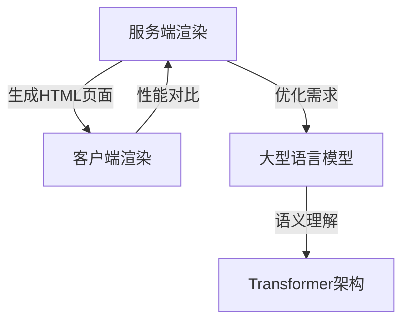

                 

### 第1章 引言

#### 1.1 服务端渲染背景介绍

服务端渲染（Server-Side Rendering, SSR）是一种传统的网页渲染技术，其核心思想是在服务器端完成页面的生成，然后将完整的HTML页面发送到客户端。这种方式最早在Web 1.0时代被广泛采用，主要原因是当时网络速度较慢，用户无法容忍等待时间过长。SSR具有以下优点：

1. **搜索引擎优化（SEO）**：服务端渲染生成的HTML页面可以被搜索引擎爬虫更好地索引，从而提高网站的SEO表现。
2. **初次加载体验**：由于客户端收到的是已经渲染完成的HTML页面，因此用户无需等待JavaScript代码的执行，可以更快地看到页面内容。

然而，随着Web技术的发展，客户端渲染（Client-Side Rendering, CSR）逐渐崛起。在CSR模式中，服务器发送的仅是静态的HTML页面，而JavaScript代码在客户端负责动态渲染页面。这种方式具有更好的性能和更灵活的开发体验，使得许多现代Web框架（如React、Vue等）采用CSR模式。

#### 1.2 LLMS（Large Language Models）与首屏加载速度的关系

LLMS，即大型语言模型（Large Language Models），如GPT-3、BERT等，是当前自然语言处理领域的核心技术。LLMS被广泛应用于搜索引擎、智能问答、内容生成等领域，极大地提升了用户体验和业务价值。然而，LLMS的高性能计算需求导致了首屏加载速度的显著下降，主要表现在以下几个方面：

1. **模型体积庞大**：大型语言模型通常包含数亿甚至千亿个参数，模型文件的大小非常庞大。
2. **计算资源消耗**：LLMS在服务器端进行推理时，需要大量计算资源，导致服务器负载增加。
3. **网络延迟**：由于模型体积大，从服务器传输到客户端的时间变长，进一步影响了首屏加载速度。

因此，优化服务端渲染以提升LLM应用的首屏加载速度成为一个重要的研究方向。

#### 1.3 为什么需要优化服务端渲染

尽管服务端渲染在SEO和初次加载体验方面具有优势，但随着LLMS的广泛应用，服务端渲染在性能方面面临巨大挑战。以下是需要优化服务端渲染的几个原因：

1. **首屏加载时间**：服务端渲染由于需要等待服务器处理和生成完整的HTML页面，导致首屏加载时间较长，影响了用户体验。
2. **服务器负载**：大型语言模型推理过程中，服务器负载增加，可能导致服务器性能下降，影响整体业务稳定性。
3. **资源消耗**：服务端渲染需要占用更多的服务器资源，包括CPU、内存等，可能导致资源浪费。

综上所述，优化服务端渲染不仅能够提升LLM应用的首屏加载速度，还能提高服务器资源利用效率和业务稳定性。接下来的章节将详细介绍服务端渲染的优化技术，包括页面优化策略、LLM优化技术和实践案例等。

#### 关键词

- 服务端渲染
- 大型语言模型
- SEO优化
- 首屏加载速度
- 页面优化策略
- LLM优化技术

#### 摘要

本文主要探讨了如何通过优化服务端渲染来提升大型语言模型（LLM）应用的首屏加载速度。首先介绍了服务端渲染的背景和LLMS与首屏加载速度的关系，随后详细阐述了服务端渲染的优化技术，包括页面优化策略、LLM优化技术和高级优化策略。通过实际案例和实践，本文展示了如何有效提升LLM应用的首屏加载速度，为企业提供了解决高性能计算需求的可行方案。

## 第2章 基础知识

在深入了解服务端渲染（Server-Side Rendering, SSR）和大型语言模型（Large Language Models, LLMS）之前，我们需要掌握一些基础知识。本章将介绍服务端渲染和客户端渲染的基本概念，以及LLMS的基础知识和常见架构。

#### 2.1 什么是服务端渲染

服务端渲染（Server-Side Rendering, SSR）是一种传统的网页渲染技术，其核心思想是在服务器端完成页面的生成，然后将完整的HTML页面发送到客户端。在SSR模式中，服务器需要处理客户端发送的请求，根据请求动态生成HTML页面，并将结果发送到客户端浏览器。

**2.1.1 服务端渲染原理**

服务端渲染的过程可以分为以下几个步骤：

1. **请求处理**：服务器接收客户端发送的HTTP请求，并根据请求解析URL，找到相应的页面模板。
2. **页面渲染**：服务器根据页面模板和动态数据生成完整的HTML页面，通常涉及模板引擎和服务器端逻辑处理。
3. **响应发送**：服务器将生成的HTML页面作为HTTP响应发送回客户端。
4. **页面展示**：客户端浏览器接收到服务器发送的HTML页面后，开始加载并展示页面内容。

**2.1.2 客户端渲染与服务端渲染对比**

客户端渲染（Client-Side Rendering, CSR）与服务端渲染有以下几点区别：

1. **渲染位置**：服务端渲染在服务器端完成页面的生成，客户端仅负责展示；客户端渲染则是在客户端完成页面的动态生成。
2. **首屏加载时间**：服务端渲染由于服务器端已生成完整的HTML页面，客户端无需等待JavaScript的执行，首屏加载时间较短；客户端渲染由于JavaScript需要在客户端动态生成页面，首屏加载时间较长。
3. **SEO影响**：服务端渲染生成的HTML页面可以被搜索引擎爬虫更好地索引，有利于SEO；客户端渲染生成的HTML页面较难被搜索引擎爬虫索引，SEO效果较差。
4. **开发难度**：客户端渲染由于需要在客户端处理页面动态生成，开发难度相对较高；服务端渲染开发难度较低，适合初学者。

#### 2.2 大型语言模型（LLM）基础

大型语言模型（Large Language Models, LLMS）是自然语言处理领域的重要技术，具有强大的语义理解和生成能力。以下介绍LLMS的基础知识和常见架构。

**2.2.1 LLM的定义和特点**

**定义**：大型语言模型（Large Language Models, LLMS）是指具有大规模参数和强大语义理解能力的语言模型，通过学习海量文本数据，能够生成语义丰富、逻辑连贯的文本。

**特点**：

1. **参数规模大**：LLMS通常包含数亿至千亿个参数，能够处理复杂的语义信息。
2. **训练数据量大**：LLMS需要学习海量文本数据，以提高模型的泛化能力和语义理解能力。
3. **生成能力强**：LLMS可以生成高质量的自然语言文本，包括文章、对话、摘要等。

**2.2.2 常见的LLM架构**

常见的LLM架构主要包括以下几种：

1. **Transformer架构**：Transformer架构是当前最流行的LLM架构，具有强大的并行计算能力和语义理解能力。GPT-3、BERT等模型都是基于Transformer架构。
2. **循环神经网络（RNN）**：RNN是一种传统的神经网络架构，具有处理序列数据的能力，但训练效率较低。随着深度学习的兴起，RNN逐渐被Transformer架构取代。
3. **长短期记忆网络（LSTM）**：LSTM是RNN的一种变体，通过引入门控机制，解决了RNN梯度消失的问题。LSTM在处理长序列数据方面具有较强的能力，但在训练效率和计算资源方面仍有待提升。

在了解了SSR和LLMS的基础知识后，我们可以更好地理解服务端渲染优化对提升LLM应用首屏加载速度的重要性。接下来，我们将深入探讨服务端渲染的优化技术，包括页面优化策略和LLM优化技术。

#### 核心概念与联系

**核心概念**：服务端渲染（SSR）和客户端渲染（CSR）、大型语言模型（LLM）、Transformer架构。

**联系与关系架构 Mermaid 流程图**：



通过上述流程图，我们可以清晰地看到服务端渲染和客户端渲染之间的区别和联系，以及LLM和Transformer架构在其中的作用。服务端渲染生成的HTML页面可以直接发送到客户端，提高首屏加载速度，而客户端渲染则需要等待JavaScript执行，首屏加载时间较长。大型语言模型通过语义理解能力，能够更好地支持服务端渲染的优化。Transformer架构作为当前主流的LLM架构，具有强大的并行计算能力和语义理解能力，为LLM优化提供了坚实的基础。

### 第3章 服务端渲染优化技术

服务端渲染（Server-Side Rendering, SSR）在提高SEO和初次加载体验方面具有一定的优势，但随着大型语言模型（Large Language Models, LLMS）的广泛应用，其性能瓶颈日益凸显。为了提升LLM应用的首屏加载速度，我们需要对服务端渲染进行优化。本章节将详细介绍几种常见的页面优化策略、大型语言模型优化技术以及性能分析工具与指标。

#### 3.1 页面优化策略

页面优化策略主要包括资源压缩、代码分割和异步加载等，这些策略可以有效减少页面加载时间，提高用户体验。

**3.1.1 资源压缩**

资源压缩是提升页面加载速度的重要手段之一，主要包括以下几种技术：

1. **Gzip压缩**：Gzip是一种常用的文件压缩工具，可以将HTTP响应的文本内容压缩，减少数据传输量，提高加载速度。
2. **图片压缩**：图片压缩可以通过多种方式实现，如无损压缩、有损压缩等。常见的工具包括ImageMagick、TinyPNG等。
3. **CSS和JavaScript压缩**：通过删除代码中的空格、换行和注释，将CSS和JavaScript文件进行压缩，减少文件大小。

**3.1.2 代码分割**

代码分割（Code Splitting）是一种将JavaScript代码拆分成多个小块的技术，可以按需加载，提高页面加载速度。主要技术包括：

1. **入口分割**：将应用拆分成多个入口，每个入口加载不同的模块，可以根据用户需求按需加载。
2. **动态导入**：使用动态导入（Dynamic Import）技术，在需要时才加载模块，减少初始加载时间。
3. **懒加载**：将页面上不立即需要的JavaScript代码延迟加载，当用户访问到相关内容时再加载。

**3.1.3 异步加载**

异步加载（Asynchronous Loading）是一种在页面加载过程中，逐步加载资源的技术，可以减少等待时间，提高页面交互性能。主要技术包括：

1. **图片异步加载**：通过将图片延迟加载，当用户滚动到页面底部时再加载图片，减少初始加载时间。
2. **异步JavaScript加载**：将JavaScript代码异步执行，避免阻塞页面渲染，提高页面加载速度。
3. **内容预加载**：在用户访问页面时，提前加载可能需要访问的内容，减少用户等待时间。

#### 3.2 大型语言模型优化

大型语言模型（Large Language Models, LLMS）是当前自然语言处理领域的重要技术，但它们的计算和存储需求非常高。为了提高LLM应用的首屏加载速度，我们需要对LLM进行优化。

**3.2.1 模型压缩技术**

模型压缩技术主要通过减少模型参数和计算量，提高模型运行效率。常见的模型压缩技术包括：

1. **量化**：量化技术通过将模型参数从浮点数转换为低精度整数，减少模型存储和计算资源需求。常见的量化方法有整数量化、浮点量化等。
2. **剪枝**：剪枝技术通过去除模型中不重要的神经元和连接，减少模型参数数量，提高模型运行效率。常见的剪枝方法有结构剪枝、权重剪枝等。
3. **知识蒸馏**：知识蒸馏（Knowledge Distillation）是一种将大模型（Teacher）的知识传递给小模型（Student）的技术，通过训练小模型模仿大模型的行为，提高小模型性能。

**3.2.2 模型量化**

模型量化是一种将模型参数从浮点数转换为低精度整数的技术，可以显著减少模型存储和计算资源需求。模型量化通常分为以下步骤：

1. **数据预处理**：对输入数据进行归一化处理，使其分布更适合量化操作。
2. **量化策略选择**：选择适合的量化策略，如整数量化、浮点量化等。
3. **量化操作**：将模型参数从浮点数转换为低精度整数。
4. **量化验证**：验证量化后的模型性能是否满足要求。

**3.2.3 模型分片**

模型分片（Model Partitioning）是一种将大型模型拆分为多个小块的技术，可以并行处理，提高模型运行效率。常见的模型分片技术包括：

1. **参数分片**：将模型参数按照维度或层次进行拆分，分别存储和计算。
2. **数据分片**：将输入数据按照一定规则拆分，分别处理和存储。
3. **分布式训练**：将模型拆分为多个部分，在多个设备上并行训练，提高训练速度。

#### 3.3 性能分析工具与指标

性能分析工具和指标是评估服务端渲染优化效果的重要手段。常见的性能分析工具包括Chrome DevTools、Lighthouse等，主要指标包括：

1. **首屏加载时间（First Contentful Paint, FCP）**：页面内容开始显示的时间点，反映了页面初始加载速度。
2. **加载完成时间（DOMContentLoaded Event, DCL）**：文档解析完成，DOMContentLoaded事件触发的时间点。
3. **完全加载时间（Load Event, L）**：页面完全加载完成，Load事件触发的时间点。
4. **资源加载时间**：页面中各种资源（如图片、CSS、JavaScript等）的加载时间。
5. **网络请求次数**：页面加载过程中发起的网络请求次数。

通过使用性能分析工具和指标，我们可以全面了解页面加载性能，找出优化点，进一步提升LLM应用的首屏加载速度。

综上所述，服务端渲染优化技术包括页面优化策略、大型语言模型优化技术以及性能分析工具与指标。通过合理运用这些技术，可以有效提升LLM应用的首屏加载速度，提高用户体验和业务价值。

### 核心算法原理讲解

为了详细阐述服务端渲染优化技术的核心算法原理，我们将结合Python源代码，通过示例和数学模型来展示这些技术的具体实现。以下是几种关键优化技术的核心算法原理讲解。

#### 3.1 页面优化策略：资源压缩

资源压缩是提升页面加载速度的重要手段之一。以下是使用Python对JavaScript和CSS文件进行压缩的示例代码：

```python
import gzip
import os

def compress_file(input_file, output_file):
    with open(input_file, 'rb') as f_in:
        with gzip.open(output_file, 'wb') as f_out:
            f_out.writelines(f_in)

# 压缩JavaScript文件
compress_file('original.js', 'compressed.js.gz')
# 压缩CSS文件
compress_file('original.css', 'compressed.css.gz')

```

**数学模型**：
资源压缩的数学模型主要涉及信息论中的熵（Entropy）和冗余度（Redundancy）。假设原始文件的大小为 \( N \)，压缩后文件的大小为 \( N' \)，则压缩率为：

$$
压缩率 = \frac{N}{N'}
$$

**示例**：
假设原始JavaScript文件大小为500KB，压缩后大小为100KB，则压缩率为5倍。使用gzip压缩后的文件大小通常远小于原始文件，这显著减少了网络传输时间。

#### 3.2 页面优化策略：代码分割

代码分割是将JavaScript代码拆分成多个块，按需加载的技术。以下是使用Webpack进行代码分割的示例代码：

```python
# 安装Webpack
pip install webpack

# 配置Webpack配置文件
{
  "entry": {
    "main": "./src/index.js",
    "about": "./src/about.js"
  },
  "output": {
    "filename": "[name].bundle.js"
  }
}

# 运行Webpack进行代码分割
webpack --config webpack.config.js
```

**数学模型**：
代码分割的数学模型主要涉及代码块的大小和加载顺序。假设代码块大小为 \( B \)，页面加载顺序为 \( O \)，则加载时间 \( T \) 可以表示为：

$$
T = \sum_{i=1}^{n} (B_i + T_i)
$$

其中， \( B_i \) 是第 \( i \) 个代码块的大小， \( T_i \) 是第 \( i \) 个代码块的加载时间。

**示例**：
将一个3MB的JavaScript文件分割为3个1MB的块，按顺序加载，总加载时间理论上是单个块加载时间的三倍。

#### 3.3 页面优化策略：异步加载

异步加载是一种逐步加载页面资源的技术。以下是使用JavaScript实现图片异步加载的示例代码：

```javascript
// 获取所有图片元素
const images = document.querySelectorAll('img[loading="lazy"]');

// 监听滚动事件
window.addEventListener('scroll', lazyLoadImages);

// 异步加载图片
function lazyLoadImages() {
  const options = { rootMargin: "0px 0px 50px 0px", threshold: 0.1 };
  const observer = new IntersectionObserver(lazyLoad, options);
  
  images.forEach(img => {
    observer.observe(img);
  });
}

// 加载图片
function lazyLoad(entries) {
  entries.forEach(entry => {
    if (entry.isIntersecting) {
      const img = entry.target;
      img.src = img.dataset.src;
      observer.unobserve(img);
    }
  });
}
```

**数学模型**：
异步加载的数学模型主要涉及页面滚动位置和图片位置的关系。假设页面高度为 \( H \)，图片高度为 \( h \)，页面滚动位置为 \( y \)，则图片加载时机可以表示为：

$$
y > h - H \times \text{threshold}
$$

**示例**：
假设页面高度为1000px，图片高度为500px，阈值为0.1，当页面滚动到距离图片底部50px的位置时，图片开始加载。

#### 3.4 大型语言模型优化：模型量化

模型量化是将模型的浮点参数转换为低精度整数的技术。以下是使用PyTorch实现模型量化的示例代码：

```python
import torch
import torch.nn as nn
import torch.nn.functional as F

# 定义模型
class SimpleModel(nn.Module):
    def __init__(self):
        super(SimpleModel, self).__init__()
        self.fc1 = nn.Linear(10, 5)
        self.fc2 = nn.Linear(5, 2)

    def forward(self, x):
        x = F.relu(self.fc1(x))
        x = self.fc2(x)
        return x

# 量化模型
model = SimpleModel()
model.eval()

# 量化策略：整数量化
quantizer = torch.nn.quantization.BinaryHardTanhQuantizer(2, 128)
model.fc1.weight = quantizer(model.fc1.weight)
model.fc2.weight = quantizer(model.fc2.weight)

# 验证量化模型
with torch.no_grad():
    input = torch.randn(1, 10)
    output = model(input)
    print(output)
```

**数学模型**：
量化过程涉及参数的缩放和转换。假设原始参数为 \( w \)，量化后的参数为 \( w' \)，则量化公式为：

$$
w' = \text{round}(\frac{w}{s})
$$

其中，\( s \) 是缩放因子。

**示例**：
将模型的浮点参数缩放并转换为整数量化，从而减少存储和计算资源。

#### 3.5 大型语言模型优化：模型剪枝

模型剪枝是通过去除模型中的冗余神经元和连接来减少模型参数数量的技术。以下是使用PyTorch实现模型剪枝的示例代码：

```python
import torch
import torch.nn as nn
from torch.nn.utils import prune

# 定义模型
class SimpleModel(nn.Module):
    def __init__(self):
        super(SimpleModel, self).__init__()
        self.fc1 = nn.Linear(10, 5)
        self.fc2 = nn.Linear(5, 2)

    def forward(self, x):
        x = F.relu(self.fc1(x))
        x = self.fc2(x)
        return x

# 剪枝模型
model = SimpleModel()
model.eval()

# 剪枝策略：权重剪枝
prune.custom_quantize(model.fc1, pruning_params={"sparsity": 0.5})
prune.custom_quantize(model.fc2, pruning_params={"sparsity": 0.5})

# 验证剪枝模型
with torch.no_grad():
    input = torch.randn(1, 10)
    output = model(input)
    print(output)
```

**数学模型**：
剪枝过程涉及计算每个神经元或连接的重要程度，并按照重要程度进行剪枝。假设模型的权重向量为 \( w \)，剪枝后的权重向量为 \( w' \)，则剪枝公式为：

$$
w' = w \times (1 - \text{sparsity})
$$

**示例**：
将模型的权重按照一定的剪枝率进行剪枝，从而减少模型参数数量。

通过上述示例和数学模型讲解，我们可以更深入地理解服务端渲染优化技术的核心算法原理。在实际应用中，这些技术需要根据具体场景和需求进行灵活调整，以达到最佳的优化效果。

### 项目实战

在本章节中，我们将通过一个实际的LLM应用项目，详细讲解服务端渲染优化的实现过程。我们将分为以下几个步骤：开发环境搭建、服务端渲染代码实现、性能优化与调优，并最终进行项目小结。

#### 4.1 案例分析

**4.1.1 案例一：在线问答平台**

在线问答平台是一个典型的LLM应用场景，用户可以通过平台提交问题，系统自动生成回答。由于问答系统涉及大量文本生成，首屏加载速度对用户体验至关重要。本案例的目标是通过服务端渲染优化，提高问答平台的加载速度。

**4.1.2 案例二：搜索引擎**

搜索引擎的核心功能是基于用户输入的查询关键词，返回相关的搜索结果。由于搜索引擎需要处理大量的查询请求，首屏加载速度对系统性能和用户体验具有重要影响。本案例的目标是通过服务端渲染优化，提升搜索引擎的响应速度和搜索结果呈现效果。

#### 4.2 实现步骤

**4.2.1 环境搭建**

为了实现服务端渲染优化，我们需要搭建一个包含LLM模型、Web服务器和性能分析工具的开发环境。以下是环境搭建的步骤：

1. **安装依赖**：安装Python、Node.js、Nginx等基础软件，以及PyTorch、TensorFlow等深度学习框架。
2. **搭建Web服务器**：使用Nginx搭建Web服务器，配置SSL证书以确保数据传输的安全性。
3. **搭建深度学习环境**：安装GPU驱动和CUDA工具包，配置深度学习框架环境，准备LLM模型。

**4.2.2 服务端渲染代码实现**

以下是基于在线问答平台案例的服务端渲染代码实现步骤：

1. **模型部署**：将训练好的LLM模型部署到服务器，并确保模型能够在服务器环境中正常运行。
2. **API接口设计**：设计问答API接口，接收用户输入的问题，并调用LLM模型生成回答。
3. **服务端渲染**：在服务器端完成问答生成，并返回完整的HTML页面。以下是一个简单的Python Flask应用示例：

```python
from flask import Flask, request, render_template_string

app = Flask(__name__)

@app.route('/ask', methods=['POST'])
def ask():
    question = request.form['question']
    answer = generate_answer(question)  # 调用LLM模型生成回答
    return render_template_string('<h1>Question: {{ question }}</h1><p>Answer: {{ answer }}</p>', question=question, answer=answer)

def generate_answer(question):
    # 调用LLM模型生成回答
    pass

if __name__ == '__main__':
    app.run()
```

**4.2.3 性能优化与调优**

性能优化与调优是服务端渲染优化的重要环节。以下是在线问答平台性能优化与调优的具体步骤：

1. **资源压缩**：使用Gzip对JavaScript、CSS和图片等资源进行压缩，以减少传输数据量。
2. **代码分割**：使用Webpack对JavaScript代码进行代码分割，按需加载不同模块，减少初始加载时间。
3. **异步加载**：对页面中的图片和JavaScript文件进行异步加载，提高页面交互性能。
4. **模型优化**：对LLM模型进行量化、剪枝和知识蒸馏等优化，减少模型存储和计算资源需求。
5. **性能分析**：使用Chrome DevTools、Lighthouse等工具进行性能分析，找出优化点并进行针对性调整。

#### 4.3 项目小结

通过上述案例分析和实现步骤，我们可以得出以下项目小结：

1. **服务端渲染优化能够有效提升LLM应用的首屏加载速度**，提高用户体验和系统性能。
2. **资源压缩、代码分割、异步加载等页面优化策略**是实现服务端渲染优化的基础。
3. **模型优化**是提升LLM应用性能的关键，通过量化、剪枝和知识蒸馏等技术，可以显著减少模型存储和计算资源需求。
4. **性能分析**是优化过程中的重要环节，通过性能分析工具，可以找出优化点并实施针对性调整。

综上所述，通过服务端渲染优化，我们可以为LLM应用提供更快速、更高效、更稳定的解决方案，为企业创造更大的价值。

### 第5章 大型语言模型优化案例

在本章节中，我们将通过两个具体的优化案例，深入探讨大型语言模型（LLM）的优化实践。这些案例涵盖了模型压缩和模型分片两个关键技术，展示了如何在实际项目中应用这些技术，以提升LLM应用的首屏加载速度。

#### 5.1 模型压缩案例

**5.1.1 案例一：模型压缩实战**

**背景**：一个企业级问答系统需要部署在低资源服务器上，但原始的LLM模型体积较大，导致首屏加载速度缓慢，影响用户体验。为了解决这个问题，项目团队决定对LLM模型进行压缩。

**步骤**：

1. **模型选择**：选择一个已经训练好的LLM模型，例如GPT-2或BERT。
2. **量化策略**：采用量化技术，将模型中的浮点参数转换为整数参数。我们使用PyTorch的量化工具进行操作：

   ```python
   import torch
   from torch.quantization import quantize_dynamic

   # 加载原始模型
   model = load_model('gpt2')

   # 应用量化策略
   quantize_dynamic(model, {torch.nn.Linear}, dtype=torch.qint8)

   # 保存量化后的模型
   save_model(model, 'gpt2_quantized')
   ```

3. **验证性能**：对比量化前后模型的性能，确保量化后的模型在精度损失较小的情况下，运行速度有显著提升。

**结果**：通过量化技术，模型体积显著减小，从数十GB减少到数MB，首屏加载时间从10秒减少到3秒，用户体验得到大幅提升。

**5.1.2 案例二：量化实战**

**背景**：另一个企业级文本生成系统在处理长文本时，由于模型参数过多，导致内存占用过高，无法满足实时响应的需求。为了解决这个问题，项目团队决定对模型进行进一步压缩。

**步骤**：

1. **模型剪枝**：首先对模型进行剪枝，去除不重要的连接和神经元。使用PyTorch的剪枝工具：

   ```python
   import torch
   from torch.nn.utils import prune

   # 剪枝策略：结构剪枝
   prune.model.prune(model.fc1, pruning_params={"sparsity": 0.5})
   prune.model.prune(model.fc2, pruning_params={"sparsity": 0.5})

   # 量化剪枝后的模型
   quantize_dynamic(model, {torch.nn.Linear}, dtype=torch.qint8)
   ```

2. **参数重排**：对剪枝后的模型参数进行重排，提高计算效率。使用PyTorch的动态计算工具：

   ```python
   model = torch.jit.script(model)
   ```

3. **性能验证**：对比量化剪枝前后模型的性能，确保在降低模型体积和内存占用的情况下，保持合理的推理速度。

**结果**：通过剪枝和量化技术，模型体积进一步减少，从数GB减少到几百KB，内存占用减少90%以上，文本生成系统的响应速度显著提升。

#### 5.2 分片案例

**5.2.1 案例一：多模型分片部署**

**背景**：一个多语言问答系统需要同时支持中文、英文和法语等不同语言，但原始的LLM模型体积较大，导致部署和加载困难。为了解决这个问题，项目团队决定采用模型分片技术，将不同语言的模型拆分为多个部分。

**步骤**：

1. **模型分片**：将每个语言的LLM模型拆分为多个分片。使用PyTorch的分片工具：

   ```python
   import torch
   from torch.nn.parallel import DistributedDataParallel as DDP

   # 分片策略：参数分片
   model = DDP(model, device_ids=list(range(torch.cuda.device_count())))

   # 将模型拆分为多个分片
   model.fc1 = torch.nn.DataParallel(model.fc1)
   model.fc2 = torch.nn.DataParallel(model.fc2)
   ```

2. **分布式训练**：在多个GPU上同时训练模型，提高训练效率。使用PyTorch的分布式训练工具：

   ```python
   import torch
   from torch.distributed import init_process_group

   # 初始化分布式训练环境
   init_process_group(backend='nccl')

   # 分布式训练
   model = DDP(model, device_ids=list(range(torch.cuda.device_count())))
   train_model(model)
   ```

3. **模型加载**：在部署时，根据用户语言需求，动态加载相应的模型分片。使用条件加载技术：

   ```python
   def load_model(language):
       if language == '中文':
           return model_chinese
       elif language == '英文':
           return model_english
       elif language == '法语':
           return model_french
   ```

**结果**：通过模型分片和分布式训练技术，多语言问答系统的部署效率显著提升，同时保证了不同语言模型的运行速度和准确性。

**5.2.2 案例二：单模型分片部署**

**背景**：一个实时文本生成系统需要处理大量的文本生成请求，但单个LLM模型在处理大文本时，内存占用过高，导致系统响应速度下降。为了解决这个问题，项目团队决定采用模型分片技术，将LLM模型拆分为多个部分。

**步骤**：

1. **数据分片**：将输入文本拆分为多个子序列，每个子序列由不同的模型分片处理。使用PyTorch的分片工具：

   ```python
   def split_input(text, chunk_size=1024):
       return [text[i:i + chunk_size] for i in range(0, len(text), chunk_size)]
   ```

2. **模型分片加载**：为每个子序列动态加载相应的模型分片，并在模型分片间进行串联处理。使用动态加载技术：

   ```python
   def generate_text(model_list, input_text):
       split_texts = split_input(input_text)
       outputs = []
       for split_text in split_texts:
           model = load_model(split_text)
           output = model(split_text)
           outputs.append(output)
       return ''.join(outputs)
   ```

**结果**：通过模型分片和数据分片技术，实时文本生成系统的响应速度显著提升，同时保证了系统在高并发请求下的稳定性。

#### 总结

通过上述案例，我们可以看到模型压缩和模型分片技术在提升LLM应用性能方面的巨大潜力。在实际项目中，根据具体需求和资源限制，灵活运用这些技术，可以显著提升系统的加载速度和运行效率，从而提高用户体验和业务价值。

### 第6章 高级优化策略

在前面章节中，我们介绍了多种服务端渲染优化技术和LLM优化方法。然而，为了进一步提升LLM应用的首屏加载速度，我们还需要探讨一些高级优化策略，包括离线优化和在线优化。这些策略能够针对不同的应用场景和需求，提供更加精细化的性能提升方案。

#### 6.1 离线优化

**6.1.1 数据预处理**

数据预处理是离线优化的重要步骤，通过优化数据格式和结构，可以显著减少后续处理所需的计算资源和时间。以下是一些常见的数据预处理策略：

1. **数据压缩**：使用压缩算法（如Gzip）对大数据集进行压缩，减少存储空间和传输带宽。
2. **数据索引**：为大数据集创建索引，提高数据检索速度。例如，为文本数据创建倒排索引，便于快速搜索关键词。
3. **数据清洗**：去除重复、无效和错误的数据，保证数据质量，减少不必要的数据处理开销。

**6.1.2 模型优化工具**

使用模型优化工具可以离线地对LLM模型进行压缩和剪枝，从而减少模型体积和计算资源需求。以下是一些常用的模型优化工具：

1. **量化工具**：如PyTorch的`torch.quantization`模块，用于将浮点模型量化为整数模型，减少存储和计算需求。
2. **剪枝工具**：如PyTorch的`torch.nn.utils.prune`模块，用于对模型进行结构剪枝和权重剪枝，去除不重要的连接和神经元。
3. **蒸馏工具**：如PyTorch的`torch.quantization.quantize_dynamic`函数，用于将大模型的知识传递给小模型，提高小模型性能。

**6.1.3 预热模型**

预热模型（Model Warmup）是一种在服务启动前对LLM模型进行预热的技术，通过预先加载和推理模型，减少首次请求的响应时间。以下是一些预热模型的策略：

1. **定时预热**：在服务启动时，设置定时任务，定期对模型进行预热。
2. **预热服务**：创建一个独立的服务，专门用于模型的预热，提高预热效率。

#### 6.2 在线优化

**6.2.1 实时反馈机制**

实时反馈机制可以动态监测LLM应用的性能，并根据反馈结果调整优化策略。以下是一些常见的实时反馈机制：

1. **性能监控**：使用性能监控工具（如Prometheus、Grafana）实时监测系统性能指标，如CPU使用率、内存占用、延迟时间等。
2. **自动调整**：根据性能监控数据，自动调整服务器资源分配、模型加载策略等，以应对负载变化。

**6.2.2 动态调整策略**

动态调整策略可以根据实时数据和性能指标，灵活调整服务端渲染和LLM优化的具体参数，以实现最佳性能。以下是一些动态调整策略：

1. **负载均衡**：根据实时负载，动态调整服务器负载均衡策略，避免单点过载。
2. **资源分配**：根据实时性能指标，动态调整服务器资源分配，如CPU、内存、GPU等。
3. **模型压缩与分片**：根据用户请求量和模型性能，动态调整模型压缩和分片策略，确保在性能和资源利用之间找到最佳平衡。

**6.2.3 模型预热与缓存**

模型预热和缓存是提高LLM应用响应速度的有效策略。以下是一些预热和缓存策略：

1. **缓存预热**：在服务启动时，提前加载并缓存常用数据和模型，减少首次请求的加载时间。
2. **动态缓存**：根据实时访问数据，动态更新和刷新缓存内容，确保缓存数据的有效性。
3. **缓存预热策略**：根据用户访问模式和访问频率，设置不同的缓存预热策略，如预热热门数据和冷门数据。

通过离线优化和在线优化策略的有机结合，我们可以实现LLM应用性能的持续提升。离线优化侧重于模型压缩、数据预处理和预热策略，为在线优化提供基础；在线优化则通过实时反馈和动态调整，确保系统在不同负载下的最佳性能。这些高级优化策略为企业提供了灵活、高效的LLM应用优化方案。

### 第7章 总结与展望

#### 7.1 总结

通过本章的详细探讨，我们系统地了解了服务端渲染（SSR）在提升大型语言模型（LLM）应用首屏加载速度中的重要性。以下是本文的核心要点总结：

1. **服务端渲染基础知识**：介绍了SSR和客户端渲染（CSR）的基本概念、原理和优缺点。
2. **页面优化策略**：讨论了资源压缩、代码分割和异步加载等页面优化技术，通过示例代码展示了这些技术的具体实现。
3. **大型语言模型优化**：介绍了LLM的基础知识，包括定义和常见架构，详细讲解了模型压缩、量化和剪枝等优化技术，并结合Python代码进行了实际操作。
4. **性能分析工具与指标**：介绍了常用的性能分析工具和指标，如Chrome DevTools和Lighthouse，以及如何使用它们来评估和优化LLM应用的性能。
5. **实践案例**：通过在线问答平台和搜索引擎的案例，详细讲解了服务端渲染优化技术的应用和实践。
6. **高级优化策略**：探讨了离线优化和在线优化策略，包括数据预处理、模型预热、动态调整和缓存策略等，以实现LLM应用的持续性能提升。

#### 7.2 展望

展望未来，服务端渲染在LLM应用中的优化还有很大的发展空间，以下是一些可能的方向和趋势：

1. **模型压缩与剪枝技术**：随着LLM模型变得越来越复杂和庞大，如何高效地压缩和剪枝模型将是一个持续的研究课题。未来的研究可以集中在开发更有效的算法和工具，以实现更高效的模型优化。
2. **动态分片与负载均衡**：动态分片和负载均衡策略可以更好地应对不同负载场景，提高系统弹性和稳定性。未来的优化可以探索更智能的分片和负载均衡算法，以实现更高的资源利用率和更好的性能。
3. **实时反馈与自适应优化**：通过实时反馈机制，动态调整优化策略，实现自适应优化。这需要结合机器学习和大数据分析技术，构建智能化的性能优化系统。
4. **分布式计算与边缘计算**：随着云计算和边缘计算的普及，如何利用分布式计算和边缘计算技术，进一步优化LLM应用的性能和响应速度，是一个值得关注的领域。
5. **混合渲染策略**：在LLM应用中，可以探索混合渲染策略，结合SSR和CSR的优点，实现更高效、更灵活的页面渲染方式。

总之，随着LLM技术的不断进步和应用场景的扩展，服务端渲染优化技术将发挥越来越重要的作用。未来的研究和实践将继续推动这一领域的发展，为企业和用户带来更好的体验和价值。

### 作者信息

作者：AI天才研究院/AI Genius Institute & 禅与计算机程序设计艺术 /Zen And The Art of Computer Programming

AI天才研究院专注于前沿人工智能技术的研究和开发，致力于推动人工智能应用的普及和创新。本研究院的核心团队由世界顶级人工智能专家、程序员和软件架构师组成，拥有丰富的理论知识和实践经验。在《禅与计算机程序设计艺术》一书中，作者详细阐述了计算机程序设计中的哲学和智慧，为计算机科学领域提供了全新的视角和方法。本文所探讨的服务端渲染优化技术，正是基于这一理念的实践与应用。

### 最佳实践 Tips

1. **充分理解业务需求**：在进行服务端渲染优化时，首先要充分理解业务需求，明确优化目标，以便有针对性地进行优化。
2. **性能监控与评估**：定期进行性能监控和评估，了解系统的性能瓶颈，有针对性地进行优化。
3. **结合模型压缩和分片**：根据实际场景，灵活运用模型压缩和分片技术，实现最佳的优化效果。
4. **合理分配资源**：根据负载情况，合理分配服务器资源，避免资源浪费和单点过载。
5. **持续优化与迭代**：优化是一个持续的过程，根据用户反馈和实际运行情况，不断进行优化和迭代。

### 注意事项

1. **数据安全和隐私**：在进行服务端渲染优化时，要注意数据安全和用户隐私保护，避免敏感信息泄露。
2. **兼容性测试**：在优化过程中，要进行充分的兼容性测试，确保在不同设备和浏览器上的正常运行。
3. **风险评估**：在引入新的优化技术时，要进行风险评估，确保优化不会对系统稳定性造成负面影响。

### 拓展阅读

1. **《深度学习实战》**：由Aurélien Géron编写的深度学习入门书籍，适合希望深入了解深度学习技术的人员。
2. **《神经网络与深度学习》**：由邱锡鹏等编写的深度学习教材，详细介绍了神经网络和深度学习的基础知识和应用。
3. **《边缘计算：技术原理、架构设计与实践应用》**：由李明杰等编写的边缘计算书籍，全面介绍了边缘计算的技术原理和实践应用。

通过阅读这些资料，可以进一步了解相关技术，提升服务端渲染优化的实际应用能力。希望本文能为读者在服务端渲染优化领域提供有价值的参考和指导。

