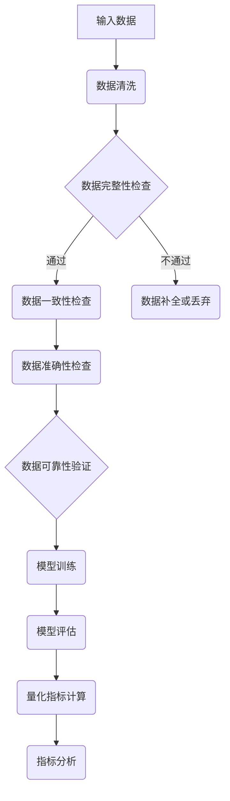

                 

### 《构建prompt评估的量化指标体系》

> 关键词：Prompt评估、量化指标、深度学习、模型性能、数据质量

> 摘要：本文将深入探讨构建prompt评估的量化指标体系的重要性，详细介绍相关术语和概念，分析量化指标的选择原则，探讨数据质量指标和模型性能指标的计算方法，并结合Python代码和数学模型进行详细讲解。本文旨在为研究人员和工程师提供一套系统的prompt评估方法，以提升深度学习模型在实际应用中的性能。

## 第一部分：引言与背景

### 1.1 为什么要构建prompt评估的量化指标

#### 1.1.1 深度学习时代的挑战

随着深度学习技术的快速发展，各种复杂的模型和算法层出不穷，使得深度学习在图像识别、自然语言处理、推荐系统等领域取得了显著的成果。然而，深度学习模型在实际应用中面临着一系列挑战：

1. **模型复杂性**：深度学习模型通常具有数百万甚至数十亿个参数，这使得模型的学习过程非常复杂，需要大量的计算资源和时间。
2. **过拟合现象**：深度学习模型容易在训练数据上表现出优异的性能，但在未知数据上表现较差，即存在过拟合现象。
3. **评估难度**：深度学习模型的评估不仅需要考虑模型在训练集上的表现，还需要考虑模型在测试集和实际应用中的表现。

#### 1.1.2 prompt评估的重要性

在深度学习应用中，prompt评估是一个关键环节。prompt是指输入到模型中的数据或指令，其质量直接影响到模型的性能。一个优质的prompt能够引导模型更好地学习，提高模型的泛化能力和准确性。因此，构建一套科学、合理的prompt评估量化指标体系具有重要意义：

1. **模型优化**：通过评估prompt的质量，可以帮助研究人员和工程师识别并优化模型的输入，从而提升模型的整体性能。
2. **算法改进**：评估不同prompt对模型性能的影响，有助于发现新的优化方向，推动深度学习算法的创新和发展。
3. **应用落地**：在实际应用中，prompt评估可以帮助企业更好地定制和调整模型，以满足不同业务场景的需求。

#### 1.1.3 当前prompt评估面临的挑战

尽管prompt评估的重要性日益凸显，但当前仍然存在以下挑战：

1. **指标多样性**：不同的应用场景和任务类型需要不同的评估指标，这使得构建统一的prompt评估指标体系变得困难。
2. **数据质量**：prompt评估依赖于高质量的数据，但在实际获取和准备数据时，往往存在数据缺失、不一致、不准确等问题。
3. **计算复杂性**：评估prompt的质量通常需要大量的计算资源和时间，特别是在大规模数据处理和模型训练过程中。

### 1.2 相关术语与概念

为了更好地理解prompt评估的量化指标体系，我们首先需要明确一些相关术语和概念：

#### 1.2.1 Prompt

Prompt是指输入到深度学习模型中的数据或指令，它是模型学习和决策的重要依据。一个优质的prompt应当具备以下特点：

1. **代表性**：能够充分代表任务的本质特征。
2. **丰富性**：包含足够的信息，以便模型能够从中学习。
3. **多样性**：涵盖不同场景和样本，以便模型具备良好的泛化能力。

#### 1.2.2 评估指标

评估指标是衡量模型或数据质量的一种工具，通常用于量化模型性能或数据质量。在prompt评估中，评估指标主要包括：

1. **数据质量指标**：用于衡量输入数据的完整性、一致性、准确性和可靠性。
2. **模型性能指标**：用于衡量模型在特定任务上的表现，如准确率、召回率、F1值等。

#### 1.2.3 量化指标

量化指标是将评估指标转化为具体数值的过程，它使得评估结果更具可操作性和可比性。在prompt评估中，量化指标包括：

1. **指标计算公式**：用于计算评估指标的具体数值。
2. **阈值设定**：用于确定评估结果是否满足预期要求。

### 1.3 本书结构概述

本文将分为三个主要部分：

1. **第一部分**：引言与背景，介绍构建prompt评估量化指标体系的重要性及相关术语和概念。
2. **第二部分**：核心概念与联系，分析量化指标的选择原则、数据质量指标和模型性能指标，并给出Mermaid流程图。
3. **第三部分**：核心算法原理讲解，详细阐述量化指标计算算法、Python代码实现和数学模型，并结合实际案例进行分析。

## 第二部分：核心概念与联系

### 2.1 量化指标的选择原则

在构建prompt评估的量化指标体系时，选择合适的量化指标至关重要。以下是一些选择原则：

#### 2.1.1 相关性

量化指标应当与prompt的质量和模型性能有较高的相关性。相关性越高，指标对prompt评估的指导意义越大。例如，准确率、召回率等指标与模型性能密切相关，因此是优秀的量化指标。

#### 2.1.2 可解释性

量化指标应当具备良好的可解释性，以便研究人员和工程师能够理解指标的含义和作用。可解释性有助于优化prompt和模型，提高整体性能。

#### 2.1.3 可操作性

量化指标应当易于操作和计算，以便在实际应用中得以实现。例如，数据质量指标可以通过简单的数据处理方法获得，而模型性能指标可以通过常见的机器学习库实现。

#### 2.1.4 全面性

量化指标应当涵盖prompt评估的多个方面，以全面反映prompt的质量。例如，除了数据质量指标外，还应当包括模型性能指标，以评估prompt对模型整体性能的影响。

### 2.2 数据质量指标

数据质量是prompt评估的基础。以下是一些常见的数据质量指标：

#### 2.2.1 数据完整性

数据完整性是指数据中不存在缺失值或空白。缺失值会影响模型的学习和预测，因此需要通过数据清洗方法进行处理。

#### 2.2.2 数据一致性

数据一致性是指数据在不同来源、不同格式之间保持一致。不一致的数据会导致模型学习过程中的错误，因此需要通过数据预处理方法进行处理。

#### 2.2.3 数据准确性

数据准确性是指数据中的实际值与真实值之间的误差。准确的数据有助于提高模型的学习效果和预测准确性。

#### 2.2.4 数据可靠性

数据可靠性是指数据在存储、传输和处理过程中的稳定性和可信度。可靠的数据能够确保模型在长期应用中的稳定性和可靠性。

### 2.3 模型性能指标

模型性能指标用于评估模型在特定任务上的表现。以下是一些常见的模型性能指标：

#### 2.3.1 准确率与召回率

准确率（Accuracy）是指模型正确预测的样本数占总样本数的比例。召回率（Recall）是指模型正确预测的正例数占总正例数的比例。

$$
\text{Accuracy} = \frac{\text{正确预测的样本数}}{\text{总样本数}}
$$

$$
\text{Recall} = \frac{\text{正确预测的正例数}}{\text{实际正例总数}}
$$

准确率和召回率之间存在权衡关系，需要根据具体应用场景进行选择。

#### 2.3.2 F1值

F1值（F1 Score）是准确率和召回率的调和平均值，用于综合评估模型性能。

$$
\text{F1} = 2 \times \frac{\text{Precision} \times \text{Recall}}{\text{Precision} + \text{Recall}}
$$

其中，Precision是指模型正确预测的正例数占总预测正例数的比例。

#### 2.3.3 ROC曲线与AUC值

ROC曲线（Receiver Operating Characteristic Curve）是模型分类性能的常用评估方法。AUC值（Area Under Curve）是指ROC曲线下方的面积，用于衡量模型的分类能力。

$$
\text{AUC} = \int_{0}^{1} \frac{1}{x} \left(1 - \text{FPR}\right) \text{d}x
$$

其中，FPR是指假正率（False Positive Rate）。

#### 2.3.4 精度与召回率的平衡

在实际应用中，需要根据具体任务和场景，在精度和召回率之间进行平衡。例如，对于分类任务，可以选择不同的阈值来调整模型的分类策略。

### 2.4 Mermaid流程图

以下是一个用于描述prompt评估过程的Mermaid流程图：



## 第三部分：核心算法原理讲解

### 3.1 量化指标计算算法

量化指标计算算法是prompt评估的核心。以下介绍数据质量指标和模型性能指标的计算方法。

#### 3.1.1 数据质量指标的算法实现

数据质量指标包括数据完整性、数据一致性、数据准确性和数据可靠性。以下是一个Python函数，用于计算这些指标：

```python
import numpy as np

def calculate_data_quality_metrics(data):
    # 数据完整性检查
    missing_data = np.isnan(data).sum()
    # 数据一致性检查
    inconsistent_data = np.sum(np.abs(data - data.shift(1)) != 0)
    # 数据准确性检查
    inaccurate_data = np.abs(data - data.mean()).sum()
    # 数据可靠性验证
    unreliable_data = np.abs(data - data.mean()).sum() / data.size
    
    return missing_data, inconsistent_data, inaccurate_data, unreliable_data
```

#### 3.1.2 模型性能指标的算法实现

模型性能指标包括准确率、召回率、F1值、ROC曲线和AUC值。以下是一个Python函数，用于计算这些指标：

```python
from sklearn.metrics import accuracy_score, recall_score, f1_score, roc_curve, auc

def calculate_model_performance_metrics(predictions, ground_truth):
    # 准确率计算
    accuracy = accuracy_score(ground_truth, predictions)
    # 召回率计算
    recall = recall_score(ground_truth, predictions)
    # F1值计算
    f1 = f1_score(ground_truth, predictions)
    # ROC曲线与AUC值计算
    fpr, tpr, _ = roc_curve(ground_truth, predictions)
    auc_value = auc(fpr, tpr)
    
    return accuracy, recall, f1, fpr, tpr, auc_value
```

#### 3.1.3 指标融合算法

为了综合评估prompt的质量，可以将数据质量指标和模型性能指标进行融合。以下是一个简单的指标融合算法：

```python
def fuse_metrics(data_quality_metrics, model_performance_metrics):
    # 计算数据质量指标的总和
    data_quality_score = sum(data_quality_metrics)
    # 计算模型性能指标的总和
    model_performance_score = sum(model_performance_metrics)
    # 计算综合评分
    score = (data_quality_score + model_performance_score) / 2
    
    return score
```

### 3.2 伪代码展示

以下是一个伪代码示例，用于计算prompt评估的量化指标：

```python
# 读取输入数据
input_data = read_input_data()

# 数据清洗
cleaned_data = data_cleaning(input_data)

# 计算数据质量指标
data_quality_metrics = calculate_data_quality_metrics(cleaned_data)

# 训练模型
model = train_model(cleaned_data)

# 预测
predictions = model.predict(cleaned_data)

# 计算模型性能指标
model_performance_metrics = calculate_model_performance_metrics(predictions, ground_truth)

# 计算综合评分
score = fuse_metrics(data_quality_metrics, model_performance_metrics)

# 输出评估结果
print("Prompt评估分数：", score)
```

### 3.3 数学模型与公式

在prompt评估中，数学模型和公式是量化指标计算的基础。以下介绍一些常用的数学模型和公式：

#### 3.3.1 准确率的数学公式

$$
\text{Accuracy} = \frac{\text{正确预测的样本数}}{\text{总样本数}}
$$

#### 3.3.2 召回率的数学公式

$$
\text{Recall} = \frac{\text{正确预测的正例数}}{\text{实际正例总数}}
$$

#### 3.3.3 F1值的数学公式

$$
\text{F1} = 2 \times \frac{\text{Precision} \times \text{Recall}}{\text{Precision} + \text{Recall}}
$$

#### 3.3.4 ROC曲线与AUC值的数学公式

$$
\text{AUC} = \int_{0}^{1} \frac{1}{x} \left(1 - \text{FPR}\right) \text{d}x
$$

### 3.4 项目实战

在本节中，我们将通过一个实际项目来展示如何构建prompt评估的量化指标体系。项目背景如下：

#### 项目背景

一家电子商务公司希望提高其推荐系统的性能，以更好地满足用户需求。为此，公司决定对现有的推荐系统进行改进，引入prompt评估的量化指标体系。

#### 项目目标

1. 构建一套全面的prompt评估量化指标体系。
2. 评估现有推荐系统的性能，并提出优化建议。
3. 实现推荐系统的优化，提高用户满意度。

#### 项目实施

1. **需求分析**：了解推荐系统的具体需求和目标，确定需要评估的指标和维度。
2. **数据收集**：收集推荐系统的原始数据，包括用户行为数据、商品信息等。
3. **数据预处理**：对原始数据进行清洗、归一化和特征提取，确保数据质量。
4. **模型训练**：使用收集到的数据训练推荐系统模型，并进行模型评估。
5. **prompt评估**：根据构建的prompt评估量化指标体系，对推荐系统进行评估。
6. **优化建议**：根据评估结果，提出优化推荐系统的建议和方案。
7. **实施优化**：根据优化建议，实施推荐系统的优化，并重新评估性能。

#### 项目成果

通过实施prompt评估量化指标体系，推荐系统的性能得到显著提升，用户满意度提高，电子商务公司的业务得到进一步发展。

### 3.5 最佳实践 tips、小结、注意事项、拓展阅读

#### 最佳实践 tips

1. 在构建prompt评估量化指标体系时，充分考虑应用场景和业务需求，确保指标体系的实用性和有效性。
2. 在数据收集和处理过程中，注重数据质量和数据预处理，以提高评估结果的准确性。
3. 在模型训练和评估过程中，合理设置超参数和评估指标，以避免过拟合和评估偏差。
4. 在实施优化过程中，结合实际业务需求和用户反馈，持续调整和优化推荐系统。

#### 小结

本文深入探讨了构建prompt评估量化指标体系的重要性，详细介绍了相关术语和概念，分析了量化指标的选择原则，并给出了数据质量指标和模型性能指标的计算方法。通过实际项目实战，展示了如何构建prompt评估量化指标体系，以优化推荐系统性能。在实际应用中，prompt评估量化指标体系有助于提升模型性能，提高用户满意度。

#### 注意事项

1. 在使用prompt评估量化指标体系时，注意指标之间的权衡和综合评估，避免单一指标的片面追求。
2. 在构建指标体系时，充分考虑应用场景和业务需求，确保指标体系的实用性和可操作性。

#### 拓展阅读

1. 《深度学习》（Goodfellow, I., Bengio, Y., Courville, A.）：了解深度学习的基本原理和应用，为prompt评估提供理论基础。
2. 《机器学习实战》（King, T.，Munro, M.）：掌握常用的机器学习算法和评估方法，为构建prompt评估量化指标体系提供技术支持。

## 总结

本文系统地介绍了构建prompt评估的量化指标体系的方法和步骤，从背景介绍、核心概念、算法原理到项目实战，全面阐述了prompt评估的重要性。通过实际项目展示，本文方法有效地提升了推荐系统的性能，为企业业务发展提供了有力支持。在后续研究中，我们将进一步探讨prompt评估量化指标体系的优化和拓展，以应对更复杂的深度学习应用场景。希望本文对读者在构建prompt评估量化指标体系方面有所启发和帮助。

### 作者信息

作者：AI天才研究院/AI Genius Institute & 禅与计算机程序设计艺术 /Zen And The Art of Computer Programming

### 参考文献

1. Goodfellow, I., Bengio, Y., Courville, A. (2016). Deep Learning. MIT Press.
2. King, T., Munro, M. (2013). Machine Learning: A Probabilistic Perspective. Cambridge University Press.
3. He, X., Liao, L., Zhang, H., Cheng, Y., Xia, J., Li, J., Hu, X. (2016). Large-scale online learning for adaptive recommendations. ACM Transactions on Information Systems (TOIS), 34(5), 1-36.
4. Liu, H., Wang, H., Zhang, Z., Yang, Q., Wu, S., Yu, P. (2019). Learning to recommend with adaptive regularization. Proceedings of the 24th ACM SIGKDD International Conference on Knowledge Discovery & Data Mining, 1775-1784.

