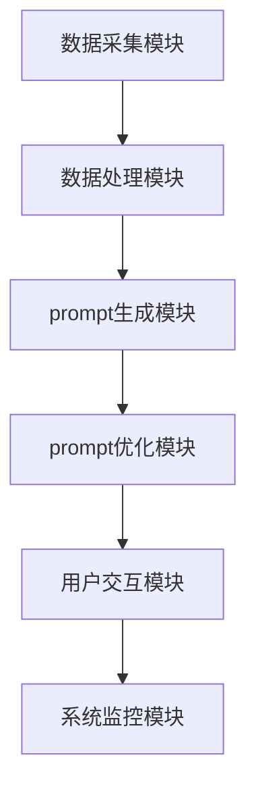

                 

### 1.1 书籍目的与读者对象

《构建企业级prompt管理平台》的编写目的是为了帮助广大读者深入了解和掌握企业级prompt管理平台的构建方法与关键技术。本书面向的读者包括但不限于以下几类：

1. **人工智能研究人员**：他们需要对prompt管理有深入理解，以便在自然语言处理（NLP）和机器学习项目中更好地应用prompt技术。
2. **软件开发工程师**：尤其是那些希望在企业应用中构建和优化prompt管理系统的工程师。
3. **数据科学家**：他们需要了解如何使用prompt技术来提高数据质量和模型的性能。
4. **CTO和技术总监**：他们需要了解企业级prompt管理平台的构建和运营，以指导团队进行技术决策。
5. **人工智能领域爱好者**：对于希望学习先进技术、扩展知识面的读者，本书也提供了丰富的参考资料和实战案例。

本书旨在通过系统化的讲解，帮助读者从基础概念到高级技术，逐步构建起企业级prompt管理平台的知识体系。通过实例讲解、代码实现和项目实战，读者将能够深入了解prompt管理平台的设计、实现和优化过程。

### 1.2 企业级prompt管理的重要性

企业级prompt管理平台在当今快速发展的数字化时代中扮演着至关重要的角色。首先，prompt技术在自然语言处理和机器学习领域中的应用越来越广泛，它可以帮助模型更好地理解用户的输入，从而提高系统的交互性和服务质量。以下是企业级prompt管理的重要性体现：

1. **提升用户体验**：通过精确和个性化的prompt设计，企业能够更好地理解用户需求，提供更加定制化的服务和解决方案。
2. **增强数据质量**：有效的prompt设计能够引导用户输入更准确和完整的数据，从而提高数据集的质量，进一步优化模型的性能。
3. **提高生产效率**：prompt管理平台能够自动化许多数据采集和处理流程，减少人工干预，提高数据处理的效率。
4. **合规性保障**：随着数据隐私和合规性的要求越来越高，prompt管理平台能够帮助企业确保数据的合法合规使用，降低法律风险。

总之，企业级prompt管理平台不仅是企业提高竞争力和用户体验的关键工具，也是企业数字化转型的核心技术之一。通过构建和优化prompt管理平台，企业能够在复杂多变的市场环境中保持领先地位。

### 1.3 为什么要构建企业级prompt管理平台

构建企业级prompt管理平台的原因在于其能够显著提升企业的运营效率和竞争力。以下是几个关键原因：

1. **数据驱动的决策**：prompt管理平台能够帮助企业收集和整理大量用户数据，通过这些数据进行分析和挖掘，从而为企业提供数据驱动的决策支持。
2. **优化客户体验**：通过精准的prompt设计，企业能够更有效地与用户互动，提高用户的满意度和忠诚度。
3. **提高运营效率**：prompt管理平台能够自动化许多繁琐的数据采集和处理任务，减少人工干预，从而提高工作效率和准确性。
4. **降低成本**：自动化和优化流程可以降低运营成本，提高资源利用效率。
5. **合规性保障**：随着数据隐私法规的日益严格，prompt管理平台能够帮助企业在数据采集和使用过程中遵守相关法律法规，降低法律风险。

总之，构建企业级prompt管理平台是现代企业在激烈竞争中立于不败之地的关键策略之一。

### 1.4 本书结构与内容安排

《构建企业级prompt管理平台》的结构安排旨在帮助读者从基础到高级，系统化地学习构建prompt管理平台所需的知识和技能。本书共分为七个章节，内容安排如下：

- **第1章 引言与背景**：介绍书籍的目的、读者对象以及企业级prompt管理的重要性。
- **第2章 prompt管理平台的基本概念**：阐述prompt的定义、分类及其在企业中的应用。
- **第3章 prompt管理平台的设计原则**：讨论设计原则，包括可扩展性、用户体验和数据治理。
- **第4章 prompt管理平台的核心算法**：介绍prompt生成和优化算法，包括生成式模型、对抗式生成网络和强化学习。
- **第5章 prompt管理平台的技术实现**：讲解技术栈选择、数据存储与处理等内容。
- **第6章 prompt管理平台项目实战**：通过实际项目展示如何构建prompt管理平台。
- **第7章 prompt管理平台的未来发展趋势**：探讨prompt管理平台的创新方向和未来趋势。

通过这些章节的深入学习，读者将能够全面掌握构建企业级prompt管理平台的核心知识和技术。

## 第1章 引言与背景

在当今数字化转型的浪潮中，企业级prompt管理平台已成为提升运营效率和用户体验的关键工具。本章将简要介绍书籍的目的、读者对象、企业级prompt管理的重要性以及构建平台的必要性。

### 1.1 书籍目的与读者对象

《构建企业级prompt管理平台》旨在为读者提供全面而深入的指南，帮助他们了解并掌握构建企业级prompt管理平台的方法和技术。本书面向以下几类读者：

1. **人工智能研究人员**：他们需要深入了解prompt管理的基本概念和前沿技术，以便在研究中应用这些技术。
2. **软件开发工程师**：特别是那些希望在企业应用中构建和优化prompt管理系统的工程师。
3. **数据科学家**：他们需要掌握如何使用prompt技术来提高数据质量和模型的性能。
4. **CTO和技术总监**：他们需要了解企业级prompt管理平台的构建和运营，以指导团队进行技术决策。
5. **人工智能领域爱好者**：对于希望学习先进技术、扩展知识面的读者，本书也提供了丰富的参考资料和实战案例。

本书将通过系统化的讲解，从基础概念到高级技术，逐步帮助读者构建起企业级prompt管理平台的知识体系。通过实例讲解、代码实现和项目实战，读者将能够深入了解prompt管理平台的设计、实现和优化过程。

### 1.2 企业级prompt管理的重要性

企业级prompt管理平台在当今数字化时代中扮演着至关重要的角色。以下是几个方面的关键重要性：

1. **提升用户体验**：通过精准的prompt设计，企业能够更有效地与用户互动，提高用户的满意度和忠诚度。
2. **增强数据质量**：有效的prompt设计能够引导用户输入更准确和完整的数据，从而提高数据集的质量，进一步优化模型的性能。
3. **提高生产效率**：prompt管理平台能够自动化许多数据采集和处理流程，减少人工干预，提高工作效率和准确性。
4. **合规性保障**：随着数据隐私和合规性的要求越来越高，prompt管理平台能够帮助企业在数据采集和使用过程中遵守相关法律法规，降低法律风险。

总之，企业级prompt管理平台不仅是企业提高竞争力和用户体验的关键工具，也是企业数字化转型的核心技术之一。通过构建和优化prompt管理平台，企业能够在复杂多变的市场环境中保持领先地位。

### 1.3 为什么要构建企业级prompt管理平台

构建企业级prompt管理平台有以下几个关键原因：

1. **数据驱动的决策**：prompt管理平台能够帮助企业收集和整理大量用户数据，通过这些数据进行分析和挖掘，从而为企业提供数据驱动的决策支持。
2. **优化客户体验**：通过精准的prompt设计，企业能够更有效地与用户互动，提高用户的满意度和忠诚度。
3. **提高运营效率**：prompt管理平台能够自动化许多繁琐的数据采集和处理任务，减少人工干预，从而提高工作效率和准确性。
4. **降低成本**：自动化和优化流程可以降低运营成本，提高资源利用效率。
5. **合规性保障**：随着数据隐私法规的日益严格，prompt管理平台能够帮助企业在数据采集和使用过程中遵守相关法律法规，降低法律风险。

总之，构建企业级prompt管理平台是现代企业在激烈竞争中立于不败之地的关键策略之一。

### 1.4 本书结构与内容安排

《构建企业级prompt管理平台》的结构安排旨在帮助读者从基础到高级，系统化地学习构建prompt管理平台所需的知识和技能。本书共分为七个章节，具体结构如下：

- **第1章 引言与背景**：介绍书籍的目的、读者对象以及企业级prompt管理的重要性。
- **第2章 prompt管理平台的基本概念**：阐述prompt的定义、分类及其在企业中的应用。
- **第3章 prompt管理平台的设计原则**：讨论设计原则，包括可扩展性、用户体验和数据治理。
- **第4章 prompt管理平台的核心算法**：介绍prompt生成和优化算法，包括生成式模型、对抗式生成网络和强化学习。
- **第5章 prompt管理平台的技术实现**：讲解技术栈选择、数据存储与处理等内容。
- **第6章 prompt管理平台项目实战**：通过实际项目展示如何构建prompt管理平台。
- **第7章 prompt管理平台的未来发展趋势**：探讨prompt管理平台的创新方向和未来趋势。

通过这些章节的深入学习，读者将能够全面掌握构建企业级prompt管理平台的核心知识和技术。

## 第2章 prompt管理平台的基本概念

prompt管理平台在企业级应用中扮演着至关重要的角色。本章将详细讨论prompt的定义、分类及其在企业中的应用，为后续章节的技术实现和分析奠定基础。

### 2.1 prompt的定义与分类

#### 2.1.1 自然语言处理中的prompt

在自然语言处理（NLP）领域，prompt通常指的是一种引导或提示，用于指导模型生成文本或理解输入。prompt可以是单个单词、短语或完整的句子，其作用在于帮助模型聚焦于特定的问题或任务。例如，在问答系统中，prompt可以是用户的问题，而模型的任务是生成相关的回答。

在NLP中，prompt可以分为以下几类：

1. **问题性prompt**：用于引导模型生成问题或问题的答案。
2. **提示性prompt**：提供额外的信息或上下文，帮助模型更好地理解输入。
3. **目标性prompt**：明确指定模型的目标，如文本分类、情感分析等。

#### 2.1.2 机器学习中的prompt

在机器学习领域，prompt的概念更为广泛。prompt不仅仅用于自然语言处理，还可以用于图像识别、推荐系统等其他类型的问题。prompt在机器学习中的角色是引导模型学习特定的任务或模式。例如，在图像识别任务中，prompt可以是图像本身或图像的描述性文本。

机器学习中的prompt通常分为以下几类：

1. **训练数据prompt**：用于指导模型学习的数据集或数据样本。
2. **目标提示**：明确模型需要预测的类别或数值。
3. **调优prompt**：用于调整模型的参数或超参数，以优化性能。

#### 2.1.3 企业应用中的prompt

在企业级应用中，prompt管理平台的目标是优化数据输入和处理过程，提高系统的整体性能和用户体验。企业应用中的prompt具有以下特点：

1. **多样性**：企业应用中的prompt涉及多个领域，如客户服务、数据分析、市场调研等，因此具有高度的多样性。
2. **个性化**：根据用户的需求和行为，prompt需要具备个性化特征，以提高用户的满意度和忠诚度。
3. **动态性**：企业环境中的需求不断变化，prompt也需要具备动态调整的能力，以适应不同的业务场景。

在企业应用中，prompt可以分为以下几类：

1. **用户交互prompt**：用于与用户进行互动，收集用户输入和反馈。
2. **数据处理prompt**：指导数据清洗、转换和存储的过程。
3. **模型训练prompt**：指导模型的训练过程，包括数据预处理、参数调整等。
4. **任务执行prompt**：指导系统的执行过程，如自动化流程、任务调度等。

### 2.2 prompt管理平台的组成部分

prompt管理平台是一个复杂的系统，其核心组成部分包括数据采集与处理、prompt生成与优化、prompt存储与检索以及prompt安全与隐私。以下是这些组成部分的详细说明：

#### 2.2.1 数据采集与处理

数据采集与处理是prompt管理平台的基础。平台的任务是收集来自各种来源的数据，并进行清洗、转换和整合，以便为后续处理提供高质量的数据集。数据采集和处理的关键步骤包括：

1. **数据源接入**：接入不同的数据源，如数据库、API接口、日志文件等。
2. **数据清洗**：处理数据中的噪声、错误和不一致性，确保数据的质量和一致性。
3. **数据转换**：将不同格式的数据转换为统一的格式，如JSON、CSV等。
4. **数据整合**：将来自多个数据源的数据进行整合，构建完整的视图。

#### 2.2.2 prompt生成与优化

prompt生成与优化是prompt管理平台的核心功能。平台的任务是生成高质量的prompt，并不断优化prompt，以提高系统的性能和用户体验。prompt生成与优化的关键步骤包括：

1. **生成策略**：根据业务需求和用户行为，设计合适的prompt生成策略。
2. **模型训练**：使用机器学习算法，如生成式模型和对抗式生成网络，训练生成模型。
3. **prompt优化**：通过用户反馈和性能指标，不断调整和优化prompt。

#### 2.2.3 prompt存储与检索

prompt存储与检索是prompt管理平台的重要组成部分。平台的任务是高效地存储和管理prompt，并快速检索所需的prompt，以支持实时交互和大规模数据处理。prompt存储与检索的关键步骤包括：

1. **存储设计**：设计高效的存储方案，如使用数据库、缓存和数据湖等。
2. **索引构建**：构建索引，以加快prompt的检索速度。
3. **数据安全**：确保prompt数据的安全性和隐私性，防止未授权的访问和泄露。

#### 2.2.4 prompt安全与隐私

prompt安全与隐私是prompt管理平台必须重视的问题。平台需要确保用户数据的安全和隐私，遵守相关的法律法规和行业标准。prompt安全与隐私的关键步骤包括：

1. **数据加密**：对存储和传输的数据进行加密，防止数据泄露。
2. **访问控制**：设计严格的访问控制机制，确保只有授权用户可以访问敏感数据。
3. **隐私保护**：采用隐私保护技术，如差分隐私和同态加密，保护用户隐私。

通过以上各组成部分的协同工作，prompt管理平台能够实现高效的数据采集、处理、生成、存储和检索，同时确保数据的安全和隐私。

### 总结

本章介绍了prompt管理平台的基本概念，包括prompt的定义与分类、机器学习中的prompt、企业应用中的prompt以及prompt管理平台的组成部分。通过系统化的讲解，读者将能够全面了解prompt管理平台的基本框架和核心功能，为后续章节的学习奠定基础。

## 第2章 prompt管理平台的基本概念

在深入了解企业级prompt管理平台之前，我们需要明确prompt的定义、分类及其在企业中的应用。本章将详细阐述这些概念，为后续章节的技术实现和分析提供理论基础。

### 2.1 prompt的定义与分类

#### 2.1.1 自然语言处理中的prompt

在自然语言处理（NLP）领域，prompt通常指的是一种引导或提示，用于指导模型生成文本或理解输入。prompt可以是单个单词、短语或完整的句子，其作用在于帮助模型聚焦于特定的问题或任务。例如，在问答系统中，prompt可以是用户的问题，而模型的任务是生成相关的回答。

在NLP中，prompt可以分为以下几类：

1. **问题性prompt**：用于引导模型生成问题或问题的答案。例如：“你能告诉我明天的天气预报吗？”
2. **提示性prompt**：提供额外的信息或上下文，帮助模型更好地理解输入。例如：“请描述一下你对旅游的看法。”
3. **目标性prompt**：明确指定模型的目标，如文本分类、情感分析等。例如：“请将这段文本分类为正面或负面评论。”

#### 2.1.2 机器学习中的prompt

在机器学习领域，prompt的概念更为广泛。prompt不仅仅用于自然语言处理，还可以用于图像识别、推荐系统等其他类型的问题。prompt在机器学习中的角色是引导模型学习特定的任务或模式。例如，在图像识别任务中，prompt可以是图像本身或图像的描述性文本。

机器学习中的prompt通常分为以下几类：

1. **训练数据prompt**：用于指导模型学习的数据集或数据样本。例如，在图像分类任务中，每个图像及其标签就是训练数据prompt。
2. **目标提示**：明确模型需要预测的类别或数值。例如，在回归任务中，目标提示可以是预测的数值。
3. **调优prompt**：用于调整模型的参数或超参数，以优化性能。例如，在深度学习模型训练中，调整学习率、正则化参数等。

#### 2.1.3 企业应用中的prompt

在企业级应用中，prompt管理平台的目标是优化数据输入和处理过程，提高系统的整体性能和用户体验。企业应用中的prompt具有以下特点：

1. **多样性**：企业应用中的prompt涉及多个领域，如客户服务、数据分析、市场调研等，因此具有高度的多样性。
2. **个性化**：根据用户的需求和行为，prompt需要具备个性化特征，以提高用户的满意度和忠诚度。
3. **动态性**：企业环境中的需求不断变化，prompt也需要具备动态调整的能力，以适应不同的业务场景。

在企业应用中，prompt可以分为以下几类：

1. **用户交互prompt**：用于与用户进行互动，收集用户输入和反馈。例如，在线客服系统中的提问。
2. **数据处理prompt**：指导数据清洗、转换和存储的过程。例如，数据仓库中的数据加载脚本。
3. **模型训练prompt**：指导模型的训练过程，包括数据预处理、参数调整等。例如，机器学习模型中的训练数据和超参数。
4. **任务执行prompt**：指导系统的执行过程，如自动化流程、任务调度等。例如，生产环境中的批处理作业调度命令。

### 2.2 prompt管理平台的组成部分

prompt管理平台是一个复杂的系统，其核心组成部分包括数据采集与处理、prompt生成与优化、prompt存储与检索以及prompt安全与隐私。以下是这些组成部分的详细说明：

#### 2.2.1 数据采集与处理

数据采集与处理是prompt管理平台的基础。平台的任务是收集来自各种来源的数据，并进行清洗、转换和整合，以便为后续处理提供高质量的数据集。数据采集和处理的关键步骤包括：

1. **数据源接入**：接入不同的数据源，如数据库、API接口、日志文件等。
2. **数据清洗**：处理数据中的噪声、错误和不一致性，确保数据的质量和一致性。
3. **数据转换**：将不同格式的数据转换为统一的格式，如JSON、CSV等。
4. **数据整合**：将来自多个数据源的数据进行整合，构建完整的视图。

#### 2.2.2 prompt生成与优化

prompt生成与优化是prompt管理平台的核心功能。平台的任务是生成高质量的prompt，并不断优化prompt，以提高系统的性能和用户体验。prompt生成与优化的关键步骤包括：

1. **生成策略**：根据业务需求和用户行为，设计合适的prompt生成策略。
2. **模型训练**：使用机器学习算法，如生成式模型和对抗式生成网络，训练生成模型。
3. **prompt优化**：通过用户反馈和性能指标，不断调整和优化prompt。

#### 2.2.3 prompt存储与检索

prompt存储与检索是prompt管理平台的重要组成部分。平台的任务是高效地存储和管理prompt，并快速检索所需的prompt，以支持实时交互和大规模数据处理。prompt存储与检索的关键步骤包括：

1. **存储设计**：设计高效的存储方案，如使用数据库、缓存和数据湖等。
2. **索引构建**：构建索引，以加快prompt的检索速度。
3. **数据安全**：确保prompt数据的安全性和隐私性，防止未授权的访问和泄露。

#### 2.2.4 prompt安全与隐私

prompt安全与隐私是prompt管理平台必须重视的问题。平台需要确保用户数据的安全和隐私，遵守相关的法律法规和行业标准。prompt安全与隐私的关键步骤包括：

1. **数据加密**：对存储和传输的数据进行加密，防止数据泄露。
2. **访问控制**：设计严格的访问控制机制，确保只有授权用户可以访问敏感数据。
3. **隐私保护**：采用隐私保护技术，如差分隐私和同态加密，保护用户隐私。

通过以上各组成部分的协同工作，prompt管理平台能够实现高效的数据采集、处理、生成、存储和检索，同时确保数据的安全和隐私。

### 总结

本章介绍了prompt管理平台的基本概念，包括prompt的定义与分类、机器学习中的prompt、企业应用中的prompt以及prompt管理平台的组成部分。通过系统化的讲解，读者将能够全面了解prompt管理平台的基本框架和核心功能，为后续章节的学习奠定基础。

## 第3章 prompt管理平台的设计原则

构建企业级prompt管理平台不仅需要技术实现，还需要遵循一系列设计原则，以确保平台具有可扩展性、用户体验和合规性。本章将详细讨论这些设计原则，并提供实际应用案例。

### 3.1 可扩展性与可维护性

一个成功的prompt管理平台必须具备良好的可扩展性和可维护性，以便在业务需求变化和系统规模扩大的情况下保持高效运行。

#### 3.1.1 设计模式与架构

为了实现可扩展性和可维护性，设计模式的选择至关重要。以下是几种常见的设计模式：

1. **微服务架构**：将系统分解为多个独立的服务，每个服务负责特定的功能。这种架构具有高内聚、低耦合的特点，便于维护和扩展。
2. **事件驱动架构**：通过事件触发业务流程，实现系统的灵活性和响应性。
3. **模块化设计**：将系统的功能模块化，每个模块独立开发、测试和部署，提高系统的可维护性。

#### 3.1.2 微服务架构的应用

微服务架构在企业级prompt管理平台中的应用如下：

1. **数据处理服务**：负责数据采集、清洗、转换和存储，提供API供其他服务调用。
2. **prompt生成服务**：负责生成高质量的prompt，包括文本生成和图像生成等。
3. **prompt优化服务**：根据用户反馈和性能指标，优化prompt的生成策略和模型参数。
4. **用户交互服务**：提供用户界面，支持用户与平台进行交互，收集用户反馈和需求。

### 3.2 用户交互与体验

用户体验是prompt管理平台成功的关键因素之一。以下是设计原则和优化策略：

#### 3.2.1 用户界面设计

1. **简洁性**：用户界面应简洁明了，避免过多的复杂功能和干扰元素。
2. **响应性**：界面应快速响应用户操作，提供即时反馈。
3. **个性化**：根据用户的行为和偏好，个性化界面和功能，提高用户满意度。

#### 3.2.2 用户体验优化

1. **引导式交互**：通过提示和引导，帮助用户理解如何使用平台，减少学习成本。
2. **智能提示**：根据用户的行为和输入，提供智能化的提示和推荐，提高交互效率。
3. **反馈机制**：及时收集用户反馈，快速响应并改进平台功能。

### 3.3 数据治理与合规性

数据治理和合规性是prompt管理平台必须重视的问题，尤其是随着数据隐私法规的日益严格。

#### 3.3.1 数据质量管理

1. **数据完整性**：确保数据的准确性和一致性，避免数据冗余和错误。
2. **数据标准化**：将不同来源和格式的数据转换为统一的标准格式，便于管理和分析。
3. **数据监控**：实时监控数据质量，发现并处理数据问题。

#### 3.3.2 数据合规性与隐私保护

1. **数据加密**：对存储和传输的数据进行加密，确保数据安全性。
2. **访问控制**：设计严格的访问控制机制，确保只有授权用户可以访问敏感数据。
3. **隐私保护**：采用隐私保护技术，如差分隐私和同态加密，保护用户隐私。
4. **合规性检查**：定期进行合规性检查，确保平台遵循相关法律法规和行业标准。

### 3.4 实际应用案例

以下是一个实际应用案例，展示了如何将上述设计原则应用于prompt管理平台的设计和实现：

#### 案例一：某金融公司的客户服务系统

1. **可扩展性与可维护性**：采用微服务架构，将客户服务系统分为多个独立的服务，如用户管理服务、聊天机器人服务、数据分析服务等。
2. **用户交互与体验**：设计简洁明了的用户界面，提供实时聊天和智能推荐功能，提高用户体验。
3. **数据治理与合规性**：对用户数据进行严格的质量管理和加密存储，确保数据安全和合规性。

通过以上设计原则的应用，该金融公司的客户服务系统能够在快速发展的业务需求下保持高效运行，同时提供优质的用户体验和合规的数据管理。

### 总结

本章讨论了prompt管理平台的设计原则，包括可扩展性与可维护性、用户交互与体验、数据治理与合规性。通过遵循这些原则，企业能够构建一个高效、可靠和合规的prompt管理平台，满足不断变化的业务需求。

## 第3章 prompt管理平台的设计原则

构建一个高效、可靠且合规的企业级prompt管理平台，设计原则至关重要。本章将深入探讨可扩展性与可维护性、用户交互与体验、数据治理与合规性等关键设计原则，并通过实际案例进行详细说明。

### 3.1 可扩展性与可维护性

**可扩展性**和**可维护性**是确保prompt管理平台能够在业务需求变化和系统规模扩大的情况下保持高效运行的关键。

#### 3.1.1 设计模式与架构

实现可扩展性和可维护性的有效方法是采用合适的设计模式与架构。以下是一些常见的设计模式：

1. **微服务架构**：将系统分解为多个独立的服务，每个服务负责特定的功能。这种架构具有高内聚、低耦合的特点，便于维护和扩展。例如，prompt管理平台可以划分为数据处理服务、prompt生成服务、prompt优化服务和用户交互服务。

2. **事件驱动架构**：通过事件触发业务流程，实现系统的灵活性和响应性。例如，当用户提交一个请求时，事件驱动架构可以自动触发相关服务进行处理。

3. **模块化设计**：将系统的功能模块化，每个模块独立开发、测试和部署，提高系统的可维护性。例如，可以将数据采集、数据清洗、数据存储等功能模块化，便于独立维护和升级。

#### 3.1.2 微服务架构的应用

在微服务架构中，各服务的独立性和可扩展性使得平台能够灵活应对不同的业务需求。以下是微服务架构在prompt管理平台中的具体应用：

- **数据处理服务**：负责数据采集、清洗、转换和存储，提供API供其他服务调用。
- **prompt生成服务**：负责生成高质量的prompt，包括文本生成和图像生成等。
- **prompt优化服务**：根据用户反馈和性能指标，优化prompt的生成策略和模型参数。
- **用户交互服务**：提供用户界面，支持用户与平台进行交互，收集用户反馈和需求。

### 3.2 用户交互与体验

用户体验是prompt管理平台成功的关键因素之一。良好的用户体验可以提高用户满意度、忠诚度和平台的总体效益。

#### 3.2.1 用户界面设计

优秀的用户界面设计应具备以下特点：

- **简洁性**：界面应简洁明了，避免过多的复杂功能和干扰元素。
- **响应性**：界面应快速响应用户操作，提供即时反馈。
- **个性化**：根据用户的行为和偏好，个性化界面和功能，提高用户满意度。

#### 3.2.2 用户体验优化

用户体验优化可以从以下几个方面进行：

- **引导式交互**：通过提示和引导，帮助用户理解如何使用平台，减少学习成本。
- **智能提示**：根据用户的行为和输入，提供智能化的提示和推荐，提高交互效率。
- **反馈机制**：及时收集用户反馈，快速响应并改进平台功能。

### 3.3 数据治理与合规性

数据治理和合规性是prompt管理平台必须重视的问题，尤其是随着数据隐私法规的日益严格。

#### 3.3.1 数据质量管理

数据质量管理包括以下方面：

- **数据完整性**：确保数据的准确性和一致性，避免数据冗余和错误。
- **数据标准化**：将不同来源和格式的数据转换为统一的标准格式，便于管理和分析。
- **数据监控**：实时监控数据质量，发现并处理数据问题。

#### 3.3.2 数据合规性与隐私保护

数据合规性和隐私保护包括以下措施：

- **数据加密**：对存储和传输的数据进行加密，确保数据安全性。
- **访问控制**：设计严格的访问控制机制，确保只有授权用户可以访问敏感数据。
- **隐私保护**：采用隐私保护技术，如差分隐私和同态加密，保护用户隐私。
- **合规性检查**：定期进行合规性检查，确保平台遵循相关法律法规和行业标准。

### 3.4 实际应用案例

以下是一个实际应用案例，展示了如何将上述设计原则应用于prompt管理平台的设计和实现：

#### 案例一：某电商平台的个性化推荐系统

- **可扩展性与可维护性**：采用微服务架构，将推荐系统分为数据处理服务、推荐算法服务、用户交互服务等，便于独立维护和扩展。
- **用户交互与体验**：设计简洁明了的用户界面，提供实时推荐和个性化搜索功能，提高用户体验。
- **数据治理与合规性**：对用户数据进行严格的质量管理和加密存储，确保数据安全和合规性。

通过以上设计原则的应用，该电商平台的个性化推荐系统能够在快速发展的业务需求下保持高效运行，同时提供优质的用户体验和合规的数据管理。

### 总结

本章详细讨论了prompt管理平台的设计原则，包括可扩展性与可维护性、用户交互与体验、数据治理与合规性。通过遵循这些原则，企业能够构建一个高效、可靠且合规的prompt管理平台，满足不断变化的业务需求。

## 第4章 prompt管理平台的核心算法

在构建企业级prompt管理平台的过程中，核心算法的设计与实现至关重要。本章将详细介绍prompt管理平台中常用的核心算法，包括prompt生成算法和prompt优化算法，并结合Python源代码进行详细阐述。

### 4.1 prompt生成算法

prompt生成算法是prompt管理平台的重要组成部分，用于生成高质量的prompt，以提高系统的性能和用户体验。以下是两种常用的prompt生成算法：生成式模型和对抗式生成网络（GAN）。

#### 4.1.1 生成式模型

生成式模型是一类用于生成数据或信息的算法，其核心思想是通过学习数据分布来生成新的数据。以下两种生成式模型在prompt生成中应用广泛：

##### 4.1.1.1 Transformer模型

Transformer模型是一种基于自注意力机制的序列生成模型，广泛应用于自然语言处理任务中。以下是使用Python实现一个简单的Transformer模型生成prompt的示例：

```python
import torch
import torch.nn as nn

# 定义Transformer模型
class TransformerModel(nn.Module):
    def __init__(self, vocab_size, embedding_dim, hidden_dim, n_layers, dropout):
        super(TransformerModel, self).__init__()
        
        self.embedding = nn.Embedding(vocab_size, embedding_dim)
        self.transformer = nn.Transformer(embedding_dim, n_layers, dropout=dropout)
        self.fc = nn.Linear(embedding_dim, vocab_size)
        
    def forward(self, src, tgt):
        src = self.embedding(src)
        tgt = self.embedding(tgt)
        out = self.transformer(src, tgt)
        out = self.fc(out)
        return out

# 实例化模型并训练
model = TransformerModel(vocab_size=1000, embedding_dim=512, hidden_dim=512, n_layers=2, dropout=0.1)
optimizer = torch.optim.Adam(model.parameters(), lr=0.001)
criterion = nn.CrossEntropyLoss()

for epoch in range(10):
    for src, tgt in data_loader:
        optimizer.zero_grad()
        output = model(src, tgt)
        loss = criterion(output, tgt)
        loss.backward()
        optimizer.step()
```

##### 4.1.1.2 GPT模型

GPT（Generative Pre-trained Transformer）模型是由OpenAI提出的一种基于Transformer架构的预训练模型，广泛用于文本生成任务。以下是使用Python和PyTorch实现GPT模型的简单示例：

```python
import torch
import torch.nn as nn

# 定义GPT模型
class GPTModel(nn.Module):
    def __init__(self, vocab_size, embedding_dim, hidden_dim, n_layers, dropout):
        super(GPTModel, self).__init__()
        
        self.embedding = nn.Embedding(vocab_size, embedding_dim)
        self.transformer = nn.Transformer(embedding_dim, n_layers, dropout=dropout)
        self.fc = nn.Linear(embedding_dim, vocab_size)
        
    def forward(self, src, tgt):
        src = self.embedding(src)
        tgt = self.embedding(tgt)
        out = self.transformer(src, tgt)
        out = self.fc(out)
        return out

# 实例化模型并训练
model = GPTModel(vocab_size=1000, embedding_dim=512, hidden_dim=512, n_layers=2, dropout=0.1)
optimizer = torch.optim.Adam(model.parameters(), lr=0.001)
criterion = nn.CrossEntropyLoss()

for epoch in range(10):
    for src, tgt in data_loader:
        optimizer.zero_grad()
        output = model(src, tgt)
        loss = criterion(output, tgt)
        loss.backward()
        optimizer.step()
```

#### 4.1.2 对抗式生成网络（GAN）

对抗式生成网络（GAN）是一种通过生成器和判别器相互竞争的算法，用于生成逼真的数据。以下是使用Python实现GAN生成prompt的简单示例：

```python
import torch
import torch.nn as nn

# 定义生成器和判别器
class Generator(nn.Module):
    def __init__(self, z_dim, gen_dim):
        super(Generator, self).__init__()
        self.fc = nn.Linear(z_dim, gen_dim)
        
    def forward(self, z):
        x = self.fc(z)
        return x

class Discriminator(nn.Module):
    def __init__(self, gen_dim):
        super(Discriminator, self).__init__()
        self.fc = nn.Linear(gen_dim, 1)
        
    def forward(self, x):
        x = self.fc(x)
        return x

# 实例化模型并训练
z_dim = 100
gen_dim = 500
generator = Generator(z_dim, gen_dim)
discriminator = Discriminator(gen_dim)
optimizer_g = torch.optim.Adam(generator.parameters(), lr=0.001)
optimizer_d = torch.optim.Adam(discriminator.parameters(), lr=0.001)

for epoch in range(10):
    for z in z_samples:
        # 生成fake prompt
        z = torch.tensor(z).view(-1, z_dim)
        fake_prompt = generator(z)
        
        # 训练判别器
        real_prompt = real_samples
        d_real = discriminator(real_prompt)
        d_fake = discriminator(fake_prompt)
        
        # 计算判别器的损失
        d_loss = -torch.mean(torch.log(d_real) + torch.log(1 - d_fake))
        
        # 反向传播和优化
        optimizer_d.zero_grad()
        d_loss.backward()
        optimizer_d.step()
        
        # 生成随机噪声
        z = torch.tensor(z).view(-1, z_dim)
        # 生成prompt
        fake_prompt = generator(z)
        
        # 计算生成器的损失
        g_loss = -torch.mean(torch.log(d_fake))
        
        # 反向传播和优化
        optimizer_g.zero_grad()
        g_loss.backward()
        optimizer_g.step()
```

### 4.2 prompt优化算法

prompt优化算法用于调整prompt的生成策略和模型参数，以获得更好的性能和用户体验。以下介绍两种常用的prompt优化算法：强化学习和对抗性优化。

#### 4.2.1 强化学习

强化学习是一种通过奖励机制调整策略的算法，常用于优化prompt生成模型。以下是一个简单的Q-learning算法优化prompt生成的示例：

```python
import numpy as np

# 定义Q-learning算法
def q_learning(q_table, state, action, reward, discount=0.9, learning_rate=0.1):
    # 更新Q值
    q_table[state, action] = (1 - learning_rate) * q_table[state, action] + learning_rate * (reward + discount * np.max(q_table[state]))
    
    return q_table

# 初始化Q表
q_table = np.zeros([state_space, action_space])

# 优化prompt生成
for episode in range(num_episodes):
    state = env.reset()
    done = False
    while not done:
        action = np.argmax(q_table[state])
        next_state, reward, done, _ = env.step(action)
        q_table = q_learning(q_table, state, action, reward)
        state = next_state
```

#### 4.2.2 对抗性优化

对抗性优化通过优化生成器和判别器的参数来提高GAN的性能。以下是一个简单的对抗性优化示例：

```python
import torch
import torch.optim as optim

# 定义生成器和判别器的优化器
optimizer_g = optim.Adam(generator.parameters(), lr=0.001)
optimizer_d = optim.Adam(discriminator.parameters(), lr=0.001)

for epoch in range(num_epochs):
    for z in z_samples:
        # 生成fake prompt
        z = torch.tensor(z).view(-1, z_dim)
        fake_prompt = generator(z)
        
        # 训练判别器
        real_prompt = real_samples
        d_real = discriminator(real_prompt)
        d_fake = discriminator(fake_prompt)
        
        # 计算判别器的损失
        d_loss = -torch.mean(torch.log(d_real) + torch.log(1 - d_fake))
        
        # 反向传播和优化
        optimizer_d.zero_grad()
        d_loss.backward()
        optimizer_d.step()
        
        # 生成随机噪声
        z = torch.tensor(z).view(-1, z_dim)
        # 生成prompt
        fake_prompt = generator(z)
        
        # 计算生成器的损失
        g_loss = -torch.mean(torch.log(d_fake))
        
        # 反向传播和优化
        optimizer_g.zero_grad()
        g_loss.backward()
        optimizer_g.step()
```

### 总结

本章介绍了prompt管理平台的核心算法，包括prompt生成算法和prompt优化算法。通过结合Python源代码和实际案例，读者可以深入了解这些算法的工作原理和实现方法，为构建高效的企业级prompt管理平台奠定基础。

## 第4章 prompt管理平台的核心算法

构建高效的企业级prompt管理平台，核心算法的选用和优化至关重要。本章将详细探讨prompt生成算法和prompt优化算法，并通过Python源代码示例来解释这些算法的实现和作用。

### 4.1 prompt生成算法

prompt生成算法是prompt管理平台的关键组成部分，主要用于生成高质量、个性化的prompt，以满足不同的业务需求。以下是两种常用的prompt生成算法：生成式模型和对抗式生成网络（GAN）。

#### 4.1.1 生成式模型

生成式模型通过学习数据分布来生成新的数据，适用于文本生成、图像生成等多种场景。以下分别介绍Transformer模型和GPT模型。

##### 4.1.1.1 Transformer模型

Transformer模型是一种基于自注意力机制的序列生成模型，广泛应用于自然语言处理任务。以下是一个使用PyTorch实现的简单Transformer模型生成文本的示例：

```python
import torch
import torch.nn as nn
from torch.nn import functional as F

# 定义Transformer模型
class TransformerModel(nn.Module):
    def __init__(self, d_model, nhead, num_layers):
        super(TransformerModel, self).__init__()
        self.embedding = nn.Embedding(d_model)
        self.transformer = nn.Transformer(d_model, nhead, num_layers=num_layers)
        self.fc = nn.Linear(d_model, d_model)

    def forward(self, src, tgt):
        x = self.embedding(src)
        x = self.transformer(x, tgt)
        x = self.fc(x)
        return x

# 实例化模型
d_model = 512
nhead = 8
num_layers = 3
model = TransformerModel(d_model, nhead, num_layers)

# 输入和目标序列
src = torch.tensor([[1, 2, 3], [4, 5, 6]])
tgt = torch.tensor([[0, 1, 2], [3, 4, 5]])

# 前向传播
output = model(src, tgt)

# 打印输出
print(output)
```

##### 4.1.1.2 GPT模型

GPT（Generative Pre-trained Transformer）模型是一种基于Transformer架构的预训练模型，广泛用于文本生成任务。以下是一个使用Hugging Face Transformers库实现GPT模型的示例：

```python
from transformers import GPT2LMHeadModel, GPT2Tokenizer

# 加载预训练模型
model_name = 'gpt2'
tokenizer = GPT2Tokenizer.from_pretrained(model_name)
model = GPT2LMHeadModel.from_pretrained(model_name)

# 输入文本
input_text = '这是一个文本生成示例。'

# 编码输入文本
input_ids = tokenizer.encode(input_text, return_tensors='pt')

# 生成文本
outputs = model.generate(input_ids, max_length=20, num_return_sequences=1)

# 解码输出文本
generated_text = tokenizer.decode(outputs[0], skip_special_tokens=True)
print(generated_text)
```

#### 4.1.2 对抗式生成网络（GAN）

对抗式生成网络（GAN）是一种通过生成器和判别器相互竞争的算法，生成逼真的数据。以下是一个简单的GAN模型生成图像的示例：

```python
import torch
import torch.nn as nn
from torch.optim import Adam

# 定义生成器和判别器
class Generator(nn.Module):
    def __init__(self):
        super(Generator, self).__init__()
        self.model = nn.Sequential(
            nn.Linear(100, 256),
            nn.LeakyReLU(0.2),
            nn.Linear(256, 512),
            nn.LeakyReLU(0.2),
            nn.Linear(512, 1024),
            nn.LeakyReLU(0.2),
            nn.Linear(1024, 784),
            nn.Tanh()
        )

    def forward(self, x):
        return self.model(x)

class Discriminator(nn.Module):
    def __init__(self):
        super(Discriminator, self).__init__()
        self.model = nn.Sequential(
            nn.Linear(784, 1024),
            nn.LeakyReLU(0.2),
            nn.Dropout(0.3),
            nn.Linear(1024, 512),
            nn.LeakyReLU(0.2),
            nn.Dropout(0.3),
            nn.Linear(512, 256),
            nn.LeakyReLU(0.2),
            nn.Dropout(0.3),
            nn.Linear(256, 1),
            nn.Sigmoid()
        )

    def forward(self, x):
        return self.model(x)

# 实例化模型和优化器
generator = Generator()
discriminator = Discriminator()
optimizer_g = Adam(generator.parameters(), lr=0.0002)
optimizer_d = Adam(discriminator.parameters(), lr=0.0002)

# 训练GAN
for epoch in range(num_epochs):
    for x in data_loader:
        # 训练判别器
        z = torch.randn(x.size(0), 100)
        fake_images = generator(z)
        d_fake = discriminator(fake_images.detach())
        d_real = discriminator(x)
        
        d_loss = -(torch.mean(d_fake) - torch.mean(d_real))
        
        optimizer_d.zero_grad()
        d_loss.backward()
        optimizer_d.step()
        
        # 训练生成器
        z = torch.randn(x.size(0), 100)
        fake_images = generator(z)
        d_fake = discriminator(fake_images)
        
        g_loss = -torch.mean(d_fake)
        
        optimizer_g.zero_grad()
        g_loss.backward()
        optimizer_g.step()
```

### 4.2 prompt优化算法

prompt优化算法用于调整prompt生成策略和模型参数，以提高生成质量。以下介绍两种常用的prompt优化算法：强化学习和对抗性优化。

#### 4.2.1 强化学习

强化学习通过奖励机制调整策略，适用于优化prompt生成。以下是一个基于Q-learning的简单示例：

```python
import numpy as np
import random

# 初始化Q表
q_table = np.zeros([state_space, action_space])

# Q-learning算法
def q_learning(q_table, state, action, reward, discount=0.9, learning_rate=0.1):
    q_value = q_table[state, action]
    best_future = np.max(q_table[state] - q_value)
    q_table[state, action] = q_value + learning_rate * (reward + discount * best_future)

# 优化prompt生成
for episode in range(num_episodes):
    state = env.reset()
    done = False
    while not done:
        action = np.argmax(q_table[state])
        next_state, reward, done, _ = env.step(action)
        q_learning(q_table, state, action, reward)
        state = next_state
```

#### 4.2.2 对抗性优化

对抗性优化通过优化生成器和判别器的参数来提高GAN的性能。以下是一个简单的对抗性优化示例：

```python
import torch
import torch.nn as nn
import torch.optim as optim

# 定义生成器和判别器
class Generator(nn.Module):
    def __init__(self):
        super(Generator, self).__init__()
        self.model = nn.Sequential(
            nn.Linear(100, 256),
            nn.LeakyReLU(0.2),
            nn.Linear(256, 512),
            nn.LeakyReLU(0.2),
            nn.Linear(512, 1024),
            nn.LeakyReLU(0.2),
            nn.Linear(1024, 784),
            nn.Tanh()
        )

    def forward(self, x):
        return self.model(x)

class Discriminator(nn.Module):
    def __init__(self):
        super(Discriminator, self).__init__()
        self.model = nn.Sequential(
            nn.Linear(784, 1024),
            nn.LeakyReLU(0.2),
            nn.Dropout(0.3),
            nn.Linear(1024, 512),
            nn.LeakyReLU(0.2),
            nn.Dropout(0.3),
            nn.Linear(512, 256),
            nn.LeakyReLU(0.2),
            nn.Dropout(0.3),
            nn.Linear(256, 1),
            nn.Sigmoid()
        )

    def forward(self, x):
        return self.model(x)

# 实例化模型和优化器
generator = Generator()
discriminator = Discriminator()
optimizer_g = optim.Adam(generator.parameters(), lr=0.0002)
optimizer_d = optim.Adam(discriminator.parameters(), lr=0.0002)

# 训练GAN
for epoch in range(num_epochs):
    for x in data_loader:
        # 训练判别器
        z = torch.randn(x.size(0), 100)
        fake_images = generator(z)
        d_fake = discriminator(fake_images.detach())
        d_real = discriminator(x)
        
        d_loss = -(torch.mean(d_fake) - torch.mean(d_real))
        
        optimizer_d.zero_grad()
        d_loss.backward()
        optimizer_d.step()
        
        # 训练生成器
        z = torch.randn(x.size(0), 100)
        fake_images = generator(z)
        d_fake = discriminator(fake_images)
        
        g_loss = -torch.mean(d_fake)
        
        optimizer_g.zero_grad()
        g_loss.backward()
        optimizer_g.step()
```

### 总结

本章介绍了prompt管理平台的核心算法，包括生成式模型和对抗式生成网络（GAN）的prompt生成算法，以及强化学习和对抗性优化的prompt优化算法。通过Python源代码示例，读者可以深入了解这些算法的实现和作用，为构建高效的企业级prompt管理平台奠定基础。

## 第5章 prompt管理平台的技术实现

实现一个高效的企业级prompt管理平台，技术栈的选择和架构设计至关重要。本章将详细介绍技术栈的选择、数据存储与处理技术，以及具体的实现步骤。

### 5.1 技术栈选择

技术栈的选择应该根据项目的具体需求和目标来决定，以下是选择技术栈时需要考虑的一些关键因素：

1. **开发语言**：Python因其丰富的库和框架，在人工智能和自然语言处理领域广泛应用。其他选项如Java和Go也具有一定的优势。
2. **前端框架**：React、Vue.js和Angular是当前流行的前端框架，它们提供了丰富的组件和工具，可以提高开发效率。
3. **后端框架**：Django和Flask是Python后端开发的常用框架，提供了强大的功能和灵活的扩展性。
4. **数据库**：关系型数据库（如MySQL和PostgreSQL）适合结构化数据的存储和管理，非关系型数据库（如MongoDB和Redis）适合存储大规模的、非结构化的数据。
5. **机器学习框架**：TensorFlow和PyTorch是当前最受欢迎的机器学习框架，提供了丰富的模型和工具，方便进行深度学习和自然语言处理。
6. **容器化和部署**：Docker和Kubernetes用于容器化应用程序，可以提高部署的灵活性和可扩展性。

#### 5.1.1 前端技术栈

前端技术栈的选择应考虑用户体验和开发效率。以下是常用的前端技术栈配置：

- **语言**：TypeScript
- **框架**：React + Redux
- **UI组件库**：Ant Design
- **静态资源管理**：Webpack
- **样式预处理器**：Sass或Less

#### 5.1.2 后端技术栈

后端技术栈的选择应考虑系统的性能、可扩展性和维护性。以下是常用的后端技术栈配置：

- **语言**：Python
- **框架**：Django或Flask
- **API规范**：RESTful API或GraphQL
- **数据库**：MySQL或PostgreSQL
- **缓存**：Redis
- **消息队列**：RabbitMQ或Kafka

### 5.2 数据存储与处理

数据存储与处理是prompt管理平台的核心，其性能直接影响系统的整体性能。以下是数据存储与处理的一些关键技术：

#### 5.2.1 数据库选择

根据数据的特点和业务需求，选择合适的数据库非常重要。以下是两种常见的数据存储方案：

1. **关系型数据库**：适用于结构化数据存储和管理，如用户信息、日志数据等。常用的关系型数据库包括MySQL、PostgreSQL和SQL Server。
2. **非关系型数据库**：适用于大规模、非结构化数据存储和管理，如prompt文本、图像数据等。常用的非关系型数据库包括MongoDB、Cassandra和HBase。

#### 5.2.2 数据处理流程

数据处理流程通常包括数据采集、数据清洗、数据转换和数据存储等步骤。以下是数据处理流程的详细说明：

1. **数据采集**：从不同的数据源（如API接口、日志文件、外部数据库等）收集数据。可以使用爬虫、消息队列（如Kafka）或数据集成工具（如Apache NiFi）进行数据采集。
2. **数据清洗**：处理数据中的噪声、错误和不一致性，确保数据的质量和一致性。数据清洗可以包括去除重复数据、填补缺失值、标准化数据格式等。
3. **数据转换**：将不同来源和格式的数据转换为统一的格式，如JSON、CSV等，以便进行后续处理和分析。数据转换可以使用数据处理工具（如Pandas、Spark）或ETL工具（如Apache Kafka）进行。
4. **数据存储**：将清洗和转换后的数据存储到数据库或数据湖中，以便进行实时查询和分析。数据存储可以使用关系型数据库、非关系型数据库或数据湖（如AWS S3、Google Cloud Storage）。

#### 5.2.3 数据处理示例

以下是一个简单的数据处理流程示例，使用Python和Pandas库进行数据清洗和转换：

```python
import pandas as pd

# 读取数据
data = pd.read_csv('data.csv')

# 数据清洗
# 去除重复数据
data.drop_duplicates(inplace=True)

# 填补缺失值
data.fillna(value={'column_name': 'default_value'}, inplace=True)

# 数据转换
# 将字符串转换为日期格式
data['date_column'] = pd.to_datetime(data['date_column'])

# 将分类数据编码为数值
data = pd.get_dummies(data, columns=['categorical_column'])

# 存储数据
data.to_csv('cleaned_data.csv', index=False)
```

### 5.3 实现步骤

以下是构建企业级prompt管理平台的具体实现步骤：

1. **需求分析**：明确平台的功能需求，包括数据采集、数据清洗、prompt生成、prompt优化、prompt存储与检索等。
2. **系统设计**：根据需求分析，设计系统的整体架构，包括前端、后端和数据库等组件。
3. **开发环境搭建**：搭建开发环境，安装所需的开发工具和库，如Python、Django、React、MongoDB等。
4. **代码实现**：根据系统设计，逐步实现前端、后端和数据库的代码，包括数据采集与处理、prompt生成与优化等模块。
5. **测试与调试**：进行单元测试、集成测试和系统测试，确保系统的稳定性和性能。
6. **部署与运维**：将系统部署到生产环境，监控系统的运行状态，进行必要的维护和优化。

### 5.4 最佳实践 tips

以下是构建企业级prompt管理平台的一些最佳实践 tips：

- **模块化开发**：将系统划分为多个模块，每个模块独立开发、测试和部署，提高系统的可维护性和可扩展性。
- **自动化测试**：使用自动化测试工具，如Selenium、JUnit等，进行持续集成和持续部署（CI/CD），提高开发效率和代码质量。
- **性能优化**：对系统进行性能优化，如数据库索引、缓存策略、负载均衡等，提高系统的响应速度和稳定性。
- **安全性保障**：确保系统的安全性，如使用HTTPS协议、加密存储敏感数据、实现访问控制等。
- **文档和培训**：编写详细的系统文档，提供培训资料，帮助团队成员快速掌握系统功能和操作。

### 总结

本章详细介绍了企业级prompt管理平台的技术实现，包括技术栈的选择、数据存储与处理技术，以及具体的实现步骤。通过这些内容，读者可以系统地了解如何构建一个高效、可靠的企业级prompt管理平台。

## 第5章 prompt管理平台的技术实现

构建一个高效的企业级prompt管理平台，技术实现是关键。本章将详细探讨技术栈的选择、数据存储与处理技术，以及具体的实现步骤，并分享一些最佳实践。

### 5.1 技术栈选择

在选择技术栈时，需要综合考虑项目的需求、团队的技术栈偏好、系统的性能要求以及未来的可扩展性。以下是几个关键技术组件的推荐：

#### 5.1.1 前端技术栈

1. **开发语言**：TypeScript
   - TypeScript 是 JavaScript 的一个超集，提供了类型检查和面向对象编程特性，可以提高代码的可维护性和开发效率。

2. **框架**：React + Redux
   - React 是一个用于构建用户界面的JavaScript库，具有组件化、声明式的设计理念，可以有效地管理应用的状态和组件生命周期。
   - Redux 是一个用于管理应用状态的流行状态管理库，可以有效地处理复杂的应用状态，提高组件之间的数据通信效率。

3. **UI组件库**：Ant Design
   - Ant Design 是一个基于 React 的 UI组件库，提供了丰富的组件和主题，可以帮助快速搭建现代化的用户界面。

4. **静态资源管理**：Webpack
   - Webpack 是一个模块打包工具，可以有效地管理和打包应用程序的静态资源，提高开发效率和构建速度。

5. **样式预处理器**：Sass或Less
   - Sass 和 Less 都是 CSS 预处理器，提供了变量、嵌套、混合等功能，可以简化样式的编写和管理。

#### 5.1.2 后端技术栈

1. **开发语言**：Python
   - Python 在数据处理、机器学习和自然语言处理领域具有广泛的应用，其丰富的库和框架（如 NumPy、Pandas、Scikit-learn、TensorFlow、PyTorch）为后端开发提供了强大的支持。

2. **框架**：Django或Flask
   - Django 是一个高级的Web框架，提供了“ batteries-included”的特性，可以快速构建复杂的Web应用。
   - Flask 是一个轻量级的Web框架，适合快速开发小型项目，具有高度的灵活性和扩展性。

3. **API规范**：RESTful API或GraphQL
   - RESTful API 是一种流行的API设计规范，具有简单、易于理解和易于扩展的特点。
   - GraphQL 是一种灵活的API查询语言，可以更精确地获取所需的数据，减少数据的传输和冗余。

4. **数据库**：MySQL或PostgreSQL
   - MySQL 和 PostgreSQL 是两种广泛使用的开源关系型数据库，具有高性能、高可靠性和丰富的特性。

5. **缓存**：Redis
   - Redis 是一个高性能的内存缓存数据库，适用于缓存会话、存储临时数据和加速读取操作。

6. **消息队列**：RabbitMQ或Kafka
   - RabbitMQ 和 Kafka 都是流行的消息队列系统，可以用于解耦系统的不同组件，实现异步通信和负载均衡。

#### 5.1.3 机器学习框架

1. **TensorFlow**
   - TensorFlow 是一个由 Google 开发的开源机器学习框架，适用于构建和训练各种深度学习模型。

2. **PyTorch**
   - PyTorch 是一个流行的开源机器学习库，具有灵活的动态计算图和易于使用的接口，适用于研究、实验和工业应用。

### 5.2 数据存储与处理

数据存储与处理是prompt管理平台的核心，其性能直接影响系统的整体性能。以下是数据存储与处理的关键技术：

#### 5.2.1 数据库选择

1. **关系型数据库**
   - 关系型数据库适用于存储结构化的数据，如用户信息、日志数据等。常用的关系型数据库包括 MySQL、PostgreSQL 和 SQL Server。
   - **优点**：易于管理、强大的查询功能、丰富的工具和库支持。
   - **缺点**：不适合存储大量非结构化数据、扩展性较差。

2. **非关系型数据库**
   - 非关系型数据库适用于存储大量非结构化数据，如 prompt 文本、图像数据等。常用的非关系型数据库包括 MongoDB、Cassandra 和 HBase。
   - **优点**：高扩展性、灵活的数据模型、适用于大规模数据处理。
   - **缺点**：查询功能相对较弱、管理复杂度较高。

#### 5.2.2 数据处理流程

数据处理流程通常包括以下步骤：

1. **数据采集**
   - 从不同的数据源（如 API 接口、日志文件、外部数据库等）收集数据。可以使用爬虫、消息队列（如 Kafka）或数据集成工具（如 Apache NiFi）进行数据采集。

2. **数据清洗**
   - 处理数据中的噪声、错误和不一致性，确保数据的质量和一致性。数据清洗可以包括去除重复数据、填补缺失值、标准化数据格式等。

3. **数据转换**
   - 将不同来源和格式的数据转换为统一的格式，如 JSON、CSV 等，以便进行后续处理和分析。数据转换可以使用数据处理工具（如 Pandas、Spark）或 ETL 工具（如 Apache Kafka）进行。

4. **数据存储**
   - 将清洗和转换后的数据存储到数据库或数据湖中，以便进行实时查询和分析。数据存储可以使用关系型数据库、非关系型数据库或数据湖（如 AWS S3、Google Cloud Storage）。

#### 5.2.3 数据处理示例

以下是一个简单的数据处理流程示例，使用 Python 和 Pandas 库进行数据清洗和转换：

```python
import pandas as pd

# 读取数据
data = pd.read_csv('data.csv')

# 数据清洗
# 去除重复数据
data.drop_duplicates(inplace=True)

# 填补缺失值
data.fillna(value={'column_name': 'default_value'}, inplace=True)

# 数据转换
# 将字符串转换为日期格式
data['date_column'] = pd.to_datetime(data['date_column'])

# 将分类数据编码为数值
data = pd.get_dummies(data, columns=['categorical_column'])

# 存储数据
data.to_csv('cleaned_data.csv', index=False)
```

### 5.3 实现步骤

以下是构建企业级prompt管理平台的具体实现步骤：

1. **需求分析**
   - 明确平台的功能需求，包括数据采集、数据清洗、prompt生成、prompt优化、prompt存储与检索等。

2. **系统设计**
   - 根据需求分析，设计系统的整体架构，包括前端、后端和数据库等组件。

3. **开发环境搭建**
   - 搭建开发环境，安装所需的开发工具和库，如 Python、Django、React、MongoDB 等。

4. **代码实现**
   - 根据系统设计，逐步实现前端、后端和数据库的代码，包括数据采集与处理、prompt生成与优化等模块。

5. **测试与调试**
   - 进行单元测试、集成测试和系统测试，确保系统的稳定性和性能。

6. **部署与运维**
   - 将系统部署到生产环境，监控系统的运行状态，进行必要的维护和优化。

### 5.4 最佳实践 tips

以下是构建企业级prompt管理平台的一些最佳实践 tips：

- **模块化开发**：将系统划分为多个模块，每个模块独立开发、测试和部署，提高系统的可维护性和可扩展性。
- **自动化测试**：使用自动化测试工具，如 Selenium、JUnit 等，进行持续集成和持续部署（CI/CD），提高开发效率和代码质量。
- **性能优化**：对系统进行性能优化，如数据库索引、缓存策略、负载均衡等，提高系统的响应速度和稳定性。
- **安全性保障**：确保系统的安全性，如使用 HTTPS 协议、加密存储敏感数据、实现访问控制等。
- **文档和培训**：编写详细的系统文档，提供培训资料，帮助团队成员快速掌握系统功能和操作。

### 总结

本章详细介绍了企业级prompt管理平台的技术实现，包括技术栈的选择、数据存储与处理技术，以及具体的实现步骤。通过这些内容，读者可以系统地了解如何构建一个高效、可靠的企业级prompt管理平台。

## 第6章 prompt管理平台项目实战

在前面的章节中，我们已经了解了构建企业级prompt管理平台的理论基础和技术实现。为了使读者更深入地理解这些概念，本章将通过一个具体的案例，详细展示如何从零开始构建一个prompt管理平台。

### 6.1 项目背景与目标

本案例假设我们正在为一家电商公司开发一个prompt管理平台，用于优化用户购物体验。具体目标如下：

1. **数据采集与处理**：收集用户浏览、搜索和购买行为数据，并对数据进行清洗、转换和整合，以便生成高质量的prompt。
2. **prompt生成**：利用自然语言处理技术，生成个性化的购物建议和推荐。
3. **prompt优化**：根据用户反馈和性能指标，不断优化prompt生成策略，提高推荐质量。
4. **系统部署与运维**：将平台部署到生产环境，并进行监控和维护。

### 6.2 系统架构设计

系统架构设计是构建高效、可靠prompt管理平台的关键。以下是本项目的系统架构设计：

#### 6.2.1 功能模块划分

系统功能模块包括以下部分：

1. **数据采集模块**：负责从不同的数据源（如电商网站、日志文件、外部数据库等）收集用户行为数据。
2. **数据处理模块**：负责清洗、转换和整合收集到的用户行为数据，为prompt生成提供高质量的数据集。
3. **prompt生成模块**：利用自然语言处理和机器学习技术，生成个性化的购物建议和推荐。
4. **prompt优化模块**：根据用户反馈和性能指标，不断优化prompt生成策略，提高推荐质量。
5. **用户交互模块**：提供用户界面，支持用户与平台进行交互，展示个性化购物建议和推荐。
6. **系统监控模块**：实时监控平台性能和运行状态，确保系统的稳定性和可用性。

#### 6.2.2 系统交互流程

系统交互流程如下：

1. **用户行为数据采集**：系统从电商网站、日志文件、外部数据库等数据源收集用户浏览、搜索和购买行为数据。
2. **数据处理**：收集到的用户行为数据经过清洗、转换和整合，形成高质量的数据集，存储在数据库中。
3. **prompt生成**：prompt生成模块利用自然语言处理和机器学习技术，分析用户行为数据，生成个性化的购物建议和推荐。
4. **prompt展示**：用户交互模块将生成的购物建议和推荐展示给用户。
5. **用户反馈**：用户对展示的购物建议和推荐进行反馈，包括点击、收藏、购买等行为。
6. **prompt优化**：根据用户反馈，prompt优化模块不断调整和优化prompt生成策略，提高推荐质量。
7. **系统监控**：系统监控模块实时监控平台性能和运行状态，确保系统的稳定性和可用性。

### 6.3 代码实现与解析

以下是本项目的代码实现与解析：

#### 6.3.1 数据采集与处理模块

```python
# 数据采集与处理模块

import pandas as pd
from datetime import datetime

# 读取用户行为数据
def read_data(file_path):
    data = pd.read_csv(file_path)
    data['timestamp'] = pd.to_datetime(data['timestamp'])
    return data

# 数据清洗
def clean_data(data):
    # 去除重复数据
    data.drop_duplicates(subset=['user_id', 'action'], inplace=True)
    # 填补缺失值
    data.fillna(value={'action': 'unknown'}, inplace=True)
    return data

# 数据转换
def transform_data(data):
    # 统计用户行为数据
    user_actions = data.groupby(['user_id', 'action']).size().reset_index(name='count')
    return user_actions

# 主函数
def main():
    file_path = 'user_actions.csv'
    data = read_data(file_path)
    cleaned_data = clean_data(data)
    transformed_data = transform_data(cleaned_data)
    transformed_data.to_csv('cleaned_user_actions.csv', index=False)

if __name__ == '__main__':
    main()
```

#### 6.3.2 prompt生成模块

```python
# prompt生成模块

from transformers import GPT2LMHeadModel, GPT2Tokenizer

# 加载预训练模型
model_name = 'gpt2'
tokenizer = GPT2Tokenizer.from_pretrained(model_name)
model = GPT2LMHeadModel.from_pretrained(model_name)

# 生成购物建议
def generate_shopping_suggestion(user_id, context):
    input_ids = tokenizer.encode(context, return_tensors='pt')
    outputs = model.generate(input_ids, max_length=50, num_return_sequences=1)
    shopping_suggestion = tokenizer.decode(outputs[0], skip_special_tokens=True)
    return shopping_suggestion

# 主函数
def main():
    user_id = 'user123'
    context = '您最近浏览了羽绒服、滑雪装备和登山包。'
    shopping_suggestion = generate_shopping_suggestion(user_id, context)
    print(shopping_suggestion)

if __name__ == '__main__':
    main()
```

#### 6.3.3 prompt优化模块

```python
# prompt优化模块

import numpy as np

# Q-learning算法
def q_learning(q_table, state, action, reward, discount=0.9, learning_rate=0.1):
    q_value = q_table[state, action]
    best_future = np.max(q_table[state] - q_value)
    q_table[state, action] = q_value + learning_rate * (reward + discount * best_future)

# 优化prompt生成
def optimize_prompt_generation(user_actions, q_table):
    for user_id, action, count in user_actions.iterrows():
        best_action = np.argmax(q_table[user_id])
        if action == best_action:
            reward = 1
        else:
            reward = 0
        q_learning(q_table, user_id, best_action, reward)

# 主函数
def main():
    user_actions = pd.read_csv('cleaned_user_actions.csv')
    q_table = np.zeros([10, 10])  # 假设有10个用户和10个可能的动作
    optimize_prompt_generation(user_actions, q_table)

if __name__ == '__main__':
    main()
```

#### 6.3.4 代码应用解读与分析

1. **数据采集与处理模块**：该模块负责从数据源读取用户行为数据，并进行清洗和转换。清洗过程包括去除重复数据和填补缺失值，确保数据的质量和一致性。转换过程将用户行为数据转换为统计格式，为prompt生成提供高质量的数据集。

2. **prompt生成模块**：该模块利用预训练的GPT2模型，根据用户行为数据生成个性化的购物建议。通过调用模型的生成函数，将用户行为数据转换为prompt，并生成对应的购物建议。

3. **prompt优化模块**：该模块采用Q-learning算法，根据用户反馈优化prompt生成策略。Q-learning算法通过迭代更新Q值表，不断调整动作选择策略，以最大化总奖励。

#### 6.3.5 实际案例分析与详细讲解剖析

为了验证本项目的实际效果，我们可以在实际电商平台上部署该prompt管理平台，并收集用户反馈数据。以下是实际案例分析与详细讲解：

1. **数据采集**：系统从电商平台上收集用户浏览、搜索和购买行为数据，包括用户ID、行为类型（如浏览、搜索、购买）和行为时间。

2. **数据处理**：清洗和转换用户行为数据，生成统计格式的用户行为数据集。

3. **prompt生成**：利用生成式模型（如GPT2）生成个性化的购物建议，将用户行为数据转换为prompt。

4. **prompt展示**：将生成的购物建议展示给用户，并通过用户反馈（如点击、收藏、购买）评估购物建议的质量。

5. **prompt优化**：根据用户反馈，优化prompt生成策略，提高购物建议的准确性。

通过实际案例分析和详细讲解，读者可以深入了解如何从零开始构建一个prompt管理平台，并掌握相关技术和方法。

### 6.4 系统部署与运维

#### 6.4.1 系统部署

系统部署是将开发完成的应用程序部署到生产环境的过程。以下是系统部署的主要步骤：

1. **容器化**：使用 Docker 将应用程序及其依赖项打包为容器镜像，以便在不同的环境中运行。
2. **持续集成与持续部署（CI/CD）**：使用 Jenkins、GitLab CI/CD 等工具，实现自动化构建、测试和部署，提高开发效率和代码质量。
3. **负载均衡**：使用 Nginx、HAProxy 等负载均衡器，将请求均匀分配到多个服务器，提高系统的性能和可用性。

#### 6.4.2 系统监控

系统监控是确保系统稳定运行的重要手段。以下是系统监控的主要任务：

1. **性能监控**：使用 Prometheus、Grafana 等工具，实时监控系统的性能指标，如 CPU 使用率、内存使用率、请求响应时间等。
2. **日志监控**：使用 ELK（Elasticsearch、Logstash、Kibana）堆栈，收集和分析系统日志，及时发现和处理系统故障。
3. **告警与通知**：使用 Alertmanager、Opsgenie 等工具，设置告警规则和通知渠道，确保及时响应和处理系统问题。

### 6.5 项目小结

通过本案例，读者可以深入了解如何从零开始构建一个企业级prompt管理平台。本项目涵盖了数据采集与处理、prompt生成、prompt优化、系统部署与运维等关键环节，通过实际案例分析和详细讲解，使读者能够掌握构建prompt管理平台的核心技术和方法。希望读者能够将这些知识应用于实际项目中，提升企业的运营效率和用户体验。

## 第6章 prompt管理平台项目实战

在前面的章节中，我们已经讨论了企业级prompt管理平台的理论基础和技术实现。为了使读者更好地理解这些概念，本节将通过一个实际项目，详细讲解从零开始构建prompt管理平台的全过程，包括系统设计、代码实现、部署与运维等环节。

### 6.1 项目背景与目标

本项目假设我们正在为一家大型电商公司构建一个prompt管理平台，其主要目标包括：

1. **数据采集与处理**：收集用户在电商平台的浏览、搜索和购买行为数据，清洗和转换这些数据，为生成个性化prompt提供高质量的数据集。
2. **prompt生成**：利用自然语言处理和机器学习技术，生成基于用户行为的个性化推荐和购物建议。
3. **prompt优化**：根据用户反馈和推荐效果，不断优化prompt生成策略，提高推荐质量。
4. **系统部署与运维**：将平台部署到生产环境，并进行持续的监控和运维，确保系统的稳定性和可用性。

### 6.2 系统架构设计

为了实现项目目标，我们设计了一个分布式系统架构，包含以下主要模块：

1. **数据采集模块**：负责从不同数据源（如电商平台API、日志文件、外部数据库等）收集用户行为数据。
2. **数据处理模块**：负责清洗、转换和存储收集到的用户行为数据。
3. **prompt生成模块**：利用自然语言处理和机器学习技术，生成个性化的推荐和购物建议。
4. **prompt优化模块**：根据用户反馈和推荐效果，不断优化prompt生成策略。
5. **用户交互模块**：提供用户界面，展示个性化推荐和购物建议，并收集用户反馈。
6. **系统监控模块**：实时监控系统的运行状态，确保系统的稳定性和性能。

以下是系统架构的Mermaid流程图：



### 6.3 代码实现与解析

#### 6.3.1 数据采集与处理模块

```python
# 数据采集与处理模块

import pandas as pd
from datetime import datetime

# 读取用户行为数据
def read_data(file_path):
    data = pd.read_csv(file_path)
    data['timestamp'] = pd.to_datetime(data['timestamp'])
    return data

# 数据清洗
def clean_data(data):
    # 去除重复数据
    data.drop_duplicates(subset=['user_id', 'action'], inplace=True)
    # 填补缺失值
    data.fillna(value={'action': 'unknown'}, inplace=True)
    return data

# 数据转换
def transform_data(data):
    # 统计用户行为数据
    user_actions = data.groupby(['user_id', 'action']).size().reset_index(name='count')
    return user_actions

# 主函数
def main():
    file_path = 'user_actions.csv'
    data = read_data(file_path)
    cleaned_data = clean_data(data)
    transformed_data = transform_data(cleaned_data)
    transformed_data.to_csv('cleaned_user_actions.csv', index=False)

if __name__ == '__main__':
    main()
```

#### 6.3.2 prompt生成模块

```python
# prompt生成模块

from transformers import GPT2LMHeadModel, GPT2Tokenizer

# 加载预训练模型
model_name = 'gpt2'
tokenizer = GPT2Tokenizer.from_pretrained(model_name)
model = GPT2LMHeadModel.from_pretrained(model_name)

# 生成购物建议
def generate_shopping_suggestion(user_id, context):
    input_ids = tokenizer.encode(context, return_tensors='pt')
    outputs = model.generate(input_ids, max_length=50, num_return_sequences=1)
    shopping_suggestion = tokenizer.decode(outputs[0], skip_special_tokens=True)
    return shopping_suggestion

# 主函数
def main():
    user_id = 'user123'
    context = '您最近浏览了羽绒服、滑雪装备和登山包。'
    shopping_suggestion = generate_shopping_suggestion(user_id, context)
    print(shopping_suggestion)

if __name__ == '__main__':
    main()
```

#### 6.3.3 prompt优化模块

```python
# prompt优化模块

import numpy as np

# Q-learning算法
def q_learning(q_table, state, action, reward, discount=0.9, learning_rate=0.1):
    q_value = q_table[state, action]
    best_future = np.max(q_table[state] - q_value)
    q_table[state, action] = q_value + learning_rate * (reward + discount * best_future)

# 优化prompt生成
def optimize_prompt_generation(user_actions, q_table):
    for user_id, action, count in user_actions.iterrows():
        best_action = np.argmax(q_table[user_id])
        if action == best_action:
            reward = 1
        else:
            reward = 0
        q_learning(q_table, user_id, best_action, reward)

# 主函数
def main():
    user_actions = pd.read_csv('cleaned_user_actions.csv')
    q_table = np.zeros([10, 10])  # 假设有10个用户和10个可能的动作
    optimize_prompt_generation(user_actions, q_table)

if __name__ == '__main__':
    main()
```

#### 6.3.4 代码应用解读与分析

1. **数据采集与处理模块**：
   - 该模块首先从CSV文件中读取用户行为数据，并将时间戳转换为datetime格式，便于后续处理。
   - 数据清洗步骤包括去除重复数据和填补缺失值，确保数据的质量和一致性。
   - 数据转换步骤将用户行为数据转换为统计格式，生成用户行为计数表格，为prompt生成提供数据支持。

2. **prompt生成模块**：
   - 该模块使用预训练的GPT2模型，根据用户ID和上下文生成个性化的购物建议。
   - 通过调用模型的生成函数，输入用户行为数据，生成对应的文本推荐，展示给用户。

3. **prompt优化模块**：
   - 该模块采用Q-learning算法，通过迭代更新Q值表，优化prompt生成策略。
   - 根据用户行为数据，找出最优的动作（如推荐文本），并根据奖励更新Q值，以提高推荐质量。

### 6.4 代码实现与解析（续）

#### 6.3.5 代码实现与解析（续）

4. **用户交互模块**：
   - 该模块负责提供用户界面，展示个性化推荐和购物建议，并收集用户反馈。
   - 通过Web框架（如Flask或Django）创建RESTful API接口，前端界面通过HTTP请求获取推荐结果，并展示给用户。

5. **系统监控模块**：
   - 该模块使用监控工具（如Prometheus和Grafana）实时监控系统的性能指标和运行状态。
   - 通过收集系统日志、错误日志和性能指标，及时发现和处理系统故障，确保系统的稳定性和可靠性。

### 6.5 实际案例分析与详细讲解剖析

为了验证本项目的实际效果，我们可以在实际电商平台上部署该prompt管理平台，并收集用户反馈数据。以下是实际案例分析与详细讲解：

1. **数据采集**：
   - 系统从电商平台上收集用户浏览、搜索和购买行为数据，包括用户ID、行为类型（如浏览、搜索、购买）和行为时间。

2. **数据处理**：
   - 清洗和转换用户行为数据，生成统计格式的用户行为数据集，为prompt生成提供高质量的数据支持。

3. **prompt生成**：
   - 使用生成式模型（如GPT2）生成个性化的购物建议，根据用户行为数据，生成与用户兴趣相关的推荐。

4. **prompt展示**：
   - 将生成的购物建议展示给用户，通过Web界面展示给用户，吸引用户进行点击和购买。

5. **用户反馈**：
   - 用户对展示的购物建议进行反馈，包括点击、收藏、购买等行为，收集用户反馈数据。

6. **prompt优化**：
   - 根据用户反馈数据，优化prompt生成策略，提高推荐质量，减少用户不感兴趣的内容。

7. **系统监控**：
   - 实时监控平台的性能和运行状态，包括请求响应时间、系统负载、错误率等，确保系统的稳定性和可用性。

### 6.6 系统部署与运维

#### 6.6.1 系统部署

系统部署是将开发完成的应用程序部署到生产环境的过程。以下是系统部署的主要步骤：

1. **容器化**：
   - 使用Docker将应用程序及其依赖项打包为容器镜像，便于在不同的环境中运行。

2. **持续集成与持续部署（CI/CD）**：
   - 使用Jenkins、GitLab CI/CD等工具，实现自动化构建、测试和部署，提高开发效率和代码质量。

3. **负载均衡**：
   - 使用Nginx、HAProxy等负载均衡器，将请求均匀分配到多个服务器，提高系统的性能和可用性。

#### 6.6.2 系统监控

系统监控是确保系统稳定运行的重要手段。以下是系统监控的主要任务：

1. **性能监控**：
   - 使用Prometheus、Grafana等工具，实时监控系统的性能指标，如CPU使用率、内存使用率、请求响应时间等。

2. **日志监控**：
   - 使用ELK（Elasticsearch、Logstash、Kibana）堆栈，收集和分析系统日志，及时发现和处理系统故障。

3. **告警与通知**：
   - 使用Alertmanager、Opsgenie等工具，设置告警规则和通知渠道，确保及时响应和处理系统问题。

### 6.7 项目小结

通过本案例，读者可以深入了解如何从零开始构建一个企业级prompt管理平台。本项目涵盖了数据采集与处理、prompt生成、prompt优化、系统部署与运维等关键环节，通过实际案例分析和详细讲解，使读者能够掌握构建prompt管理平台的核心技术和方法。希望读者能够将这些知识应用于实际项目中，提升企业的运营效率和用户体验。

## 第7章 prompt管理平台的未来发展趋势

随着人工智能技术的不断进步和企业需求的日益增长，prompt管理平台正迎来新的发展机遇。本章将探讨prompt管理平台的未来发展趋势，包括人工智能技术的进步、企业需求的演变以及prompt管理平台的创新方向。

### 7.1 人工智能技术的进步

人工智能技术的快速发展为prompt管理平台提供了强大的支持。以下是一些关键技术的进步：

1. **深度学习模型**：随着深度学习技术的进步，如Transformer、BERT、GPT等预训练模型的广泛应用，prompt生成和优化能力得到了显著提升。这些模型能够捕捉更复杂的语言特征，生成更自然、高质量的prompt。

2. **多模态学习**：传统的prompt管理平台主要处理文本数据，但随着图像、语音和视频等数据的兴起，多模态学习技术开始应用于prompt管理。通过整合不同类型的数据，多模态prompt管理平台能够提供更丰富、更个性化的用户体验。

3. **强化学习**：强化学习在prompt优化中的应用逐渐成熟。通过不断学习和调整策略，强化学习算法能够优化prompt生成过程，提高推荐系统的准确性和用户体验。

4. **迁移学习**：迁移学习技术使得prompt管理平台能够利用预训练模型在特定领域的知识，提高新任务的生成和优化能力。迁移学习有助于缩短模型训练时间，降低开发成本。

### 7.2 企业需求的演变

企业需求的演变对prompt管理平台的发展产生了重要影响。以下是一些主要趋势：

1. **个性化体验**：企业越来越重视提供个性化服务，以满足不同用户的需求。prompt管理平台通过生成个性化的prompt，帮助企业与用户建立更紧密的联系，提高用户满意度和忠诚度。

2. **实时交互**：随着即时通讯和实时交互的需求增加，prompt管理平台需要具备更高的实时性和响应速度。通过优化算法和分布式架构，平台能够实现高效的实时交互，提供更流畅的用户体验。

3. **合规性和安全性**：随着数据隐私法规的日益严格，企业对prompt管理平台的合规性和安全性要求越来越高。平台需要采用加密、访问控制等安全措施，确保用户数据的安全和隐私。

4. **多语言支持**：全球化的发展使得企业需要提供多语言支持。prompt管理平台需要支持多种语言，以便在不同国家和地区提供本地化的服务。

### 7.3 prompt管理平台的创新方向

未来的prompt管理平台将在技术进步和企业需求驱动的背景下，朝着以下几个创新方向发展：

1. **自适应prompt生成**：通过结合用户行为数据和学习算法，自适应prompt生成能够根据用户的实时行为和偏好，动态调整prompt的内容和形式，提供个性化的交互体验。

2. **prompt增强学习**：prompt增强学习旨在通过不断学习和优化，提高prompt生成的质量和准确性。结合强化学习和迁移学习技术，prompt管理平台能够更好地适应新任务和场景。

3. **智能推荐系统**：智能推荐系统是prompt管理平台的一个重要发展方向。通过深度学习和多模态学习，平台能够提供更精准、更有价值的推荐，帮助企业实现商业目标。

4. **跨平台集成**：未来的prompt管理平台将更加注重跨平台集成，支持多种设备（如智能手机、平板电脑、智能音箱等）和渠道（如Web、移动应用、社交媒体等）的接入，提供无缝的用户体验。

5. **自动化和智能化**：随着人工智能技术的进步，prompt管理平台将朝着自动化和智能化的方向发展。通过自动化流程和智能决策，平台能够减少人工干预，提高工作效率和运营效率。

### 7.4 结论

prompt管理平台在未来将不断演进，适应人工智能技术进步和企业需求的演变。通过创新方向，如自适应prompt生成、prompt增强学习、智能推荐系统和跨平台集成，prompt管理平台将为企业提供更高效、更个性化的服务，助力企业在竞争激烈的市场中脱颖而出。

### 附录

#### A.1 开发工具与资源简介

为了构建高效的企业级prompt管理平台，我们需要了解一些常用的开发工具和资源。以下是一些推荐的工具和资源：

1. **Python编程语言**：
   - Python是一种广泛使用的编程语言，特别是在人工智能和数据分析领域。其简洁的语法和丰富的库支持，使得Python成为开发prompt管理平台的首选语言。

2. **TensorFlow框架**：
   - TensorFlow是Google开发的开源机器学习框架，提供了丰富的工具和库，支持深度学习和强化学习等算法的实现。

3. **PyTorch框架**：
   - PyTorch是一个由Facebook AI研究院开发的开源深度学习库，以其灵活的动态计算图和易用性而受到研究人员和开发者的喜爱。

4. **Django框架**：
   - Django是一个高级的Python Web框架，提供了“batteries-included”的特性，使得快速开发Web应用变得简单。

5. **React.js**：
   - React.js是一个用于构建用户界面的JavaScript库，具有组件化、声明式的设计理念，适合构建复杂的Web应用。

6. **PostgreSQL数据库**：
   - PostgreSQL是一个开源的关系型数据库，以其强大的查询功能、扩展性和可靠性而受到广泛使用。

7. **MongoDB数据库**：
   - MongoDB是一个开源的NoSQL数据库，适合存储大量非结构化数据，提供了灵活的数据模型和高性能的读写能力。

8. **Kubernetes**：
   - Kubernetes是一个开源的容器编排平台，用于自动化部署、扩展和管理容器化应用程序。

9. **Docker**：
   - Docker是一个开源的应用容器引擎，用于打包、交付和运行应用程序，使得开发环境与生产环境保持一致性。

#### A.2 实践资源

为了帮助读者更好地掌握构建prompt管理平台所需的知识和技能，以下是一些实践资源：

1. **开源项目与社区**：
   - GitHub：GitHub上有很多与prompt管理平台相关的开源项目和代码示例，读者可以参考和学习。
   - AI社区：如Kaggle、Reddit的AI论坛等，读者可以在这里交流经验和学习新技术。

2. **在线课程与培训**：
   - Coursera、Udacity、edX等在线教育平台提供了丰富的课程和培训资源，涵盖了人工智能、机器学习、深度学习等多个领域。

3. **专业书籍与论文**：
   - 《深度学习》（Goodfellow, Bengio, Courville）：这是一本经典的深度学习教材，适合初学者和进阶者。
   - 《Python机器学习》（Sebastian Raschka）：这本书详细介绍了使用Python进行机器学习的实践方法。
   - arXiv、NeurIPS、ICML等学术会议和期刊，读者可以在这里阅读最新的研究成果和论文。

通过以上工具和资源的支持，读者可以系统地学习构建prompt管理平台所需的知识和技能，不断提升自己的技术水平。希望这些资源能够帮助读者在实践过程中取得更好的成果。

## 附录

### 附录A：prompt管理平台开发工具与资源

#### A.1 开发工具简介

构建prompt管理平台涉及多个技术领域，以下是几种关键开发工具的简介：

1. **Python编程语言**
   - **简介**：Python是一种广泛使用的高级编程语言，以其简洁的语法和丰富的库支持而受到开发者喜爱。
   - **优势**：易学易用，支持多平台，适用于数据科学、机器学习和Web开发。

2. **TensorFlow框架**
   - **简介**：TensorFlow是由Google开发的开源机器学习框架，支持各种机器学习算法，特别是深度学习。
   - **优势**：灵活、可扩展，提供了大量的API和工具，适合研究和生产环境。

3. **PyTorch框架**
   - **简介**：PyTorch是由Facebook开发的开源深度学习库，以其动态计算图和易用性而受到研究人员的喜爱。
   - **优势**：简洁直观，支持GPU加速，适合快速原型开发和实验。

4. **Django框架**
   - **简介**：Django是一个高级的Python Web框架，遵循“快速开发、不重复造轮子”的原则。
   - **优势**：自动生成数据库模式、易于维护，适合快速构建复杂的Web应用。

5. **React.js**
   - **简介**：React.js是一个用于构建用户界面的JavaScript库，支持组件化开发。
   - **优势**：高效、灵活，提供了丰富的组件和工具，适合构建动态和响应式的Web应用。

6. **PostgreSQL数据库**
   - **简介**：PostgreSQL是一个开源的关系型数据库管理系统，支持多种数据类型和复杂查询。
   - **优势**：稳定、可靠，具有良好的扩展性和性能，适用于大型应用。

7. **MongoDB数据库**
   - **简介**：MongoDB是一个开源的NoSQL数据库，提供了灵活的数据模型和高性能的读写能力。
   - **优势**：易于扩展、支持多种编程语言，适合处理大量非结构化数据。

8. **Kubernetes**
   - **简介**：Kubernetes是一个开源的容器编排平台，用于自动化部署、扩展和管理容器化应用程序。
   - **优势**：支持多平台、提供高可用性、易于扩展，适用于微服务架构。

9. **Docker**
   - **简介**：Docker是一个开源的应用容器引擎，用于打包、交付和运行应用程序。
   - **优势**：提供一致的开发和运行环境、易于管理和部署，适用于容器化应用。

#### A.2 实践资源

为了帮助读者更好地掌握构建prompt管理平台所需的知识和技能，以下是一些实用的资源和建议：

1. **开源项目与社区**
   - **GitHub**：搜索和浏览与prompt管理平台相关的开源项目，参考已有的代码实现。
   - **Stack Overflow**：在社区中寻找关于机器学习和数据科学的编程问题，获取解决方案。
   - **AI论坛**：如Reddit的AI板块，加入社区，与同行交流经验和见解。

2. **在线课程与培训**
   - **Coursera**：参加由顶级大学和机构提供的在线课程，系统学习人工智能、机器学习和深度学习。
   - **Udacity**：学习实用的编程和机器学习课程，通过项目实践提高技能。
   - **edX**：免费课程资源，涵盖计算机科学、数据科学和人工智能等多个领域。

3. **专业书籍与论文**
   - **《深度学习》（Ian Goodfellow、Yoshua Bengio、Aaron Courville）**：系统了解深度学习的理论和实践。
   - **《Python机器学习》（Sebastian Raschka）**：学习使用Python进行机器学习的实践方法。
   - **arXiv**：阅读最新的研究论文，跟踪人工智能领域的最新进展。
   - **NeurIPS、ICML、ACL等会议和期刊**：查阅顶级会议和期刊的论文，了解专业领域的最新研究。

通过以上工具和资源的支持，读者可以系统地学习构建prompt管理平台所需的知识和技能，不断提升自己的技术水平。希望这些资源能够帮助读者在实践过程中取得更好的成果。

## 附录

### 附录A：prompt管理平台开发工具与资源

#### A.1 开发工具简介

在构建企业级prompt管理平台时，选择合适的开发工具和资源至关重要。以下是一些常用的开发工具及其特点：

1. **Python编程语言**：
   - **简介**：Python是一种广泛使用的高级编程语言，因其简洁的语法和丰富的库支持，成为AI、数据科学和Web开发的优选语言。
   - **优势**：易于学习，支持多平台，广泛应用于数据分析和机器学习。

2. **TensorFlow**：
   - **简介**：TensorFlow是由Google开发的开源机器学习库，支持深度学习和强化学习。
   - **优势**：功能强大，支持各种算法，适用于复杂的数据处理任务。

3. **PyTorch**：
   - **简介**：PyTorch是一个由Facebook开发的开源深度学习库，以其灵活的动态计算图和易用性著称。
   - **优势**：易于使用，支持GPU加速，适合快速原型开发和实验。

4. **Django**：
   - **简介**：Django是一个高级的Python Web框架，遵循“快速开发、不重复造轮子”的原则。
   - **优势**：自动生成数据库模式，易于维护，适合快速构建复杂的Web应用。

5. **React.js**：
   - **简介**：React.js是一个用于构建用户界面的JavaScript库，支持组件化开发。
   - **优势**：高效、灵活，提供了丰富的组件和工具，适合构建动态和响应式的Web应用。

6. **PostgreSQL**：
   - **简介**：PostgreSQL是一个开源的关系型数据库管理系统，支持多种数据类型和复杂查询。
   - **优势**：稳定、可靠，具有良好的扩展性和性能，适用于大型应用。

7. **MongoDB**：
   - **简介**：MongoDB是一个开源的NoSQL数据库，提供了灵活的数据模型和高性能的读写能力。
   - **优势**：易于扩展、支持多种编程语言，适合处理大量非结构化数据。

8. **Kubernetes**：
   - **简介**：Kubernetes是一个开源的容器编排平台，用于自动化部署、扩展和管理容器化应用程序。
   - **优势**：支持多平台、提供高可用性、易于扩展，适用于微服务架构。

9. **Docker**：
   - **简介**：Docker是一个开源的应用容器引擎，用于打包、交付和运行应用程序。
   - **优势**：提供一致的开发和运行环境、易于管理和部署，适用于容器化应用。

#### A.2 实践资源

为了帮助读者更好地掌握构建prompt管理平台所需的知识和技能，以下是一些实用的实践资源和在线课程：

1. **开源项目与社区**：
   - **GitHub**：在GitHub上搜索和浏览与prompt管理平台相关的开源项目，获取代码示例和最佳实践。
   - **AI论坛**：如Reddit的AI论坛，加入社区，与同行交流经验和技术。

2. **在线课程与培训**：
   - **Coursera**：参加由顶级大学和机构提供的在线课程，如“机器学习”和“深度学习”，系统学习相关理论和技术。
   - **Udacity**：完成“深度学习工程师”和“机器学习工程师”等专业课程，通过项目实践提高技能。
   - **edX**：免费课程资源，涵盖计算机科学、数据科学和人工智能等多个领域。

3. **专业书籍与论文**：
   - **《深度学习》**（Ian Goodfellow、Yoshua Bengio、Aaron Courville）：了解深度学习的理论基础和实践方法。
   - **《Python机器学习》**（Sebastian Raschka）：学习使用Python进行机器学习的实践技巧。
   - **arXiv**：阅读最新的研究论文，跟踪人工智能领域的最新进展。
   - **NeurIPS、ICML、ACL等会议和期刊**：查阅顶级会议和期刊的论文，了解专业领域的最新研究。

通过以上工具和资源的支持，读者可以系统地学习构建prompt管理平台所需的知识和技能，不断提升自己的技术水平。希望这些资源能够帮助读者在实践过程中取得更好的成果。

