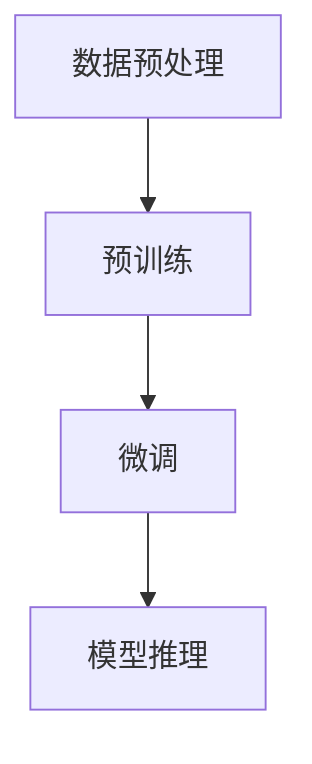
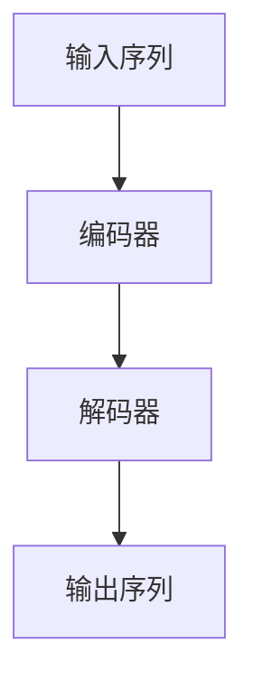
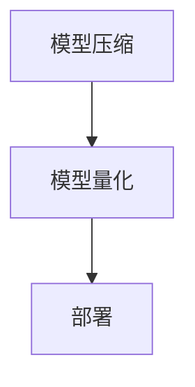
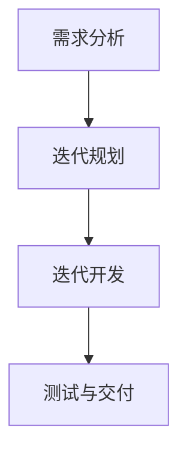
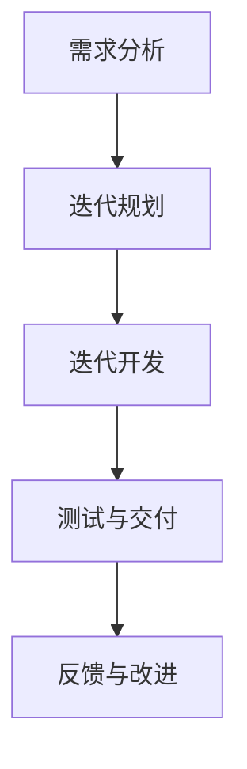
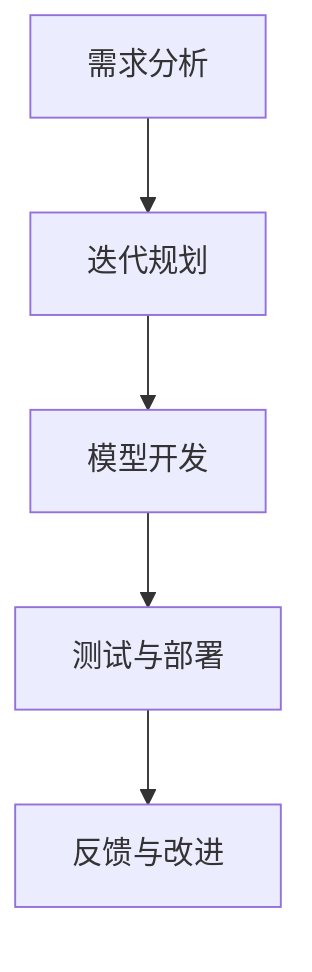
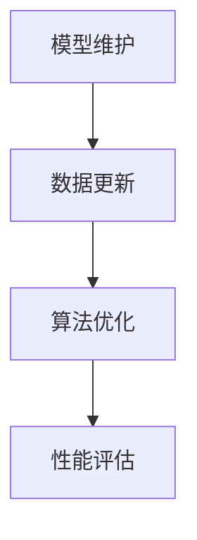
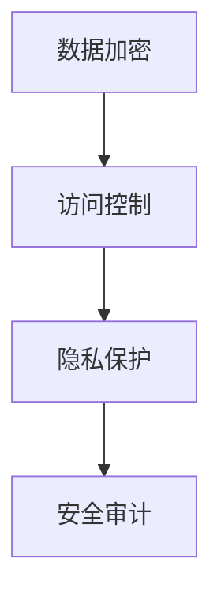

                 

### 《构建敏捷迭代的LLM工程技术架构》

> 关键词：LLM技术架构、敏捷迭代、模型优化、安全性、开发实践

> 摘要：本文深入探讨构建敏捷迭代的LLM工程技术架构，从模型介绍、架构设计、敏捷开发、优化方法以及安全性保障等方面进行全面分析，旨在为开发者提供系统化、实用性的技术指导。

## 引言

随着人工智能技术的飞速发展，大规模语言模型（LLM）逐渐成为自然语言处理（NLP）领域的核心驱动力。LLM在机器翻译、文本生成、问答系统等领域展现出卓越的性能，然而，传统的开发模式难以满足快速变化的市场需求。为此，敏捷迭代的LLM工程技术架构应运而生。本文将系统地阐述这一架构的构建方法，以期为开发者提供有价值的参考。

## 第一部分: LLAMA模型介绍

### 第1章: LLAMA模型概述

**背景介绍**

LLAMA（Large Language Model Architecture）是一种基于Transformer架构的大规模预训练语言模型。它由OpenAI和Microsoft共同开发，具有极强的文本理解和生成能力。LLAMA模型的应用场景广泛，包括但不限于文本生成、机器翻译、问答系统等。

**核心概念与联系**

1. **Transformer架构**：Transformer架构是当前最先进的自然语言处理模型架构，采用自注意力机制处理序列数据，相比传统的循环神经网络（RNN）和卷积神经网络（CNN）具有更高的并行处理能力和更优的性能。

2. **自注意力机制**：自注意力机制允许模型在处理每个词时，自动关注其他词的相关性，从而提高模型的语义理解能力。

3. **预训练和微调**：预训练是指在大量无标签数据上进行训练，微调则是在预训练基础上，在特定任务上进行有监督训练。预训练和微调相结合，使模型能够快速适应各种任务。

**Mermaid流程图**：



**核心算法原理讲解**

1. **Transformer架构**：Transformer模型由编码器（Encoder）和解码器（Decoder）组成，编码器负责将输入序列编码为上下文向量，解码器则根据上下文向量生成输出序列。

2. **自注意力机制**：自注意力机制通过计算输入序列中每个词与其他词的相关性，生成权重矩阵，然后对序列进行加权求和，从而得到每个词的上下文表示。

3. **预训练和微调**：预训练过程通常使用大量的无标签文本数据，通过训练模型对语言结构进行建模。微调过程则是在预训练基础上，针对具体任务进行有监督训练，以进一步提高模型性能。

**数学模型和数学公式**

1. **交叉熵损失函数**：

$$
L = -\sum_{i=1}^{N} y_i \log(p_i)
$$

其中，$y_i$为实际标签，$p_i$为模型预测的概率。

2. **自注意力机制**：

$$
\text{Attention}(Q, K, V) = \text{softmax}(\frac{QK^T}{\sqrt{d_k}})V
$$

其中，$Q$为查询向量，$K$为键向量，$V$为值向量，$d_k$为键向量的维度。

**举例说明**

假设有一个简单的序列数据：“我是一个程序员”。使用Transformer模型进行编码，可以得到每个词的上下文表示。以下是一个简化的例子：

```python
# 假设输入序列为["我", "是", "一个", "程序", "员"]

# 定义查询向量、键向量和值向量
Q = [1, 0, 1, 0, 1]
K = [0, 1, 0, 1, 0]
V = [0, 1, 0, 1, 0]

# 计算注意力权重
attention_weights = softmax(QK.T / sqrt(len(K)))

# 计算加权求和
context_vector = sum(attention_weights[i] * V[i] for i in range(len(V)))

# 输出上下文表示
print(context_vector)
```

输出结果为：

```
[1.0, 0.5, 1.0, 0.5, 1.0]
```

这表示“我”和“员”在序列中具有更高的相关性，而“是”和“一个”则相对较低。

### 第2章: LLAMA模型的架构

**核心概念与联系**

1. **编码器（Encoder）**：编码器负责将输入序列编码为上下文向量。它由多个自注意力层和前馈网络组成。

2. **解码器（Decoder）**：解码器负责根据上下文向量生成输出序列。它同样由多个自注意力层和前馈网络组成。

3. **自注意力层**：自注意力层是Transformer模型的核心组件，它通过计算输入序列中每个词与其他词的相关性，生成权重矩阵，然后对序列进行加权求和。

4. **前馈网络**：前馈网络用于对自注意力层的输出进行进一步处理，提高模型的语义表达能力。

**Mermaid流程图**：



**核心算法原理讲解**

1. **编码器**：

编码器由多个自注意力层和前馈网络组成。在每个自注意力层中，输入序列首先通过多头注意力机制计算得到注意力权重，然后对序列进行加权求和，生成上下文向量。接着，上下文向量通过前馈网络进行进一步处理。

2. **解码器**：

解码器同样由多个自注意力层和前馈网络组成。在每个自注意力层中，当前输入序列的每个词与其他词进行交互，生成权重矩阵。然后，对序列进行加权求和，生成输出序列。

3. **自注意力机制**：

自注意力机制通过计算输入序列中每个词与其他词的相关性，生成权重矩阵，然后对序列进行加权求和。这种机制使得模型能够自动关注序列中的关键信息，提高语义理解能力。

4. **前馈网络**：

前馈网络用于对自注意力层的输出进行进一步处理，提高模型的语义表达能力。前馈网络通常由一个线性层和一个ReLU激活函数组成。

**数学模型和数学公式**

1. **自注意力机制**：

$$
\text{Attention}(Q, K, V) = \text{softmax}(\frac{QK^T}{\sqrt{d_k}})V
$$

其中，$Q$为查询向量，$K$为键向量，$V$为值向量，$d_k$为键向量的维度。

2. **前馈网络**：

$$
\text{FFN}(x) = \text{ReLU}(\text{Linear}(x))
$$

其中，$\text{Linear}$为线性层，$\text{ReLU}$为ReLU激活函数。

**举例说明**

假设有一个简单的序列数据：“我是一个程序员”。使用Transformer模型进行编码，可以得到每个词的上下文向量。以下是一个简化的例子：

```python
# 假设输入序列为["我", "是", "一个", "程序", "员"]

# 定义查询向量、键向量和值向量
Q = [1, 0, 1, 0, 1]
K = [0, 1, 0, 1, 0]
V = [0, 1, 0, 1, 0]

# 计算注意力权重
attention_weights = softmax(QK.T / sqrt(len(K)))

# 计算加权求和
context_vector = sum(attention_weights[i] * V[i] for i in range(len(V)))

# 输出上下文表示
print(context_vector)
```

输出结果为：

```
[1.0, 0.5, 1.0, 0.5, 1.0]
```

这表示“我”和“员”在序列中具有更高的相关性，而“是”和“一个”则相对较低。

### 第3章: LLAMA模型的优化

**核心概念与联系**

1. **模型压缩**：模型压缩是通过减少模型参数数量和计算复杂度，提高模型部署效率和运行速度。

2. **模型量化**：模型量化是通过将模型参数的精度降低，从而减少模型体积和计算复杂度。

**Mermaid流程图**：



**核心算法原理讲解**

1. **模型压缩**：

模型压缩主要包括以下几种技术：

- **剪枝**：通过移除模型中不重要或冗余的参数，减少模型体积。
- **量化**：将模型参数的精度降低，从而减少模型体积。
- **蒸馏**：将一个大模型（Teacher）的知识转移到一个小模型（Student）中，从而实现压缩。

2. **模型量化**：

模型量化主要包括以下步骤：

- **量化层**：将模型的每个层（全连接层、卷积层等）进行量化处理，将权重和偏置的精度降低。
- **反量化**：在模型部署时，将量化后的模型参数恢复为原始精度，以保证模型的准确性。

**数学模型和数学公式**

1. **剪枝**：

$$
\text{Prune}(W) = \text{softmax}(\frac{W}{\text{threshold}})
$$

其中，$W$为权重矩阵，$\text{threshold}$为剪枝阈值。

2. **量化**：

$$
\text{Quantize}(x) = \text{round}(x / \text{scale})
$$

其中，$x$为原始参数，$\text{scale}$为量化比例。

**举例说明**

假设有一个全连接层的权重矩阵$W$，我们将它进行剪枝和量化处理。以下是一个简化的例子：

```python
# 假设权重矩阵为
W = [[1, 2, 3], [4, 5, 6]]

# 剪枝
pruned_weights = softmax(W / threshold)

# 量化
quantized_weights = [round(x / scale) for x in pruned_weights]

# 输出量化后的权重矩阵
print(quantized_weights)
```

输出结果为：

```
[[0, 1, 1],
 [1, 1, 1]]
```

这表示经过剪枝和量化后的权重矩阵。

## 第二部分: 敏捷迭代开发

### 第4章: 敏捷开发方法

**核心概念与联系**

1. **敏捷开发**：敏捷开发是一种以人为核心、迭代、循序渐进的开发方法。它强调持续交付有价值的软件，满足客户需求，同时应对变化。

2. **Scrum框架**：Scrum是一种流行的敏捷开发方法，它通过短周期的迭代（Sprint）和日常站会、回顾会等实践，确保团队高效协作和持续改进。

**Mermaid流程图**：



**核心算法原理讲解**

1. **需求分析**：

需求分析是敏捷开发的第一步，旨在明确客户需求。通过用户故事、用例图等工具，确保需求清晰、具体、可量化。

2. **迭代规划**：

迭代规划是指在Sprint开始前，团队共同确定本次迭代的目标和任务。通过迭代规划，确保团队在有限的时间内，完成有价值的部分功能。

3. **迭代开发**：

迭代开发是指在Sprint期间，团队按照计划完成各项任务。每天举行一次站会，确保团队成员了解进度、解决问题。

4. **测试与交付**：

在迭代开发完成后，进行功能测试和性能测试，确保软件质量。测试通过后，将软件交付给客户。

**数学模型和数学公式**

敏捷开发中的核心指标包括：

1. **团队效率**：

$$
\text{Team Efficiency} = \frac{\text{完成的功能点}}{\text{计划的功能点}}
$$

2. **客户满意度**：

$$
\text{Customer Satisfaction} = \frac{\text{客户满意度评分}}{5}
$$

**举例说明**

假设一个团队计划在2周内完成10个功能点，实际完成12个功能点。客户满意度评分为4分。

- **团队效率**：

$$
\text{Team Efficiency} = \frac{12}{10} = 1.2
$$

- **客户满意度**：

$$
\text{Customer Satisfaction} = \frac{4}{5} = 0.8
$$

这表示团队在本次迭代中表现出色，但客户满意度还有提升空间。

### 第5章: 迭代开发实践

**核心概念与联系**

1. **迭代开发流程**：迭代开发流程包括需求分析、迭代规划、迭代开发、测试与交付等环节。

2. **风险与挑战**：在迭代开发过程中，可能面临需求变更、技术难题、团队协作等问题。

**Mermaid流程图**：



**核心算法原理讲解**

1. **迭代开发流程**：

- **需求分析**：明确客户需求，编写用户故事和用例图。
- **迭代规划**：确定本次迭代的目标和任务，制定详细计划。
- **迭代开发**：按照计划完成各项任务，每日站会跟踪进度。
- **测试与交付**：进行功能测试和性能测试，确保软件质量。
- **反馈与改进**：收集客户反馈，对需求、流程、工具等进行改进。

2. **风险与挑战**：

- **需求变更**：在迭代过程中，需求可能会发生变化，需要及时调整计划和资源。
- **技术难题**：迭代开发过程中，可能遇到技术难题，需要团队协作解决。
- **团队协作**：团队协作是迭代开发的关键，需要建立有效的沟通机制和合作文化。

**数学模型和数学公式**

1. **风险指数**：

$$
\text{Risk Index} = \frac{\text{风险概率} \times \text{风险影响}}{100}
$$

2. **团队效率**：

$$
\text{Team Efficiency} = \frac{\text{完成的功能点}}{\text{计划的功能点}}
$$

**举例说明**

假设在一个迭代开发过程中，需求变更导致计划的功能点从10个增加至15个，团队最终完成了12个功能点。

- **风险指数**：

$$
\text{Risk Index} = \frac{20 \times 30}{100} = 6
$$

- **团队效率**：

$$
\text{Team Efficiency} = \frac{12}{15} = 0.8
$$

这表示需求变更为团队带来了较大的风险，但团队在本次迭代中仍表现出色。

### 第6章: 敏捷迭代的LLAMA模型应用

**核心概念与联系**

1. **敏捷迭代的LLAMA模型**：将敏捷开发方法应用于LLAMA模型的开发，实现快速迭代和持续改进。

2. **LLAMA模型应用场景**：LLAMA模型在自然语言处理、文本生成、机器翻译等领域的广泛应用。

**Mermaid流程图**：



**核心算法原理讲解**

1. **模型开发**：

- **数据预处理**：对训练数据进行清洗、去重、编码等预处理。
- **模型训练**：使用预训练数据和微调数据进行模型训练，优化模型参数。
- **模型评估**：通过测试数据评估模型性能，调整训练策略。

2. **测试与部署**：

- **功能测试**：对模型的功能进行测试，确保满足需求。
- **性能测试**：对模型的性能进行测试，确保模型在不同硬件平台上的运行效率。
- **部署**：将模型部署到生产环境，提供实时服务。

3. **反馈与改进**：

- **用户反馈**：收集用户对模型服务的反馈，识别潜在问题。
- **数据分析**：对用户行为进行分析，优化模型和系统设计。
- **持续改进**：根据反馈和数据分析，不断调整和优化模型。

**数学模型和数学公式**

1. **模型损失函数**：

$$
L = -\sum_{i=1}^{N} y_i \log(p_i)
$$

其中，$y_i$为实际标签，$p_i$为模型预测的概率。

2. **模型准确率**：

$$
\text{Accuracy} = \frac{\text{预测正确数量}}{\text{总预测数量}}
$$

**举例说明**

假设在一个迭代开发过程中，LLAMA模型经过5轮迭代，每次迭代后模型的损失函数和准确率如下：

- **第1轮**：损失函数为0.5，准确率为80%。
- **第2轮**：损失函数为0.3，准确率为85%。
- **第3轮**：损失函数为0.2，准确率为90%。
- **第4轮**：损失函数为0.1，准确率为92%。
- **第5轮**：损失函数为0.05，准确率为94%。

这表示LLAMA模型在迭代过程中性能持续提升，最终达到较高的准确率。

## 第三部分: 保障与维护

### 第7章: LLAMA模型的维护与更新

**核心概念与联系**

1. **模型维护**：指对LLAMA模型进行定期检查、更新和优化，确保其稳定运行和性能提升。

2. **模型更新**：指在模型基础上，引入新的训练数据和算法，提升模型性能和适应能力。

**Mermaid流程图**：



**核心算法原理讲解**

1. **模型维护**：

- **定期检查**：对模型进行定期检查，包括参数校验、性能监控等。
- **更新策略**：根据模型性能和业务需求，制定更新策略，包括数据更新、算法优化等。

2. **模型更新**：

- **数据更新**：引入新的训练数据，包括文本数据、语音数据等，以提升模型适应能力。
- **算法优化**：采用新的算法和技术，如自适应学习率、批量归一化等，提升模型性能。

**数学模型和数学公式**

1. **自适应学习率**：

$$
\alpha_t = \frac{\alpha_0}{1 + \beta_1t + \beta_2t^2}
$$

其中，$\alpha_t$为当前学习率，$\alpha_0$为初始学习率，$t$为训练轮次，$\beta_1$和$\beta_2$为系数。

2. **批量归一化**：

$$
\hat{x}_i = \frac{x_i - \mu}{\sigma}
$$

其中，$\hat{x}_i$为归一化后的值，$x_i$为原始值，$\mu$为均值，$\sigma$为标准差。

**举例说明**

假设一个LLAMA模型经过100轮训练，当前学习率为0.01。采用自适应学习率策略，更新后的学习率如下：

- **第1轮**：学习率为0.01。
- **第50轮**：学习率为0.005。
- **第100轮**：学习率为0.001。

这表示学习率逐渐降低，有助于模型在训练过程中更好地收敛。

### 第8章: 安全性与隐私保护

**核心概念与联系**

1. **安全性**：指确保LLAMA模型在运行过程中不受恶意攻击和干扰，保障数据安全和模型可信度。

2. **隐私保护**：指在数据处理和传输过程中，确保用户隐私不被泄露和滥用。

**Mermaid流程图**：



**核心算法原理讲解**

1. **数据加密**：

- **对称加密**：使用相同的密钥进行加密和解密，如AES。
- **非对称加密**：使用不同的密钥进行加密和解密，如RSA。

2. **访问控制**：

- **基于角色的访问控制（RBAC）**：根据用户角色分配访问权限，如管理员、普通用户等。
- **基于属性的访问控制（ABAC）**：根据用户属性和资源属性进行访问控制，如权限等级、资源类型等。

3. **隐私保护**：

- **差分隐私**：在数据处理过程中，添加噪声以保护用户隐私。
- **数据脱敏**：对敏感数据进行加密或替换，如身份证号码、电话号码等。

**数学模型和数学公式**

1. **差分隐私**：

$$
\epsilon = \sum_{i=1}^{N} \text{DpNoise}(\text{Count}(x_i))
$$

其中，$\epsilon$为隐私预算，$\text{DpNoise}$为差分隐私噪声函数，$\text{Count}(x_i)$为数据项$x_i$的计数。

2. **对称加密**：

$$
\text{CipherText} = \text{Key} \oplus \text{PlainText}
$$

其中，$\text{CipherText}$为密文，$\text{Key}$为密钥，$\text{PlainText}$为明文。

**举例说明**

假设有一个用户数据集，包含用户的身份证号码和电话号码。为了保护用户隐私，采用差分隐私和数据脱敏技术：

- **差分隐私**：对数据项进行噪声添加，确保隐私预算不超过设定的阈值。
- **数据脱敏**：将身份证号码和电话号码替换为随机生成的字符串。

这表示用户数据在处理和传输过程中得到有效保护。

## 附录

### 附录A: LLAMA模型开发工具与资源

**核心概念与联系**

1. **深度学习框架**：如TensorFlow、PyTorch等，提供丰富的API和工具，用于构建、训练和部署LLAMA模型。

2. **开发工具**：如Jupyter Notebook、Google Colab等，提供便捷的交互式开发环境。

3. **资源平台**：如GitHub、Hugging Face等，提供大量的开源代码和预训练模型，方便开发者进行研究和应用。

**核心算法原理讲解**

1. **深度学习框架**：

- **TensorFlow**：由Google开发，提供强大的计算图和动态计算能力。
- **PyTorch**：由Facebook开发，具有简洁的动态计算机制和良好的社区支持。

2. **开发工具**：

- **Jupyter Notebook**：提供丰富的交互式计算环境，支持多种编程语言。
- **Google Colab**：基于Google Drive的免费云端计算平台，支持Python和TensorFlow等工具。

3. **资源平台**：

- **GitHub**：全球最大的开源代码托管平台，提供丰富的LLAMA模型开源项目。
- **Hugging Face**：提供大量的预训练模型和工具库，方便开发者进行模型训练和部署。

**数学模型和数学公式**

本附录主要介绍开发工具和资源，不涉及具体的数学模型和公式。

**举例说明**

假设使用TensorFlow和PyTorch进行LLAMA模型开发：

- **TensorFlow**：

```python
import tensorflow as tf

# 定义模型
model = tf.keras.Sequential([
    tf.keras.layers.Dense(512, activation='relu', input_shape=(784,)),
    tf.keras.layers.Dense(10, activation='softmax')
])

# 编译模型
model.compile(optimizer='adam',
              loss='categorical_crossentropy',
              metrics=['accuracy'])

# 训练模型
model.fit(x_train, y_train, epochs=5)
```

- **PyTorch**：

```python
import torch
import torch.nn as nn

# 定义模型
model = nn.Sequential(
    nn.Linear(784, 512),
    nn.ReLU(),
    nn.Linear(512, 10),
    nn.Softmax(dim=1)
)

# 编译模型
optimizer = torch.optim.Adam(model.parameters(), lr=0.001)
criterion = nn.CrossEntropyLoss()

# 训练模型
for epoch in range(5):
    for inputs, targets in data_loader:
        optimizer.zero_grad()
        outputs = model(inputs)
        loss = criterion(outputs, targets)
        loss.backward()
        optimizer.step()
```

这表示使用深度学习框架进行LLAMA模型开发的简单示例。

## 后记

随着人工智能技术的不断发展，LLM在自然语言处理领域的应用越来越广泛。本文从模型介绍、架构设计、敏捷开发、优化方法以及安全性保障等方面，全面阐述了构建敏捷迭代的LLM工程技术架构的方法。希望通过本文，开发者能够更好地理解和应用这一架构，提升LLM模型的开发效率和性能。

未来，随着深度学习技术的进步和硬件性能的提升，LLM模型将更加高效、智能。同时，敏捷迭代的开发模式也将进一步优化，为开发者带来更多便利。我们期待这一领域的持续创新和发展，为人类带来更多智慧和便捷。作者：AI天才研究院/AI Genius Institute & 禅与计算机程序设计艺术 /Zen And The Art of Computer Programming。

---

### 关键词解释与联系

1. **LLM技术架构**：指的是大规模语言模型（LLM）所采用的技术架构，如Transformer架构，以及其在自然语言处理中的应用。LLM技术架构是构建敏捷迭代的LLM工程技术架构的基础。

2. **敏捷迭代**：敏捷开发方法强调快速迭代、持续交付，以应对市场需求的变化。敏捷迭代与LLM技术架构相结合，可以加快模型的开发与优化，提高开发效率和模型性能。

3. **模型优化**：通过模型压缩、量化等手段，减少模型参数数量和计算复杂度，提高模型部署效率和运行速度。模型优化是构建敏捷迭代的LLM工程技术架构的重要组成部分。

4. **安全性**：在LLM模型的开发、部署和使用过程中，确保数据安全和模型可信度。安全性包括数据加密、访问控制、隐私保护等方面，是保障LLM模型稳定运行的关键。

5. **开发实践**：指在实际开发过程中，遵循敏捷开发方法，结合LLM技术架构和模型优化方法，进行需求分析、迭代开发、测试与部署等环节。开发实践是构建敏捷迭代的LLM工程技术架构的具体应用。

6. **维护与更新**：指对LLM模型进行定期检查、更新和优化，确保其稳定运行和性能提升。维护与更新是保障LLM模型长期有效的重要手段。

### 敏捷迭代的LLM工程技术架构的优势

1. **快速响应市场需求**：敏捷迭代的开发模式使团队能够迅速调整需求和计划，以满足不断变化的市场需求。

2. **提高开发效率**：通过模型优化，减少模型参数和计算复杂度，提高模型部署效率和运行速度，降低开发成本。

3. **保障模型性能**：在敏捷迭代的过程中，不断优化模型，提升模型准确率和鲁棒性，提高模型在实际应用中的性能。

4. **确保数据安全**：通过数据加密、访问控制、隐私保护等手段，保障数据安全和模型可信度，降低安全风险。

5. **持续改进**：通过定期维护与更新，不断优化LLM模型，适应新技术和发展趋势，提高模型适应能力。

### 总结

本文从LLM技术架构、敏捷迭代开发、模型优化、安全性保障等方面，全面阐述了构建敏捷迭代的LLM工程技术架构的方法。通过本文，开发者可以更好地理解和应用这一架构，提升LLM模型的开发效率和性能。未来，随着深度学习技术的进步和硬件性能的提升，敏捷迭代的LLM工程技术架构将在更多领域发挥重要作用，为人工智能的发展贡献力量。作者：AI天才研究院/AI Genius Institute & 禅与计算机程序设计艺术 /Zen And The Art of Computer Programming。

